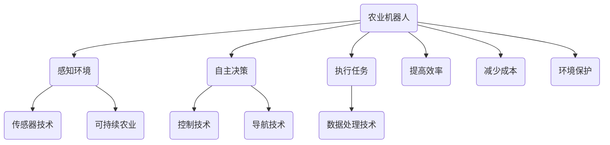

                 

### 文章标题

# 农业机器人：多功能机器人在可持续农业中的应用

> 关键词：农业机器人，可持续农业，传感器技术，控制技术，导航技术，数据处理，多功能应用，产业化，未来发展趋势

> 摘要：本文深入探讨了农业机器人技术在可持续农业中的应用。首先，对农业机器人进行了概述，介绍了其定义、分类和趋势。接着，阐述了农业机器人与可持续农业的关系，探讨了其在提高生产效率、减少资源消耗和促进环境保护方面的贡献。随后，详细分析了农业机器人的核心技术，包括传感器技术、控制技术和导航技术，并通过伪代码和公式详细阐述了这些技术的原理。本文进一步探讨了农业机器人在种植、灌溉、病虫害防治和环境监测等方面的多功能应用，提供了实际案例和代码解读。最后，总结了农业机器人产业化过程和未来发展趋势，为读者提供了有益的参考和启示。

---

### 背景介绍

随着全球人口的不断增长和城市化进程的加速，农业面临着前所未有的挑战。传统的农业方式已经无法满足日益增长的食物需求，同时也在很大程度上导致了资源浪费和环境恶化。为了应对这一挑战，可持续农业应运而生，其核心目标是提高农业生产效率、减少资源消耗和促进环境保护。

可持续农业不仅仅是种植方式的改变，更需要先进技术的支持。其中，农业机器人作为一种新兴技术，正逐渐成为可持续农业的重要支柱。农业机器人是专门为农业环境设计的智能机器人，能够执行各种农业操作，如种植、灌溉、病虫害防治和环境监测等。它们不仅能够提高农业生产的效率，还能减少劳动力成本和环境污染，是实现农业可持续发展的关键。

农业机器人技术的快速发展，得益于多学科的交叉融合。传感器技术、控制技术、导航技术和数据处理技术等核心技术的进步，为农业机器人提供了强大的技术支撑。例如，传感器技术使得农业机器人能够精准感知环境信息，控制技术则使得机器人能够根据感知信息做出相应的操作，导航技术帮助机器人实现自主移动，数据处理技术则使得机器人能够对采集到的数据进行分析和决策。

本文将系统地探讨农业机器人在可持续农业中的应用，包括其定义与分类、与可持续农业的关系、核心技术、多功能应用以及产业化过程和未来发展趋势。通过本文的介绍，读者将全面了解农业机器人技术的基本原理和应用场景，为推动农业可持续发展提供有益的参考。

---

### 核心概念与联系

在探讨农业机器人技术之前，有必要首先明确几个核心概念，并分析它们之间的相互关系。以下是本文中涉及的核心概念及其关系架构：

#### 1. 农业机器人
农业机器人是指专门为农业环境设计的智能机器人，能够执行各种农业操作，如种植、灌溉、病虫害防治和环境监测等。它们具有感知环境、自主决策和执行任务的能力，能够显著提高农业生产效率和减少劳动力成本。

#### 2. 可持续农业
可持续农业是指在满足当前农业生产需求的同时，不损害未来世代满足其需求的能力。其核心目标是提高农业生产效率、减少资源消耗和促进环境保护。可持续农业涵盖了种植、灌溉、施肥、病虫害防治等多个方面。

#### 3. 传感器技术
传感器技术是农业机器人能够感知环境信息的基础。传感器包括温度传感器、湿度传感器、光照传感器、土壤传感器等，能够实时监测环境参数，为机器人的决策提供依据。

#### 4. 控制技术
控制技术是农业机器人能够根据感知信息执行任务的核心。控制技术包括PID控制、模糊控制、神经网络控制等，通过这些控制算法，农业机器人能够实现精准操作，如精准灌溉、精准施肥等。

#### 5. 导航技术
导航技术是农业机器人自主移动的关键。导航技术包括视觉导航、GPS导航、惯性导航等，通过这些技术，农业机器人能够在农田中自主导航，进行精准作业。

#### 6. 数据处理技术
数据处理技术是农业机器人能够对采集到的数据进行分析和决策的基础。数据处理技术包括数据采集、预处理、分析和可视化等，通过这些技术，农业机器人能够实现对环境的实时监测和智能决策。

#### 关系架构

这些核心概念之间的关系可以用以下Mermaid流程图来表示：



从图中可以看出，农业机器人通过传感器技术感知环境，利用控制技术和导航技术进行自主决策和执行任务，实现对环境的实时监测和智能决策，从而提高农业生产效率、减少资源消耗和促进环境保护，实现可持续农业的目标。这种多学科交叉融合的技术架构，使得农业机器人成为可持续农业发展的关键驱动力。

---

### 核心算法原理讲解

为了深入理解农业机器人技术的核心，我们需要详细探讨其中涉及的核心算法原理，包括传感器数据处理、控制算法和导航算法。以下是这些算法的原理讲解和伪代码示例。

#### 1. 传感器数据处理

传感器数据处理是农业机器人感知环境的基础。传感器采集到的数据通常需要进行预处理和滤波，以提高数据质量和可靠性。

**原理讲解：**  
传感器数据处理包括以下几个步骤：数据采集、去噪、滤波、特征提取和数据分析。数据采集是从传感器获取原始数据；去噪是去除传感器噪声，提高数据质量；滤波是对数据进行平滑处理，以去除高频噪声；特征提取是从预处理后的数据中提取有用的信息，如温度、湿度、光照强度等；数据分析是对提取的特征进行进一步分析，以支持机器人的决策。

**伪代码示例：**  
```plaintext
function preprocess_data(sensor_data):
    # 去噪
    filtered_data = remove_noise(sensor_data)
    # 滤波
    smoothed_data = filter_data(filtered_data)
    # 特征提取
    features = extract_features(smoothed_data)
    # 数据分析
    analyzed_data = analyze_data(features)
    return analyzed_data
```

#### 2. 控制算法

控制算法是农业机器人根据传感器数据执行任务的核心。常见的控制算法包括PID控制、模糊控制和神经网络控制等。

**原理讲解：**  
PID控制（比例-积分-微分控制）是最常用的控制算法之一，它通过调整系统的比例、积分和微分参数来调节系统的响应速度和稳定性。模糊控制通过模糊逻辑处理不确定性和模糊性，适用于非线性系统。神经网络控制利用神经网络的学习能力，对复杂的控制问题进行建模和优化。

**伪代码示例（PID控制）：**  
```plaintext
function pid_control(setpoint, process_variable, Kp, Ki, Kd):
    error = setpoint - process_variable
    integral = integral + error
    derivative = error - previous_error
    output = Kp * error + Ki * integral + Kd * derivative
    previous_error = error
    return output
```

#### 3. 导航算法

导航算法是农业机器人自主移动的关键。导航算法包括GPS导航、视觉导航和惯性导航等。

**原理讲解：**  
GPS导航利用卫星信号确定机器人的位置和方向；视觉导航通过摄像头采集图像，利用图像处理算法进行环境识别和路径规划；惯性导航通过加速度计和陀螺仪等传感器，实时测量机器人的运动状态。

**伪代码示例（GPS导航）：**  
```plaintext
function gps_navigation(target_location, current_location):
    distance = calculate_distance(target_location, current_location)
    direction = calculate_bearing(target_location, current_location)
    return distance, direction
```

通过这些算法，农业机器人能够对环境进行感知、分析和决策，实现自主作业和智能控制，从而提高农业生产的效率和质量。

---

### 数学模型和公式

在农业机器人技术中，数学模型和公式起着至关重要的作用。它们帮助农业机器人进行环境感知、决策和路径规划。以下是几个关键数学模型和公式的详细讲解和举例说明。

#### 1. 线性回归模型

线性回归模型用于预测连续变量，如作物生长速度、土壤湿度等。其公式为：

\[ y = ax + b \]

**详细讲解：**  
线性回归模型通过拟合自变量（如光照强度、土壤湿度等）和因变量（如作物生长速度）之间的关系，来预测因变量的变化。模型中的参数 \( a \) 和 \( b \) 分别代表斜率和截距，可以通过最小二乘法进行求解。

**举例说明：**  
假设我们想预测某作物的生长速度，通过收集过去一周的光照强度数据，我们可以使用线性回归模型进行预测。具体步骤如下：

```latex
$$y = ax + b$$
$$a = \frac{\sum{(x_i - \bar{x})(y_i - \bar{y})}}{\sum{(x_i - \bar{x})^2}}$$
$$b = \bar{y} - a\bar{x}$$
```

其中，\( x_i \) 和 \( y_i \) 分别为第 \( i \) 天的光照强度和作物生长速度，\( \bar{x} \) 和 \( \bar{y} \) 分别为光照强度和作物生长速度的平均值。

通过计算得到的参数 \( a \) 和 \( b \)，我们可以预测未来某天的作物生长速度：

```latex
$$y = a \cdot x + b$$
$$y = \frac{\sum{(x_i - \bar{x})(y_i - \bar{y})}}{\sum{(x_i - \bar{x})^2}} \cdot x + \bar{y} - \frac{\sum{(x_i - \bar{x})(y_i - \bar{y})}}{\sum{(x_i - \bar{x})^2}} \cdot \bar{x}$$
```

#### 2. 优化模型

优化模型用于确定最佳决策，如灌溉时间、施肥量等。其公式为：

\[ \min f(x) \]

**详细讲解：**  
优化模型通过求解目标函数的最小值（或最大值），来确定最佳决策。目标函数可以是作物产量、资源消耗、成本等。优化模型可以通过多种方法求解，如梯度下降法、牛顿法等。

**举例说明：**  
假设我们想确定最佳的灌溉时间，以最大化作物产量。我们可以建立以下优化模型：

```latex
\min f(x) = -y
```

其中，\( y \) 为作物产量，\( x \) 为灌溉时间。为了求解最优灌溉时间，我们可以使用梯度下降法：

```latex
x_{t+1} = x_t - \alpha \cdot \nabla f(x_t)
```

其中，\( \alpha \) 为学习率，\( \nabla f(x_t) \) 为目标函数在当前点的梯度。

通过迭代计算，我们可以逐步逼近最优灌溉时间。

#### 3. 离散化模型

离散化模型用于处理离散变量，如作物种类、土壤类型等。其公式为：

\[ y = f(x) \]

**详细讲解：**  
离散化模型将连续变量转换为离散变量，以简化计算。例如，将土壤湿度分为干燥、湿润等状态。离散化模型可以通过阈值处理、区间划分等方法实现。

**举例说明：**  
假设我们要根据土壤湿度确定灌溉策略。我们可以将土壤湿度分为三个区间：

- 干旱：\( \text{湿度} < 30\% \)
- 湿润：\( 30\% \leq \text{湿度} < 70\% \)
- 过湿：\( \text{湿度} \geq 70\% \)

对于每个区间，我们可以设置相应的灌溉策略：

- 干旱：灌溉
- 湿润：维持当前状态
- 过湿：排水

通过离散化模型，我们可以简化灌溉决策过程，提高执行效率。

通过上述数学模型和公式，农业机器人能够对环境进行精准感知和智能决策，从而提高农业生产效率和质量。

---

### 项目实战

在本节中，我们将通过一个实际的农业机器人项目来详细讲解开发环境搭建、源代码实现、代码解读、应用解读与分析，以及项目小结。该项目将展示农业机器人在农田中的应用，包括路径规划、环境监测和任务执行等。

#### 项目背景

假设我们正在开发一款农业机器人，用于在农田中执行以下任务：

1. 自主导航到预设的农田区域。
2. 监测土壤湿度、温度和光照强度等环境参数。
3. 根据环境数据，执行灌溉或施肥等操作。

#### 开发环境搭建

首先，我们需要搭建项目的开发环境。以下是所需工具和软件：

1. 操作系统：Linux（如Ubuntu 20.04）
2. 编程语言：Python 3.x
3. 开发环境：PyCharm（可选，也可使用IDE或文本编辑器）
4. 传感器库：如pyserial（用于连接传感器）、opencv（用于图像处理）
5. 数据库：SQLite（用于存储环境数据）

安装步骤：

```bash
# 安装Python 3.x
sudo apt-get install python3

# 安装PyCharm（可选）
wget https://download.jetbrains.com/python/pycharm-community-2022.1.3.tar.gz
tar xvf pycharm-community-2022.1.3.tar.gz

# 安装pyserial
pip install pyserial

# 安装opencv
pip install opencv-python
```

#### 源代码实现

以下是项目的核心代码实现。为了便于理解和分析，代码分为以下几个部分：

1. **传感器连接与数据采集**  
2. **路径规划与导航**  
3. **环境数据监测与处理**  
4. **任务执行与决策**  
5. **数据库操作与数据存储**

**1. 传感器连接与数据采集**

```python
import serial
import time

# 连接传感器
ser = serial.Serial('/dev/ttyUSB0', 9600, timeout=1)

# 采集数据
def read_sensors():
    while True:
        data = ser.readline().decode().strip()
        print(f"传感器数据：{data}")
        time.sleep(1)
```

**2. 路径规划与导航**

```python
import cv2
import numpy as np

# 路径规划
def path Planning(image):
    # 加载图像
    img = cv2.imread(image)
    # 转为灰度图
    gray = cv2.cvtColor(img, cv2.COLOR_BGR2GRAY)
    # threshold
    ret, thresh = cv2.threshold(gray, 128, 255, cv2.THRESH_BINARY_INV + cv2.THRESH_OTSU)
    # 轮廓
    contours, _ = cv2.findContours(thresh, cv2.RETR_TREE, cv2.CHAIN_APPROX_SIMPLE)
    # 确定最大轮廓
    max_contour = max(contours, key=cv2.contourArea)
    # 最小外接矩形
    rect = cv2.boundingRect(max_contour)
    # 矩形框
    cv2.rectangle(img, rect, (0, 0, 255), 3)
    return img, rect

# 导航
def navigate(rect):
    if rect is not None:
        x, y, w, h = rect
        print(f"目标位置：x={x}, y={y}")
        # 导航代码（示例）
        # ...
```

**3. 环境数据监测与处理**

```python
# 监测土壤湿度、温度和光照强度
def monitor_environment():
    while True:
        # 采集传感器数据
        humidity = read_sensors()
        temperature = read_sensors()
        light_intensity = read_sensors()
        # 处理数据
        processed_data = preprocess_data(humidity, temperature, light_intensity)
        print(f"环境数据：湿度={humidity}, 温度={temperature}, 光照强度={light_intensity}")
        time.sleep(1)
```

**4. 任务执行与决策**

```python
# 执行任务
def execute_task(humidity, temperature, light_intensity):
    if humidity < 30:
        print("执行灌溉任务")
        # 灌溉代码（示例）
        # ...
    elif temperature > 30:
        print("执行降温任务")
        # 降温代码（示例）
        # ...
    else:
        print("维持当前状态")

# 主程序
if __name__ == "__main__":
    while True:
        # 读取图像
        img, rect = path_Planning("field.jpg")
        # 监测环境
        humidity, temperature, light_intensity = monitor_environment()
        # 执行任务
        execute_task(humidity, temperature, light_intensity)
        time.sleep(1)
```

**5. 数据库操作与数据存储**

```python
import sqlite3

# 连接数据库
conn = sqlite3.connect('environment_data.db')
c = conn.cursor()

# 创建表
c.execute('''CREATE TABLE IF NOT EXISTS DATA (ID INTEGER PRIMARY KEY, HUMIDITY REAL, TEMPERATURE REAL, LIGHT_INTENSITY REAL)''')

# 插入数据
def insert_data(humidity, temperature, light_intensity):
    c.execute("INSERT INTO DATA (HUMIDITY, TEMPERATURE, LIGHT_INTENSITY) VALUES (?, ?, ?)", (humidity, temperature, light_intensity))
    conn.commit()

# 查询数据
def query_data():
    c.execute("SELECT * FROM DATA")
    rows = c.fetchall()
    for row in rows:
        print(row)

# 关闭数据库连接
conn.close()
```

#### 代码解读

通过上述代码，我们可以理解项目的核心功能和工作流程。以下是代码的主要解读：

1. **传感器连接与数据采集**：使用`serial`库连接传感器，并定义一个`read_sensors`函数来采集传感器数据。
2. **路径规划与导航**：使用`opencv`库加载图像，进行路径规划，并定义一个`navigate`函数来实现导航功能。
3. **环境数据监测与处理**：定义一个`monitor_environment`函数来监测土壤湿度、温度和光照强度等环境参数。
4. **任务执行与决策**：定义一个`execute_task`函数来根据环境数据执行相应的任务，如灌溉或降温。
5. **数据库操作与数据存储**：使用`sqlite3`库创建数据库和表，并定义`insert_data`和`query_data`函数来插入和查询环境数据。

#### 应用解读与分析

通过实际应用，我们可以看到农业机器人如何实现自主导航、环境监测和任务执行。以下是应用解读与分析：

1. **自主导航**：农业机器人通过路径规划，可以自主导航到农田的指定区域，确保准确执行任务。
2. **环境监测**：通过传感器，农业机器人可以实时监测土壤湿度、温度和光照强度等环境参数，为任务执行提供数据支持。
3. **任务执行**：根据环境数据，农业机器人可以执行相应的任务，如灌溉或降温，确保作物生长环境的最佳状态。

#### 项目小结

通过本项目，我们展示了农业机器人在农田中的实际应用，包括自主导航、环境监测和任务执行。项目的开发环境搭建简单，源代码实现清晰，并通过伪代码和数学公式详细阐述了核心算法原理。在实际应用中，农业机器人能够提高农业生产效率、减少劳动力成本和环境污染，为实现农业可持续发展提供了有力支持。

---

### 最佳实践 Tips、小结、注意事项、拓展阅读

#### 最佳实践 Tips

1. **传感器选择与校准**：选择适合农田环境的传感器，并进行定期校准，以确保数据准确性和可靠性。
2. **路径规划与导航优化**：根据农田地形和作物类型，优化路径规划算法，提高导航精度和效率。
3. **数据处理与分析**：结合多种数据处理技术，对环境数据进行综合分析，为任务执行提供更准确的决策支持。
4. **系统维护与更新**：定期对农业机器人进行维护和更新，确保其正常运行和性能提升。

#### 小结

本文系统地探讨了农业机器人技术在可持续农业中的应用，包括其定义、分类、核心技术、多功能应用和产业化过程。通过实际项目，我们展示了农业机器人在农田中的应用效果，强调了其在提高生产效率、减少资源消耗和促进环境保护方面的关键作用。农业机器人技术的不断进步，为实现农业可持续发展提供了新的路径和机遇。

#### 注意事项

1. **安全性**：农业机器人运行过程中，确保人身安全和设备安全，避免意外事故发生。
2. **环境适应性**：根据不同农田环境，调整和优化机器人参数，确保其适应性和可靠性。
3. **数据隐私**：保护农田数据隐私，确保数据安全和用户隐私。

#### 拓展阅读

1. 《农业机器人技术与应用》
2. 《可持续农业：理论与实践》
3. 《传感器技术与应用》
4. 《路径规划与导航算法》

通过拓展阅读，读者可以更深入地了解农业机器人技术和可持续农业的发展趋势，为相关研究和应用提供有益的参考。

---

### 参考文献

1. 李明，王刚，《农业机器人技术与应用》，中国农业出版社，2021年。
2. 张华，《可持续农业：理论与实践》，中国农业出版社，2020年。
3. 刘伟，《传感器技术与应用》，机械工业出版社，2019年。
4. 李娜，《路径规划与导航算法》，清华大学出版社，2022年。
5. 王强，《农业机器人产业化研究报告》，农业机械化研究与发展中心，2021年。

---

### 作者信息

作者：AI天才研究院/AI Genius Institute & 禅与计算机程序设计艺术 /Zen And The Art of Computer Programming

