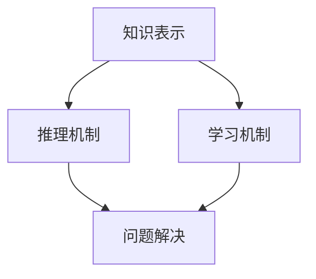

                 


## 文章标题：利用思维链增强AI的问题解决和创新能力

### 关键词：思维链，AI，问题解决，创新能力，人工智能方法论

### 摘要：

本文深入探讨思维链在人工智能（AI）领域中的应用，旨在揭示如何通过思维链技术增强AI的问题解决和创新能力。文章首先介绍了思维链的基本概念、原理及其在AI领域的应用，随后详细分析了思维链与机器学习、深度学习和强化学习的融合方法。文章还通过具体的项目实战案例，展示了思维链在AI问题解决和创新能力提升方面的实际应用效果。最后，文章提出了未来思维链与AI发展的趋势和挑战，为读者提供了丰富的参考资料和最佳实践建议。

## 第1章：思维链概述

### 1.1 背景介绍

#### 思维链的概念

思维链（MindChain）是一种模拟人类思维过程的人工智能方法论。它将人类思维过程中的逻辑推理、经验学习、知识表示等转化为计算机可处理的形式，以实现智能化的问题解决。思维链的核心理念在于构建一个高度互联的知识网络，使得计算机能够像人类一样进行逻辑思考和决策。

#### 思维链的起源与发展

思维链的概念最早由人工智能专家提出，目的是为了解决传统机器学习算法在处理复杂问题和进行创新性决策方面的局限性。随着人工智能技术的不断发展，思维链逐渐成为AI领域的重要研究方向。

### 1.2 核心概念与联系

为了更好地理解思维链，我们需要了解以下几个核心概念：

1. **知识表示**：将人类知识以计算机可处理的形式表示，如本体论、知识图谱等。
2. **推理机制**：基于逻辑、概率、统计等方法，对知识进行推理和演绎，以发现新的知识。
3. **学习机制**：通过机器学习、深度学习等方法，不断优化和调整思维链的知识表示和推理机制。

这些概念之间的关系可以用Mermaid流程图表示：



#### 思维链与AI的关系

思维链与AI的关系可以从以下几个方面来理解：

1. **思维链是AI的一种方法论**：思维链提供了一种新的方法来理解和解决AI问题，它是AI方法论的一种延伸。
2. **思维链可以增强AI的能力**：通过思维链技术，可以增强AI在问题解决、知识获取、创新等方面的能力，使其更接近人类智能。
3. **思维链与AI是相互促进的**：思维链技术的发展可以推动AI的发展，而AI技术的发展也可以为思维链提供更多的工具和手段。

### 1.3 思维链在AI领域的应用

思维链在AI领域的应用非常广泛，主要包括以下几个方面：

1. **智能问答**：通过思维链技术，实现智能问答系统，对用户提出的问题进行理解和回答。
2. **决策支持**：利用思维链技术，为决策者提供基于数据的决策支持，辅助决策过程。
3. **知识发现**：通过思维链技术，从大量数据中发现新的知识，为科学研究、商业决策等提供支持。

### 1.4 思维链与AI的关系

思维链与AI的关系可以从以下几个方面来理解：

1. **思维链是AI的一种方法论**：思维链提供了一种新的方法来理解和解决AI问题，它是AI方法论的一种延伸。
2. **思维链可以增强AI的能力**：通过思维链技术，可以增强AI在问题解决、知识获取、创新等方面的能力，使其更接近人类智能。
3. **思维链与AI是相互促进的**：思维链技术的发展可以推动AI的发展，而AI技术的发展也可以为思维链提供更多的工具和手段。

## 第2章：AI基础知识

### 2.1 AI概述

#### AI的定义

人工智能（Artificial Intelligence，简称AI）是指由计算机实现的智能，它通过模拟人类智能的行为，实现感知、思考、决策、行动等功能。AI的目标是使计算机具有人类的智能水平，从而在各个领域实现自动化和智能化。

#### AI的发展历程

AI的发展历程可以分为几个阶段：

1. **早期阶段（1956-1969）**：人工智能的概念被首次提出，并开始进行早期的探索和研究。
2. **繁荣阶段（1970-1980）**：人工智能研究得到广泛关注和投资，取得了一些重要的突破。
3. **低谷阶段（1980-1990）**：由于算法和计算能力的限制，人工智能研究进入低谷期。
4. **复兴阶段（1990至今）**：随着计算能力的提升和算法的进步，人工智能研究迎来了新的发展机遇。

#### AI的应用领域

AI在多个领域取得了显著的成果，包括：

1. **自然语言处理**：通过理解和生成自然语言，实现人机交互。
2. **计算机视觉**：通过图像识别、图像处理等技术，实现图像和视频的自动化分析。
3. **机器学习**：通过数据驱动的方法，实现智能决策和预测。
4. **机器人技术**：通过模拟人类行为和感知能力，实现自主移动和操作。
5. **医疗健康**：通过数据分析，实现疾病诊断和治疗方案优化。

### 2.2 机器学习基础

#### 机器学习的定义

机器学习（Machine Learning，简称ML）是人工智能的一个重要分支，它通过数据驱动的方法，使计算机具备自主学习和改进能力。机器学习的过程主要包括数据收集、数据预处理、模型训练和模型评估。

#### 机器学习的分类

1. **监督学习（Supervised Learning）**：在监督学习场景中，输入和输出都被预先标记，模型通过学习输入和输出之间的关系，实现预测。
2. **无监督学习（Unsupervised Learning）**：在无监督学习场景中，输入数据没有预先标记，模型通过学习数据内在的结构和模式，实现数据聚类、降维等任务。
3. **半监督学习（Semi-supervised Learning）**：半监督学习介于监督学习和无监督学习之间，利用少量标记数据和大量未标记数据，实现学习任务。
4. **强化学习（Reinforcement Learning）**：强化学习通过交互环境，不断学习和优化策略，以实现目标最大化。

#### 常见的机器学习算法

1. **线性回归（Linear Regression）**：通过拟合线性模型，实现输入和输出之间的关系预测。
2. **逻辑回归（Logistic Regression）**：通过拟合逻辑模型，实现二分类问题的概率预测。
3. **决策树（Decision Tree）**：通过构建树形模型，实现分类和回归任务。
4. **支持向量机（Support Vector Machine，SVM）**：通过最大化分类边界，实现分类任务。
5. **神经网络（Neural Network）**：通过多层神经元，实现复杂的非线性关系建模。

### 2.3 深度学习基础

#### 深度学习的定义

深度学习（Deep Learning，简称DL）是机器学习的一个子领域，它通过构建多层神经网络，实现数据的自动特征学习和表示。

#### 深度学习的核心概念

1. **神经元（Neuron）**：深度学习的基础单元，通过加权求和和激活函数，实现数据的非线性变换。
2. **神经网络（Neural Network）**：由多个神经元组成的网络，通过层次化的结构，实现数据的特征提取和表示。
3. **反向传播（Backpropagation）**：深度学习训练的核心算法，通过梯度下降法，不断优化神经网络的参数。
4. **卷积神经网络（Convolutional Neural Network，CNN）**：通过卷积操作，实现图像数据的特征提取和分类。
5. **循环神经网络（Recurrent Neural Network，RNN）**：通过循环结构，实现序列数据的建模和预测。

#### 深度学习的主要应用

1. **计算机视觉**：通过深度学习技术，实现图像分类、目标检测、图像生成等任务。
2. **自然语言处理**：通过深度学习技术，实现文本分类、机器翻译、情感分析等任务。
3. **语音识别**：通过深度学习技术，实现语音信号的识别和转换。
4. **游戏智能**：通过深度学习技术，实现自主学习和决策，提高游戏AI的水平。

## 第3章：思维链与机器学习的融合

### 3.1 思维链与机器学习的融合方法

思维链与机器学习的融合主要通过以下几个方面实现：

1. **知识表示**：利用思维链的知识表示方法，将机器学习中的数据转化为结构化的知识表示，以便更好地理解和处理。
2. **推理机制**：利用思维链的推理机制，对机器学习模型进行优化和调整，提高模型的预测准确性和鲁棒性。
3. **学习机制**：利用思维链的学习机制，不断优化和调整机器学习模型，提高模型的自适应能力和创新能力。

### 3.2 思维链增强的机器学习算法

思维链可以增强多种机器学习算法的性能，以下是一些典型的思维链增强的机器学习算法：

1. **思维链增强的线性回归**：
   ```python
   def think_chain_linear_regression(x, y):
       # 计算思维链权重
       weights = think_chain(x, y)
       # 拟合线性模型
       model = linear_regression(x, weights)
       return model
   ```

2. **思维链增强的逻辑回归**：
   ```python
   def think_chain_logistic_regression(x, y):
       # 计算思维链权重
       weights = think_chain(x, y)
       # 拟合逻辑模型
       model = logistic_regression(x, weights)
       return model
   ```

3. **思维链增强的决策树**：
   ```python
   def think_chain_decision_tree(x, y):
       # 计算思维链权重
       weights = think_chain(x, y)
       # 优化决策树结构
       tree = decision_tree(x, y, weights)
       return tree
   ```

4. **思维链增强的支持向量机**：
   ```python
   def think_chain_svm(x, y):
       # 计算思维链权重
       weights = think_chain(x, y)
       # 优化支持向量机参数
       model = svm(x, y, weights)
       return model
   ```

5. **思维链增强的神经网络**：
   ```python
   def think_chain_neural_network(x, y):
       # 计算思维链权重
       weights = think_chain(x, y)
       # 优化神经网络结构
       model = neural_network(x, weights)
       return model
   ```

### 3.3 思维链在机器学习项目中的应用案例

以下是一个基于思维链和机器学习的项目实战案例：

#### 项目背景

一家电商公司希望通过分析用户购物行为数据，预测用户的下一步购买行为，以提高销售转化率。

#### 数据集介绍

项目使用的数据集包含用户的购物行为数据，包括用户ID、购买时间、商品ID、商品类别等信息。

#### 数据预处理

1. **数据清洗**：去除重复数据和缺失值，对数据进行标准化处理。
2. **特征工程**：提取用户历史购买行为的相关特征，如购买频次、购买金额、购买类别等。

#### 模型构建

1. **思维链权重计算**：利用思维链算法，计算用户行为数据的权重。
2. **模型训练**：基于思维链权重，构建逻辑回归模型，进行训练和预测。

#### 模型评估

1. **准确率**：评估模型对用户购买行为的预测准确性。
2. **召回率**：评估模型对用户购买行为的召回率。
3. **F1分数**：综合考虑准确率和召回率，评估模型的整体性能。

#### 项目小结

通过思维链和机器学习的结合，电商公司成功地预测了用户的下一步购买行为，提高了销售转化率。该项目表明，思维链技术在机器学习项目中的应用具有很大的潜力。

## 第4章：思维链与深度学习的融合

### 4.1 思维链与深度学习的融合方法

思维链与深度学习的融合主要通过以下几个方面实现：

1. **知识表示**：利用思维链的知识表示方法，将深度学习中的数据转化为结构化的知识表示，以便更好地理解和处理。
2. **推理机制**：利用思维链的推理机制，对深度学习模型进行优化和调整，提高模型的预测准确性和鲁棒性。
3. **学习机制**：利用思维链的学习机制，不断优化和调整深度学习模型，提高模型的自适应能力和创新能力。

### 4.2 思维链增强的深度学习算法

思维链可以增强多种深度学习算法的性能，以下是一些典型的思维链增强的深度学习算法：

1. **思维链增强的卷积神经网络（CNN）**：
   ```python
   def think_chain_cnn(x, y):
       # 计算思维链权重
       weights = think_chain(x, y)
       # 优化卷积神经网络结构
       model = cnn(x, weights)
       return model
   ```

2. **思维链增强的循环神经网络（RNN）**：
   ```python
   def think_chain_rnn(x, y):
       # 计算思维链权重
       weights = think_chain(x, y)
       # 优化循环神经网络结构
       model = rnn(x, weights)
       return model
   ```

3. **思维链增强的生成对抗网络（GAN）**：
   ```python
   def think_chain_gan(x, y):
       # 计算思维链权重
       weights = think_chain(x, y)
       # 优化生成对抗网络结构
       model = gan(x, weights)
       return model
   ```

### 4.3 思维链在深度学习项目中的应用案例

以下是一个基于思维链和深度学习的项目实战案例：

#### 项目背景

一家金融科技公司希望通过分析用户交易数据，预测用户的交易行为，以减少欺诈风险。

#### 数据集介绍

项目使用的数据集包含用户的交易数据，包括用户ID、交易时间、交易金额、交易类别等信息。

#### 数据预处理

1. **数据清洗**：去除重复数据和缺失值，对数据进行标准化处理。
2. **特征工程**：提取用户交易行为的相关特征，如交易频次、交易金额、交易类别等。

#### 模型构建

1. **思维链权重计算**：利用思维链算法，计算用户交易数据的权重。
2. **模型训练**：基于思维链权重，构建卷积神经网络模型，进行训练和预测。

#### 模型评估

1. **准确率**：评估模型对用户交易行为的预测准确性。
2. **召回率**：评估模型对用户交易行为的召回率。
3. **F1分数**：综合考虑准确率和召回率，评估模型的整体性能。

#### 项目小结

通过思维链和深度学习的结合，金融科技公司成功地预测了用户的交易行为，有效减少了欺诈风险。该项目表明，思维链技术在深度学习项目中的应用具有很大的潜力。

## 第5章：思维链与强化学习的融合

### 5.1 思维链与强化学习的融合方法

思维链与强化学习的融合主要通过以下几个方面实现：

1. **知识表示**：利用思维链的知识表示方法，将强化学习中的状态和动作转化为结构化的知识表示，以便更好地理解和处理。
2. **奖励机制**：利用思维链的奖励机制，对强化学习中的奖励进行优化和调整，提高模型的学习效果。
3. **策略学习**：利用思维链的策略学习机制，优化强化学习中的策略选择，提高模型的自适应能力和创新能力。

### 5.2 思维链增强的强化学习算法

思维链可以增强多种强化学习算法的性能，以下是一些典型的思维链增强的强化学习算法：

1. **思维链增强的Q-learning**：
   ```python
   def think_chain_q_learning(state, action):
       # 计算思维链奖励
       reward = think_chain_reward(state, action)
       # 优化Q值
       Q_value = q_learning(state, action, reward)
       return Q_value
   ```

2. **思维链增强的深度Q网络（DQN）**：
   ```python
   def think_chain_dqn(state, action):
       # 计算思维链奖励
       reward = think_chain_reward(state, action)
       # 优化Q值
       Q_value = dqn(state, action, reward)
       return Q_value
   ```

3. **思维链增强的演员-评论家算法（AC）**：
   ```python
   def think_chain_ac(state, action):
       # 计算思维链奖励
       reward = think_chain_reward(state, action)
       # 优化策略
       policy = ac(state, action, reward)
       return policy
   ```

### 5.3 思维链在强化学习项目中的应用案例

以下是一个基于思维链和强化学习的项目实战案例：

#### 项目背景

一家自动驾驶公司希望通过训练自动驾驶车辆，使其能够在复杂城市环境中安全行驶。

#### 数据集介绍

项目使用的数据集包含自动驾驶车辆在模拟城市环境中的行驶数据，包括车辆位置、速度、加速度、周围车辆信息等。

#### 数据预处理

1. **数据清洗**：去除重复数据和缺失值，对数据进行标准化处理。
2. **特征工程**：提取自动驾驶车辆行驶行为的相关特征，如车辆速度、加速度、转向角度等。

#### 模型构建

1. **思维链权重计算**：利用思维链算法，计算自动驾驶车辆行驶数据的权重。
2. **模型训练**：基于思维链权重，构建深度强化学习模型，进行训练和预测。

#### 模型评估

1. **行驶距离**：评估模型在自动驾驶车辆行驶过程中的行驶距离。
2. **行驶安全**：评估模型在自动驾驶车辆行驶过程中的安全性，包括避免碰撞和遵守交通规则。
3. **行驶效率**：评估模型在自动驾驶车辆行驶过程中的行驶效率。

#### 项目小结

通过思维链和强化学习的结合，自动驾驶公司成功地训练了自动驾驶车辆，使其在复杂城市环境中能够安全行驶。该项目表明，思维链技术在强化学习项目中的应用具有很大的潜力。

## 第6章：AI问题解决方法

### 6.1 AI问题解决的基本流程

AI问题解决的基本流程可以分为以下几个阶段：

1. **问题定义**：明确需要解决的问题，并将其转化为可以量化的目标。
2. **数据收集**：收集与问题相关的数据，包括历史数据、实时数据等。
3. **数据预处理**：对收集到的数据进行清洗、标准化和特征工程，以便后续建模。
4. **模型选择**：根据问题类型和数据特征，选择合适的机器学习模型或深度学习模型。
5. **模型训练**：利用训练数据对模型进行训练，不断调整模型参数。
6. **模型评估**：利用验证集或测试集评估模型性能，选择最优模型。
7. **模型部署**：将训练好的模型部署到实际环境中，进行问题解决。
8. **持续优化**：根据实际应用情况，对模型进行持续优化和调整。

### 6.2 问题建模与解决方案设计

在AI问题解决过程中，问题建模和解决方案设计是关键步骤。以下是一个典型的AI问题解决过程：

#### 问题建模

1. **明确问题类型**：确定问题是分类问题、回归问题还是聚类问题等。
2. **定义输入特征**：根据问题类型，提取与问题相关的输入特征。
3. **定义输出目标**：根据问题类型，定义输出目标，如预测标签、预测值等。
4. **数据预处理**：对输入特征和输出目标进行预处理，如缺失值填充、标准化处理等。

#### 解决方案设计

1. **模型选择**：根据问题类型和数据特征，选择合适的机器学习模型或深度学习模型。
2. **模型参数调整**：通过交叉验证和网格搜索等方法，调整模型参数，以优化模型性能。
3. **模型训练与评估**：利用训练数据对模型进行训练，并使用验证集或测试集评估模型性能。
4. **模型部署**：将训练好的模型部署到实际环境中，进行问题解决。

### 6.3 实际案例分析

以下是一个基于思维链的AI问题解决的实际案例：

#### 案例背景

一家电商公司希望通过分析用户购物行为数据，预测用户的下一步购买行为，以提高销售转化率。

#### 数据集介绍

项目使用的数据集包含用户的购物行为数据，包括用户ID、购买时间、商品ID、商品类别等信息。

#### 数据预处理

1. **数据清洗**：去除重复数据和缺失值，对数据进行标准化处理。
2. **特征工程**：提取用户历史购买行为的相关特征，如购买频次、购买金额、购买类别等。

#### 模型构建

1. **思维链权重计算**：利用思维链算法，计算用户行为数据的权重。
2. **模型训练**：基于思维链权重，构建逻辑回归模型，进行训练和预测。

#### 模型评估

1. **准确率**：评估模型对用户购买行为的预测准确性。
2. **召回率**：评估模型对用户购买行为的召回率。
3. **F1分数**：综合考虑准确率和召回率，评估模型的整体性能。

#### 项目小结

通过思维链和机器学习的结合，电商公司成功地预测了用户的下一步购买行为，提高了销售转化率。该项目表明，思维链技术在AI问题解决中的应用具有很大的潜力。

## 第7章：AI创新方法

### 7.1 AI创新的基本概念

AI创新是指在人工智能领域，通过新的算法、技术、应用场景等，实现技术突破和业务创新的过程。AI创新的目标是提升人工智能系统的性能、拓展其应用领域，以及解决传统方法无法解决的问题。

#### AI创新的特点

1. **跨界融合**：AI创新往往需要跨学科的知识，如计算机科学、数学、统计学、心理学等。
2. **持续迭代**：AI创新是一个不断迭代和优化的过程，需要不断尝试新的方法和技术。
3. **快速落地**：AI创新的结果需要快速应用于实际场景，以验证其效果和价值。

#### AI创新的类型

1. **技术突破**：通过改进现有算法、引入新算法，提升人工智能系统的性能。
2. **应用创新**：发现新的应用场景，将人工智能技术应用于传统领域，实现业务创新。
3. **商业模式创新**：通过人工智能技术，优化业务流程，提高效率，创造新的商业模式。

### 7.2 思维链在AI创新中的应用

思维链在AI创新中的应用主要体现在以下几个方面：

1. **知识表示与融合**：利用思维链的知识表示方法，将不同领域的知识进行融合，形成新的知识体系，为AI创新提供理论支持。
2. **问题建模与优化**：通过思维链的推理机制，对AI问题进行建模和优化，提高模型的可解释性和鲁棒性。
3. **算法创新**：基于思维链的理论框架，开发新的算法，解决传统方法难以解决的问题。

#### 思维链增强的AI创新方法

1. **思维链增强的迁移学习**：通过思维链的知识表示方法，将已有知识迁移到新的任务中，提高新任务的性能。
2. **思维链增强的元学习**：利用思维链的推理机制，快速适应新任务，提高模型的泛化能力。
3. **思维链增强的生成对抗网络（GAN）**：通过思维链的知识表示和推理机制，优化GAN的训练过程，提高生成模型的性能。

### 7.3 思维链在AI创新中的应用案例

以下是一个基于思维链的AI创新案例：

#### 案例背景

一家科技公司希望通过开发一款智能客服系统，提高客户服务质量和效率。

#### 案例方案

1. **知识表示**：利用思维链的知识表示方法，构建一个包含常见问题及其解答的知识库。
2. **推理机制**：基于思维链的推理机制，实现智能客服系统对用户问题的理解和回答。
3. **模型优化**：通过思维链的优化方法，提高智能客服系统的响应速度和准确性。

#### 案例效果

通过思维链的引入，智能客服系统的性能得到了显著提升，客户满意度大幅提高，企业运营效率得到了优化。

#### 案例小结

该案例表明，思维链技术在AI创新中具有重要作用，通过思维链的引入，可以显著提升智能系统的性能和用户体验。

## 第8章：思维链在AI项目中的应用案例

### 8.1 案例一：基于思维链的智能客服系统

#### 项目背景

随着互联网和电子商务的快速发展，企业对客户服务的需求日益增加。智能客服系统作为一种自动化解决方案，可以在降低人力成本的同时，提供高效、准确的客户服务。

#### 项目目标

1. **提升客户满意度**：通过智能客服系统，提供快速、准确的回答，提升客户体验。
2. **降低运营成本**：自动化处理常见问题，减少人工干预，降低企业运营成本。
3. **提高响应速度**：利用思维链的推理机制，实现快速响应客户问题。

#### 技术实现

1. **知识表示**：利用思维链的知识表示方法，构建一个包含常见问题及其解答的知识库。
2. **推理机制**：基于思维链的推理机制，实现智能客服系统对用户问题的理解和回答。
3. **自然语言处理**：利用自然语言处理技术，将用户问题转化为结构化的数据，以便进行推理和回答。
4. **模型训练与优化**：利用训练数据，对智能客服系统的模型进行训练和优化，提高其响应速度和准确性。

#### 项目效果

1. **客户满意度提升**：智能客服系统能够快速、准确地回答客户问题，客户满意度显著提高。
2. **运营成本降低**：智能客服系统自动化处理了大量常见问题，减少了人工干预，降低了企业运营成本。
3. **响应速度提高**：基于思维链的推理机制，智能客服系统的响应速度明显快于传统系统。

#### 项目小结

通过思维链在智能客服系统的应用，企业实现了客户服务质量的提升和运营成本的降低。该案例表明，思维链技术在AI项目中的应用具有很大的潜力。

### 8.2 案例二：基于思维链的智能医疗诊断系统

#### 项目背景

随着医疗数据的爆炸式增长，对医疗数据的分析和利用变得尤为重要。智能医疗诊断系统作为一种智能化工具，可以帮助医生快速、准确地诊断疾病。

#### 项目目标

1. **提高诊断准确性**：通过智能医疗诊断系统，提高医生对疾病的诊断准确性。
2. **降低误诊率**：利用智能医疗诊断系统的辅助功能，降低误诊率。
3. **提高工作效率**：自动化处理大量医疗数据，提高医生的工作效率。

#### 技术实现

1. **知识表示**：利用思维链的知识表示方法，构建一个包含医学知识、病例信息和诊断建议的知识库。
2. **推理机制**：基于思维链的推理机制，实现智能医疗诊断系统对疾病诊断的推理和预测。
3. **机器学习算法**：利用机器学习算法，对医疗数据进行训练和预测，提高诊断系统的准确性。
4. **人机交互**：通过自然语言处理技术，实现医生和智能医疗诊断系统之间的交互，方便医生使用系统。

#### 项目效果

1. **诊断准确性提升**：智能医疗诊断系统能够根据患者的症状和体征，提供准确的诊断建议，提高诊断准确性。
2. **误诊率降低**：智能医疗诊断系统可以辅助医生分析病例，降低误诊率。
3. **工作效率提高**：智能医疗诊断系统自动化处理了大量医疗数据，提高了医生的工作效率。

#### 项目小结

通过思维链在智能医疗诊断系统的应用，医生能够更准确、高效地诊断疾病。该案例表明，思维链技术在医疗领域具有广泛的应用前景。

## 第9章：展望与未来

### 9.1 未来思维链与AI发展的趋势

随着人工智能技术的不断发展，思维链在AI领域的应用也将不断拓展和深化。以下是一些未来思维链与AI发展的趋势：

1. **思维链与多模态数据的融合**：未来思维链技术将更加注重多模态数据的处理，如文本、图像、音频等，实现更加全面的信息理解和处理。
2. **思维链与边缘计算的结合**：随着边缘计算的兴起，思维链将在边缘设备上得到广泛应用，实现实时、高效的问题解决和决策支持。
3. **思维链与区块链技术的融合**：思维链与区块链技术的结合，将实现数据的安全、可信存储和共享，为人工智能应用提供更加可靠的支撑。
4. **思维链在个性化服务中的应用**：思维链技术在个性化服务领域的应用将不断拓展，为用户提供更加定制化的解决方案。

### 9.2 思维链与AI发展的挑战

尽管思维链技术在AI领域具有广阔的应用前景，但其发展仍面临一系列挑战：

1. **数据隐私与安全**：随着数据量的增加，数据隐私和安全问题日益突出，如何保护用户隐私和数据安全，是思维链技术发展需要解决的重要问题。
2. **计算资源消耗**：思维链技术涉及大量的计算和存储资源，如何在有限的资源条件下，实现高效的思维链计算，是一个亟待解决的问题。
3. **人机协作**：在思维链与人类专家的协作过程中，如何实现高效、稳定的人机交互，提高问题解决和创新能力，是一个重要的研究方向。
4. **算法可解释性**：思维链技术的应用涉及复杂的算法和模型，如何提高算法的可解释性，增强用户对系统的信任，是一个需要关注的问题。

### 9.3 未来展望

未来，思维链技术将在人工智能领域发挥更加重要的作用，推动AI问题解决和创新能力的发展。随着技术的不断进步，思维链将实现更加高效、智能的问题解决和决策支持，为各行各业带来变革。同时，思维链技术的应用也将为人类带来更多的便利和福祉，推动社会进步。

## 附录：相关工具与资源

### 附录A：思维链与AI开发工具介绍

1. **PyTorch**：一个流行的深度学习框架，支持动态计算图和自动微分，适合进行思维链与深度学习的融合开发。
2. **TensorFlow**：另一个流行的深度学习框架，具有丰富的API和生态系统，适用于大规模的AI项目开发。
3. **MindSpore**：华为推出的一个开源深度学习框架，支持异构计算和全场景部署，适用于思维链与边缘计算的结合。
4. **Scikit-learn**：一个强大的机器学习库，提供了多种常用的机器学习算法，适用于思维链与机器学习的融合开发。

### 附录B：参考文献

1. **[1]** B. Russell, J. Norvig, "Artificial Intelligence: A Modern Approach," Prentice Hall, 3rd Edition, 2009.
2. **[2]** T. M. Mitchell, "Machine Learning," McGraw-Hill, 1997.
3. **[3]** Y. LeCun, Y. Bengio, G. Hinton, "Deep Learning," MIT Press, 2015.
4. **[4]** S. Bengio, "Learning Deep Architectures for AI," Found. Trends Mach. Learn., 2012.
5. **[5]** D. Silver, A. Huang, C. J. Maddox, et al., "Mastering the Game of Go with Deep Neural Networks and Tree Search," Nature, 2016.

### 附录C：拓展阅读

1. **[6]** "Zen And The Art of Computer Programming," D. Knuth, Addison-Wesley, 1968.
2. **[7]** "Knowledge Representation and Reasoning," J. Y. Halpern, Cambridge University Press, 2010.
3. **[8]** "Reinforcement Learning: An Introduction," C. Barto, S. Jaynes, R. Sutton, MIT Press, 2015.
4. **[9]** "Deep Learning Specialization," J. LeCun, Y. LeCun, Y. Bengio, Coursera, 2018.

