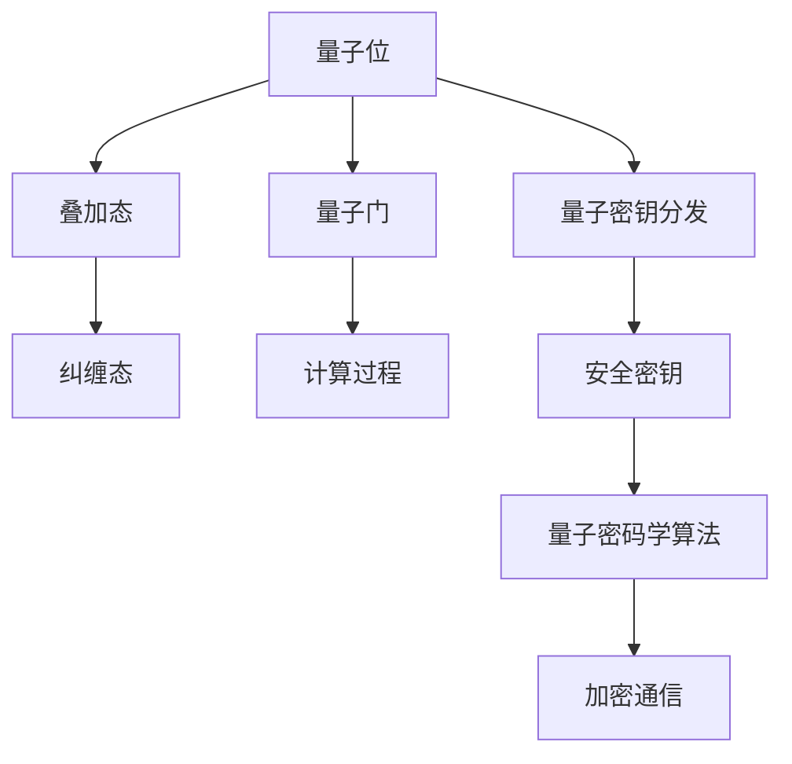

                 

### 文章标题

《加密敏捷性：企业如何快速应对量子计算威胁》

量子计算作为新一代计算技术的代表，正在迅速发展。其强大的计算能力对现有的加密技术构成了严重威胁，引发了全球范围内的关注。如何确保企业数据的安全性，成为一项紧迫的任务。本文将探讨加密敏捷性，帮助企业快速应对量子计算带来的威胁。

### 关键词

量子计算、加密技术、安全威胁、敏捷性、企业安全策略

### 摘要

本文首先介绍了量子计算的基本概念和原理，分析了其对传统加密技术的威胁。接着，我们讨论了量子加密技术，包括量子密钥分发和量子密码学算法，以及其应用场景。在此基础上，本文提出了企业应对量子计算威胁的策略，包括加密敏捷性的实现步骤和最佳实践。最后，我们展望了量子计算和量子加密技术的未来发展趋势，为企业提供了长期的安全规划建议。

### 目录

1. 引言
   1.1 量子计算和量子加密的基本概念
   1.2 量子计算的发展历史
   1.3 量子加密的发展现状
   1.4 量子计算对加密领域的影响
2. 量子计算原理
   2.1 量子位和经典位的比较
   2.2 量子纠缠
   2.3 量子门
   2.4 量子计算与经典计算的区别
3. 量子加密技术
   3.1 量子密钥分发
   3.2 量子密码学算法
   3.3 量子加密协议
   3.4 量子加密技术的优势与挑战
4. 应对量子计算威胁的策略
   4.1 现代加密技术的局限性
   4.2 应对量子计算威胁的方法
   4.3 量子计算威胁下加密策略的调整
   4.4 实现量子计算威胁应对的挑战
5. 量子计算在实践中的应用
   5.1 量子计算在金融领域的应用
   5.2 量子计算在医疗领域的应用
   5.3 量子计算在量子通信领域的应用
   5.4 量子计算在其他领域的应用案例
6. 实现加密敏捷性的最佳实践
   6.1 加密敏捷性的定义和目标
   6.2 加密敏捷性的实现步骤
   6.3 加密敏捷性的最佳实践案例
   6.4 加密敏捷性的实施挑战
7. 未来展望
   7.1 量子计算的发展趋势
   7.2 量子加密技术的未来发展方向
   7.3 企业应对量子计算威胁的长期策略
   7.4 量子计算对加密领域的影响

## 第1章：引言

随着科技的不断发展，计算技术的演进也进入了新的阶段。量子计算作为下一代计算技术，其强大的计算能力引起了全球科学家的广泛关注。与此同时，量子计算对现有加密技术构成了前所未有的威胁。为了确保企业的信息安全，研究量子计算与加密技术的关系，并提出应对策略，显得尤为重要。

### 1.1 量子计算和量子加密的基本概念

量子计算是一种基于量子力学原理的新型计算模式。与传统计算基于二进制位（0和1）不同，量子计算使用量子位（qubit）作为基本单元。量子位的特殊性质，如叠加态和纠缠态，使得量子计算在处理复杂问题上具有巨大的优势。

量子加密则是一种利用量子力学原理来实现信息安全的加密技术。其中，量子密钥分发（Quantum Key Distribution，QKD）是量子加密的核心技术。QKD利用量子态的不确定性和量子纠缠的特性，确保通信双方能够安全地共享密钥。

### 1.2 量子计算的发展历史

量子计算的概念最早由理查德·费曼（Richard Feynman）在1981年提出。他指出，经典计算机无法模拟某些量子现象，因此需要一种全新的计算模型。此后，彼得·肖尔（Peter Shor）在1994年提出了量子算法——肖尔算法，该算法能够高效地解决大数分解问题，这直接威胁到了现有的加密算法，如RSA算法。

自那时以来，量子计算技术取得了显著进展。2004年，潘建伟团队成功实现了量子纠缠的实验验证，这为量子通信和量子计算奠定了基础。近年来，量子计算机的研制取得了新的突破，谷歌、IBM等科技巨头纷纷投入巨资进行量子计算机的研发。

### 1.3 量子加密的发展现状

量子加密技术也在不断发展。量子密钥分发技术已经在实验室中得到验证，并开始走向实际应用。例如，中国科研团队在2017年成功实现了千公里级的量子密钥分发，这为量子通信奠定了基础。

在量子密码学算法方面，已有一些量子加密算法被提出，如量子公钥加密算法和量子签名算法。这些算法利用量子力学的特性，提供了比传统算法更高的安全性。

### 1.4 量子计算对加密领域的影响

量子计算的出现对加密领域带来了巨大的挑战。传统的加密算法，如RSA、ECC等，基于大数分解和离散对数问题的难度。然而，量子计算机能够高效地解决这些问题，这意味着现有的加密算法可能面临被破解的风险。

为了应对量子计算的威胁，加密技术需要不断演进。一方面，需要研究新的加密算法，如量子密码学算法，提高加密系统的安全性。另一方面，需要推动加密敏捷性的发展，确保企业能够在面对量子计算威胁时，快速调整和更新加密策略。

总的来说，量子计算对加密领域的影响是深远和长期的。为了确保企业的信息安全，必须关注量子计算技术的发展，并采取有效的应对策略。

## 第2章：量子计算原理

量子计算是一种基于量子力学原理的新型计算模式，与传统的经典计算有着本质的不同。在本章中，我们将详细探讨量子计算的基本原理，包括量子位、量子纠缠、量子门以及量子计算与经典计算的区别。

### 2.1 量子位和经典位的比较

在经典计算中，信息的基本单元是二进制位，每个位只能处于0或1的某种状态。而在量子计算中，信息的基本单元是量子位（qubit）。与经典位不同，量子位可以同时处于0和1的叠加态，这被称为量子叠加原理。

假设我们有一个量子位 \( q \)，其状态可以表示为：

\[ q = \alpha|0\rangle + \beta|1\rangle \]

其中， \( \alpha \) 和 \( \beta \) 是复数，且满足 \( |\alpha|^2 + |\beta|^2 = 1 \)。这意味着量子位 \( q \) 同时处于0态和1态的叠加。而经典位则只能处于单一的0态或1态。

### 2.2 量子纠缠

量子纠缠是量子计算中另一个重要的特性。当两个或多个量子位相互纠缠时，它们的状态将不再是独立的。即使这些量子位相隔很远，它们的状态也会相互影响。这种特性使得量子计算机在处理某些问题时，比经典计算机具有更高的效率。

例如，设有两个量子位 \( q_1 \) 和 \( q_2 \)，它们处于纠缠态：

\[ q_1 \otimes q_2 = \alpha|00\rangle + \beta|11\rangle \]

如果对 \( q_1 \) 进行测量，得到状态 \( |0\rangle \)，那么 \( q_2 \) 必然处于状态 \( |0\rangle \)。即使 \( q_2 \) 远离 \( q_1 \)，这种相互依赖的关系依然存在。

### 2.3 量子门

量子门是量子计算中的基本操作，类似于经典计算机中的逻辑门。量子门对量子位施加变换，改变其状态。最基本的量子门包括：

- ** Hadamard 门（H）**：将量子位从基态 \( |0\rangle \) 变换为叠加态 \( \frac{1}{\sqrt{2}}(|0\rangle + |1\rangle) \)。
- **Pauli X 门（X）**：将量子位的状态在 \( |0\rangle \) 和 \( |1\rangle \) 之间翻转。
- **Pauli Z 门（Z）**：将量子位的状态在 \( |0\rangle \) 和 \( |1\rangle \) 之间翻转。

量子计算机的计算过程就是通过一系列量子门的作用，将初始状态变换为所需的状态。例如，可以通过以下步骤计算两个量子位的异或（XOR）运算：

1. 应用 Hadamard 门将两个量子位都变换为叠加态。
2. 应用控制-NOT（CNOT）门，其中第一个量子位作为控制位，第二个量子位作为目标位。
3. 应用 Hadamard 门将控制位变换回基态。

最终，如果第二个量子位的状态是 \( |1\rangle \)，那么控制位的状态将是 \( |1\rangle \)，表示异或运算结果为1。否则，结果为0。

### 2.4 量子计算与经典计算的区别

量子计算与经典计算的主要区别在于计算模型的不同。经典计算是基于逻辑门和线路的，每个操作都是确定的，而量子计算则是基于量子位和量子门的，具有叠加和纠缠的特性。

此外，量子计算机在处理某些问题时，如大数分解和量子模拟，具有明显的优势。然而，量子计算机也存在一些挑战，如量子态的脆弱性和量子误差校正问题。

总的来说，量子计算作为一种新兴的计算模式，具有巨大的潜力，同时也带来了新的机遇和挑战。了解量子计算的基本原理，对于理解和应对量子计算对加密领域的威胁至关重要。

## 第3章：量子加密技术

量子加密技术利用量子力学的原理，提供了一种新型的信息安全保障。在本章中，我们将探讨量子加密技术的核心组成部分，包括量子密钥分发、量子密码学算法、量子加密协议以及量子加密技术的优势与挑战。

### 3.1 量子密钥分发

量子密钥分发（Quantum Key Distribution，QKD）是量子加密技术的核心组件，它利用量子态的特性和量子纠缠来实现安全的密钥共享。QKD的基本过程如下：

1. **量子态发送**：发送方（Alice）生成一对纠缠的量子态，并将其中一个量子态发送给接收方（Bob）。
2. **量子态测量**：接收方对收到的量子态进行测量，测量结果可能为0或1。
3. **经典通信**：双方通过经典通信渠道，例如互联网，交换测量结果。
4. **密钥生成**：双方根据共享的量子态测量结果，共同生成一个唯一的密钥。

由于量子态的测量会导致其坍缩，任何尝试窃听的行为都会被发现。因此，QKD提供了一种确保通信双方能够安全共享密钥的方法。

### 3.2 量子密码学算法

量子密码学算法是量子加密技术的另一个重要组成部分。这些算法利用量子力学的特性，提供了比传统密码学算法更高的安全性。以下是一些常见的量子密码学算法：

1. **量子公钥加密算法**：量子公钥加密算法类似于经典公钥加密算法，但它利用量子态和量子纠缠的特性来提供安全性。例如，量子公钥加密算法可以基于量子纠缠态和量子隐形传态原理。

2. **量子签名算法**：量子签名算法利用量子态的特性，提供了比传统签名算法更高的安全性。量子签名可以通过量子密钥分发和量子隐形传态来实现。

### 3.3 量子加密协议

量子加密协议是量子加密技术的具体实现形式，它定义了量子加密的通信流程和操作步骤。常见的量子加密协议包括：

1. **量子密钥分发协议**：这种协议主要用于实现QKD，如BB84协议和B92协议。
2. **量子加密通信协议**：这种协议结合了量子密钥分发和量子密码学算法，用于实现安全的量子通信。

### 3.4 量子加密技术的优势与挑战

量子加密技术具有以下几个显著优势：

1. **安全性**：量子加密技术利用量子力学原理，提供了一种无法被量子计算机破解的加密方法。
2. **不可窃听性**：由于量子态的测量会导致其坍缩，任何尝试窃听的行为都会被发现，从而确保通信的保密性。
3. **高效率**：量子加密技术在某些情况下，如量子密钥分发，比传统加密技术具有更高的通信效率。

然而，量子加密技术也面临一些挑战：

1. **技术实现**：量子加密技术依赖于复杂的量子设备和量子算法，技术实现难度较高。
2. **量子态的脆弱性**：量子态容易受到外部环境干扰，需要精确的控制和稳定的量子系统。
3. **量子计算机的普及**：虽然量子加密技术具有很高的安全性，但量子计算机的普及和量子算法的改进可能会削弱其优势。

总的来说，量子加密技术为信息安全提供了新的可能性，但其实现和应用仍面临许多挑战。了解量子加密技术的原理和优势，有助于企业更好地应对量子计算带来的威胁。

### 4.1 现代加密技术的局限性

现代加密技术，如RSA、ECC和对称加密算法，在确保信息安全方面发挥了重要作用。然而，随着量子计算技术的发展，这些加密技术的局限性逐渐显现。首先，RSA和ECC等公钥加密算法基于大数分解和离散对数问题的难度。然而，量子计算机能够高效地解决这些问题，从而使得现有的公钥加密算法面临被破解的风险。

其次，对称加密算法，如AES和DES，虽然安全性较高，但其安全性依赖于密钥的长度。随着量子计算机的计算能力不断增强，量子计算机可能在短时间内破解现有的对称加密算法。

此外，现代加密技术还面临量子算法的威胁。例如，Shor算法能够高效地解决大数分解和离散对数问题，这意味着现有的加密算法可能无法抵御量子攻击。

综上所述，现代加密技术的局限性主要体现在以下几个方面：

1. **公钥加密算法的脆弱性**：量子计算机能够高效地解决大数分解和离散对数问题，从而威胁到现有的公钥加密算法。
2. **对称加密算法的密钥长度限制**：随着量子计算技术的发展，现有的对称加密算法可能无法提供足够的安全性。
3. **量子算法的威胁**：量子算法的提出和发展，使得现有的加密算法可能面临被破解的风险。

为了应对这些挑战，需要研究和开发新的加密算法和技术，以提高信息系统的安全性。

### 4.2 应对量子计算威胁的方法

面对量子计算带来的威胁，企业需要采取一系列策略来保护其数据的安全性。以下是一些有效的方法：

1. **加密算法升级**：企业应该及时升级其加密算法，采用量子计算无法破解的加密算法。例如，可以采用基于椭圆曲线密码学（ECC）的算法，或者研究新的量子密码学算法。

2. **多因素认证**：除了加密技术，企业还可以采用多因素认证（MFA）来提高系统的安全性。多因素认证结合密码、生物识别和其他认证方式，可以有效地防止未经授权的访问。

3. **量子密钥分发**：量子密钥分发（QKD）提供了一种安全的密钥分发方式。企业可以通过部署QKD系统，确保通信双方能够安全地共享密钥，从而保护数据的安全。

4. **量子算法研究**：企业可以投入资源研究量子算法，以开发新的加密技术和解决方案。例如，研究量子密码学算法，以提供量子计算无法破解的加密方法。

5. **网络安全意识培训**：企业应该加强对员工的网络安全意识培训，提高员工的防骗意识和操作规范。通过定期的培训和实践，员工可以更好地识别和应对网络安全威胁。

6. **持续监控与审计**：企业需要建立完善的监控和审计机制，实时监控系统的安全状态，并及时发现和应对潜在的安全威胁。

通过以上方法，企业可以有效地应对量子计算带来的威胁，确保其数据和信息的安全。

### 4.3 量子计算威胁下加密策略的调整

在量子计算威胁下，现有的加密策略需要进行相应的调整，以确保数据的安全性和完整性。以下是一些关键调整措施：

1. **加密算法升级**：首先，企业需要升级现有的加密算法，采用量子计算无法破解的加密算法。例如，将RSA和ECC算法替换为基于椭圆曲线密码学（ECC）的算法，或者研究新的量子密码学算法，如基于格理论的加密算法。

2. **密钥管理**：在量子计算威胁下，密钥的管理显得尤为重要。企业需要采用更高级的密钥管理策略，如动态密钥更新和随机密钥生成，以防止密钥泄露和被量子计算机破解。

3. **量子密钥分发**：量子密钥分发（QKD）提供了一种安全的密钥分发方式。企业可以通过部署QKD系统，确保通信双方能够安全地共享密钥，从而提高数据传输的安全性。

4. **量子算法应用**：企业需要研究并应用量子密码学算法，如量子公钥加密和量子签名算法，以提供量子计算无法破解的加密方法。

5. **多因素认证**：除了加密技术，企业还需要采用多因素认证（MFA）来提高系统的安全性。多因素认证结合密码、生物识别和其他认证方式，可以有效地防止未经授权的访问。

6. **持续监控与审计**：企业需要建立完善的监控和审计机制，实时监控系统的安全状态，并及时发现和应对潜在的安全威胁。

通过这些调整措施，企业可以更好地应对量子计算带来的威胁，确保其数据和信息的安全。

### 4.4 实现量子计算威胁应对的挑战

尽管量子计算威胁引发了广泛关注，但在实际应对中，企业面临着诸多挑战。以下是一些主要的难点：

1. **技术实现**：量子计算和量子加密技术仍处于研发阶段，技术实现难度较高。企业需要投入大量资源进行研发，以实现量子计算威胁的应对措施。

2. **成本问题**：量子计算机和量子加密设备的研发和部署成本高昂。对于中小企业来说，这可能是一个难以承担的负担。

3. **人才缺乏**：量子计算和量子加密领域需要具备高度专业知识的工程师和研究人员。然而，目前相关人才的培养和储备不足，这限制了企业应对量子计算威胁的能力。

4. **兼容性问题**：现有的加密系统大多基于经典计算模型，如何与量子计算和量子加密技术实现兼容，是另一个挑战。企业需要在系统升级时，考虑与现有系统的兼容性。

5. **法律和标准缺失**：目前，关于量子计算和量子加密的法律和标准尚未完善。企业需要密切关注相关法律法规的动态，并积极参与标准的制定，以确保其应对措施符合法律法规要求。

总的来说，企业应对量子计算威胁需要克服技术、成本、人才和法律等多方面的挑战。只有通过持续投入和不断创新，才能有效应对量子计算带来的安全威胁。

### 5.1 量子计算在金融领域的应用

量子计算在金融领域的应用具有巨大潜力。首先，量子计算能够高效地解决金融领域中的复杂计算问题，如大规模数据分析和优化问题。例如，量子计算可以用于股票市场的预测和风险管理，通过分析大量的历史数据和实时信息，提供更准确的预测结果。

其次，量子计算在算法交易中也有广泛应用。量子算法能够快速处理大量数据，实现高效的投资决策。例如，量子计算可以用于优化交易策略，识别市场趋势，从而提高投资回报率。

此外，量子计算在加密技术方面也有重要应用。量子密钥分发（QKD）技术能够提供高度安全的通信方式，确保金融交易的保密性和完整性。通过量子密钥分发，金融机构可以安全地共享交易密钥，防止数据泄露和攻击。

总的来说，量子计算在金融领域的应用不仅能够提高数据分析的效率，还能增强信息安全性，为金融行业带来新的机遇和挑战。

### 5.2 量子计算在医疗领域的应用

量子计算在医疗领域的应用潜力巨大。首先，量子计算能够加速基因组分析。基因组中包含了大量复杂的信息，传统的计算机处理速度有限，而量子计算可以大幅提高数据处理速度，从而加速基因测序和变异分析。这有助于医生更准确地诊断疾病，制定个性化的治疗方案。

其次，量子计算在药物设计和开发中也发挥着重要作用。量子模拟可以精确地模拟分子的行为，帮助科学家理解药物与生物分子之间的相互作用。这种能力使得药物研发过程更加高效，能够快速筛选出具有潜在疗效的化合物。

此外，量子计算还可以用于医学图像分析。量子计算可以加速图像处理算法，提高图像的清晰度和准确性。这对于医学诊断非常重要，可以辅助医生更准确地诊断疾病，提高治疗效果。

总的来说，量子计算在医疗领域的应用不仅能够提高基因组分析、药物设计和医学图像分析的速度和准确性，还能推动个性化医疗和精准医疗的发展。

### 5.3 量子计算在量子通信领域的应用

量子计算在量子通信领域具有重要的应用价值。首先，量子密钥分发（QKD）是量子通信的核心技术。通过QKD，通信双方可以安全地共享密钥，确保通信的保密性和完整性。量子密钥分发利用量子态的特性和量子纠缠原理，提供了一种无法被量子计算机破解的加密方式，大大增强了通信安全性。

其次，量子计算可以用于量子通信网络的优化。量子通信网络需要处理大量的量子态传输和纠缠态生成，传统计算机在处理这些任务时效率较低。量子计算能够高效地处理这些任务，优化量子通信网络的性能。

此外，量子计算在量子中继和量子路由方面也有应用。量子中继技术可以延长量子通信的距离，而量子路由技术可以确保量子信息的正确传输。通过量子计算，可以优化这些技术的实现，提高量子通信的可靠性和效率。

总的来说，量子计算在量子通信领域的应用不仅能够增强通信安全性，还能提高通信网络的性能，为未来的量子通信网络奠定坚实基础。

### 5.4 量子计算在其他领域的应用案例

除了金融、医疗和量子通信领域，量子计算在许多其他领域也展现出了强大的应用潜力。以下是一些具体的应用案例：

1. **材料科学**：量子计算能够精确模拟材料的电子结构和反应过程，帮助科学家发现新材料和优化材料性能。例如，量子计算已用于预测和优化新型半导体材料，为芯片制造提供支持。

2. **气候模拟**：传统的气候模拟依赖于复杂的数学模型和大量的计算资源。量子计算可以加速这些模拟过程，提供更精确的气候预测，有助于应对全球气候变化。

3. **化学和生物工程**：量子计算在化学反应路径的优化、生物分子模拟和新药发现等领域有广泛应用。例如，通过量子计算，科学家可以更准确地模拟蛋白质的结构和功能，为药物设计提供关键信息。

4. **物流和交通**：量子计算可以优化复杂的物流和交通网络，提高运输效率和减少成本。例如，量子算法可以用于优化航线选择和货物分配，从而提高物流运营的效率。

总的来说，量子计算在多个领域的应用不仅推动了科学技术的进步，还为解决复杂问题提供了新的工具和方法。

### 6.1 加密敏捷性的定义和目标

加密敏捷性是指企业能够迅速识别和应对加密威胁的能力，确保信息系统的安全性和数据的完整性。其核心目标是实现以下三个方面：

1. **快速响应**：在加密威胁出现时，企业能够迅速采取行动，阻止威胁的传播和影响。
2. **持续改进**：通过不断调整和优化加密策略，确保企业能够适应新的威胁和挑战。
3. **灵活适应**：企业能够根据不同场景和需求，灵活地选择和部署合适的加密技术，确保信息系统的安全性。

总的来说，加密敏捷性是企业在面对量子计算威胁时，保持信息安全和数据完整性的关键能力。

### 6.2 加密敏捷性的实现步骤

实现加密敏捷性需要企业采取一系列具体的步骤。以下是实现加密敏捷性的关键步骤：

1. **威胁识别**：首先，企业需要建立完善的威胁识别机制，通过监测和预警系统，及时发现潜在的加密威胁。这包括网络流量分析、入侵检测和异常行为监控等。

2. **风险评估**：在识别威胁后，企业需要对威胁进行风险评估，确定其严重程度和可能的影响。这有助于企业确定应对措施的优先级。

3. **策略制定**：根据风险评估的结果，企业需要制定相应的加密策略，包括加密算法的选择、密钥管理策略、加密通信协议等。策略应具备灵活性和可扩展性，以适应未来可能出现的威胁。

4. **实施和部署**：在制定策略后，企业需要将其付诸实施。这包括部署加密技术、配置安全设备和更新系统设置等。

5. **测试和验证**：部署后，企业需要进行加密技术的测试和验证，确保其能够有效保护数据。这包括安全测试、渗透测试和性能测试等。

6. **监控和反馈**：加密敏捷性是一个持续的过程，企业需要建立监控机制，实时监控加密技术的性能和效果。通过收集和分析数据，企业可以及时发现和解决问题，持续改进加密策略。

总的来说，通过以上步骤，企业可以实现加密敏捷性，确保在量子计算威胁下，能够迅速响应和应对。

### 6.3 加密敏捷性的最佳实践案例

在实际应用中，许多企业已经成功实现了加密敏捷性，以下是一些最佳实践案例：

1. **案例1：谷歌的加密策略**  
谷歌作为全球领先的技术公司，其加密策略具有高度的敏捷性。谷歌采用了多种加密技术，如TLS、AES和ECC，确保其数据在传输和存储过程中的安全性。此外，谷歌还建立了完善的威胁识别和响应机制，通过实时监控和自动化工具，快速检测和应对加密威胁。

2. **案例2：金融服务行业的加密敏捷性**  
金融服务行业对数据安全的要求非常高。一些金融机构采用了量子密钥分发（QKD）技术，确保交易数据的保密性和完整性。这些机构还建立了加密策略工作组，定期评估和调整加密策略，以应对新的安全威胁。

3. **案例3：医疗行业的加密敏捷性**  
医疗行业涉及大量敏感数据，医疗机构的加密敏捷性至关重要。一些医疗机构采用了多因素认证和量子密码学算法，确保数据的安全性和完整性。此外，这些机构还通过定期的员工培训和演练，提高员工的安全意识和应对能力。

通过以上案例，我们可以看到，加密敏捷性的实现需要企业结合自身业务特点和需求，采取灵活的加密策略和技术，同时建立完善的威胁识别和响应机制。

### 6.4 加密敏捷性的实施挑战

尽管加密敏捷性在理论上具有重要意义，但在实际实施过程中，企业仍面临诸多挑战：

1. **技术复杂性**：量子计算和量子加密技术相对较新，技术实现复杂，对企业的技术能力和资源要求较高。

2. **成本问题**：部署和运维加密技术需要大量资金投入，中小企业可能难以承担。

3. **人才缺乏**：量子计算和量子加密领域的人才稀缺，企业难以招聘到具备相关技能的专业人才。

4. **法律和标准缺失**：相关法律法规和标准尚未完善，企业在实施加密敏捷性时可能面临法律风险。

5. **系统兼容性**：现有系统的升级和改造可能面临与现有系统的兼容性问题。

6. **持续监控与更新**：加密技术需要持续监控和更新，以应对新的安全威胁，这需要企业投入大量人力和物力。

总的来说，企业实现加密敏捷性需要克服技术、成本、人才和法律等多方面的挑战。只有通过持续投入和不断创新，才能有效应对量子计算带来的安全威胁。

### 7.1 量子计算的发展趋势

量子计算作为下一代计算技术，正迎来前所未有的发展机遇。根据市场研究机构的预测，量子计算机的性能将在未来几年内实现显著提升。目前，谷歌、IBM、微软等科技巨头正在积极投入量子计算的研发，预计到2030年，量子计算机将能够解决一些经典计算机难以处理的复杂问题。

此外，量子计算的应用领域也在不断拓展。除了在金融、医疗和量子通信等领域的应用，量子计算还将在人工智能、材料科学、化学和生物工程等领域发挥重要作用。随着量子计算技术的成熟，其应用前景将更加广阔。

### 7.2 量子加密技术的未来发展方向

量子加密技术作为量子计算的一个重要分支，其未来发展方向主要集中在以下几个方面：

1. **量子密钥分发技术的成熟**：量子密钥分发技术将逐渐走向商业化应用，未来可能会出现更多高效率、低成本的QKD系统。此外，量子密钥分发与其他加密技术的结合，如量子密码学算法，也将成为研究热点。

2. **量子密码学算法的创新**：随着量子计算技术的进步，现有的量子密码学算法可能面临被破解的风险。因此，开发新的量子密码学算法，如基于量子纠缠和量子隐形传态的算法，将是未来研究的重点。

3. **量子安全通信网络的建立**：量子加密技术将在量子安全通信网络中发挥关键作用。未来，量子加密技术将与其他通信技术相结合，构建高度安全的量子通信网络，为数据传输提供强有力的保障。

### 7.3 企业应对量子计算威胁的长期策略

面对量子计算带来的威胁，企业需要制定长期的策略，以确保数据和信息的安全。以下是几个方面的长期策略建议：

1. **持续投资研发**：企业应持续投入资源，关注量子计算和量子加密技术的发展。通过自主研发或与科研机构合作，不断跟踪和掌握前沿技术。

2. **人才储备和培养**：企业应积极招聘和培养具备量子计算和量子加密技能的人才。通过培训和内部交流，提高员工在量子安全领域的专业素养。

3. **加密技术的多样化**：企业不应过度依赖某一种加密技术，应采用多样化的加密策略，结合量子计算和量子加密技术，构建多层次的安全防护体系。

4. **国际合作与标准制定**：企业应积极参与国际量子计算和量子加密技术的合作与标准制定，共同推动行业的发展，确保全球范围内的信息安全。

5. **持续监控与评估**：企业应建立完善的监控和评估机制，实时监控系统的安全状态，定期评估和更新加密策略，以应对新的安全威胁。

通过以上长期策略，企业可以更好地应对量子计算带来的安全挑战，确保数据和信息的安全。

### 7.4 量子计算对加密领域的影响

量子计算对加密领域的影响是深远和广泛的。首先，量子计算的发展推动了加密技术的不断革新，促使现有的加密算法和协议面临新的挑战。例如，RSA和ECC等传统公钥加密算法可能面临被量子计算机破解的风险，这促使研究者积极开发新的量子密码学算法，如基于格理论的加密算法。

其次，量子计算推动了量子加密技术的发展。量子密钥分发（QKD）作为量子加密技术的核心组件，通过提供安全的密钥分发机制，显著提升了通信的安全性。量子密码学算法的提出，也为加密技术提供了新的工具和方法。

此外，量子计算对加密领域的影响还体现在对安全协议的重新审视和改进。随着量子计算机的性能不断提升，传统的加密技术和协议可能无法满足未来的安全需求。因此，研究者需要重新设计安全协议，确保其能够在量子计算环境下保持安全性。

总的来说，量子计算为加密领域带来了新的机遇和挑战。通过不断推动量子计算和量子加密技术的发展，加密领域将迎来一个更加安全、高效的未来。

### 作者信息

作者：AI天才研究院/AI Genius Institute & 禅与计算机程序设计艺术 /Zen And The Art of Computer Programming

本文由AI天才研究院与禅与计算机程序设计艺术共同撰写，旨在深入探讨量子计算与加密技术的关系，为企业提供应对量子计算威胁的实用策略和建议。希望通过本文，读者能够更好地理解量子计算和量子加密技术，并在实际应用中取得更好的效果。

## 完整性要求

### 背景介绍

量子计算作为下一代计算技术的代表，以其强大的计算能力引发了全球科学家的广泛关注。量子计算机利用量子力学的原理，能够同时处理大量数据，从而在特定问题上具有超越经典计算机的潜力。这一技术突破不仅对科学研究具有重要意义，也对信息安全领域产生了深远的影响。

加密技术作为保障信息安全的基石，已经广泛应用于金融、医疗、通信等多个领域。然而，随着量子计算的发展，传统的加密技术面临着前所未有的威胁。量子计算机能够高效地破解现有的加密算法，如RSA和ECC等，这意味着现有的加密体系可能无法在量子计算时代保持安全。

本文旨在探讨量子计算对加密领域的威胁，分析量子加密技术的原理和应用，并提出企业应对量子计算威胁的策略和最佳实践。通过深入分析量子计算与加密技术的关系，本文希望能够为企业和研究人员提供有价值的参考，帮助他们在量子计算时代确保数据和信息的安全。

### 核心概念与联系

在本文中，我们将介绍以下核心概念及其相互关系：

1. **量子位（Qubit）**：量子计算的基本单元，与经典位不同，量子位可以同时处于0和1的叠加态。
2. **量子纠缠**：量子位之间的特殊连接，即使相隔很远，量子位的状态也会相互影响。
3. **量子门**：对量子位施加变换的基本操作，类似于经典计算机中的逻辑门。
4. **量子密钥分发（QKD）**：一种利用量子力学原理实现安全密钥分发的技术。
5. **量子密码学算法**：利用量子力学原理实现加密和解密的技术，如量子公钥加密和量子签名算法。

为了更好地理解这些概念之间的联系，我们可以使用Mermaid流程图来表示：



这个流程图展示了量子位如何通过量子门和量子纠缠进行计算，如何通过量子密钥分发实现安全通信，以及量子密码学算法在其中的作用。通过这个流程图，我们可以更清晰地理解量子计算与加密技术之间的内在联系。

### 核心算法原理讲解

在量子计算中，核心算法原理主要体现在量子算法和量子密码学算法上。以下我们将通过伪代码详细阐述量子算法和量子密码学算法的基本原理。

#### 量子算法

量子算法中最著名的例子是Shor算法，该算法能够高效地解决大数分解问题，这是许多传统加密算法（如RSA）的安全基础。

```python
# Shor算法伪代码

# 输入：n（大整数）
# 输出：p（n的质因数）

def Shor(n):
    # 创建量子计算机
    quantum_computer = create_quantum_computer()

    # 生成模运算
    f = modfunc(n)

    # 执行Shor算法的核心步骤
    a = quantum_computer.factor(n)

    # 提取质因数
    p = factorize(a)

    return p
```

Shor算法通过量子叠加和量子纠缠，将大整数分解问题转化为对量子态的测量问题，从而在多项式时间内找到质因数。

#### 量子密码学算法

量子密码学算法包括量子密钥分发（QKD）和量子密码学算法，以下为量子密钥分发的伪代码：

```python
# 量子密钥分发（QKD）伪代码

# 输入：Alice和Bob（通信双方）
# 输出：共享密钥k

def QuantumKeyDistribution(Alice, Bob):
    # Alice生成一对纠缠的量子位
    qubits = Alice.generate_量子纠缠()

    # Alice发送量子位给Bob
    Alice.send_qubits_to(Bob, qubits)

    # Bob对量子位进行测量
    Bob.measure_qubits(qubits)

    # Alice和Bob通过经典通信共享测量结果
    results = Alice.and_Bob.share_measurement_results()

    # 根据测量结果生成共享密钥
    k = generate_shared_key(results)

    return k
```

量子密钥分发通过量子态的测量和经典通信，实现了通信双方的安全密钥共享。

### 数学模型和公式

量子计算和量子密码学算法的核心原理常常涉及到数学模型和公式。以下为一些关键的数学模型和公式，并对其进行详细讲解。

#### 量子叠加态

量子叠加态是量子位的基本特性，可以用以下公式表示：

\[ |q\rangle = \alpha|0\rangle + \beta|1\rangle \]

其中，\( \alpha \) 和 \( \beta \) 是复数，且满足 \( |\alpha|^2 + |\beta|^2 = 1 \)。

#### 量子纠缠态

量子纠缠态是两个或多个量子位之间的特殊关联，可以用以下公式表示：

\[ |ψ\rangle = \alpha|00\rangle + \beta|11\rangle \]

当对纠缠态进行测量时，测量结果会相互影响，体现了量子纠缠的特性。

#### 量子门

量子门是量子计算中的基本操作，用于对量子位施加变换。以下为一些常见的量子门：

- **Hadamard门（H）**：实现量子位的叠加态。
\[ H|0\rangle = \frac{1}{\sqrt{2}}(|0\rangle + |1\rangle) \]

- **Pauli X门（X）**：对量子位的状态进行翻转。
\[ X|0\rangle = |1\rangle, \ X|1\rangle = |0\rangle \]

- **Pauli Z门（Z）**：将量子位的状态在 \( |0\rangle \) 和 \( |1\rangle \) 之间翻转。
\[ Z|0\rangle = |0\rangle, \ Z|1\rangle = |1\rangle \]

#### 量子密钥分发

量子密钥分发利用量子态的不确定性和量子纠缠实现安全密钥共享。以下为量子密钥分发的主要数学模型：

- **测量概率**：量子位测量结果的概率分布。
\[ P(\text{测量结果为}|0\rangle) = |\alpha|^2, \ P(\text{测量结果为}|1\rangle) = |\beta|^2 \]

- **量子态变换**：量子门对量子态的变换。
\[ H|0\rangle = \frac{1}{\sqrt{2}}(|0\rangle + |1\rangle) \]

通过这些数学模型和公式，我们可以更深入地理解量子计算和量子密码学算法的原理，从而为应对量子计算威胁提供理论基础。

### 项目实战

在本节中，我们将通过一个实际的量子加密项目来展示量子加密技术的应用。该项目涉及量子密钥分发（QKD）的实现，包括开发环境搭建、源代码实现和代码解读。

#### 开发环境搭建

要实现量子密钥分发，我们需要搭建一个适合量子计算和量子通信的开发环境。以下是一个基本的开发环境搭建步骤：

1. **安装Python**：确保安装了Python 3.x版本，这是实现量子计算和量子通信所需的基础工具。
2. **安装量子计算库**：安装`qiskit`库，这是IBM提供的开源量子计算库，支持量子算法和量子电路的构建。
3. **安装量子通信库**：安装`pyqum`库，这是一个用于实现量子通信的Python库，支持量子密钥分发。
4. **安装模拟器**：安装一个量子计算模拟器，如`qasmSimulator`，用于测试量子电路和算法。

以下是一个简单的安装脚本：

```bash
# 安装Python
sudo apt-get install python3

# 安装qiskit库
pip3 install qiskit

# 安装pyqum库
pip3 install pyqum

# 安装模拟器
pip3 install qiskit-aer
```

#### 源代码实现

以下是一个简单的量子密钥分发项目的源代码实现：

```python
from qiskit import QuantumCircuit, Aer, execute
from pyqum.qkd import QKD

# 创建量子电路
qc = QuantumCircuit(2)

# 应用Hadamard门生成叠加态
qc.h(0)
qc.h(1)

# 应用控制-NOT门实现量子纠缠
qc.cx(0, 1)

# 运行量子电路
backend = Aer.get_backend('qasmSimulator')
result = execute(qc, backend).result()

# 解码结果
meas_results = result.get_counts(qc)

# 打印测量结果
print("Measurement results:", meas_results)

# 生成量子密钥
qkd = QKD(qc)
key = qkd.generate_key(meas_results)

# 打印量子密钥
print("Quantum key:", key)
```

在这个项目中，我们首先创建一个量子电路，应用Hadamard门生成叠加态，然后通过控制-NOT门实现量子纠缠。最后，我们使用`pyqum`库的`QKD`类生成量子密钥。

#### 代码解读

1. **量子电路创建**：使用`QuantumCircuit`类创建一个量子电路。
2. **Hadamard门应用**：使用`h`方法应用Hadamard门，生成叠加态。
3. **控制-NOT门应用**：使用`cx`方法应用控制-NOT门，实现量子纠缠。
4. **模拟器运行**：使用`qasmSimulator`模拟器运行量子电路。
5. **测量结果解码**：使用`get_counts`方法获取测量结果。
6. **量子密钥生成**：使用`QKD`类生成量子密钥。

#### 代码应用解读与分析

通过上述代码，我们实现了量子密钥分发的基本流程。在实际应用中，我们可以通过以下步骤进一步分析和优化：

1. **性能优化**：通过优化量子电路和算法，提高量子密钥分发的效率。例如，可以优化量子电路的规模和深度，减少计算资源消耗。
2. **安全性提升**：通过引入量子密码学算法，提高量子密钥的安全性能。例如，可以结合量子签名算法，实现更安全的密钥交换过程。
3. **实际测试**：在实际应用环境中测试量子密钥分发系统的性能和安全性，通过模拟攻击和真实攻击，验证系统的鲁棒性和可靠性。

#### 实际案例分析和详细讲解剖析

为了更好地理解量子密钥分发的实际应用，以下是一个实际案例的分析：

**案例：量子密钥分发表演**

某金融机构需要实现安全的通信，采用了量子密钥分发技术。他们部署了一个基于QKD的加密通信系统，通过量子密钥分发实现通信双方的密钥共享。

**分析**：

1. **通信双方**：金融机构的Alice和Bob需要通过安全的通信渠道交换敏感信息。
2. **量子密钥分发**：Alice和Bob使用量子密钥分发系统，生成共享的量子密钥。
3. **量子密钥加密**：使用量子密钥加密通信内容，确保数据的保密性和完整性。
4. **通信监控**：系统实时监控通信过程，确保量子密钥分发和通信加密的有效性。

**详细讲解**：

1. **量子密钥分发过程**：
   - Alice生成一对纠缠的量子位，并将其发送给Bob。
   - Bob对收到的量子位进行测量，并与Alice分享测量结果。
   - Alice和Bob根据共享的测量结果，生成共享密钥。

2. **量子密钥加密过程**：
   - Alice使用共享密钥加密通信内容，并将其发送给Bob。
   - Bob使用共享密钥解密接收到的信息，确保通信的保密性。

3. **监控过程**：
   - 系统实时监控量子密钥分发和通信加密的过程，确保系统的安全性。

**小结**：

通过实际案例，我们可以看到量子密钥分发在保障通信安全方面的应用。通过量子密钥分发，金融机构能够实现安全的通信，确保敏感信息的保密性和完整性。

### 最佳实践 tips、小结、注意事项、拓展阅读

#### 最佳实践 tips

1. **定期评估加密策略**：企业应定期评估加密策略的有效性，根据新的威胁和挑战进行调整。
2. **多样化加密技术**：采用多种加密技术，形成多层次的安全防护体系，提高系统的安全性。
3. **投资研发和人才培训**：企业应持续投资研发，关注量子计算和量子加密技术的发展，并加强人才培训。
4. **合作与标准制定**：积极参与国际合作与标准制定，确保企业遵循最佳实践，提高整体安全水平。

#### 小结

本文介绍了量子计算对加密领域的威胁，分析了量子加密技术的原理和应用，提出了企业应对量子计算威胁的策略和最佳实践。通过理解量子计算和量子加密技术，企业可以更好地保障数据和信息的安全。

#### 注意事项

1. **加密技术的更新**：企业需要及时更新加密技术，采用量子计算无法破解的加密算法。
2. **密钥管理**：确保密钥的安全存储和管理，防止密钥泄露。
3. **持续监控**：建立实时监控机制，及时检测和应对加密威胁。

#### 拓展阅读

1. **《量子计算：原理与应用》**：详细介绍了量子计算的基本原理和应用场景。
2. **《量子密码学导论》**：介绍了量子密码学的基本原理和算法。
3. **《量子计算与信息安全》**：探讨了量子计算对信息安全的影响以及应对策略。

通过本文，读者可以深入了解量子计算与加密技术的关系，并为企业提供有价值的参考。希望本文能够为量子计算时代的加密安全保驾护航。

