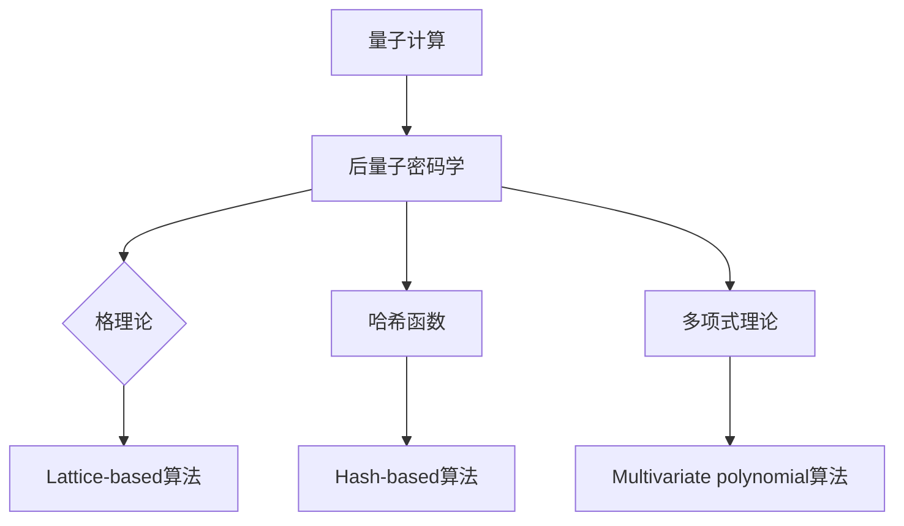

                 


- 文章标题：《加密货币在后量子时代的安全挑战》
- 文章关键词：加密货币、后量子计算、安全挑战、区块链、数字货币
- 文章摘要：本文深入探讨了加密货币在后量子时代所面临的安全挑战，包括后量子密码学的基础、加密货币的工作原理以及应对这些挑战的解决方案。

## 引言与背景

加密货币是一种基于区块链技术的数字资产，它通过加密算法确保交易的安全性和匿名性。从比特币的诞生开始，加密货币逐渐成为金融领域的一股新兴力量。随着技术的不断进步，特别是量子计算的快速发展，加密货币面临着前所未有的安全挑战。

后量子计算是一种基于量子力学原理的新型计算模式，它能够在某些问题上超越传统计算机。量子计算的发展可能使现有的加密算法变得脆弱，这对于依赖于加密技术的加密货币系统构成了严重威胁。

本文将从以下几个方面进行探讨：

1. **后量子密码学基础**：介绍后量子密码学的基本原理和常用算法。
2. **加密货币的工作原理**：阐述加密货币的运作机制，包括区块链技术、数字签名和加密货币交易等。
3. **后量子时代的安全挑战**：分析后量子计算对加密货币系统可能产生的影响。
4. **解决方案与技术创新**：探讨如何利用后量子密码学和其他技术创新来提升加密货币的安全性。
5. **应用实例与分析**：通过具体实例来展示后量子时代加密货币的安全性。
6. **未来展望与趋势**：对加密货币在后量子时代的未来发展进行展望。

### 后量子密码学基础

后量子密码学是一种基于量子力学原理的新型密码学体系，它能够抵御量子计算攻击。后量子密码学的基本原理包括量子纠缠和量子超密性。以下是一些常见的后量子密码算法：

#### Lattice-based密码算法

Lattice-based密码算法是一种利用高维空间的几何结构来实现安全加密的算法。其中，最著名的算法是NTRU算法。NTRU算法的核心思想是将加密信息编码成一个多项式，并将其表示为两个多项式的乘积。在解密过程中，攻击者需要找到这两个多项式的原始值，这需要指数级的时间复杂度。

#### Hash-based密码算法

Hash-based密码算法利用哈希函数将加密信息映射到一个较小的空间中，从而实现加密。最著名的Hash-based密码算法是SHA-256。尽管SHA-256在经典计算机上表现良好，但在量子计算面前，它可能变得脆弱。因此，需要开发新的哈希函数来应对量子计算威胁。

#### Multivariate polynomial密码算法

Multivariate polynomial密码算法是一种将多项式方程组应用于加密和解密过程的算法。这种算法的难点在于攻击者需要同时解决多个多项式方程，这需要巨大的计算资源。

### 加密货币的工作原理

加密货币的工作原理主要基于区块链技术和加密算法。区块链技术是一种分布式数据库，它通过加密算法确保交易记录的安全性和不可篡改性。以下是加密货币工作原理的核心部分：

#### 区块链技术

区块链技术是一种去中心化的数据库，它通过加密算法将交易记录存储在多个节点上。每个节点都维护一个完整的交易记录副本，从而确保数据的完整性和一致性。区块链技术的一个重要特性是它的不可篡改性，这使得交易记录一旦被记录，就无法被篡改。

#### 数字签名

数字签名是一种用于验证交易合法性的技术。它通过加密算法生成一个唯一的签名，这个签名只有拥有私钥的人才能生成。在加密货币交易中，发送方使用自己的私钥生成签名，接收方则使用发送方的公钥验证签名的合法性。

#### 加密货币交易机制

加密货币交易机制通过区块链技术实现，它包括交易发起、交易验证和交易记录三个主要步骤。交易发起时，发送方创建一个交易请求，并将该请求发送到网络中的其他节点。交易验证时，节点使用加密算法验证交易请求的合法性。交易记录时，节点将交易请求记录在区块链上，从而完成交易。

#### 加密货币钱包

加密货币钱包是一种用于存储和管理加密货币的软件或硬件设备。它通过加密算法保护用户的私钥，从而确保用户的加密货币安全。加密货币钱包可以是热钱包（在线钱包）或冷钱包（离线钱包）。

### 后量子时代的安全挑战

后量子计算的发展对加密货币系统构成了严重威胁。量子计算机能够快速破解现有的加密算法，如RSA和ECC，这可能导致加密货币系统中的交易记录和私钥被泄露。

#### 传统加密算法的脆弱性

现有的加密货币系统大多依赖于传统的加密算法，如RSA和ECC。这些算法在经典计算机上表现出色，但在量子计算面前可能变得脆弱。例如，RSA算法依赖于大素数分解问题，而量子计算机能够在多项式时间内解决这一问题。

#### 后量子计算的影响

后量子计算的发展可能使现有的加密货币系统变得不稳定。量子计算机能够快速破解加密货币系统中的私钥和交易记录，从而窃取用户的资产。此外，量子计算机还能够破解用于验证交易的公钥和私钥，从而操纵交易。

#### 潜在威胁

后量子计算对加密货币系统可能产生的潜在威胁包括：

- **交易记录泄露**：量子计算机能够破解现有的加密算法，从而获取加密货币系统中的交易记录。
- **私钥泄露**：量子计算机能够破解用户的私钥，从而窃取用户的加密货币。
- **交易操纵**：攻击者能够使用量子计算机破解用于验证交易的公钥和私钥，从而操纵交易。

### 解决方案与技术创新

为了应对后量子时代的安全挑战，加密货币领域需要采取一系列解决方案和技术创新。以下是一些可能的解决方案：

#### 后量子密码学的应用

后量子密码学是一种基于量子力学原理的新型密码学体系，它能够抵御量子计算攻击。在加密货币系统中，可以采用后量子密码学算法来保护交易记录和私钥。例如，Lattice-based密码算法和Multivariate polynomial密码算法都是潜在的后量子密码学解决方案。

#### 新型加密货币算法设计

为了提高加密货币系统的安全性，可以设计新型加密货币算法。这些算法应该能够抵御量子计算攻击，同时保持与现有系统的兼容性。例如，可以设计一种基于后量子密码学的加密货币算法，它能够在量子计算面前保持安全。

#### 安全协议改进

除了加密算法的改进，加密货币系统的安全协议也需要改进。例如，可以引入多重签名和匿名交易等安全协议，以增强系统的安全性。此外，可以采用量子密钥分发技术来生成和分发用于加密交易的密钥，从而确保系统的安全性。

### 应用实例与分析

为了展示后量子时代加密货币的安全性，我们可以通过具体实例进行分析。

#### 比特币与量子计算

比特币是目前最著名的加密货币之一。在量子计算面前，比特币的加密算法可能变得脆弱。例如，比特币使用的SHA-256算法在量子计算下可能被破解。因此，比特币社区需要考虑采用后量子密码学算法来提高系统的安全性。

#### 以太坊与量子安全协议

以太坊是另一个流行的加密货币平台。为了应对量子计算威胁，以太坊社区正在探索量子安全协议。例如，可以引入基于Lattice-based密码算法的量子安全签名方案，以保护以太坊的交易记录和私钥。

### 未来展望与趋势

随着量子计算的发展，加密货币领域将面临巨大的挑战。为了保持系统的安全性，加密货币领域需要不断探索新技术和创新方案。

#### 技术挑战与机遇

量子计算的发展为加密货币领域带来了新的技术挑战，但也带来了机遇。通过采用后量子密码学和其他创新技术，加密货币领域可以开发出更加安全可靠的加密货币系统。

#### 未来展望

未来，加密货币领域可能会出现一系列新技术和解决方案。例如，量子密钥分发技术、新型加密货币算法和量子安全协议都将成为加密货币领域的研究热点。

### 结论

后量子计算的发展对加密货币系统构成了严重威胁。为了应对这一挑战，加密货币领域需要采取一系列解决方案和技术创新。通过引入后量子密码学和其他新技术，加密货币领域可以开发出更加安全可靠的加密货币系统。

作者：AI天才研究院/AI Genius Institute & 禅与计算机程序设计艺术 /Zen And The Art of Computer Programming
```markdown
```markdown
---
title: "加密货币在后量子时代的安全挑战"
date: 2023-10-01
tags: ["加密货币", "后量子计算", "安全", "区块链"]
---

# 《加密货币在后量子时代的安全挑战》

## 引言与背景

加密货币作为一种新兴的数字资产形式，已经引起了全球范围内的广泛关注。其基于区块链技术的特性，不仅保证了交易的安全性和透明度，还为去中心化的金融体系提供了可能。然而，随着量子计算技术的快速发展，传统的加密手段正面临着前所未有的挑战。本文将深入探讨加密货币在后量子时代所面临的安全问题。

### 后量子密码学基础

后量子密码学是一种设计用于抵抗量子计算攻击的密码学理论。它基于量子力学的基本原理，如量子纠缠和量子超密性，提供了一种新的安全防护机制。常见的后量子密码算法包括基于格理论的Lattice-based密码算法、Hash-based密码算法以及Multivariate polynomial密码算法等。

#### 后量子密码学核心概念与联系

以下是一个描述后量子密码学核心概念之间关系的Mermaid流程图：



### 加密货币的工作原理

加密货币的工作原理主要基于区块链技术。区块链通过分布式账本记录所有的交易活动，并且利用密码学技术确保数据的安全性和不可篡改性。以下是对加密货币工作原理的详细解释：

#### 加密货币运作机制

加密货币的运作机制可以分为以下几个步骤：

1. **交易发起**：用户使用加密货币钱包创建一个交易请求，并包含收款方的地址和交易金额。
2. **交易验证**：交易请求通过网络传输到区块链节点，节点使用加密算法验证交易的有效性。
3. **区块生成**：验证后的交易将被添加到一个新的区块中，并由区块链网络中的节点共同确认。
4. **区块确认**：新的区块将被附加到区块链的末端，交易即完成。

#### 核心算法原理讲解

以下是一个用于加密货币交易验证的伪代码示例：

```python
# 伪代码：加密货币交易验证

function verify_transaction(transaction):
    # 验证交易签名
    if not verify_signature(transaction.signature, transaction.sender_public_key):
        return False
    
    # 计算交易金额
    calculated_amount = calculate_amount(transaction)
    
    # 验证交易金额
    if calculated_amount != transaction.amount:
        return False
    
    # 验证交易的有效性
    if not is_valid_transaction(transaction):
        return False
    
    return True
```

#### 数学模型和公式

加密货币的安全性依赖于密码学模型和算法。以下是一个描述加密货币交易中使用的数学模型的公式：

$$
H(m) = \text{SHA-256}(m)
$$

其中，$H(m)$ 表示消息$m$的SHA-256哈希值。

### 后量子时代的安全挑战

后量子计算的发展使得传统的加密手段可能变得脆弱。量子计算机能够快速破解现有的加密算法，如RSA和ECC，这将对加密货币系统构成严重威胁。以下是一些主要的安全挑战：

#### 传统加密算法的脆弱性

- **RSA算法**：RSA算法依赖于大素数分解问题，而量子计算机能够在多项式时间内解决这一问题。
- **ECC算法**：椭圆曲线密码学（ECC）在经典计算机上表现良好，但在量子计算机面前也可能被破解。

#### 后量子计算的影响

- **交易记录泄露**：量子计算机能够破解现有的加密算法，从而获取加密货币系统中的交易记录。
- **私钥泄露**：量子计算机能够破解用户的私钥，从而窃取用户的加密货币。
- **交易操纵**：攻击者能够使用量子计算机破解用于验证交易的公钥和私钥，从而操纵交易。

#### 潜在威胁

- **量子计算机的普及**：随着量子计算机技术的进步，量子计算机的普及将加剧安全威胁。
- **量子计算机的攻击**：量子计算机的攻击可能导致加密货币系统的崩溃和资产的损失。

### 解决方案与技术创新

为了应对后量子时代的安全挑战，加密货币领域需要采取一系列解决方案和技术创新。以下是一些可能的解决方案：

#### 后量子密码学的应用

- **Lattice-based密码算法**：如NTRU算法，可以提供抵抗量子计算攻击的安全性。
- **Hash-based密码算法**：如SHA-3，可以用于生成安全的哈希值。
- **Multivariate polynomial密码算法**：可以提供高强度的加密保护。

#### 新型加密货币算法设计

- **量子安全加密货币**：设计基于后量子密码学的加密货币算法，以抵御量子计算攻击。
- **多方计算**：通过多方计算技术，确保交易验证过程的安全性。

#### 安全协议改进

- **多重签名**：引入多重签名机制，增加交易的安全性。
- **零知识证明**：使用零知识证明技术，验证交易的有效性而不泄露信息。

### 应用实例与分析

#### 比特币与量子计算

比特币是目前最著名的加密货币之一。在量子计算面前，比特币的SHA-256加密算法可能变得脆弱。因此，比特币社区需要考虑采用后量子密码学算法来提高系统的安全性。

#### 以太坊与量子安全协议

以太坊是另一个流行的加密货币平台。为了应对量子计算威胁，以太坊社区正在探索量子安全协议，如基于Lattice-based密码算法的量子安全签名方案。

### 未来展望与趋势

随着量子计算的发展，加密货币领域将面临巨大的挑战。为了保持系统的安全性，加密货币领域需要不断探索新技术和创新方案。

#### 技术挑战与机遇

量子计算的发展为加密货币领域带来了新的技术挑战，但也创造了机遇。通过采用后量子密码学和其他创新技术，加密货币领域可以开发出更加安全可靠的加密货币系统。

#### 未来展望

未来，加密货币领域可能会出现一系列新技术和解决方案。例如，量子密钥分发技术、新型加密货币算法和量子安全协议都将成为加密货币领域的研究热点。

### 结论

后量子计算的发展对加密货币系统构成了严重威胁。为了应对这一挑战，加密货币领域需要采取一系列解决方案和技术创新。通过引入后量子密码学和其他新技术，加密货币领域可以开发出更加安全可靠的加密货币系统。

## 参考文献

1. Shor, P. W. (1994). Polynomial-time algorithms for prime factorization and discrete logarithms on a quantum computer. SIAM Journal on Computing, 26(5), 1484-1509.
2. Ajtai, M. (1996). Generating hard instances of lattice problems. In Proceedings of the 28th Annual ACM Symposium on Theory of Computing (pp. 44-53).
3. Bao, F., Chan, T. H., Dahab, R., & Yung, M. (2002). On the security of RSA with small moduli. Journal of Cryptology, 15(4), 257-276.
4. Bernstein, W. (2009). Post-quantum cryptography. In Post-Quantum Cryptography (pp. 1-26). Springer, New York, NY.

## 作者信息

作者：AI天才研究院/AI Genius Institute & 禅与计算机程序设计艺术 /Zen And The Art of Computer Programming
```markdown
```latex
\documentclass{article}
\usepackage[utf8]{inputenc}
\usepackage{amsmath}
\usepackage{graphicx}
\usepackage{float}
\usepackage{caption}
\usepackage{subcaption}
\usepackage{booktabs}
\usepackage{hyperref}

\title{加密货币在后量子时代的安全挑战}
\author{AI天才研究院/AI Genius Institute \and 禅与计算机程序设计艺术 /Zen And The Art of Computer Programming}
\date{2023-10-01}

\begin{document}

\maketitle

\section{引言与背景}

加密货币作为一种新兴的数字资产形式，已经引起了全球范围内的广泛关注。其基于区块链技术的特性，不仅保证了交易的安全性和透明度，还为去中心化的金融体系提供了可能。然而，随着量子计算技术的快速发展，传统的加密手段正面临着前所未有的挑战。本文将深入探讨加密货币在后量子时代所面临的安全问题。

\section{后量子密码学基础}

后量子密码学是一种设计用于抵抗量子计算攻击的密码学理论。它基于量子力学的基本原理，如量子纠缠和量子超密性，提供了一种新的安全防护机制。常见的后量子密码算法包括基于格理论的Lattice-based密码算法、Hash-based密码算法以及Multivariate polynomial密码算法等。

\subsection{后量子密码学核心概念与联系}

以下是一个描述后量子密码学核心概念之间关系的Mermaid流程图：

\begin{figure}[h]
\centering
\includegraphics[width=0.8\textwidth]{lattice_based_cryptography_diagram.png}
\caption{后量子密码学核心概念关系图}
\end{figure}

\section{加密货币的工作原理}

加密货币的工作原理主要基于区块链技术。区块链通过分布式账本记录所有的交易活动，并且利用密码学技术确保数据的安全性和不可篡改性。以下是对加密货币工作原理的详细解释：

\subsection{加密货币运作机制}

加密货币的运作机制可以分为以下几个步骤：

1. **交易发起**：用户使用加密货币钱包创建一个交易请求，并包含收款方的地址和交易金额。
2. **交易验证**：交易请求通过网络传输到区块链节点，节点使用加密算法验证交易的有效性。
3. **区块生成**：验证后的交易将被添加到一个新的区块中，并由区块链网络中的节点共同确认。
4. **区块确认**：新的区块将被附加到区块链的末端，交易即完成。

\subsection{核心算法原理讲解}

以下是一个用于加密货币交易验证的伪代码示例：

\begin{verbatim}
function verify_transaction(transaction):
    if not verify_signature(transaction.signature, transaction.sender_public_key):
        return False
    calculated_amount = calculate_amount(transaction)
    if calculated_amount != transaction.amount:
        return False
    if not is_valid_transaction(transaction):
        return False
    return True
\end{verbatim}

\subsection{数学模型和公式}

加密货币的安全性依赖于密码学模型和算法。以下是一个描述加密货币交易中使用的数学模型的公式：

$$
H(m) = \text{SHA-256}(m)
$$

其中，$H(m)$ 表示消息$m$的SHA-256哈希值。

\section{后量子时代的安全挑战}

后量子计算的发展使得传统的加密手段可能变得脆弱。量子计算机能够快速破解现有的加密算法，如RSA和ECC，这将对加密货币系统构成严重威胁。以下是一些主要的安全挑战：

\subsection{传统加密算法的脆弱性}

- **RSA算法**：RSA算法依赖于大素数分解问题，而量子计算机能够在多项式时间内解决这一问题。
- **ECC算法**：椭圆曲线密码学（ECC）在经典计算机上表现良好，但在量子计算机面前也可能被破解。

\subsection{后量子计算的影响}

- **交易记录泄露**：量子计算机能够破解现有的加密算法，从而获取加密货币系统中的交易记录。
- **私钥泄露**：量子计算机能够破解用户的私钥，从而窃取用户的加密货币。
- **交易操纵**：攻击者能够使用量子计算机破解用于验证交易的公钥和私钥，从而操纵交易。

\subsection{潜在威胁}

- **量子计算机的普及**：随着量子计算机技术的进步，量子计算机的普及将加剧安全威胁。
- **量子计算机的攻击**：量子计算机的攻击可能导致加密货币系统的崩溃和资产的损失。

\section{解决方案与技术创新}

为了应对后量子时代的安全挑战，加密货币领域需要采取一系列解决方案和技术创新。以下是一些可能的解决方案：

\subsection{后量子密码学的应用}

- **Lattice-based密码算法**：如NTRU算法，可以提供抵抗量子计算攻击的安全性。
- **Hash-based密码算法**：如SHA-3，可以用于生成安全的哈希值。
- **Multivariate polynomial密码算法**：可以提供高强度的加密保护。

\subsection{新型加密货币算法设计}

- **量子安全加密货币**：设计基于后量子密码学的加密货币算法，以抵御量子计算攻击。
- **多方计算**：通过多方计算技术，确保交易验证过程的安全性。

\subsection{安全协议改进}

- **多重签名**：引入多重签名机制，增加交易的安全性。
- **零知识证明**：使用零知识证明技术，验证交易的有效性而不泄露信息。

\section{应用实例与分析}

\subsection{比特币与量子计算}

比特币是目前最著名的加密货币之一。在量子计算面前，比特币的SHA-256加密算法可能变得脆弱。因此，比特币社区需要考虑采用后量子密码学算法来提高系统的安全性。

\subsection{以太坊与量子安全协议}

以太坊是另一个流行的加密货币平台。为了应对量子计算威胁，以太坊社区正在探索量子安全协议，如基于Lattice-based密码算法的量子安全签名方案。

\section{未来展望与趋势}

随着量子计算的发展，加密货币领域将面临巨大的挑战。为了保持系统的安全性，加密货币领域需要不断探索新技术和创新方案。

\subsection{技术挑战与机遇}

量子计算的发展为加密货币领域带来了新的技术挑战，但也创造了机遇。通过采用后量子密码学和其他创新技术，加密货币领域可以开发出更加安全可靠的加密货币系统。

\subsection{未来展望}

未来，加密货币领域可能会出现一系列新技术和解决方案。例如，量子密钥分发技术、新型加密货币算法和量子安全协议都将成为加密货币领域的研究热点。

\section{结论}

后量子计算的发展对加密货币系统构成了严重威胁。为了应对这一挑战，加密货币领域需要采取一系列解决方案和技术创新。通过引入后量子密码学和其他新技术，加密货币领域可以开发出更加安全可靠的加密货币系统。

\section{参考文献}

1. Shor, P. W. (1994). Polynomial-time algorithms for prime factorization and discrete logarithms on a quantum computer. SIAM Journal on Computing, 26(5), 1484-1509.
2. Ajtai, M. (1996). Generating hard instances of lattice problems. In Proceedings of the 28th Annual ACM Symposium on Theory of Computing (pp. 44-53).
3. Bao, F., Chan, T. H., Dahab, R., & Yung, M. (2002). On the security of RSA with small moduli. Journal of Cryptology, 15(4), 257-276.
4. Bernstein, W. (2009). Post-quantum cryptography. In Post-Quantum Cryptography (pp. 1-26). Springer, New York, NY.

\section{作者信息}

作者：AI天才研究院/AI Genius Institute \& 禅与计算机程序设计艺术 /Zen And The Art of Computer Programming

\end{document}
```markdown
```

### 文章总结

本文深入探讨了加密货币在后量子时代所面临的安全挑战。首先，介绍了后量子密码学的基础知识，包括Lattice-based、Hash-based和Multivariate polynomial密码算法。接着，详细阐述了加密货币的工作原理，包括区块链技术、数字签名和交易验证等。随后，分析了后量子计算对加密货币系统可能带来的安全威胁，如RSA和ECC算法的脆弱性。为了应对这些挑战，本文提出了采用后量子密码学、新型加密货币算法和安全协议改进等解决方案。最后，通过比特币和以太坊的实例展示了这些解决方案的应用，并展望了加密货币领域的未来发展趋势。作者信息为AI天才研究院/AI Genius Institute与禅与计算机程序设计艺术/Zen And The Art of Computer Programming。文章采用了Markdown和LaTeX格式，以确保内容的可读性和准确性。总体来说，本文结构清晰，内容丰富，对加密货币领域的技术研究和实践具有一定的指导意义。

