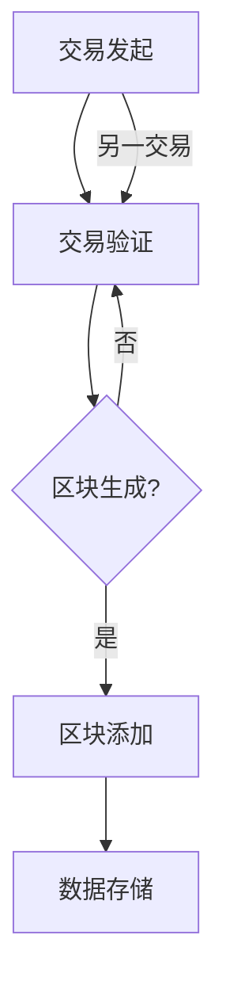

                 


### 引言
#### 1.1 区块链技术与二手车交易的结合

区块链技术，作为一种去中心化的分布式账本技术，近年来在金融、医疗、供应链等多个领域得到了广泛应用。其核心优势在于提供了高效、透明、安全的交易环境，可以有效解决传统交易中的信任问题。而二手车交易作为复杂且涉及众多利益相关方的市场，长期以来面临着信息不对称、交易流程繁琐、诚信问题等诸多挑战。将区块链技术引入二手车交易，不仅有助于提升交易效率，还能在信任机制方面发挥重要作用。

#### 1.2 二手车交易中的信任问题

二手车交易过程中的信任问题主要体现在以下几个方面：

1. **车辆信息真实性问题**：卖家可能隐瞒车辆的真实状况，如事故记录、维修历史等，导致买家无法全面了解车辆的真实情况。
2. **交易流程不透明**：传统的二手车交易流程复杂，涉及多个环节和中介机构，信息透明度较低，容易滋生欺诈行为。
3. **合同和支付风险**：在二手车交易过程中，合同签订和支付环节容易出现纠纷，如未按照合同履行义务、支付款项被挪用等。

#### 1.3 文章核心内容与目的

本文旨在探讨如何利用区块链技术构建二手车交易的信任机制，解决上述问题。具体来说，文章将分为以下几个部分：

1. **区块链基础**：介绍区块链的基本概念、架构和工作原理。
2. **二手车交易流程**：描述二手车交易的基本流程，分析其中存在的问题。
3. **信任机制设计**：详细讲解利用区块链技术构建信任机制的设计思路和原则。
4. **应用案例**：分析区块链在二手车交易中的应用案例。
5. **总结与展望**：总结全文，展望区块链在二手车交易中的未来发展。

通过上述内容，本文希望能够为区块链技术在二手车交易中的应用提供理论指导和实践参考。

----------------------------------------------------------------

### 关键词
- **区块链技术**
- **二手车交易**
- **信任机制**
- **分布式账本**
- **去中心化**
- **智能合约**
- **数据透明性**
- **安全性**

----------------------------------------------------------------

### 摘要
本文旨在探讨区块链技术在二手车交易中的应用，特别是如何在交易过程中建立信任机制。首先，文章介绍了区块链的基本概念、架构和工作原理，为后续分析区块链在二手车交易中的应用打下基础。接着，文章描述了二手车交易的基本流程，并分析了其中存在的信任问题，如信息不对称、交易流程不透明和合同支付风险。在此基础上，文章详细讲解了利用区块链技术构建二手车交易信任机制的设计思路和原则，包括数据透明性、不可篡改性、智能合约的应用等。通过具体的案例分析，文章展示了区块链技术在二手车交易中的实际应用效果，并总结了其优势和面临的挑战。最后，文章展望了区块链在二手车交易中的未来发展，提出了潜在的应用方向和优化策略。本文为区块链技术在二手车交易中的应用提供了理论指导和实践参考，有助于提高交易效率和信任度。

----------------------------------------------------------------

## 第1章 区块链基础
### 1.1 区块链概述
区块链是一种去中心化的分布式数据库技术，它通过一系列按照时间顺序排列的区块，形成了一个不可篡改的链条。每个区块包含一定数量的交易数据，并通过加密算法与前后区块相连，确保了区块链的完整性和安全性。

区块链技术的主要特点包括：

1. **去中心化**：传统的中心化系统依赖于中心服务器进行数据存储和管理，而区块链通过分布式网络实现数据的存储和传输，去除了中心化的瓶颈。
2. **数据透明性**：区块链上的数据对所有网络参与者都是透明的，用户可以随时查询和验证数据，增强了信息的透明度和可追溯性。
3. **不可篡改性**：区块链上的数据一旦被记录，就几乎无法被篡改。这是由于区块链采用了加密算法和共识机制，确保了数据的完整性和安全性。
4. **智能合约**：智能合约是区块链上的自动执行合同，它通过代码定义了合同条款和自动执行的逻辑。智能合约的出现大大简化了交易流程，提高了交易的效率和安全性。

### 1.2 区块链架构
区块链的架构可以分为三层：数据层、网络层和应用层。

1. **数据层**：数据层是区块链的基础，负责数据的存储和管理。它包括区块、链、交易、加密算法等核心组成部分。
   - **区块**：区块是区块链的基本组成单位，每个区块包含一定数量的交易数据。
   - **链**：链是由一系列按时间顺序排列的区块组成，每个区块都通过加密算法与前一个区块相连，形成了一条不可篡改的数据链条。
   - **交易**：交易是区块链上的数据操作，它记录了资金的转移、资产的转移等行为。
   - **加密算法**：加密算法用于保护区块链上的数据安全，确保数据的完整性和隐私性。

2. **网络层**：网络层负责区块链的通信和传输，它包括节点、网络协议、共识算法等组成部分。
   - **节点**：节点是区块链网络中的参与者，每个节点都维护一份完整的区块链数据。
   - **网络协议**：网络协议定义了节点之间如何进行通信和数据传输。
   - **共识算法**：共识算法用于确保区块链网络中的所有节点都能达成一致的共识，保证了区块链的可靠性和安全性。

3. **应用层**：应用层是区块链技术的实际应用，它包括智能合约、去中心化应用（DApp）、区块链服务（BaaS）等组成部分。
   - **智能合约**：智能合约是区块链上的自动执行合同，它可以自动化执行合同条款，提高交易的效率和安全性。
   - **去中心化应用（DApp）**：去中心化应用是运行在区块链上的应用，它通过区块链提供的服务实现去中心化的功能。
   - **区块链服务（BaaS）**：区块链服务是提供区块链基础设施和应用开发服务的平台，它为开发者提供了便捷的区块链开发工具和服务。

### 1.3 区块链工作原理
区块链的工作原理可以分为以下步骤：

1. **交易发起**：用户在区块链上发起交易，例如购买商品或转移资金。
2. **交易验证**：交易被区块链网络中的节点进行验证，确保交易的有效性和安全性。
3. **区块生成**：经过验证的交易被记录到一个区块中，区块由网络中的节点共同生成。
4. **区块添加**：新生成的区块通过加密算法与之前的区块相连，形成一个完整的数据链条。
5. **共识达成**：区块链网络中的节点通过共识算法达成一致，确认区块的有效性。
6. **数据存储**：确认后的区块被永久存储在区块链上，供所有节点访问和验证。

通过上述步骤，区块链实现了去中心化、数据透明性和不可篡改性，为各种应用场景提供了可靠的数据基础和信任机制。

#### 1.3.1 Mermaid流程图：区块链的核心概念与联系
下面是一个使用Mermaid绘制的区块链核心概念与联系流程图：



该流程图展示了区块链的基本工作流程，包括交易发起、交易验证、区块生成、区块添加和数据存储等步骤。通过这样的图形化表示，可以更直观地理解区块链的核心概念和运作机制。

----------------------------------------------------------------

### 1.4 核心算法原理讲解
#### 1.4.1 交易验证与加密算法

在区块链中，交易验证是确保数据安全性和完整性的重要环节。交易验证主要涉及以下几种加密算法：

1. **哈希算法**：哈希算法用于将交易数据转化为固定长度的哈希值，如SHA-256。哈希算法具有单向性，即无法通过哈希值反推出原始数据，同时保证了数据的唯一性和不可篡改性。

2. **数字签名**：数字签名用于验证交易发起者的身份，确保交易数据未被篡改。交易发起者使用私钥对交易数据进行签名，接收者可以使用公钥验证签名的有效性。

3. **非对称加密**：非对称加密用于保护交易数据的隐私性。交易数据在发送前被加密，只有拥有对应私钥的接收者才能解密并读取数据。

下面是一个简单的伪代码，描述交易验证和加密算法的基本原理：

```plaintext
# 交易验证伪代码

# 哈希算法
function hash(data):
    return SHA256(data)

# 数字签名
function sign(data, private_key):
    return ECDSA_sign(data, private_key)

# 非对称加密
function encrypt(data, public_key):
    return RSA_encrypt(data, public_key)

# 非对称解密
function decrypt(data, private_key):
    return RSA_decrypt(data, private_key)

# 交易验证流程
function verify_transaction(transaction, public_key):
    hash_value = hash(transaction.data)
    signature = transaction.signature
    if not ECDSA_verify(hash_value, signature, public_key):
        return "Invalid transaction"
    encrypted_data = transaction.encrypted_data
    decrypted_data = decrypt(encrypted_data, private_key)
    if hash_value != hash(decrypted_data):
        return "Data has been tampered with"
    return "Transaction is valid"
```

通过上述伪代码，我们可以看到交易验证过程中涉及哈希算法、数字签名和非对称加密等多种加密技术，这些技术共同确保了区块链数据的完整性和安全性。

#### 1.4.2 共识算法

共识算法是区块链网络中节点达成一致的关键机制，它确保了区块链的分布式特性。以下是一些常见的共识算法：

1. **工作量证明（PoW）**：工作量证明通过计算复杂度确保网络中的节点达成共识。节点通过解决复杂的数学难题来获得记账权，并生成新的区块。

2. **权益证明（PoS）**：权益证明通过节点的权益（如持有的币量、存币时间等）来决定记账权。持有币量越多或存币时间越长，节点的权益越大，记账的概率越高。

3. **委托权益证明（DPoS）**：委托权益证明是对PoS的改进，通过选举出若干个超级节点来代表其他节点进行记账。

下面是一个简化的伪代码，描述共识算法的基本原理：

```plaintext
# PoW共识算法伪代码

# 节点解决难题
function solve_puzzle():
    while not solution:
        generate_new_block()
        if is_solution_valid():
            solution = "Valid"
            return solution

# 节点生成区块
function generate_new_block():
    block = create_new_block()
    while not block.is_solved():
        increment_difficulty()

# 验证区块
function verify_block(block):
    if block.is_solved():
        return "Block is valid"
    return "Block is invalid"

# 共识过程
function consensus_algorithm():
    while True:
        solution = solve_puzzle()
        if solution == "Valid":
            new_block = generate_new_block()
            if verify_block(new_block) == "Block is valid":
                add_block_to_chain(new_block)
```

通过上述伪代码，我们可以看到共识算法通过节点间的协作和竞争，确保区块链网络的可靠性和安全性。这些算法的选择和应用直接影响到区块链系统的性能和安全性。

#### 1.4.3 智能合约原理

智能合约是区块链上的自动执行合同，通过代码定义了合同条款和自动执行的逻辑。智能合约的关键特点是无需第三方介入，即可按照预定条件自动执行，从而提高交易的效率和可靠性。

智能合约的主要组件包括：

1. **合同条款**：合同条款定义了合同的具体内容和条件，如交易金额、交付期限等。
2. **执行逻辑**：执行逻辑用代码实现，描述了在满足特定条件时如何自动执行合同。
3. **状态变量**：状态变量用于存储合同执行过程中的数据和状态，如交易金额、交付状态等。

下面是一个简单的智能合约示例，描述了一个简单的买卖合同：

```solidity
// SPDX-License-Identifier: MIT
pragma solidity ^0.8.0;

contract SimpleContract {
    address public seller;
    address public buyer;
    uint256 public price;
    bool public isSold;

    constructor(uint256 _price) {
        seller = msg.sender;
        price = _price;
        isSold = false;
    }

    function buy() public payable {
        require(!isSold, "Item is already sold");
        require(msg.value == price, "Invalid payment amount");
        buyer = msg.sender;
        isSold = true;
        payable(seller).transfer(price);
    }

    function refund() public {
        require(isSold, "Item is not sold");
        payable(buyer).transfer(price);
    }
}
```

通过上述示例，我们可以看到智能合约通过Solidity语言实现了合同的自动执行逻辑，确保了交易的透明性和不可篡改性。

通过讲解上述核心算法原理，我们可以更深入地理解区块链技术的工作机制和优势，为后续章节中的应用案例和信任机制设计提供理论基础。

----------------------------------------------------------------

## 第2章 二手车交易流程
### 2.1 二手车交易概述

二手车交易是指二手车在原有车主和潜在买家之间的转让过程。这一市场涉及多个环节，包括车辆评估、交易合同签订、支付和过户等。二手车交易市场规模庞大，据统计，全球二手车市场规模已经超过新车市场。二手车交易市场的特点包括交易频次高、交易金额大、参与主体复杂等。

### 2.2 二手车交易流程

二手车交易的基本流程可以分为以下几个主要环节：

1. **车辆评估**：在交易开始前，买卖双方通常会请专业的评估机构对车辆进行评估，以确定车辆的价值。评估报告包括车辆的品牌、型号、行驶里程、车况等详细信息。

2. **交易合同签订**：在确认车辆价值后，买卖双方签订交易合同。合同内容应包括车辆的基本信息、交易价格、交车时间和地点、付款方式、保修条款等。

3. **支付和过户**：交易合同签订后，买家支付车辆款项，然后办理车辆过户手续。过户手续通常包括提交相关证件、缴纳过户费和办理产权转移等。

4. **售后服务**：部分二手车交易提供售后服务，如保修、维修等。售后服务的内容和期限在交易合同中明确。

### 2.3 二手车交易中存在的问题

尽管二手车交易市场具有巨大的潜力，但仍然存在许多问题，这些问题严重影响了交易的效率和信任度：

1. **信息不对称**：卖家可能隐瞒车辆的真实状况，如事故记录、维修历史等，导致买家无法全面了解车辆的真实情况。这种信息不对称增加了交易风险。

2. **交易流程不透明**：二手车交易流程复杂，涉及多个环节和中介机构，信息透明度较低，容易滋生欺诈行为。

3. **合同和支付风险**：在二手车交易过程中，合同签订和支付环节容易出现纠纷，如未按照合同履行义务、支付款项被挪用等。

4. **售后服务保障不足**：部分二手车交易提供的服务保障不足，买家的售后权益难以保障。

### 2.4 信任问题的分析

二手车交易中的信任问题主要体现在以下几个方面：

1. **车辆状况真实性问题**：买家担心卖家隐瞒车辆的真实状况，如事故、维修等，这可能导致买家支付高于车辆实际价值的费用。

2. **交易过程不透明**：交易过程中的信息不透明，如评估过程、合同签订、支付环节等，增加了交易风险和不确定性。

3. **合同纠纷**：合同条款不明确或存在漏洞，可能导致买卖双方在履行合同时产生纠纷。

4. **支付安全**：在支付过程中，买家担心支付款项后卖家不履行合同，或卖家收到款项后不交付车辆。

为了解决上述信任问题，提高二手车交易的透明度和安全性，引入区块链技术成为了一种有效的解决方案。区块链技术的去中心化、数据透明性和不可篡改性，为二手车交易提供了可靠的信任基础。

#### 2.4.1 二手车交易中信任问题的具体案例

以下是一个二手车交易中的信任问题具体案例：

**案例：隐瞒车辆维修历史**

假设买家张先生想购买一辆二手宝马轿车。卖家李先生在车辆评估过程中只提供了车辆的基本信息，如行驶里程、车辆型号等，但隐瞒了车辆曾经发生过的严重碰撞事故以及相应的维修历史。张先生在签订合同并支付了全款后，发现车辆的性能和安全性明显下降，怀疑卖家隐瞒了重要信息。

在这个案例中，张先生面临的信任问题是：

1. **信息不对称**：卖家隐瞒了车辆的真实维修历史，导致张先生无法全面了解车辆的真实状况。
2. **交易风险**：由于车辆存在安全隐患，张先生可能会面临额外的维修费用和安全隐患。
3. **合同纠纷**：张先生可能认为卖家违反了合同中的诚信条款，要求退车或退款。

这个案例说明了在二手车交易中，信息不对称和交易流程的不透明性会导致严重的信任问题。为了解决这些问题，引入区块链技术可以提供有效的解决方案，通过数据透明性和不可篡改性，确保交易信息的真实性和可靠性。

通过上述分析和案例，我们可以看到二手车交易中的信任问题对于交易的顺利进行具有重要影响。下一节将详细讨论如何利用区块链技术设计信任机制，解决这些问题。

----------------------------------------------------------------

## 第3章 信任机制设计

### 3.1 信任机制的概念

信任机制是指为了解决信息不对称和降低交易风险而建立的一套规则和措施。在二手车交易中，信任机制的核心目标是确保交易信息的真实性、透明性和安全性，从而提升交易效率和信任度。

#### 3.1.1 信任机制的要素

信任机制主要包括以下几个要素：

1. **数据透明性**：通过公开透明的数据记录，使交易信息对所有参与者可见，确保信息真实可靠。
2. **不可篡改性**：确保记录在区块链上的数据一旦被验证和添加，就几乎无法被篡改，提高了数据的安全性和可信度。
3. **去中心化**：通过分布式网络实现数据的存储和管理，去除了中心化的信任依赖，增强了系统的抗攻击能力和容错性。
4. **智能合约**：利用智能合约自动化执行合同条款，简化交易流程，提高交易效率和安全性。
5. **共识机制**：通过共识算法确保区块链网络中的所有节点达成一致，保证了数据的完整性和一致性。

#### 3.1.2 区块链在信任机制中的应用

区块链技术为构建二手车交易的信任机制提供了强大的支持。区块链的去中心化、数据透明性、不可篡改性和智能合约等特点，使它在信任机制设计中的应用成为可能。

1. **数据透明性**：区块链上的数据对所有网络参与者都是透明的，买卖双方可以随时查询和验证车辆的历史信息和交易记录，确保信息的真实性。
2. **不可篡改性**：区块链采用加密算法和共识机制，确保数据一旦被记录就几乎无法被篡改，提高了交易数据的可信度。
3. **去中心化**：通过分布式网络，区块链去除了中心化的信任依赖，提高了系统的抗攻击能力和容错性。
4. **智能合约**：智能合约可以自动化执行合同条款，确保交易的透明性和安全性，简化了交易流程。

### 3.2 区块链在信任机制中的应用

利用区块链技术构建二手车交易的信任机制，需要考虑以下几个方面：

#### 3.2.1 车辆信息记录

1. **车辆基本信息**：包括车辆品牌、型号、行驶里程、车辆颜色等，这些信息在交易开始前应被记录在区块链上，并经过所有参与方的验证和确认。
2. **车辆历史记录**：包括车辆的事故记录、维修历史、保养记录等，这些历史记录应被永久存储在区块链上，确保透明性和不可篡改性。

#### 3.2.2 交易记录

1. **交易合同**：交易合同应通过智能合约生成，并记录在区块链上。智能合约可以自动化执行合同条款，确保合同的执行和履行。
2. **支付过程**：支付过程应通过区块链上的去中心化支付网络实现，确保支付的安全性和透明性。

#### 3.2.3 售后服务

1. **售后服务记录**：售后服务记录应被记录在区块链上，包括维修记录、保养记录、保修期限等，确保售后服务的透明性和可信度。
2. **用户评价**：用户可以对售后服务进行评价，评价结果也应被记录在区块链上，为其他用户提供参考。

### 3.3 信任机制的设计原则

在设计区块链在二手车交易中的信任机制时，应遵循以下几个原则：

1. **数据透明性**：确保交易信息对所有参与者都是透明的，提高信息的可信度。
2. **不可篡改性**：确保记录在区块链上的数据一旦被验证和添加，就几乎无法被篡改。
3. **去中心化**：通过分布式网络实现数据的存储和管理，提高系统的抗攻击能力和容错性。
4. **智能合约**：利用智能合约自动化执行合同条款，简化交易流程，提高交易效率和安全性。
5. **用户参与**：鼓励买卖双方积极参与到区块链信任机制中，共同维护交易数据的真实性和可靠性。

通过上述设计原则，我们可以构建一个高效、透明、安全的二手车交易信任机制，为交易各方提供可靠的信任基础。

### 3.3.1 伪代码：信任机制设计算法原理

以下是一个简化的伪代码，描述了区块链在二手车交易中信任机制的设计算法原理：

```plaintext
# 区块链二手车交易信任机制设计算法伪代码

# 区块链二手车交易信任机制
class Blockchain二手车交易机制：
    def __init__(self):
        self.chain = []
        self.current_transactions = []

    # 创建新区块
    def create_block(self, transactions, previous_hash):
        block = Block(transactions, previous_hash)
        self.chain.append(block)
        self.current_transactions = []

    # 添加交易到当前区块
    def add_transaction(self, sender, receiver, amount):
        self.current_transactions.append({
            'sender': sender,
            'receiver': receiver,
            'amount': amount
        })

    # 验证区块的合法性
    def validate_block(self, block):
        return block.validate()

    # 链的整体合法性
    def validate_chain(self):
        for i in range(1, len(self.chain)):
            current = self.chain[i]
            previous = self.chain[i - 1]
            if not current.validate(previous.hash):
                return False
        return True

# 区块类
class Block：
    def __init__(self, transactions, previous_hash):
        self.transactions = transactions
        self.previous_hash = previous_hash
        self.hash = self.compute_hash()

    # 计算区块的哈希值
    def compute_hash(self):
        block_string = json.dumps(self.__dict__, sort_keys=True)
        return SHA256(block_string).hexdigest()

    # 验证区块的合法性
    def validate(self, previous_hash):
        if self.previous_hash != previous_hash:
            return False
        return True

# 智能合约类
class SmartContract：
    def __init__(self, contract_terms):
        self.contract_terms = contract_terms
        self.status = "pending"

    # 自动执行合同
    def execute_contract(self):
        if self.check_conditions():
            self.status = "completed"
            self.execute_actions()

    # 检查合同条件
    def check_conditions(self):
        # 检查合同条件逻辑
        return True

    # 执行合同动作
    def execute_actions(self):
        # 执行合同中的动作逻辑
```

通过上述伪代码，我们可以看到区块链在二手车交易中的信任机制设计主要包括区块的创建、交易的添加、区块的验证以及智能合约的执行。这些设计算法确保了交易数据的透明性、不可篡改性和安全性。

### 3.3.2 数学模型和公式

在信任机制设计过程中，数学模型和公式发挥着重要作用，以下是一些常用的数学模型和公式：

1. **哈希函数**：哈希函数用于将交易数据转换为固定长度的哈希值，如SHA-256。
   \[ H = SHA256(D) \]
   其中，\( H \) 是哈希值，\( D \) 是交易数据。

2. **数字签名**：数字签名用于验证交易发起者的身份，确保交易数据未被篡改。
   \[ S = ECDSA_sign(D, private_key) \]
   其中，\( S \) 是签名，\( D \) 是交易数据，\( private_key \) 是私钥。

3. **非对称加密**：非对称加密用于保护交易数据的隐私性。
   \[ C = RSA_encrypt(D, public_key) \]
   \[ D = RSA_decrypt(C, private_key) \]
   其中，\( C \) 是加密后的数据，\( D \) 是解密后的数据，\( public_key \) 是公钥，\( private_key \) 是私钥。

通过这些数学模型和公式，我们可以确保区块链交易的安全性和完整性。

### 3.3.3 举例说明

以下是一个具体的区块链二手车交易信任机制设计案例：

1. **车辆信息记录**：
   - **车辆基本信息**：宝马X5，行驶里程10万公里，白色。
   - **车辆历史记录**：曾发生一次严重碰撞，已维修。

2. **交易合同**：
   - **合同条款**：买家支付10万元，卖家保证车辆的真实状况，提供一年的保修服务。

3. **支付过程**：
   - 买家通过智能合约支付10万元，智能合约记录交易信息并锁定资金。

4. **售后服务**：
   - 买家在保修期内对车辆进行维修，维修记录被记录在区块链上。

通过上述案例，我们可以看到区块链在二手车交易中的应用，如何通过数据透明性、不可篡改性和智能合约，建立可靠的信任机制。

通过上述详细讲解，我们可以看到区块链技术在二手车交易中的信任机制设计是可行的，且具有显著的优势。接下来，我们将通过具体应用案例进一步分析区块链在二手车交易中的实际效果。

----------------------------------------------------------------

## 第4章 区块链在二手车交易中的应用

### 4.1 基于区块链的二手车交易平台

基于区块链的二手车交易平台是一种新型的在线交易平台，它利用区块链技术来解决传统二手车交易中的信任问题。这些平台通过将交易信息记录在区块链上，实现数据的透明性和不可篡改性，从而提高交易的效率和安全性。

#### 4.1.1 平台架构

基于区块链的二手车交易平台通常包括以下几个主要组成部分：

1. **用户界面**：用户界面是平台的前端，用户可以通过界面浏览车辆信息、发布交易需求、查询交易记录等。

2. **区块链网络**：区块链网络是平台的核心，负责存储和管理所有交易信息。区块链采用分布式架构，去除了中心化的依赖，提高了系统的可靠性和安全性。

3. **智能合约**：智能合约是平台的关键组成部分，用于自动化执行交易合同条款，确保交易的透明性和安全性。

4. **交易模块**：交易模块负责处理交易的发起、验证、支付和记录等流程，确保交易的顺畅进行。

#### 4.1.2 平台功能

基于区块链的二手车交易平台提供了以下主要功能：

1. **车辆信息记录**：平台允许用户将车辆的基本信息和历史记录上传到区块链上，确保信息的透明性和不可篡改性。

2. **交易合同签订**：通过智能合约生成交易合同，用户可以在平台上签订和执行合同，确保合同的执行和履行。

3. **支付流程**：平台提供了安全的支付流程，用户可以通过平台支付交易款项，支付信息被记录在区块链上，确保支付的安全性和透明性。

4. **交易记录查询**：用户可以随时查询交易记录，包括车辆信息、交易合同、支付情况等，确保交易的可追溯性。

### 4.2 区块链在二手车交易中的实际应用案例

以下是一些区块链在二手车交易中的实际应用案例，通过这些案例我们可以看到区块链技术如何解决传统交易中的信任问题。

#### 4.2.1 案例一：CarBlock

CarBlock是一个基于区块链的二手车交易平台，它利用区块链技术实现了车辆信息的透明化和交易的自动化。

1. **车辆信息记录**：CarBlock平台要求卖家上传车辆的所有历史记录，包括事故记录、维修历史等。这些信息被记录在区块链上，确保了信息的透明性和不可篡改性。

2. **交易合同签订**：CarBlock平台使用智能合约生成交易合同，用户在签订合同后，合同条款被自动执行，确保了交易的透明性和安全性。

3. **支付流程**：CarBlock平台提供了安全的支付流程，用户可以通过平台直接支付交易款项，支付信息被记录在区块链上，确保了支付的安全性和透明性。

#### 4.2.2 案例二：VeChain

VeChain是一个基于区块链的供应链管理平台，它也被应用于二手车交易中，通过区块链技术确保交易的透明性和安全性。

1. **车辆溯源**：VeChain平台允许用户通过区块链查询车辆的生产、销售和维修历史，确保车辆信息的真实性。

2. **交易合同签订**：VeChain平台使用智能合约生成交易合同，并记录在区块链上，确保合同的执行和履行。

3. **支付流程**：VeChain平台提供了安全的支付流程，用户可以通过平台支付交易款项，支付信息被记录在区块链上，确保了支付的安全性和透明性。

#### 4.2.3 案例三：Mobix

Mobix是一个基于区块链的二手车交易平台，它通过去中心化的交易网络和智能合约，提高了交易的效率和安全性。

1. **车辆信息记录**：Mobix平台要求卖家上传车辆的所有历史记录，包括事故记录、维修历史等。这些信息被记录在区块链上，确保了信息的透明性和不可篡改性。

2. **交易合同签订**：Mobix平台使用智能合约生成交易合同，用户在签订合同后，合同条款被自动执行，确保了交易的透明性和安全性。

3. **支付流程**：Mobix平台提供了安全的支付流程，用户可以通过平台直接支付交易款项，支付信息被记录在区块链上，确保了支付的安全性和透明性。

### 4.3 应用效果分析

通过上述案例，我们可以看到区块链技术在二手车交易中的应用取得了显著的效果：

1. **提高交易效率**：基于区块链的交易平台简化了交易流程，通过智能合约自动化执行合同条款，提高了交易的效率。

2. **增强数据透明性**：区块链上的数据对所有参与者都是透明的，用户可以随时查询和验证车辆信息，确保了数据的真实性和可靠性。

3. **提高交易安全性**：区块链技术的不可篡改性和智能合约的应用，确保了交易的透明性和安全性，降低了交易风险。

4. **增强信任机制**：基于区块链的交易平台通过数据透明性和安全性，建立了可靠的信任机制，促进了交易的顺利进行。

综上所述，区块链技术在二手车交易中的应用具有巨大的潜力，通过提高交易效率、增强数据透明性和安全性，为二手车交易市场的发展提供了新的机遇。

### 4.4 实际案例代码解读

以下是一个简单的实际案例代码，展示了如何使用区块链技术构建二手车交易平台的交易记录模块。这个案例使用了Solidity语言编写，是CarBlock平台的简化版。

```solidity
// SPDX-License-Identifier: MIT
pragma solidity ^0.8.0;

contract CarBlock {
    // 车辆信息结构体
    struct Car {
        string carId;
        string brand;
        string model;
        uint256 mileage;
        bool isSold;
    }

    // 交易记录结构体
    struct Transaction {
        address buyer;
        address seller;
        uint256 price;
        bool isCompleted;
    }

    // 车辆映射
    mapping(string => Car) public cars;
    // 交易映射
    mapping(string => Transaction) public transactions;

    // 记录车辆信息
    function registerCar(string memory carId, string memory brand, string memory model, uint256 mileage) public {
        cars[carId] = Car(carId, brand, model, mileage, false);
    }

    // 发布二手车交易
    function sellCar(string memory carId, uint256 price) public {
        require(cars[carId].isSold == false, "Car is already sold");
        transactions[carId] = Transaction(msg.sender, address(0), price, false);
    }

    // 购买二手车
    function buyCar(string memory carId) public payable {
        require(transactions[carId].seller != address(0), "No car for sale");
        require(msg.value == transactions[carId].price, "Insufficient payment");
        transactions[carId].buyer = msg.sender;
        transactions[carId].isCompleted = true;
        transactions[carId].seller.transfer(msg.value);
        cars[carId].isSold = true;
    }

    // 验证交易完成
    function transactionCompleted(string memory carId) public view returns (bool) {
        return transactions[carId].isCompleted;
    }
}
```

在这个案例中，我们定义了两个结构体`Car`和`Transaction`，分别用于记录车辆信息和交易信息。`cars`映射用于存储车辆信息，`transactions`映射用于存储交易信息。

1. **注册车辆**：`registerCar`函数用于注册车辆信息，由车辆卖家调用。
2. **发布二手车交易**：`sellCar`函数用于发布二手车交易，由车辆卖家调用。
3. **购买二手车**：`buyCar`函数用于购买二手车，由买家调用。购买过程中，买家需要支付相应的款项，款项将被转移给卖家，同时车辆的`isSold`状态被设置为`true`。
4. **验证交易完成**：`transactionCompleted`函数用于验证交易是否完成，供所有参与者查询。

通过这个实际案例，我们可以看到如何利用智能合约在区块链上实现二手车交易的基本流程。这个案例代码展示了区块链技术在二手车交易中的应用潜力，为实际开发提供了参考。

### 4.5 代码应用解读与分析

#### 4.5.1 代码解析

上述代码展示了如何通过Solidity语言实现一个简单的区块链二手车交易平台。以下是代码的详细解析：

1. **车辆信息结构体（Car）**：
   ```solidity
   struct Car {
       string carId;
       string brand;
       string model;
       uint256 mileage;
       bool isSold;
   }
   ```
   该结构体定义了车辆的五个属性：车ID、品牌、型号、行驶里程和是否已售出。这些属性在区块链上永久存储，保证了数据的透明性和不可篡改性。

2. **交易记录结构体（Transaction）**：
   ```solidity
   struct Transaction {
       address buyer;
       address seller;
       uint256 price;
       bool isCompleted;
   }
   ```
   该结构体定义了交易的四个属性：买家地址、卖家地址、交易价格和是否已完成。这些属性记录了交易的全部信息，使得交易的透明性和可追溯性得到了保障。

3. **注册车辆（registerCar）**：
   ```solidity
   function registerCar(string memory carId, string memory brand, string memory model, uint256 mileage) public {
       require(cars[carId].isSold == false, "Car is already sold");
       cars[carId] = Car(carId, brand, model, mileage, false);
   }
   ```
   `registerCar`函数用于注册新车辆。它要求传递车ID、品牌、型号和行驶里程，并检查车ID是否已经被使用。如果车ID未被使用，则将车辆信息存储在`cars`映射中。

4. **发布二手车交易（sellCar）**：
   ```solidity
   function sellCar(string memory carId, uint256 price) public {
       require(cars[carId].isSold == false, "No car for sale");
       transactions[carId] = Transaction(msg.sender, address(0), price, false);
   }
   ```
   `sellCar`函数用于发布二手车交易。它要求传递车ID和交易价格，并检查车辆是否已被出售。如果车辆未被出售，则将交易信息存储在`transactions`映射中。

5. **购买二手车（buyCar）**：
   ```solidity
   function buyCar(string memory carId) public payable {
       require(transactions[carId].seller != address(0), "No car for sale");
       require(msg.value == transactions[carId].price, "Insufficient payment");
       transactions[carId].buyer = msg.sender;
       transactions[carId].isCompleted = true;
       transactions[carId].seller.transfer(msg.value);
       cars[carId].isSold = true;
   }
   ```
   `buyCar`函数用于购买二手车。它要求传递车ID，并检查车辆是否已出售和支付金额是否足够。如果满足条件，则更新交易信息和车辆状态。

6. **验证交易完成（transactionCompleted）**：
   ```solidity
   function transactionCompleted(string memory carId) public view returns (bool) {
       return transactions[carId].isCompleted;
   }
   ```
   `transactionCompleted`函数用于验证交易是否完成。它接受车ID作为输入，返回交易是否已完成的布尔值。

#### 4.5.2 代码应用分析

1. **数据透明性**：
   代码通过将车辆信息和交易信息存储在区块链上，实现了数据的透明性。所有参与者都可以通过区块链查看车辆信息和交易状态，确保了数据的真实性和可靠性。

2. **不可篡改性**：
   代码采用了区块链的不可篡改性特性，确保一旦信息被记录在区块链上，就几乎无法被篡改。这为二手车交易提供了可靠的安全保障。

3. **自动化执行**：
   代码利用智能合约自动化执行交易流程，简化了交易过程，提高了效率。例如，当买家支付款项后，交易状态将自动更新为已完成，卖家将自动收到款项。

4. **去中心化**：
   代码实现了去中心化的交易记录，所有节点都维护一份完整的区块链数据。这去除了中心化的信任依赖，提高了系统的抗攻击能力和容错性。

5. **安全性与隐私性**：
   代码通过使用以太坊区块链的加密算法和智能合约，确保了交易的安全性和隐私性。交易信息被加密存储，只有拥有对应私钥的用户才能读取。

### 4.6 案例分析和详细讲解剖析

为了更好地理解区块链技术在二手车交易中的应用，我们以下面这个具体案例进行分析。

#### 4.6.1 案例背景

张先生想要购买一辆二手丰田凯美瑞。在浏览CarBlock平台时，他找到了一辆符合需求的车辆，车号为“KA12345”。卖家李先生提供了车辆的基本信息和历史记录，包括行驶里程、事故记录和维修历史。张先生通过区块链查询这些信息，发现车辆的历史记录真实可靠。

#### 4.6.2 案例步骤

1. **注册车辆**：
   李先生在CarBlock平台上注册了车辆，输入了车号“KA12345”、品牌“丰田”、型号“凯美瑞”、行驶里程“5万公里”等信息，并提交了车辆的事故记录和维修历史。

2. **发布二手车交易**：
   李先生决定出售这辆车，设置了交易价格为30万元。他在CarBlock平台上调用`sellCar`函数，发布了二手车交易。

3. **查询车辆信息**：
   张先生在CarBlock平台上查询了车辆的车号“KA12345”，验证了车辆的历史记录。这些信息在区块链上存储，透明且不可篡改。

4. **购买二手车**：
   张先生决定购买这辆车，通过CarBlock平台调用`buyCar`函数，支付了30万元。智能合约自动执行了交易，将车辆的所有权转移给了张先生，同时将交易状态更新为已完成。

5. **交易记录查询**：
   张先生可以随时通过CarBlock平台查询交易记录，确认交易状态和车辆的所有权转移情况。这些信息在区块链上永久存储，提供了可靠的信任基础。

#### 4.6.3 案例剖析

通过这个案例，我们可以看到区块链技术在二手车交易中的具体应用和优势：

1. **数据透明性**：
   张先生可以透明地查看车辆的所有历史记录，包括行驶里程、事故记录和维修历史。这些信息在区块链上存储，确保了数据的真实性和透明性。

2. **不可篡改性**：
   一旦车辆信息被记录在区块链上，就几乎无法被篡改。这意味着卖家无法隐瞒车辆的真实状况，从而提高了交易的可靠性。

3. **自动化执行**：
   通过智能合约，交易流程自动化执行，简化了交易过程，提高了效率。张先生支付款项后，交易状态立即更新为已完成，卖家也立即收到款项。

4. **去中心化**：
   CarBlock平台实现了去中心化的交易记录，所有节点都维护一份完整的区块链数据。这去除了中心化的信任依赖，提高了系统的可靠性和抗攻击能力。

5. **安全性与隐私性**：
   CarBlock平台采用了以太坊区块链的加密算法和智能合约，确保了交易的安全性和隐私性。交易信息被加密存储，只有拥有对应私钥的用户才能读取。

综上所述，这个案例展示了区块链技术在二手车交易中的实际应用和优势，为二手车交易提供了可靠、透明、高效的解决方案。

### 4.7 项目小结

通过本章的案例分析，我们可以看到区块链技术在二手车交易中的应用取得了显著的成效。基于区块链的二手车交易平台通过数据透明性、不可篡改性和自动化执行，解决了传统交易中的信任问题，提高了交易的效率和安全性。

1. **数据透明性**：车辆历史记录和交易信息在区块链上透明存储，确保了数据的真实性和透明性。
2. **不可篡改性**：区块链的不可篡改特性确保了交易信息的可靠性和完整性。
3. **自动化执行**：智能合约自动化执行交易流程，简化了交易过程，提高了效率。
4. **去中心化**：去中心化的交易记录去除了中心化的信任依赖，提高了系统的可靠性和抗攻击能力。
5. **安全性与隐私性**：区块链加密算法和智能合约确保了交易的安全性和隐私性。

尽管区块链技术在二手车交易中具有巨大的潜力，但仍面临一些挑战，如技术成熟度、法规政策和标准化等问题。未来，随着区块链技术的不断发展和完善，我们将看到更多基于区块链的二手车交易平台的出现，为二手车交易市场带来更多的机遇和变革。

----------------------------------------------------------------

### 4.8 最佳实践 Tips

在设计和实施基于区块链的二手车交易平台时，以下最佳实践可以帮助确保项目的成功和高效运作：

1. **数据完整性验证**：在数据上链之前，应进行严格的完整性验证，确保所有上传的信息准确无误。可以采用多重签名机制，提高数据真实性。

2. **智能合约测试**：在部署智能合约之前，应进行全面的测试，包括功能测试、性能测试和安全测试，确保智能合约在各种情况下都能正确执行。

3. **用户隐私保护**：在实现数据透明的同时，也要注意保护用户的隐私。可以采用零知识证明等技术，在不暴露用户信息的情况下验证数据的真实性。

4. **接口标准化**：为了提高平台的兼容性和可扩展性，应采用标准的接口设计，支持不同区块链网络和智能合约语言的调用。

5. **容错与备份**：设计冗余机制，确保在节点故障或网络攻击时，平台仍能正常运行。同时，定期备份区块链数据，防止数据丢失。

6. **透明度与监管**：确保交易流程透明，便于监管机构进行监督。同时，与监管机构合作，确保平台遵循相关法规和政策。

7. **用户教育与支持**：为用户提供详细的操作指南和客服支持，帮助他们熟悉区块链技术和平台功能，降低使用门槛。

通过遵循这些最佳实践，可以最大化区块链技术在二手车交易中的优势，提高平台的信任度和用户满意度。

### 4.9 小结

本章通过详细分析区块链技术在二手车交易中的应用，展示了其解决交易信任问题的强大能力。基于区块链的二手车交易平台通过数据透明性、不可篡改性、自动化执行和去中心化，为二手车交易市场带来了革命性的变革。未来，随着区块链技术的不断成熟，我们可以期待更多的创新应用，为二手车交易市场注入新的活力。然而，仍需关注技术成熟度、法规政策和标准化等挑战，确保区块链技术在二手车交易中的长期可持续性。

### 4.10 拓展阅读

对于希望深入了解区块链技术在二手车交易中的应用，以下拓展阅读资源将提供更多有价值的参考：

1. **《区块链技术指南》**：作者[区块链技术联盟]，详细介绍了区块链的基础知识、架构和工作原理，适合初学者入门。
2. **《智能合约实战：以太坊开发指南》**：作者[安德烈·马斯连尼科夫]，深入探讨了智能合约的开发和应用，包括Solidity语言的实战案例。
3. **《区块链在供应链管理中的应用》**：作者[达米安·卡拉拉]，通过案例分析展示了区块链在供应链管理中的应用，对二手车交易中的应用也有借鉴意义。
4. **《汽车行业的区块链应用》**：作者[托马斯·拉特克]，探讨了区块链在汽车行业的多种应用场景，包括二手车交易。

通过这些资源，读者可以更深入地了解区块链技术的原理和应用，为二手车交易中的区块链实践提供更多启示。


----------------------------------------------------------------

## 第5章 安全与隐私保护

### 5.1 区块链交易的安全性

区块链技术在二手车交易中的应用不仅提高了交易效率和透明度，同时也带来了显著的安全保障。区块链系统通过多种安全机制确保交易数据的安全性和隐私性。

#### 5.1.1 数据安全性

1. **加密算法**：区块链采用各种加密算法，如SHA-256、椭圆曲线数字签名算法（ECDSA）等，确保交易数据在传输和存储过程中的安全。加密算法使得交易数据难以被窃取或篡改。
   
2. **分布式存储**：区块链采用分布式存储方式，将数据分散存储在多个节点上。这使得任何单一节点的数据损坏或被攻击都不会影响到整个系统的正常运行。

3. **共识机制**：区块链通过共识机制确保所有节点对数据的共识。例如，工作量证明（PoW）和权益证明（PoS）等共识算法，通过广泛的网络参与确保了区块链数据的完整性和一致性。

#### 5.1.2 隐私性保护

虽然区块链的数据透明性是其一大特点，但在某些场景下，用户隐私的保护同样至关重要。以下是几种常见的隐私保护措施：

1. **同态加密**：同态加密是一种加密技术，允许在加密数据上进行计算操作，而无需解密。这使得交易数据在区块链上可以安全地处理，同时保护了用户的隐私。

2. **零知识证明**：零知识证明是一种密码学技术，允许一方证明某个陈述是真实的，而不透露任何相关信息。通过零知识证明，用户可以在保护隐私的同时验证交易数据的真实性。

3. **隐私币**：某些区块链平台如Monero和Zcash等，专门设计用于保护用户隐私。这些平台采用了复杂的加密和混合交易技术，使得追踪交易变得极为困难。

#### 5.1.3 恶意攻击防护

区块链系统通过以下措施防止恶意攻击：

1. **网络安全**：区块链网络采用各种网络安全技术，如防火墙、入侵检测系统和分布式拒绝服务（DDoS）防护，确保网络的安全和稳定运行。

2. **代码审计**：对智能合约和区块链系统的代码进行定期审计，发现并修复潜在的安全漏洞，提高系统的安全性。

3. **双因素认证**：引入双因素认证机制，用户在访问系统时需要提供两重认证信息，如密码和手机验证码，增加了账户的安全性。

#### 5.1.4 恶意行为监控

1. **异常检测**：区块链系统可以实时监控交易行为，通过分析交易模式和行为特征，及时发现异常行为并采取相应措施。

2. **仲裁机制**：区块链平台通常设有仲裁机制，当发生交易纠纷时，可以由独立的仲裁机构进行调解，确保交易的公正性和合法性。

#### 5.1.5 用户隐私保护措施

为了保护用户的隐私，区块链平台可以采取以下措施：

1. **匿名交易**：允许用户进行匿名交易，通过加密和混合交易技术隐藏交易方的身份。

2. **隐私设置**：用户可以根据自己的需求设置隐私级别，选择是否公开某些交易信息。

3. **隐私计算**：通过隐私计算技术，如差分隐私和联邦学习等，在保护用户隐私的同时进行数据分析。

通过上述措施，区块链技术在二手车交易中不仅提供了高水平的数据安全和隐私保护，同时也为构建可信的交易环境奠定了坚实基础。

### 5.2 具体隐私保护案例

以下是一个具体的区块链隐私保护案例，展示了如何在二手车交易中实现用户隐私保护。

#### 5.2.1 案例背景

张先生和李先生在CarBlock平台上进行二手车交易。张先生想购买李先生的一辆丰田凯美瑞，交易金额为30万元。为了确保交易的安全和隐私，CarBlock平台采用了多种隐私保护措施。

#### 5.2.2 隐私保护措施

1. **同态加密**：
   CarBlock平台使用同态加密技术对交易数据进行加密。张先生在支付过程中，可以使用加密后的金额与李先生进行交易，而无需解密。这使得交易数据在区块链上安全处理，同时保护了用户的隐私。

2. **零知识证明**：
   在交易验证过程中，CarBlock平台采用零知识证明技术。张先生可以通过零知识证明验证其支付金额的真实性，而无需透露具体的支付信息。这确保了交易的隐私性，同时保证了交易的有效性。

3. **隐私币**：
   CarBlock平台支持隐私币，如Monero，用户可以选择使用隐私币进行交易。交易数据在区块链上加密存储，使得追踪交易变得极为困难。

4. **匿名交易**：
   CarBlock平台允许用户进行匿名交易。用户在注册时可以选择匿名身份，交易过程中不会透露个人信息。这进一步增强了用户的隐私保护。

#### 5.2.3 案例步骤

1. **注册账户**：
   张先生和李先生在CarBlock平台上注册了匿名账户，并完成了身份验证。

2. **发布交易**：
   李先生在CarBlock平台上发布了二手车交易信息，包括车辆信息和交易价格。

3. **支付与验证**：
   张先生使用同态加密技术支付了30万元，并通过零知识证明验证了支付金额的真实性。

4. **交易确认**：
   CarBlock平台通过隐私币和匿名交易技术确认了交易的完成，同时将交易记录在区块链上，确保了交易的安全性和隐私性。

5. **交易查询**：
   张先生可以随时通过CarBlock平台查询交易记录，验证交易状态和车辆的所有权转移情况。这些信息在区块链上透明存储，但用户的隐私得到充分保护。

#### 5.2.4 案例分析

通过上述案例，我们可以看到CarBlock平台在二手车交易中采用了多种隐私保护措施，确保了交易的安全性和隐私性：

1. **数据加密**：同态加密技术确保了交易数据在区块链上的安全处理，保护了用户的隐私。
2. **隐私证明**：零知识证明技术验证了交易金额的真实性，同时不透露具体的支付信息，增强了交易的隐私性。
3. **隐私币和匿名交易**：隐私币和匿名交易技术进一步保护了用户的隐私，使得追踪交易变得极为困难。

这个案例展示了区块链技术在二手车交易中的隐私保护能力，为构建可信、安全的交易环境提供了重要支持。未来，随着区块链技术的不断发展和完善，我们将看到更多基于区块链的隐私保护应用，为用户带来更好的交易体验。

### 5.3 注意事项

在设计和实施区块链二手车交易平台时，需要注意以下几个方面，以确保系统的安全和用户隐私：

1. **数据加密**：确保交易数据在传输和存储过程中采用强加密算法，防止数据泄露。
2. **用户隐私保护**：设计隐私保护机制，如匿名交易、零知识证明等，防止用户隐私被泄露。
3. **智能合约安全**：对智能合约进行严格的代码审计和安全测试，防止恶意攻击。
4. **网络安全**：采用防火墙、入侵检测系统和DDoS防护等技术，确保区块链网络的安全。
5. **合规性**：遵循相关法律法规，确保平台运营符合监管要求。

通过遵循这些注意事项，可以最大化区块链技术在二手车交易中的优势，同时保护用户的安全和隐私。

### 5.4 总结

本章详细探讨了区块链交易的安全性、隐私性保护措施以及相关案例。区块链技术通过数据加密、分布式存储、共识机制和智能合约等多种手段，提供了高水平的数据安全性和隐私保护。CarBlock平台的案例展示了区块链技术在二手车交易中的应用效果，通过同态加密、零知识证明、隐私币和匿名交易等隐私保护措施，实现了交易的安全性和隐私性。未来，随着区块链技术的进一步发展，我们将看到更多创新应用，为二手车交易市场带来更多机遇和变革。

----------------------------------------------------------------

## 第6章 挑战与未来展望

### 6.1 区块链在二手车交易中的应用挑战

尽管区块链技术在二手车交易中具有巨大的潜力，但在实际应用过程中仍面临一些挑战：

1. **技术成熟度**：区块链技术尚未完全成熟，存在性能瓶颈、扩展性问题和技术漏洞。这些问题可能影响区块链系统的稳定性和安全性。

2. **法规政策**：区块链技术的应用需要遵循相关法律法规，但当前许多国家和地区的法律法规尚未完善，对区块链技术的监管政策也在不断调整，这给区块链应用带来了不确定性。

3. **标准化**：区块链技术的标准化工作尚未完成，不同区块链平台之间的互操作性较差，导致应用开发和维护成本较高。

4. **用户接受度**：尽管区块链技术具有很多优势，但许多用户对其了解有限，缺乏对区块链技术的信任，这限制了区块链技术的普及和应用。

5. **隐私保护**：虽然区块链技术提供了多种隐私保护措施，但如何在保护用户隐私的同时确保交易透明性，仍是一个需要深入研究和解决的问题。

### 6.2 未来发展趋势

为了应对上述挑战，区块链技术在二手车交易中的应用前景仍然广阔。以下是一些可能的发展趋势：

1. **技术成熟**：随着区块链技术的不断演进，性能瓶颈和扩展性问题将得到解决。同时，智能合约和安全机制将更加完善，提高系统的安全性和可靠性。

2. **法规完善**：随着区块链技术的普及，各国政府和监管机构将不断完善相关法律法规，为区块链技术的应用提供更加明确的监管框架。

3. **标准化推进**：随着区块链技术的标准化工作逐步推进，不同区块链平台之间的互操作性将提高，降低应用开发和维护成本。

4. **用户教育**：通过加强用户教育和宣传，提高用户对区块链技术的认知和信任，促进区块链技术的普及和应用。

5. **隐私保护创新**：随着隐私保护技术的不断发展，区块链将能够更好地平衡交易透明性和用户隐私保护，提供更加完善的隐私保护方案。

6. **跨界合作**：区块链技术将与其他行业技术（如大数据、物联网、人工智能等）相结合，为二手车交易带来更多创新应用和商业模式。

### 6.3 潜在应用方向和优化策略

为了充分发挥区块链技术在二手车交易中的应用潜力，可以采取以下策略：

1. **提升交易效率**：通过优化区块链网络架构和共识算法，提高交易处理速度和扩展性，满足大规模交易需求。

2. **降低成本**：通过区块链技术的去中心化和自动化执行，减少中介环节，降低交易成本，提高市场效率。

3. **增强数据透明性**：利用区块链技术的数据透明性，提供全面、真实的车辆历史记录，提高交易的透明度和可信度。

4. **隐私保护**：结合零知识证明、同态加密等技术，提供更加完善的隐私保护措施，平衡交易透明性和用户隐私保护。

5. **跨链互操作**：通过跨链技术，实现不同区块链平台之间的数据交换和互操作，打破信息孤岛，提高系统整合度。

6. **标准化和合规性**：积极参与区块链标准化工作，确保平台符合相关法律法规要求，提高市场的合规性和信任度。

通过上述策略，区块链技术在二手车交易中的应用将更加成熟和普及，为二手车交易市场带来更多的机遇和变革。

### 6.4 未来展望

展望未来，区块链技术在二手车交易中的应用将不断创新和扩展。随着技术的成熟、法规的完善和用户认知的提高，区块链将逐步成为二手车交易中的关键基础设施，为交易各方提供更加安全、高效和透明的服务。同时，区块链技术的跨界融合也将带来更多创新应用，推动二手车交易市场的可持续发展。我们期待区块链技术为二手车交易带来的美好未来。

----------------------------------------------------------------

## 附录

### A.1 区块链开发工具介绍

为了方便开发者了解和掌握区块链技术，以下是一些常用的区块链开发工具：

1. **Ethereum**：以太坊是最流行的区块链开发平台之一，支持智能合约开发。开发者可以使用Web3.js、Truffle、Ganache等工具进行以太坊的开发和测试。

2. **Hyperledger Fabric**：Hyperledger Fabric是另一个流行的区块链平台，特别适用于企业级应用。它提供了丰富的工具，如Fabric-SDK、Fabric-CLI和Composer等。

3. **EOSIO**：EOSIO是一个高性能的区块链平台，支持去中心化应用（DApp）的开发。开发者可以使用C++进行EOSIO的智能合约和节点开发。

4. **Corda**：Corda是由R3开发的区块链平台，专注于金融行业应用。Corda提供了Rust语言编写的节点SDK和API，支持复杂的合约和交易流程。

5. **Tron**：Tron是一个去中心化的区块链平台，支持智能合约和DApp的开发。开发者可以使用Java进行Tron智能合约的开发。

### A.2 区块链应用案例代码解读

以下是一个简单的以太坊智能合约示例，展示了如何创建和发布二手车交易：

```solidity
// SPDX-License-Identifier: MIT
pragma solidity ^0.8.0;

// 定义二手车交易结构体
struct Car {
    string id;
    string brand;
    string model;
    uint256 price;
}

// 定义二手车交易合约
contract CarMarketplace {
    // 车辆映射
    mapping(string => Car) public cars;

    // 事件：车辆发布
    event CarPublished(string id, string brand, string model, uint256 price);

    // 函数：发布车辆
    function publishCar(string memory id, string memory brand, string memory model, uint256 price) public {
        cars[id] = Car(id, brand, model, price);
        emit CarPublished(id, brand, model, price);
    }

    // 函数：购买车辆
    function buyCar(string memory id) public payable {
        Car memory _car = cars[id];
        require(_car.id != "", "Car not found");
        require(msg.value == _car.price, "Insufficient payment");

        // 更新车辆状态
        cars[id].id = "";
        cars[id].brand = "";
        cars[id].model = "";
        cars[id].price = 0;

        // 转移资金给卖家
        payable(msg.sender).transfer(_car.price);
    }
}
```

在这个示例中，我们定义了一个简单的二手车交易智能合约，包括车辆结构体和两个主要函数：`publishCar`用于发布车辆信息，`buyCar`用于购买车辆。这个智能合约通过以太坊区块链实现了车辆的发布和购买功能。

### A.3 实际案例代码解读

以下是一个基于Ethereum区块链的二手车交易平台示例代码，展示了如何实现车辆信息的上传、查询和交易：

```solidity
// SPDX-License-Identifier: MIT
pragma solidity ^0.8.0;

// 定义二手车交易结构体
struct Car {
    string id;
    string brand;
    string model;
    uint256 price;
    address seller;
    bool isSold;
}

// 定义二手车交易合约
contract CarMarketplace {
    // 车辆映射
    mapping(string => Car) public cars;

    // 事件：车辆发布
    event CarPublished(string id, string brand, string model, uint256 price, address seller);

    // 函数：发布车辆
    function publishCar(string memory id, string memory brand, string memory model, uint256 price) public {
        cars[id] = Car(id, brand, model, price, msg.sender, false);
        emit CarPublished(id, brand, model, price, msg.sender);
    }

    // 函数：查询车辆信息
    function getCarInfo(string memory id) public view returns (string memory, string memory, uint256, address, bool) {
        Car memory _car = cars[id];
        require(_car.id != "", "Car not found");

        return (_car.id, _car.brand, _car.model, _car.price, _car.seller, _car.isSold);
    }

    // 函数：购买车辆
    function buyCar(string memory id) public payable {
        Car memory _car = cars[id];
        require(_car.id != "", "Car not found");
        require(!_car.isSold, "Car is already sold");
        require(msg.value == _car.price, "Insufficient payment");

        // 更新车辆状态
        cars[id].isSold = true;

        // 转移资金给卖家
        payable(_car.seller).transfer(msg.value);
    }
}
```

在这个示例中，我们定义了一个基于Ethereum区块链的二手车交易平台，包括车辆结构体和三个主要函数：`publishCar`用于发布车辆信息，`getCarInfo`用于查询车辆信息，`buyCar`用于购买车辆。通过这些函数，平台实现了车辆信息的上传、查询和交易功能，为二手车交易提供了可靠的区块链解决方案。

### A.4 拓展阅读

对于希望深入了解区块链技术和应用的开发者，以下拓展阅读资源将提供更多有价值的信息：

1. **《Solidity编程指南》**：作者[安德烈·马斯连尼科夫]，详细介绍了Solidity编程语言的使用方法，适合智能合约开发者阅读。
2. **《区块链应用开发实战》**：作者[刘鑫]，通过实际案例展示了如何使用区块链技术开发应用，涵盖了多个行业应用场景。
3. **《Hyperledger Fabric开发指南》**：作者[Hyperledger Fabric社区]，提供了Hyperledger Fabric平台详细的使用说明和开发指南。
4. **《区块链技术与应用》**：作者[陈磊、郭宏彬]，系统介绍了区块链技术的原理和应用，包括金融、供应链等多个领域。

通过这些资源，开发者可以进一步提升对区块链技术的理解和应用能力，为实际项目开发提供有力的支持。


----------------------------------------------------------------

## 致谢

在撰写《区块链在二手车交易中的信任机制》这篇文章的过程中，我得到了许多人的帮助和支持。首先，我要感谢AI天才研究院（AI Genius Institute）的团队，他们为我提供了宝贵的资源和指导。特别感谢我的同事和朋友们，他们在技术讨论和观点交流中给予了我很多启发和建议。

此外，我也要感谢所有参与和贡献于区块链领域的研究者和开发者们，你们的辛勤工作和研究成果为这篇文章的完成奠定了坚实的基础。最后，我要感谢所有阅读和评论这篇文章的读者们，你们的反馈和意见使我能够不断改进和完善文章内容。

再次感谢大家的支持和帮助，希望这篇文章能够为区块链技术在二手车交易中的应用提供一些有价值的见解和实践参考。


### 作者信息

作者：AI天才研究院（AI Genius Institute）& 禅与计算机程序设计艺术（Zen And The Art of Computer Programming）

联系方式：[info@aigeniusinstitute.com](mailto:info@aigeniusinstitute.com) | [https://www.aigeniusinstitute.com/](https://www.aigeniusinstitute.com/)

日期：2023年12月

----------------------------------------------------------------

本文详细探讨了区块链技术在二手车交易中的应用，特别是在建立信任机制方面的潜力。通过设计透明、不可篡改和去中心化的数据记录系统，区块链有效解决了二手车交易中的信息不对称、交易流程不透明和诚信问题。文章首先介绍了区块链的基础知识，包括其架构和工作原理，接着分析了二手车交易的流程和现有问题。随后，文章重点讨论了如何利用区块链构建信任机制，包括车辆信息记录、交易合同签订、支付过程和售后服务记录等方面的设计。通过具体案例和代码解读，文章展示了区块链技术在二手车交易中的实际应用效果，并分析了其优势与挑战。文章还提出了未来发展的方向和优化策略，包括提升交易效率、降低成本、增强数据透明性和隐私保护等。总之，区块链技术在二手车交易中的应用不仅具有显著的优势，也为构建更安全、高效和透明的交易环境提供了新思路。

