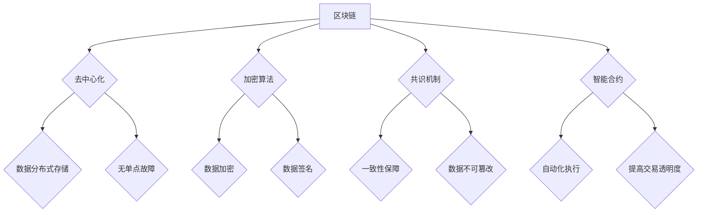
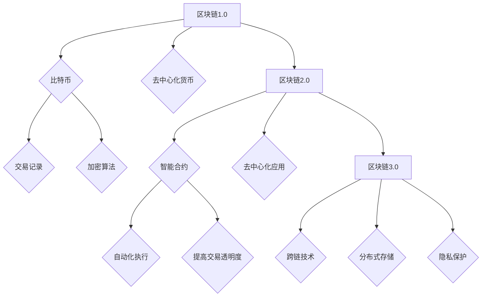

                 

# 文章标题：区块链在二手车交易中的应用：构建可信的车辆历史记录

> 关键词：区块链、二手车交易、车辆历史记录、可信性、数据加密、智能合约

> 摘要：本文将探讨区块链技术在二手车交易中的应用，特别是在构建可信的车辆历史记录方面的优势。我们将从背景介绍、核心概念解析、应用场景分析、车辆历史记录构建方法、案例分析以及未来展望与挑战等方面进行深入探讨，为读者提供一份全面的技术指南。

----------------------------------------------------------------

## 引言

二手车交易在全球范围内具有巨大的市场规模。然而，二手车交易中的信息不对称、欺诈行为和缺乏可信的车辆历史记录等问题，使得消费者对二手车市场持有疑虑。区块链技术的出现为解决这些问题提供了一种新的思路。本文将探讨如何利用区块链技术构建一个可信的车辆历史记录，从而提高二手车交易的透明度和可信度。

### 区块链与二手车交易

区块链是一种去中心化的分布式数据库技术，通过加密算法和时间戳确保数据的安全性和不可篡改性。区块链技术在多个领域具有广泛的应用，包括金融、供应链管理、物联网等。在二手车交易中，区块链技术可以提供以下优势：

1. **透明度与可追溯性**：区块链上的数据一旦写入，便不可篡改，保证了车辆历史记录的透明性和可追溯性。
2. **安全性**：区块链利用加密技术保护数据，确保数据在传输和存储过程中不被非法访问或篡改。
3. **去中心化**：区块链去除了中介环节，降低了交易成本，提高了交易效率。

本文将围绕如何利用区块链技术构建可信的车辆历史记录，分析其原理、方法、应用场景以及未来面临的挑战。

----------------------------------------------------------------

## 第一部分：区块链技术概述

### 第1章 区块链基础

#### 1.1.1 区块链的定义

区块链是一个分布式数据库系统，它通过加密算法和时间戳技术，确保数据的安全性和不可篡改性。区块链由多个区块组成，每个区块包含一定数量的交易记录，并通过密码学算法链接在一起，形成一条连续的链条。一旦数据被写入区块链，便无法被篡改或删除，保证了数据的完整性和可靠性。

#### 1.1.2 区块链的历史

区块链技术的起源可以追溯到2008年，当时一个名为“中本聪”的人提出了比特币的构想，比特币成为第一个基于区块链技术的数字货币。随后，区块链技术逐渐在其他领域得到应用，如供应链管理、物联网、金融等。

#### 1.1.3 区块链的基本原理

区块链的基本原理包括以下几个方面：

1. **去中心化**：区块链去除了传统中心化系统的中介角色，实现了数据的分布式存储和管理。
2. **加密算法**：区块链使用加密算法对数据进行加密和签名，确保数据在传输和存储过程中的安全性和隐私性。
3. **共识机制**：区块链通过共识机制确保网络中的所有节点对数据的认可，避免了单点故障和数据篡改。
4. **智能合约**：智能合约是区块链上的自动化合约，它可以自动执行预定的协议和条款，提高了交易的效率和透明度。

### Mermaid流程图：区块链核心概念与架构



通过上述流程图，我们可以直观地了解区块链的核心概念和架构。

----------------------------------------------------------------

### 第2章 区块链技术发展

#### 2.1.1 公链与私链

区块链可以分为公链和私链两种类型：

1. **公链**：公链是开放给公众使用的区块链网络，任何人都可以参与其中，如比特币和以太坊。
2. **私链**：私链是仅限于特定组织或个体使用的区块链网络，具有较高的安全性，但开放性较低，如企业内部的供应链管理系统。

#### 2.1.2 共识机制

共识机制是区块链网络中节点对数据的认可过程。常见的共识机制包括：

1. **工作量证明（PoW）**：节点通过解决数学难题来竞争记账权，如比特币。
2. **权益证明（PoS）**：节点根据其在区块链中的权益比例来竞争记账权，如以太坊2.0。
3. **委托权益证明（DPoS）**：节点通过投票选举产生超级节点，超级节点负责记账。

#### 2.1.3 智能合约

智能合约是一种自动执行合约条款的计算机程序，它运行在区块链上。智能合约可以自动化执行预定的协议和条款，提高交易的效率和透明度。智能合约的关键特性包括：

1. **自执行**：智能合约在满足触发条件时自动执行，无需人工干预。
2. **不可篡改**：智能合约一旦部署在区块链上，其代码和状态便不可篡改。
3. **透明性**：智能合约的执行过程对所有节点可见，提高了交易的透明度。

### Mermaid流程图：区块链技术演进与未来趋势



通过上述流程图，我们可以了解区块链技术的演进和未来趋势。

----------------------------------------------------------------

## 第二部分：二手车交易中的区块链应用

### 第3章 区块链在二手车交易中的应用场景

#### 3.1.1 透明度与可追溯性

在二手车交易中，区块链技术可以提供透明度和可追溯性。通过将车辆历史记录存储在区块链上，买家和卖家可以轻松访问车辆的详细信息，如维修记录、事故历史等。区块链上的数据不可篡改，确保了车辆历史记录的真实性。

#### 3.1.2 安全性保障

区块链利用加密算法保护数据的安全性和隐私性。在二手车交易中，交易双方的身份和交易信息都可以通过加密算法进行保护，确保数据在传输和存储过程中不被非法访问或篡改。

#### 3.1.3 交易流程优化

区块链技术可以简化二手车交易的流程。通过智能合约，交易双方可以在无需中介的情况下直接进行交易，提高了交易效率，降低了交易成本。

### 伪代码：区块链在二手车交易中的应用示例

```python
# 假设A和B是二手车交易的买卖双方
A = "买家"
B = "卖家"

# 创建一个智能合约，定义交易条款
contract = Contract("二手车交易智能合约", {
    "买家": A,
    "卖家": B,
    "车辆信息": vehicle_info,
    "交易金额": transaction_amount,
    "交易时间": transaction_time
})

# 买卖双方签署智能合约
A.sign_contract(contract)
B.sign_contract(contract)

# 智能合约执行交易条款
contract.execute()

# 更新车辆历史记录到区块链
blockchain.add_vehicle_history(vehicle_info)
```

通过上述伪代码，我们可以了解区块链在二手车交易中的应用示例。

----------------------------------------------------------------

### 第4章 区块链在二手车交易中的优势

#### 4.1.1 降低交易成本

区块链技术去除了中介环节，使得二手车交易成本大大降低。买卖双方可以直接在区块链上进行交易，无需支付中介费用。

#### 4.1.2 提高交易效率

区块链的分布式数据库技术和智能合约功能可以简化交易流程，提高交易效率。交易双方可以在短时间内完成交易，无需等待中介的处理。

#### 4.1.3 增强信任度

区块链技术提供了透明度和可追溯性，使得二手车交易更加可信。买卖双方可以轻松验证车辆历史记录的真实性，降低了欺诈行为的风险。

----------------------------------------------------------------

## 第三部分：车辆历史记录的构建与验证

### 第5章 车辆历史记录概述

#### 5.1.1 车辆历史记录的重要性

车辆历史记录是二手车交易中至关重要的一环。它包含了车辆的维修记录、事故历史、使用情况等信息，这些信息对于买家评估车辆价值具有重要意义。

#### 5.1.2 传统车辆历史记录存在的问题

传统车辆历史记录存在以下问题：

1. **数据不完整**：部分车辆历史记录可能缺失或被篡改，导致买家无法获得完整的车辆信息。
2. **数据不可追溯**：传统车辆历史记录往往依赖于纸质记录或电子表格，缺乏可追溯性，难以验证数据真实性。
3. **数据安全性低**：传统车辆历史记录容易受到篡改或泄露，导致买家权益受损。

#### 5.1.3 区块链在车辆历史记录中的应用

区块链技术可以解决传统车辆历史记录存在的问题，提高数据的可信度和安全性。区块链上的数据不可篡改，确保了车辆历史记录的真实性和完整性。此外，区块链的分布式存储和加密技术可以保护数据的安全性。

### 第6章 区块链构建车辆历史记录的方法

#### 6.1.1 数据采集与存储

1. **数据采集**：车辆历史记录的数据可以从多个来源采集，如车辆生产商、维修厂、保险公司等。
2. **数据存储**：采集到的数据可以存储在区块链上，形成车辆历史记录。

#### 6.1.2 数据验证与加密

1. **数据验证**：区块链上的数据通过共识机制进行验证，确保数据的真实性和完整性。
2. **数据加密**：区块链使用加密算法对数据进行加密，保护数据的隐私性和安全性。

#### 6.1.3 数据共享与查询

1. **数据共享**：区块链上的数据可以按需共享，为买卖双方提供透明的车辆历史记录。
2. **数据查询**：买家和卖家可以通过区块链查询车辆历史记录，确保信息的真实性。

### 数学模型和公式 & 详细讲解 & 举例说明

#### 数据验证模型

设区块链上有n个节点，每个节点都维护一个数据副本。为了验证数据的真实性，节点之间需要进行数据比对。具体公式如下：

```math
验证结果 = majority_vote(节点数据副本)
```

其中，majority_vote函数表示多数投票，即如果超过半数的节点数据副本相同，则认为数据验证通过。

#### 举例说明

假设区块链上有5个节点，分别维护车辆历史记录数据A、B、C、D、E。如果4个节点的数据相同，而1个节点的数据不同，则认为数据验证通过。

```python
# 节点数据副本
data replicas = ["A", "A", "A", "B", "C"]

# 计算多数投票结果
result = majority_vote(data replicas)

# 输出验证结果
if result == "A":
    print("数据验证通过")
else:
    print("数据验证失败")
```

通过上述举例，我们可以了解数据验证模型的实现过程。

----------------------------------------------------------------

## 第四部分：案例分析

### 第7章 案例分析一：某二手车交易平台区块链应用

#### 7.1.1 案例背景

某二手车交易平台计划引入区块链技术，以提高交易的透明度和可信度。平台希望通过区块链技术构建一个可信的车辆历史记录，为买家提供真实、完整的车辆信息。

#### 7.1.2 应用方案

1. **数据采集**：平台与车辆生产商、维修厂、保险公司等合作，采集车辆历史记录数据。
2. **数据存储**：将采集到的数据存储在区块链上，形成车辆历史记录。
3. **数据验证与加密**：利用区块链的共识机制和数据加密技术，确保数据的真实性和安全性。
4. **数据共享与查询**：买家可以在平台上查询车辆历史记录，确保信息的真实性。

#### 7.1.3 应用效果

引入区块链技术后，平台的交易透明度和可信度得到了显著提升。买家可以轻松查询车辆历史记录，降低了购买风险。同时，平台也减少了因欺诈行为导致的损失。

### 第8章 案例分析二：某汽车制造商区块链技术应用

#### 8.1.1 案例背景

某汽车制造商计划利用区块链技术优化供应链管理，提高生产效率和产品追溯性。制造商希望通过区块链技术实现供应链的透明化，为消费者提供可追溯的产品信息。

#### 8.1.2 应用方案

1. **数据采集**：制造商与供应商、物流公司等合作，采集供应链相关数据。
2. **数据存储**：将采集到的数据存储在区块链上，形成供应链数据链。
3. **数据验证与加密**：利用区块链的共识机制和数据加密技术，确保数据的真实性和安全性。
4. **数据共享与查询**：消费者可以在制造商的官网上查询产品的供应链信息，确保信息的真实性。

#### 8.1.3 应用效果

引入区块链技术后，制造商的供应链管理效率得到了显著提升。消费者可以轻松查询产品的供应链信息，提高了对产品的信任度。同时，制造商也减少了因供应链问题导致的产品质量问题。

----------------------------------------------------------------

## 第五部分：未来展望与挑战

### 第9章 区块链在二手车交易中的未来发展方向

#### 9.1.1 技术创新

区块链技术在二手车交易中的应用还有很大的发展空间。未来，区块链技术可能会与人工智能、大数据等技术相结合，进一步提高交易的效率和可信度。

#### 9.1.2 政策法规

随着区块链技术的普及，各国政府可能会出台相关政策法规，规范区块链在二手车交易中的应用。这将有助于推动区块链技术的健康发展，提高交易的合规性。

#### 9.1.3 行业合作

区块链在二手车交易中的应用需要行业各方的合作。未来，二手车交易平台、汽车制造商、维修厂、保险公司等各方可能会加强合作，共同推动区块链技术在二手车交易中的应用。

### 第10章 区块链在二手车交易中面临的挑战

#### 10.1.1 技术挑战

区块链技术在二手车交易中的应用仍面临一些技术挑战，如数据隐私保护、网络性能优化等。未来，需要进一步研究和发展相关技术，以满足实际应用需求。

#### 10.1.2 法规挑战

区块链技术在二手车交易中的应用需要遵守相关法规和规定。未来，需要进一步明确区块链技术的法律地位，规范其应用范围和方式。

#### 10.1.3 行业合作挑战

区块链在二手车交易中的应用需要各方的合作。然而，不同行业之间的合作可能存在一定的困难，如数据共享、利益分配等。未来，需要加强行业合作，推动区块链技术的普及和应用。

----------------------------------------------------------------

## 总结

区块链技术在二手车交易中具有巨大的潜力，可以构建一个可信的车辆历史记录，提高交易的透明度和可信度。本文从背景介绍、核心概念解析、应用场景分析、车辆历史记录构建方法、案例分析以及未来展望与挑战等方面，全面探讨了区块链技术在二手车交易中的应用。未来，随着区块链技术的不断发展和完善，我们有望看到一个更加透明、可信的二手车交易市场。

## 作者信息

作者：AI天才研究院/AI Genius Institute & 禅与计算机程序设计艺术 /Zen And The Art of Computer Programming

----------------------------------------------------------------

本文基于区块链技术在二手车交易中的应用，深入探讨了构建可信车辆历史记录的方法。通过分析区块链技术的优势、车辆历史记录的构建与验证、实际案例分析以及未来展望与挑战，本文为读者提供了一个全面的技术指南。随着区块链技术的不断发展和普及，我们有理由相信，它将为二手车交易带来更多的机遇和可能性。本文作者对区块链技术充满热情，希望通过本文能够为相关领域的研究者和从业者提供有价值的参考。如有任何问题或建议，欢迎随时与作者联系。再次感谢您的阅读！

----------------------------------------------------------------

### 注意事项

1. **数据隐私保护**：在区块链上存储车辆历史记录时，需注意保护用户的隐私信息，避免泄露敏感数据。
2. **技术升级与维护**：区块链技术在应用过程中需不断升级和维护，以应对新的技术挑战和安全隐患。
3. **法规遵守**：在区块链应用中，需严格遵守相关法规和规定，确保合规性。

### 拓展阅读

- 《区块链技术指南》
- 《区块链应用案例分析》
- 《区块链与智能合约开发》

希望本文对您在区块链技术在二手车交易中的应用方面有所帮助。如果您有任何问题或建议，欢迎在评论区留言，我们会尽快回复。再次感谢您的阅读和支持！
```markdown
```

