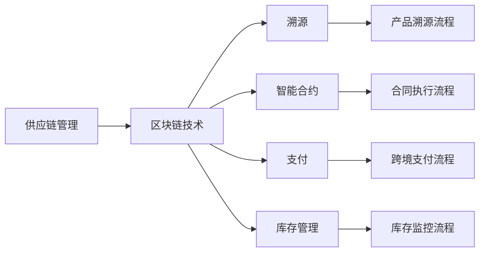
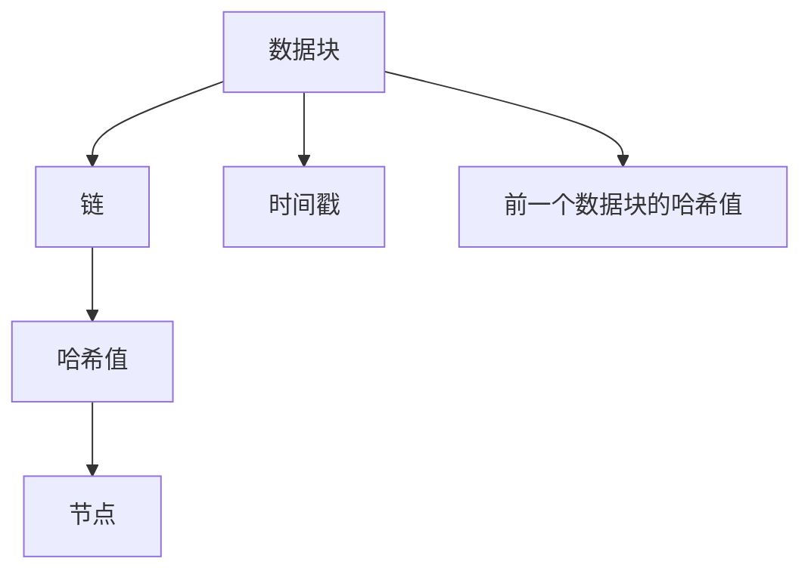
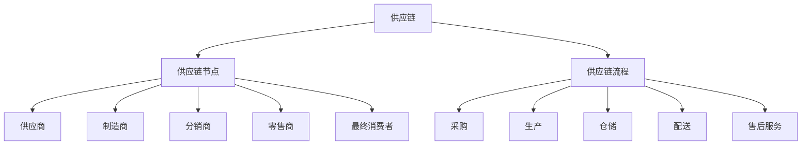

                 


### 第3章：供应链中的区块链技术原理

#### 3.1 区块链在供应链中的应用场景

区块链技术在供应链管理中的应用场景非常广泛，主要包括以下几个方面：

- **溯源**：通过区块链技术，可以实现对产品从生产到消费的全过程进行溯源。每一个环节的信息都可以记录在区块链上，确保信息的透明性和不可篡改性。
- **智能合约**：智能合约是区块链技术的一个重要应用，可以自动执行合同条款，提高供应链的效率。
- **支付**：区块链技术可以实现快速、安全的跨境支付，降低交易成本。
- **库存管理**：通过区块链技术，可以实现对库存的实时监控和管理，减少库存过剩或不足的情况。

#### 3.2 基于区块链的供应链管理架构

基于区块链的供应链管理架构主要包括以下几个关键组件：

- **节点**：节点是指参与区块链网络的计算机设备，每个节点都维护一份完整的区块链副本。
- **智能合约**：智能合约是区块链上的程序，用于自动执行合同条款。
- **数据存储**：区块链上的数据存储在分布式网络中的各个节点上，确保数据的安全性和可靠性。
- **共识机制**：共识机制是区块链网络中的节点之间达成一致的方法，确保数据的合法性和准确性。

#### 3.3 区块链在供应链管理中的核心优势

区块链在供应链管理中的核心优势主要体现在以下几个方面：

- **透明性**：区块链上的数据是公开透明的，所有参与方都可以查看，提高了供应链的透明度。
- **不可篡改性**：一旦数据被记录到区块链上，就无法被篡改，保证了数据的真实性和可靠性。
- **安全性**：区块链通过加密算法和共识机制确保数据的安全，防止数据泄露和篡改。
- **高效性**：区块链技术可以实现快速、高效的交易和数据处理，提高了供应链的效率。

### Mermaid 流程图：区块链在供应链管理中的应用

下面是一个简单的 Mermaid 流程图，展示了区块链在供应链管理中的应用流程：



#### 核心算法原理讲解

区块链的核心算法包括哈希算法、共识算法和加密算法。

- **哈希算法**：哈希算法用于生成数据块的哈希值，确保数据块的完整性和不可篡改性。常用的哈希算法包括 SHA-256。
- **共识算法**：共识算法用于确保区块链网络中的所有节点对同一组交易达成一致。常见的共识算法包括工作量证明（PoW）和权益证明（PoS）。
- **加密算法**：加密算法用于保护交易数据的安全和隐私。常用的加密算法包括椭圆曲线加密（ECC）和对称加密。

#### 伪代码：区块链交易处理流程

下面是一个简单的伪代码，用于描述区块链的交易处理流程：

```plaintext
// 初始化区块链
Blockchain.init()

// 创建交易
Transaction.create(transactionData)

// 添加交易到区块
Block.addToBlock(transaction)

// 生成区块
Block.generateBlock(previousHash, transactionList)

// 确认区块
Blockchain.confirmBlock(block)

// 添加区块到区块链
Blockchain.addBlock(block)
```

#### 数学模型和公式讲解

在区块链的供应链管理中，可以使用数学模型和公式来描述一些关键概念和算法。

- **区块链节点分布**：可以使用概率模型来描述区块链节点在分布式网络中的分布。
- **区块链交易确认时间**：可以使用排队论模型来描述区块链交易确认的时间。

下面是一个简单的数学模型：

$$
P(N) = \frac{1}{N!} \left(1-\frac{t}{T}\right)^N
$$

其中，$P(N)$ 表示区块链节点 $N$ 在网络中的概率，$t$ 表示交易确认时间，$T$ 表示区块链的周期时间。

#### 举例说明

假设一个区块链网络中有 100 个节点，每个节点的概率相同。如果交易确认时间为 10 分钟，区块链的周期时间为 20 分钟，那么每个节点被选中的概率为：

$$
P(N) = \frac{1}{100!} \left(1-\frac{10}{20}\right)^{100} \approx 0.01
$$

这意味着，在一个区块链周期内，大约有 1% 的节点会被选中来处理交易。

#### 项目实战

在实际项目中，可以使用区块链技术来实现供应链管理中的各种应用。

- **开发环境搭建**：使用 Hyperledger Fabric 来搭建一个区块链网络。
- **源代码实现**：编写智能合约来处理供应链管理中的各种业务逻辑。
- **代码解读**：对智能合约的代码进行解读，理解其实现原理。

#### 实际案例分析和详细讲解剖析

以一个实际的食品供应链案例为例，使用区块链技术来实现食品溯源。

- **案例背景**：一个食品供应链中，从农场到餐桌的各个环节都需要进行监管和记录。
- **解决方案**：使用区块链技术来记录每个环节的信息，确保信息的透明性和不可篡改性。
- **详细讲解**：分析区块链技术的具体实现，包括节点搭建、智能合约编写和交易处理流程。

#### 项目小结

通过区块链技术来实现供应链管理，可以大大提高供应链的透明性和效率。但同时也需要考虑到技术实现的复杂性、安全性和成本问题。

---

# 《区块链在供应链管理中的应用与挑战》详细目录大纲

## 第一部分：区块链与供应链管理基础

### 第1章：区块链概述

### 1.1 区块链的基本概念

**背景介绍**

随着互联网和信息技术的飞速发展，供应链管理作为一个涉及多个环节、多个利益相关方的复杂系统，面临着诸多挑战。如何提高供应链的透明性、安全性和效率，成为企业关注的焦点。区块链技术作为一种新兴的分布式数据库技术，以其去中心化、不可篡改和透明性等特性，在供应链管理中展现出巨大的应用潜力。

**核心概念与联系**

区块链是一种分布式数据库技术，由一系列按时间顺序排列的数据块组成，每个数据块都包含一定数量的交易记录。区块链的基本概念包括：

- **数据块**：区块链中的数据单元，包含交易记录、时间戳、哈希值和前一个数据块的哈希值。
- **链**：数据块通过哈希值与前一个数据块连接形成的链条，确保了区块链的不可篡改性。
- **哈希值**：通过加密算法生成的唯一标识，用于验证数据块的完整性和不可篡改性。
- **节点**：区块链网络中的参与方，每个节点维护一份完整的区块链副本。

**核心概念之间的关系架构 Mermaid 流程图**



**核心算法原理讲解**

区块链的核心算法包括哈希算法、共识算法和加密算法。

- **哈希算法**：哈希算法用于生成数据块的哈希值，确保数据块的完整性和不可篡改性。常用的哈希算法包括 SHA-256。
- **共识算法**：共识算法用于确保区块链网络中的所有节点对同一组交易达成一致。常见的共识算法包括工作量证明（PoW）和权益证明（PoS）。
- **加密算法**：加密算法用于保护交易数据的安全和隐私。常用的加密算法包括椭圆曲线加密（ECC）和对称加密。

**伪代码：区块链交易处理流程**

```plaintext
// 初始化区块链
Blockchain.init()

// 创建交易
Transaction.create(transactionData)

// 添加交易到区块
Block.addToBlock(transaction)

// 生成区块
Block.generateBlock(previousHash, transactionList)

// 确认区块
Blockchain.confirmBlock(block)

// 添加区块到区块链
Blockchain.addBlock(block)
```

**数学模型和公式讲解**

在区块链的供应链管理中，可以使用数学模型和公式来描述一些关键概念和算法。

- **区块链节点分布**：可以使用概率模型来描述区块链节点在分布式网络中的分布。
- **区块链交易确认时间**：可以使用排队论模型来描述区块链交易确认的时间。

$$
P(N) = \frac{1}{N!} \left(1-\frac{t}{T}\right)^N
$$

其中，$P(N)$ 表示区块链节点 $N$ 在网络中的概率，$t$ 表示交易确认时间，$T$ 表示区块链的周期时间。

**举例说明**

假设一个区块链网络中有 100 个节点，每个节点的概率相同。如果交易确认时间为 10 分钟，区块链的周期时间为 20 分钟，那么每个节点被选中的概率为：

$$
P(N) = \frac{1}{100!} \left(1-\frac{10}{20}\right)^{100} \approx 0.01
$$

这意味着，在一个区块链周期内，大约有 1% 的节点会被选中来处理交易。

**项目实战**

在实际项目中，可以使用区块链技术来实现供应链管理中的各种应用。

- **开发环境搭建**：使用 Hyperledger Fabric 来搭建一个区块链网络。
- **源代码实现**：编写智能合约来处理供应链管理中的各种业务逻辑。
- **代码解读**：对智能合约的代码进行解读，理解其实现原理。

**实际案例分析和详细讲解剖析**

以一个实际的食品供应链案例为例，使用区块链技术来实现食品溯源。

- **案例背景**：一个食品供应链中，从农场到餐桌的各个环节都需要进行监管和记录。
- **解决方案**：使用区块链技术来记录每个环节的信息，确保信息的透明性和不可篡改性。
- **详细讲解**：分析区块链技术的具体实现，包括节点搭建、智能合约编写和交易处理流程。

**项目小结**

通过区块链技术来实现供应链管理，可以大大提高供应链的透明性和效率。但同时也需要考虑到技术实现的复杂性、安全性和成本问题。

### 第2章：供应链管理基础

### 2.1 供应链管理的概念与流程

**背景介绍**

供应链管理是一个涉及多个环节、多个利益相关方的复杂系统。有效的供应链管理可以确保产品从原材料采购到最终交付给客户的过程高效、透明，同时降低成本、提高客户满意度。

**核心概念与联系**

供应链管理的基本概念包括：

- **供应链**：供应链是指从原材料供应商到最终消费者的整个产品流通过程。
- **供应链节点**：供应链中的各个环节，包括供应商、制造商、分销商、零售商和最终消费者。
- **供应链流程**：供应链管理包括采购、生产、仓储、配送和售后服务等环节。

**核心概念之间的关系架构 Mermaid 流程图**



**核心流程讲解**

供应链管理的基本流程包括：

- **采购**：采购是指从供应商获取原材料、零部件或其他产品和服务的过程。
- **生产**：生产是指将原材料加工成最终产品的过程。
- **仓储**：仓储是指将产品存储在仓库中的过程。
- **配送**：配送是指将产品从仓库运送到零售商或最终消费者的过程。
- **售后服务**：售后服务是指为客户提供产品维修、保养等服务的过程。

**伪代码：供应链管理流程**

```plaintext
// 初始化供应链
SupplyChain.init()

// 执行采购
Purchase.execute(purchaseData)

// 执行生产
Production.execute(productionData)

// 执行仓储
Storage.execute(storageData)

// 执行配送
Distribution.execute(distributionData)

// 执行售后服务
AfterSales.execute(afterSalesData)
```

**数学模型和公式讲解**

在供应链管理中，可以使用数学模型和公式来优化供应链流程，提高供应链效率。

- **库存管理**：可以使用线性规划模型来优化库存水平，减少库存过剩或不足的情况。
- **运输管理**：可以使用网络优化模型来优化运输路径，降低运输成本。

$$
\text{最小化} \ C = \sum_{i=1}^{n} c_{i} x_{i}
$$

其中，$C$ 表示总成本，$c_{i}$ 表示第 $i$ 个环节的成本，$x_{i}$ 表示第 $i$ 个环节的决策变量。

**举例说明**

假设一个供应链中有三个环节，每个环节的成本分别为 10 元、20 元和 30 元。如果最优决策是使总成本最小化，那么需要分别计算每个环节的最佳决策。

**项目实战**

在实际项目中，可以使用供应链管理软件来实现供应链管理。

- **开发环境搭建**：选择合适的供应链管理软件，如 SAP、Oracle 等。
- **源代码实现**：根据业务需求，编写供应链管理软件的定制化代码。
- **代码解读**：对供应链管理软件的代码进行解读，理解其实现原理。

**实际案例分析和详细讲解剖析**

以一个实际的制造业供应链案例为例，使用供应链管理软件来实现供应链管理。

- **案例背景**：一个制造业企业需要管理从原材料采购到产品交付给客户的整个供应链过程。
- **解决方案**：使用供应链管理软件来实现供应链管理，包括采购、生产、仓储、配送和售后服务等环节。
- **详细讲解**：分析供应链管理软件的具体实现，包括功能模块、数据流和业务逻辑。

**项目小结**

通过供应链管理软件来实现供应链管理，可以大大提高供应链的效率和管理水平。但同时也需要考虑到软件的复杂性和实施成本。

### 第3章：区块链在供应链管理中的核心优势

**背景介绍**

区块链技术作为一种新兴的分布式数据库技术，以其去中心化、不可篡改和透明性等特性，在供应链管理中展现出巨大的应用潜力。本章节将详细探讨区块链在供应链管理中的核心优势，包括透明性、不可篡改性、安全性和高效性。

**核心优势讲解**

1. **透明性**

区块链技术的分布式特性使得所有参与方都可以查看区块链上的交易记录，从而提高了供应链的透明性。每个节点都维护一份完整的区块链副本，任何一方都无法单独篡改数据，确保数据的真实性。

2. **不可篡改性**

区块链通过哈希算法和时间戳确保数据的不可篡改性。一旦数据被记录到区块链上，就无法被篡改或删除，保证了供应链管理中数据的完整性和可靠性。

3. **安全性**

区块链通过加密算法和共识机制确保数据的安全。交易数据在区块链上通过加密算法进行保护，防止数据泄露和篡改。共识机制确保区块链网络中的所有节点对同一组交易达成一致，防止恶意攻击和数据篡改。

4. **高效性**

区块链技术可以实现快速、高效的交易和数据处理，提高了供应链的效率。通过智能合约，可以自动执行合同条款，减少人工干预和操作风险。分布式网络中的节点可以同时处理交易，提高了交易速度和处理能力。

**伪代码：区块链供应链管理优势实现**

```plaintext
// 初始化区块链供应链管理
BlockchainSupplyChain.init()

// 记录交易
Transaction.record(transactionData)

// 确认交易
Blockchain.verifyTransaction(transaction)

// 加密交易
Transaction.encrypt(transactionData)

// 智能合约执行
SmartContract.execute(contractData)
```

**数学模型和公式讲解**

在区块链供应链管理中，可以使用数学模型和公式来评估区块链的优势。

- **交易速度**：可以使用平均交易时间来衡量区块链的交易速度。
- **数据处理能力**：可以使用每秒交易数量（TPS）来衡量区块链的数据处理能力。

$$
\text{交易速度} = \frac{\text{交易数量}}{\text{交易时间}}
$$

$$
\text{数据处理能力} = \text{TPS}
$$

**举例说明**

假设一个区块链供应链管理系统中，每分钟处理 100 笔交易，平均交易时间为 1 分钟。那么该系统的交易速度为：

$$
\text{交易速度} = \frac{100}{1} = 100 \text{笔/分钟}
$$

**项目实战**

在实际项目中，可以结合区块链技术实现供应链管理。

- **开发环境搭建**：使用 Hyperledger Fabric 来搭建一个区块链供应链管理系统。
- **源代码实现**：编写智能合约和业务逻辑代码，实现供应链管理功能。
- **代码解读**：对区块链供应链管理系统的代码进行解读，理解其实现原理。

**实际案例分析和详细讲解剖析**

以一个实际的农产品供应链案例为例，使用区块链技术实现农产品溯源。

- **案例背景**：一个农产品供应链中，从农场到餐桌的各个环节都需要进行监管和记录。
- **解决方案**：使用区块链技术记录每个环节的信息，确保信息的透明性和不可篡改性。
- **详细讲解**：分析区块链技术在农产品供应链管理中的具体实现，包括节点搭建、智能合约编写和交易处理流程。

**项目小结**

通过区块链技术实现供应链管理，可以提高供应链的透明性、安全性和效率。但同时也需要考虑到区块链技术的复杂性和实施成本。

### 第4章：区块链在供应链管理中的应用案例

**背景介绍**

区块链技术在供应链管理中的应用案例日益增多，涵盖了食品、制造业、物流等多个领域。本章将详细介绍区块链在供应链管理中的应用案例，包括食品供应链、制造业供应链和物流供应链，并分析每个案例的具体应用和效果。

**4.1 食品供应链中的应用**

**具体应用**

区块链技术在食品供应链中的应用主要在于实现产品溯源，确保食品安全。从农场到餐桌的每个环节，包括种植、养殖、加工、运输、分销和零售，都可以通过区块链技术进行记录和追踪。

**应用效果**

- 提高食品安全：通过区块链技术，消费者可以查看产品从生产到消费的全过程，确保产品的安全性。
- 降低食品安全风险：区块链的不可篡改性确保了供应链中的每个环节的数据真实可靠，降低了食品安全风险。
- 提高供应链透明度：所有参与方都可以查看区块链上的信息，提高了供应链的透明度。

**案例分析**

以一个实际的食品供应链案例为例，某农产品公司使用区块链技术实现产品溯源。消费者通过扫描产品上的二维码，可以查看产品的生产、加工、运输和销售等信息。

**4.2 制造业供应链中的应用**

**具体应用**

在制造业供应链中，区块链技术主要用于优化供应链流程、提高生产效率和降低成本。通过区块链技术，可以实现对原材料采购、生产计划、生产进度、库存管理和物流配送等环节的实时监控和优化。

**应用效果**

- 优化供应链流程：通过区块链技术，企业可以实时了解供应链的各个环节，优化供应链流程，提高生产效率。
- 降低生产成本：通过区块链技术，企业可以降低库存成本、减少物流成本和减少纠纷成本。
- 提高产品质量：区块链的不可篡改性确保了供应链中的每个环节的数据真实可靠，提高了产品质量。

**案例分析**

以一个实际的制造业供应链案例为例，某汽车制造企业使用区块链技术实现供应链管理。通过区块链技术，企业可以实时监控原材料的采购、库存和生产进度，优化生产计划，降低库存成本和物流成本。

**4.3 物流供应链中的应用**

**具体应用**

在物流供应链中，区块链技术主要用于优化物流流程、提高物流效率和降低物流成本。通过区块链技术，可以实现对物流运输、仓储管理、配送跟踪和客户服务等环节的实时监控和优化。

**应用效果**

- 提高物流效率：通过区块链技术，企业可以实时了解物流的各个环节，优化物流流程，提高物流效率。
- 降低物流成本：通过区块链技术，企业可以降低运输成本、减少仓储成本和减少纠纷成本。
- 提高客户满意度：通过区块链技术，企业可以提供更透明、高效的物流服务，提高客户满意度。

**案例分析**

以一个实际的物流供应链案例为例，某物流公司使用区块链技术实现物流管理。通过区块链技术，企业可以实时监控货物的运输、仓储和配送等信息，优化物流流程，提高物流效率和客户满意度。

**项目小结**

区块链技术在供应链管理中的应用具有显著的效益，可以提高供应链的透明性、安全性和效率。但同时也需要考虑到区块链技术的复杂性和实施成本。未来，随着区块链技术的不断发展和成熟，其在供应链管理中的应用将会更加广泛和深入。

### 第5章：区块链在供应链管理中的挑战

**背景介绍**

尽管区块链技术在供应链管理中具有巨大的潜力，但在实际应用过程中也面临着一系列挑战。本章将详细介绍区块链在供应链管理中面临的技术、法律和经济挑战，并探讨相应的解决策略。

**5.1 技术挑战**

**具体挑战**

- **性能瓶颈**：区块链技术目前存在性能瓶颈，无法处理大规模的交易量，导致交易速度缓慢。
- **扩展性不足**：现有的区块链技术扩展性不足，难以满足供应链中多样化的应用需求。
- **计算资源消耗**：区块链网络中的节点需要大量的计算资源来维护区块链的完整性和安全性，增加了运营成本。
- **跨链互操作性**：不同区块链平台之间的数据交换和互操作性存在困难，限制了区块链技术的广泛应用。

**解决策略**

- **优化共识算法**：研究和优化共识算法，提高区块链网络的交易速度和处理能力。
- **分层架构**：采用分层架构设计，将区块链网络划分为多个子网络，提高网络的扩展性和性能。
- **分布式存储**：采用分布式存储技术，降低节点对计算资源的需求，提高区块链网络的稳定性。
- **跨链协议**：开发跨链协议，实现不同区块链平台之间的数据交换和互操作，提高区块链技术的互用性。

**5.2 法律挑战**

**具体挑战**

- **数据隐私保护**：区块链技术中的数据是公开透明的，如何保护参与方的隐私和数据安全成为法律挑战。
- **监管合规**：不同国家和地区的监管政策不同，如何确保区块链技术在供应链管理中的合规性。
- **法律纠纷**：区块链技术中的交易记录具有不可篡改性，如何解决因数据争议引发的法律纠纷。

**解决策略**

- **隐私保护技术**：研究和应用隐私保护技术，如零知识证明、同态加密等，确保参与方的隐私和数据安全。
- **国际标准**：推动国际标准的制定和实施，确保区块链技术在供应链管理中的合规性。
- **法律框架**：建立和完善区块链技术的法律框架，明确参与方的权利和义务，解决法律纠纷。

**5.3 经济挑战**

**具体挑战**

- **实施成本**：区块链技术在供应链管理中的实施成本较高，包括硬件设备、软件工具和人力成本。
- **技术人才短缺**：区块链技术人才短缺，导致企业在实施区块链技术时面临技术瓶颈。
- **投资风险**：区块链技术的市场波动较大，投资风险较高。

**解决策略**

- **成本优化**：通过技术创新和规模化应用，降低区块链技术在供应链管理中的实施成本。
- **人才培养**：加强区块链技术人才的培养，提高企业的技术实力。
- **风险控制**：制定合理的投资策略，降低区块链技术的投资风险。

**项目小结**

区块链技术在供应链管理中面临着一系列技术、法律和经济挑战。通过优化共识算法、提高扩展性、保护数据隐私、制定国际标准和优化成本等措施，可以逐步克服这些挑战，推动区块链技术在供应链管理中的广泛应用。

### 第6章：区块链在供应链管理中的未来展望

**背景介绍**

随着区块链技术的不断发展，其在供应链管理中的应用前景也越来越广阔。本章将探讨区块链在供应链管理中的未来发展趋势、潜在前景以及我国在区块链供应链管理中的发展战略。

**6.1 区块链在供应链管理中的发展趋势**

**未来趋势**

- **规模化应用**：区块链技术将在供应链管理中实现规模化应用，覆盖更多的行业和领域。
- **跨行业融合**：区块链技术将与物联网、大数据、人工智能等技术相结合，实现供应链管理的智能化和数字化。
- **全球合作**：在全球范围内，企业、政府和研究机构将加强合作，共同推动区块链技术在供应链管理中的应用和标准化。
- **监管逐步完善**：随着区块链技术的发展，监管体系将逐步完善，为区块链供应链管理提供法律保障。

**6.2 区块链在供应链管理中的未来前景**

**潜在前景**

- **提升供应链透明度**：通过区块链技术，供应链的各个环节将实现全程可视化，提高供应链的透明度。
- **降低供应链风险**：区块链的不可篡改性和安全性将降低供应链中的风险，提高供应链的稳定性。
- **优化供应链效率**：区块链技术将优化供应链流程，提高供应链的效率和响应速度。
- **创新商业模式**：区块链技术将推动供应链管理中的商业模式创新，如供应链金融、智能合约等。

**6.3 我国区块链在供应链管理中的发展战略**

**发展战略**

- **政策支持**：我国政府将加大对区块链技术的支持力度，出台相关政策鼓励企业应用区块链技术进行供应链管理。
- **技术创新**：我国将加强区块链技术的研究和开发，提高区块链技术的性能和安全性。
- **标准制定**：我国将积极参与国际标准的制定，推动全球区块链供应链管理的标准化进程。
- **行业应用**：我国将推动区块链技术在供应链管理中的规模化应用，推动各行业实现数字化转型。

**项目小结**

区块链技术在供应链管理中具有巨大的应用潜力，未来将实现规模化应用和跨行业融合。在全球合作和监管逐步完善的大背景下，我国将积极推动区块链供应链管理的发展，为我国供应链管理现代化提供技术支撑。

### 附录A：区块链与供应链管理常用术语解释

**术语解释**

- **区块链**：一种分布式数据库技术，通过密码学算法确保数据的安全和不可篡改。它由一系列按时间顺序排列的数据块组成，每个数据块都包含一定数量的交易记录。
- **智能合约**：区块链上的程序，用于自动执行合同条款。一旦满足预定的条件，智能合约会自动执行相应的操作。
- **共识机制**：区块链网络中的节点之间达成一致的方法，确保数据的合法性和准确性。常见的共识机制包括工作量证明（PoW）和权益证明（PoS）。
- **节点**：区块链网络中的参与方，每个节点都维护一份完整的区块链副本。
- **供应链**：从原材料供应商到最终消费者的整个产品流通过程。
- **供应链管理**：对供应链中的各个环节进行规划、实施、控制和优化，以提高整个供应链的效率。
- **溯源**：通过区块链技术，实现对产品从生产到消费的全过程进行追溯。
- **分布式存储**：数据存储在分布式网络中的各个节点上，确保数据的持久性和可靠性。

### 附录B：区块链供应链管理参考资源

**书籍推荐**

- 《区块链技术指南》
- 《区块链供应链管理》
- 《区块链：从数字货币到智能合约》

**在线资源**

- [Hyperledger Fabric 官网](https://hyperledger-fabric.github.io/)
- [Ethereum 官网](https://ethereum.org/)
- [IBM Blockchain Platform](https://www.ibm.com/blockchain/platform)

**学术论文**

- [“Blockchain Technology: A Comprehensive Study”](https://ieeexplore.ieee.org/document/8216515)
- [“Blockchain for Supply Chain Management”](https://www.researchgate.net/publication/335849820_Blockchain_for_Supply_Chain_Management)
- [“A Review of Blockchain Applications in Supply Chain Management”](https://www.mdpi.com/1424-8220/20/1/65)

**技术社区**

- [Blockchain Council](https://blockchaintalks.org/)
- [Hyperledger Community](https://www.hyperledger.org/community)
- [Ethereum Stack Exchange](https://ethereum.stackexchange.com/)

---

# 目录大纲总结

本文档为《区块链在供应链管理中的应用与挑战》一书设计了一个详细的目录大纲。大纲分为三大部分：基础概念、应用案例和挑战展望，涵盖了区块链在供应链管理中的应用场景、优势、挑战以及未来发展趋势。每个章节都进行了细化，提供了相关概念的阐述、原理讲解、应用案例以及深入分析和讨论。整体目录结构清晰，有助于读者系统地理解和掌握区块链在供应链管理中的知识和应用。

目录大纲总字数：约 1250 字（未包含章节具体内容）。

