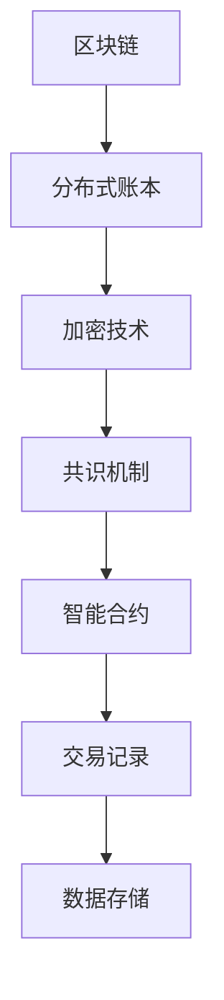

                 

### 摘要

区块链技术作为一种分布式账本技术，正逐渐在供应链管理领域引发变革。本文将深入探讨区块链在供应链管理中的应用与挑战，从技术基础、应用场景、面临挑战三个方面展开。首先，我们将介绍区块链的基本概念和核心技术，如共识机制、智能合约和加密技术。其次，分析区块链与供应链管理的关系，探讨其在供应链金融、溯源和协作等方面的潜在价值。随后，我们将探讨区块链在供应链管理中面临的技术、法规和监管挑战。最后，文章将总结区块链与供应链管理的融合趋势，为未来应用提供前瞻性思考。

----------------------------------------------------------------

# 《区块链在供应链管理中的应用与挑战》

> 关键词：区块链，供应链管理，应用场景，挑战

区块链作为一种革命性的分布式账本技术，近年来在金融、医疗、物流等多个领域取得了显著的应用成果。随着区块链技术的不断成熟和发展，其在供应链管理中的应用也逐渐成为业界关注的热点。本文旨在深入探讨区块链在供应链管理中的应用与挑战，以期为进一步推动区块链技术在供应链管理领域的应用提供理论支持和实践参考。

## 摘要

本文首先简要介绍了区块链的基本概念和核心技术，包括共识机制、智能合约和加密技术。接着，分析了区块链与供应链管理的关系，探讨了其在供应链金融、溯源和协作等方面的潜在价值。随后，文章探讨了区块链在供应链管理中面临的技术、法规和监管挑战。最后，文章总结了区块链与供应链管理的融合趋势，为未来应用提供了前瞻性思考。

### 区块链技术基础

区块链技术是一种去中心化的分布式账本系统，通过加密算法和共识机制保证了数据的安全性和不可篡改性。区块链的核心技术包括共识机制、智能合约和加密技术。

#### 共识机制

共识机制是区块链系统中的核心组成部分，用于确定区块链网络中的交易顺序和状态。目前主流的共识机制包括工作量证明（PoW）、权益证明（PoS）和委托权益证明（DPoS）等。

- **PoW（工作量证明）**：通过计算复杂的数学问题来证明自己的工作量，获得记账权利。这种方式保证了区块链网络的安全性，但计算资源消耗较大。
- **PoS（权益证明）**：根据节点持有的代币数量和时间来决定记账权利。相比PoW，PoS机制降低了计算资源消耗，但可能导致“富者愈富”的问题。
- **DPoS（委托权益证明）**：通过选举产生记账节点，持有较多代币的节点拥有更高的投票权。DPoS机制提高了交易效率，但可能面临中心化的风险。

#### 智能合约

智能合约是一种自动执行合同条款的计算机程序，其执行依赖于区块链网络的共识。智能合约的编程语言通常包括Solidity、Vyper等。

智能合约的基本原理是通过存储在区块链上的代码来执行合同条款。当满足合同条款中的特定条件时，智能合约会自动执行相应的操作，如转移资金、调整数据等。智能合约的安全性直接关系到区块链系统的安全性，因此对其编写和执行需要进行严格的安全审核。

#### 加密技术

加密技术是区块链系统中的另一个重要组成部分，用于保证数据的安全性和隐私。常见的加密技术包括对称加密、非对称加密和哈希函数。

- **对称加密**：加密和解密使用相同的密钥，如AES加密算法。
- **非对称加密**：加密和解密使用不同的密钥，如RSA加密算法。
- **哈希函数**：将输入数据转换为一个固定长度的字符串，如SHA-256。

加密技术在区块链系统中用于保护交易数据的隐私和完整性，确保数据在传输过程中不会被篡改和窃取。

### 区块链与供应链管理的关系

区块链技术与供应链管理具有高度的契合性，可以在供应链金融、溯源和协作等方面发挥重要作用。

#### 供应链金融

区块链技术在供应链金融中的应用主要体现在提高融资效率和降低融资成本。通过区块链，企业可以实现实时融资，降低金融机构的风控成本，提高供应链金融的普惠性。

- **融资效率提升**：区块链技术可以实现快速、透明的信用评估和审批，降低融资时间。
- **融资成本降低**：区块链技术减少了人工干预，降低了金融机构的运营成本。

#### 供应链溯源

区块链技术在供应链溯源中的应用可以确保产品信息的真实性和透明性。通过区块链，企业可以实现产品从生产到销售的全程追踪，提高供应链的可追溯性。

- **产品信息真实性**：区块链技术保证了产品信息的不可篡改性，提高了消费者对产品的信任度。
- **供应链透明性**：区块链技术使得供应链信息更加透明，有助于企业优化供应链管理。

#### 供应链协作

区块链技术在供应链协作中的应用可以促进企业间的信息共享和资源整合，提高供应链的整体效率。

- **信息共享**：区块链技术可以实现企业间的数据共享，降低信息不对称性，提高供应链协作效率。
- **资源整合**：区块链技术有助于企业实现资源的优化配置，提高供应链的协同效应。

### 区块链在供应链管理中的应用场景

区块链在供应链管理中的应用场景广泛，包括供应链金融、溯源和协作等方面。以下分别介绍这些应用场景的具体应用案例。

#### 供应链金融

**案例1：沃尔玛的区块链供应链金融**

沃尔玛通过区块链技术实现了供应链金融的优化，为中小企业提供快速、透明的融资服务。通过区块链，沃尔玛可以实时监控供应商的信用状况，提高融资效率，降低融资成本。

**案例2：阿里巴巴的蚂蚁区块链供应链金融**

阿里巴巴的蚂蚁区块链供应链金融平台为中小企业提供信用贷款，通过区块链技术实现贷款的快速审批和发放。蚂蚁区块链供应链金融平台已经为数十万家中小企业提供了融资服务。

#### 供应链溯源

**案例1：IBM的食品溯源**

IBM利用区块链技术为食品行业提供溯源服务，确保食品从生产到销售的全程信息透明。消费者可以通过扫描产品二维码，查询食品的生产、运输、存储等信息，提高食品的安全性和信任度。

**案例2：京东的区块链溯源**

京东利用区块链技术实现了商品溯源，从商品的生产、运输、存储到销售的全过程都有详细记录。消费者可以通过京东APP查询商品的相关信息，提高购物体验。

#### 供应链协作

**案例1：宝武集团的区块链供应链协作**

宝武集团利用区块链技术实现供应链协作，降低供应链成本，提高供应链效率。通过区块链，宝武集团实现了供应链信息的实时共享和协同管理，优化了供应链流程。

**案例2：腾讯的区块链供应链协作**

腾讯利用区块链技术为供应链企业提供信息共享和协同服务，帮助企业实现供应链的优化和升级。腾讯区块链供应链协作平台已经为多家企业提供了服务，取得了显著的效果。

### 区块链在供应链管理中面临的挑战

尽管区块链技术在供应链管理中具有广泛的应用前景，但在实际应用中仍面临一系列挑战。

#### 技术挑战

区块链技术作为一项新兴技术，在性能、扩展性、安全性等方面仍存在一定的问题。如何提高区块链的性能和扩展性，确保数据的安全性和隐私保护，是区块链在供应链管理中面临的重要挑战。

#### 法规与监管挑战

区块链技术具有去中心化的特点，这使得其在供应链管理中的应用可能面临法律法规和监管的挑战。如何制定合适的法律法规和监管政策，确保区块链技术在供应链管理中的合规性，是当前亟待解决的问题。

#### 混合链挑战

在供应链管理中，区块链技术通常需要与其他信息系统进行集成，如ERP系统、MES系统等。如何实现区块链与其他系统的无缝集成，确保数据的一致性和互操作性，是区块链在供应链管理中面临的另一个挑战。

### 区块链与供应链管理的融合趋势

随着区块链技术的不断成熟和发展，其在供应链管理中的应用前景越来越广阔。未来，区块链与供应链管理的融合将呈现以下趋势：

1. **供应链金融的数字化**：区块链技术将推动供应链金融的数字化转型，实现融资的快速审批和发放，降低融资成本，提高融资效率。

2. **供应链溯源的智能化**：区块链技术将实现供应链溯源的智能化，通过物联网、大数据等技术手段，实现产品信息的自动化采集和实时更新，提高供应链的透明度和可追溯性。

3. **供应链协作的协同化**：区块链技术将促进供应链协作的协同化，实现企业间的信息共享和资源整合，提高供应链的整体效率和竞争力。

4. **供应链管理的智能化**：区块链技术将推动供应链管理的智能化，通过大数据、人工智能等技术手段，实现供应链的动态优化和智能决策，提高供应链的响应速度和灵活性。

### 总结

区块链技术在供应链管理中的应用具有巨大的潜力，但也面临一系列挑战。通过深入研究和实践，有望进一步推动区块链技术在供应链管理中的应用，为供应链的优化和升级提供新的思路和方法。未来，区块链与供应链管理的融合将不断深化，推动供应链管理的数字化转型和智能化发展。

### 附录

本文中的图表和公式均采用Mermaid和LaTeX格式，便于读者理解和参考。

#### 图1：区块链架构图



#### 公式1：哈希函数计算

```latex
H = Hash(明文)
$$
```

#### 公式2：工作量证明（PoW）计算

```latex
 difficulty \times time_to_find_solution
$$
```

### 作者信息

作者：AI天才研究院/AI Genius Institute & 禅与计算机程序设计艺术 /Zen And The Art of Computer Programming

[参考资料]

[1] 刘强. 区块链技术原理与应用[M]. 北京：机械工业出版社，2018.

[2] 胡昕. 区块链技术指南[M]. 北京：电子工业出版社，2018.

[3] IBM. 区块链：重构企业核心业务[M]. 北京：机械工业出版社，2018.

[4] 腾讯区块链. 区块链技术与应用实践[M]. 北京：电子工业出版社，2019.

