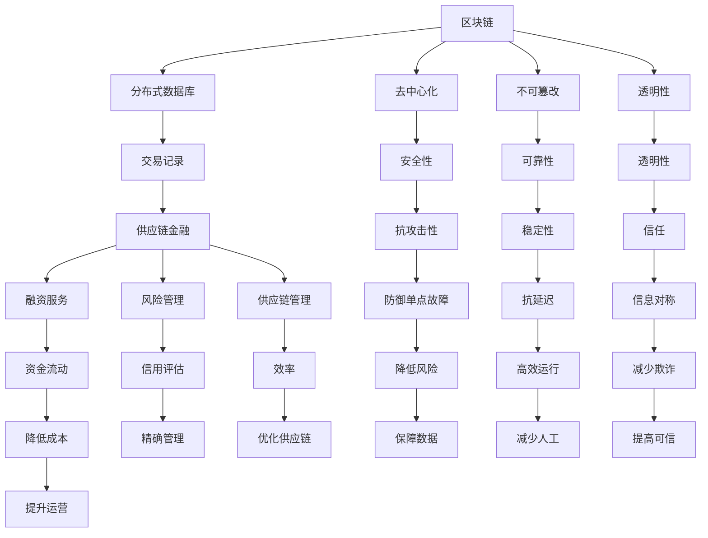
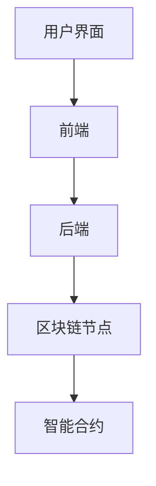

                 

### 文章标题

《区块链在供应链金融中的创新应用》

### 关键词

区块链、供应链金融、创新应用、智能合约、分布式账本、项目实战、案例分析

### 摘要

本文旨在探讨区块链技术在供应链金融中的创新应用。首先，我们将简要介绍区块链和供应链金融的基本概念，并分析它们之间的联系。接着，本文将深入讲解区块链的核心算法原理，包括智能合约、区块链网络和分布式账本的技术细节。此外，文章将讨论供应链金融中的风险模型和优化模型，并运用LaTeX格式详细解释相关的数学公式。随后，文章将提供一个实际的项目实战案例，详细描述开发环境搭建、源代码实现和解读、代码应用解读与分析以及项目小结。最后，本文将总结最佳实践建议、注意事项以及拓展阅读资源，为读者提供全面的区块链在供应链金融中应用的知识体系。

## 引言

区块链技术在近年来得到了广泛关注，其去中心化、不可篡改和透明性等特点使其成为许多领域的创新应用的关键技术之一。供应链金融作为金融服务行业的重要组成部分，其目标是通过融资支持供应链上下游的企业，提高资金流动性，降低融资成本，优化供应链管理。然而，传统供应链金融模式面临信息不对称、信用评估困难、交易成本高等问题，严重制约了其发展。区块链技术的引入，为解决这些问题提供了新的思路和解决方案。

本文的目标是探讨区块链在供应链金融中的创新应用，通过以下几部分内容逐步深入：

1. **核心概念与联系**：介绍区块链和供应链金融的基本概念，分析它们之间的联系和应用优势。
2. **核心算法原理讲解**：详细讲解区块链的核心算法原理，包括智能合约、区块链网络和分布式账本。
3. **数学模型和数学公式 & 详细讲解 & 举例说明**：讨论供应链金融中的风险模型和优化模型，运用LaTeX格式解释相关数学公式。
4. **项目实战**：提供一个实际的项目实战案例，详细描述开发环境搭建、源代码实现和解读、代码应用解读与分析。
5. **案例分析**：提供实际案例分析，展示区块链在供应链金融中的应用案例。
6. **总结与拓展**：总结最佳实践建议、注意事项以及拓展阅读资源。

通过本文的阅读，读者可以全面了解区块链在供应链金融中的创新应用，掌握相关技术原理和实践方法，为未来的研究和工作提供有力支持。

## 核心概念与联系

### 区块链概述

区块链技术，作为一种分布式数据库技术，其核心特点是去中心化、不可篡改和透明性。区块链由多个按时间顺序排列的区块组成，每个区块包含一定数量的交易记录，并通过密码学算法连接在一起，形成一个链式数据结构。区块链的去中心化特性意味着没有中央权威机构控制，而是通过一个分布式的网络共同维护和验证数据的真实性。这种机制提高了系统的容错性和抗攻击能力，同时也降低了运营成本。

区块链的工作原理主要涉及三个关键环节：交易、区块和链。首先，用户通过区块链网络发送交易请求，交易请求包含交易的具体内容和相关信息。其次，多个交易请求会被打包成一个区块，并由网络中的节点共同验证区块的有效性。一旦区块通过验证，就会被添加到区块链的末端，形成新的链。这种机制确保了区块链数据的不可篡改性，因为一旦数据被记录在一个区块中，想要修改它就需要同时篡改后续的所有区块，这在实践中几乎是不可能的。

区块链的特点之一是其透明性。区块链上的所有交易记录都是公开透明的，任何用户都可以查看和验证。这种透明性提高了数据的可信度，减少了信息不对称问题，从而在金融领域具有广泛的应用前景。

### 供应链金融概述

供应链金融，是指通过金融服务手段，为供应链上的企业提供融资、结算、风险管理等服务。其核心目标是通过优化供应链中各环节的资金流动，提高整体供应链的运营效率。供应链金融通常涉及多个主体，包括供应商、制造商、分销商、零售商以及金融机构。

供应链金融的作用主要体现在以下几个方面：

1. **提高资金流动性**：通过供应链金融，企业可以更快速地获取所需的资金，缓解资金压力，从而提高供应链的运行效率。
2. **降低融资成本**：供应链金融通过将多个企业作为一个整体进行信用评估，可以降低融资成本，尤其是对于中小企业而言。
3. **优化供应链管理**：供应链金融通过资金流和信息流的整合，有助于企业更精确地掌握供应链的运行情况，优化供应链管理。

然而，传统供应链金融模式也存在一些挑战：

1. **信息不对称**：供应链中各环节的企业之间信息透明度不高，金融机构难以全面了解企业的真实状况，从而影响信用评估和贷款决策。
2. **信用评估困难**：供应链中企业的信用评估复杂，传统方法难以准确评估企业的信用风险。
3. **交易成本高**：传统供应链金融流程复杂，涉及多个环节，交易成本较高。

### 区块链与供应链金融的联系

区块链技术在供应链金融中的应用具有显著的优势，可以有效解决传统供应链金融模式中存在的问题。

首先，区块链的去中心化特性有助于提高信息透明度。通过区块链，供应链中各环节的企业都可以实时获取和验证交易信息，从而减少信息不对称问题。例如，供应商可以将货物交付信息记录在区块链上，制造商可以验证货物的交付情况，金融机构可以基于这些透明信息进行贷款决策，从而降低信用评估的难度。

其次，区块链的不可篡改性确保了交易记录的真实性和完整性。供应链金融中，每一笔交易记录都记录在区块链上，一旦被确认和记录，就不可更改。这种特性减少了欺诈风险，提高了交易的可信度。

再次，区块链的透明性有助于降低交易成本。通过区块链，供应链金融的流程可以自动化处理，减少了人工干预，从而降低了交易成本。例如，智能合约可以在满足特定条件时自动执行，无需人工审核和操作。

最后，区块链的分布式特性提高了系统的可靠性和安全性。通过分布式网络，区块链可以抵抗单点故障和攻击，确保系统的稳定运行。

然而，区块链在供应链金融中应用也面临一些挑战，如技术门槛高、网络延迟等。但总体来说，区块链技术为供应链金融提供了新的发展机遇，有望解决传统模式中的痛点，提高供应链的整体效率。

### 核心概念关系架构 Mermaid 流程图



通过上述流程图，我们可以直观地看到区块链的核心概念及其与供应链金融之间的联系。区块链的去中心化、不可篡改和透明性等特性为供应链金融提供了强有力的支持，解决了信息不对称、信用评估困难和交易成本高等问题，从而提高了供应链的整体效率。

## 核心算法原理讲解

### 智能合约

智能合约，是一种运行在区块链上的自动化合约，通过预设的编程逻辑自动执行合同条款。智能合约的出现，极大地简化了合同执行过程，降低了交易成本，提高了交易的透明度和安全性。在区块链供应链金融中，智能合约可以用于自动化的贷款发放、还款以及结算等操作。

#### 智能合约的基本概念

智能合约的基本概念可以理解为一种嵌入在区块链上的程序，它会在特定条件满足时自动执行。智能合约通常由以下几部分组成：

1. **合约代码**：定义了智能合约的逻辑和行为，通常使用特定的编程语言编写，如Solidity。
2. **合约状态**：记录了智能合约的变量和状态信息，如账户余额、交易记录等。
3. **交易事件**：智能合约在执行过程中，可以触发特定的交易事件，用于记录和通知相关的交易行为。

#### 智能合约的工作原理

智能合约的工作原理可以分为以下几个步骤：

1. **编写合约代码**：开发人员使用特定的编程语言（如Solidity）编写智能合约的代码，并将其部署到区块链上。
2. **合约部署**：将智能合约代码上传到区块链网络，经过验证和确认后，合约即被部署到区块链上。
3. **合约调用**：用户通过区块链网络调用智能合约，触发特定的合约逻辑。例如，用户可以调用贷款发放的智能合约，请求贷款。
4. **条件检查**：智能合约在执行前会检查调用条件是否满足，如用户的信用评分是否达到要求。
5. **自动执行**：如果条件满足，智能合约会自动执行预设的逻辑，如将贷款金额转入用户的账户。
6. **记录与通知**：智能合约执行完毕后，会将结果记录在区块链上，并触发相应的交易事件，通知相关方。

#### 智能合约的实现方法

智能合约的实现通常包括以下几个步骤：

1. **选择编程语言**：如Solidity、Vyper等，这些语言专门用于编写智能合约。
2. **编写合约代码**：根据需求编写智能合约的代码，定义合约的各种函数和状态变量。
3. **测试合约代码**：使用测试框架和测试网（如Truffle、Ganache）测试合约代码，确保其逻辑正确。
4. **部署合约**：将经过测试的智能合约部署到区块链上，通常需要使用特定的工具（如Truffle、Ganache）。
5. **合约交互**：用户通过区块链网络与智能合约进行交互，执行合约中的各种操作。

#### 智能合约在供应链金融中的应用案例

智能合约在供应链金融中具有广泛的应用场景，以下是一些典型的应用案例：

1. **自动贷款发放**：金融机构可以使用智能合约自动审核贷款申请，满足条件后自动发放贷款。
2. **还款管理**：智能合约可以自动计算还款金额，并按期自动从借款人账户中扣除。
3. **结算与支付**：智能合约可以自动化处理结算和支付操作，确保交易双方的资金安全。
4. **信用评级**：智能合约可以根据供应链中的交易记录自动评估企业的信用评级，提高信用评估的准确性。

通过智能合约的应用，供应链金融的流程可以更加自动化和透明，从而提高整体运营效率，降低交易成本。

### 区块链网络

区块链网络，是指运行区块链技术的分布式计算机节点组成的网络。区块链网络的运作机制保证了数据的分布式存储、透明性和不可篡改性。在区块链供应链金融中，区块链网络通过智能合约和分布式账本等技术，实现了供应链金融的自动化和可信性。

#### 区块链网络的组成

区块链网络主要由以下几部分组成：

1. **节点**：区块链网络中的每个节点都是一个独立的计算机，负责存储区块链上的数据并参与网络维护。
2. **区块链**：区块链是一个分布式数据库，包含了所有的交易记录和智能合约代码。
3. **共识机制**：共识机制是区块链网络中节点达成一致性的方法，如工作量证明（PoW）、权益证明（PoS）等。

#### 区块链网络的数据结构

区块链网络的数据结构主要由以下几部分组成：

1. **区块**：区块是区块链的基本单位，包含了一定数量的交易记录，并通过哈希函数与前后区块连接。
2. **链**：区块链由多个按时间顺序排列的区块组成，形成一个链式数据结构。
3. **交易**：交易是区块链网络中的基本数据单位，记录了资金的转移、资产的转移等操作。

#### 共识机制

共识机制是区块链网络中节点达成一致性的方法，决定了区块链的安全性和效率。常见的共识机制包括：

1. **工作量证明（PoW）**：通过解决复杂的数学问题来证明节点的工作量，从而获得记账权。
2. **权益证明（PoS）**：根据节点持有的代币数量和持币时间来决定记账权。
3. **委托权益证明（DPoS）**：类似于PoS，但通过选举产生记账节点。

#### 分布式账本的技术原理

分布式账本是指多个节点共同维护和存储的数据结构，其技术原理主要包括：

1. **去中心化**：数据存储在多个节点上，不存在中心化的权威机构。
2. **去信任**：节点之间不需要互相信任，通过密码学算法和共识机制确保数据的一致性和安全性。
3. **不可篡改**：一旦数据被记录在分布式账本上，就不可更改，保证了数据的历史性和真实性。

#### 分布式账本在供应链金融中的应用

分布式账本在供应链金融中的应用主要包括以下几个方面：

1. **透明性**：所有交易记录都记录在分布式账本上，供所有节点查看和验证，提高了信息的透明度。
2. **不可篡改性**：分布式账本的数据一旦记录，就不可更改，减少了欺诈和错误的风险。
3. **自动化处理**：通过智能合约，供应链金融的许多操作可以自动化处理，提高了效率和准确性。
4. **信任建立**：分布式账本通过去中心化和去信任机制，建立了参与方之间的信任关系。

通过分布式账本技术，供应链金融的流程可以更加高效和可信，从而优化供应链管理，提高资金流动性。

### 分布式账本的技术原理

分布式账本，作为一种分布式数据库技术，其核心在于通过多个节点的共同参与，实现数据的分布式存储和一致性维护。在区块链供应链金融中，分布式账本技术被广泛应用于供应链管理的各个环节，通过去中心化、去信任和不可篡改的特性，解决了传统供应链金融中的信息不对称和信用评估难题。

#### 去中心化

去中心化是分布式账本技术的核心特点之一，意味着系统中不存在中心化的权威机构，所有节点在功能上是平等的。每个节点都可以参与数据的存储、验证和记账，从而确保系统的容错性和抗攻击能力。在供应链金融中，去中心化有助于打破传统金融体系中中心化机构对数据的垄断，提高信息的透明度和可访问性。

#### 去信任

去信任是分布式账本技术的另一重要特性，指的是在系统中，节点之间不需要相互信任即可进行数据交互。这一特性通过密码学算法和共识机制实现。例如，区块链网络中的每个交易都需要经过多个节点的验证和确认，通过加密算法和哈希函数确保数据的真实性和一致性。在供应链金融中，去信任机制有助于减少信息不对称问题，降低金融机构对供应链上下游企业的信用评估难度。

#### 不可篡改

不可篡改是分布式账本技术的核心保障，意味着一旦数据被记录在账本上，就不可更改或删除。这种特性确保了数据的历史完整性和真实性，减少了欺诈和错误的风险。在供应链金融中，不可篡改特性有助于建立参与方之间的信任，提高金融操作的透明度和可信度。

#### 分布式账本在供应链金融中的应用

分布式账本技术在供应链金融中的应用主要体现在以下几个方面：

1. **供应链透明性**：通过分布式账本，供应链中的所有交易记录都可以实时查看和验证，提高了信息的透明度。例如，供应商可以将货物交付信息记录在分布式账本上，制造商可以实时验证货物的交付情况，从而确保供应链的顺畅运行。

2. **信用评估**：分布式账本记录了供应链中各环节的详细交易记录，通过这些数据，金融机构可以更准确地评估企业的信用状况，降低信用评估的难度。例如，金融机构可以使用智能合约自动分析企业的交易历史，生成信用评分，从而简化贷款审批流程。

3. **自动化处理**：通过智能合约，分布式账本可以实现供应链金融操作的自动化处理。例如，在贷款发放、还款和结算等环节，智能合约可以在满足特定条件时自动执行，减少人工干预，提高效率。

4. **风险控制**：分布式账本记录了供应链中各环节的交易数据，通过这些数据，金融机构可以实时监控供应链的风险，及时发现潜在问题，采取相应的风险控制措施。

#### 应用示例

以下是一个简化的分布式账本在供应链金融中的应用示例：

假设一个供应链由供应商、制造商和分销商组成，他们通过分布式账本记录各自的交易活动。

1. **供应商发货**：供应商将货物交付给制造商，并在分布式账本上记录这一交易，包括货物的数量、交付日期等信息。
2. **制造商验收**：制造商在分布式账本上验证供应商的发货记录，确认货物已交付，并在账本上记录这一操作。
3. **贷款申请**：制造商向金融机构申请贷款，金融机构通过分布式账本查看制造商的交易记录，评估其信用状况，决定是否批准贷款。
4. **贷款发放**：如果金融机构批准贷款，智能合约将在满足条件时自动将贷款金额转入制造商的账户。
5. **还款**：制造商在还款期限内通过智能合约自动还款，确保还款操作的准确性和及时性。

通过上述示例，我们可以看到分布式账本技术在供应链金融中的应用，通过去中心化、去信任和不可篡改的特性，实现了供应链金融的透明性、自动化和风险控制。

### 供应链金融中的风险模型

在供应链金融中，风险模型是评估和量化供应链各个环节风险的重要工具。有效的风险模型可以帮助金融机构和企业更准确地评估信用风险，优化贷款审批流程，降低金融操作中的不确定性。以下将介绍几种常用的风险模型，并详细解释其原理和应用。

#### 信用评分模型

信用评分模型是供应链金融中最常用的风险模型之一，其主要目标是通过对企业历史交易记录、财务状况、信用记录等因素的综合分析，生成一个信用评分，用于评估企业的信用风险。常见的信用评分模型包括逻辑回归模型、决策树模型和支持向量机（SVM）等。

1. **逻辑回归模型**：逻辑回归模型是一种经典的概率型分类模型，通过建立信用评分与风险概率之间的关系，预测企业违约的概率。模型公式如下：

   $$ P(Y=1) = \frac{1}{1 + e^{-(\beta_0 + \beta_1X_1 + \beta_2X_2 + \cdots + \beta_nX_n)} $$

   其中，$Y$ 表示企业是否违约（0代表未违约，1代表违约），$X_1, X_2, \ldots, X_n$ 是影响信用评分的特征变量，$\beta_0, \beta_1, \beta_2, \ldots, \beta_n$ 是模型的参数。

2. **决策树模型**：决策树模型通过一系列的规则将数据集划分为多个子集，每个子集对应一个特定的信用评分。决策树的生成基于信息增益或基尼不纯度等指标，通过递归划分数据集，直到满足停止条件。决策树模型具有直观性和易解释性，但其过拟合风险较高。

3. **支持向量机（SVM）**：支持向量机是一种基于最大间隔原理的分类模型，通过找到一个最佳的超平面，将不同类别的数据点分隔开来。SVM在处理高维数据和非线性问题时表现出色，但在供应链金融中应用较少。

#### 运筹学模型

运筹学模型是供应链金融中的另一种重要风险模型，主要应用于优化供应链金融操作，如贷款额度分配、还款计划设计等。运筹学模型包括线性规划、整数规划、动态规划和马尔可夫决策过程等。

1. **线性规划**：线性规划是一种用于求解最优解的数学规划方法，通过建立目标函数和约束条件，优化特定指标。在供应链金融中，线性规划可以用于优化贷款额度分配，确保金融机构的资金利用最大化。

   $$ \min_{x} c^T x $$
   $$ s.t. Ax \leq b $$
   $$ x \geq 0 $$

   其中，$x$ 是决策变量，$c$ 是目标函数系数，$A$ 和 $b$ 是约束条件矩阵，$x$ 的取值需满足约束条件。

2. **整数规划**：整数规划是线性规划的扩展，允许决策变量取整数解。在供应链金融中，整数规划可以用于优化贷款申请和还款计划，确保贷款额度和还款时间符合实际需求。

   $$ \min_{x} c^T x $$
   $$ s.t. Ax \leq b $$
   $$ x \in \mathbb{Z} $$

3. **动态规划**：动态规划是一种用于求解多阶段决策优化问题的方法，通过将问题划分为多个子问题，递归求解最优解。在供应链金融中，动态规划可以用于优化贷款发放和还款策略，考虑时间序列和动态变化。

4. **马尔可夫决策过程（MDP）**：马尔可夫决策过程是一种基于概率和时间的优化模型，通过评估不同决策的未来状态和奖励，选择最优策略。在供应链金融中，MDP可以用于优化贷款和还款计划，考虑企业的未来信用状态和资金需求。

#### 模型应用案例

以下是一个简化的供应链金融风险模型应用案例：

假设一家金融机构需要对一家制造企业进行信用评估，以决定是否发放贷款。金融机构可以使用以下步骤：

1. **数据收集**：收集企业的历史交易记录、财务报表、信用评级等信息。
2. **特征提取**：从数据中提取影响信用评分的特征变量，如订单量、销售收入、负债率等。
3. **模型选择**：选择适当的信用评分模型，如逻辑回归模型，建立信用评分与违约概率之间的关系。
4. **模型训练**：使用历史数据训练信用评分模型，得到模型的参数。
5. **信用评分**：将企业的特征变量输入信用评分模型，得到企业的信用评分。
6. **贷款决策**：根据企业的信用评分，金融机构决定是否发放贷款。

通过上述步骤，金融机构可以更准确地评估企业的信用风险，做出合理的贷款决策，从而提高贷款审批的效率和准确性。

### 数学模型和数学公式 & 详细讲解 & 举例说明

在供应链金融中，数学模型和数学公式是分析和优化金融操作的重要工具。以下将详细讲解几种常用的数学模型和公式，并举例说明其应用。

#### 信用评分模型

信用评分模型是供应链金融中用于评估企业信用风险的重要工具。以下是一个简化的逻辑回归模型，用于计算企业的信用评分。

$$ P(Y=1) = \frac{1}{1 + e^{-(\beta_0 + \beta_1X_1 + \beta_2X_2 + \cdots + \beta_nX_n)} $$

其中，$Y$ 表示企业是否违约（0代表未违约，1代表违约），$X_1, X_2, \ldots, X_n$ 是影响信用评分的特征变量，$\beta_0, \beta_1, \beta_2, \ldots, \beta_n$ 是模型的参数。

**举例说明**：

假设一个企业的特征变量包括订单量（$X_1$）、销售收入（$X_2$）和负债率（$X_3$）。我们可以通过以下公式计算其信用评分：

$$ P(Y=1) = \frac{1}{1 + e^{-(\beta_0 + \beta_1X_1 + \beta_2X_2 + \beta_3X_3)} $$

给定参数值 $\beta_0 = -5, \beta_1 = 2, \beta_2 = 3, \beta_3 = -1$，企业的订单量为100万，销售收入为500万，负债率为30%，则其信用评分计算如下：

$$ P(Y=1) = \frac{1}{1 + e^{-( -5 + 2 \times 100 + 3 \times 500 + (-1) \times 30 )}} $$

$$ P(Y=1) = \frac{1}{1 + e^{ -298 }} $$

$$ P(Y=1) \approx 0.000003 $$

因此，该企业的违约概率非常低，金融机构可以将其信用评分视为优良。

#### 最优化模型

最优化模型是供应链金融中用于优化贷款额度分配和还款计划的重要工具。以下是一个简化的线性规划模型，用于优化贷款额度分配。

$$ \min_{x} c^T x $$
$$ s.t. Ax \leq b $$
$$ x \geq 0 $$

其中，$x$ 是贷款额度分配变量，$c$ 是目标函数系数，$A$ 和 $b$ 是约束条件矩阵。

**举例说明**：

假设一家金融机构需要将1000万的贷款额度分配给10家企业，目标是最小化贷款总额度，同时满足各企业的贷款需求。我们可以通过以下模型进行优化：

$$ \min_{x_1, x_2, \ldots, x_{10}} \sum_{i=1}^{10} c_i x_i $$
$$ s.t. Ax \leq b $$
$$ x \geq 0 $$

其中，$c_i$ 表示企业$i$的贷款成本，$A$ 是约束条件矩阵，$b$ 是贷款总额度限制。

假设企业的贷款需求和成本如下表所示：

| 企业编号 | 贷款需求（万） | 贷款成本（万元/万） |
| ------- | ------------- | --------------- |
| 1       | 100           | 2               |
| 2       | 200           | 2.5             |
| 3       | 300           | 3               |
| 4       | 400           | 3.5             |
| 5       | 500           | 4               |
| 6       | 600           | 4.5             |
| 7       | 700           | 5               |
| 8       | 800           | 5.5             |
| 9       | 900           | 6               |
| 10      | 1000          | 6.5             |

构建线性规划模型如下：

$$ \min_{x_1, x_2, \ldots, x_{10}} (2x_1 + 2.5x_2 + 3x_3 + 3.5x_4 + 4x_5 + 4.5x_6 + 5x_7 + 5.5x_8 + 6x_9 + 6.5x_{10}) $$
$$ s.t. x_1 + x_2 + x_3 + x_4 + x_5 + x_6 + x_7 + x_8 + x_9 + x_{10} \leq 1000 $$
$$ x_1, x_2, \ldots, x_{10} \geq 0 $$

通过求解线性规划模型，我们可以得到最优的贷款额度分配方案，从而实现贷款额度分配的最优化。

#### 动态规划模型

动态规划模型是供应链金融中用于优化贷款发放和还款计划的重要工具。以下是一个简化的动态规划模型，用于优化贷款发放和还款策略。

$$ V_t = \max_{x_t} \sum_{s=1}^{S} p_s u(s, x_t) $$
$$ s.t. x_t \in X_t $$

其中，$V_t$ 是第$t$期的最优价值函数，$x_t$ 是第$t$期的贷款额度分配变量，$S$ 是状态集合，$p_s$ 是状态$s$的概率，$u(s, x_t)$ 是状态$s$下贷款额度$x_t$的效用函数。

**举例说明**：

假设一家金融机构需要在3个阶段（期）内发放贷款，每个阶段的状态集合为{1, 2, 3}，状态1表示第一个阶段，状态2表示第二个阶段，状态3表示第三个阶段。每个阶段可以发放的贷款额度分别为{100万，200万，300万}。

我们可以通过以下动态规划模型优化贷款发放和还款策略：

$$ V_1 = \max_{x_1} \sum_{s=1}^{3} p_s u(s, x_1) $$
$$ s.t. x_1 \in \{100, 200, 300\} $$

$$ V_2 = \max_{x_2} \sum_{s=1}^{3} p_s u(s, x_2) $$
$$ s.t. x_2 \in \{100, 200, 300\} $$

$$ V_3 = \max_{x_3} \sum_{s=1}^{3} p_s u(s, x_3) $$
$$ s.t. x_3 \in \{100, 200, 300\} $$

其中，$p_s$ 是状态$s$的概率，$u(s, x_t)$ 是状态$s$下贷款额度$x_t$的效用函数。

假设状态1、状态2和状态3的概率分别为0.3、0.5和0.2，每个状态下的效用函数如下：

$$ u(1, x_1) = 0.1x_1 + 0.05x_1^2 $$

$$ u(2, x_2) = 0.2x_2 + 0.1x_2^2 $$

$$ u(3, x_3) = 0.3x_3 + 0.15x_3^2 $$

通过求解动态规划模型，我们可以得到每个阶段的最优贷款额度分配方案，从而实现贷款发放和还款策略的最优化。

### 项目实战

#### 供应链金融项目搭建

搭建一个区块链供应链金融项目，需要经历多个关键步骤，包括项目需求分析、项目规划与设计、开发环境搭建以及源代码实现与解读。以下将详细描述这些步骤。

##### 项目需求分析

在搭建区块链供应链金融项目之前，首先需要明确项目需求。项目需求包括以下几个方面：

1. **功能需求**：确定项目需要实现的具体功能，如贷款申请、贷款发放、还款管理、交易记录查询等。
2. **性能需求**：确定项目的性能指标，如交易速度、系统响应时间、数据存储容量等。
3. **安全性需求**：确定项目的安全要求，如数据加密、权限控制、共识机制等。
4. **用户体验**：确定项目的用户界面设计、交互流程等，以提高用户的操作便捷性和满意度。

##### 项目规划与设计

项目规划与设计是项目成功的关键步骤。在这一阶段，需要完成以下任务：

1. **系统架构设计**：确定项目的整体架构，包括前端界面、后端服务、区块链网络等。
2. **数据库设计**：设计项目的数据库结构，包括交易记录表、用户信息表、贷款信息表等。
3. **智能合约设计**：编写智能合约代码，定义贷款发放、还款、交易记录等操作。
4. **API设计**：设计项目的API接口，用于与前端界面和后端服务进行数据交互。

##### 开发环境搭建

搭建开发环境是项目实施的基础。以下步骤用于搭建区块链供应链金融项目的开发环境：

1. **选择区块链平台**：根据项目需求，选择合适的区块链平台，如Ethereum、Hyperledger Fabric等。
2. **安装开发工具**：安装必要的开发工具，如Node.js、Ganache、Truffle等。
3. **配置开发环境**：配置项目所需的依赖库和配置文件，如智能合约编译器、区块链节点等。
4. **搭建区块链网络**：使用区块链平台提供的工具，搭建测试区块链网络，用于开发测试。

##### 源代码实现与解读

源代码实现与解读是项目开发的核心步骤。以下将详细介绍源代码的实现过程和解读：

1. **编写智能合约**：使用Solidity等编程语言，编写智能合约代码，实现贷款申请、贷款发放、还款管理等操作。以下是一个简单的贷款发放智能合约示例：

```solidity
pragma solidity ^0.8.0;

contract Loan {
    address public lender; // 贷款方地址
    address public borrower; // 借款方地址
    uint public loanAmount; // 贷款金额
    uint public repaymentDue; // 还款期限
    bool public loanStatus; // 贷款状态

    constructor(uint _loanAmount, uint _repaymentDue) {
        lender = msg.sender;
        borrower = address(0);
        loanAmount = _loanAmount;
        repaymentDue = _repaymentDue;
        loanStatus = false;
    }

    function applyLoan() external {
        require(borrower == address(0), "Loan already exists");
        borrower = msg.sender;
        loanStatus = true;
    }

    function transferLoanAmount() external {
        require(loanStatus == true, "Loan not approved");
        require(msg.sender == lender, "Only lender can transfer loan amount");
        payable(borrower).transfer(loanAmount);
    }

    function repayLoan() external payable {
        require(msg.sender == borrower, "Only borrower can repay loan");
        uint repaymentAmount = msg.value;
        require(repaymentAmount >= repaymentDue, "Insufficient repayment amount");
        repaymentDue -= repaymentAmount;
        if (repaymentDue == 0) {
            loanStatus = false;
        }
    }
}
```

2. **部署智能合约**：使用开发工具（如Truffle）将智能合约部署到区块链网络，并获得合约地址。

3. **前端界面开发**：使用Web开发框架（如React、Vue.js）开发前端界面，实现用户与区块链的交互。

4. **后端服务开发**：使用Node.js等后端技术，实现与智能合约的交互，处理业务逻辑。

5. **代码解读**：详细解读智能合约和前端后端代码，解释每个部分的功能和实现细节。

通过以上步骤，我们可以搭建一个区块链供应链金融项目，实现贷款申请、发放、还款等操作。以下是一个简化的项目架构图：



通过上述项目实战，我们可以掌握区块链供应链金融项目的搭建方法，为实际应用奠定基础。

### 开发环境与工具

在搭建区块链供应链金融项目时，选择合适的开发环境和工具至关重要。以下将介绍用于区块链供应链金融开发的主要工具和资源，并详细说明如何安装和配置这些环境。

#### 选择区块链平台

首先，需要根据项目需求和目标选择合适的区块链平台。以下是一些常用的区块链平台：

1. **Ethereum**：Ethereum是一个去中心化的全球性区块链平台，支持智能合约和多种去中心化应用（DApps）。其以太坊虚拟机（EVM）允许开发者使用Solidity等编程语言编写智能合约。
2. **Hyperledger Fabric**：Hyperledger Fabric是一个由Linux基金会维护的分布式账本平台，适用于企业级应用。其支持多种编程语言，如Golang和Java，并提供了丰富的开发工具和文档。
3. **EOSIO**：EOSIO是一个高性能的区块链平台，专注于去中心化应用和服务。其提供了强大的开发工具和资源，适用于大规模分布式应用。

#### 安装开发工具

在选择好区块链平台后，需要安装相应的开发工具和依赖库。以下是一些常用的开发工具：

1. **Node.js**：Node.js是一个基于Chrome V8引擎的JavaScript运行环境，适用于后端开发和区块链应用。可以从官方网站下载并安装Node.js。
2. **npm**：npm是Node.js的包管理器，用于管理和安装Node.js项目依赖。安装Node.js时通常会自动安装npm。
3. **Truffle**：Truffle是一个用于Ethereum开发和测试的框架，提供了合同编译、部署和迁移等功能。可以通过npm安装Truffle：

   ```bash
   npm install -g truffle
   ```

4. **Ganache**：Ganache是一个轻量级的本地区块链节点，用于测试和开发智能合约。可以从官方网站下载并安装Ganache。

#### 配置开发环境

安装好开发工具后，需要配置开发环境以支持区块链供应链金融项目的开发。以下是一些配置步骤：

1. **创建项目文件夹**：在本地计算机上创建一个项目文件夹，用于存储项目文件。

   ```bash
   mkdir blockchain-finance-project
   cd blockchain-finance-project
   ```

2. **初始化项目**：使用npm初始化项目，创建package.json文件。

   ```bash
   npm init -y
   ```

3. **安装依赖库**：根据项目需求，安装必要的依赖库。例如，安装Truffle依赖库：

   ```bash
   npm install --save truffle
   ```

4. **配置Truffle**：在项目文件夹中创建一个.truffle文件夹，并创建一个.truffleconfig.js配置文件，配置Truffle的区块链网络和节点。

   ```javascript
   const HDWalletProvider = require('@truffle/hdwallet-provider');
   const mnemonic = 'your_mnemonic_here';
   const infuraKey = 'your_infura_key_here';

   module.exports = {
     networks: {
       development: {
         provider: function() {
           return new HDWalletProvider(mnemonic, `https://mainnet.infura.io/v3/${infuraKey}`);
         },
         network_id: '*',
         gas: 6000000,
         gasPrice: 1000000000,
       },
     },
     mocha: {
       timeout: 100000
     },
   };
   ```

5. **搭建区块链网络**：启动本地区块链节点，如Ganache，用于测试和开发。

   ```bash
   truffle develop
   ```

#### 最佳实践

以下是区块链供应链金融开发过程中的最佳实践：

1. **版本控制**：使用版本控制系统（如Git）管理项目代码，确保代码的可维护性和协作性。
2. **代码审查**：定期进行代码审查，提高代码质量，减少错误和漏洞。
3. **测试覆盖**：编写和执行测试用例，确保智能合约和前端后端代码的正确性。
4. **安全性评估**：对智能合约进行安全性评估，发现并修复潜在的安全漏洞。
5. **文档化**：编写详细的文档，包括项目需求、设计文档、开发文档和用户手册，以提高项目的可理解性和可维护性。

通过上述步骤和最佳实践，我们可以高效地搭建区块链供应链金融项目，实现贷款申请、发放、还款等操作，为供应链金融的创新应用奠定基础。

### 源代码实现与解读

在本节中，我们将提供一个区块链供应链金融项目的源代码示例，并详细解读代码的实现过程和运行原理。

#### 源代码示例

以下是一个简单的区块链供应链金融项目，实现了贷款申请、发放和还款的功能。

```solidity
pragma solidity ^0.8.0;

// 合同：Loan
contract Loan {
    // 字段：贷款方地址、借款方地址、贷款金额、还款期限、贷款状态
    address public lender;
    address public borrower;
    uint public loanAmount;
    uint public repaymentDue;
    bool public loanStatus;

    // 构造函数：初始化贷款方、贷款金额和还款期限
    constructor(uint _loanAmount, uint _repaymentDue) {
        lender = msg.sender;
        loanAmount = _loanAmount;
        repaymentDue = _repaymentDue;
        loanStatus = false;
    }

    // 函数：申请贷款
    function applyLoan() external {
        require(borrower == address(0), "Loan already applied");
        borrower = msg.sender;
        loanStatus = true;
    }

    // 函数：发放贷款金额
    function transferLoanAmount() external {
        require(loanStatus == true, "Loan not approved");
        require(msg.sender == lender, "Only lender can transfer loan amount");
        payable(borrower).transfer(loanAmount);
    }

    // 函数：还款
    function repayLoan() external payable {
        require(msg.sender == borrower, "Only borrower can repay loan");
        uint repaymentAmount = msg.value;
        require(repaymentAmount >= repaymentDue, "Insufficient repayment amount");
        repaymentDue -= repaymentAmount;
        if (repaymentDue == 0) {
            loanStatus = false;
        }
    }

    // 函数：查询贷款状态
    function getLoanStatus() external view returns (bool) {
        return loanStatus;
    }
}
```

#### 代码解读

1. **构造函数**：构造函数`constructor`用于初始化贷款合同的关键字段，包括贷款方地址（`lender`）、借款方地址（`borrower`）、贷款金额（`loanAmount`）和还款期限（`repaymentDue`）。贷款状态（`loanStatus`）初始化为`false`，表示贷款尚未发放。

2. **申请贷款函数**：`applyLoan`函数用于借款方申请贷款。函数内部首先通过`require`语句检查借款方是否已经申请贷款（`borrower == address(0)`），如果尚未申请，则设置借款方地址（`borrower = msg.sender`）并将贷款状态设置为`true`。

3. **发放贷款金额函数**：`transferLoanAmount`函数用于贷款方发放贷款金额。函数内部通过`require`语句检查贷款状态（`loanStatus == true`）和发送者是否为贷款方（`msg.sender == lender`），如果条件满足，则将贷款金额（`loanAmount`）转账至借款方地址（`payable(borrower).transfer(loanAmount)`）。

4. **还款函数**：`repayLoan`函数用于借款方还款。函数内部首先通过`require`语句检查发送者是否为借款方（`msg.sender == borrower`），然后计算还款金额（`uint repaymentAmount = msg.value`）。如果还款金额大于或等于还款期限（`require(repaymentAmount >= repaymentDue, "Insufficient repayment amount")`），则从借款方的账户中扣除还款金额，并更新还款期限（`repaymentDue -= repaymentAmount`）。如果还款期限归零，则将贷款状态设置为`false`。

5. **查询贷款状态函数**：`getLoanStatus`函数用于查询贷款状态。函数通过`external view`修饰符声明，表示该函数仅读取状态而不修改状态。函数返回贷款状态（`bool`类型）。

#### 代码应用解读与分析

1. **贷款申请**：借款方调用`applyLoan`函数申请贷款。贷款方可以通过检查`loanStatus`字段来判断借款方是否已经申请贷款，并根据需要执行相应的操作。

2. **贷款发放**：贷款方在贷款申请通过后，调用`transferLoanAmount`函数将贷款金额转账至借款方账户。这一过程确保了贷款金额的准确发放。

3. **还款操作**：借款方在还款期限内调用`repayLoan`函数还款。贷款方可以通过检查`repaymentDue`字段和`loanStatus`字段来监控还款进度和贷款状态。

4. **查询贷款状态**：任何用户都可以调用`getLoanStatus`函数查询贷款状态，这有助于各方了解贷款的最新状态。

通过上述代码示例和解读，我们可以看到如何实现一个简单的区块链供应链金融项目，包括贷款申请、发放和还款等功能。这个示例展示了智能合约的核心功能，为实际应用区块链技术于供应链金融提供了基础。

### 实际案例分析和详细讲解剖析

在本节中，我们将通过一个实际案例，详细展示区块链在供应链金融中的应用，并剖析其技术细节和优势。

#### 案例背景

某大型制造企业A，其供应链包括多个供应商、制造商、分销商和零售商。企业A希望通过区块链技术提高供应链金融的效率，降低融资成本，并解决传统模式中存在的信息不对称问题。

#### 案例流程

1. **供应商发货**：供应商将货物交付给制造商，并在区块链上记录发货信息，包括货物数量、交付时间等。

2. **制造商验收**：制造商在区块链上验证供应商的发货信息，确认货物已交付，并记录验收结果。

3. **贷款申请**：制造商基于区块链上的交易记录，向金融机构申请贷款。金融机构通过区块链上的交易记录对制造商的信用状况进行评估。

4. **贷款发放**：金融机构在确认制造商信用状况后，通过智能合约将贷款金额发放至制造商账户。

5. **还款**：制造商在还款期限内通过智能合约还款，确保还款操作的准确性和及时性。

6. **供应链透明度**：区块链上的所有交易记录都是公开透明的，供应链中的各方可以实时查看和验证交易信息，提高了供应链的透明度。

#### 技术细节和优势

1. **去中心化**：区块链技术去除了中心化权威机构，所有节点在功能上是平等的，保证了数据的分布式存储和一致性。这有助于降低供应链金融的操作成本和复杂性。

2. **透明性**：区块链上的所有交易记录都是公开透明的，供应链中的各方可以实时查看和验证交易信息。这有助于解决传统供应链金融中存在的信息不对称问题，提高金融操作的可信度。

3. **智能合约**：智能合约在区块链供应链金融中扮演重要角色，自动执行贷款发放、还款等操作。这大大简化了金融流程，提高了效率。

4. **不可篡改**：区块链上的交易记录一旦记录，就不可更改或删除。这保证了交易记录的历史完整性和真实性，减少了欺诈和错误的风险。

5. **自动化处理**：通过智能合约，供应链金融的许多操作可以自动化处理，减少了人工干预。这有助于降低操作成本，提高金融操作的准确性。

#### 案例小结

通过上述实际案例，我们可以看到区块链技术在供应链金融中的应用，有效解决了传统模式中存在的信息不对称、信用评估困难、交易成本高等问题。区块链的去中心化、透明性、智能合约和不可篡改等技术特性，为供应链金融提供了新的解决方案，提高了供应链的运行效率和可信度。

### 总结与拓展

在本篇技术博客中，我们详细探讨了区块链在供应链金融中的创新应用。通过分析区块链和供应链金融的基本概念、核心算法原理、数学模型以及实际案例，我们得出了以下结论：

1. **区块链技术的优势**：区块链的去中心化、透明性、不可篡改和智能合约功能，为供应链金融提供了强有力的技术支持，解决了信息不对称、信用评估困难和交易成本高等问题。

2. **供应链金融中的应用**：区块链在供应链金融中的应用场景包括贷款申请、发放、还款管理、供应链透明度等，通过智能合约实现了金融操作的自动化和高效性。

3. **数学模型与优化**：供应链金融中的风险模型和优化模型，如信用评分模型和最优化模型，通过LaTeX格式的数学公式进行了详细解释，为金融机构提供了科学的数据分析和决策支持。

4. **实际案例**：通过一个实际案例，我们展示了区块链在供应链金融中的应用，详细剖析了技术细节和优势，为区块链供应链金融的落地提供了实践参考。

**最佳实践建议**：

- **安全性优先**：在搭建区块链供应链金融项目时，务必注重安全性，采用加密算法、权限控制等手段保护数据安全。
- **合规性审查**：确保项目遵守相关法律法规，特别是在金融领域，需要遵循反洗钱（AML）和客户身份验证（KYC）等规定。
- **用户体验优化**：优化用户界面和交互流程，提高用户操作的便捷性和满意度，增强项目应用推广的效果。

**注意事项**：

- **技术门槛**：区块链供应链金融项目涉及多种技术，包括区块链、智能合约、前端后端开发等，对开发人员的技术水平要求较高。
- **网络延迟**：区块链网络可能存在一定的延迟，影响金融操作的实时性。需要通过优化网络架构和算法来降低延迟。

**拓展阅读**：

- **区块链技术入门**：《区块链革命》、《区块链技术指南》
- **供应链金融研究**：《供应链金融：理论与实践》、《供应链金融创新与风险管理》
- **智能合约开发**：《智能合约：设计、实现与部署》、《以太坊智能合约开发实战》

通过本文的探讨，我们期待读者能够对区块链在供应链金融中的应用有更深入的理解，并为未来的研究和实践提供有力支持。让我们一起探索区块链技术带来的无限可能，推动供应链金融的创新与发展。

### 附录

#### 工具与资源

1. **区块链开发平台**：
   - **Ethereum**：[官方网站](https://ethereum.org/)
   - **Hyperledger Fabric**：[官方网站](https://hyperledger.org/projects/fabric)
   - **EOSIO**：[官方网站](https://eos.io/)

2. **开发工具**：
   - **Truffle**：[官方网站](https://www.trufflesuite.com/)
   - **Ganache**：[官方网站](https://www.ganache.io/)
   - **Node.js**：[官方网站](https://nodejs.org/)
   - **npm**：[官方网站](https://www.npmjs.com/)

3. **智能合约开发语言**：
   - **Solidity**：[官方文档](https://soliditylang.org/)
   - **Vyper**：[官方网站](https://vyper.readthedocs.io/)

4. **区块链学习资源**：
   - **Coursera**：区块链课程：[链接](https://www.coursera.org/specializations/blockchain)
   - **edX**：区块链课程：[链接](https://www.edx.org/course/introduction-to-blockchain)

5. **供应链金融研究**：
   - **《供应链金融：理论与实践》**：[书籍链接](https://books.google.com/books?id=978-7-5147-4683-4)
   - **《供应链金融创新与风险管理》**：[书籍链接](https://books.google.com/books?id=978-7-121-37298-2)

#### 案例分析

1. **案例一：IBM区块链供应链金融项目**：
   - **项目介绍**：IBM与多家金融机构合作，推出区块链供应链金融解决方案，帮助中小企业获得融资。
   - **技术细节**：使用Hyperledger Fabric作为区块链平台，通过智能合约实现贷款发放和还款管理。
   - **优势**：提高了供应链透明度，降低了融资成本，优化了贷款审批流程。

2. **案例二：中国平安区块链供应链金融**：
   - **项目介绍**：中国平安利用区块链技术，为中小企业提供供应链金融服务。
   - **技术细节**：基于Ethereum区块链平台，采用智能合约实现贷款申请、发放和还款操作。
   - **优势**：提高了贷款审批效率，降低了金融机构的风险，提升了供应链的运营效率。

3. **案例三：韩国LG电子区块链供应链金融**：
   - **项目介绍**：LG电子与多家金融机构合作，利用区块链技术优化供应链金融管理。
   - **技术细节**：采用Hyperledger Fabric平台，通过智能合约实现供应链金融操作的自动化。
   - **优势**：提高了供应链金融的透明度和安全性，减少了操作成本，增强了企业间的信任。

通过以上案例，我们可以看到区块链在供应链金融中的广泛应用，不同企业根据自身需求和资源选择合适的区块链平台和解决方案，实现供应链金融的创新应用。案例分析为区块链供应链金融的发展提供了宝贵的实践经验和启示。

### 结束语

本文通过深入探讨区块链在供应链金融中的创新应用，全面解析了区块链技术的基本概念、核心算法原理、数学模型以及实际案例。我们展示了区块链技术如何通过去中心化、透明性、智能合约和不可篡改等特性，解决供应链金融中存在的信息不对称、信用评估困难和交易成本高等问题。

在未来的研究和实践中，区块链技术有望进一步优化供应链金融的操作流程，提高透明度和安全性，降低融资成本，促进供应链的协同发展。同时，随着技术的不断进步，区块链与其他前沿技术的融合应用，如人工智能、大数据等，将为供应链金融带来更多的创新和发展机遇。

让我们一起关注区块链技术在这一领域的最新动态，探索其无限可能，为供应链金融的创新与发展贡献力量。

