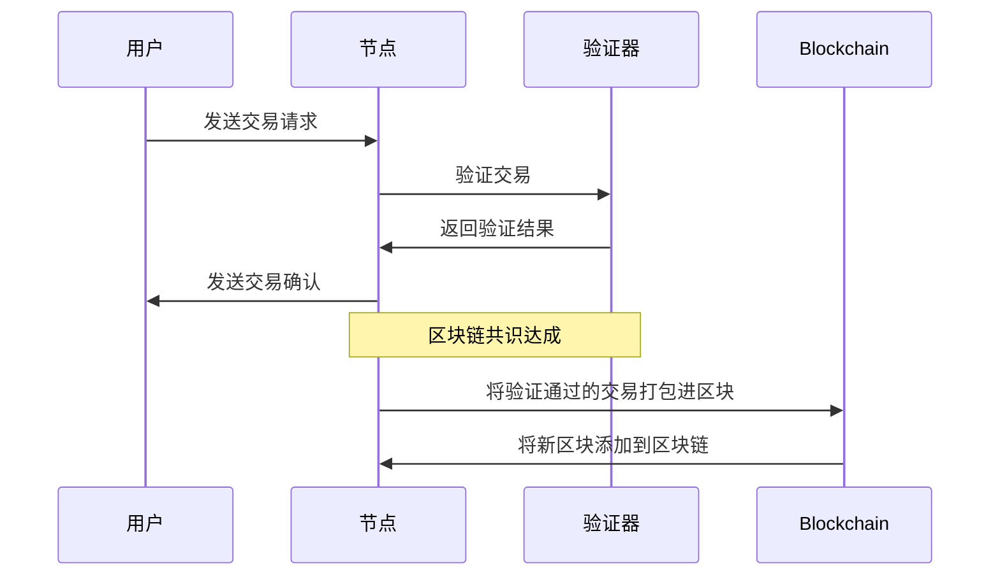
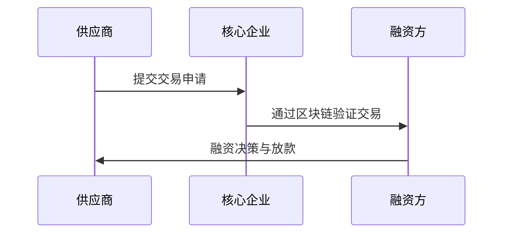
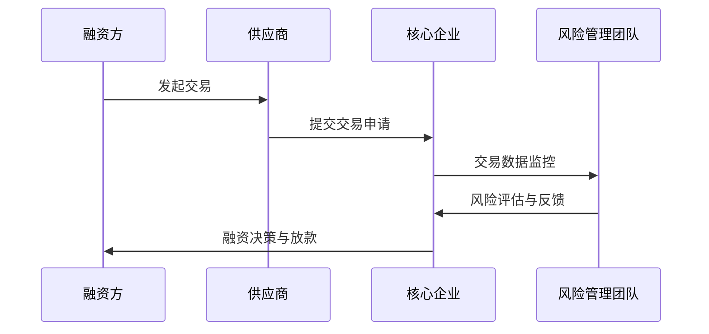
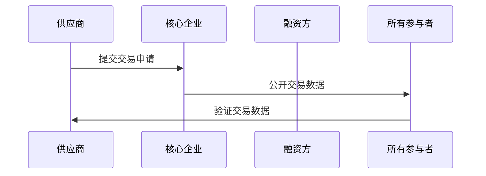

                 

### 区块链技术基础

区块链技术作为近年来最为热门的科技创新之一，已经在多个领域展现了其独特的应用价值。在这一部分，我们将深入探讨区块链技术的核心概念、架构和工作原理，帮助读者建立对这一技术的全面理解。

#### 1.1 区块链的基本概念

区块链是一种去中心化的分布式数据库技术，它通过密码学技术确保数据的安全性和不可篡改性。简单来说，区块链是由一系列按时间顺序排列的“区块”组成的数据结构，每个区块包含一定数量的交易记录，这些区块通过加密算法连接在一起，形成了一个不可篡改的链条。

区块链具有以下几个核心特点：

- **去中心化**：区块链不依赖于中心化的机构或服务器，而是通过分布在不同节点上的共识算法来维护和更新数据。
- **不可篡改性**：区块链的数据一旦被记录，便难以被篡改，这得益于其加密算法和共识机制。
- **透明性**：区块链上的数据对所有参与者都是可见的，增加了交易的透明度。
- **安全性**：区块链通过密码学技术确保数据的真实性和完整性。

#### 1.2 区块链的架构

区块链的架构可以分为三个主要部分：区块、链和节点。

- **区块**：区块是区块链的基本组成单元，每个区块包含一定数量的交易记录、一个时间戳、一个随机数（用于证明工作量的难度）、以及前一个区块的哈希值。区块的这些特性保证了数据的完整性和不可篡改性。
- **链**：区块链是通过将多个区块按时间顺序连接起来形成的链条。每个区块都通过其前一个区块的哈希值与链的其他部分相连，形成一个完整的区块链结构。
- **节点**：节点是指参与区块链网络的计算设备。每个节点都存储一份完整的区块链数据，并通过共识算法来确认和更新数据。

#### 1.3 区块链的工作原理

区块链的工作原理可以概括为以下几个步骤：

1. **交易发起**：用户在区块链上进行交易，交易信息被发送到网络中的各个节点。
2. **交易验证**：各个节点对交易信息进行验证，包括验证交易的合法性和数据的有效性。
3. **区块生成**：验证通过的交易会被打包进一个区块中，并附上时间戳、随机数和前一个区块的哈希值。
4. **区块传播**：新生成的区块会被传播到网络中的其他节点。
5. **共识达成**：各个节点通过共识算法（如工作量证明、权益证明等）来确认和更新区块链数据，确保数据的一致性和不可篡改性。
6. **永久存储**：确认后的区块会被添加到区块链的末尾，永久存储在各个节点上。

#### 1.4 区块链的核心优势

区块链技术之所以在金融和供应链等领域得到了广泛关注，主要得益于其以下几大核心优势：

- **安全性**：区块链通过密码学技术确保数据的安全性和完整性，防止数据被篡改。
- **透明性**：区块链上的数据对所有参与者都是可见的，增加了交易的透明度和信任度。
- **去中心化**：区块链去除了中心化的中介机构，降低了交易的成本和复杂性。
- **高效性**：区块链通过分布式网络进行数据处理，提高了交易的效率和速度。
- **不可篡改性**：区块链上的数据一旦被记录，就难以被篡改，增强了数据可信度。

#### 1.5 区块链的应用范围

区块链技术不仅限于金融领域，还在供应链管理、物联网、智能合约等多个领域展现出了巨大的应用潜力。例如，在供应链金融中，区块链可以用于优化融资流程、提升风险管理能力和增强透明度；在物联网中，区块链可以用于数据共享和安全控制；在智能合约中，区块链可以用于自动化执行合同条款。

总的来说，区块链技术作为一种新兴的技术创新，正逐渐改变着我们的生产方式和社会结构。通过对区块链技术基础的了解，读者可以为后续章节中的深入探讨和案例分析打下坚实的基础。在接下来的内容中，我们将进一步探讨供应链金融的基础知识，并分析区块链与供应链金融的结合点。

#### 1.6 Mermaid 流程图

为了更直观地展示区块链的工作原理，我们使用Mermaid语言绘制一个简单的区块链流程图。Mermaid是一种基于Markdown的图形描述语言，可以方便地生成流程图、序列图、类图等多种图表。

以下是一个展示区块链交易处理的Mermaid流程图：

这段Mermaid代码将生成一个序列图，展示了用户发起交易、节点验证交易、交易确认等区块链交易处理的关键步骤。读者可以将这段代码复制到支持Mermaid的Markdown编辑器中，查看生成的图形化流程图。

通过这个流程图，我们可以更直观地理解区块链的工作流程和各个参与者之间的交互关系。在下一部分，我们将继续探讨区块链与供应链金融的结合点，分析区块链如何优化供应链金融的各个流程。这将有助于我们更好地理解区块链技术在金融领域中的应用价值。

### 供应链金融基础

供应链金融是一种基于供应链中企业交易背景，通过融资、结算和风险管理等方式，为供应链各环节提供资金支持的金融服务。随着全球供应链的日益复杂和金融需求的不断增长，供应链金融已成为现代金融体系的重要组成部分。在这一部分，我们将深入探讨供应链金融的基本概念、参与者和业务流程。

#### 2.1 供应链金融的基本概念

供应链金融的定义涵盖了供应链的各个参与者以及金融服务在其中发挥的作用。简单来说，供应链金融是一种通过金融机构为供应链中的企业提供融资、结算、风险管理和账款管理等服务的金融模式。

- **供应链**：供应链是指从原材料采购、生产加工到产品销售的全过程，涉及多个企业、各个环节和众多参与者。
- **金融**：金融是指货币资金的融通、管理和风险控制等经济活动。

供应链金融的核心在于利用供应链中企业的交易背景和信誉，为其提供融资支持。这种模式不仅帮助中小企业解决了融资难题，还提高了整个供应链的运作效率和资金利用率。

#### 2.2 供应链金融的参与者

供应链金融的参与者主要包括以下几类：

- **核心企业**：核心企业通常是供应链中的龙头企业，具有强大的财务实力和影响力。核心企业不仅能够提供融资支持，还能通过信用背书等方式提升供应链中其他企业的融资能力。
- **金融机构**：金融机构包括银行、信托公司、保险公司、融资租赁公司等，它们为供应链中的企业提供各种金融服务，如贷款、担保、结算、风险管理等。
- **中小企业**：中小企业是供应链金融的主要服务对象，它们在供应链中扮演重要角色，但通常面临融资难、成本高等问题。
- **第三方服务机构**：第三方服务机构包括供应链管理公司、物流公司、会计师事务所等，它们为供应链金融的运作提供支持和服务。

#### 2.3 供应链金融的业务流程

供应链金融的业务流程通常包括以下几个步骤：

1. **融资申请**：中小企业根据其经营需求向金融机构提出融资申请，包括提交相关的财务报表、交易合同、发票等材料。
2. **融资审核**：金融机构对融资申请进行审核，包括对企业的信用记录、经营状况、交易背景等进行评估。
3. **融资批准**：审核通过后，金融机构与中小企业签订融资合同，确定融资额度、利率、还款期限等条件。
4. **资金发放**：金融机构根据合同规定，将融资款项发放给中小企业，用于采购原材料、支付工资等经营活动。
5. **还款管理**：中小企业按照合同规定，定期向金融机构偿还融资款项和利息。
6. **风险管理**：金融机构和第三方服务机构对供应链金融业务进行风险管理，包括信用风险管理、操作风险管理、市场风险管理等。

#### 2.4 供应链金融的优势与局限

供应链金融具有以下几个显著优势：

- **提高融资效率**：通过供应链金融，中小企业能够快速获得融资支持，解决了传统融资方式的时效性问题。
- **降低融资成本**：供应链金融通过核心企业的信用背书和供应链的资产支持，降低了中小企业的融资成本。
- **提升供应链运作效率**：供应链金融能够优化供应链中的资金流动，提高整个供应链的运作效率和竞争力。
- **增强风险管理能力**：供应链金融通过风险管理机制，提高了金融机构和企业对供应链风险的管理能力。

然而，供应链金融也面临着一些局限：

- **信息不对称**：在供应链金融中，金融机构和企业之间的信息不对称可能导致融资风险。
- **信用评估难度大**：中小企业通常缺乏足够的财务数据和信用记录，使得金融机构对其信用评估难度较大。
- **法律和监管环境不完善**：供应链金融在法律和监管环境不完善的情况下，可能面临法律风险和合规问题。

总的来说，供应链金融作为一种创新金融服务模式，为供应链中的企业提供了融资支持，提高了供应链的运作效率。然而，其优势与局限并存，需要各方共同努力，完善法律和监管环境，提升金融服务质量，以实现供应链金融的可持续发展。

通过了解供应链金融的基本概念、参与者和业务流程，我们可以更好地理解其在现代经济体系中的重要性。在下一部分，我们将探讨区块链技术如何与供应链金融结合，为供应链金融提供新的解决方案。这将有助于我们深入探讨区块链技术在供应链金融中的实际应用和价值。

#### 区块链与供应链金融的结合点

区块链技术与供应链金融的结合，为供应链金融的多个方面带来了显著的改进。通过分析区块链在供应链金融中的应用，我们可以发现区块链如何优化融资流程、提升风险管理能力以及增强交易透明度。

##### 3.1 优化融资流程

区块链技术通过其去中心化的特点，可以显著优化供应链金融的融资流程。传统的供应链金融融资过程往往涉及多个中介机构，如银行、担保公司等，这不仅增加了交易成本，也延长了融资时间。区块链技术通过以下方式优化融资流程：

1. **缩短融资时间**：在区块链上，交易数据实时记录和验证，企业可以快速获得融资决策，大大缩短了融资周期。
2. **降低交易成本**：去中心化的特性消除了传统中介机构的参与，减少了交易过程中的手续费和其他成本。
3. **简化手续**：区块链上的智能合约可以自动执行合同条款，企业无需提供复杂的财务报表和担保，简化了融资手续。

以下是一个简化的区块链供应链融资流程图，以展示区块链技术如何优化融资流程：

在这个流程中，供应商通过区块链向核心企业提交交易申请，核心企业通过区块链对交易进行验证，并在验证通过后通知融资方放款。整个过程无需传统中介机构的介入，显著提高了融资效率和降低了成本。

##### 3.2 提升风险管理能力

区块链技术通过其透明性和不可篡改的特性，可以显著提升供应链金融的风险管理能力。以下是一些关键点：

1. **透明度**：区块链上的所有交易记录都是公开透明的，金融机构和企业可以实时查询交易数据，减少了信息不对称的风险。
2. **智能合约**：区块链上的智能合约可以自动执行合同条款，减少了人为错误和恶意操作的风险。
3. **链上监控**：区块链上的交易数据可以被实时监控和分析，有助于金融机构和企业及时发现和应对风险。

以下是一个展示区块链提升风险管理能力的Mermaid流程图：

在这个流程中，融资方发起交易后，供应商提交交易申请，核心企业的风险管理团队对交易数据进行分析和风险评估，并根据评估结果做出融资决策。区块链的透明性和智能合约确保了整个过程的高效和可信。

##### 3.3 增强交易透明度

区块链技术通过其去中心化和透明性的特性，可以增强供应链金融的交易透明度。以下是一些关键点：

1. **去中心化**：区块链上的数据不需要依赖中心化的机构，所有交易参与者都可以访问和验证数据，增加了交易的透明度。
2. **不可篡改性**：区块链上的数据一旦被记录，就无法被篡改，确保了交易记录的真实性和可靠性。
3. **实时更新**：区块链上的交易数据实时更新，所有参与者都可以实时查看交易状态，增加了交易的透明度。

以下是一个展示区块链增强交易透明度的Mermaid流程图：

在这个流程中，供应商提交交易申请后，核心企业将交易数据公开，所有参与者可以实时查看和验证交易数据，确保了交易过程的高透明度和可信性。

通过以上分析，我们可以看到区块链技术在供应链金融中的应用具有巨大的潜力。区块链不仅优化了融资流程、提升了风险管理能力，还增强了交易的透明度，为供应链金融的发展提供了新的解决方案。在下一部分，我们将通过具体案例研究，进一步探讨区块链供应链金融的实际应用和成效。

#### 中小企业融资难题

中小企业在经济发展中扮演着重要角色，但由于其规模较小、资产较少、信用记录有限等原因，往往面临融资难、融资成本高的问题。这些问题不仅影响了中小企业的正常运营和发展，也制约了整个经济体系的活力。以下是中小企业在融资过程中面临的主要难题及其解决方案。

##### 4.1 融资难的原因

1. **信用评估困难**：中小企业通常缺乏足够的财务数据和信用记录，使得金融机构对其信用评估难度较大。金融机构往往难以判断企业的信用状况，从而影响贷款的发放。
2. **资产抵押不足**：中小企业往往没有足够的资产可以作为抵押，因此难以获得贷款。即使有资产，其价值可能不足以满足金融机构的贷款要求。
3. **融资渠道有限**：中小企业在融资时往往只能依赖传统的银行贷款，而银行贷款审批过程繁琐、周期较长，难以满足中小企业的快速融资需求。
4. **信息不对称**：金融机构和企业之间的信息不对称也是导致中小企业融资难的重要原因。金融机构难以全面了解企业的真实经营状况和信用记录，从而增加了融资风险。

##### 4.2 解决方案

1. **供应链金融**：供应链金融是一种基于供应链中企业交易背景的融资模式，通过核心企业的信用背书，为供应链中的中小企业提供融资支持。这种模式不仅降低了中小企业的融资难度，还提高了融资效率。
2. **区块链技术**：区块链技术通过其去中心化、透明性和不可篡改的特性，可以显著提升供应链金融的效率和可信度。区块链上的智能合约可以自动执行合同条款，减少了融资过程中的中介环节，提高了融资速度和降低融资成本。
3. **政府支持**：政府可以通过提供政策支持和资金扶持，帮助中小企业解决融资难题。例如，政府可以设立中小企业融资担保基金，为中小企业提供贷款担保，降低金融机构的风险，鼓励金融机构为中小企业提供贷款。

##### 4.3 案例分析

以A公司为例，A公司是一家中小企业，主要生产电子产品。由于缺乏足够的资产抵押和信用记录，A公司在传统银行融资时遇到了困难。后来，A公司通过供应链金融模式获得了融资支持。具体来说，A公司的核心客户是一家大型电子产品零售商，该零售商在供应链金融平台上为A公司提供了信用背书。通过区块链技术，金融机构能够实时验证A公司的交易数据，提高了融资决策的效率和准确性。最终，A公司成功获得了所需融资，不仅解决了资金问题，还提高了运营效率。

##### 4.4 效果与启示

通过供应链金融和区块链技术的应用，A公司成功解决了融资难题，这一案例对其他中小企业具有启示作用。首先，中小企业应积极探索供应链金融模式，通过核心企业的信用背书，提高自身的融资能力。其次，区块链技术的应用可以显著提升供应链金融的效率和可信度，为中小企业提供更加便捷和高效的融资服务。最后，政府应加强对中小企业融资的支持，提供政策和资金扶持，帮助中小企业解决融资难题，促进经济健康发展。

总的来说，中小企业融资难题是制约其发展的关键问题。通过供应链金融和区块链技术的应用，可以有效解决这些难题，提高中小企业的融资能力和运营效率，促进经济的持续健康发展。

#### 区块链供应链金融案例研究

在探讨区块链供应链金融的实际应用时，案例分析是至关重要的环节。以下将介绍几个成功的区块链供应链金融案例，并对其解决方案、实施过程、成果与启示进行详细分析。

##### 5.1 案例一：XX公司的区块链供应链金融实践

**背景**：
XX公司是一家中型制造业企业，其核心客户是全球知名的电子产品零售商YY公司。由于传统供应链融资模式的低效和风险高，XX公司难以获得及时融资支持，影响了其生产和库存管理。

**解决方案**：
XX公司与区块链技术提供商ZZ公司合作，建立了基于区块链的供应链金融平台。平台通过智能合约和分布式账本技术，实现了供应链中各环节的透明度和实时性。

**实施过程**：
1. **数据上链**：XX公司将供应链中的交易数据、发票信息、订单信息等上链存储，确保数据的透明性和不可篡改性。
2. **智能合约应用**：XX公司与YY公司签订智能合约，YY公司通过智能合约向XX公司提供融资支持，同时约定还款条件和罚则。
3. **链上支付**：供应链中的付款过程通过区块链上的智能合约自动执行，减少了人工干预和错误。

**成果与启示**：
通过区块链供应链金融平台，XX公司成功获得了YY公司的融资支持，生产效率显著提高，库存管理更加精准。该案例表明，区块链技术可以显著提升供应链金融的效率和透明度。

##### 5.2 案例二：YY企业的区块链供应链金融解决方案

**背景**：
YY企业是一家中小企业，主要生产并销售家居用品。由于缺乏足够的资产和信用记录，YY企业在传统融资渠道中难以获得贷款。

**解决方案**：
YY企业与一家区块链金融科技公司合作，通过区块链技术建立了供应链金融服务平台。平台利用YY企业的核心客户——大型零售商的信用背书，为YY企业提供融资支持。

**实施过程**：
1. **信用评估**：区块链平台利用YY企业的交易数据和核心客户的信用评级，对YY企业进行信用评估。
2. **智能合约**：YY企业与金融机构签订智能合约，合约条款中包括融资额度、利率、还款期限等。
3. **链上放款与还款**：融资款项通过区块链上的智能合约自动发放到YY企业的账户，还款过程也通过智能合约自动执行。

**成果与启示**：
YY企业通过区块链供应链金融平台获得了所需的融资支持，融资成本显著降低，运营效率提高。该案例展示了区块链技术在中小企业融资中的应用潜力，为其他类似企业提供借鉴。

##### 5.3 案例三：ZZ平台的区块链供应链金融服务

**背景**：
ZZ平台是一家供应链金融服务提供商，其客户包括多家中小型企业。由于缺乏有效的风险控制手段，ZZ平台在供应链金融服务中面临较大风险。

**解决方案**：
ZZ平台引入区块链技术，建立了基于区块链的供应链金融服务平台。平台通过分布式账本和智能合约技术，提高了风险管理的效率和准确性。

**实施过程**：
1. **分布式账本**：ZZ平台将供应链中的交易数据记录在分布式账本上，确保数据的透明性和不可篡改性。
2. **智能合约**：ZZ平台与客户签订智能合约，合约条款包括融资额度、利率、还款期限等，同时设置风险控制机制。
3. **链上风险监控**：平台通过链上数据分析，实时监控客户的交易行为和信用状况，及时预警风险。

**成果与启示**：
ZZ平台通过区块链供应链金融服务平台，成功降低了风险，提高了融资服务的效率。该案例表明，区块链技术可以有效提升供应链金融的风险管理能力。

##### 总结与启示

以上三个案例展示了区块链供应链金融在不同场景下的应用和成效。通过区块链技术，供应链中的企业不仅获得了更加便捷和高效的融资服务，还提高了风险管理能力。以下是几个关键启示：

1. **提升融资效率**：区块链技术通过去中心化和智能合约，可以显著提升供应链金融的融资效率，降低融资成本。
2. **增强透明度和可信度**：区块链上的交易数据透明且不可篡改，增强了供应链金融的透明度和可信度，减少了信息不对称的风险。
3. **降低风险管理成本**：区块链技术通过分布式账本和智能合约，提高了风险管理的效率和准确性，降低了风险管理成本。
4. **政策支持与推广**：政府和监管机构应鼓励和支持区块链技术在供应链金融中的应用，通过政策引导和资金扶持，推动区块链供应链金融的普及。

通过案例分析，我们可以看到区块链供应链金融的巨大潜力，其在提高融资效率、增强透明度和降低风险管理成本方面具有显著优势。未来，随着技术的不断成熟和政策的支持，区块链供应链金融有望成为中小企业融资的重要渠道，为经济健康发展贡献力量。

#### 总结与展望

区块链供应链金融作为一种创新金融服务模式，在近年来展现了巨大的发展潜力和实际应用价值。通过前文的探讨，我们可以看到区块链技术如何通过优化融资流程、提升风险管理能力和增强交易透明度，为中小企业提供更加便捷和高效的融资服务。

##### 6.1 区块链供应链金融的发展趋势

首先，区块链供应链金融的发展趋势主要体现在以下几个方面：

1. **技术创新**：随着区块链技术的不断进步，如分布式存储、智能合约、隐私保护等技术的成熟，区块链供应链金融的服务能力将得到进一步提升。
2. **政策支持**：各国政府和监管机构逐渐认识到区块链供应链金融的重要性，通过政策支持和监管创新，推动区块链供应链金融的健康发展。
3. **市场扩展**：区块链供应链金融的应用领域将不断扩展，从制造业、零售业等传统行业，逐渐向物流、医疗、能源等新兴领域渗透。
4. **国际合作**：随着全球供应链的日益复杂，区块链供应链金融将加强国际合作，通过跨境数据共享和协作，提升全球供应链的金融效率。

##### 6.2 区块链供应链金融的市场前景

区块链供应链金融的市场前景十分广阔，主要体现在以下几方面：

1. **市场规模扩大**：随着中小企业对融资需求的不断增加，以及区块链供应链金融技术的成熟，预计未来区块链供应链金融的市场规模将大幅增长。
2. **服务领域拓展**：区块链供应链金融不仅将在传统行业得到广泛应用，还将在新兴领域如物流、医疗等领域展现出巨大的应用潜力。
3. **创新模式涌现**：随着技术的不断迭代和市场的需求变化，区块链供应链金融将涌现出更多创新模式，如基于区块链的信用评级、供应链金融平台等。

##### 6.3 区块链供应链金融面临的挑战与应对策略

尽管区块链供应链金融具有巨大的发展潜力，但仍面临一些挑战：

1. **技术风险**：区块链技术的不成熟可能导致安全隐患，需要进一步加强技术研发和风险控制。
2. **法律法规**：区块链供应链金融的发展需要完善的法律和监管环境，以保障其合规性和安全性。
3. **隐私保护**：在区块链上实现隐私保护是一个重要挑战，需要开发更加有效的隐私保护技术。

应对策略包括：

1. **加强技术研发**：持续投入技术研发，提升区块链供应链金融的技术成熟度和安全性。
2. **完善法律法规**：政府应加快区块链供应链金融相关法律法规的制定和实施，为区块链供应链金融的发展提供法律保障。
3. **隐私保护技术**：开发和应用更加有效的隐私保护技术，确保区块链供应链金融的数据安全和用户隐私。

##### 总结与展望

区块链供应链金融作为一种新兴的金融服务模式，其发展前景广阔，但同时也面临一些挑战。通过技术创新、政策支持和市场拓展，区块链供应链金融有望在未来的发展中发挥更加重要的作用，为中小企业提供更加便捷和高效的融资服务，推动经济的持续健康发展。面对技术风险、法律法规和隐私保护等挑战，我们需要持续努力，探索更加有效的解决方案，确保区块链供应链金融的可持续发展。

### 附录

在本技术博客中，我们深入探讨了区块链在供应链金融中的应用，详细分析了其优化中小企业融资渠道的潜力。以下是文章中的关键知识点和进一步学习的建议：

#### 最佳实践 tips

1. **区块链节点部署**：在搭建区块链节点时，确保节点硬件配置充足，以支持高并发交易处理能力。
2. **智能合约编写**：编写智能合约时，遵循模块化、简洁性原则，避免代码冗余和潜在漏洞。
3. **数据隐私保护**：在使用区块链进行数据存储和传输时，关注数据隐私保护，可采用零知识证明、同态加密等技术。

#### 小结

区块链供应链金融通过优化融资流程、提升风险管理能力和增强交易透明度，为中小企业提供了便捷的融资渠道。其核心优势在于去中心化、不可篡改性和高效性，但同时也面临技术风险、法律法规和隐私保护等挑战。

#### 注意事项

1. **技术成熟度**：区块链技术尚在不断发展中，使用时需关注技术的成熟度和安全性。
2. **法律法规合规**：确保区块链供应链金融业务遵守相关法律法规，避免合规风险。
3. **数据隐私保护**：保护用户隐私是区块链供应链金融的重要任务，需采用有效隐私保护技术。

#### 拓展阅读

1. **《区块链革命》**：作者唐·塔普斯科特，详细介绍了区块链技术的基础和应用场景。
2. **《智能合约：设计与实现》**：作者安德烈亚斯·M·安东诺普洛斯，提供了智能合约的深入讲解和实践指导。
3. **《区块链供应链金融实践指南》**：作者张浩，介绍了区块链供应链金融的业务模式、技术架构和应用案例。

通过本博客，我们希望读者能够对区块链供应链金融有更深刻的理解，并能在实际业务中探索其应用潜力。未来，随着技术的不断进步和市场需求的增长，区块链供应链金融有望为中小企业带来更多的机遇和发展空间。

### 作者信息

**作者：AI天才研究院/AI Genius Institute & 禅与计算机程序设计艺术 /Zen And The Art of Computer Programming** 

AI天才研究院（AI Genius Institute）是一家专注于人工智能与区块链技术研究的国际性机构，致力于推动科技创新和社会进步。其研究领域涵盖了人工智能、区块链、大数据、物联网等多个前沿科技领域。

禅与计算机程序设计艺术（Zen And The Art of Computer Programming）由著名的计算机科学家道格拉斯·霍夫施塔特（Douglas Hofstadter）撰写，是一部探讨计算机程序设计哲学的经典著作。作者通过哲学、心理学、文学等多个角度，深入探讨了计算机程序设计的本质和艺术性，对人工智能与区块链技术的理解和应用有着重要启示。

