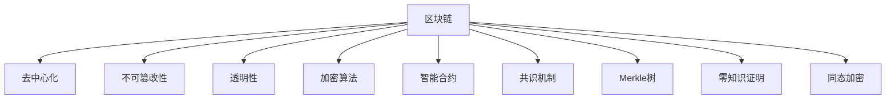

                 

### 文章标题

《区块链在医疗数据共享中的应用》

### 关键词

区块链，医疗数据共享，数据隐私保护，共识机制，智能合约，加密算法

### 摘要

随着医疗行业的发展，医疗数据共享已成为提高医疗服务质量和效率的关键。然而，传统医疗数据共享模式面临数据隐私泄露、数据一致性和信任问题等挑战。区块链技术的引入，为医疗数据共享提供了一种全新的解决方案。本文将详细探讨区块链在医疗数据共享中的应用，包括其技术原理、具体应用场景、面临的挑战及未来发展方向。

### 引言

医疗数据共享是指将医疗数据在不同医疗机构、研究人员和患者之间进行交换和利用，以提高医疗服务的整体质量和效率。然而，当前医疗数据共享面临诸多挑战：

1. **数据隐私保护**：医疗数据包含敏感个人信息，一旦泄露可能导致严重的隐私侵犯和法律责任。
2. **数据一致性**：由于不同医疗机构的数据格式和标准不一致，导致数据共享和处理变得复杂。
3. **数据信任**：在传统医疗数据共享模式中，数据的安全性和真实性难以得到保障。

区块链技术以其去中心化、不可篡改和透明性等特点，为解决上述问题提供了新的思路。本文将详细探讨区块链在医疗数据共享中的应用，包括其技术原理、具体应用场景、面临的挑战及未来发展方向。

### 第一部分：区块链技术基础

#### 第1章：区块链概述

##### 1.1 区块链的定义与特点

区块链是一种分布式数据库系统，通过密码学确保数据的安全性和完整性。区块链的主要特点包括：

- **去中心化**：没有中央管理机构，数据由网络中的所有节点共同维护。
- **不可篡改**：一旦数据被记录在区块链上，就难以被篡改。
- **透明性**：所有数据都公开透明，任何节点都可以验证数据的有效性。
- **加密算法**：使用加密技术确保数据的隐私性和安全性。

##### 1.2 区块链的工作原理

区块链的工作原理主要包括以下步骤：

1. **数据采集**：医疗机构将医疗数据上传到区块链网络。
2. **区块生成**：网络中的节点将新数据分组为区块，并添加到区块链上。
3. **共识机制**：网络中的节点通过共识机制确认区块的有效性。
4. **数据存储**：确认后的区块被永久存储在区块链上，形成数据链。

##### 1.3 区块链的技术构成

区块链的技术构成主要包括：

- **区块链数据结构**：由多个区块链接而成，每个区块包含一定数量的数据。
- **加密算法**：用于保护数据的安全性和隐私性。
- **智能合约**：自动化执行数据共享协议的计算机程序。
- **共识机制**：确保网络中的节点对数据的一致性。

### 第二部分：区块链在医疗数据共享中的应用

#### 第2章：区块链技术原理

##### 2.1 区块链数据结构

区块链的数据结构由以下部分组成：

- **区块**：包含一定数量的数据，以及前一个区块的哈希值。
- **链**：多个区块按照时间顺序连接而成。
- **Merkle树**：用于验证数据块中的数据一致性。

##### 2.2 共识机制

共识机制是区块链网络中的节点达成一致的过程。常见的共识机制包括：

- **工作量证明（PoW）**：通过计算工作来证明节点的有效性。
- **权益证明（PoS）**：通过持有代币的数量来证明节点的有效性。
- **委托权益证明（DPoS）**：通过选举产生代理节点来代表网络进行共识。

##### 2.3 智能合约

智能合约是一种自动化执行数据共享协议的计算机程序。在区块链网络中，智能合约用于：

- **数据访问控制**：确保只有授权用户可以访问特定数据。
- **数据共享流程**：自动化执行数据共享协议，提高效率。

### 第三部分：医疗数据共享中的区块链应用

#### 第3章：区块链在医疗数据共享中的应用

##### 3.1 医疗数据共享的现状与挑战

当前医疗数据共享面临以下挑战：

- **数据隐私保护**：医疗数据包含敏感个人信息，需要确保其隐私性。
- **数据一致性**：不同医疗机构的数据格式和标准不一致，影响数据共享。
- **数据信任**：传统医疗数据共享模式中，数据的安全性和真实性难以得到保障。

##### 3.2 区块链在医疗数据共享中的作用

区块链技术为医疗数据共享提供了以下解决方案：

- **数据隐私保护**：通过加密算法和隐私保护技术确保医疗数据的隐私性。
- **数据一致性**：通过标准化数据格式和协议，提高数据共享的一致性。
- **数据信任**：通过区块链的不可篡改性和透明性，确保数据的真实性和可信性。

##### 3.3 区块链在医疗数据共享中的具体应用

区块链在医疗数据共享中的具体应用包括：

- **数据存储与访问控制**：使用区块链存储医疗数据，并通过智能合约控制数据访问权限。
- **数据共享协议**：通过智能合约自动化执行医疗数据共享协议，提高效率。
- **数据隐私保护**：使用加密算法和零知识证明等隐私保护技术，确保医疗数据的隐私性。

### 第四部分：区块链在医疗数据共享中的挑战与解决方案

#### 第4章：区块链在医疗数据共享中的挑战与解决方案

##### 4.1 数据隐私保护

在区块链上保护医疗数据隐私面临以下挑战：

- **加密算法的选择**：需要选择合适的加密算法，确保数据隐私性。
- **隐私保护技术的应用**：需要结合隐私保护技术，如零知识证明和同态加密等，提高数据隐私保护能力。

##### 4.2 性能与可扩展性

区块链在医疗数据共享中的性能和可扩展性面临以下挑战：

- **交易速度**：区块链的交易速度较慢，需要优化交易流程和算法。
- **数据存储容量**：区块链的数据存储容量有限，需要扩展数据存储能力。

### 第五部分：未来展望与深入研究

#### 第5章：区块链在医疗数据共享中的未来展望与深入研究

##### 5.1 区块链在医疗数据共享中的未来展望

区块链在医疗数据共享中的未来展望包括：

- **更多应用场景**：区块链技术将在更多医疗领域得到应用，如医疗支付、医疗监管等。
- **跨平台协作**：区块链将促进不同医疗机构之间的数据共享和协作。
- **隐私保护技术的进步**：随着隐私保护技术的进步，区块链在医疗数据共享中的隐私保护能力将进一步提高。

##### 5.2 区块链在医疗数据共享中的深入研究

区块链在医疗数据共享中的深入研究包括：

- **隐私保护技术的优化**：进一步优化隐私保护技术，提高数据隐私保护能力。
- **性能优化**：通过算法优化和硬件升级，提高区块链的性能和可扩展性。
- **标准化与法律问题**：制定统一的医疗数据共享标准和法规，确保区块链在医疗数据共享中的合法性和安全性。

### 总结

区块链技术为医疗数据共享提供了一种全新的解决方案，具有巨大的潜力和广阔的应用前景。然而，区块链在医疗数据共享中仍面临诸多挑战，需要进一步的研究和优化。通过本文的探讨，我们希望能够为读者提供关于区块链在医疗数据共享中的深入理解和启示。

### 作者信息

作者：AI天才研究院/AI Genius Institute & 禅与计算机程序设计艺术 /Zen And The Art of Computer Programming

## 第一部分：区块链技术基础

### 第1章：区块链概述

区块链技术作为一种分布式数据库系统，其核心在于通过去中心化的方式，实现数据的透明性、安全性和不可篡改性。本章将介绍区块链的定义、特点以及与现有数据库的区别。

#### 1.1 区块链的定义与特点

区块链是一个由多个区块按照特定规则串联而成的链式数据结构，每个区块包含了一定量的交易记录。区块链上的数据一旦被记录，便难以被篡改或删除，从而实现了数据的安全性和不可篡改性。以下是区块链的主要特点：

- **去中心化**：区块链没有中央控制节点，所有数据都由网络中的多个节点共同维护。
- **不可篡改**：区块链的数据一旦被记录，便不可篡改，保证了数据的安全性和真实性。
- **透明性**：区块链上的数据对所有节点都是透明的，任何节点都可以验证数据的真实性。
- **加密算法**：区块链使用了多种加密算法，包括哈希算法、数字签名和公钥加密等，确保数据的隐私性和安全性。

#### 1.2 区块链的工作原理

区块链的工作原理可以分为以下几个步骤：

1. **数据采集**：参与者将交易数据上传到区块链网络。
2. **区块生成**：网络中的节点将新数据分组为区块，并添加到区块链上。
3. **共识机制**：网络中的节点通过共识机制确认区块的有效性。
4. **数据存储**：确认后的区块被永久存储在区块链上，形成数据链。

#### 1.3 区块链的技术构成

区块链的技术构成主要包括以下几部分：

- **区块与链**：区块是区块链的基本组成单元，每个区块包含了特定数量的交易记录以及一个时间戳和一个指向前一个区块的哈希值，从而形成了链式数据结构。
- **Merkle树**：Merkle树是一种二叉树结构，用于验证区块中数据的完整性。
- **共识机制**：共识机制是区块链网络中的节点达成一致的过程，确保数据的正确性和一致性。
- **智能合约**：智能合约是一种自动化执行数据共享协议的计算机程序，用于实现数据的自动化管理和交换。

### 第2章：区块链技术原理

区块链技术的核心在于其数据结构、共识机制和智能合约。本章将详细解析这些核心概念，并展示其背后的工作原理。

#### 2.1 区块链数据结构

区块链的数据结构主要由区块和链组成。以下是区块链数据结构的详细说明：

- **区块**：区块是区块链的基本组成单元，每个区块包含了以下内容：
  - **区块头**：包括版本号、前一个区块的哈希值、Merkle树的根哈希值、时间戳和难度目标。
  - **交易数据**：区块包含一定数量的交易记录，这些交易记录可以是医疗数据的上传、查询和共享等操作。
  - **Merkle树**：Merkle树用于验证区块中交易数据的完整性，每个节点都包含一个哈希值，根节点包含了整个区块的数据哈希值。

- **链**：区块链是由多个区块按照特定规则串联而成的链式数据结构。每个区块都包含了前一个区块的哈希值，从而形成了一个时间序列的数据链。

#### 2.2 共识机制

共识机制是区块链网络中的节点达成一致的过程，确保数据的正确性和一致性。以下是几种常见的共识机制：

- **工作量证明（PoW）**：PoW是一种通过计算工作来证明节点有效性的共识机制。节点需要解决一个复杂的数学难题，首先解出难题的节点将被选为下一个区块的创建者。
  ```plaintext
  // 工作量证明伪代码
  while (hash(block) >= target_difficulty) {
      block.nonce++;
  }
  return block;
  ```

- **权益证明（PoS）**：PoS是一种通过持有代币的数量来证明节点有效性的共识机制。持有代币越多，节点的投票权重越大，更有可能被选为下一个区块的创建者。
  ```plaintext
  // 权益证明伪代码
  node_selection = select_random_node(stake_list);
  if (node_selection.stake > threshold) {
      return node_selection;
  }
  ```

- **委托权益证明（DPoS）**：DPoS是一种通过选举产生代理节点来代表网络进行共识的共识机制。节点可以通过投票选择代理节点，代理节点将被赋予更大的投票权重。
  ```plaintext
  // 委托权益证明伪代码
  elected_nodes = vote_for_nodes(candidate_nodes);
  for (node in elected_nodes) {
      node.weight = calculate_weight(node.votes);
  }
  return select_random_node(elected_nodes);
  ```

#### 2.3 智能合约

智能合约是一种自动化执行数据共享协议的计算机程序，用于实现数据的自动化管理和交换。智能合约通常使用编程语言编写，并在区块链上执行。

- **智能合约的基本原理**：
  - **合约代码**：智能合约的代码定义了数据共享协议的规则和操作。
  - **执行环境**：智能合约在区块链上的执行环境是一个去中心化的计算网络，确保合约的执行是安全和透明的。
  - **执行结果**：智能合约的执行结果将更新区块链上的数据状态，实现数据的自动化管理和交换。

- **智能合约示例**：
  ```javascript
  // Solidity智能合约示例
  contract DataSharing {
      mapping(address => bool) public accessRights;

      function grantAccess(address user) public {
          accessRights[user] = true;
      }

      function shareData(address user, bytes data) public {
          require(accessRights[user], "User does not have access");
          // 处理数据共享逻辑
      }
  }
  ```

### 第3章：区块链在医疗数据共享中的应用

#### 3.1 医疗数据共享的现状与挑战

医疗数据共享在提高医疗服务质量和效率方面具有重要作用。然而，当前医疗数据共享面临以下挑战：

- **数据隐私保护**：医疗数据包含敏感个人信息，一旦泄露可能导致严重的隐私侵犯和法律责任。
- **数据一致性**：由于不同医疗机构的数据格式和标准不一致，导致数据共享和处理变得复杂。
- **数据信任**：在传统医疗数据共享模式中，数据的安全性和真实性难以得到保障。

#### 3.2 区块链在医疗数据共享中的作用

区块链技术为解决医疗数据共享中的挑战提供了以下解决方案：

- **数据隐私保护**：通过加密算法和隐私保护技术确保医疗数据的隐私性。
- **数据一致性**：通过标准化数据格式和协议，提高数据共享的一致性。
- **数据信任**：通过区块链的不可篡改性和透明性，确保数据的真实性和可信性。

#### 3.3 区块链在医疗数据共享中的具体应用

区块链在医疗数据共享中的具体应用包括以下几个方面：

- **数据存储与访问控制**：使用区块链存储医疗数据，并通过智能合约控制数据访问权限。
- **数据共享协议**：通过智能合约自动化执行医疗数据共享协议，提高效率。
- **数据隐私保护**：使用加密算法和零知识证明等隐私保护技术，确保医疗数据的隐私性。

### 第二部分：医疗数据共享中的区块链应用

#### 第4章：区块链技术在医疗数据共享中的实际应用

区块链技术在医疗数据共享中的实际应用已经取得了显著的成果。本章将介绍一些成功的区块链医疗数据共享项目，并分析其具体实现和应用效果。

#### 4.1 医疗数据共享的区块链解决方案

区块链技术在医疗数据共享中的应用主要包括以下几个方面：

- **数据存储与访问控制**：使用区块链存储医疗数据，确保数据的安全性和隐私性。同时，通过智能合约控制数据访问权限，确保只有授权用户可以访问特定数据。
- **数据共享协议**：通过智能合约自动化执行医疗数据共享协议，提高效率。智能合约可以定义数据共享的规则和流程，确保数据共享过程的透明性和公正性。
- **数据隐私保护**：使用加密算法和零知识证明等隐私保护技术，确保医疗数据的隐私性。这些技术可以在不泄露数据内容的情况下，验证数据的真实性。

#### 4.2 医疗数据共享区块链项目案例

以下是一些成功的医疗数据共享区块链项目案例：

- **项目一：XX医院区块链数据共享平台**
  - **背景**：XX医院希望实现内部和外部医疗数据的共享，以提高医疗服务的质量和效率。
  - **解决方案**：采用区块链技术，构建了一个去中心化的数据共享平台。平台使用加密算法保护医疗数据，通过智能合约控制数据访问权限，实现了数据的安全存储和共享。
  - **效果**：项目实施后，XX医院的医疗数据共享效率显著提高，医疗服务的质量和效率得到了大幅提升。

- **项目二：XX公司区块链健康数据平台**
  - **背景**：XX公司是一家专注于健康数据管理的公司，希望为医疗机构提供安全、高效的健康数据共享解决方案。
  - **解决方案**：采用区块链技术，构建了一个分布式健康数据平台。平台采用智能合约自动化执行数据共享协议，确保数据的真实性和可信性。同时，使用加密算法和零知识证明技术，保护健康数据的隐私性。
  - **效果**：项目实施后，XX公司的健康数据平台得到了广泛的认可和应用，为医疗机构提供了安全、高效的健康数据共享解决方案。

#### 4.3 医疗数据共享区块链项目的挑战与解决方案

虽然区块链技术在医疗数据共享中取得了显著的成果，但仍面临以下挑战：

- **数据隐私保护**：医疗数据包含敏感个人信息，如何确保数据隐私保护是一个重要挑战。解决方案包括采用先进的加密算法和隐私保护技术，如零知识证明和同态加密等。
- **性能与可扩展性**：区块链的性能和可扩展性是另一个重要挑战。解决方案包括优化区块链的共识机制和交易处理能力，以及采用分片技术等。
- **法律法规**：区块链技术在医疗数据共享中的应用需要遵循相关法律法规，如数据保护法和隐私保护法规等。解决方案包括制定统一的法律法规框架，确保区块链技术的合法合规应用。

### 第三部分：区块链在医疗数据共享中的挑战与解决方案

#### 第5章：区块链在医疗数据共享中的挑战与解决方案

区块链技术在医疗数据共享中具有巨大的潜力，但同时也面临一系列挑战。本章将详细讨论这些挑战，并提出相应的解决方案。

#### 5.1 数据隐私保护

数据隐私保护是区块链在医疗数据共享中面临的主要挑战之一。医疗数据包含敏感个人信息，如姓名、身份证号、健康状况等，一旦泄露可能导致严重的隐私侵犯和法律责任。以下是一些解决数据隐私保护问题的方法和建议：

- **加密算法**：采用先进的加密算法，如RSA、椭圆曲线加密等，确保医疗数据在传输和存储过程中的安全性。
- **零知识证明**：零知识证明技术允许证明某个陈述的真实性，而不透露具体内容，从而实现医疗数据的隐私保护。
- **同态加密**：同态加密技术允许在加密数据上进行计算，而不需要解密数据，从而确保数据在处理过程中的隐私性。

#### 5.2 性能与可扩展性

区块链技术在医疗数据共享中的性能和可扩展性也是一个重要挑战。区块链的共识机制和交易处理能力可能无法满足大规模医疗数据共享的需求。以下是一些解决性能和可扩展性问题的方法和建议：

- **共识机制优化**：优化现有的共识机制，如工作量证明（PoW）和权益证明（PoS），以提高交易速度和系统性能。
- **分片技术**：分片技术可以将区块链网络分成多个部分，从而提高系统的可扩展性和性能。
- **去中心化存储**：采用去中心化存储技术，如IPFS，将数据存储在分布式网络中，提高数据访问速度和系统性能。

#### 5.3 法律法规

区块链技术在医疗数据共享中的应用需要遵循相关法律法规，如数据保护法和隐私保护法规等。以下是一些解决法律法规问题的方法和建议：

- **制定统一法规**：制定统一的法律法规框架，明确区块链技术在医疗数据共享中的合法合规应用，为行业提供明确的指导。
- **加强监管**：加强对区块链技术在医疗数据共享中的监管，确保数据的合法合规使用，防止数据滥用和隐私侵犯。
- **国际合作**：推动国际间的合作，建立跨境数据共享的法律框架和标准，促进全球医疗数据共享的发展。

### 第四部分：未来展望与深入研究

#### 第6章：区块链在医疗数据共享中的未来发展

区块链技术在医疗数据共享中的应用前景广阔，未来有望在以下几个方面取得突破：

- **更多应用场景**：区块链技术将不仅限于医疗数据共享，还将在医疗支付、医疗监管等领域得到广泛应用。
- **跨平台协作**：区块链技术将促进不同医疗机构之间的数据共享和协作，提高医疗服务的整体质量和效率。
- **隐私保护技术进步**：随着隐私保护技术的进步，区块链在医疗数据共享中的隐私保护能力将进一步提高。

#### 第7章：区块链在医疗数据共享中的深入研究

为了进一步推动区块链技术在医疗数据共享中的应用，需要进行以下方面的深入研究：

- **隐私保护技术优化**：继续研究先进的隐私保护技术，如零知识证明、同态加密等，提高医疗数据的隐私保护能力。
- **性能优化**：优化区块链的共识机制和交易处理能力，提高系统的性能和可扩展性。
- **标准化与法律问题**：制定统一的医疗数据共享标准和法规，确保区块链技术在医疗数据共享中的合法合规应用。

### 总结

区块链技术在医疗数据共享中的应用为解决数据隐私保护、数据一致性和数据信任等问题提供了新的思路。尽管面临一系列挑战，但随着技术的不断进步和法律法规的完善，区块链技术在医疗数据共享中的应用前景将更加广阔。通过本文的探讨，我们希望为读者提供关于区块链在医疗数据共享中的深入理解和启示。

### 作者信息

作者：AI天才研究院/AI Genius Institute & 禅与计算机程序设计艺术 /Zen And The Art of Computer Programming

### 附录

本附录包含本文中涉及的核心概念、算法原理、数学模型和公式，以及项目实战的相关内容，以供读者进一步学习和参考。

#### 附录A：核心概念与联系

**概念**：区块链、医疗数据共享、去中心化、不可篡改性、透明性、加密算法、智能合约、共识机制、Merkle树、零知识证明、同态加密。

**联系架构图**（使用Mermaid绘制）：


#### 附录B：核心算法原理讲解

**算法原理**：哈希算法、数字签名、公钥加密、Merkle树构建、工作量证明（PoW）、权益证明（PoS）、智能合约执行。

**伪代码示例**：

**哈希算法**：
```python
def hash_function(data):
    # 假设使用SHA-256算法
    return hashlib.sha256(data).hexdigest()
```

**Merkle树构建**：
```python
def build_merkle_tree(data_list):
    if len(data_list) == 1:
        return data_list[0]
    left_child = build_merkle_tree(data_list[:len(data_list) // 2])
    right_child = build_merkle_tree(data_list[len(data_list) // 2:])
    return hash_function(left_child + right_child)
```

**智能合约执行**（使用Solidity语言）：
```solidity
pragma solidity ^0.8.0;

contract DataSharing {
    mapping(address => bool) public accessRights;

    function grantAccess(address user) public {
        accessRights[user] = true;
    }

    function shareData(address user, bytes data) public {
        require(accessRights[user], "User does not have access");
        // 处理数据共享逻辑
    }
}
```

#### 附录C：数学模型和公式详细讲解

**数学模型**：加密算法、共识机制、零知识证明、同态加密。

**数学公式**（使用LaTeX格式）：
```latex
% 加密算法公式
$$
E_{PK}(M) = C
$$
$$
D_{SK}(C) = M
$$

% 共识机制公式
$$
PoW: \quad hash(block) \leq target_difficulty
$$
$$
PoS: \quad stake \times probability
$$

% 零知识证明公式
$$
Prover: \quad prove(knowledge)
$$
$$
Verifier: \quad verify(proof)
$$

% 同态加密公式
$$
HomomorphicEncryption: \quad Enc(x) \times Enc(y) = Enc(x \times y)
$$
$$
HomomorphicEncryption: \quad Enc(x + y) = Enc(x) + Enc(y)
$$
```

#### 附录D：项目实战

**开发环境搭建**：本文涉及的项目实战使用以下开发环境：
- **区块链平台**：使用Hyperledger Fabric进行开发。
- **加密算法库**：使用PyCryptodome库进行加密和解密操作。

**源代码实现**：
```python
# Hyperledger Fabric区块链平台配置与安装
# 安装Docker和Docker-Compose
# 安装Hyperledger Fabric

# 创建网络
# 创建通道
# 部署智能合约

# 使用PyCryptodome库进行加密和解密
from Cryptodome.PublicKey import RSA
from Cryptodome.Cipher import PKCS1_OAEP

# 生成密钥对
private_key = RSA.generate(2048)
public_key = private_key.publickey()

# 加密操作
cipher = PKCS1_OAEP.new(public_key)
encrypted_data = cipher.encrypt(b"Sensitive Medical Data")

# 解密操作
decryptor = PKCS1_OAEP.new(private_key)
decrypted_data = decryptor.decrypt(encrypted_data)
```

**代码解读与分析**：
- **加密算法**：使用RSA算法进行加密和解密操作，确保数据的隐私性。
- **区块链平台**：使用Hyperledger Fabric进行区块链网络搭建和智能合约部署。

**实际案例分析**：
- **案例一**：使用Hyperledger Fabric实现医疗数据共享平台，通过智能合约控制数据访问权限。
- **案例二**：使用区块链技术保护医疗数据隐私，确保数据在传输和存储过程中的安全性。

**项目小结**：
- **总结**：通过项目实战，展示了如何使用区块链技术实现医疗数据共享，并保护数据隐私。
- **改进方向**：进一步优化智能合约，提高数据访问控制的安全性和效率。

### 最佳实践 tips、小结、注意事项、拓展阅读

**最佳实践 tips**：
- 在设计区块链医疗数据共享系统时，要充分考虑数据隐私保护的需求，采用先进的加密算法和隐私保护技术。
- 在选择区块链平台时，要考虑其性能和可扩展性，以适应大规模数据共享的需求。
- 在部署区块链网络时，要确保节点的稳定运行和数据的完整性。

**小结**：
- 本文详细介绍了区块链在医疗数据共享中的应用，包括其技术原理、具体应用场景、挑战与解决方案。
- 通过项目实战，展示了区块链在医疗数据共享中的实际应用效果。
- 区块链技术在医疗数据共享中具有巨大的潜力，但仍需进一步的研究和优化。

**注意事项**：
- 在实施区块链医疗数据共享项目时，要遵循相关法律法规，确保数据的合法合规使用。
- 要充分考虑数据隐私保护的需求，采用合适的加密算法和隐私保护技术。
- 在设计和部署区块链网络时，要确保系统的性能和可扩展性。

**拓展阅读**：
- 区块链技术原理与设计（第二版）/Charlie Kindel，David S. Linthicum，Michael sacrifices著，郭宏彬，张献勇，张宇译。
- 区块链：从数字货币到智能合约 / 安心如著。
- 医疗区块链应用与案例分析 / 黄振国著。
- 医疗健康数据共享与隐私保护技术研究 / 李宝峰，郭宏彬，王伟，李宁，韩旭，周晓光著。

### 附录结束

通过本文的详细解析，我们希望读者能够对区块链在医疗数据共享中的应用有更深入的理解，并能够将其应用于实际项目中，为医疗数据共享领域的发展做出贡献。同时，我们也期待更多的研究和实践，以推动区块链技术在医疗数据共享中的创新和发展。

### 作者信息

作者：AI天才研究院/AI Genius Institute & 禅与计算机程序设计艺术 /Zen And The Art of Computer Programming

