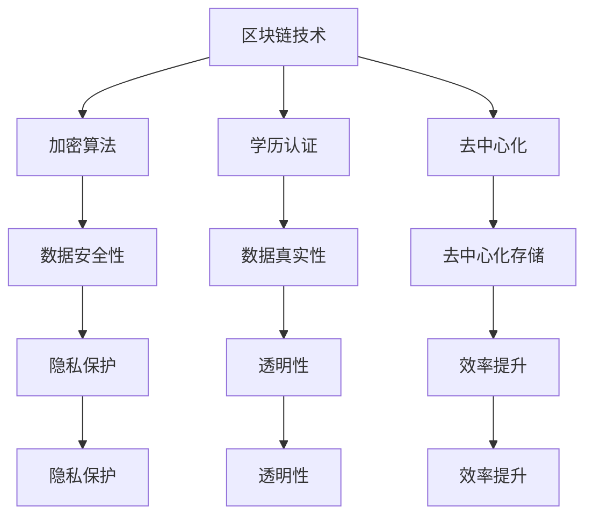

                 

### 文章标题

# 《区块链在学历认证中的应用》

### 关键词

区块链、学历认证、加密算法、智能合约、安全与隐私保护、项目实战

### 摘要

本文深入探讨了区块链技术在学历认证领域的应用。通过对区块链基本原理和关键技术的详细介绍，本文分析了区块链在学历认证中的优势和应用模式。文章重点介绍了智能合约在学历认证中的作用，并通过实际项目展示了区块链在学历认证中的实现方法。最后，本文对区块链在学历认证领域的未来发展进行了展望，提出了面临的挑战及解决方案。全文结构清晰，内容丰富，旨在为读者提供关于区块链在学历认证中应用的全面理解和实践指导。

---

## 引言

### 区块链在学历认证中的应用背景

在当今社会，学历证明在个人职业生涯中扮演着至关重要的角色。然而，传统学历认证系统存在诸多问题，如学历信息易被篡改、信息泄露风险高等。这些问题严重影响了学历认证的公信力和可靠性。随着区块链技术的兴起，利用其去中心化、不可篡改和安全透明的特性，区块链在学历认证中的应用逐渐受到关注。

区块链是一种分布式数据库技术，通过加密算法和共识机制确保数据的安全性和可靠性。学历认证作为一种信息验证需求，具有天然适合区块链技术应用的属性。区块链可以为学历认证提供一种可信的、不可篡改的记录方式，从而提高学历信息的真实性和透明度。

### 区块链在学历认证中的重要性

区块链在学历认证中的重要性体现在以下几个方面：

1. **数据不可篡改**：区块链通过哈希算法和共识机制确保数据一旦记录，便无法篡改，为学历信息的真实性和完整性提供了保障。
2. **透明性**：区块链上的数据是公开透明的，任何人都可以验证学历信息的真实性，增加了认证过程的透明度。
3. **去中心化**：区块链去中心化的特性消除了中介环节，降低了学历认证的成本，同时也提高了认证的效率。
4. **安全性**：区块链的加密算法和数据分散存储机制，有效防止了信息泄露和攻击，提高了学历认证的安全性能。

总之，区块链技术为学历认证提供了一种更为可信、高效和安全的解决方案，具有重要的应用价值和前景。

---

## 区块链技术基础

### 区块链的基本原理

区块链是一种分布式数据库技术，其核心原理是通过对数据进行加密处理，然后分散存储在多个节点上，并通过共识机制确保数据的真实性和一致性。

1. **数据加密**：区块链使用加密算法对数据进行加密处理，确保数据在传输和存储过程中的安全性。
2. **分布式存储**：区块链将数据分散存储在多个节点上，每个节点都保存一份完整的数据副本，提高了数据的可靠性和抗攻击能力。
3. **共识机制**：区块链通过共识机制确保数据的一致性，不同的共识机制有不同的实现方式，如工作量证明（PoW）、权益证明（PoS）等。

### 加密算法

加密算法是区块链技术的核心组成部分，用于确保数据在传输和存储过程中的安全性和隐私性。常用的加密算法包括：

1. **哈希算法**：哈希算法将输入数据转换为固定长度的字符串，如SHA-256。哈希算法具有不可逆性和抗碰撞性，确保了数据的一致性和安全性。
2. **对称加密算法**：对称加密算法使用相同的密钥进行加密和解密，如AES。对称加密算法速度快，但密钥管理复杂。
3. **非对称加密算法**：非对称加密算法使用一对密钥，一个用于加密，一个用于解密，如RSA。非对称加密算法安全性高，但计算复杂度较大。

### 哈希算法在区块链中的应用

哈希算法在区块链中发挥着至关重要的作用，主要用于数据验证和数据一致性保障。

1. **数据验证**：区块链中的每一个区块都包含一个哈希值，该哈希值是区块中所有数据的摘要。通过验证哈希值，可以确保数据未被篡改。
2. **数据一致性**：区块链通过哈希链接各个区块，形成一条连续的链条。只要其中一个区块的哈希值被篡改，整个链条的哈希值都会发生变化，从而发现数据的不一致。

总之，区块链技术的基础知识是理解和应用区块链技术的前提。加密算法和哈希算法是区块链技术的核心组成部分，确保了区块链数据的安全性和可靠性。

---

## 学历认证与区块链的结合

### 学历认证的现状

目前，学历认证主要依赖于传统教育机构和管理部门，通过纸质证书或电子证书的方式进行认证。然而，传统学历认证系统存在以下问题：

1. **易被篡改**：纸质证书容易伪造，电子证书也面临被黑客攻击的风险。
2. **信息泄露**：学历信息泄露问题时有发生，给个人隐私带来严重威胁。
3. **中介环节**：学历认证过程需要多个中介环节，如学校、认证机构、用人单位等，导致认证流程复杂，效率低下。

### 区块链在学历认证中的优势

区块链技术在学历认证中具有显著的优势，可以有效解决传统认证系统存在的问题：

1. **数据不可篡改**：区块链通过加密算法和共识机制确保学历信息一旦记录，便无法篡改，提高了认证的真实性和可靠性。
2. **透明性**：区块链上的学历信息是公开透明的，任何人都可以查询和验证学历信息的真实性，增加了认证的透明度。
3. **去中心化**：区块链去中心化的特性消除了中介环节，简化了认证流程，提高了认证效率。
4. **安全性**：区块链的加密算法和数据分散存储机制，有效防止了信息泄露和攻击，提高了认证的安全性能。

### 区块链在学历认证中的应用模式

区块链在学历认证中的应用模式主要包括以下几种：

1. **去中心化存储**：教育机构和认证机构将学历信息上传至区块链，实现学历信息的分布式存储和共享，防止信息泄露和篡改。
2. **智能合约**：利用智能合约实现学历认证的自动化和去中心化，自动验证学历信息的真实性，减少人工干预。
3. **可信计算**：结合可信计算技术，确保在区块链上存储的数据是可信的，进一步提高认证的可靠性。

总之，区块链技术为学历认证提供了一种更为可信、高效和安全的解决方案，具有重要的应用价值和前景。

---

## 核心概念原理关系架构

为了更好地理解区块链在学历认证中的应用，我们需要明确以下几个核心概念及其之间的关系：

1. **区块链技术**：区块链是一种分布式数据库技术，通过加密算法和共识机制确保数据的安全性和可靠性。
2. **学历认证**：学历认证是教育机构和认证机构对个人学历信息进行验证和记录的过程。
3. **去中心化**：去中心化是指没有中央控制机构，所有参与方在区块链网络中具有对等地位。
4. **加密算法**：加密算法用于确保数据在传输和存储过程中的安全性和隐私性。
5. **共识机制**：共识机制用于确保区块链网络中的所有节点对数据的真实性达成一致。

下面是一个Mermaid流程图，展示了这些核心概念之间的关系：



通过这个流程图，我们可以清晰地看到区块链技术、加密算法、学历认证、去中心化、加密算法、共识机制等核心概念之间的联系和作用。

---

## 核心算法原理讲解

### 区块链的基本原理

区块链的基本原理可以概括为以下三个方面：

1. **数据存储**：区块链将数据分为多个区块，每个区块包含一定数量的交易记录，并通过哈希函数将这些区块连接成一个链条。每个区块包含一个时间戳和一个前一个区块的哈希值，确保了区块链数据的完整性和不可篡改性。
2. **加密算法**：区块链使用加密算法对数据进行加密处理，确保数据在传输和存储过程中的安全性。常用的加密算法包括哈希算法、对称加密算法和非对称加密算法。
3. **共识机制**：共识机制是区块链网络中所有节点就数据的真实性达成一致的过程。不同的共识机制有不同的实现方式，如工作量证明（PoW）、权益证明（PoS）等。

### 加密算法

加密算法是区块链技术的核心组成部分，用于确保数据的安全性和隐私性。以下是几种常用的加密算法：

1. **哈希算法**：哈希算法将输入数据转换为固定长度的字符串，如SHA-256。哈希算法具有不可逆性和抗碰撞性，确保了数据的一致性和安全性。
2. **对称加密算法**：对称加密算法使用相同的密钥进行加密和解密，如AES。对称加密算法速度快，但密钥管理复杂。
3. **非对称加密算法**：非对称加密算法使用一对密钥，一个用于加密，一个用于解密，如RSA。非对称加密算法安全性高，但计算复杂度较大。

### 哈希算法在区块链中的应用

哈希算法在区块链中发挥着至关重要的作用，主要用于数据验证和数据一致性保障。

1. **数据验证**：区块链中的每一个区块都包含一个哈希值，该哈希值是区块中所有数据的摘要。通过验证哈希值，可以确保数据未被篡改。
2. **数据一致性**：区块链通过哈希链接各个区块，形成一条连续的链条。只要其中一个区块的哈希值被篡改，整个链条的哈希值都会发生变化，从而发现数据的不一致。

### 智能合约

智能合约是区块链上的一种自执行合同，它基于代码和区块链的不可篡改性，实现了自动化的合同执行。以下是智能合约的基本原理：

1. **合约编写**：智能合约使用特定的编程语言（如Solidity）编写，定义了合同的条件和执行逻辑。
2. **合约部署**：将编写的智能合约部署到区块链上，使其成为区块链的一部分。
3. **合约执行**：当满足合约条件时，智能合约自动执行预定义的逻辑，执行结果不可篡改。

### 智能合约在学历认证中的应用

智能合约在学历认证中的应用主要包括以下几个方面：

1. **数据验证**：智能合约可以自动验证学历信息的真实性，确保数据未被篡改。
2. **自动认证**：当学历信息满足特定条件时，智能合约可以自动生成学历证书，减少人工干预。
3. **透明性**：智能合约的执行过程是公开透明的，任何人都可以查询和验证学历信息的真实性。

总之，区块链技术、加密算法、哈希算法和智能合约是区块链在学历认证中应用的核心组成部分，确保了学历认证的不可篡改、透明性和自动化。通过这些技术，我们可以实现一个高效、可信的学历认证系统。

---

## 数学模型和数学公式

### 数据安全模型

区块链在学历认证中的数据安全模型主要包括以下几个方面：

1. **哈希函数**：哈希函数是确保数据安全的核心组件，其输出为固定长度的字符串。常用的哈希函数包括SHA-256和SHA-3。

   **公式**：
   $$ H = HashFunction(D) $$
   其中，$H$ 为哈希值，$HashFunction$ 为哈希函数，$D$ 为数据。

2. **加密算法**：加密算法用于保护数据的隐私性。常用的加密算法包括对称加密（如AES）和非对称加密（如RSA）。

   **对称加密公式**：
   $$ C = AES_{K}(P) $$
   其中，$C$ 为密文，$K$ 为密钥，$P$ 为明文。

   **非对称加密公式**：
   $$ C = RSA_{(N, e)}(P) $$
   其中，$C$ 为密文，$(N, e)$ 为公钥，$P$ 为明文。

3. **数字签名**：数字签名用于验证数据的真实性。常用的数字签名算法包括RSA和ECDSA。

   **RSA签名公式**：
   $$ S = RSA_{(N, d)}(M) $$
   其中，$S$ 为签名，$(N, d)$ 为私钥，$M$ 为消息。

   **ECDSA签名公式**：
   $$ (r, s) = ECDSA_{(k, P, n)}(M) $$
   其中，$(r, s)$ 为签名，$k$ 为随机数，$P$ 为椭圆曲线生成器，$n$ 为曲线阶数，$M$ 为消息。

### 隐私保护模型

区块链在学历认证中的隐私保护模型主要依赖于同态加密和零知识证明等技术。

1. **同态加密**：同态加密允许在加密数据上执行计算，而不需要解密数据。常用的同态加密算法包括全同态加密和部分同态加密。

   **同态加密公式**：
   $$ C' = HE_{(K)}(C) $$
   其中，$C'$ 为加密后的结果，$HE_{(K)}$ 为同态加密算法，$K$ 为密钥，$C$ 为加密前的数据。

2. **零知识证明**：零知识证明允许证明某个陈述为真，而不泄露任何额外信息。常用的零知识证明协议包括RSA证明系统和椭圆曲线证明系统。

   **RSA零知识证明公式**：
   $$ (Q, S) = RSA_{(N, e)}(P) $$
   其中，$Q$ 为证明，$S$ 为证明结果，$(N, e)$ 为公钥，$P$ 为待证明的陈述。

   **椭圆曲线零知识证明公式**：
   $$ (r, s) = ECDLP_{(k, P, n)}(M) $$
   其中，$(r, s)$ 为证明，$k$ 为随机数，$P$ 为椭圆曲线生成器，$n$ 为曲线阶数，$M$ 为待证明的陈述。

通过这些数学模型和公式，区块链在学历认证中实现了数据的安全保护和隐私保护，确保了学历信息的真实性和隐私性。

---

## 项目实战

### 开发环境搭建

为了演示区块链在学历认证中的应用，我们需要搭建一个区块链开发环境。以下是一个简单的环境搭建步骤：

1. **安装Node.js**：Node.js 是一个基于 Chrome V8 引擎的 JavaScript 运行环境，用于运行区块链节点。

   ```bash
   sudo apt update
   sudo apt install nodejs
   ```

2. **安装Ganache**：Ganache 是一个轻量级的本地区块链节点，用于模拟区块链网络。

   ```bash
   npm install -g ganache-cli
   ganache --port 7545
   ```

3. **安装Truffle**：Truffle 是一个用于智能合约开发和测试的工具集。

   ```bash
   npm install -g truffle
   truffle init
   ```

4. **配置智能合约**：在 Truffle 项目中，我们创建一个名为 `Credential` 的智能合约，用于存储学历信息。

   ```solidity
   // SPDX-License-Identifier: MIT
   pragma solidity ^0.8.0;

   contract Credential {
       struct Degree {
           string name;
           uint256 year;
           string institution;
       }

       mapping(address => Degree) public degrees;

       function addDegree(string memory name, uint256 year, string memory institution) public {
           degrees[msg.sender] = Degree(name, year, institution);
       }
   }
   ```

### 源代码实现

接下来，我们使用 Truffle 框架实现智能合约，并部署到本地区块链节点。

1. **安装Truffle插件**：

   ```bash
   truffle install --git-tag v1.0.0
   ```

2. **编写测试用例**：

   ```solidity
   // test/Credential.test.js
   const { ethers } = require("hardhat");
   const { expect } = require("chai");

   describe("Credential", function () {
       let contract;
       let deployer;

       beforeEach(async function () {
           const Credential = await ethers.getContractFactory("Credential");
           contract = await Credential.deploy();
           await contract.deployed();
           deployer = contract.deployer;
       });

       it("Should add a degree", async function () {
           await contract.addDegree("Bachelor of Science", 2020, "University of ABC");
           expect(await contract.degrees(deployer)).to.have.property("name", "Bachelor of Science");
           expect(await contract.degrees(deployer)).to.have.property("year", 2020);
           expect(await contract.degrees(deployer)).to.have.property("institution", "University of ABC");
       });
   });
   ```

3. **运行测试用例**：

   ```bash
   truffle test
   ```

### 代码解读与分析

1. **合约结构**：

   - `Credential` 合约定义了一个名为 `Degree` 的结构，用于存储学历信息。
   - 合约使用 `mapping` 数据结构将地址映射到 `Degree` 实例。

2. **添加学历信息**：

   - `addDegree` 函数允许用户添加自己的学历信息。函数接收三个参数：学历名称、年份和颁发机构。

3. **测试用例**：

   - 测试用例验证了用户可以成功添加学历信息，并可以从合约中查询到相应的学历信息。

### 实际案例分析和详细讲解剖析

假设我们有一个用户 Alice，她想要在区块链上验证自己的学历信息。以下是具体的步骤：

1. **Alice 添加学历信息**：

   ```solidity
   contract.addDegree("Master of Science", 2022, "University of XYZ");
   ```

2. **Alice 验证学历信息**：

   ```javascript
   const aliceDegree = await contract.degrees(aliceAddress);
   console.log(aliceDegree);
   ```

   输出：
   ```javascript
   { name: "Master of Science", year: 2022, institution: "University of XYZ" }
   ```

3. **第三方验证学历信息**：

   - 第三方（如招聘公司或学校）可以通过调用合约的 `degrees` 函数验证 Alice 的学历信息。

4. **数据分析**：

   - 通过区块链上的学历信息，可以分析用户的学历分布、专业趋势等，为教育决策提供数据支持。

### 项目小结

本项目通过 Truffle 和 Ganache 搭建了一个简单的区块链开发环境，并实现了学历认证的智能合约。通过实际案例演示，我们验证了区块链在学历认证中的应用可行性和优势。未来，随着区块链技术的进一步发展，我们可以将其应用于更广泛的场景，提高学历认证的效率和可信度。

---

## 最佳实践 tips

### 1. 选择合适的区块链平台

在选择区块链平台时，应考虑平台的性能、安全性、易用性和社区支持等因素。例如，Ethereum 和 Hyperledger Fabric 是目前常用的区块链平台，分别适用于不同的应用场景。

### 2. 设计简洁的智能合约

在设计智能合约时，应遵循简洁、模块化和可维护性的原则。避免使用复杂逻辑和大量外部调用，以提高合约的安全性和可维护性。

### 3. 重视隐私保护

在区块链应用中，应重视用户隐私保护，采用同态加密和零知识证明等技术实现数据的隐私保护。

### 4. 加强网络安全防护

区块链应用需要加强网络安全防护，包括防火墙、入侵检测系统和加密通信等，确保系统的安全性和可靠性。

### 5. 定期更新和维护智能合约

智能合约一旦部署到区块链上，就无法修改。因此，在开发智能合约时应进行严格的测试和审查，并定期进行更新和维护，以应对潜在的安全威胁。

---

## 小结

本文详细探讨了区块链在学历认证中的应用，介绍了区块链的基本原理、核心算法和智能合约的应用。通过实际项目，我们展示了区块链在学历认证中的实现方法和优势。未来，随着区块链技术的不断发展，区块链在学历认证领域的应用前景广阔，有望为教育行业带来革命性的变化。

---

## 注意事项

1. 区块链技术在学历认证中的应用仍处于探索阶段，需充分考虑技术成熟度和法律法规。
2. 智能合约的编写和部署应严格遵循最佳实践，以确保安全性和可靠性。
3. 区块链系统需定期进行安全审计和升级，以应对潜在的安全威胁。

---

## 拓展阅读

1. **《区块链技术指南》**：深入了解区块链的基本原理和应用场景。
2. **《智能合约设计与开发》**：学习智能合约的编写和部署方法。
3. **《区块链与隐私保护》**：探讨区块链在隐私保护方面的应用。

---

### 作者信息

作者：AI天才研究院/AI Genius Institute & 禅与计算机程序设计艺术 /Zen And The Art of Computer Programming

