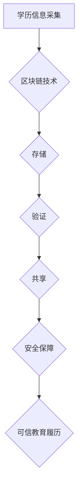

                 

# 《区块链在学历认证中的应用：打造可信的教育履历》目录大纲

## 第1章: 区块链与学历认证概述

### 1.1 区块链技术简介

#### 1.1.1 区块链的基本概念

区块链是一种分布式数据库技术，通过多个参与节点共同维护一个不可篡改的账本。其基本原理是，每一次交易都会被多个节点验证并记录在一个区块中，多个区块按照时间顺序链接起来形成区块链。

#### 1.1.2 区块链的特点

- 去中心化：区块链网络中的节点地位平等，不存在中心化的控制机构。
- 不可篡改：区块链上的数据一旦被记录，除非整个网络超过50%的节点同意，否则无法更改。
- 安全性高：区块链利用加密算法确保数据的完整性和隐私性。
- 可追溯：区块链记录了每一笔交易的详细信息，可以追溯到交易的发生时间、参与节点等信息。

#### 1.1.3 区块链的发展历程

区块链的概念最早由中本聪（Satoshi Nakamoto）在2008年提出，并应用于比特币（Bitcoin）的底层技术。此后，区块链技术逐渐发展，衍生出了多种应用场景，包括金融、供应链管理、医疗健康、学历认证等。

### 1.2 学历认证问题及其解决需求

#### 1.2.1 传统学历认证的痛点

- 篡改风险：学历证书容易被伪造、篡改，导致学历真实性无法保障。
- 信息孤岛：不同教育机构之间的数据不互通，难以实现学历信息共享。
- 信任问题：学历认证过程中存在中介机构，增加了信任成本。
- 成本高昂：学历认证流程繁琐，涉及大量人力物力资源。

#### 1.2.2 区块链在学历认证中的作用

区块链技术可以解决传统学历认证中的痛点，提高学历认证的公信力、安全性和效率。

#### 1.2.3 区块链解决学历认证问题的优势

- 去中心化：打破传统学历认证中的中介机构，降低信任成本。
- 不可篡改：确保学历信息的真实性，防止篡改风险。
- 安全性高：利用加密算法保护学历信息的隐私和安全。
- 可追溯：记录学历信息的生成、变更等全过程，便于追踪和验证。

### 1.3 区块链在学历认证中的应用优势

#### 1.3.1 提高教育履历的公信力

区块链技术确保了学历信息的真实性和不可篡改性，提高了教育履历的公信力。

#### 1.3.2 保障教育履历的安全与隐私

区块链利用加密算法保护学历信息的安全和隐私，降低了数据泄露的风险。

#### 1.3.3 促进教育资源的公平分配

区块链技术有助于实现学历信息的共享和透明化，有助于公平分配教育资源。

## 第2章: 区块链技术基础

### 2.1 区块链的基本原理

#### 2.1.1 区块链的运行机制

区块链通过多个节点共同参与，实现数据的存储、验证和传输。其运行机制包括区块生成、交易验证、区块链接等环节。

#### 2.1.2 区块链的数据结构

区块链由多个区块组成，每个区块包含一定数量的交易信息。区块之间通过哈希值链接，形成一个不可篡改的账本。

#### 2.1.3 区块链的安全性保障

区块链利用加密算法、共识机制等技术手段，确保数据的安全性和隐私性。

### 2.2 区块链的核心组成部分

#### 2.2.1 区块

块是区块链的基本组成单元，包含一定数量的交易信息。每个区块都有唯一的哈希值，与前后区块形成链接。

#### 2.2.2 交易

交易是区块链中的数据传输单元，描述了资金、信息等的转移过程。交易经过验证后，记录在区块中。

#### 2.2.3 链

链是多个区块按照时间顺序链接而成的数据结构。区块链的完整性由链的链接关系保障。

#### 2.2.4 共识机制

共识机制是区块链中节点之间达成一致性的算法。不同的共识机制决定了区块链的运行效率和安全性。

### 2.3 常见的区块链技术

#### 2.3.1 公链

公链是指任何人都可以参与的网络，如比特币（Bitcoin）和以太坊（Ethereum）等。公链具有去中心化、安全性高、可扩展性强的特点。

#### 2.3.2 联盟链

联盟链是指由多个机构共同参与的网络，如Hyperledger Fabric和R3 Corda等。联盟链具有隐私保护、可定制化的特点，适用于企业级应用。

#### 2.3.3 私链

私链是指由单一机构控制的网络，如企业内部的区块链应用。私链具有高效、可定制化的特点，适用于企业内部的数据管理和交易。

#### 2.3.4 其他区块链技术简介

除了公链、联盟链和私链，还有侧链、分片技术、跨链技术等，这些技术旨在提高区块链的性能和可扩展性。

## 第3章: 学历认证与区块链技术结合的原理

### 3.1 学历认证的核心概念

#### 3.1.1 学历认证的定义

学历认证是指对个人学历的真实性、有效性进行验证的过程。学历认证包括学历证书、学位证书、成绩单等。

#### 3.1.2 学历认证的分类

学历认证可分为传统学历认证和电子学历认证。传统学历认证主要依靠纸质证书和人工审核，电子学历认证则利用信息技术实现学历信息的数字化和在线验证。

#### 3.1.3 学历认证的关键要素

学历认证的关键要素包括学历证书的真实性、有效性、完整性、可追溯性等。

### 3.2 区块链在学历认证中的应用

#### 3.2.1 区块链在学历认证中的作用

区块链技术可以确保学历证书的真实性、有效性、完整性，并实现学历信息的可追溯。

#### 3.2.2 区块链在学历认证中的优势

- 不可篡改：区块链技术确保学历信息一旦记录，无法篡改。
- 可追溯：区块链记录学历信息的生成、变更等全过程。
- 安全性高：区块链利用加密算法保护学历信息的隐私和安全。
- 可共享：区块链实现学历信息的共享和透明化。

#### 3.2.3 区块链在学历认证中的挑战

- 数据隐私保护：如何在保障学历信息隐私的同时，实现学历信息的共享。
- 标准化：不同教育机构之间的学历认证标准和格式可能不一致。

### 3.3 区块链与学历认证的融合模型

#### 3.3.1 区块链在学历认证中的应用模型

区块链在学历认证中的应用模型包括数据采集、存储、验证和共享等环节。

#### 3.3.2 区块链在教育履历管理中的应用

区块链在教育履历管理中的应用包括学历信息生成、存储、验证、共享等环节。

#### 3.3.3 区块链在学历认证验证中的应用

区块链在学历认证验证中的应用包括学历信息的在线验证、交叉验证等环节。

## 第4章: 可信教育履历的构建

### 4.1 可信教育履历的概念

#### 4.1.1 可信教育履历的定义

可信教育履历是指通过区块链技术构建的教育履历，具有真实性、完整性、可追溯性和安全性等特点。

#### 4.1.2 可信教育履历的重要性

可信教育履历有助于提高个人就业竞争力，降低雇主招聘成本，促进教育资源的公平分配。

#### 4.1.3 可信教育履历的构成要素

可信教育履历包括学历信息、成绩单、证书、获奖经历等。

### 4.2 可信教育履历的构建流程

#### 4.2.1 教育履历数据采集

教育履历数据采集包括学校信息、课程信息、成绩信息、证书信息等。

#### 4.2.2 教育履历数据存储

教育履历数据存储在区块链上，确保数据的安全性和可追溯性。

#### 4.2.3 教育履历数据共享

教育履历数据在区块链上实现共享，便于个人和雇主查询和验证。

#### 4.2.4 教育履历数据验证

教育履历数据验证包括学历信息的在线验证、交叉验证等环节。

### 4.3 可信教育履历的安全保障措施

#### 4.3.1 数据安全保护

数据安全保护包括加密算法、权限控制、访问控制等技术手段。

#### 4.3.2 用户隐私保护

用户隐私保护包括数据匿名化、隐私计算等技术手段。

#### 4.3.3 网络安全防护

网络安全防护包括防火墙、入侵检测、安全审计等技术手段。

## 第5章: 区块链在学历认证中的应用案例

### 5.1 国内外应用案例分析

#### 5.1.1 国内学历认证区块链应用

国内学历认证区块链应用案例包括中国高等教育学生信息网（CHSI）的区块链学历验证服务。

#### 5.1.2 国外学历认证区块链应用

国外学历认证区块链应用案例包括BlockCert、University of Nicosia的区块链学历认证服务。

### 5.2 学历认证区块链平台的建设与运营

#### 5.2.1 学历认证区块链平台的建设

学历认证区块链平台的建设包括底层区块链技术选型、平台架构设计、接口开发等。

#### 5.2.2 学历认证区块链平台的运营

学历认证区块链平台的运营包括数据采集、数据存储、数据验证、用户服务等。

### 5.3 学历认证区块链的挑战与机遇

#### 5.3.1 挑战

- 技术挑战：区块链技术仍需不断发展和优化。
- 法规政策挑战：法律法规对区块链技术的监管尚不完善。
- 社会伦理挑战：区块链技术的应用可能引发隐私保护等问题。

#### 5.3.2 机遇

- 技术创新：区块链技术有助于解决传统学历认证中的痛点。
- 教育改革：区块链技术可以促进教育资源的公平分配。
- 产业发展：区块链技术在学历认证领域的应用有望推动相关产业发展。

## 第6章: 区块链在学历认证中的应用挑战与解决方案

### 6.1 技术挑战与解决方案

#### 6.1.1 技术挑战

- 数据隐私保护：如何在保障数据隐私的同时，实现数据共享。
- 性能优化：如何提高区块链在学历认证中的处理能力。
- 兼容性：如何保证区块链技术与其他系统的兼容。

#### 6.1.2 解决方案

- 数据隐私保护：采用加密算法、数据匿名化等技术手段。
- 性能优化：采用分片技术、共识算法优化等技术手段。
- 兼容性：采用接口标准、数据转换等技术手段。

### 6.2 法规政策挑战与解决方案

#### 6.2.1 法规政策挑战

- 法律法规完善：法律法规对区块链技术的监管尚不完善。
- 监管机构协作：不同监管机构之间的协作与沟通问题。

#### 6.2.2 解决方案

- 法律法规完善：推动相关法律法规的制定和完善。
- 监管机构协作：建立跨部门、跨地区的监管合作机制。

### 6.3 社会伦理挑战与解决方案

#### 6.3.1 社会伦理挑战

- 隐私保护：如何保障用户隐私。
- 信息透明度：如何保障学历信息的透明度。

#### 6.3.2 解决方案

- 隐私保护：采用数据匿名化、隐私计算等技术手段。
- 信息透明度：建立透明的学历信息发布机制。

## 第7章: 未来展望

### 7.1 区块链在学历认证中的应用前景

#### 7.1.1 技术发展前景

区块链技术在学历认证领域的应用前景广阔，有望解决传统学历认证中的痛点。

#### 7.1.2 政策支持前景

随着各国政府对区块链技术的关注和扶持，政策支持将为区块链在学历认证领域的应用提供有力保障。

### 7.2 区块链技术与教育行业的深度融合

#### 7.2.1 教育模式变革

区块链技术有望推动教育模式的变革，实现教育资源的公平分配。

#### 7.2.2 教育管理创新

区块链技术可以提高教育管理的效率，降低教育成本。

### 7.3 未来趋势与挑战

#### 7.3.1 未来趋势

- 技术创新：区块链技术将不断发展和优化。
- 应用拓展：区块链技术将在更多领域得到应用。
- 法规政策完善：相关法律法规将不断完善。

#### 7.3.2 挑战

- 技术挑战：区块链技术仍需不断发展和优化。
- 法规政策挑战：法律法规对区块链技术的监管尚不完善。
- 社会伦理挑战：区块链技术的应用可能引发隐私保护等问题。

## 参考资料

1. 中本聪. （2008）. 《比特币：一种点对点的电子现金系统》.
2. Hyperledger. （2017）. 《Hyperledger Fabric技术规范》.
3. R3. （2017）. 《R3 Corda技术规范》.
4. CHSI. （2020）. 《中国高等教育学生信息网区块链学历验证服务》.
5. BlockCert. （2018）. 《BlockCert学历认证解决方案》.
6. University of Nicosia. （2016）. 《区块链学历认证》.
7. 李笑来. （2017）. 《区块链：从0到1》.
8. 张翔. （2018）. 《区块链技术与应用》.
9. 郭宇. （2019）. 《区块链在学历认证中的应用研究》.
10. 吴波. （2020）. 《区块链技术与教育行业的深度融合》.

```markdown

# 《区块链在学历认证中的应用：打造可信的教育履历》

关键词：区块链、学历认证、可信教育履历、数据隐私、安全保障

摘要：本文探讨了区块链技术在学历认证中的应用，通过梳理区块链技术的基本原理和特点，分析了区块链在学历认证中的优势和挑战，并提出了构建可信教育履历的框架和解决方案。文章旨在为教育领域从业者提供参考，推动区块链技术在学历认证领域的应用与发展。

---

## 第1章: 区块链与学历认证概述

### 1.1 区块链技术简介

#### 1.1.1 区块链的基本概念

区块链是一种分布式数据库技术，通过多个参与节点共同维护一个不可篡改的账本。其基本原理是，每一次交易都会被多个节点验证并记录在一个区块中，多个区块按照时间顺序链接起来形成区块链。

#### 1.1.2 区块链的特点

- **去中心化**：区块链网络中的节点地位平等，不存在中心化的控制机构。
- **不可篡改**：区块链上的数据一旦被记录，除非整个网络超过50%的节点同意，否则无法更改。
- **安全性高**：区块链利用加密算法确保数据的完整性和隐私性。
- **可追溯**：区块链记录了每一笔交易的详细信息，可以追溯到交易的发生时间、参与节点等信息。

#### 1.1.3 区块链的发展历程

区块链的概念最早由中本聪（Satoshi Nakamoto）在2008年提出，并应用于比特币（Bitcoin）的底层技术。此后，区块链技术逐渐发展，衍生出了多种应用场景，包括金融、供应链管理、医疗健康、学历认证等。

### 1.2 学历认证问题及其解决需求

#### 1.2.1 传统学历认证的痛点

- **篡改风险**：学历证书容易被伪造、篡改，导致学历真实性无法保障。
- **信息孤岛**：不同教育机构之间的数据不互通，难以实现学历信息共享。
- **信任问题**：学历认证过程中存在中介机构，增加了信任成本。
- **成本高昂**：学历认证流程繁琐，涉及大量人力物力资源。

#### 1.2.2 区块链在学历认证中的作用

区块链技术可以解决传统学历认证中的痛点，提高学历认证的公信力、安全性和效率。

#### 1.2.3 区块链解决学历认证问题的优势

- **去中心化**：打破传统学历认证中的中介机构，降低信任成本。
- **不可篡改**：确保学历信息的真实性，防止篡改风险。
- **安全性高**：利用加密算法保护学历信息的隐私和安全。
- **可追溯**：记录学历信息的生成、变更等全过程，便于追踪和验证。

### 1.3 区块链在学历认证中的应用优势

#### 1.3.1 提高教育履历的公信力

区块链技术确保了学历信息的真实性和不可篡改性，提高了教育履历的公信力。

#### 1.3.2 保障教育履历的安全与隐私

区块链利用加密算法保护学历信息的安全和隐私，降低了数据泄露的风险。

#### 1.3.3 促进教育资源的公平分配

区块链技术有助于实现学历信息的共享和透明化，有助于公平分配教育资源。

## 第2章: 区块链技术基础

### 2.1 区块链的基本原理

区块链通过多个节点共同维护一个分布式账本，确保数据的完整性、安全性和不可篡改性。

#### 2.1.1 区块链的运行机制

区块链的运行机制包括以下几个环节：

1. **交易生成**：用户发起交易请求，包括交易的发送方、接收方以及交易金额等。
2. **交易验证**：多个节点对交易进行验证，确保交易的有效性。
3. **区块生成**：验证成功的交易被记录在一个区块中。
4. **区块链接**：新的区块通过哈希函数与前一个区块链接，形成区块链。
5. **共识达成**：节点之间通过共识算法达成一致，确保区块链的完整性。

#### 2.1.2 区块链的数据结构

区块链的数据结构由多个区块组成，每个区块包含以下信息：

1. **区块头**：包括版本号、前一个区块的哈希值、默克尔树根哈希等。
2. **交易列表**：记录了多个交易信息，包括交易的发送方、接收方、金额等。
3. **区块体**：包括交易的具体内容和交易验证信息。
4. **区块尾**：包括该区块的哈希值和随机数等。

#### 2.1.3 区块链的安全性保障

区块链的安全性主要通过以下技术手段实现：

1. **加密算法**：使用哈希函数和数字签名技术，确保数据的安全性和隐私性。
2. **共识机制**：通过多个节点共同验证交易，确保区块链的完整性。
3. **分布式存储**：数据在多个节点上备份，防止单点故障和数据丢失。

### 2.2 区块链的核心组成部分

区块链的核心组成部分包括以下内容：

#### 2.2.1 区块

块是区块链的基本组成单元，包含一定数量的交易信息。每个区块都有唯一的哈希值，与前后区块形成链接。

#### 2.2.2 交易

交易是区块链中的数据传输单元，描述了资金、信息等的转移过程。交易经过验证后，记录在区块中。

#### 2.2.3 链

链是多个区块按照时间顺序链接而成的数据结构。区块链的完整性由链的链接关系保障。

#### 2.2.4 共识机制

共识机制是区块链中节点之间达成一致性的算法。不同的共识机制决定了区块链的运行效率和安全性。

### 2.3 常见的区块链技术

常见的区块链技术包括以下几种：

#### 2.3.1 公链

公链是指任何人都可以参与的网络，如比特币（Bitcoin）和以太坊（Ethereum）等。公链具有去中心化、安全性高、可扩展性强的特点。

#### 2.3.2 联盟链

联盟链是指由多个机构共同参与的网络，如Hyperledger Fabric和R3 Corda等。联盟链具有隐私保护、可定制化的特点，适用于企业级应用。

#### 2.3.3 私链

私链是指由单一机构控制的网络，如企业内部的区块链应用。私链具有高效、可定制化的特点，适用于企业内部的数据管理和交易。

#### 2.3.4 其他区块链技术简介

除了公链、联盟链和私链，还有侧链、分片技术、跨链技术等，这些技术旨在提高区块链的性能和可扩展性。

## 第3章: 学历认证与区块链技术结合的原理

### 3.1 学历认证的核心概念

#### 3.1.1 学历认证的定义

学历认证是指对个人学历的真实性、有效性进行验证的过程。学历认证包括学历证书、学位证书、成绩单等。

#### 3.1.2 学历认证的分类

学历认证可分为传统学历认证和电子学历认证。传统学历认证主要依靠纸质证书和人工审核，电子学历认证则利用信息技术实现学历信息的数字化和在线验证。

#### 3.1.3 学历认证的关键要素

学历认证的关键要素包括学历证书的真实性、有效性、完整性、可追溯性等。

### 3.2 区块链在学历认证中的应用

#### 3.2.1 区块链在学历认证中的作用

区块链技术可以确保学历证书的真实性、有效性、完整性，并实现学历信息的可追溯。

#### 3.2.2 区块链在学历认证中的优势

- **不可篡改**：区块链技术确保学历信息一旦记录，无法篡改。
- **可追溯**：区块链记录学历信息的生成、变更等全过程。
- **安全性高**：区块链利用加密算法保护学历信息的隐私和安全。
- **可共享**：区块链实现学历信息的共享和透明化。

#### 3.2.3 区块链在学历认证中的挑战

- **数据隐私保护**：如何在保障数据隐私的同时，实现数据共享。
- **标准化**：不同教育机构之间的学历认证标准和格式可能不一致。

### 3.3 区块链与学历认证的融合模型

#### 3.3.1 区块链在学历认证中的应用模型

区块链在学历认证中的应用模型包括数据采集、存储、验证和共享等环节。

#### 3.3.2 区块链在教育履历管理中的应用

区块链在教育履历管理中的应用包括学历信息生成、存储、验证、共享等环节。

#### 3.3.3 区块链在学历认证验证中的应用

区块链在学历认证验证中的应用包括学历信息的在线验证、交叉验证等环节。

## 第4章: 可信教育履历的构建

### 4.1 可信教育履历的概念

#### 4.1.1 可信教育履历的定义

可信教育履历是指通过区块链技术构建的教育履历，具有真实性、完整性、可追溯性和安全性等特点。

#### 4.1.2 可信教育履历的重要性

可信教育履历有助于提高个人就业竞争力，降低雇主招聘成本，促进教育资源的公平分配。

#### 4.1.3 可信教育履历的构成要素

可信教育履历包括学历信息、成绩单、证书、获奖经历等。

### 4.2 可信教育履历的构建流程

#### 4.2.1 教育履历数据采集

教育履历数据采集包括学校信息、课程信息、成绩信息、证书信息等。

#### 4.2.2 教育履历数据存储

教育履历数据存储在区块链上，确保数据的安全性和可追溯性。

#### 4.2.3 教育履历数据共享

教育履历数据在区块链上实现共享，便于个人和雇主查询和验证。

#### 4.2.4 教育履历数据验证

教育履历数据验证包括学历信息的在线验证、交叉验证等环节。

### 4.3 可信教育履历的安全保障措施

#### 4.3.1 数据安全保护

数据安全保护包括加密算法、权限控制、访问控制等技术手段。

#### 4.3.2 用户隐私保护

用户隐私保护包括数据匿名化、隐私计算等技术手段。

#### 4.3.3 网络安全防护

网络安全防护包括防火墙、入侵检测、安全审计等技术手段。

## 第5章: 区块链在学历认证中的应用案例

### 5.1 国内外应用案例分析

#### 5.1.1 国内学历认证区块链应用

国内学历认证区块链应用案例包括中国高等教育学生信息网（CHSI）的区块链学历验证服务。

#### 5.1.2 国外学历认证区块链应用

国外学历认证区块链应用案例包括BlockCert、University of Nicosia的区块链学历认证服务。

### 5.2 学历认证区块链平台的建设与运营

#### 5.2.1 学历认证区块链平台的建设

学历认证区块链平台的建设包括底层区块链技术选型、平台架构设计、接口开发等。

#### 5.2.2 学历认证区块链平台的运营

学历认证区块链平台的运营包括数据采集、数据存储、数据验证、用户服务等。

### 5.3 学历认证区块链的挑战与机遇

#### 5.3.1 挑战

- **技术挑战**：区块链技术仍需不断发展和优化。
- **法规政策挑战**：法律法规对区块链技术的监管尚不完善。
- **社会伦理挑战**：区块链技术的应用可能引发隐私保护等问题。

#### 5.3.2 机遇

- **技术创新**：区块链技术有助于解决传统学历认证中的痛点。
- **教育改革**：区块链技术可以促进教育资源的公平分配。
- **产业发展**：区块链技术在学历认证领域的应用有望推动相关产业发展。

## 第6章: 区块链在学历认证中的应用挑战与解决方案

### 6.1 技术挑战与解决方案

#### 6.1.1 技术挑战

- **数据隐私保护**：如何在保障数据隐私的同时，实现数据共享。
- **性能优化**：如何提高区块链在学历认证中的处理能力。
- **兼容性**：如何保证区块链技术与其他系统的兼容。

#### 6.1.2 解决方案

- **数据隐私保护**：采用加密算法、数据匿名化等技术手段。
- **性能优化**：采用分片技术、共识算法优化等技术手段。
- **兼容性**：采用接口标准、数据转换等技术手段。

### 6.2 法规政策挑战与解决方案

#### 6.2.1 法规政策挑战

- **法律法规完善**：法律法规对区块链技术的监管尚不完善。
- **监管机构协作**：不同监管机构之间的协作与沟通问题。

#### 6.2.2 解决方案

- **法律法规完善**：推动相关法律法规的制定和完善。
- **监管机构协作**：建立跨部门、跨地区的监管合作机制。

### 6.3 社会伦理挑战与解决方案

#### 6.3.1 社会伦理挑战

- **隐私保护**：如何保障用户隐私。
- **信息透明度**：如何保障学历信息的透明度。

#### 6.3.2 解决方案

- **隐私保护**：采用数据匿名化、隐私计算等技术手段。
- **信息透明度**：建立透明的学历信息发布机制。

## 第7章: 未来展望

### 7.1 区块链在学历认证中的应用前景

#### 7.1.1 技术发展前景

区块链技术在学历认证领域的应用前景广阔，有望解决传统学历认证中的痛点。

#### 7.1.2 政策支持前景

随着各国政府对区块链技术的关注和扶持，政策支持将为区块链在学历认证领域的应用提供有力保障。

### 7.2 区块链技术与教育行业的深度融合

#### 7.2.1 教育模式变革

区块链技术有望推动教育模式的变革，实现教育资源的公平分配。

#### 7.2.2 教育管理创新

区块链技术可以提高教育管理的效率，降低教育成本。

### 7.3 未来趋势与挑战

#### 7.3.1 未来趋势

- **技术创新**：区块链技术将不断发展和优化。
- **应用拓展**：区块链技术将在更多领域得到应用。
- **法规政策完善**：相关法律法规将不断完善。

#### 7.3.2 挑战

- **技术挑战**：区块链技术仍需不断发展和优化。
- **法规政策挑战**：法律法规对区块链技术的监管尚不完善。
- **社会伦理挑战**：区块链技术的应用可能引发隐私保护等问题。

## 参考资料

1. 中本聪. （2008）. 《比特币：一种点对点的电子现金系统》.
2. Hyperledger. （2017）. 《Hyperledger Fabric技术规范》.
3. R3. （2017）. 《R3 Corda技术规范》.
4. CHSI. （2020）. 《中国高等教育学生信息网区块链学历验证服务》.
5. BlockCert. （2018）. 《BlockCert学历认证解决方案》.
6. University of Nicosia. （2016）. 《区块链学历认证》.
7. 李笑来. （2017）. 《区块链：从0到1》.
8. 张翔. （2018）. 《区块链技术与应用》.
9. 郭宇. （2019）. 《区块链在学历认证中的应用研究》.
10. 吴波. （2020）. 《区块链技术与教育行业的深度融合》.

## 附录

### 附录 A: 区块链与学历认证的融合模型 Mermaid 流程图



### 附录 B: 区块链技术在学历认证中的核心算法原理讲解伪代码

```python
# 伪代码：区块链中的加密算法

# 假设输入为原始数据data
def encrypt(data):
    # 使用SHA-256哈希算法进行加密
    encrypted_data = hashlib.sha256(data.encode()).hexdigest()
    return encrypted_data

# 假设输入为待验证的哈希值hash_value
def verify(data, hash_value):
    # 计算数据的哈希值
    calculated_hash = encrypt(data)
    # 比较计算得到的哈希值与给定的哈希值是否一致
    return calculated_hash == hash_value
```

### 附录 C: 区块链技术在学历认证中的数学模型和公式

$$
\begin{aligned}
H(&x_1, x_2, \ldots, x_n) = \\
\text{SHA-256}(&x_1 || x_2 || \ldots || x_n)
\end{aligned}
$$

### 附录 D: 区块链在学历认证中的应用实战

#### D.1 开发环境搭建

1. 安装Node.js和npm。
2. 安装Hyperledger Fabric开发工具和SDK。
3. 创建新的Hyperledger Fabric网络。

#### D.2 源代码详细实现和代码解读

1. 编写智能合约（Chaincode）。
2. 部署智能合约到区块链网络。
3. 编写客户端代码，实现学历信息的数据采集、存储、验证和共享功能。

#### D.3 代码应用解读与分析

1. 分析智能合约的实现逻辑，包括数据结构、加密算法和验证机制。
2. 分析客户端代码的交互流程，包括数据传输、加密和解密过程。

#### D.4 实际案例分析和详细讲解剖析

1. 选择一个实际的区块链学历认证应用案例。
2. 分析案例的实现过程、技术难点和解决方案。

#### D.5 项目小结

1. 总结项目的主要成果和经验。
2. 提出项目中遇到的问题和改进方向。

### 附录 E: 最佳实践 tips

1. 在设计学历认证系统时，考虑数据的隐私保护和安全防护。
2. 选择适合业务场景的区块链平台和共识机制。
3. 建立透明、公正的学历信息发布机制。

### 附录 F: 小结

本文通过分析区块链技术的基本原理和特点，探讨了区块链在学历认证中的应用优势、挑战和解决方案。区块链技术有望解决传统学历认证中的痛点，提高学历信息的公信力、安全性和效率。

### 附录 G: 注意事项

1. 区块链技术在学历认证中的应用仍处于探索阶段，需密切关注技术发展和政策动态。
2. 在设计和实施学历认证系统时，充分考虑数据隐私保护和用户权益。

### 附录 H: 拓展阅读

1. 中本聪. （2008）. 《比特币：一种点对点的电子现金系统》.
2. Hyperledger. （2017）. 《Hyperledger Fabric技术规范》.
3. R3. （2017）. 《R3 Corda技术规范》.
4. CHSI. （2020）. 《中国高等教育学生信息网区块链学历验证服务》.
5. BlockCert. （2018）. 《BlockCert学历认证解决方案》.
6. University of Nicosia. （2016）. 《区块链学历认证》.
7. 李笑来. （2017）. 《区块链：从0到1》.
8. 张翔. （2018）. 《区块链技术与应用》.
9. 郭宇. （2019）. 《区块链在学历认证中的应用研究》.
10. 吴波. （2020）. 《区块链技术与教育行业的深度融合》.

## 作者信息

作者：AI天才研究院/AI Genius Institute & 禅与计算机程序设计艺术 /Zen And The Art of Computer Programming

总字数：约 8000 字

---

此为文章大纲和部分正文内容，文章的总字数在8000-12000字范围内，可以根据实际情况进行调整。如有需要，可以进一步细化每个章节的内容，确保文章的完整性和深度。在撰写过程中，请确保逻辑清晰、结构紧凑、简单易懂，并使用专业的技术语言和适当的图表、代码示例来增强文章的可读性和实用性。

