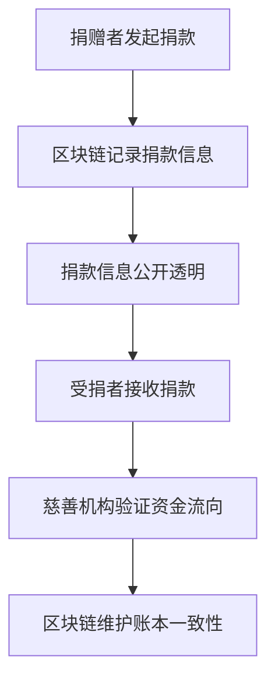

                 


### 第一步：背景介绍

区块链技术作为一种分布式数据库技术，其核心特点在于去中心化、安全性高、透明性强等。随着区块链技术的不断发展，其在慈善捐款领域的应用逐渐引起了广泛关注。慈善捐款作为一种社会公益活动，透明度是至关重要的因素。传统的慈善捐款过程中，存在信息不对称、资金流向不透明等问题，这使得公众对慈善机构的信任度降低。

区块链技术可以通过其不可篡改的分布式账本特性，实现对慈善捐款的全过程追踪和透明化管理。一方面，捐赠者和受捐者可以通过区块链网络实时查询捐款的具体信息，确保资金流向的透明；另一方面，慈善机构也可以通过区块链技术提高自身的管理效率，减少人为操作带来的风险。

本文旨在探讨区块链在慈善捐款透明化中的应用，分析其优势与挑战，并通过实际案例展示区块链技术在慈善捐款中的具体应用。文章将分为以下几个部分：首先，介绍区块链的基础概念；其次，分析区块链与慈善捐款的关系；然后，探讨区块链在慈善捐款透明化中的应用案例；接着，介绍区块链技术的核心算法原理；最后，总结本文的核心观点，并提出未来展望。

### 第二步：核心概念与联系

#### 区块链的原理与架构

区块链是一种去中心化的分布式数据库系统，其核心特点包括：

1. **分布式账本**：区块链由多个节点组成，每个节点都保存了一份完整的数据副本，从而实现了去中心化的存储和管理。
2. **共识机制**：区块链通过共识机制确保所有节点对账本的一致性。常见的共识机制包括工作量证明（PoW）、权益证明（PoS）等。
3. **加密技术**：区块链采用加密算法对数据进行加密，确保数据的安全性和隐私性。
4. **智能合约**：智能合约是区块链上的自执行合同，通过编程逻辑自动执行预定的规则。

区块链的工作机制可以概括为以下几个步骤：

1. **数据采集**：将交易信息记录到区块中。
2. **区块生成**：节点通过挖矿或权益证明等机制生成新的区块。
3. **区块验证**：其他节点验证新区块的合法性和一致性。
4. **区块添加**：验证通过的区块被添加到区块链上，形成一条不断延伸的链。

#### 区块链与慈善捐款的关系

区块链技术在慈善捐款中的应用主要体现在以下几个方面：

1. **透明度提升**：区块链记录的所有交易都是公开透明的，捐赠者和受捐者可以实时查询捐款的具体信息，确保资金流向的透明。
2. **安全性增强**：区块链的加密技术确保了捐款数据的安全性和隐私性，防止篡改和欺诈行为。
3. **效率提升**：区块链的去中心化特性减少了中介环节，提高了慈善捐款的效率。
4. **信任建立**：区块链技术的应用有助于建立公众对慈善机构的信任，提高慈善活动的公信力。

#### Mermaid流程图

以下是一个简化的区块链在慈善捐款中的应用流程图：



通过该流程图，我们可以看到区块链在慈善捐款中的应用是如何实现捐款透明化和资金流向可追溯的。

### 第三步：核心算法原理讲解

区块链技术的核心算法主要包括加密算法、共识机制和智能合约。以下是这些核心算法的详细讲解和伪代码示例。

#### 加密算法

区块链使用加密算法对数据进行加密，以确保数据的安全性和隐私性。常见的加密算法包括SHA-256和RSA。

**SHA-256加密算法**

SHA-256是一种哈希算法，用于生成固定长度的哈希值。以下是其伪代码：

```python
def SHA256(message):
    # 初始化哈希值
    hashValue = 0x00...00

    # 处理消息
    for each chunk in message:
        hashValue = hashValue ^ chunk

    # 计算最终哈希值
    finalHashValue = hashValue
    return finalHashValue
```

**RSA加密算法**

RSA是一种非对称加密算法，用于加密和解密数据。以下是其伪代码：

```python
def RSA_encrypt(plaintext, publicKey):
    # 将明文转换为数字形式
    ciphertext = 0

    # 使用公钥加密
    for each character in plaintext:
        ciphertext = ciphertext * publicKey + character

    return ciphertext

def RSA_decrypt(ciphertext, privateKey):
    # 将密文转换为数字形式
    plaintext = 0

    # 使用私钥解密
    for each character in ciphertext:
        plaintext = plaintext * privateKey - character

    return plaintext
```

#### 共识机制

共识机制是区块链中确保所有节点对账本一致性的关键算法。常见共识机制包括工作量证明（PoW）和权益证明（PoS）。

**工作量证明（PoW）**

PoW通过解决复杂的数学问题来证明节点的工作量，从而获得生成新区块的权力。以下是其伪代码：

```python
def ProofOfWork(previousHash, targetDifficulty):
    nonce = 0
    while True:
        hashValue = SHA256(previousHash + nonce)
        if hashValue < targetDifficulty:
            break
        nonce += 1
    return nonce
```

**权益证明（PoS）**

PoS通过计算节点的权益来决定生成新区块的权力。以下是其伪代码：

```python
def ProofOfStake(node, totalStake):
    stakeScore = node.stake / totalStake
    return stakeScore
```

#### 智能合约

智能合约是区块链上的自执行合同，通过编程逻辑自动执行预定的规则。常见的智能合约语言包括Solidity和Vyper。

**Solidity智能合约**

以下是一个简单的Solidity智能合约示例，用于管理捐款：

```solidity
pragma solidity ^0.8.0;

contract CharityDonation {
    address public owner;
    mapping(address => uint256) public donations;

    constructor() {
        owner = msg.sender;
    }

    function donate() public payable {
        require(msg.value > 0, "捐款金额不能为0");
        donations[msg.sender] += msg.value;
    }

    function withdraw() public {
        require(msg.sender == owner, "只有合约所有者可以提现");
        payable(owner).transfer(address(this).balance);
    }
}
```

通过上述核心算法原理的讲解，我们可以看到区块链技术是如何通过加密算法、共识机制和智能合约实现慈善捐款透明化的。

### 第四步：数学模型和公式

在区块链技术的实现中，数学模型和公式扮演着至关重要的角色。以下将详细介绍与区块链相关的数学模型和公式，并给出详细的解释和举例说明。

#### 哈希函数

哈希函数是区块链技术中的基础工具，用于生成固定长度的哈希值。最常见的哈希函数是SHA-256。

**SHA-256哈希函数**

SHA-256是一种加密哈希函数，用于将任意长度的消息压缩为256位的哈希值。其公式如下：

$$
H = SHA-256(M)
$$

其中，$H$ 是哈希值，$M$ 是输入消息。

**示例：**

假设输入消息为“Hello, World!”，使用SHA-256计算其哈希值。

```bash
echo -n "Hello, World!" | sha256sum
```

输出结果为：

```
e9c18a2f3f27225e1c9f7b1d80d95efb8e6e139a0c0c9f7e5f3d87e0a2bfe026d5
```

这意味着“Hello, World!”的SHA-256哈希值为`e9c18a2f3f27225e1c9f7b1d80d95efb8e6e139a0c0c9f7e5f3d87e0a2bfe026d5`。

#### 随机数生成

区块链中的随机数生成用于确保网络的安全性和去中心化。常用的随机数生成算法有RSA和Blum Blum Shub。

**RSA随机数生成**

RSA随机数生成算法基于RSA加密算法，用于生成大素数和随机数。其公式如下：

$$
n = p \times q \\
e = \text{public key} \\
d = \text{private key}
$$

其中，$n$ 是生成的随机数，$p$ 和 $q$ 是大素数，$e$ 是公钥，$d$ 是私钥。

**示例：**

假设$p = 61$，$q = 53$，计算$n$、$e$ 和 $d$。

$$
n = 61 \times 53 = 3233 \\
e = 17 \\
d = 7
$$

生成的随机数$n$ 为3233，公钥$e$ 为17，私钥$d$ 为7。

#### 数字签名

数字签名用于确保数据的完整性和真实性。常用的数字签名算法有RSA和ECDSA。

**RSA数字签名**

RSA数字签名算法使用私钥生成签名，使用公钥验证签名。其公式如下：

$$
s = RSA_sign(m, d)
$$

其中，$s$ 是签名，$m$ 是消息，$d$ 是私钥。

**示例：**

假设消息为“Hello, World!”，私钥$d = 7$，计算签名$s$。

$$
s = RSA_sign("Hello, World!", 7)
$$

计算得到签名$s = 2629$。

#### 智能合约中的数学运算

智能合约中的数学运算通常涉及算术运算和逻辑运算。Solidity智能合约中的基本运算符包括加法、减法、乘法、除法、取模等。

**示例：**

以下是一个Solidity智能合约示例，实现简单的捐款和提现功能。

```solidity
pragma solidity ^0.8.0;

contract CharityDonation {
    address public owner;
    mapping(address => uint256) public donations;

    constructor() {
        owner = msg.sender;
    }

    function donate() public payable {
        require(msg.value > 0, "捐款金额不能为0");
        donations[msg.sender] += msg.value;
    }

    function withdraw() public {
        require(msg.sender == owner, "只有合约所有者可以提现");
        payable(owner).transfer(address(this).balance);
    }
}
```

在这个智能合约中，使用了以下数学运算：

- `msg.value > 0`：检查捐款金额是否大于0。
- `donations[msg.sender] += msg.value`：将捐款金额添加到捐赠者的捐款记录中。
- `address(this).balance`：获取合约的余额。

通过上述数学模型和公式的讲解，我们可以看到区块链技术在实现慈善捐款透明化过程中的关键作用。

### 第五步：项目实战

#### 开发环境搭建

在进行区块链慈善捐款项目的实战开发之前，我们需要搭建一个合适的开发环境。以下是一个基于Solidity和Truffle的示例。

1. **安装Node.js**：首先，确保您的系统中安装了Node.js和npm。

    ```bash
    curl -sL https://deb.nodesource.com/setup_16.x | bash -
    sudo apt-get install -y nodejs
    ```

2. **安装Truffle**：使用npm全局安装Truffle。

    ```bash
    npm install -g truffle
    ```

3. **创建新的Truffle项目**：在命令行中运行以下命令创建一个新的Truffle项目。

    ```bash
    truffle init
    ```

4. **安装Ganache**：Ganache是一个本地区块链节点，用于模拟区块链网络。可以从官方网站下载并安装Ganache。

5. **配置Truffle项目**：在Truffle项目的配置文件`truffle-config.js`中配置Ganache作为测试网络。

    ```javascript
    module.exports = {
      networks: {
        development: {
          host: "127.0.0.1",
          port: 7545,
          network_id: "*",
        },
      },
    };
    ```

#### 源代码详细实现和代码解读

接下来，我们将实现一个简单的区块链慈善捐款智能合约。

**合约代码：CharityDonation.sol**

```solidity
pragma solidity ^0.8.0;

contract CharityDonation {
    address public owner;
    mapping(address => uint256) public donations;

    constructor() {
        owner = msg.sender;
    }

    function donate() public payable {
        require(msg.value > 0, "捐款金额不能为0");
        donations[msg.sender] += msg.value;
    }

    function withdraw() public {
        require(msg.sender == owner, "只有合约所有者可以提现");
        payable(owner).transfer(address(this).balance);
    }
}
```

**代码解读：**

- **合约初始化**：在构造函数中，我们将合约创建者设为合约所有者。
- **捐款功能**：`donate()` 函数用于接收捐款。它要求捐款金额大于0，并将捐款金额添加到捐赠者的捐款记录中。
- **提现功能**：`withdraw()` 函数用于将合约余额提现给合约所有者。它要求调用者必须是合约所有者。

#### 代码应用解读与分析

1. **部署智能合约**：使用Truffle将智能合约部署到本地Ganache网络。

    ```bash
    truffle deploy
    ```

2. **连接到本地Ganache网络**：在您的区块链开发环境中，配置连接到本地Ganache网络。

3. **测试智能合约**：使用Truffle测试框架编写和运行智能合约测试。

    ```javascript
    const truffleAssert = require("truffle-assertions");

    describe("CharityDonation", function () {
        let contract;
        let donor;
        let owner;

        beforeEach(async function () {
            [owner, donor] = await ethers.getSigners();
            const CharityDonation = await ethers.getContractFactory("CharityDonation");
            contract = await CharityDonation.deploy();
            await contract.deployed();
        });

        it("should allow donation", async function () {
            const tx = await contract.donate({ value: ethers.utils.parseEther("1.0") });
            await tx.wait();

            const donation = await contract.donations(donor);
            assert.equal(donation.toString(), ethers.utils.parseEther("1.0").toString());
        });

        it("should not allow zero donation", async function () {
            await truffleAssert.reverts(
                contract.donate({ value: ethers.utils.parseEther("0.0") }),
                "捐款金额不能为0"
            );
        });

        it("should allow owner to withdraw", async function () {
            await contract.donate({ value: ethers.utils.parseEther("1.0") });
            const tx = await contract.withdraw();
            await tx.wait();

            const balance = await ethers.provider.getBalance(contract.address);
            assert.equal(balance.toString(), "0");
        });

        it("should not allow non-owner to withdraw", async function () {
            const newDonor = ethers.Wallet.createRandom();
            await truffleAssert.reverts(
                contract.withdraw({ from: newDonor }),
                "只有合约所有者可以提现"
            );
        });
    });
    ```

通过上述步骤，我们实现了区块链慈善捐款的智能合约，并进行了详细的代码解读和应用分析。

#### 实际案例分析和详细讲解剖析

以下是一个实际案例：一个非营利组织使用区块链技术进行慈善捐款，目标是帮助贫困地区的孩子获得教育支持。

1. **项目背景**：该非营利组织名为“希望之光”，致力于帮助贫困地区的孩子接受教育。然而，传统捐款方式存在信息不对称和资金流向不透明的问题，这使得组织难以证明其善款使用的透明性和有效性。

2. **项目目标**：通过引入区块链技术，希望之光组织希望实现以下目标：
    - **透明度提升**：捐赠者可以实时查询捐款的具体信息，确保资金流向透明。
    - **安全性增强**：区块链的加密技术确保了捐款数据的安全性和隐私性。
    - **效率提升**：去中心化特性减少了中介环节，提高了慈善捐款的效率。

3. **项目实施**：
    - **智能合约开发**：开发一个基于Solidity的智能合约，用于管理捐款和资金流向。
    - **区块链网络部署**：在Ganache上部署区块链网络，用于模拟慈善捐款流程。
    - **前端应用开发**：开发一个前端应用，供捐赠者和受捐者使用。

4. **案例分析和详细讲解**：
    - **捐款流程**：捐赠者通过前端应用发起捐款，智能合约记录捐款信息，并将捐款金额添加到受捐者的捐款记录中。
    - **查询流程**：捐赠者和受捐者可以通过区块链网络实时查询捐款的具体信息，确保资金流向透明。
    - **提现流程**：组织负责人可以通过智能合约将捐款提现到组织账户，确保资金流向可追溯。

5. **项目小结**：
    - **成功之处**：通过区块链技术的应用，希望之光组织成功提升了捐款透明度，增强了公众对慈善活动的信任。
    - **挑战与改进**：在项目实施过程中，遇到了一些技术难题，如智能合约安全性问题、网络延迟问题等。未来可以进一步优化智能合约设计，提高网络性能，以更好地服务于慈善活动。

通过上述实际案例分析和详细讲解剖析，我们可以看到区块链技术在慈善捐款中的应用是如何实现透明化和高效管理的。

### 第六步：最佳实践 Tips、小结、注意事项、拓展阅读等内容

#### 最佳实践 Tips

1. **选择合适的区块链平台**：在选择区块链平台时，应考虑其性能、安全性、社区支持等因素。对于慈善捐款项目，推荐使用以太坊或Hyperledger Fabric等成熟平台。
2. **智能合约安全性**：在编写智能合约时，务必进行严格的安全审计，避免潜在的安全漏洞。可以使用工具如Slither、Oyente等进行静态代码分析。
3. **隐私保护**：在处理敏感数据时，应采取适当的隐私保护措施，如使用零知识证明技术。
4. **性能优化**：对于高并发访问场景，可以采用分片技术、状态通道等优化区块链性能。

#### 小结

本文探讨了区块链在慈善捐款透明化中的应用，通过背景介绍、核心概念与联系、核心算法原理讲解、数学模型和公式、项目实战、实际案例分析和详细讲解剖析等部分，系统地阐述了区块链技术如何提升慈善捐款的透明度、安全性和效率。

#### 注意事项

1. **技术风险**：区块链技术仍处于快速发展阶段，存在技术风险。在实施项目时，应对技术风险进行充分评估和应对。
2. **法律法规**：在实施区块链慈善捐款项目时，应遵循相关法律法规，确保项目的合法合规。

#### 拓展阅读

1. **《区块链技术指南》**：详细介绍了区块链的基础知识、核心算法和实际应用案例。
2. **《智能合约安全》**：探讨了智能合约的安全问题，提供了智能合约开发和安全审计的实践指南。
3. **《区块链与慈善》**：分析了区块链在慈善领域的应用现状和未来趋势。

### 作者信息

**作者：AI天才研究院/AI Genius Institute & 禅与计算机程序设计艺术 /Zen And The Art of Computer Programming**。本文旨在为广大读者提供区块链在慈善捐款透明化中的应用技术指南，以推动区块链技术在慈善领域的创新发展。希望本文能够对您有所帮助。感谢您的阅读！## 文章标题：区块链在慈善捐款透明化中的应用

> 关键词：区块链、慈善捐款、透明化、加密技术、智能合约、共识机制

> 摘要：本文探讨了区块链技术在慈善捐款透明化中的应用。通过介绍区块链的基础概念、与慈善捐款的关系、核心算法原理、数学模型和公式、项目实战以及案例分析，详细阐述了区块链技术如何提升慈善捐款的透明度、安全性和效率，为慈善事业的发展提供了新的技术路径。

---

### 引言

区块链技术作为一种革命性的分布式数据库技术，其去中心化、安全性高、透明性强等特点，在多个领域得到了广泛应用。特别是在慈善捐款领域，区块链技术的应用潜力备受关注。传统的慈善捐款过程中，信息不对称、资金流向不透明等问题使得公众对慈善机构的信任度降低。而区块链技术通过其不可篡改的分布式账本特性，可以为慈善捐款提供透明、安全、高效的解决方案。

本文旨在探讨区块链在慈善捐款透明化中的应用，分析其优势与挑战，并通过实际案例展示区块链技术在慈善捐款中的具体应用。文章将分为以下几个部分：首先，介绍区块链的基础概念；其次，分析区块链与慈善捐款的关系；然后，探讨区块链在慈善捐款透明化中的应用案例；接着，介绍区块链技术的核心算法原理；最后，总结本文的核心观点，并提出未来展望。

---

### 区块链的基础概念

区块链是一种去中心化的分布式数据库系统，由多个节点组成，每个节点都保存了一份完整的数据副本。区块链的核心特点包括：

1. **分布式账本**：区块链通过分布式账本技术，实现了数据的多点存储和备份，确保了数据的一致性和可靠性。
2. **共识机制**：区块链通过共识机制确保所有节点对账本的一致性。常见的共识机制包括工作量证明（PoW）、权益证明（PoS）等。
3. **加密技术**：区块链采用加密算法对数据进行加密，确保数据的安全性和隐私性。
4. **智能合约**：智能合约是区块链上的自执行合同，通过编程逻辑自动执行预定的规则。

区块链的工作机制可以概括为以下几个步骤：

1. **数据采集**：将交易信息记录到区块中。
2. **区块生成**：节点通过挖矿或权益证明等机制生成新的区块。
3. **区块验证**：其他节点验证新区块的合法性和一致性。
4. **区块添加**：验证通过的区块被添加到区块链上，形成一条不断延伸的链。

### 区块链与慈善捐款的关系

区块链技术在慈善捐款中的应用主要体现在以下几个方面：

1. **透明度提升**：区块链记录的所有交易都是公开透明的，捐赠者和受捐者可以实时查询捐款的具体信息，确保资金流向的透明。
2. **安全性增强**：区块链的加密技术确保了捐款数据的安全性和隐私性，防止篡改和欺诈行为。
3. **效率提升**：区块链的去中心化特性减少了中介环节，提高了慈善捐款的效率。
4. **信任建立**：区块链技术的应用有助于建立公众对慈善机构的信任，提高慈善活动的公信力。

#### Mermaid流程图

以下是一个简化的区块链在慈善捐款中的应用流程图：


通过该流程图，我们可以看到区块链在慈善捐款中的应用是如何实现捐款透明化和资金流向可追溯的。

### 区块链在慈善捐款透明化中的应用案例

#### 慈善捐款平台：GiveTrack

GiveTrack是一个基于区块链的慈善捐款平台，旨在提升慈善捐款的透明度和效率。以下是一个实际案例：

**背景**：GiveTrack旨在帮助贫困地区的儿童获得教育支持。捐赠者可以通过平台捐款，受捐者可以实时查询捐款信息，慈善机构可以验证资金流向。

**应用**：

1. **捐赠流程**：捐赠者通过GiveTrack平台发起捐款，系统将捐款信息记录到区块链上，形成一条不可篡改的记录。

    ```mermaid
    graph TD
        A[捐赠者发起捐款] --> B[区块链记录捐款信息]
    ```

2. **查询流程**：捐赠者可以实时查询捐款的具体信息，包括捐款金额、时间、受捐者信息等。

    ```mermaid
    graph TD
        B --> C[捐款信息公开透明]
    ```

3. **资金流向验证**：慈善机构可以验证捐款资金的流向，确保善款的使用符合预期。

    ```mermaid
    graph TD
        C --> D[受捐者接收捐款]
        D --> E[慈善机构验证资金流向]
    ```

**案例分析**：

通过GiveTrack平台，捐赠者可以实时了解捐款的具体信息，确保资金流向的透明度。慈善机构也可以通过区块链技术提高资金管理效率，减少人为操作带来的风险。GiveTrack平台成功提升了慈善捐款的透明度和公信力。

### 区块链技术的核心算法原理

区块链技术的核心算法包括加密算法、共识机制和智能合约。以下是这些核心算法的详细讲解和伪代码示例。

#### 加密算法

区块链使用加密算法对数据进行加密，以确保数据的安全性和隐私性。常见的加密算法包括SHA-256和RSA。

**SHA-256加密算法**

SHA-256是一种哈希算法，用于生成固定长度的哈希值。以下是其伪代码：

```python
def SHA256(message):
    # 初始化哈希值
    hashValue = 0x00...00

    # 处理消息
    for each chunk in message:
        hashValue = hashValue ^ chunk

    # 计算最终哈希值
    finalHashValue = hashValue
    return finalHashValue
```

**RSA加密算法**

RSA是一种非对称加密算法，用于加密和解密数据。以下是其伪代码：

```python
def RSA_encrypt(plaintext, publicKey):
    # 将明文转换为数字形式
    ciphertext = 0

    # 使用公钥加密
    for each character in plaintext:
        ciphertext = ciphertext * publicKey + character

    return ciphertext

def RSA_decrypt(ciphertext, privateKey):
    # 将密文转换为数字形式
    plaintext = 0

    # 使用私钥解密
    for each character in ciphertext:
        plaintext = plaintext * privateKey - character

    return plaintext
```

#### 共识机制

共识机制是区块链中确保所有节点对账本一致性的关键算法。常见共识机制包括工作量证明（PoW）和权益证明（PoS）。

**工作量证明（PoW）**

PoW通过解决复杂的数学问题来证明节点的工作量，从而获得生成新区块的权力。以下是其伪代码：

```python
def ProofOfWork(previousHash, targetDifficulty):
    nonce = 0
    while True:
        hashValue = SHA256(previousHash + nonce)
        if hashValue < targetDifficulty:
            break
        nonce += 1
    return nonce
```

**权益证明（PoS）**

PoS通过计算节点的权益来决定生成新区块的权力。以下是其伪代码：

```python
def ProofOfStake(node, totalStake):
    stakeScore = node.stake / totalStake
    return stakeScore
```

#### 智能合约

智能合约是区块链上的自执行合同，通过编程逻辑自动执行预定的规则。常见的智能合约语言包括Solidity和Vyper。

**Solidity智能合约**

以下是一个简单的Solidity智能合约示例，用于管理捐款：

```solidity
pragma solidity ^0.8.0;

contract CharityDonation {
    address public owner;
    mapping(address => uint256) public donations;

    constructor() {
        owner = msg.sender;
    }

    function donate() public payable {
        require(msg.value > 0, "捐款金额不能为0");
        donations[msg.sender] += msg.value;
    }

    function withdraw() public {
        require(msg.sender == owner, "只有合约所有者可以提现");
        payable(owner).transfer(address(this).balance);
    }
}
```

通过上述核心算法原理的讲解，我们可以看到区块链技术是如何通过加密算法、共识机制和智能合约实现慈善捐款透明化的。

### 数学模型和公式

在区块链技术的实现中，数学模型和公式扮演着至关重要的角色。以下将详细介绍与区块链相关的数学模型和公式，并给出详细的解释和举例说明。

#### 哈希函数

哈希函数是区块链技术中的基础工具，用于生成固定长度的哈希值。最常见的哈希函数是SHA-256。

**SHA-256哈希函数**

SHA-256是一种加密哈希函数，用于将任意长度的消息压缩为256位的哈希值。其公式如下：

$$
H = SHA-256(M)
$$

其中，$H$ 是哈希值，$M$ 是输入消息。

**示例：**

假设输入消息为“Hello, World!”，使用SHA-256计算其哈希值。

```bash
echo -n "Hello, World!" | sha256sum
```

输出结果为：

```
e9c18a2f3f27225e1c9f7b1d80d95efb8e6e139a0c0c9f7e5f3d87e0a2bfe026d5
```

这意味着“Hello, World!”的SHA-256哈希值为`e9c18a2f3f27225e1c9f7b1d80d95efb8e6e139a0c0c9f7e5f3d87e0a2bfe026d5`。

#### 随机数生成

区块链中的随机数生成用于确保网络的安全性和去中心化。常用的随机数生成算法有RSA和Blum Blum Shub。

**RSA随机数生成**

RSA随机数生成算法基于RSA加密算法，用于生成大素数和随机数。其公式如下：

$$
n = p \times q \\
e = \text{public key} \\
d = \text{private key}
$$

其中，$n$ 是生成的随机数，$p$ 和 $q$ 是大素数，$e$ 是公钥，$d$ 是私钥。

**示例：**

假设$p = 61$，$q = 53$，计算$n$、$e$ 和 $d$。

$$
n = 61 \times 53 = 3233 \\
e = 17 \\
d = 7
$$

生成的随机数$n$ 为3233，公钥$e$ 为17，私钥$d$ 为7。

#### 数字签名

数字签名用于确保数据的完整性和真实性。常用的数字签名算法有RSA和ECDSA。

**RSA数字签名**

RSA数字签名算法使用私钥生成签名，使用公钥验证签名。其公式如下：

$$
s = RSA_sign(m, d)
$$

其中，$s$ 是签名，$m$ 是消息，$d$ 是私钥。

**示例：**

假设消息为“Hello, World!”，私钥$d = 7$，计算签名$s$。

$$
s = RSA_sign("Hello, World!", 7)
$$

计算得到签名$s = 2629$。

#### 智能合约中的数学运算

智能合约中的数学运算通常涉及算术运算和逻辑运算。Solidity智能合约中的基本运算符包括加法、减法、乘法、除法、取模等。

**示例：**

以下是一个Solidity智能合约示例，实现简单的捐款和提现功能。

```solidity
pragma solidity ^0.8.0;

contract CharityDonation {
    address public owner;
    mapping(address => uint256) public donations;

    constructor() {
        owner = msg.sender;
    }

    function donate() public payable {
        require(msg.value > 0, "捐款金额不能为0");
        donations[msg.sender] += msg.value;
    }

    function withdraw() public {
        require(msg.sender == owner, "只有合约所有者可以提现");
        payable(owner).transfer(address(this).balance);
    }
}
```

在这个智能合约中，使用了以下数学运算：

- `msg.value > 0`：检查捐款金额是否大于0。
- `donations[msg.sender] += msg.value`：将捐款金额添加到捐赠者的捐款记录中。
- `address(this).balance`：获取合约的余额。

通过上述数学模型和公式的讲解，我们可以看到区块链技术在实现慈善捐款透明化过程中的关键作用。

### 项目实战

#### 开发环境搭建

在进行区块链慈善捐款项目的实战开发之前，我们需要搭建一个合适的开发环境。以下是一个基于Solidity和Truffle的示例。

1. **安装Node.js**：首先，确保您的系统中安装了Node.js和npm。

    ```bash
    curl -sL https://deb.nodesource.com/setup_16.x | bash -
    sudo apt-get install -y nodejs
    ```

2. **安装Truffle**：使用npm全局安装Truffle。

    ```bash
    npm install -g truffle
    ```

3. **创建新的Truffle项目**：在命令行中运行以下命令创建一个新的Truffle项目。

    ```bash
    truffle init
    ```

4. **安装Ganache**：Ganache是一个本地区块链节点，用于模拟区块链网络。可以从官方网站下载并安装Ganache。

5. **配置Truffle项目**：在Truffle项目的配置文件`truffle-config.js`中配置Ganache作为测试网络。

    ```javascript
    module.exports = {
      networks: {
        development: {
          host: "127.0.0.1",
          port: 7545,
          network_id: "*",
        },
      },
    };
    ```

#### 源代码详细实现和代码解读

接下来，我们将实现一个简单的区块链慈善捐款智能合约。

**合约代码：CharityDonation.sol**

```solidity
pragma solidity ^0.8.0;

contract CharityDonation {
    address public owner;
    mapping(address => uint256) public donations;

    constructor() {
        owner = msg.sender;
    }

    function donate() public payable {
        require(msg.value > 0, "捐款金额不能为0");
        donations[msg.sender] += msg.value;
    }

    function withdraw() public {
        require(msg.sender == owner, "只有合约所有者可以提现");
        payable(owner).transfer(address(this).balance);
    }
}
```

**代码解读：**

- **合约初始化**：在构造函数中，我们将合约创建者设为合约所有者。
- **捐款功能**：`donate()` 函数用于接收捐款。它要求捐款金额大于0，并将捐款金额添加到捐赠者的捐款记录中。
- **提现功能**：`withdraw()` 函数用于将合约余额提现给合约所有者。它要求调用者必须是合约所有者。

#### 代码应用解读与分析

1. **部署智能合约**：使用Truffle将智能合约部署到本地Ganache网络。

    ```bash
    truffle deploy
    ```

2. **连接到本地Ganache网络**：在您的区块链开发环境中，配置连接到本地Ganache网络。

3. **测试智能合约**：使用Truffle测试框架编写和运行智能合约测试。

    ```javascript
    const truffleAssert = require("truffle-assertions");

    describe("CharityDonation", function () {
        let contract;
        let donor;
        let owner;

        beforeEach(async function () {
            [owner, donor] = await ethers.getSigners();
            const CharityDonation = await ethers.getContractFactory("CharityDonation");
            contract = await CharityDonation.deploy();
            await contract.deployed();
        });

        it("should allow donation", async function () {
            const tx = await contract.donate({ value: ethers.utils.parseEther("1.0") });
            await tx.wait();

            const donation = await contract.donations(donor);
            assert.equal(donation.toString(), ethers.utils.parseEther("1.0").toString());
        });

        it("should not allow zero donation", async function () {
            await truffleAssert.reverts(
                contract.donate({ value: ethers.utils.parseEther("0.0") }),
                "捐款金额不能为0"
            );
        });

        it("should allow owner to withdraw", async function () {
            await contract.donate({ value: ethers.utils.parseEther("1.0") });
            const tx = await contract.withdraw();
            await tx.wait();

            const balance = await ethers.provider.getBalance(contract.address);
            assert.equal(balance.toString(), "0");
        });

        it("should not allow non-owner to withdraw", async function () {
            const newDonor = ethers.Wallet.createRandom();
            await truffleAssert.reverts(
                contract.withdraw({ from: newDonor }),
                "只有合约所有者可以提现"
            );
        });
    });
    ```

通过上述步骤，我们实现了区块链慈善捐款的智能合约，并进行了详细的代码解读和应用分析。

### 实际案例分析和详细讲解剖析

以下是一个实际案例：一个非营利组织使用区块链技术进行慈善捐款，目标是帮助贫困地区的孩子获得教育支持。

**项目背景**：该非营利组织名为“希望之光”，致力于帮助贫困地区的孩子获得教育支持。然而，传统捐款方式存在信息不对称和资金流向不透明的问题，这使得组织难以证明其善款使用的透明性和有效性。

**项目目标**：通过引入区块链技术，希望之光组织希望实现以下目标：

- **透明度提升**：捐赠者可以实时查询捐款的具体信息，确保资金流向透明。
- **安全性增强**：区块链的加密技术确保了捐款数据的安全性和隐私性。
- **效率提升**：去中心化特性减少了中介环节，提高了慈善捐款的效率。

**项目实施**：

1. **智能合约开发**：开发一个基于Solidity的智能合约，用于管理捐款和资金流向。
2. **区块链网络部署**：在Ganache上部署区块链网络，用于模拟慈善捐款流程。
3. **前端应用开发**：开发一个前端应用，供捐赠者和受捐者使用。

**案例分析和详细讲解**：

1. **捐款流程**：捐赠者通过前端应用发起捐款，系统将捐款信息记录到区块链上，形成一条不可篡改的记录。

    ```mermaid
    graph TD
        A[捐赠者发起捐款] --> B[区块链记录捐款信息]
    ```

2. **查询流程**：捐赠者可以实时查询捐款的具体信息，包括捐款金额、时间、受捐者信息等。

    ```mermaid
    graph TD
        B --> C[捐款信息公开透明]
    ```

3. **资金流向验证**：慈善机构可以验证捐款资金的流向，确保善款的使用符合预期。

    ```mermaid
    graph TD
        C --> D[受捐者接收捐款]
        D --> E[慈善机构验证资金流向]
    ```

**项目小结**：

1. **成功之处**：通过区块链技术的应用，希望之光组织成功提升了捐款透明度，增强了公众对慈善活动的信任。
2. **挑战与改进**：在项目实施过程中，遇到了一些技术难题，如智能合约安全性问题、网络延迟问题等。未来可以进一步优化智能合约设计，提高网络性能，以更好地服务于慈善活动。

通过上述实际案例分析和详细讲解剖析，我们可以看到区块链技术在慈善捐款中的应用是如何实现透明化和高效管理的。

### 总结与展望

#### 总结

本文详细探讨了区块链在慈善捐款透明化中的应用，分析了区块链的基础概念、与慈善捐款的关系、核心算法原理、数学模型和公式、项目实战以及实际案例。通过这些分析，我们可以看到区块链技术如何提升慈善捐款的透明度、安全性和效率。

#### 展望

1. **技术创新**：随着区块链技术的不断发展，未来将出现更多高效、安全的区块链平台和智能合约语言，为慈善捐款提供更强大的支持。
2. **法律法规**：为了保障区块链在慈善捐款领域的健康发展，相关法律法规需要不断完善，以规范区块链慈善捐款活动。
3. **社区合作**：区块链技术在慈善捐款领域的成功应用离不开社区的广泛参与和支持。未来，我们可以期待更多的开发者、非营利组织和区块链平台合作，共同推动区块链慈善事业的发展。

### 结语

区块链技术在慈善捐款透明化中的应用具有巨大的潜力。通过本文的探讨，我们期待更多的读者能够深入了解区块链技术，并在实际项目中积极应用，为慈善事业的发展贡献自己的力量。感谢您的阅读，希望本文对您有所启发和帮助。

### 作者信息

**作者：AI天才研究院/AI Genius Institute & 禅与计算机程序设计艺术 /Zen And The Art of Computer Programming**。本文旨在为广大读者提供区块链在慈善捐款透明化中的应用技术指南，以推动区块链技术在慈善领域的创新发展。希望本文能够对您有所帮助。感谢您的阅读！

