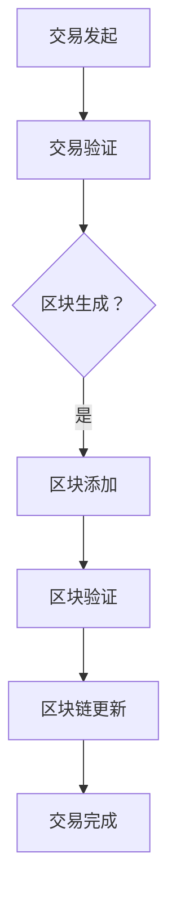
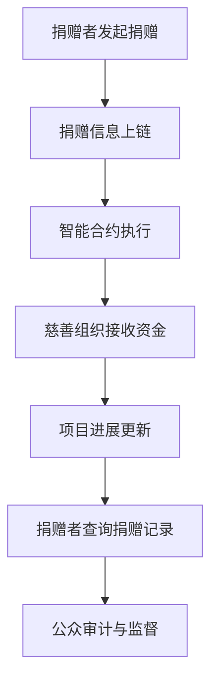
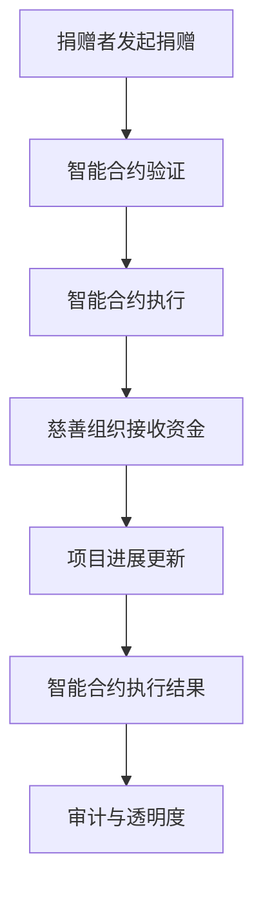
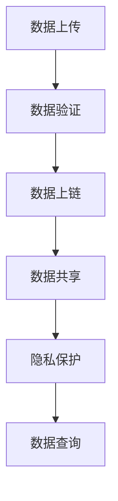

                 

## 引言

### 区块链技术的发展背景

区块链技术的起源可以追溯到2008年，当时一位化名为中本聪（Satoshi Nakamoto）的匿名人物发布了《比特币：一种点对点电子现金系统》的白皮书，提出了比特币的概念。比特币作为第一个基于区块链技术的数字货币，引发了全球范围内的关注。随后，越来越多的区块链项目如雨后春笋般涌现，区块链技术逐渐成为金融科技领域的一大热点。

区块链技术的核心优势在于其去中心化、安全性和透明性。去中心化意味着区块链网络中的每个节点都拥有相同的权限，不存在单点故障风险。安全性方面，区块链利用加密技术确保数据的不可篡改性和机密性。透明性则是区块链的一个重要特点，所有交易记录都在链上公开，任何人都可以查询和验证。

### 慈善捐赠的挑战与机遇

慈善捐赠是人们为了公共利益而进行的无私奉献，但在实际操作中面临着一系列挑战。首先，传统的慈善捐赠流程复杂，涉及多个环节，容易出现信息不对称和透明度不足的问题。其次，慈善资金的流向和用途难以追踪，存在被挪用和滥用的风险。此外，由于缺乏有效的监督机制，一些慈善组织可能存在管理不善和资源浪费的问题。

然而，区块链技术的出现为慈善捐赠带来了新的机遇。区块链技术能够提高慈善捐赠的透明度，确保捐赠资金的使用情况可被公众监督。此外，区块链的去中心化特性可以降低慈善捐赠的交易成本，使得捐赠流程更加高效。因此，研究区块链在慈善捐赠中的应用具有重要的现实意义。

## 第1章 区块链技术基础

### 1.1 区块链的基本概念

#### 区块链的定义

区块链是一种去中心化的分布式数据库技术，通过加密算法和共识机制保证数据的真实性和安全性。它由一系列按时间顺序排列的区块组成，每个区块都包含了若干交易记录。区块链的核心特点包括去中心化、不可篡改、透明性和安全性。

#### 区块链的核心组成部分

区块链由以下几个核心组成部分构成：

- **区块**：区块链的基本单元，包含交易数据、时间戳、难度目标和随机数等。
- **链**：由多个区块按照时间顺序链接而成的链条。
- **节点**：区块链网络中的计算机，负责存储和维护区块链数据。
- **交易**：区块链中的基本操作，代表资金、信息或资源的转移。
- **挖矿**：通过计算解决数学难题来生成新区块的过程。

### 1.2 区块链的架构与工作原理

#### 区块链的分布式账本

区块链的分布式账本技术使得数据不再集中在单一地点，而是分散存储在多个节点上。每个节点都拥有完整的账本副本，通过节点之间的通信和验证确保账本的一致性。这种去中心化的结构提高了系统的可靠性和抗攻击能力。

#### 区块链的交易流程

区块链的交易流程可以分为以下几个步骤：

1. **交易发起**：用户发起一笔交易，将交易数据发送到区块链网络。
2. **交易验证**：网络中的节点对交易数据进行验证，确保交易的有效性和合法性。
3. **区块生成**：验证成功的交易被组成一个新的区块，并添加到区块链上。
4. **区块验证**：其他节点验证新区块的合法性，并确认其添加到区块链中。

### 1.3 Mermaid流程图：区块链数据流转

下面是一个简化的区块链数据流转Mermaid流程图：

## 第2章 区块链与慈善捐赠

### 2.1 区块链在慈善捐赠中的应用场景

#### 公益资金管理

区块链技术可以为慈善捐赠提供一个透明的资金管理平台。通过智能合约，捐赠资金在区块链上被锁定，只能在满足特定条件时进行转移。这种机制确保了资金使用的合法性和透明度，防止资金被滥用或挪用。

#### 捐赠流程优化

区块链技术可以简化慈善捐赠的流程，减少中间环节，提高捐赠效率。捐赠者可以直接将资金捐赠给慈善组织，无需经过第三方中介，降低了交易成本。此外，区块链上的捐赠记录永久保存，便于后续的审计和查询。

#### 公益项目追踪

区块链技术可以实时记录和更新公益项目的进展情况，使得捐赠者可以实时了解捐赠资金的使用情况。这种透明的项目追踪机制提高了公众对慈善组织的信任度，也促使慈善组织更加负责任地使用资金。

### 2.2 区块链对慈善捐赠的改进

#### 提高透明度

区块链技术通过将捐赠记录公开在链上，使得捐赠资金的流向和使用情况透明化。捐赠者、慈善组织和公众都可以查询区块链上的交易记录，确保资金的合法性和透明度。

#### 增强信任

区块链的去中心化特性使得信任机制从第三方转移到网络参与者之间。捐赠者可以确信他们的资金被用于指定项目，慈善组织也无法随意篡改资金使用记录，这种信任机制提高了捐赠者和慈善组织之间的互信。

#### 降低成本

传统慈善捐赠流程中，中介机构和第三方服务商的存在增加了交易成本。区块链技术通过去中心化的方式简化了流程，降低了交易成本，使得更多的资金可以用于实际公益项目。

### 2.3 Mermaid流程图：区块链在慈善捐赠中的流程

下面是一个简化的区块链在慈善捐赠中的流程Mermaid流程图：

## 第3章 提高透明度的区块链机制

### 3.1 智能合约在慈善捐赠中的应用

#### 智能合约的定义

智能合约是一种自执行合同，其条款以计算机代码的形式定义，并直接运行在区块链上。智能合约通过编程规则自动执行，确保了合同的执行效率和透明性。

#### 智能合约在慈善捐赠中的应用

在慈善捐赠中，智能合约可以用于管理捐赠资金的流转。例如，捐赠者可以将资金通过智能合约直接发送给慈善组织，确保资金直达指定用途。此外，智能合约可以设置资金解冻条件，只有在满足特定条件时，资金才会被释放，从而防止资金被滥用。

#### 案例分析

某慈善组织通过智能合约管理捐赠资金，将捐款用于支持灾区的重建项目。捐赠者通过智能合约捐赠资金，资金被锁定期限为6个月。在这6个月期间，慈善组织必须定期更新项目进展，并在满足项目完成条件后，智能合约才会解锁剩余资金。

### 3.2 区块链审计与透明度

#### 区块链审计的定义

区块链审计是一种通过审查区块链上的交易记录和智能合约执行情况，以确保慈善捐赠流程合法性和透明度的方法。

#### 区块链审计的步骤

1. **数据采集**：审计人员收集区块链上的捐赠记录和智能合约执行日志。
2. **数据分析**：审计人员对收集到的数据进行分析，验证捐赠流程的合法性和透明度。
3. **报告生成**：审计人员根据分析结果生成审计报告，公开捐赠资金的流向和使用情况。

#### 案例分析

某知名慈善组织邀请专业审计机构对区块链上的捐赠资金进行审计。审计机构通过分析区块链上的交易记录和智能合约执行情况，发现了一笔异常资金流转。在进一步调查中，审计机构确认该资金被用于非指定用途，并公开了审计结果，提高了公众对慈善组织的信任度。

### 3.3 Mermaid流程图：智能合约的执行过程

下面是一个简化的智能合约执行过程Mermaid流程图：

## 第4章 提高信任的区块链工具

### 4.1 区块链身份认证

#### 区块链身份认证的定义

区块链身份认证是一种利用区块链技术验证用户身份的方法。通过将用户身份信息上链，可以确保身份信息的真实性和唯一性。

#### 区块链身份认证的工作原理

1. **身份信息上链**：用户将身份信息（如姓名、地址、身份证明等）上传到区块链上。
2. **身份信息验证**：其他用户或机构可以查询区块链上的身份信息，验证用户身份的真实性。
3. **隐私保护**：区块链上的身份信息可以通过加密技术进行保护，确保用户隐私不被泄露。

#### 案例分析

某公益平台采用区块链身份认证技术，用户在注册时需要上传身份证明，并将其记录在区块链上。平台管理员可以随时查询用户的身份信息，确保平台的用户身份真实可靠。

### 4.2 区块链数据存储与共享

#### 区块链数据存储的定义

区块链数据存储是指利用区块链技术存储和共享数据的方法。区块链上的数据具有不可篡改性和透明性，可以有效保护数据的完整性和安全性。

#### 区块链数据存储的工作原理

1. **数据上链**：用户将数据上传到区块链上，形成新的区块。
2. **数据验证**：网络中的节点对上传的数据进行验证，确保数据的真实性和有效性。
3. **数据共享**：其他用户或机构可以查询区块链上的数据，实现数据的透明共享。

#### 案例分析

某公益组织采用区块链数据存储技术，将捐赠记录和项目进展数据记录在区块链上。捐赠者可以随时查询捐赠资金的使用情况，确保项目资金的透明性和公开性。

### 4.3 Mermaid流程图：数据共享与隐私保护

下面是一个简化的数据共享与隐私保护Mermaid流程图：

## 第5章 实际案例研究

### 5.1 案例一：某慈善组织的区块链应用实践

#### 案例背景

某慈善组织致力于帮助贫困地区的儿童接受教育。该组织采用区块链技术管理捐赠资金和项目进展，提高透明度和信任度。

#### 案例分析

1. **资金管理**：捐赠者通过区块链将资金捐赠给慈善组织，智能合约确保资金直接进入指定账户，防止资金被滥用。
2. **项目进展**：慈善组织将项目进展数据上链，捐赠者可以随时查询项目的实际进展情况，确保资金使用透明。
3. **审计与监督**：第三方审计机构定期对区块链上的数据进行分析，确保项目的合法性和透明度。

#### 案例总结

通过区块链技术，该慈善组织成功提高了资金使用的透明度和信任度，得到了捐赠者和公众的认可。

### 5.2 案例二：区块链慈善捐赠平台案例分析

#### 案例背景

某区块链慈善捐赠平台旨在为慈善组织提供透明的资金管理和高效的捐赠流程。

#### 案例分析

1. **身份认证**：平台采用区块链身份认证技术，确保捐赠者和慈善组织的身份真实可靠。
2. **资金流转**：捐赠者通过平台将资金捐赠给慈善组织，智能合约确保资金的合法流转和用途。
3. **项目追踪**：平台实时记录和更新公益项目的进展情况，捐赠者可以随时查询项目的实际进展。

#### 案例总结

通过区块链技术，该平台成功实现了高效、透明和安全的慈善捐赠流程，为慈善事业的发展提供了有力支持。

## 第6章 未来发展趋势与挑战

### 6.1 区块链在慈善捐赠中的未来趋势

#### 智能合约的广泛应用

智能合约将逐渐成为慈善捐赠的核心工具，通过自动执行合同条款，提高捐赠流程的效率和透明度。

#### 数据共享与隐私保护

区块链技术将在数据共享与隐私保护方面发挥重要作用，为捐赠者和慈善组织提供安全可靠的数据存储和共享平台。

#### 慈善组织的数字化转型

越来越多的慈善组织将采用区块链技术进行数字化转型，提高管理效率和公众信任度。

### 6.2 技术挑战与解决方案

#### 安全性问题

区块链技术面临的安全性问题包括区块链节点的安全性、数据加密和防篡改等。解决方案包括加强区块链节点的安全防护、使用更强的加密算法和建立完善的安全协议。

#### 法规与伦理问题

区块链技术在慈善捐赠中的应用涉及到法律和伦理问题，如数据隐私保护、信息透明度等。解决方案包括制定相关的法律法规，建立行业标准和伦理准则，确保区块链技术的合法合规应用。

### 6.3 法规与伦理问题探讨

#### 数据隐私保护

区块链技术中的数据隐私保护是一个重要议题。解决方案包括使用隐私保护技术，如零知识证明和同态加密，确保用户数据的隐私和安全。

#### 信息透明度

区块链技术可以提高慈善捐赠的信息透明度，但如何平衡透明度与隐私保护是一个挑战。解决方案包括制定透明的数据披露规则，确保公众在了解捐赠信息的同时，保护用户的隐私。

## 第7章 总结

### 区块链在慈善捐赠中的应用总结

区块链技术为慈善捐赠带来了透明度、信任度和效率的提升。通过智能合约、身份认证和数据存储等技术，区块链为慈善组织提供了高效、透明和安全的运作平台。

### 本书贡献与展望

本书详细介绍了区块链技术在慈善捐赠中的应用，分析了提高透明度和信任度的机制与工具，并探讨了未来发展的趋势与挑战。未来，随着区块链技术的不断成熟，其在慈善捐赠领域的应用前景将更加广阔。

## 附录

### 附录A：区块链开发工具与资源

#### 区块链开发工具

1. **Ethereum**：以太坊是最流行的智能合约平台，提供了丰富的开发工具和资源。
2. **Hyperledger Fabric**：Hyperledger Fabric是IBM主导的开源区块链框架，适用于企业级应用。
3. **EOSIO**：EOSIO是一个高性能的区块链平台，支持分布式应用的开发。

#### 区块链资源

1. **区块链技术研究报告**：国内外知名研究机构发布的区块链技术研究报告，如中国信息通信研究院的《中国区块链技术和应用发展白皮书》。
2. **区块链社区**：如以太坊社区、Hyperledger社区等，提供了丰富的技术讨论和资源分享。

### 附录B：常见问题与解答

#### 问题1：区块链技术是否真的能提高慈善捐赠的透明度？

解答：是的，区块链技术通过将捐赠记录公开在链上，使得捐赠资金的流向和使用情况透明化。捐赠者、慈善组织和公众都可以查询区块链上的交易记录，确保资金的合法性和透明度。

#### 问题2：区块链技术是否安全可靠？

解答：区块链技术具有较高的安全性。它采用加密算法和共识机制确保数据的真实性和安全性。然而，区块链节点和智能合约的安全性仍然是需要关注的重点。

#### 问题3：区块链技术是否适用于所有慈善组织？

解答：区块链技术适用于各种类型的慈善组织，特别是那些需要提高透明度和信任度的组织。然而，对于一些小型或资源有限的慈善组织，引入区块链技术可能面临一定的挑战。

### 附录C：最佳实践 tips

1. **选择合适的区块链平台**：根据慈善组织的需求和预算，选择合适的区块链平台和工具。
2. **进行充分的测试**：在正式部署区块链应用之前，进行充分的测试和验证，确保系统的稳定性和安全性。
3. **加强安全意识**：培养员工的安全意识，确保区块链系统的安全运行。

### 附录D：注意事项

1. **遵循法律法规**：在引入区块链技术时，遵循相关的法律法规，确保技术的合法合规应用。
2. **持续维护和更新**：定期维护和更新区块链系统，确保其稳定运行和持续发展。
3. **关注技术发展趋势**：关注区块链技术的研究进展和应用案例，及时更新知识体系。

### 附录E：拓展阅读

1. **《区块链技术指南》**：详细介绍了区块链技术的基本概念、架构和应用场景。
2. **《智能合约：原理与实践》**：深入探讨了智能合约的原理、实现和应用。
3. **《区块链与慈善捐赠》**：探讨了区块链技术在慈善捐赠中的应用和挑战。

