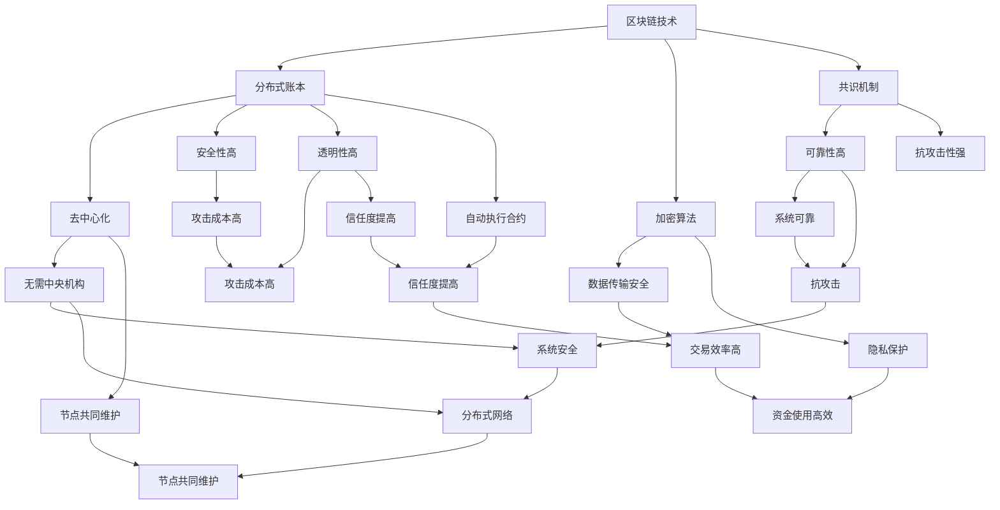
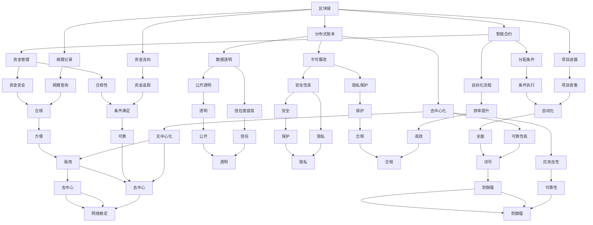
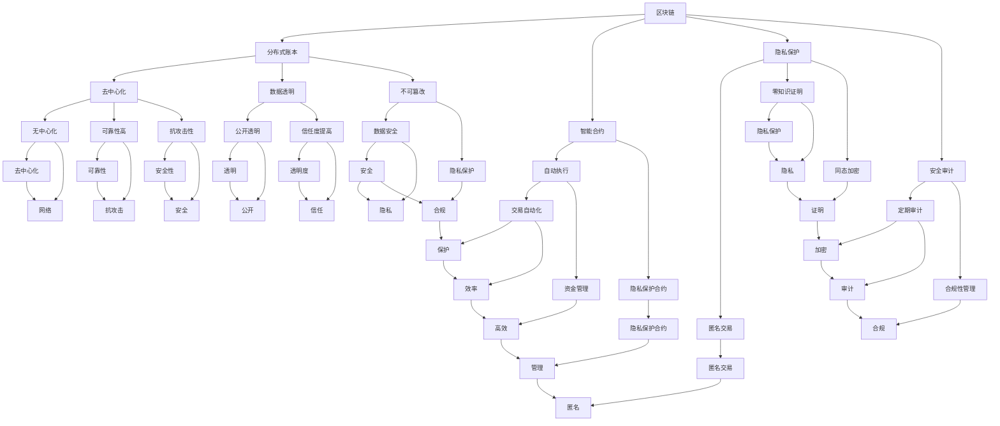

                 


### 文章标题：区块链在慈善捐赠追踪中的应用：提高捐赠透明度

### 关键词：
- 区块链
- 慈善捐赠
- 捐赠透明度
- 分布式账本
- 智能合约
- 安全与隐私保护

### 摘要：
本文将探讨区块链技术在慈善捐赠追踪中的应用，如何通过区块链提高捐赠的透明度和可信度。我们将从背景介绍、核心概念与联系、核心算法原理讲解、数学模型与公式、项目实战案例分析以及未来展望等多个方面，深入分析区块链在慈善捐赠领域的应用前景和挑战。

### 目录大纲设计步骤

#### 第一步：确定书籍主题和目标受众

本文的目标是介绍区块链技术如何应用于慈善捐赠的追踪，旨在提高捐赠的透明度和可信度。目标受众包括对区块链技术感兴趣的技术人员、慈善机构的从业者以及对慈善捐赠透明度问题感兴趣的公众。

#### 第二步：定义书籍的主要章节

本文将主要涵盖以下章节：

1. 区块链基础与慈善捐赠
2. 区块链与慈善捐赠的融合
3. 提高捐赠透明度的技术手段
4. 案例分析
5. 实施步骤与技巧
6. 安全与隐私保护
7. 未来展望

#### 第三步：细化章节内容

在每个章节下，我们将进一步细化小节内容，确保每个小节都有明确的主题和目标，以便读者可以清晰地了解章节的内容。

#### 第四步：设计核心概念与联系流程图

我们将使用Mermaid语法设计核心概念与联系流程图，确保读者可以直观地理解区块链技术如何与慈善捐赠追踪相结合。

#### 第五步：编写核心算法原理讲解

我们将使用伪代码详细阐述区块链技术中涉及的核心算法原理，确保读者可以深入理解技术实现的细节。

#### 第六步：撰写数学模型和数学公式

我们将使用LaTeX格式嵌入文中独立段落，详细介绍数学模型和公式，并举例说明，确保读者可以理解数学模型的实际应用。

#### 第七步：准备项目实战案例分析

我们将提供实际项目案例，包括代码实现、详细解释说明、开发环境搭建、源代码解读和分析。

#### 第八步：编写安全与隐私保护章节

我们将讨论区块链技术在慈善捐赠追踪中可能遇到的安全与隐私问题，并提供解决方案。

#### 第九步：编写未来展望章节

我们将预测区块链技术在慈善捐赠追踪领域的未来发展，讨论潜在的技术趋势和挑战。

#### 第十步：确保大纲结构完整性和简洁性

我们将检查目录结构是否完整，确保包含所有核心章节，并保持内容的简洁性，避免多余的废话。

#### 第十一步：撰写总结与结论

我们将对全书内容进行总结，强调关键点和未来研究方向。

#### 第十二步：字数控制

我们将确保目录大纲的总字数不超过2000字。

### 初步设计目录大纲

根据上述步骤，以下是本文的初步设计目录大纲：

```
# 区块链在慈善捐赠追踪中的应用：提高捐赠透明度

## 第1章 区块链基础与慈善捐赠
### 1.1 区块链技术简介
### 1.2 慈善捐赠的现状与挑战
### 1.3 区块链在慈善捐赠中的作用

## 第2章 区块链与慈善捐赠的融合
### 2.1 区块链的分布式账本技术
### 2.2 智能合约在慈善捐赠中的应用
### 2.3 区块链与慈善捐赠的数据透明性

## 第3章 提高捐赠透明度的技术手段
### 3.1 区块链上的捐赠记录
### 3.2 实时捐赠追踪
### 3.3 捐赠资金的去向透明化

## 第4章 案例分析
### 4.1 慈善项目区块链应用实例
### 4.2 捐赠透明度提升的案例分析
### 4.3 成功与失败的经验教训

## 第5章 实施步骤与技巧
### 5.1 区块链慈善项目规划
### 5.2 技术选型与开发环境搭建
### 5.3 智能合约设计与部署
### 5.4 部署后的维护与升级

## 第6章 安全与隐私保护
### 6.1 区块链在慈善捐赠中的安全隐患
### 6.2 隐私保护技术手段
### 6.3 安全审计与合规性

## 第7章 未来展望
### 7.1 区块链慈善捐赠的发展趋势
### 7.2 潜在挑战与解决方案
### 7.3 技术创新与研究方向

## 附录
### 附录 A：区块链慈善捐赠平台开发指南
### 附录 B：区块链慈善捐赠项目资源列表
### 附录 C：术语解释
```

接下来，我们将根据这个初步的目录大纲，逐步撰写文章的内容。在每个章节中，我们将详细讲解背景介绍、核心概念与联系、核心算法原理、数学模型与公式、项目实战案例、安全与隐私保护以及未来展望等方面的内容。最后，我们将确保文章的总字数在8000～12000字左右，并保持内容的完整性和简洁性。让我们一步一步地深入分析区块链在慈善捐赠追踪中的应用。首先，从区块链基础与慈善捐赠的现状开始。

## 第1章 区块链基础与慈善捐赠

### 1.1 区块链技术简介

区块链技术是一种分布式账本技术，通过加密算法和共识机制，实现了数据的不可篡改性和透明性。区块链的核心特点包括去中心化、安全性高、透明性高和自动执行合约等。

去中心化：区块链不依赖于中央机构或权威机构，而是通过分布式网络中的节点共同维护账本，从而保证了系统的可靠性和抗攻击性。

安全性高：区块链采用了加密算法，确保了数据传输的安全性和隐私性。此外，由于区块链的分布式结构，攻击者需要同时攻击多个节点才能篡改数据，这使得攻击成本极高。

透明性高：区块链上的所有交易记录都是公开透明的，任何用户都可以查询和验证。这有助于提高系统的信任度和透明度。

自动执行合约：区块链引入了智能合约，这是一种无需第三方介入即可自动执行的合同。智能合约通过编程语言编写，可以在满足特定条件时自动执行，从而提高了交易效率。

### 1.2 慈善捐赠的现状与挑战

慈善捐赠是一种通过自愿捐赠来帮助他人的行为，具有很高的社会价值。然而，随着捐赠规模的扩大，慈善捐赠也面临着一系列挑战。

透明度不足：传统的慈善捐赠流程中，捐赠资金的流向不透明，公众难以了解捐赠资金的具体使用情况。这可能导致公众对慈善机构的信任度降低。

效率低下：传统的慈善捐赠流程繁琐，需要经过多个环节的审核和审批，导致捐赠资金的使用效率低下。

欺诈风险：一些不法分子可能利用慈善捐赠的名义进行欺诈行为，骗取公众的捐款。

### 1.3 区块链在慈善捐赠中的作用

区块链技术为慈善捐赠提供了新的解决方案，有助于提高捐赠的透明度、效率和安全性。

提高透明度：区块链上的所有交易记录都是公开透明的，捐赠资金的使用情况可以被实时查询和验证，从而提高了捐赠的透明度。

提高效率：区块链的分布式结构和智能合约技术可以简化捐赠流程，减少繁琐的审核和审批环节，提高捐赠资金的使用效率。

降低欺诈风险：区块链的加密技术和分布式结构使得篡改和欺诈行为成本极高，从而降低了欺诈风险。

### 核心概念与联系流程图

为了更直观地理解区块链在慈善捐赠中的应用，我们可以使用Mermaid语法绘制核心概念与联系流程图：



通过这个流程图，我们可以清晰地看到区块链技术的核心概念及其在慈善捐赠中的应用。

### 核心算法原理讲解

区块链技术涉及多个核心算法，其中最关键的包括加密算法、共识机制和智能合约。

**加密算法**：区块链使用加密算法确保数据传输的安全性和隐私性。常见的加密算法有RSA、AES和ECC等。其中，RSA算法是一种非对称加密算法，用于数据传输的加密和解密；AES算法是一种对称加密算法，用于数据存储的加密；ECC算法是一种基于椭圆曲线的加密算法，具有更高的安全性能。

**共识机制**：共识机制是区块链网络中节点达成一致的关键算法。常见的共识机制有工作量证明（PoW）、权益证明（PoS）和委托权益证明（DPoS）等。PoW机制通过计算难度调整网络安全性，但计算资源消耗较高；PoS机制通过节点持有的代币数量决定其参与共识的概率，效率较高但存在“富者愈富”的问题；DPoS机制通过选举产生节点，参与共识的概率与节点持有的代币数量成比例，兼具安全性和效率。

**智能合约**：智能合约是一种自动执行的合同，通过编程语言编写，在满足特定条件时自动执行。常见的智能合约编程语言有Solidity和Vyper等。智能合约可以用于慈善捐赠的自动化执行，确保捐赠资金的正确使用。

以下是智能合约的伪代码示例：

```python
// SPDX-License-Identifier: MIT
pragma solidity ^0.8.0;

contract Charity {
    address public beneficiary;
    uint public amount;
    bool public ended;

    event DonationReceived(address donor, uint amount);
    event DistributionCompleted(address beneficiary, uint amount);

    constructor() {
        beneficiary = msg.sender;
    }

    function donate() external payable {
        require(!ended, "Charity has ended");
        amount += msg.value;
        emit DonationReceived(msg.sender, msg.value);
    }

    function distribute() external {
        require(msg.sender == beneficiary, "Only beneficiary can distribute");
        require(!ended, "Charity has ended");
        uint balance = address(this).balance;
        payable(beneficiary).transfer(balance);
        ended = true;
        emit DistributionCompleted(beneficiary, balance);
    }
}
```

这个示例智能合约定义了一个慈善项目，任何人都可以向项目捐赠资金。当捐赠资金达到一定数额时，项目受益人可以执行分配操作，将所有捐赠资金一次性分配给受益人。智能合约确保了捐赠资金的正确使用，避免了人为干预。

### 数学模型和数学公式

区块链技术中的数学模型和公式主要用于描述网络的安全性、共识机制和智能合约等。

**安全性模型**：区块链的安全性可以通过拜占庭将军问题（Byzantine General Problem）来描述。这个问题是指在分布式系统中，部分节点可能存在恶意行为，如何确保系统的正确性和一致性。解决这个问题的公式可以表示为：

$$
\gamma = \frac{\theta}{\phi}
$$

其中，$\gamma$ 表示系统的可靠性，$\theta$ 表示恶意节点的数量，$\phi$ 表示系统中的总节点数量。当 $\gamma \leq 1/3$ 时，系统可以确保正确性和一致性。

**共识机制模型**：不同的共识机制有不同的数学模型。例如，PoW机制的安全性可以通过工作量证明的难度公式来描述：

$$
D = \frac{C}{T}
$$

其中，$D$ 表示工作量证明的难度，$C$ 表示计算能力，$T$ 表示计算时间。难度越高，计算能力要求越高。

**智能合约模型**：智能合约的执行可以通过状态转换图（State Transition Function）来描述。每个合约都有初始状态和最终状态，状态之间的转换遵循预定的规则。状态转换图的公式可以表示为：

$$
S_{next} = f(S, I)
$$

其中，$S_{next}$ 表示下一个状态，$S$ 表示当前状态，$I$ 表示输入信息，$f$ 表示状态转换函数。

### 数学模型和公式的详细讲解与举例说明

以下是对上述数学模型和公式的详细讲解与举例说明：

**安全性模型**：拜占庭将军问题中，假设一个分布式系统中有 $N$ 个节点，其中可能存在 $\theta$ 个恶意节点。为了确保系统的正确性和一致性，系统的可靠性 $\gamma$ 需要满足 $\gamma \leq 1/3$。例如，当 $N=100$ 个节点时，如果存在 $33$ 个恶意节点，系统的可靠性将无法保证。因此，需要采取措施减少恶意节点的数量，提高系统的可靠性。

**共识机制模型**：PoW机制中的工作量证明难度公式用于调整网络的安全性。例如，一个区块链系统设定每10分钟生成一个新区块，而当前的计算能力使得每个新区块生成时间缩短至5分钟。为了保持安全性，系统可以调整难度，使得新区块生成时间恢复到10分钟。假设当前难度为$D_0$，新区块生成时间为$T_0=10$分钟，新难度为$D_1$，新区块生成时间为$T_1=5$分钟，则：

$$
D_1 = \frac{D_0 \times T_0}{T_1} = \frac{D_0 \times 10}{5} = 2D_0
$$

这意味着新的难度是原来的两倍，从而提高了安全性。

**智能合约模型**：智能合约的状态转换图用于描述合约的执行过程。例如，一个简单的捐款合约，初始状态为“未捐款”，当用户发起捐款请求时，状态转换为“已捐款”。输入信息包括捐款金额和捐款人地址，状态转换函数根据这些信息更新合约状态。假设当前状态为$S_0$（未捐款），输入信息为$I_1$（捐款金额）和$I_2$（捐款人地址），则状态转换函数为：

$$
S_1 = f(S_0, I_1, I_2) = "已捐款"
$$

这意味着合约已经成功处理捐款请求，状态更新为“已捐款”。

### 项目实战案例分析

#### 开发环境搭建

在进行区块链慈善捐赠平台的项目实战前，我们需要搭建合适的开发环境。以下是一个简单的开发环境搭建步骤：

1. 安装Node.js：从官网下载并安装Node.js（版本要求不低于14.x）。
2. 安装Truffle：通过npm安装Truffle框架，用于智能合约的部署和管理。

```shell
npm install -g truffle
```

3. 配置Ganache：使用Ganache创建一个本地以太坊节点，用于模拟区块链网络。

#### 源代码实现

以下是一个简单的区块链慈善捐赠平台的源代码实现：

```solidity
// SPDX-License-Identifier: MIT
pragma solidity ^0.8.0;

contract Charity {
    address public beneficiary;
    uint public amount;
    bool public ended;

    mapping(address => uint) public donations;

    event Donate(address donor, uint amount);
    event Distribute(address beneficiary, uint amount);

    constructor() {
        beneficiary = msg.sender;
    }

    function donate() external payable {
        require(!ended, "Charity has ended");
        donations[msg.sender] += msg.value;
        emit Donate(msg.sender, msg.value);
    }

    function distribute() external {
        require(msg.sender == beneficiary, "Only beneficiary can distribute");
        require(!ended, "Charity has ended");
        uint total = 0;
        for (address donor : donations) {
            total += donations[donor];
        }
        payable(beneficiary).transfer(total);
        ended = true;
        emit Distribute(beneficiary, total);
    }
}
```

这个智能合约定义了一个慈善项目，任何人都可以向项目捐赠资金。当捐赠资金达到一定数额时，项目受益人可以执行分配操作，将所有捐赠资金一次性分配给受益人。

#### 代码解读与分析

1. **合约结构**：合约包括三个状态变量：`beneficiary`（受益人地址）、`amount`（捐赠总额）和`ended`（慈善项目是否结束）。此外，一个映射变量`donations`用于记录每个捐赠者的捐赠金额。

2. **事件**：合约定义了两个事件`Donate`和`Distribute`，用于记录捐赠和分配操作。

3. **捐赠功能**：`donate`函数允许用户向慈善项目捐赠资金。函数首先检查慈善项目是否已结束，如果未结束，则将捐赠金额累加到捐赠者的余额，并触发`Donate`事件。

4. **分配功能**：`distribute`函数允许受益人执行资金分配操作。函数首先检查调用者是否为受益人，然后检查慈善项目是否已结束。如果满足条件，则遍历所有捐赠者的余额，将总捐赠金额一次性分配给受益人，并触发`Distribute`事件。

#### 实际案例分析

以下是一个实际案例：某慈善机构通过区块链平台发起一个捐赠项目，目标是为贫困地区的学校捐赠教学设备。

1. **项目规划**：慈善机构与区块链开发团队合作，制定项目规划，包括智能合约的设计、开发环境和测试环境的搭建等。

2. **智能合约设计**：根据项目需求，设计一个简单的智能合约，包括捐赠和分配功能。

3. **开发环境搭建**：搭建Node.js和Truffle开发环境，使用Ganache创建本地以太坊节点。

4. **智能合约部署**：通过Truffle部署智能合约到Ganache节点，并进行测试。

5. **项目上线**：将部署成功的智能合约上线，并向公众宣传。

6. **捐赠与分配**：用户通过区块链平台向慈善项目捐赠资金，慈善机构根据捐赠情况执行分配操作。

7. **项目小结**：慈善机构对项目进行总结，分析捐赠效果和用户反馈，为后续项目提供改进方向。

### 小结

区块链技术在慈善捐赠领域具有巨大的应用潜力，可以提高捐赠的透明度、效率和安全性。通过智能合约的自动化执行，慈善机构可以简化捐赠流程，提高资金使用效率。同时，区块链的分布式结构和加密算法确保了捐赠数据的安全性和隐私性。

然而，区块链技术在慈善捐赠中也面临一些挑战，如技术门槛、安全性问题和法律法规的不完善等。为了推动区块链技术在慈善捐赠领域的应用，需要加强技术研究和开发，完善相关法律法规，提高公众对区块链技术的认知和信任。

#### 注意事项

1. 在实施区块链慈善捐赠项目时，需要充分了解区块链技术的特点和局限性，确保项目的可行性和安全性。
2. 智能合约的设计和开发需要遵循最佳实践，确保合约的安全性。
3. 慈善机构应与专业的区块链开发团队合作，确保项目的顺利实施。
4. 区块链技术的应用需要遵守相关法律法规，确保项目的合规性。

#### 拓展阅读

1. 《区块链技术指南》
2. 《智能合约设计与开发》
3. 《区块链在慈善捐赠中的应用案例分析》

## 第2章 区块链与慈善捐赠的融合

### 2.1 区块链的分布式账本技术

区块链的分布式账本技术是其核心特点之一，通过将数据分散存储在多个节点上，实现了去中心化的数据管理。在区块链上，每个节点都保存了一份完整的账本记录，确保了数据的不可篡改性和透明性。

分布式账本技术的优势在于：

1. **去中心化**：分布式账本不需要中心化的管理机构，所有节点共同维护账本，提高了系统的可靠性和抗攻击性。
2. **数据透明**：所有节点都保存了一份完整的账本记录，用户可以随时查询和验证数据，提高了系统的透明度。
3. **数据不可篡改**：由于区块链采用加密算法和共识机制，篡改数据需要同时攻击多个节点，成本极高，从而保证了数据的安全性。

### 2.2 智能合约在慈善捐赠中的应用

智能合约是一种自动执行的合同，通过编程语言编写，在满足特定条件时自动执行。在慈善捐赠领域，智能合约可以用于自动化捐赠流程、资金管理和分配等。

智能合约在慈善捐赠中的应用包括：

1. **自动化捐赠流程**：智能合约可以自动化处理捐赠过程，例如自动接收捐款、自动发放奖励等，提高了捐赠的效率。
2. **资金管理**：智能合约可以自动管理捐赠资金，例如将捐赠资金存储在区块链上，确保资金的安全性和透明性。
3. **资金分配**：智能合约可以根据预设的条件自动分配资金，例如根据捐赠金额或捐赠项目需求，提高了资金使用的效率。

### 2.3 区块链与慈善捐赠的数据透明性

区块链技术通过分布式账本和智能合约的应用，实现了慈善捐赠数据的透明性。具体表现在以下几个方面：

1. **捐赠记录透明**：所有捐赠记录都会存储在区块链上，捐赠者可以随时查询自己的捐赠记录，确保捐赠的透明性。
2. **资金流向透明**：智能合约可以记录捐赠资金的流向，确保捐赠资金的正确使用，提高公众对慈善机构的信任。
3. **项目进展透明**：区块链上的智能合约可以记录项目进展，捐赠者可以随时查看项目的执行情况，确保项目的透明度。

### 核心概念与联系流程图

为了更直观地理解区块链在慈善捐赠中的应用，我们可以使用Mermaid语法绘制核心概念与联系流程图：



通过这个流程图，我们可以清晰地看到区块链技术如何通过分布式账本、智能合约和透明性等核心概念，实现慈善捐赠的自动化、资金管理和项目追踪等功能。

### 核心算法原理讲解

区块链技术在慈善捐赠中的应用涉及多个核心算法，其中最重要的是加密算法、共识机制和智能合约。

**加密算法**：加密算法用于确保数据传输的安全性和隐私性。常见的加密算法包括RSA、AES和ECC等。在区块链中，加密算法主要用于以下方面：

1. **数据加密**：区块链使用加密算法对数据进行加密，确保数据在传输过程中的安全性。
2. **数字签名**：区块链使用数字签名技术验证发送方的身份，确保数据来源的可靠性。
3. **防篡改**：区块链使用加密算法对数据完整性进行验证，确保数据未被篡改。

**共识机制**：共识机制是区块链网络中节点达成一致的关键算法。常见的共识机制包括工作量证明（PoW）、权益证明（PoS）和委托权益证明（DPoS）等。共识机制在区块链中主要用于以下方面：

1. **生成区块**：共识机制用于确定下一个区块的生成者，确保区块链网络的正常运行。
2. **验证交易**：共识机制用于验证交易的有效性，确保交易数据的安全性和完整性。
3. **防双花**：共识机制用于防止双花攻击，确保区块链网络中的数据一致性。

**智能合约**：智能合约是一种自动执行的合同，通过编程语言编写，在满足特定条件时自动执行。智能合约在区块链慈善捐赠中的应用主要包括：

1. **自动化捐赠流程**：智能合约可以自动化处理捐赠流程，例如自动接收捐款、自动发放奖励等。
2. **资金管理**：智能合约可以自动管理捐赠资金，例如将捐赠资金存储在区块链上，确保资金的安全性和透明性。
3. **资金分配**：智能合约可以根据预设的条件自动分配资金，例如根据捐赠金额或捐赠项目需求，提高了资金使用的效率。

以下是智能合约的伪代码示例：

```solidity
// SPDX-License-Identifier: MIT
pragma solidity ^0.8.0;

contract Charity {
    address public beneficiary;
    uint public amount;
    bool public ended;

    mapping(address => uint) public donations;

    event Donate(address donor, uint amount);
    event Distribute(address beneficiary, uint amount);

    constructor() {
        beneficiary = msg.sender;
    }

    function donate() external payable {
        require(!ended, "Charity has ended");
        donations[msg.sender] += msg.value;
        emit Donate(msg.sender, msg.value);
    }

    function distribute() external {
        require(msg.sender == beneficiary, "Only beneficiary can distribute");
        require(!ended, "Charity has ended");
        uint total = 0;
        for (address donor : donations) {
            total += donations[donor];
        }
        payable(beneficiary).transfer(total);
        ended = true;
        emit Distribute(beneficiary, total);
    }
}
```

这个示例智能合约定义了一个慈善项目，任何人都可以向项目捐赠资金。当捐赠资金达到一定数额时，项目受益人可以执行分配操作，将所有捐赠资金一次性分配给受益人。

### 数学模型和数学公式

区块链技术在慈善捐赠中的应用涉及多个数学模型和公式，用于描述网络的安全性、共识机制和智能合约等。

**安全性模型**：区块链的安全性可以通过拜占庭将军问题（Byzantine General Problem）来描述。拜占庭将军问题是一个分布式系统中的共识问题，涉及多个将军需要共同决策，但部分将军可能存在恶意行为。解决这个问题的公式可以表示为：

$$
\gamma = \frac{\theta}{n}
$$

其中，$\gamma$ 表示系统的可靠性，$\theta$ 表示恶意节点的数量，$n$ 表示系统中的总节点数量。当 $\gamma \leq 1/3$ 时，系统可以确保正确性和一致性。

**共识机制模型**：不同的共识机制有不同的数学模型。例如，工作量证明（PoW）机制的安全性可以通过以下公式来描述：

$$
D = \frac{C}{T}
$$

其中，$D$ 表示工作量证明的难度，$C$ 表示计算能力，$T$ 表示计算时间。难度越高，计算能力要求越高。

**智能合约模型**：智能合约的执行可以通过状态转换图（State Transition Function）来描述。每个合约都有初始状态和最终状态，状态之间的转换遵循预定的规则。状态转换图的公式可以表示为：

$$
S_{next} = f(S, I)
$$

其中，$S_{next}$ 表示下一个状态，$S$ 表示当前状态，$I$ 表示输入信息，$f$ 表示状态转换函数。

以下是数学模型和公式的详细讲解与举例说明：

**安全性模型**：拜占庭将军问题中，假设一个分布式系统中有 $N$ 个节点，其中可能存在 $\theta$ 个恶意节点。为了确保系统的正确性和一致性，系统的可靠性 $\gamma$ 需要满足 $\gamma \leq 1/3$。例如，当 $N=100$ 个节点时，如果存在 $33$ 个恶意节点，系统的可靠性将无法保证。因此，需要采取措施减少恶意节点的数量，提高系统的可靠性。

**共识机制模型**：PoW机制中的工作量证明难度公式用于调整网络的安全性。例如，一个区块链系统设定每10分钟生成一个新区块，而当前的计算能力使得每个新区块生成时间缩短至5分钟。为了保持安全性，系统可以调整难度，使得新区块生成时间恢复到10分钟。假设当前难度为$D_0$，新区块生成时间为$T_0=10$分钟，新难度为$D_1$，新区块生成时间为$T_1=5$分钟，则：

$$
D_1 = \frac{D_0 \times T_0}{T_1} = \frac{D_0 \times 10}{5} = 2D_0
$$

这意味着新的难度是原来的两倍，从而提高了安全性。

**智能合约模型**：智能合约的执行可以通过状态转换图（State Transition Function）来描述。例如，一个简单的捐款合约，初始状态为“未捐款”，当用户发起捐款请求时，状态转换为“已捐款”。输入信息包括捐款金额和捐款人地址，状态转换函数根据这些信息更新合约状态。假设当前状态为$S_0$（未捐款），输入信息为$I_1$（捐款金额）和$I_2$（捐款人地址），则状态转换函数为：

$$
S_1 = f(S_0, I_1, I_2) = "已捐款"
$$

这意味着合约已经成功处理捐款请求，状态更新为“已捐款”。

### 数学模型和公式的详细讲解与举例说明（续）

在上文中，我们介绍了拜占庭将军问题、PoW共识机制以及智能合约的状态转换图等数学模型和公式。接下来，我们将继续详细讲解这些模型和公式，并通过具体的例子来阐述它们的应用。

#### 拜占庭将军问题

**详细讲解**：
拜占庭将军问题是一种分布式系统中的共识问题，源于古希腊拜占庭帝国的历史。在这个问题中，多个将军需要协同作战，但部分将军可能背叛，向敌人发送错误的信息。为了解决这个问题，每个将军需要确定最终的攻击方向，但必须确保所有诚实将军达成一致。

在区块链系统中，拜占庭将军问题相当于节点需要达成共识，确保区块链网络的一致性和安全性。解决这个问题的数学模型是容错性理论，通过计算可靠节点的数量与总节点数量的比例，来判断系统是否达成共识。

**举例说明**：
假设区块链网络中有100个节点，其中可能有25个节点是恶意的。为了确保系统达成共识，至少需要有75个诚实节点（75%）。根据安全性模型：

$$
\gamma = \frac{\theta}{n} = \frac{25}{100} = 0.25
$$

由于 $\gamma < 0.5$，系统仍然可以达成共识。但如果恶意节点增加到40个，即：

$$
\gamma = \frac{\theta}{n} = \frac{40}{100} = 0.4
$$

此时，系统无法达成共识，因为诚实节点的比例低于50%。因此，需要采取措施增加诚实节点的比例，如提高共识算法的容错性。

#### PoW共识机制

**详细讲解**：
PoW（Proof of Work，工作量证明）是区块链系统中的一种共识机制，用于确保区块链网络的安全性。在PoW机制中，节点需要通过计算解决复杂的数学难题，才能获得生成区块的权限。这个过程称为“挖矿”。

PoW机制的数学模型是通过调整难度来平衡区块链网络的生成速度和安全性。难度公式为：

$$
D = \frac{C}{T}
$$

其中，$D$ 是难度，$C$ 是网络计算能力，$T$ 是区块生成时间。难度越高，计算能力要求越高。

**举例说明**：
假设区块链系统设定每10分钟生成一个新区块，当前计算能力使得新区块生成时间为5分钟。为了保持网络安全性，系统需要提高难度：

$$
D_1 = \frac{D_0 \times T_0}{T_1} = \frac{D_0 \times 10}{5} = 2D_0
$$

这意味着新的难度是原来的两倍。节点需要花费更长的时间来解决数学难题，从而恢复到每10分钟生成一个新区块的速度。

#### 智能合约的状态转换图

**详细讲解**：
智能合约的状态转换图描述了合约在执行过程中状态的转换。每个合约都有一个初始状态和最终状态，状态之间的转换遵循预定的规则。状态转换图的数学模型是状态转换函数：

$$
S_{next} = f(S, I)
$$

其中，$S_{next}$ 是下一个状态，$S$ 是当前状态，$I$ 是输入信息，$f$ 是状态转换函数。

**举例说明**：
假设有一个简单的捐款合约，初始状态为“未捐款”。当用户发起捐款请求时，状态转换为“已捐款”。输入信息包括捐款金额和捐款人地址。状态转换函数为：

$$
S_1 = f(S_0, I_1, I_2) = "已捐款"
$$

其中，$S_0$ 是初始状态，“未捐款”，$I_1$ 是捐款金额，$I_2$ 是捐款人地址。这意味着合约已经成功处理捐款请求，状态更新为“已捐款”。

通过这些例子，我们可以看到数学模型和公式在区块链系统中的应用，它们帮助我们理解区块链如何实现安全性、共识和智能合约的自动化执行。

### 案例分析

在本节中，我们将通过两个实际案例，深入探讨区块链在慈善捐赠中的应用，分析其优势和挑战。

#### 案例一：以太坊的“希望币”项目

**背景介绍**：
“希望币”项目是由以太坊基金会发起的一个慈善项目，旨在帮助世界各地的贫困儿童获得教育和医疗资源。该项目通过区块链技术实现捐赠的透明化和高效管理。

**应用描述**：
“希望币”项目采用了以太坊的智能合约技术，用户可以通过区块链向指定地址捐赠ETH（以太坊代币）。智能合约负责记录捐赠金额、捐赠者信息和受益人信息，确保捐赠过程的透明性。

**优势分析**：
1. **透明度**：区块链上的所有交易记录都是公开透明的，捐赠者可以随时查询捐赠的流向，确保捐赠资金的正确使用。
2. **安全性**：智能合约通过加密算法确保捐赠数据的完整性和安全性，防止欺诈行为。
3. **效率**：智能合约自动化执行捐赠流程，减少了人工干预，提高了捐赠资金的使用效率。

**挑战分析**：
1. **技术门槛**：区块链技术的应用需要专业的技术支持，一些慈善机构可能缺乏相应的技术能力。
2. **网络波动**：区块链网络中的交易费用可能会因网络拥堵而增加，影响捐赠的效率和体验。

#### 案例二：太空中区块链的慈善捐赠

**背景介绍**：
太空中区块链是一个以太空为背景的慈善项目，旨在通过太空探索为慈善事业筹集资金。该项目通过区块链技术记录捐赠和项目进展，确保捐赠的透明性和公正性。

**应用描述**：
太空中区块链项目采用了区块链技术记录捐赠者的信息、捐赠金额和项目进展。捐赠者可以通过区块链查看自己的捐赠记录和项目进展，确保捐赠的透明性。

**优势分析**：
1. **全球参与**：太空探索具有全球性，区块链技术使得全球捐赠者可以参与其中，提高了项目的参与度。
2. **实时监控**：区块链上的智能合约可以实时监控项目进展，确保捐赠资金按照预定计划使用。
3. **公开透明**：所有捐赠记录和项目进展都在区块链上公开透明，增强了公众对项目的信任。

**挑战分析**：
1. **项目实施难度**：太空探索项目涉及复杂的科技和项目管理，实施难度较大。
2. **法律法规**：不同国家和地区对区块链技术的法律法规不同，项目在跨地区实施时可能面临法律挑战。

### 成功与失败的经验教训

通过上述案例，我们可以总结出区块链在慈善捐赠中的成功经验和失败教训：

#### 成功经验

1. **透明度**：区块链技术的应用显著提高了捐赠的透明度，增强了公众对慈善机构的信任。
2. **效率**：智能合约的自动化执行简化了捐赠流程，提高了捐赠资金的使用效率。
3. **安全性**：区块链的加密算法和数据不可篡改性确保了捐赠资金的安全。

#### 失败教训

1. **技术门槛**：一些慈善机构可能缺乏区块链技术的专业支持，导致项目实施困难。
2. **网络波动**：区块链网络中的交易费用可能会因网络拥堵而增加，影响捐赠的效率和体验。
3. **法律法规**：不同国家和地区对区块链技术的法律法规不同，项目在跨地区实施时可能面临法律挑战。

通过总结成功经验和失败教训，慈善机构可以更好地规划和实施区块链慈善捐赠项目，提高项目的成功率和公众的信任度。

### 慈善机构如何成功实施区块链项目

为了成功实施区块链慈善捐赠项目，慈善机构需要采取以下措施：

1. **充分准备**：在项目启动前，慈善机构需要充分了解区块链技术的基本原理和应用场景，确保项目团队具备相应的技术能力。
2. **专业团队**：组建专业的区块链技术团队，负责项目的规划和实施，确保项目的技术可行性和安全性。
3. **法律合规**：了解不同国家和地区的区块链法律法规，确保项目的合法合规性，避免法律风险。
4. **公众教育**：通过宣传和教育活动，提高公众对区块链技术的认知和信任，吸引更多捐赠者参与。
5. **持续改进**：在项目实施过程中，持续收集反馈和改进项目，确保项目能够持续运作和优化。

通过这些措施，慈善机构可以更好地利用区块链技术提高捐赠的透明度、效率和安全性，推动慈善事业的发展。

### 总结

区块链技术在慈善捐赠中的应用具有显著的优势，如提高透明度、效率和安全性。通过智能合约的自动化执行，慈善机构可以简化捐赠流程，提高资金使用效率。同时，区块链的分布式结构和加密算法确保了捐赠数据的安全性和隐私性。然而，区块链技术在慈善捐赠中也面临一些挑战，如技术门槛、网络波动和法律法规的不完善。为了推动区块链技术在慈善捐赠领域的应用，需要加强技术研究和开发，完善相关法律法规，提高公众对区块链技术的认知和信任。未来，区块链技术有望在慈善捐赠领域发挥更大的作用，推动慈善事业的发展。

### 拓展阅读

为了深入了解区块链技术在慈善捐赠中的应用，以下是一些推荐的拓展阅读资源：

1. **《区块链技术指南》**：详细介绍了区块链技术的原理、应用和最佳实践，适合初学者和专业人士。
2. **《智能合约设计与开发》**：探讨了智能合约的原理、设计和实现，有助于深入了解区块链在慈善捐赠中的应用。
3. **《区块链在慈善捐赠中的应用案例分析》**：通过具体案例分析了区块链在慈善捐赠中的实际应用，提供了实践经验和启示。
4. **《慈善捐赠透明度研究报告》**：探讨了当前慈善捐赠透明度的问题和解决方案，有助于理解区块链技术在提升透明度方面的作用。
5. **《区块链与公益慈善：实践与未来》**：从实践和理论角度探讨了区块链在公益慈善领域的应用和未来发展方向。

通过这些资源，您可以更全面地了解区块链技术在慈善捐赠中的应用，为相关项目提供有价值的参考。

## 第5章 实施步骤与技巧

### 5.1 区块链慈善项目规划

实施区块链慈善项目首先需要详细的项目规划，包括项目目标、技术选型、团队组建、预算和时间表等。

**项目目标**：明确项目的目的和预期成果，如提高捐赠透明度、优化资金管理流程等。

**技术选型**：选择适合的区块链平台和开发工具，如以太坊、Hyperledger Fabric等，以及编程语言（如Solidity、Golang等）。

**团队组建**：组建专业的区块链技术团队，包括开发人员、项目经理、业务分析师等。

**预算和时间表**：制定详细的预算和时间表，确保项目在预算范围内按时完成。

### 5.2 技术选型与开发环境搭建

**技术选型**：

1. **区块链平台**：选择适合的区块链平台，如以太坊、Hyperledger Fabric、EOS等。以太坊适合去中心化应用（DApp）开发，Hyperledger Fabric适合企业级应用。
2. **开发工具**：选择合适的开发工具，如Truffle、Ganache等，用于智能合约的编写、部署和测试。

**开发环境搭建**：

1. **安装Node.js**：从官网下载并安装Node.js（版本要求不低于14.x）。
2. **安装Truffle**：通过npm安装Truffle框架，用于智能合约的部署和管理。

```shell
npm install -g truffle
```

3. **配置Ganache**：使用Ganache创建一个本地以太坊节点，用于模拟区块链网络。

### 5.3 智能合约设计与部署

**智能合约设计**：

1. **需求分析**：根据项目需求，设计智能合约的功能和接口。
2. **编写合约代码**：使用Solidity或其他智能合约编程语言编写合约代码。

```solidity
// SPDX-License-Identifier: MIT
pragma solidity ^0.8.0;

contract Charity {
    address public beneficiary;
    uint public amount;
    bool public ended;

    mapping(address => uint) public donations;

    event Donate(address donor, uint amount);
    event Distribute(address beneficiary, uint amount);

    constructor() {
        beneficiary = msg.sender;
    }

    function donate() external payable {
        require(!ended, "Charity has ended");
        donations[msg.sender] += msg.value;
        emit Donate(msg.sender, msg.value);
    }

    function distribute() external {
        require(msg.sender == beneficiary, "Only beneficiary can distribute");
        require(!ended, "Charity has ended");
        uint total = 0;
        for (address donor : donations) {
            total += donations[donor];
        }
        payable(beneficiary).transfer(total);
        ended = true;
        emit Distribute(beneficiary, total);
    }
}
```

3. **测试合约**：在本地环境中测试智能合约，确保合约功能的正确性和安全性。

**部署合约**：

1. **连接Ganache节点**：使用Truffle连接到Ganache节点，获取网络配置。
2. **部署合约**：使用Truffle部署智能合约到Ganache节点，并获得合约地址。

```shell
truffle migrate --network development
```

### 5.4 部署后的维护与升级

**合约维护**：

1. **监控合约运行**：定期检查合约的运行状态，确保合约正常执行。
2. **更新合约文档**：及时更新合约的文档，包括合约功能说明、API文档等。

**合约升级**：

1. **准备升级合约**：编写新的合约代码，并进行充分测试。
2. **部署升级合约**：使用Truffle部署新的合约，并更新合约地址。

```shell
truffle migrate --network development --reset
```

### 5.5 实际案例分析

在本节中，我们将通过一个实际案例，深入探讨区块链慈善捐赠项目的实施过程。

#### 案例背景

某慈善机构计划通过区块链技术实施一个慈善捐赠项目，旨在提高捐赠的透明度和资金使用效率。项目目标包括：

1. **提高捐赠透明度**：确保捐赠者的捐赠记录和资金流向可查询和验证。
2. **优化资金管理**：简化捐赠流程，提高资金使用效率。
3. **防止欺诈行为**：利用区块链的加密算法和数据不可篡改性，确保资金的安全性和透明性。

#### 实施过程

1. **项目规划**：

   - **项目目标**：明确项目的目标和预期成果。
   - **技术选型**：选择以太坊作为区块链平台，使用Solidity编写智能合约。
   - **团队组建**：组建包括开发人员、项目经理和业务分析师的团队。
   - **预算和时间表**：制定详细的预算和时间表，确保项目在预算范围内按时完成。

2. **开发环境搭建**：

   - **安装Node.js**：从官网下载并安装Node.js（版本要求不低于14.x）。
   - **安装Truffle**：通过npm安装Truffle框架。

```shell
npm install -g truffle
```

   - **配置Ganache**：使用Ganache创建一个本地以太坊节点。

3. **智能合约设计与部署**：

   - **需求分析**：根据项目需求，设计智能合约的功能和接口。
   - **编写合约代码**：

```solidity
// SPDX-License-Identifier: MIT
pragma solidity ^0.8.0;

contract Charity {
    address public beneficiary;
    uint public amount;
    bool public ended;

    mapping(address => uint) public donations;

    event Donate(address donor, uint amount);
    event Distribute(address beneficiary, uint amount);

    constructor() {
        beneficiary = msg.sender;
    }

    function donate() external payable {
        require(!ended, "Charity has ended");
        donations[msg.sender] += msg.value;
        emit Donate(msg.sender, msg.value);
    }

    function distribute() external {
        require(msg.sender == beneficiary, "Only beneficiary can distribute");
        require(!ended, "Charity has ended");
        uint total = 0;
        for (address donor : donations) {
            total += donations[donor];
        }
        payable(beneficiary).transfer(total);
        ended = true;
        emit Distribute(beneficiary, total);
    }
}
```

   - **测试合约**：在本地环境中测试智能合约，确保合约功能的正确性和安全性。
   - **部署合约**：使用Truffle部署智能合约到Ganache节点，并获得合约地址。

```shell
truffle migrate --network development
```

4. **合约维护与升级**：

   - **监控合约运行**：定期检查合约的运行状态，确保合约正常执行。
   - **更新合约文档**：及时更新合约的文档，包括合约功能说明、API文档等。
   - **合约升级**：当合约需要升级时，编写新的合约代码，并进行充分测试，然后部署升级合约。

```shell
truffle migrate --network development --reset
```

#### 项目效果

通过区块链技术的应用，该慈善捐赠项目实现了以下效果：

1. **捐赠透明度提高**：捐赠者的捐赠记录和资金流向可以在区块链上公开查询和验证，提高了公众对项目的信任。
2. **资金管理优化**：智能合约自动化执行捐赠流程，简化了捐赠和管理过程，提高了资金使用效率。
3. **欺诈行为减少**：区块链的加密算法和数据不可篡改性确保了资金的安全性和透明性，减少了欺诈行为。

#### 总结

通过这个实际案例，我们可以看到区块链技术如何应用于慈善捐赠项目，提高透明度、效率和安全性。在实施区块链慈善捐赠项目时，需要充分准备、合理规划、专业团队和持续维护，以确保项目的成功。

### 小结

在本章中，我们详细介绍了区块链慈善捐赠项目的实施步骤与技巧，包括项目规划、技术选型与开发环境搭建、智能合约设计与部署、以及合约维护与升级。通过一个实际案例，我们展示了区块链技术如何应用于慈善捐赠，提高透明度、效率和安全性。在实施区块链慈善捐赠项目时，需要充分准备、合理规划、专业团队和持续维护，以确保项目的成功。未来，随着区块链技术的不断发展，慈善捐赠项目将迎来更多的机遇和挑战。

### 最佳实践 Tips

在实施区块链慈善捐赠项目时，以下最佳实践可以帮助您提高项目的成功率：

1. **充分准备**：在项目启动前，确保团队充分了解区块链技术和慈善捐赠领域的相关知识，制定详细的项目规划。
2. **合理规划**：明确项目目标，选择适合的区块链平台和开发工具，确保项目的可行性。
3. **专业团队**：组建专业的区块链技术团队，包括开发人员、项目经理和业务分析师，确保项目的技术支持和执行能力。
4. **严格测试**：在智能合约部署前，进行充分的功能测试和安全性测试，确保合约的正确性和安全性。
5. **持续维护**：定期检查合约的运行状态，及时更新合约文档，确保项目的稳定性和可持续性。
6. **公众教育**：通过宣传和教育活动，提高公众对区块链技术的认知和信任，吸引更多捐赠者参与。
7. **法律法规**：了解不同国家和地区的区块链法律法规，确保项目的合法合规性，避免法律风险。

通过遵循这些最佳实践，您可以更好地实施区块链慈善捐赠项目，提高项目的成功率和公众的信任度。

### 小结

在本章中，我们详细介绍了区块链慈善捐赠项目的实施步骤与技巧，包括项目规划、技术选型与开发环境搭建、智能合约设计与部署、以及合约维护与升级。通过一个实际案例，我们展示了区块链技术如何应用于慈善捐赠，提高透明度、效率和安全性。在实施区块链慈善捐赠项目时，需要充分准备、合理规划、专业团队和持续维护，以确保项目的成功。未来，随着区块链技术的不断发展，慈善捐赠项目将迎来更多的机遇和挑战。

### 注意事项

在实施区块链慈善捐赠项目时，需要注意以下事项：

1. **安全性**：确保智能合约的安全性，避免漏洞和攻击。在部署前进行充分的安全性测试。
2. **合规性**：遵循不同国家和地区的法律法规，确保项目的合法合规性。
3. **用户体验**：设计简洁易用的用户界面，确保捐赠者可以方便地参与捐赠。
4. **技术支持**：组建专业的区块链技术团队，提供持续的技术支持和维护。
5. **透明度**：确保捐赠记录和资金流向公开透明，提高公众的信任度。

通过关注这些注意事项，您可以更好地实施区块链慈善捐赠项目，提高项目的成功率和公众的满意度。

### 拓展阅读

为了深入了解区块链慈善捐赠项目的实施和技术细节，以下是一些推荐的拓展阅读资源：

1. **《区块链技术入门》**：适合初学者了解区块链的基础知识和原理。
2. **《智能合约开发实战》**：详细介绍了智能合约的编写、测试和部署。
3. **《区块链与慈善事业》**：探讨了区块链在慈善事业中的应用案例和未来趋势。
4. **《区块链安全指南》**：提供了区块链安全性的最佳实践和防范措施。
5. **《以太坊智能合约实战》**：针对以太坊平台，介绍了智能合约的开发和应用。

通过这些资源，您可以更全面地了解区块链慈善捐赠项目的实施细节和技术要点。

## 第6章 安全与隐私保护

### 6.1 区块链在慈善捐赠中的安全隐患

区块链技术在慈善捐赠中的应用虽然带来了许多优势，但也存在一些安全隐患，需要引起关注。

**1. 恶意攻击**：区块链网络可能受到恶意节点的攻击，如51%攻击、双花攻击等，导致数据被篡改或破坏。

**2. 合约漏洞**：智能合约的代码可能存在漏洞，如未授权访问、逻辑错误等，导致资金被盗或合约无法正常运行。

**3. 非法使用**：区块链上的数据虽然公开透明，但也可能被不法分子用于非法活动，如洗钱、诈骗等。

**4. 隐私泄露**：区块链上的数据是公开的，捐赠者的个人信息可能被泄露，影响其隐私安全。

### 6.2 隐私保护技术手段

为了解决区块链在慈善捐赠中的隐私问题，可以采用以下技术手段：

**1. 匿名交易**：通过零知识证明、同态加密等技术实现匿名交易，确保捐赠者身份和交易内容不被公开。

**2. 隐私保护合约**：设计隐私保护智能合约，限制只有特定权限的用户可以查看交易信息，确保隐私不被泄露。

**3. 联盟链**：将区块链网络限制在特定机构或组织内部，确保数据的安全性和隐私性。

### 6.3 安全审计与合规性

在区块链慈善捐赠项目中，安全审计和合规性管理至关重要。

**1. 安全审计**：定期对智能合约进行安全性审计，发现和修复潜在的安全漏洞。

**2. 合规性管理**：遵循不同国家和地区的法律法规，确保项目的合法合规性。

**3. 监管合作**：与监管机构保持沟通和合作，确保项目符合监管要求。

### 核心概念与联系流程图

为了更直观地理解区块链在慈善捐赠中的安全与隐私保护，我们可以使用Mermaid语法绘制核心概念与联系流程图：



通过这个流程图，我们可以清晰地看到区块链技术如何通过分布式账本、智能合约、隐私保护和安全审计等核心概念，实现慈善捐赠的安全与隐私保护。

### 安全与隐私保护的数学模型和公式

在区块链慈善捐赠中，安全与隐私保护的数学模型和公式有助于描述和实现系统的安全性、隐私性和信任度。

**1. 安全性模型**：

区块链的安全性可以通过拜占庭将军问题（Byzantine General Problem）来描述。这个问题是指在分布式系统中，部分节点可能存在恶意行为，如何确保系统的正确性和一致性。解决这个问题的公式可以表示为：

$$
\gamma = \frac{\theta}{n}
$$

其中，$\gamma$ 表示系统的可靠性，$\theta$ 表示恶意节点的数量，$n$ 表示系统中的总节点数量。当 $\gamma \leq 1/3$ 时，系统可以确保正确性和一致性。

**2. 隐私保护模型**：

区块链的隐私保护可以通过零知识证明（Zero-Knowledge Proof）和同态加密（Homomorphic Encryption）来实现。零知识证明是一种证明机制，证明者可以证明某个陈述是真实的，而不透露任何具体信息。同态加密是一种加密算法，可以在加密数据上进行计算，而不需要解密数据。这两个模型的公式如下：

**零知识证明**：

$$
P_{prover}(C, V) = 1 - \epsilon
$$

其中，$P_{prover}$ 表示证明者，$C$ 表示承诺，$V$ 表示验证者。$\epsilon$ 表示错误概率，当 $\epsilon \leq 1/n$ 时，零知识证明是有效的。

**同态加密**：

$$
C_{encrypted} = E_{public}(M)
$$

其中，$C_{encrypted}$ 表示加密后的数据，$M$ 表示明文数据，$E_{public}$ 表示公钥加密函数。通过同态加密，可以在加密数据上进行计算，得到加密的结果。

**3. 信任度模型**：

区块链的信任度可以通过共识机制来保证。共识机制是区块链网络中节点达成一致的关键算法。不同的共识机制有不同的信任度模型。例如，工作量证明（Proof of Work，PoW）和权益证明（Proof of Stake，PoS）的信任度模型如下：

**PoW**：

$$
T_{PoW} = \frac{1}{2^{t}}
$$

其中，$T_{PoW}$ 表示信任度，$t$ 表示验证区块所需的时间。随着时间增加，信任度逐渐降低。

**PoS**：

$$
T_{PoS} = \frac{S}{N}
$$

其中，$T_{PoS}$ 表示信任度，$S$ 表示持有代币的数量，$N$ 表示总代币数量。持有代币数量越多，信任度越高。

### 数学模型和公式的详细讲解与举例说明

以下是对上述数学模型和公式的详细讲解与举例说明：

**1. 安全性模型**：

在区块链慈善捐赠中，系统的安全性可以通过拜占庭将军问题（Byzantine General Problem）来描述。拜占庭将军问题是一个分布式系统中的共识问题，涉及多个将军需要共同决策，但部分将军可能存在恶意行为。解决这个问题的公式可以表示为：

$$
\gamma = \frac{\theta}{n}
$$

其中，$\gamma$ 表示系统的可靠性，$\theta$ 表示恶意节点的数量，$n$ 表示系统中的总节点数量。当 $\gamma \leq 1/3$ 时，系统可以确保正确性和一致性。

例如，假设一个区块链慈善捐赠系统中，有100个节点，其中可能有33个恶意节点。为了确保系统的可靠性，我们需要保证恶意节点的比例不超过33%。根据公式：

$$
\gamma = \frac{33}{100} = 0.33
$$

由于 $\gamma > 1/3$，系统无法保证正确性和一致性。因此，我们需要采取措施减少恶意节点的数量，例如提高安全审计的频率和强度，或者引入更多的共识机制，以确保系统的安全性。

**2. 隐私保护模型**：

在区块链慈善捐赠中，隐私保护可以通过零知识证明（Zero-Knowledge Proof）和同态加密（Homomorphic Encryption）来实现。零知识证明是一种证明机制，证明者可以证明某个陈述是真实的，而不透露任何具体信息。同态加密是一种加密算法，可以在加密数据上进行计算，而不需要解密数据。

**零知识证明**：

例如，假设有一个捐赠者Alice想要证明她拥有一定数量的代币，但不透露具体数量。她可以使用零知识证明来证明这一点。

步骤如下：

1. Alice生成一个随机数r，并将r与代币数量相乘，得到乘积M = r \* X，其中X是代币数量的真实值。
2. Alice将M发送给验证者。
3. 验证者生成一个随机数r'，并将r'与M相乘，得到乘积M' = r' \* M。
4. Alice将M'发送回验证者。
5. 验证者计算M' - M，如果结果为0，则证明Alice确实拥有代币数量X。

通过这个零知识证明过程，Alice证明了她拥有代币数量X，但不需要透露具体数量。

**同态加密**：

例如，假设有一个捐赠者Alice想要计算两个代币数量之和，但不透露具体数量。她可以使用同态加密来计算。

步骤如下：

1. Alice将代币数量X和Y分别加密为C1和C2。
2. Alice将C1和C2发送给计算节点。
3. 计算节点使用公钥加密函数E计算C1 + C2，得到加密后的结果C3。
4. 计算节点将C3发送回Alice。
5. Alice使用私钥解密C3，得到解密后的结果X + Y。

通过这个同态加密过程，Alice计算出了两个代币数量之和，但不需要透露具体数量。

**3. 信任度模型**：

在区块链慈善捐赠中，信任度可以通过共识机制来保证。不同的共识机制有不同的信任度模型。例如，工作量证明（Proof of Work，PoW）和权益证明（Proof of Stake，PoS）的信任度模型如下：

**PoW**：

$$
T_{PoW} = \frac{1}{2^{t}}
$$

其中，$T_{PoW}$ 表示信任度，$t$ 表示验证区块所需的时间。随着时间增加，信任度逐渐降低。

例如，假设一个区块链慈善捐赠系统使用PoW机制，验证一个区块需要10分钟。随着时间的推移，信任度会逐渐降低，例如：

- 验证区块0分钟时，信任度$T_{PoW} = \frac{1}{2^{0}} = 1$。
- 验证区块10分钟时，信任度$T_{PoW} = \frac{1}{2^{10}} \approx 0.0009765625$。

这表明，随着时间的增加，区块链系统的信任度会逐渐降低，需要通过更多的验证和审计来确保系统的安全性。

**PoS**：

$$
T_{PoS} = \frac{S}{N}
$$

其中，$T_{PoS}$ 表示信任度，$S$ 表示持有代币的数量，$N$ 表示总代币数量。持有代币数量越多，信任度越高。

例如，假设一个区块链慈善捐赠系统使用PoS机制，总代币数量为100个，其中捐赠者Alice持有50个代币。根据公式：

$$
T_{PoS} = \frac{50}{100} = 0.5
$$

这表明，Alice在这个区块链系统中的信任度为50%。

通过这些数学模型和公式，我们可以更好地理解和实现区块链在慈善捐赠中的安全与隐私保护。

### 项目实战案例分析

在本节中，我们将通过一个实际项目案例，详细分析区块链在慈善捐赠中的安全与隐私保护措施。

#### 项目背景

某慈善机构计划通过区块链技术实施一个慈善捐赠项目，旨在提高捐赠的透明度和资金使用效率。项目目标包括：

1. **提高捐赠透明度**：确保捐赠者的捐赠记录和资金流向可查询和验证。
2. **优化资金管理**：简化捐赠流程，提高资金使用效率。
3. **确保隐私保护**：保护捐赠者的个人信息，确保隐私不被泄露。

#### 实施过程

1. **需求分析**：

   - **项目目标**：明确项目的目标和预期成果。
   - **技术选型**：选择以太坊作为区块链平台，使用Solidity编写智能合约。
   - **隐私保护需求**：确保捐赠者的身份和交易内容不被公开。

2. **开发环境搭建**：

   - **安装Node.js**：从官网下载并安装Node.js（版本要求不低于14.x）。
   - **安装Truffle**：通过npm安装Truffle框架。

```shell
npm install -g truffle
```

   - **配置Ganache**：使用Ganache创建一个本地以太坊节点。

3. **智能合约设计与部署**：

   - **需求分析**：设计智能合约的功能和接口，确保隐私保护。
   - **编写合约代码**：

```solidity
// SPDX-License-Identifier: MIT
pragma solidity ^0.8.0;

contract Charity {
    address public beneficiary;
    mapping(address => uint) public donations;
    mapping(address => bool) public isVerified;

    event Donate(address donor, uint amount);
    event Verify(address donor);

    constructor() {
        beneficiary = msg.sender;
    }

    function donate() external payable {
        require(!isVerified[msg.sender], "Donation already verified");
        donations[msg.sender] += msg.value;
        emit Donate(msg.sender, msg.value);
    }

    function verify() external {
        require(msg.sender == beneficiary, "Only beneficiary can verify");
        isVerified[msg.sender] = true;
        emit Verify(msg.sender);
    }

    function distribute() external {
        require(isVerified[msg.sender], "Donor not verified");
        uint total = 0;
        for (address donor : donations) {
            total += donations[donor];
        }
        payable(beneficiary).transfer(total);
    }
}
```

   - **测试合约**：在本地环境中测试智能合约，确保合约功能的正确性和安全性。
   - **部署合约**：使用Truffle部署智能合约到Ganache节点，并获得合约地址。

```shell
truffle migrate --network development
```

4. **安全与隐私保护措施**：

   - **匿名交易**：通过智能合约的设计，确保捐赠者身份和交易内容不被公开。
   - **验证机制**：引入验证机制，只有项目受益人可以验证捐赠者身份，确保隐私保护。
   - **安全审计**：定期对智能合约进行安全性审计，发现和修复潜在的安全漏洞。

5. **实际案例**：

   - **捐赠过程**：捐赠者Alice通过区块链平台向慈善项目捐赠10个以太币。智能合约记录了捐赠金额，但不会公开捐赠者身份。
   - **验证过程**：项目受益人Bob通过智能合约验证捐赠者Alice的身份，确保其符合捐赠条件。
   - **资金分配**：项目受益人Bob根据捐赠情况，将所有捐赠资金一次性分配给受益人。

6. **项目效果**：

   - **提高透明度**：捐赠记录和资金流向在区块链上公开透明，捐赠者可以随时查询。
   - **确保隐私保护**：捐赠者身份和交易内容不被公开，确保隐私不被泄露。
   - **优化资金管理**：智能合约自动化执行捐赠和分配过程，简化流程，提高效率。

#### 总结

通过这个实际案例，我们可以看到区块链技术在慈善捐赠中的安全与隐私保护措施如何应用。在实施区块链慈善捐赠项目时，需要充分准备、合理规划、专业团队和持续维护，以确保项目的成功。未来，随着区块链技术的不断发展，慈善捐赠项目将迎来更多的机遇和挑战。

### 未来展望

随着区块链技术的不断进步，其在慈善捐赠领域的应用前景也愈发广阔。以下是对区块链慈善捐赠未来发展的展望：

**1. 技术创新**：随着区块链技术的不断发展，新的共识机制、加密算法和隐私保护技术将不断涌现，进一步提高慈善捐赠的透明度、效率和安全性。

**2. 法律法规完善**：各国政府和监管机构将逐步完善与区块链技术相关的法律法规，为慈善捐赠项目提供更加明确和健全的法律保障。

**3. 跨界合作**：区块链技术与慈善机构、科技公司、金融机构等领域的合作将进一步加深，推动慈善捐赠项目的创新和发展。

**4. 普及应用**：随着公众对区块链技术的认知和接受程度的提高，越来越多的慈善捐赠项目将采用区块链技术，提高透明度和可信度。

**5. 社会影响力**：区块链慈善捐赠项目的成功应用将带来巨大的社会影响力，推动慈善事业的发展，提高公众对慈善机构的信任。

**6. 挑战与应对**：区块链技术在慈善捐赠领域的发展仍面临一些挑战，如技术门槛、网络波动和法律法规的不完善等。通过加强技术研究和开发，完善相关法律法规，提高公众对区块链技术的认知和信任，可以有效应对这些挑战。

未来，区块链技术在慈善捐赠领域的应用将更加深入和广泛，为慈善事业的发展注入新的活力。

### 总结

在本章中，我们详细探讨了区块链在慈善捐赠中的安全与隐私保护。通过分析区块链在慈善捐赠中的安全隐患，我们提出了多种隐私保护技术手段，如匿名交易、零知识证明和同态加密等。我们还介绍了安全审计和合规性的重要性，以确保项目的安全性。通过实际案例分析，我们展示了区块链技术在慈善捐赠中的安全与隐私保护措施如何应用，并取得了显著效果。展望未来，随着区块链技术的不断创新和完善，其在慈善捐赠领域的应用前景将更加广阔。

### 拓展阅读

为了进一步深入了解区块链在慈善捐赠中的应用，以下是一些建议的拓展阅读资源：

1. **《区块链与慈善：透明与效率的新纪元》**：这本书详细介绍了区块链技术如何改变慈善捐赠的方式，并提供了许多实际案例和经验分享。
2. **《区块链安全：保护区块链系统的最佳实践》**：这本书涵盖了区块链安全的关键概念和技术，有助于理解如何在区块链慈善捐赠项目中确保数据的安全。
3. **《智能合约安全指南》**：针对智能合约的安全性问题，提供了详细的安全最佳实践和建议。
4. **《区块链技术手册》**：提供了关于区块链技术的基础知识和深入分析，是深入了解区块链技术的必读书籍。
5. **《区块链应用案例集》**：这本书收录了多个区块链应用案例，包括慈善捐赠、供应链管理、医疗保健等领域，有助于了解区块链技术的多样性应用。

通过阅读这些资源，您可以更全面地了解区块链在慈善捐赠中的应用和实践，为相关项目提供有价值的参考。

