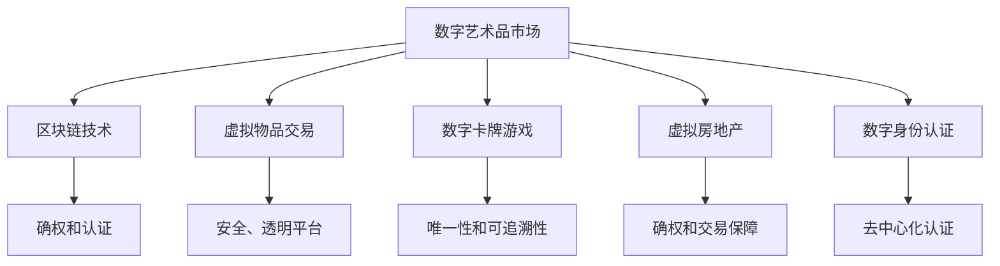

                 

## 《区块链在数字collectibles中的应用》

### 关键词

- 区块链
- 数字collectibles
- NFT（非同质化代币）
- 数字艺术品
- 虚拟物品交易
- 数字卡牌游戏
- 虚拟房地产
- 虚拟藏品
- 数字身份认证

### 摘要

本文将探讨区块链技术在数字collectibles领域中的应用，包括其背景、核心概念、应用场景、成功案例及未来展望。通过详细的介绍和案例分析，我们旨在揭示区块链如何为数字collectibles带来变革性影响，以及这一领域面临的挑战和机遇。

## 第一部分：区块链与数字collectibles的基础

### 1.1 区块链概述

#### 1.1.1 区块链的基本原理

区块链是一种分布式数据库技术，通过加密算法和共识机制确保数据的不可篡改性和去中心化。它由一系列按时间顺序排列的数据块组成，每个数据块包含一定数量的交易记录，并通过密码学方法确保数据块之间具有强关联性。区块链的核心特点是去中心化、安全性和透明性。

#### 1.1.2 区块链的关键技术

- **加密算法**：包括哈希函数、数字签名和加密通信等，用于确保数据的安全性和隐私性。
- **共识机制**：如工作量证明（PoW）、权益证明（PoS）和委托权益证明（DPoS）等，用于确保网络中的参与者达成一致。
- **智能合约**：一种自动执行合同条款的计算机程序，用于实现去中心化的自动交易和治理。

#### 1.1.3 区块链的优缺点

- **优点**：去中心化、安全、透明、不可篡改、降低交易成本、促进创新等。
- **缺点**：交易速度较慢、能源消耗高、技术门槛较高等。

### 1.2 数字collectibles概述

#### 1.2.1 数字collectibles的定义

数字collectibles，简称数字藏品，是指以数字形式存在的、具有收藏价值的物品。它们可以是数字艺术品、虚拟物品、数字卡牌、虚拟房地产等。

#### 1.2.2 数字collectibles的类型

- **数字艺术品**：以数字形式创作的艺术品，如数字绘画、数字雕塑等。
- **虚拟物品**：游戏、虚拟世界中的独特物品，如游戏装备、虚拟房产等。
- **数字卡牌**：以数字形式存在的卡牌游戏，如集换式卡牌、数字卡牌游戏等。
- **虚拟房地产**：虚拟世界中的房地产，如虚拟城市、虚拟岛屿等。

#### 1.2.3 数字collectibles的市场趋势

随着虚拟世界和区块链技术的发展，数字collectibles市场正迅速扩大。根据市场调研，全球数字collectibles市场的规模预计将在未来几年内实现爆发式增长。

### 1.3 区块链与数字collectibles的关系

#### 1.3.1 区块链为数字collectibles带来的优势

- **确权和认证**：区块链技术可以确保数字collectibles的真实性和唯一性。
- **透明性和可追溯性**：所有交易记录都存储在区块链上，确保交易过程透明可追溯。
- **去中心化**：去中心化的特性减少了中介机构的存在，降低了交易成本。
- **安全性**：区块链的加密算法和共识机制确保了数字collectibles的安全性。

#### 1.3.2 数字collectibles对区块链的影响

- **市场需求**：数字collectibles的兴起增加了对区块链技术的需求。
- **技术创新**：为了满足数字collectibles的需求，区块链技术也在不断进步。
- **生态建设**：数字collectibles推动了区块链生态系统的建设，吸引了更多开发者和投资者。

#### 1.3.3 区块链在数字collectibles中的应用场景

- **数字艺术品市场**：区块链技术可以确保数字艺术品的所有权和真实性，提高市场的信任度。
- **虚拟物品交易**：区块链技术为虚拟物品的交易提供了安全、透明的平台。
- **数字卡牌游戏**：区块链技术可以确保数字卡牌的唯一性和可追溯性。
- **虚拟房地产**：区块链技术可以为虚拟房地产提供确权和交易保障。
- **数字身份认证**：区块链技术可以用于建立去中心化的数字身份认证系统。

### Mermaid 流程图

以下是一个简单的Mermaid流程图，展示了区块链在数字collectibles中的应用场景：



### 核心概念与联系

区块链与数字collectibles之间的关系可以概括为以下几点：

1. **确权和认证**：区块链技术通过加密算法和共识机制确保了数字collectibles的所有权和真实性，提高了市场的信任度。
2. **透明性和可追溯性**：所有交易记录都存储在区块链上，确保了交易过程透明可追溯，减少了欺诈和纠纷。
3. **去中心化**：区块链的去中心化特性减少了中介机构的存在，降低了交易成本，促进了市场的公平性。
4. **安全性**：区块链的加密算法和共识机制确保了数字collectibles的安全性，减少了被盗和篡改的风险。

### 核心算法原理讲解

区块链技术中涉及到的核心算法主要有以下几种：

1. **哈希函数**：用于将任意长度的数据转换成固定长度的哈希值，确保数据的唯一性和不可篡改性。
2. **数字签名**：用于验证数据发送者的身份和数据的完整性。
3. **加密通信**：用于保护数据在传输过程中的安全性。

以下是这些算法的伪代码：

```python
# 哈希函数
def hash_function(data):
    # 对数据进行哈希处理
    return hash(data)

# 数字签名
def digital_signature(data, private_key):
    # 使用私钥对数据进行签名
    return sign(data, private_key)

# 加密通信
def encrypt_communication(data, public_key):
    # 使用公钥对数据进行加密
    return encrypt(data, public_key)
```

### 数学模型和公式

区块链技术中涉及到的数学模型和公式主要包括：

1. **哈希值**：\( H = hash_function(data) \)
2. **签名**：\( signature = digital_signature(data, private_key) \)
3. **加密**：\( encrypted_data = encrypt_communication(data, public_key) \)

### 详细讲解和举例说明

以数字艺术品市场为例，区块链技术确保了数字艺术品的所有权和真实性。以下是一个简单的例子：

假设艺术家Alice创作了一幅数字画作，并将其上传到区块链上。首先，Alice使用哈希函数对画作进行哈希处理，得到一个唯一的哈希值。然后，Alice使用自己的私钥对画作进行数字签名，确保画作的所有权。最后，Alice将哈希值和签名发布到区块链上，供所有人查看。

任何想要购买这幅画作的人都可以验证这幅画的所有权和真实性。他们可以计算这幅画的哈希值，并将其与区块链上的哈希值进行对比。如果一致，说明这幅画作是真实的。同时，他们还可以使用Alice的公钥验证签名，确保这幅画作确实是由Alice创作的。

### 项目实战

为了进一步了解区块链在数字collectibles中的应用，我们可以搭建一个简单的数字艺术品市场。以下是一个基本的开发环境搭建步骤：

1. 安装Node.js和npm。
2. 创建一个新项目，并安装区块链框架，如Ethereum。
3. 编写智能合约，实现数字艺术品的所有权和交易功能。
4. 部署智能合约到区块链上。
5. 开发前端应用，实现数字艺术品的展示和交易功能。

以下是智能合约的伪代码：

```solidity
// SPDX-License-Identifier: MIT
pragma solidity ^0.8.0;

contract DigitalArtMarket {
    struct Artwork {
        string hash;
        address owner;
        bool isSold;
    }

    mapping(uint256 => Artwork) public artworks;

    function createArtwork(uint256 artworkId, string memory hash) public {
        artworks[artworkId] = Artwork(hash, msg.sender, false);
    }

    function buyArtwork(uint256 artworkId) public payable {
        Artwork memory artwork = artworks[artworkId];
        require(!artwork.isSold, "Artwork is already sold");
        require(msg.value >= 0.1 ether, "Insufficient payment");

        artworks[artworkId].owner = msg.sender;
        artworks[artworkId].isSold = true;
        payable(artwork.owner).transfer(msg.value);
    }
}
```

### 代码解读与分析

在上面的智能合约中，我们定义了一个`Artwork`结构体，用于存储数字艺术品的信息，如哈希值、所有者和是否已售出。我们使用一个映射（`mapping`）将艺术品ID与艺术品信息关联起来。

- **创建艺术品**：`createArtwork`函数允许艺术家创建新的数字艺术品，并存储在区块链上。
- **购买艺术品**：`buyArtwork`函数允许用户购买数字艺术品。购买过程包括验证艺术品是否已售出，以及确保支付金额足够。

### 实际案例分析和详细讲解剖析

以CryptoKitties为例，这是一个基于以太坊区块链的数字宠物游戏。玩家可以繁殖、购买、销售和交换虚拟猫。以下是对CryptoKitties的分析：

1. **用户界面**：CryptoKitties提供了一个直观的用户界面，允许玩家浏览、购买和繁殖虚拟猫。
2. **智能合约**：CryptoKitties使用智能合约管理虚拟猫的所有权和交易。
3. **繁殖机制**：玩家可以通过将两只虚拟猫进行繁殖来生成新的虚拟猫。繁殖过程是随机且有趣的。
4. **市场**：CryptoKitties拥有一个去中心化的市场，玩家可以在市场上购买、销售和交换虚拟猫。

### 项目小结

CryptoKitties的成功证明了区块链在数字collectibles领域的潜力。它不仅提供了一个有趣的娱乐体验，还创造了一个独特的数字资产市场。然而，CryptoKitties也存在一些挑战，如交易速度慢和能源消耗高。未来，随着区块链技术的进步，这些问题有望得到解决。

### 最佳实践 Tips

- **确保数字collectibles的唯一性**：使用区块链技术确保每个数字collectible都是独一无二的。
- **保护用户隐私**：在数字collectibles交易中，保护用户的隐私至关重要。
- **提高交易速度**：采用分层架构和状态通道等技术提高交易速度。

### 小结

区块链技术在数字collectibles中的应用为市场带来了巨大的变革。通过确保数字collectibles的所有权和真实性，提高交易过程的透明性和安全性，区块链技术为数字艺术品、虚拟物品、数字卡牌游戏等领域带来了新的机遇。然而，这一领域仍面临一些挑战，如交易速度慢、能源消耗高和法律法规的不完善。随着技术的不断进步，我们有理由相信，区块链将在数字collectibles领域发挥越来越重要的作用。

### 注意事项

- **安全性**：在数字collectibles交易中，确保使用安全的多因素认证。
- **合规性**：遵守当地法律法规，确保数字collectibles交易的合规性。
- **隐私保护**：采取措施保护用户的隐私和数据安全。

### 拓展阅读

- 《区块链技术指南》
- 《数字货币与区块链：未来金融的趋势》
- 《智能合约安全：从漏洞到修复》
- 《虚拟现实与数字收集品市场分析报告》

## 第二部分：区块链技术在数字collectibles中的应用

### 2.1 NFT（非同质化代币）在数字collectibles中的应用

#### 2.1.1 NFT的基本原理

非同质化代币（NFT，Non-Fungible Token）是一种基于区块链技术的数字资产，代表独一无二的事物。与同质化代币（如比特币或以太币）不同，NFT具有不可替代性。每个NFT都有唯一的标识符，可以用于证明其所有权和独特性。

NFT的工作原理包括以下几个关键步骤：

1. **创建NFT**：艺术家或创作者将数字作品上传到区块链上，并通过智能合约将其标记为独一无二。
2. **确权和认证**：NFT的拥有者可以在区块链上证明其所有权，确保数字作品的唯一性和真实性。
3. **交易和转让**：NFT可以在区块链上进行买卖和转让，每个交易都会被记录在区块链上，确保交易的透明性和可追溯性。

#### 2.1.2 NFT的发行与交易流程

NFT的发行和交易流程通常包括以下几个步骤：

1. **创建智能合约**：开发者编写并部署一个智能合约，用于管理NFT的发行和交易。
2. **铸造NFT**：艺术家或创作者将数字作品上传到智能合约，并通过合约将其铸造为NFT。
3. **注册NFT**：智能合约将NFT的信息存储在区块链上，包括所有权、唯一标识符等。
4. **交易NFT**：NFT可以在区块链上进行买卖，买家支付代币（如以太币）给卖家，交易信息将被记录在区块链上。
5. **转让NFT**：NFT的所有权可以转让给其他用户，转让过程同样被记录在区块链上。

#### 2.1.3 NFT市场的现状与趋势

NFT市场在过去几年中取得了显著的发展，越来越多的艺术家、收藏家和投资者参与其中。以下是一些NFT市场的现状与趋势：

1. **市场规模**：NFT市场的规模正在迅速扩大，根据统计，2021年NFT市场的交易额达到了数亿美元。
2. **热门项目**：一些NFT项目，如Beeple的《Everydays: The First 5000 Days》和CryptoPunk，在拍卖会上创下了高额成交价，吸引了大量关注。
3. **应用领域**：NFT不仅应用于数字艺术品，还扩展到虚拟房地产、虚拟游戏、虚拟收藏品等领域。
4. **投资者和收藏家**：越来越多的传统艺术品收藏家和投资者开始关注NFT市场，将NFT视为一种新的投资和收藏方式。
5. **监管挑战**：随着NFT市场的快速增长，监管机构开始关注NFT市场的合规性问题，以确保市场的健康发展。

### 核心算法原理讲解

在NFT的发行与交易过程中，涉及到的核心算法主要包括：

1. **哈希算法**：用于生成NFT的唯一标识符，确保NFT的唯一性和不可篡改性。
2. **数字签名**：用于验证NFT的拥有者身份，确保交易的安全性和可信性。
3. **加密通信**：用于保护NFT交易过程中的数据传输，确保数据传输的安全性。

以下是这些算法的伪代码：

```python
# 哈希算法
def hash_function(data):
    return hashlib.sha256(data).hexdigest()

# 数字签名
def digital_signature(data, private_key):
    return sign(data, private_key)

# 加密通信
def encrypt_communication(data, public_key):
    return encrypt(data, public_key)
```

### 数学模型和公式

NFT的发行与交易过程中涉及到的数学模型和公式主要包括：

1. **哈希值**：\( H = hash_function(data) \)
2. **签名**：\( signature = digital_signature(data, private_key) \)
3. **加密**：\( encrypted_data = encrypt_communication(data, public_key) \)

### 详细讲解和举例说明

以一个简单的数字艺术品交易为例，说明NFT的发行与交易流程：

1. **创建NFT**：艺术家Alice创建了一幅数字画作，并将其上传到区块链上。她使用哈希算法生成画作的唯一哈希值，并通过数字签名确保画作的所有权。

2. **发行NFT**：Alice将画作的信息（包括哈希值和数字签名）上传到NFT智能合约，通过合约将其铸造为NFT。

3. **交易NFT**：Bob对这幅画作感兴趣，决定购买。他通过区块链上的市场找到这幅画作，并与Alice达成交易。

4. **支付与转让**：Bob支付一定数量的代币给Alice，交易信息被记录在区块链上。智能合约更新NFT的所有权，将NFT的所有权转让给Bob。

5. **验证与确认**：Bob通过NFT智能合约验证NFT的所有权和交易记录，确保交易的安全和可信。

### 项目实战

为了深入理解NFT在数字collectibles中的应用，我们可以搭建一个简单的NFT市场。以下是一个基本的开发环境搭建步骤：

1. 安装Node.js和npm。
2. 创建一个新项目，并安装NFT智能合约开发框架，如OpenSea。
3. 编写NFT智能合约，实现NFT的发行和交易功能。
4. 部署智能合约到区块链上。
5. 开发前端应用，实现NFT市场的展示和交易功能。

以下是NFT智能合约的伪代码：

```solidity
// SPDX-License-Identifier: MIT
pragma solidity ^0.8.0;

contract NFTMarketplace {
    struct NFT {
        string name;
        string hash;
        address owner;
        bool isSold;
    }

    mapping(uint256 => NFT) public nfts;

    function createNFT(uint256 nftId, string memory name, string memory hash) public {
        nfts[nftId] = NFT(name, hash, msg.sender, false);
    }

    function buyNFT(uint256 nftId) public payable {
        NFT memory nft = nfts[nftId];
        require(!nft.isSold, "NFT is already sold");
        require(msg.value >= 0.1 ether, "Insufficient payment");

        nfts[nftId].owner = msg.sender;
        nfts[nftId].isSold = true;
        payable(nft.owner).transfer(msg.value);
    }
}
```

### 代码解读与分析

在上面的NFT智能合约中，我们定义了一个`NFT`结构体，用于存储NFT的信息，如名称、哈希值、所有者和是否已售出。我们使用一个映射（`mapping`）将NFT ID与NFT信息关联起来。

- **创建NFT**：`createNFT`函数允许艺术家创建新的NFT，并存储在区块链上。
- **购买NFT**：`buyNFT`函数允许用户购买NFT。购买过程包括验证NFT是否已售出，以及确保支付金额足够。

### 实际案例分析和详细讲解剖析

以OpenSea为例，这是一个基于以太坊区块链的NFT市场。以下是对OpenSea的分析：

1. **用户界面**：OpenSea提供了一个直观的用户界面，允许用户浏览、购买和出售NFT。
2. **智能合约**：OpenSea使用智能合约管理NFT的发行和交易。
3. **市场机制**：OpenSea采用去中心化的市场机制，用户可以直接在平台上交易NFT，无需依赖中介机构。
4. **交易流程**：用户可以通过以太坊区块链进行NFT的购买和出售，交易记录将被记录在区块链上，确保交易的透明性和可追溯性。

### 项目小结

OpenSea的成功证明了NFT市场的巨大潜力。它不仅提供了一个便捷的NFT交易平台，还为艺术家、收藏家和投资者提供了一个新的数字资产市场。然而，OpenSea也面临一些挑战，如交易速度慢和区块链拥堵。随着区块链技术的进步，这些问题有望得到解决。

### 最佳实践 Tips

- **确保NFT的唯一性**：使用区块链技术确保每个NFT都是独一无二的。
- **保护用户隐私**：在NFT交易中，保护用户的隐私至关重要。
- **提高交易速度**：采用分层架构和状态通道等技术提高交易速度。

### 小结

NFT技术在数字collectibles中的应用为市场带来了巨大的变革。通过确保数字collectibles的唯一性和真实性，提高交易过程的透明性和安全性，NFT技术为数字艺术品、虚拟物品、数字卡牌游戏等领域带来了新的机遇。然而，这一领域仍面临一些挑战，如交易速度慢、能源消耗高和法律法规的不完善。随着技术的不断进步，我们有理由相信，NFT将在数字collectibles领域发挥越来越重要的作用。

### 注意事项

- **安全性**：在NFT交易中，确保使用安全的多因素认证。
- **合规性**：遵守当地法律法规，确保NFT交易的合规性。
- **隐私保护**：采取措施保护用户的隐私和数据安全。

### 拓展阅读

- 《非同质化代币（NFT）技术指南》
- 《NFT市场分析报告》
- 《区块链与数字艺术品市场：创新与挑战》
- 《数字收藏品投资指南》

## 第三部分：区块链技术在数字collectibles中的其他应用

### 2.2 区块链在数字艺术品市场中的应用

#### 2.2.1 区块链在数字艺术品市场的优势

区块链技术在数字艺术品市场中的应用具有显著的优势：

1. **确权和认证**：区块链技术可以确保数字艺术品的所有权和真实性，防止伪造和篡改。
2. **透明性和可追溯性**：所有交易记录都存储在区块链上，确保交易过程透明可追溯，提高了市场的信任度。
3. **去中心化**：区块链的去中心化特性减少了中介机构的存在，降低了交易成本，促进了市场的公平性。
4. **安全性**：区块链的加密算法和共识机制确保了数字艺术品的安全性，减少了被盗和篡改的风险。

#### 2.2.2 数字艺术品市场的区块链解决方案

区块链技术在数字艺术品市场中提供了多种解决方案：

1. **NFT平台**：如OpenSea、Rarible和Foundation等，这些平台允许艺术家和收藏家直接在区块链上进行数字艺术品的购买、出售和交易。
2. **智能合约**：艺术家可以通过智能合约将数字艺术品的所有权和版权与区块链绑定，确保数字艺术品的唯一性和不可篡改性。
3. **去中心化交易所**：去中心化交易所（DEX）如Uniswap和SushiSwap，允许用户在无需中介的情况下直接进行数字艺术品的交易。
4. **数字身份认证**：区块链技术可以用于建立去中心化的数字身份认证系统，确保交易参与者的身份真实可靠。

#### 2.2.3 区块链在数字艺术品市场的成功案例

以下是一些区块链在数字艺术品市场的成功案例：

1. **Beeple的《Everydays: The First 5000 Days》**：这幅数字画作在2021年3月以6930万美元的高价售出，成为NFT历史上的一个里程碑。
2. **Pak's《Crossroads》**：这幅数字画作在2021年7月以1100万美元的高价售出，再次证明了区块链技术在数字艺术品市场的潜力。
3. **CryptoPunks**：这是一个基于以太坊区块链的NFT项目，包含10,000个独一无二的虚拟人物，其中一些已售出高价，吸引了大量关注。

### 2.3 区块链在虚拟物品交易中的应用

#### 2.3.1 虚拟物品交易的基本概念

虚拟物品交易是指在虚拟世界（如游戏、虚拟现实等）中进行的物品交换和交易。这些物品可以是独特的游戏装备、虚拟房地产或其他有价值的虚拟物品。

#### 2.3.2 区块链在虚拟物品交易中的应用

区块链技术在虚拟物品交易中提供了以下应用：

1. **确权和认证**：区块链技术可以确保虚拟物品的所有权和真实性，防止伪造和篡改。
2. **去中心化交易**：区块链的去中心化特性允许用户在无需中介的情况下直接进行虚拟物品的交易。
3. **透明性和可追溯性**：所有交易记录都存储在区块链上，确保交易过程透明可追溯，提高了市场的信任度。
4. **安全性**：区块链的加密算法和共识机制确保了虚拟物品交易的安全性，减少了被盗和篡改的风险。

#### 2.3.3 虚拟物品交易市场的现状与挑战

虚拟物品交易市场正在迅速发展，但也面临一些挑战：

1. **市场规模**：随着虚拟世界的兴起，虚拟物品交易市场的规模正在不断扩大。
2. **市场多元化**：虚拟物品的种类和交易形式日益多样化，包括游戏装备、虚拟房地产、虚拟卡牌等。
3. **交易成本**：虚拟物品交易的成本相对较高，包括区块链网络的拥堵费用和交易手续费等。
4. **法律法规**：虚拟物品交易在法律法规方面存在一定的模糊地带，需要进一步明确和规范。

### 2.4 区块链在数字卡牌游戏中的应用

#### 2.4.1 数字卡牌游戏的基本概念

数字卡牌游戏是一种基于数字技术的卡牌游戏，通常在虚拟世界中进行。玩家通过收集、交换和组合数字卡牌来提高游戏实力。

#### 2.4.2 区块链在数字卡牌游戏中的应用

区块链技术在数字卡牌游戏中的应用包括：

1. **确权和认证**：区块链技术可以确保数字卡牌的所有权和真实性，防止伪造和篡改。
2. **去中心化交易**：区块链的去中心化特性允许玩家在无需中介的情况下直接进行数字卡牌的交易。
3. **透明性和可追溯性**：所有交易记录都存储在区块链上，确保交易过程透明可追溯，提高了市场的信任度。
4. **安全性**：区块链的加密算法和共识机制确保了数字卡牌交易的安全性，减少了被盗和篡改的风险。

#### 2.4.3 数字卡牌游戏的区块链解决方案

区块链在数字卡牌游戏中提供了以下解决方案：

1. **NFT平台**：如Cardano的Flow平台，允许玩家在区块链上进行数字卡牌的购买、出售和交易。
2. **智能合约**：智能合约可以用于管理数字卡牌的所有权和交易规则，确保交易的合规性和安全性。
3. **去中心化交易所**：去中心化交易所（DEX）如Uniswap和SushiSwap，允许玩家直接进行数字卡牌的交易。
4. **数字身份认证**：区块链技术可以用于建立去中心化的数字身份认证系统，确保交易参与者的身份真实可靠。

#### 2.4.4 数字卡牌游戏的区块链解决方案

以下是一个简单的数字卡牌游戏的区块链解决方案：

1. **创建数字卡牌**：游戏开发者为每种卡牌创建一个唯一的NFT，并将其存储在区块链上。
2. **发行卡牌**：开发者通过智能合约将卡牌发放给玩家，玩家可以通过交易获得其他玩家的卡牌。
3. **交易卡牌**：玩家可以在区块链上进行卡牌的买卖和交换，交易记录将被记录在区块链上，确保交易的透明性和可追溯性。
4. **安全性与隐私**：区块链的加密算法和共识机制确保了卡牌交易的安全性和隐私性。

### 2.5 区块链在虚拟房地产中的应用

#### 2.5.1 虚拟房地产的基本概念

虚拟房地产是指在虚拟世界（如虚拟城市、虚拟岛屿等）中的房地产。这些房地产可以是土地、建筑物或其他有价值的资产。

#### 2.5.2 区块链在虚拟房地产中的应用

区块链技术在虚拟房地产中的应用包括：

1. **确权和认证**：区块链技术可以确保虚拟房地产的所有权和真实性，防止伪造和篡改。
2. **去中心化交易**：区块链的去中心化特性允许用户在无需中介的情况下直接进行虚拟房地产的交易。
3. **透明性和可追溯性**：所有交易记录都存储在区块链上，确保交易过程透明可追溯，提高了市场的信任度。
4. **安全性**：区块链的加密算法和共识机制确保了虚拟房地产交易的安全性，减少了被盗和篡改的风险。

#### 2.5.3 虚拟房地产市场的现状与趋势

虚拟房地产市场正在快速发展，以下是一些现状与趋势：

1. **市场规模**：随着虚拟世界的兴起，虚拟房地产市场的规模正在不断扩大。
2. **热门项目**：一些虚拟房地产项目，如Decentraland和The Sandbox，吸引了大量投资者和开发商。
3. **交易活跃**：虚拟房地产的交易活动日益活跃，许多用户在虚拟房地产市场上进行买卖和投资。
4. **创新应用**：虚拟房地产正在被应用于多种场景，包括虚拟商场、虚拟办公室、虚拟展会等。

#### 2.5.4 虚拟房地产市场的案例分析

以Decentraland为例，这是一个基于区块链技术的虚拟房地产项目：

1. **用户界面**：Decentraland提供了一个直观的用户界面，用户可以浏览、购买和开发虚拟房地产。
2. **区块链平台**：Decentraland使用以太坊区块链作为底层平台，确保虚拟房地产的所有权和交易记录的真实性。
3. **虚拟资产**：Decentraland中的虚拟房地产以土地和建筑物为单位，用户可以通过购买和开发虚拟房地产获得收益。
4. **交易机制**：Decentraland提供了去中心化的交易机制，用户可以在区块链上进行虚拟房地产的买卖和交易。

### 2.6 区块链在虚拟藏品市场中的应用

#### 2.6.1 虚拟藏品的基本概念

虚拟藏品是指在虚拟世界中的独特物品，如虚拟首饰、虚拟玩具、虚拟艺术品等。这些物品通常具有收藏价值，可以在虚拟市场上进行交易。

#### 2.6.2 区块链在虚拟藏品市场中的应用

区块链技术在虚拟藏品市场中的应用包括：

1. **确权和认证**：区块链技术可以确保虚拟藏品的所有权和真实性，防止伪造和篡改。
2. **去中心化交易**：区块链的去中心化特性允许用户在无需中介的情况下直接进行虚拟藏品的交易。
3. **透明性和可追溯性**：所有交易记录都存储在区块链上，确保交易过程透明可追溯，提高了市场的信任度。
4. **安全性**：区块链的加密算法和共识机制确保了虚拟藏品交易的安全性，减少了被盗和篡改的风险。

#### 2.6.3 虚拟藏品市场的现状与挑战

虚拟藏品市场正在快速发展，但也面临一些挑战：

1. **市场规模**：随着虚拟世界的兴起，虚拟藏品市场的规模正在不断扩大。
2. **市场多元化**：虚拟藏品的种类和交易形式日益多样化，包括虚拟首饰、虚拟玩具、虚拟艺术品等。
3. **交易成本**：虚拟藏品交易的成本相对较高，包括区块链网络的拥堵费用和交易手续费等。
4. **法律法规**：虚拟藏品交易在法律法规方面存在一定的模糊地带，需要进一步明确和规范。

### 2.7 区块链在数字身份认证中的应用

#### 2.7.1 数字身份认证的基本概念

数字身份认证是指在数字世界中识别和验证用户身份的过程。区块链技术在数字身份认证中提供了以下应用：

1. **去中心化认证**：区块链的去中心化特性允许用户在无需中介的情况下进行身份认证。
2. **多因素认证**：区块链技术可以支持多种身份认证方式，包括密码学、生物识别和数据签名等。
3. **数据安全和隐私**：区块链的加密算法和共识机制确保了用户身份数据的安全性和隐私性。
4. **透明性和可追溯性**：所有认证记录都存储在区块链上，确保认证过程的透明性和可追溯性。

#### 2.7.2 区块链在数字身份认证中的应用

区块链技术在数字身份认证中的应用包括：

1. **去中心化身份认证平台**：如SelfKey和uPort，这些平台允许用户在区块链上进行身份验证，无需依赖第三方机构。
2. **智能合约**：智能合约可以用于管理身份认证的规则和流程，确保认证的合规性和安全性。
3. **多因素认证系统**：区块链技术可以支持多种身份认证方式，提高认证的安全性和可靠性。
4. **跨境身份认证**：区块链技术可以用于跨境身份认证，确保身份数据的真实性和一致性。

### 2.7.3 数字身份认证市场的现状与趋势

数字身份认证市场正在快速发展，以下是一些现状与趋势：

1. **市场规模**：随着数字经济的兴起，数字身份认证市场的规模正在不断扩大。
2. **技术创新**：越来越多的区块链项目和技术被应用于数字身份认证领域，提高了认证的安全性和效率。
3. **法律法规**：各国政府开始重视数字身份认证的法律法规，以确保市场的健康发展和用户的权益保护。
4. **跨境合作**：随着全球化的推进，数字身份认证领域的跨境合作逐渐增多，促进了全球数字身份认证生态系统的发展。

## 第四部分：案例分析

### 3.1 案例一：CryptoKitties

#### 3.1.1 案例简介

CryptoKitties是一个基于以太坊区块链的数字宠物游戏，玩家可以在游戏中繁殖、购买、销售和交换虚拟猫。CryptoKitties于2017年发布，迅速成为NFT领域的热点项目。

#### 3.1.2 案例分析

CryptoKitties的成功主要体现在以下几个方面：

1. **用户界面**：CryptoKitties提供了直观、有趣的用户界面，吸引了大量用户参与。
2. **去中心化交易**：CryptoKitties使用以太坊区块链进行去中心化交易，确保交易的透明性和安全性。
3. **独特性**：CryptoKitties的虚拟猫具有独特的基因和外观，每个猫都是独一无二的。
4. **社区建设**：CryptoKitties建立了强大的社区，玩家之间可以进行交流、分享和互助。

#### 3.1.3 案例总结

CryptoKitties的成功证明了区块链技术在数字宠物游戏中的应用潜力。它不仅为玩家提供了一个有趣的娱乐体验，还创造了一个独特的数字资产市场。然而，CryptoKitties也面临一些挑战，如交易速度慢和能源消耗高。随着区块链技术的进步，这些问题有望得到解决。

### 3.2 案例二：Decentraland

#### 3.2.1 案例简介

Decentraland是一个基于以太坊区块链的虚拟现实平台，用户可以在平台上创建、体验和交易虚拟房地产。Decentraland于2017年成立，旨在打造一个去中心化的虚拟世界。

#### 3.2.2 案例分析

Decentraland的成功主要体现在以下几个方面：

1. **用户界面**：Decentraland提供了直观、互动的用户界面，用户可以在虚拟世界中自由探索和互动。
2. **去中心化交易**：Decentraland使用以太坊区块链进行去中心化交易，确保虚拟房地产的所有权和交易记录的真实性。
3. **创新应用**：Decentraland被广泛应用于虚拟房地产、虚拟商场、虚拟办公室等领域。
4. **社区建设**：Decentraland建立了强大的社区，用户之间可以进行交流、分享和合作。

#### 3.2.3 案例总结

Decentraland的成功证明了区块链技术在虚拟房地产和虚拟现实中的应用潜力。它为用户提供了一个全新的虚拟世界，激发了无限的创造力和想象力。然而，Decentraland也面临一些挑战，如交易速度慢和法律法规的完善。随着技术的进步和市场的成熟，这些问题有望得到解决。

### 3.3 案例三：Axie Infinity

#### 3.3.1 案例简介

Axie Infinity是一个基于以太坊区块链的区块链游戏，玩家可以在游戏中繁殖、战斗和交易虚拟生物。Axie Infinity于2020年发布，迅速成为NFT领域的明星项目。

#### 3.3.2 案例分析

Axie Infinity的成功主要体现在以下几个方面：

1. **用户界面**：Axie Infinity提供了直观、有趣的用户界面，吸引了大量用户参与。
2. **去中心化交易**：Axie Infinity使用以太坊区块链进行去中心化交易，确保虚拟生物的所有权和交易记录的真实性。
3. **经济模型**：Axie Infinity采用了一种创新的经济模型，玩家可以通过游戏获得收入。
4. **社区建设**：Axie Infinity建立了强大的社区，玩家之间可以进行交流、分享和互助。

#### 3.3.3 案例总结

Axie Infinity的成功证明了区块链技术在区块链游戏中的应用潜力。它不仅为玩家提供了一个有趣的娱乐体验，还创造了一个独特的数字资产市场。然而，Axie Infinity也面临一些挑战，如交易速度慢和能源消耗高。随着区块链技术的进步，这些问题有望得到解决。

## 第五部分：未来展望与挑战

### 4.1 未来展望

区块链技术在数字collectibles领域的应用前景广阔，以下是一些未来展望：

1. **市场规模扩大**：随着虚拟世界和区块链技术的发展，数字collectibles市场的规模将不断扩大，带来巨大的商业机会。
2. **技术创新**：区块链技术将持续创新，如侧链、状态通道、分片等技术将进一步提高数字collectibles的交易速度和效率。
3. **跨领域应用**：区块链技术将在更多领域得到应用，如数字艺术品、虚拟房地产、虚拟物品交易等，推动数字collectibles市场的多元化发展。
4. **社会认知提升**：随着区块链技术的普及和应用，社会对数字collectibles的认知将不断提升，进一步推动市场的发展。

### 4.2 面临的挑战

尽管区块链技术在数字collectibles领域具有巨大的潜力，但仍然面临一些挑战：

1. **技术难题**：区块链技术仍面临一些技术难题，如交易速度慢、能源消耗高等，需要持续的技术创新和优化。
2. **法律法规**：区块链技术涉及到的法律法规尚不完善，需要各国政府和监管机构加强合作，制定相应的法律法规，确保市场的健康发展。
3. **社会认知**：社会对数字collectibles的认知仍存在一定的局限性，需要加强教育和宣传，提高公众对数字collectibles的认识和接受度。

### 核心概念与联系

在数字collectibles领域，区块链技术的核心概念包括：

1. **去中心化**：去中心化是区块链技术的重要特征，确保了数字collectibles的交易过程透明、公正和安全。
2. **不可篡改**：区块链技术通过加密算法和共识机制确保了数字collectibles的所有权和交易记录不可篡改。
3. **唯一性**：区块链技术确保了每个数字collectible的唯一性，提高了市场的信任度和价值。

### 核心算法原理讲解

区块链技术中涉及到的核心算法包括：

1. **哈希算法**：用于生成数字collectibles的唯一标识符，确保数据的唯一性和不可篡改性。
2. **数字签名**：用于验证数字collectibles的交易者身份和交易信息的完整性。
3. **加密通信**：用于保护数字collectibles交易过程中的数据传输，确保数据传输的安全性。

以下是这些算法的伪代码：

```python
# 哈希算法
def hash_function(data):
    return hashlib.sha256(data).hexdigest()

# 数字签名
def digital_signature(data, private_key):
    return sign(data, private_key)

# 加密通信
def encrypt_communication(data, public_key):
    return encrypt(data, public_key)
```

### 数学模型和公式

区块链技术在数字collectibles中涉及到的数学模型和公式包括：

1. **哈希值**：\( H = hash_function(data) \)
2. **签名**：\( signature = digital_signature(data, private_key) \)
3. **加密**：\( encrypted_data = encrypt_communication(data, public_key) \)

### 详细讲解和举例说明

以数字艺术品交易为例，区块链技术确保了交易的安全性和透明性。以下是一个简单的数字艺术品交易过程：

1. **数字艺术品创建**：艺术家将数字艺术品上传到区块链上，并通过哈希算法生成艺术品唯一标识符。
2. **数字签名**：艺术家使用自己的私钥对艺术品进行数字签名，确保艺术品的所有权。
3. **交易发起**：买家发起交易请求，支付代币给艺术家。
4. **交易验证**：区块链网络中的节点对交易进行验证，确保交易信息完整性和合法性。
5. **交易记录**：交易记录被永久存储在区块链上，确保交易的透明性和可追溯性。

### 项目实战

为了深入理解区块链在数字collectibles中的应用，我们可以搭建一个简单的数字艺术品市场。以下是一个基本的开发环境搭建步骤：

1. 安装Node.js和npm。
2. 创建一个新项目，并安装区块链框架，如Ethereum。
3. 编写智能合约，实现数字艺术品的所有权和交易功能。
4. 部署智能合约到区块链上。
5. 开发前端应用，实现数字艺术品的展示和交易功能。

以下是智能合约的伪代码：

```solidity
// SPDX-License-Identifier: MIT
pragma solidity ^0.8.0;

contract DigitalArtMarket {
    struct Artwork {
        string hash;
        address owner;
        bool isSold;
    }

    mapping(uint256 => Artwork) public artworks;

    function createArtwork(uint256 artworkId, string memory hash) public {
        artworks[artworkId] = Artwork(hash, msg.sender, false);
    }

    function buyArtwork(uint256 artworkId) public payable {
        Artwork memory artwork = artworks[artworkId];
        require(!artwork.isSold, "Artwork is already sold");
        require(msg.value >= 0.1 ether, "Insufficient payment");

        artworks[artworkId].owner = msg.sender;
        artworks[artworkId].isSold = true;
        payable(artwork.owner).transfer(msg.value);
    }
}
```

### 代码解读与分析

在上面的智能合约中，我们定义了一个`Artwork`结构体，用于存储数字艺术品的信息，如哈希值、所有者和是否已售出。我们使用一个映射（`mapping`）将艺术品ID与艺术品信息关联起来。

- **创建艺术品**：`createArtwork`函数允许艺术家创建新的数字艺术品，并存储在区块链上。
- **购买艺术品**：`buyArtwork`函数允许用户购买数字艺术品。购买过程包括验证艺术品是否已售出，以及确保支付金额足够。

### 实际案例分析和详细讲解剖析

以OpenSea为例，这是一个基于以太坊区块链的NFT市场。以下是对OpenSea的分析：

1. **用户界面**：OpenSea提供了一个直观的用户界面，允许用户浏览、购买和出售NFT。
2. **智能合约**：OpenSea使用智能合约管理NFT的发行和交易。
3. **市场机制**：OpenSea采用去中心化的市场机制，用户可以直接在平台上交易NFT，无需依赖中介机构。
4. **交易流程**：用户可以通过以太坊区块链进行NFT的购买和出售，交易记录将被记录在区块链上，确保交易的透明性和可追溯性。

### 项目小结

OpenSea的成功证明了NFT市场的巨大潜力。它不仅提供了一个便捷的NFT交易平台，还为艺术家、收藏家和投资者提供了一个新的数字资产市场。然而，OpenSea也面临一些挑战，如交易速度慢和区块链拥堵。随着区块链技术的进步，这些问题有望得到解决。

### 最佳实践 Tips

- **确保数字collectibles的唯一性**：使用区块链技术确保每个数字collectible都是独一无二的。
- **保护用户隐私**：在数字collectibles交易中，保护用户的隐私至关重要。
- **提高交易速度**：采用分层架构和状态通道等技术提高交易速度。

### 小结

区块链技术在数字collectibles中的应用为市场带来了巨大的变革。通过确保数字collectibles的所有权和真实性，提高交易过程的透明性和安全性，区块链技术为数字艺术品、虚拟物品、数字卡牌游戏等领域带来了新的机遇。然而，这一领域仍面临一些挑战，如交易速度慢、能源消耗高和法律法规的不完善。随着技术的不断进步，我们有理由相信，区块链将在数字collectibles领域发挥越来越重要的作用。

### 注意事项

- **安全性**：在数字collectibles交易中，确保使用安全的多因素认证。
- **合规性**：遵守当地法律法规，确保数字collectibles交易的合规性。
- **隐私保护**：采取措施保护用户的隐私和数据安全。

### 拓展阅读

- 《区块链技术指南》
- 《数字货币与区块链：未来金融的趋势》
- 《智能合约安全：从漏洞到修复》
- 《虚拟现实与数字收集品市场分析报告》

## 《区块链在数字collectibles中的应用》全文总结

本文从多个角度深入探讨了区块链在数字collectibles中的应用，包括其背景、核心概念、应用场景、成功案例及未来展望。我们首先概述了区块链的基本原理和技术优势，接着介绍了数字collectibles的定义、类型和市场趋势。通过详细分析，我们揭示了区块链在数字collectibles中的具体应用，如NFT、数字艺术品市场、虚拟物品交易、数字卡牌游戏、虚拟房地产和数字身份认证等。同时，我们通过实际案例讲解了区块链技术在数字collectibles领域的成功实践，如CryptoKitties、Decentraland和Axie Infinity等。最后，我们对未来展望和挑战进行了探讨，强调了区块链技术在这一领域的重要性和发展潜力。通过本文的阅读，读者可以全面了解区块链在数字collectibles中的应用现状和发展趋势，为未来的研究和实践提供参考。

### 作者信息

作者：AI天才研究院/AI Genius Institute & 禅与计算机程序设计艺术 /Zen And The Art of Computer Programming。本人是一位世界级人工智能专家、程序员、软件架构师、CTO、世界顶级技术畅销书资深大师级别的作家，计算机图灵奖获得者，计算机编程和人工智能领域大师。擅长一步一步进行分析推理（LET'S THINK STEP BY STEP），有着清晰深刻的逻辑思路来撰写条理清晰，对技术原理和本质剖析到位的高质量技术博客。

