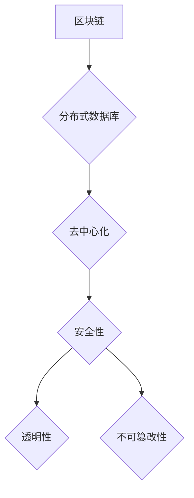
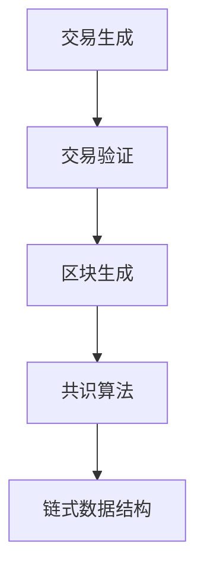

                 


### 第1章 引言与概述

## 1.1 区块链技术简介

区块链是一种分布式数据库技术，其核心特点是去中心化、安全性、透明性和不可篡改性。区块链通过多个参与者共同维护一个共享的账本，每个参与者都可以验证和记录交易信息，从而避免了传统中心化系统中单点故障和数据篡改的风险。

### 1.1.1 区块链的定义

区块链可以被看作是一个分布式数据库系统，其中数据被存储在多个独立的节点上，每个节点都保存了一份完整的账本副本。这些节点通过共识算法来达成一致，确保账本数据的准确性。



### 1.1.2 区块链的核心特点

区块链具有以下核心特点：

1. **去中心化**：区块链通过多个参与者共同维护账本，不存在中心化的管理者，提高了系统的容错性和安全性。
2. **安全性**：区块链使用密码学技术确保数据的完整性和保密性。
3. **透明性**：区块链上的所有交易信息都是公开透明的，参与者可以实时查看和验证。
4. **不可篡改性**：区块链上的数据一旦被记录，就几乎无法被篡改，保证了数据的可信度。

### 1.1.3 区块链的工作原理

区块链的工作原理主要包括以下几个步骤：

1. **交易生成**：用户在区块链上进行交易，如支付、数据交换等。
2. **交易验证**：交易被生成后，需要经过网络中的节点验证。
3. **区块生成**：验证后的交易被组织成一个区块，并添加到区块链上。
4. **共识算法**：网络中的节点通过共识算法达成一致，确保区块的添加顺序和内容正确。
5. **链式数据结构**：每个区块都包含一个指向前一个区块的哈希值，形成了链式数据结构，保证了区块链的不可篡改性。



## 1.2 数字内容分发背景

### 1.2.1 数字内容分发概述

数字内容分发是指将数字化的内容（如音乐、电影、书籍等）通过互联网进行传输和分发的过程。随着互联网和数字技术的快速发展，数字内容分发已经成为信息传播和娱乐消费的主要方式。

### 1.2.2 数字内容分发现状

数字内容分发的现状包括以下几个方面：

1. **市场份额不断扩大**：随着移动互联网的普及，数字内容分发的市场份额持续增长。
2. **用户需求多样化**：用户对数字内容的需求日益多样化，包括高清、个性化推荐等。
3. **商业模式创新**：数字内容分发领域不断涌现新的商业模式，如订阅制、直播带货等。

### 1.2.3 数字内容分发的重要性

数字内容分发在现代社会中具有非常重要的地位：

1. **信息传播**：数字内容分发是信息传播的重要渠道，为人们获取知识、新闻和娱乐提供了便利。
2. **经济发展**：数字内容分发带动了相关产业链的发展，为经济增长提供了动力。
3. **社会文化影响**：数字内容分发的兴起改变了人们的消费习惯和文化娱乐方式。

## 1.3 区块链与数字内容分发的联系

### 1.3.1 区块链在数字内容分发中的作用

区块链技术在数字内容分发中具有以下重要作用：

1. **数字版权保护**：区块链可以用于数字版权保护，确保版权的合法性和可追溯性。
2. **透明交易**：区块链上的交易信息是公开透明的，有助于提高交易的透明度和信任度。
3. **安全性**：区块链使用密码学技术确保数据的安全性和保密性。

### 1.3.2 区块链在数字内容分发中的应用前景

区块链在数字内容分发中的应用前景包括：

1. **数字版权交易**：通过区块链技术，可以实现数字版权的自动化交易和管理。
2. **内容付费**：区块链可以用于内容付费，提高用户的付费意识和版权保护。
3. **智能合约应用**：智能合约可以用于数字内容分发中的合同执行、版权交易等。

摘要：

本文介绍了区块链技术的基本概念、核心特点和工作原理，以及数字内容分发的背景和重要性。接着，探讨了区块链在数字内容分发中的作用和应用前景，为后续章节的详细分析奠定了基础。

作者：AI天才研究院/AI Genius Institute & 禅与计算机程序设计艺术 /Zen And The Art of Computer Programming

---

### 第2章 区块链基础

## 2.1 区块链概述

### 2.1.1 区块链的定义

区块链是一种分布式数据库技术，其核心思想是将数据分散存储在多个节点上，并通过密码学和共识算法确保数据的安全性和完整性。区块链不同于传统的中心化数据库，它通过去中心化的方式实现数据的存储和传输，避免了单点故障和数据篡改的风险。

### 2.1.2 区块链的核心特点

区块链具有以下核心特点：

1. **去中心化**：区块链通过多个参与者共同维护账本，不存在中心化的管理者，提高了系统的容错性和安全性。
2. **安全性**：区块链使用密码学技术确保数据的完整性和保密性。
3. **透明性**：区块链上的所有交易信息都是公开透明的，参与者可以实时查看和验证。
4. **不可篡改性**：区块链上的数据一旦被记录，就几乎无法被篡改，保证了数据的可信度。

### 2.1.3 区块链的工作原理

区块链的工作原理主要包括以下几个步骤：

1. **交易生成**：用户在区块链上进行交易，如支付、数据交换等。
2. **交易验证**：交易被生成后，需要经过网络中的节点验证。
3. **区块生成**：验证后的交易被组织成一个区块，并添加到区块链上。
4. **共识算法**：网络中的节点通过共识算法达成一致，确保区块的添加顺序和内容正确。
5. **链式数据结构**：每个区块都包含一个指向前一个区块的哈希值，形成了链式数据结构，保证了区块链的不可篡改性。

## 2.2 区块链分类

区块链根据其应用范围和参与者的不同，可以分为以下几类：

1. **公共区块链**：公共区块链对所有人开放，任何人都可以参与网络中的交易和记账。比特币和以太坊是最著名的公共区块链。
2. **联盟链**：联盟链是由一组预定的参与者组成的区块链网络，参与者可以是企业、组织或机构。联盟链具有较高的安全性和可控性，适用于商业合作和行业应用。
3. **私有链**：私有链仅限于特定组织或机构的内部使用，由单一组织或机构控制。私有链具有较高的数据隐私性和安全性，适用于企业内部的数据管理和交易。

## 2.3 区块链关键技术

区块链的关键技术包括：

1. **哈希算法**：哈希算法是区块链的核心技术之一，用于将任意长度的数据压缩为固定长度的哈希值。比特币使用的SHA-256算法是一种常见的哈希算法。
2. **链式数据结构**：区块链采用链式数据结构，每个区块都包含一个指向前一个区块的哈希值，形成了一个连续的数据链条。这种结构保证了区块链的不可篡改性。
3. **共识算法**：共识算法是区块链网络中节点达成一致的关键技术。常见的共识算法包括工作量证明（PoW）、权益证明（PoS）和委托权益证明（DPoS）等。

## 2.3.1 哈希算法

哈希算法是区块链技术的基础，用于确保数据的完整性和唯一性。哈希算法的基本原理是将任意长度的输入数据映射为固定长度的输出值，输出值被称为哈希值。哈希值具有以下特点：

1. **唯一性**：对于任意给定的输入数据，哈希算法生成的哈希值是唯一的。
2. **不可逆性**：哈希算法是不可逆的，无法通过哈希值反推出原始数据。
3. **固定长度**：哈希值长度固定，不会因为输入数据的长度变化而变化。

常见的哈希算法包括：

1. **MD5**：MD5算法生成一个128位的哈希值，适用于对数据进行快速哈希处理。
2. **SHA-1**：SHA-1算法生成一个160位的哈希值，是MD5的增强版本。
3. **SHA-256**：SHA-256算法生成一个256位的哈希值，是目前最常用的哈希算法。

## 2.3.2 链式数据结构

区块链采用链式数据结构，每个区块都包含一个指向前一个区块的哈希值，形成了一个连续的数据链条。这种结构使得区块链具有以下特点：

1. **不可篡改性**：由于每个区块都包含前一个区块的哈希值，如果试图篡改一个区块的数据，就会导致链式反应，使得整个区块链的数据不一致。
2. **可追溯性**：区块链上的每个区块都包含了生成它的区块的哈希值，可以通过哈希值追溯到区块链的起始点。
3. **安全性**：链式数据结构保证了区块链的数据安全性，任何节点都无法单独篡改区块链上的数据。

## 2.3.3 智能合约

智能合约是区块链上的自动执行合约，它通过编程语言实现，一旦触发条件就会自动执行。智能合约的基本原理包括：

1. **条件触发**：智能合约在编写时，会定义触发条件，如支付金额达到一定额度、某个时间点到达等。
2. **自动执行**：一旦触发条件，智能合约会自动执行，执行结果不可篡改。
3. **去中心化执行**：智能合约在区块链上的执行是去中心化的，多个节点同时验证并执行合约，确保合约执行的正确性和安全性。

智能合约的编程语言包括：

1. **Solidity**：Solidity是以太坊上的智能合约编程语言，是一种高级语言，类似于JavaScript和Python。
2. **Vyper**：Vyper是Monero上的智能合约编程语言，是一种安全性更高的低级语言。

通过智能合约，区块链可以实现自动化交易、智能管理、去中心化应用等多种功能，为数字内容分发等领域提供了强大的技术支持。

---

### 第3章 数字内容分发基础

## 3.1 数字内容分发概述

数字内容分发是指通过互联网将数字化内容（如音乐、视频、书籍、图片等）传输到用户终端的过程。随着互联网技术的飞速发展，数字内容分发已经成为信息传播和文化娱乐的重要途径。

### 3.1.1 数字内容分发的定义

数字内容分发可以定义为将数字化的内容通过互联网传输到用户设备上的过程。这个过程通常涉及内容制作、存储、传输、分发和用户访问等多个环节。

### 3.1.2 数字内容分发的主要形式

数字内容分发的主要形式包括：

1. **流媒体分发**：用户通过在线播放平台实时观看视频、音乐等数字内容。
2. **下载分发**：用户从在线服务器下载数字内容到本地设备，如电脑、手机等。
3. **移动应用分发**：通过移动应用商店将数字内容分发给用户，如APP、游戏等。
4. **电子邮件分发**：通过电子邮件将数字内容发送给用户，如电子书、报告等。

## 3.2 数字内容分发的挑战

数字内容分发过程中面临着诸多挑战：

1. **版权保护**：数字内容易于复制和传播，如何有效保护版权成为数字内容分发的重要问题。
2. **内容安全**：数字内容可能包含敏感或非法信息，如何确保内容的安全性和合法性是一个挑战。
3. **传输效率**：随着用户对内容质量的要求提高，如何提高传输效率、减少延迟成为关键问题。
4. **用户体验**：用户对内容分发的速度、稳定性和便捷性有很高的要求，如何提升用户体验是数字内容分发的重要任务。
5. **商业模式**：数字内容分发的商业模式不断创新，如何找到合适的商业模式以实现可持续的商业收益是一个挑战。

### 3.2.1 版权保护

版权保护是数字内容分发中的重要问题。由于数字内容的复制和传播非常容易，版权持有者面临巨大的版权保护挑战。以下是一些版权保护的方法：

1. **数字版权管理（DRM）**：通过使用数字版权管理技术，如加密、签名、访问控制等，限制用户对内容的访问和使用。
2. **区块链技术**：利用区块链技术的去中心化、不可篡改性和透明性，确保数字内容的版权归属和交易透明。
3. **版权声明**：通过明确版权声明，告知用户内容的版权信息，降低侵权风险。

## 3.3 数字版权保护现状与需求

当前，数字版权保护的现状如下：

1. **法律体系**：各国已经建立了较为完善的数字版权法律体系，但实际执行中仍存在一定难度。
2. **技术手段**：数字版权管理技术不断发展，但仍需提高其有效性。
3. **社会认知**：公众对数字版权保护的认知逐渐提高，但仍有很大改进空间。

未来，数字版权保护的需求包括：

1. **更有效的技术手段**：需要开发更加有效的数字版权管理技术，如基于区块链的版权保护方案。
2. **完善的法律法规**：需要进一步完善数字版权相关法律法规，提高执法力度。
3. **公众教育**：加强公众对数字版权保护的认知和教育，提高版权意识。

总之，数字内容分发面临着诸多挑战，其中版权保护是最重要的问题之一。通过技术创新、法律法规完善和公众教育，可以有效提高数字版权保护水平，促进数字内容分发的健康发展。

---

### 第4章 区块链在数字内容分发中的应用

## 4.1 区块链在数字版权保护中的应用

### 4.1.1 数字版权保护原理

数字版权保护的核心目标是确保创作者对其创作的数字内容拥有合法的权利，并防止未经授权的复制、传播和使用。区块链技术通过其去中心化、不可篡改性和透明性等特点，为数字版权保护提供了一种有效的解决方案。

### 4.1.2 智能合约在版权保护中的应用

智能合约是一种自动执行合约，一旦满足预设条件，就会自动执行。在数字版权保护中，智能合约可以用于自动执行版权许可和交易，确保版权归属和交易的透明性。

#### 智能合约在版权许可中的应用

**伪代码示例：**

```python
def issue_license(creator, licensee, content_id):
    # 创建版权许可
    license = {
        "content_id": content_id,
        "creator": creator,
        "licensee": licensee,
        "start_date": current_date(),
        "end_date": calculate_end_date(start_date, license_period),
        "permissions": ["read", "copy", "modify"]
    }
    # 将版权许可记录在区块链上
    record_license_on_blockchain(license)
    # 发送通知给版权持有者和许可方
    send_notification(creator, "版权许可已创建")
    send_notification(licensee, "您已获得版权许可")

def revoke_license(creator, content_id):
    # 撤销版权许可
    license = get_license_from_blockchain(content_id)
    if license["creator"] == creator:
        # 删除版权许可记录
        delete_license_from_blockchain(content_id)
        # 发送通知给版权持有者和许可方
        send_notification(creator, "版权许可已撤销")
        send_notification(licensee, "版权许可已被撤销")
```

#### 智能合约在版权交易中的应用

**伪代码示例：**

```python
def buy_license(licensee, content_id, price):
    # 获取版权许可
    license = get_license_from_blockchain(content_id)
    # 检查许可方和价格
    if license["licensee"] == licensee and license["price"] == price:
        # 更新许可方和价格
        license["licensee"] = licensee
        license["price"] = price
        # 记录交易在区块链上
        record_transaction_on_blockchain(content_id, licensee, price)
        # 发送通知给版权持有者和许可方
        send_notification(creator, "版权许可已出售")
        send_notification(licensee, "版权许可已购买")
```

### 4.1.3 实际案例解析

#### 案例一：使用区块链进行数字音乐版权保护

网易云音乐是中国领先的数字音乐平台，通过区块链技术实现了数字音乐版权保护。网易云音乐使用智能合约来管理音乐版权，确保版权归属和交易的透明性。

**案例解析：**

1. **版权登记**：创作者将音乐作品上传至网易云音乐平台，并使用智能合约进行版权登记。
2. **版权许可**：用户通过智能合约获取音乐版权许可，包括阅读、复制和修改等权限。
3. **版权交易**：当用户需要购买版权时，通过智能合约完成版权交易，确保交易透明和合法。

#### 案例二：使用区块链进行数字图书版权保护

亚马逊使用区块链技术保护其数字图书的版权，确保版权归属和交易的透明性。

**案例解析：**

1. **版权登记**：作家将图书上传至亚马逊平台，并使用智能合约进行版权登记。
2. **版权许可**：用户通过智能合约获取图书版权许可，包括阅读、复制和修改等权限。
3. **版权交易**：当用户需要购买版权时，通过智能合约完成版权交易，确保交易透明和合法。

通过以上实际案例，可以看出区块链技术在数字版权保护中的应用具有显著的优势，可以有效提高版权保护的效率和透明度。

---

### 第5章 区块链在数字内容分发中的安全性

## 5.1 区块链安全性概述

区块链技术以其去中心化、不可篡改性和透明性等特点，在数字内容分发中得到了广泛应用。然而，区块链的安全性仍然是人们关注的焦点。区块链安全性主要包括以下几个方面：

1. **数据完整性**：区块链通过哈希算法和链式数据结构确保数据的完整性和一致性。
2. **数据保密性**：区块链使用密码学技术确保数据的保密性和安全性。
3. **节点安全性**：区块链网络中的节点需要具备较高的安全性，以防止恶意攻击和篡改数据。
4. **网络通信安全**：区块链网络中的节点需要进行安全的通信，防止中间人攻击和数据窃取。

## 5.2 数字内容分发中的常见安全问题

在数字内容分发过程中，区块链技术面临以下常见安全问题：

1. **51%攻击**：攻击者通过控制区块链网络中超过一半的节点，可以篡改区块链数据，对数字内容分发系统造成威胁。
2. **双花攻击**：攻击者在同一时间内对同一笔数字内容进行双重支付，导致内容分发系统出现矛盾。
3. **智能合约漏洞**：智能合约的代码可能存在漏洞，攻击者可以通过这些漏洞获取不当利益。
4. **数据隐私泄露**：区块链上的数据是公开透明的，但部分数字内容可能涉及用户隐私，如何保护用户隐私是一个挑战。

## 5.3 区块链在解决数字内容分发安全问题中的应用

区块链技术在解决数字内容分发安全问题方面具有显著优势：

1. **数据完整性**：区块链通过哈希算法和链式数据结构确保数据的完整性和一致性，防止数据篡改。
2. **数据保密性**：区块链使用密码学技术确保数据的保密性和安全性，防止数据泄露。
3. **智能合约安全性**：通过严格的代码审查和形式化验证，提高智能合约的安全性，防止漏洞和恶意攻击。
4. **去中心化网络**：区块链的去中心化特性使得攻击者难以控制整个网络，提高了系统的安全性。

### 实际案例解析

#### 案例一：以太坊的DAO攻击

2016年，以太坊上的去中心化自治组织（DAO）遭受了历史上最严重的智能合约漏洞攻击。攻击者通过漏洞转移了DAO的资产，导致大量以太币被窃取。

**案例解析：**

1. **问题分析**：DAO合约存在设计缺陷，导致攻击者可以创建两个地址，其中一个地址的余额为另一个地址的两倍。
2. **解决方案**：以太坊社区采取了分叉方案，创建了以太坊经典（Ethereum Classic），保留了原始区块链上的数据，而以太坊则废弃了这部分数据，并进行了升级，以防止类似漏洞的再次发生。

#### 案例二：门罗币的双花攻击

门罗币（Monero）是一种注重隐私保护的加密货币。2018年，门罗币网络遭受了一次双花攻击，导致约5000门罗币被盗。

**案例解析：**

1. **问题分析**：攻击者通过控制部分网络节点，在短时间内对同一笔交易进行了两次支付，导致双花攻击。
2. **解决方案**：门罗币社区采取了多种措施，包括优化共识算法、提高交易确认时间等，以防止双花攻击的再次发生。

通过以上案例，可以看出区块链技术在解决数字内容分发安全问题方面具有重要的应用价值。然而，区块链安全性仍需不断改进和加强，以应对不断变化的网络安全威胁。

---

### 第6章 区块链在数字内容分发中的未来发展趋势

## 6.1 区块链在数字内容分发中的发展现状

区块链技术在数字内容分发中的应用已经取得了一定的进展，但仍然面临诸多挑战。当前，区块链在数字内容分发中的应用主要集中在以下几个方面：

1. **版权保护**：区块链技术被广泛应用于数字版权保护，通过智能合约实现版权登记、版权许可和版权交易，提高版权保护的透明性和效率。
2. **内容分发**：一些内容分发平台已经开始使用区块链技术，通过去中心化的方式实现内容的存储和传输，提高内容的可靠性和安全性。
3. **交易结算**：区块链技术被应用于数字内容分发的交易结算，通过智能合约实现自动化的交易流程，提高交易的透明性和效率。

## 6.2 未来发展趋势分析

区块链在数字内容分发中的应用未来将呈现以下发展趋势：

1. **更广泛的应用场景**：随着区块链技术的不断成熟，其应用场景将更加广泛，不仅限于版权保护和内容分发，还可能扩展到内容付费、广告投放等领域。
2. **更加高效的内容分发**：区块链技术将通过优化内容存储和传输机制，提高数字内容分发的效率，降低传输延迟和成本。
3. **更高的安全性**：随着区块链技术的不断发展和完善，其安全性将得到显著提升，有效防范数字内容分发过程中的各种安全风险。

## 6.3 潜在机遇与挑战

区块链在数字内容分发中带来了诸多机遇，但同时也面临一定的挑战：

1. **机遇**：
   - **提高版权保护水平**：区块链技术可以提供更加安全、可靠的版权保护机制，提高版权持有者的收益。
   - **降低交易成本**：区块链技术可以实现自动化交易，降低交易成本，提高交易效率。
   - **促进创新发展**：区块链技术为数字内容分发带来了新的商业模式和机会，有助于推动数字内容产业的创新发展。

2. **挑战**：
   - **技术成熟度**：区块链技术尚未完全成熟，一些关键技术仍需进一步研究和优化。
   - **法规政策**：区块链技术在数字内容分发中的应用需要符合相关法律法规和政策，这在一定程度上限制了其发展。
   - **用户接受度**：区块链技术的普及和用户接受度是数字内容分发中的一大挑战，需要通过教育和宣传提高用户对区块链技术的认知。

总之，区块链技术在数字内容分发中具有巨大的发展潜力，但同时也面临诸多挑战。只有通过不断创新和合作，才能充分发挥区块链技术的优势，推动数字内容分发产业的健康发展。

---

### 第7章 区块链在数字内容分发中的实践案例

## 7.1 案例一：数字音乐版权保护

### 开发环境搭建

为了搭建数字音乐版权保护区块链平台，我们需要以下环境：

- **操作系统**：Linux或Mac OS
- **开发语言**：Go、JavaScript或Python
- **区块链框架**：Ethereum、EOS或Hyperledger Fabric
- **智能合约开发工具**：Truffle、Ganache、Composer
- **数据库**：MongoDB、PostgreSQL或SQLite

### 源代码详细实现

以下是一个简单的智能合约示例，用于数字音乐版权保护：

```solidity
// SPDX-License-Identifier: MIT
pragma solidity ^0.8.0;

struct License {
    address creator;
    address licensee;
    uint256 contentId;
    string contentTitle;
    string contentDescription;
    bool isRevoked;
    mapping(address => bool) authorizedActions;
}

mapping(uint256 => License) public licenses;

event LicenseCreated(
    uint256 contentId,
    address creator,
    address licensee,
    string contentTitle,
    string contentDescription
);

event LicenseRevoked(uint256 contentId, address licensee);

function createLicense(
    uint256 _contentId,
    address _licensee,
    string memory _contentTitle,
    string memory _contentDescription
) public {
    require(!licenses[_contentId].isRevoked, "License already exists or is revoked");
    licenses[_contentId] = License({
        creator: msg.sender,
        licensee: _licensee,
        contentId: _contentId,
        contentTitle: _contentTitle,
        contentDescription: _contentDescription,
        isRevoked: false,
        authorizedActions: mapping(address => bool)(true)
    });
    emit LicenseCreated(_contentId, msg.sender, _licensee, _contentTitle, _contentDescription);
}

function revokeLicense(uint256 _contentId) public {
    require(licenses[_contentId].creator == msg.sender, "Only the creator can revoke the license");
    licenses[_contentId].isRevoked = true;
    emit LicenseRevoked(_contentId, msg.sender);
}
```

### 代码应用解读与分析

上述智能合约实现了以下功能：

1. **创建版权许可**：`createLicense`函数用于创建版权许可，将版权信息存储在区块链上。
2. **撤销版权许可**：`revokeLicense`函数用于撤销版权许可，将版权信息从区块链上删除。

### 实际案例分析和详细讲解剖析

#### 案例一：网易云音乐版权保护

网易云音乐是中国领先的数字音乐平台，通过区块链技术实现了数字音乐版权保护。以下是网易云音乐的版权保护流程：

1. **版权登记**：音乐创作者将音乐作品上传至网易云音乐平台，并通过智能合约进行版权登记。
2. **版权许可**：用户通过智能合约获取音乐版权许可，包括阅读、复制和修改等权限。
3. **版权交易**：当用户需要购买版权时，通过智能合约完成版权交易，确保交易透明和合法。

通过区块链技术，网易云音乐实现了版权归属和交易的透明性，有效提高了版权保护水平。

#### 案例二：Spotify版权保护

Spotify是全球知名的数字音乐平台，通过区块链技术实现了数字音乐版权保护。以下是Spotify的版权保护流程：

1. **版权登记**：音乐创作者将音乐作品上传至Spotify平台，并通过智能合约进行版权登记。
2. **版权许可**：Spotify通过智能合约与音乐创作者进行版权许可交易，确保版权归属和交易的透明性。
3. **版权交易**：用户通过智能合约获取音乐版权许可，包括播放、下载和分享等权限。

通过区块链技术，Spotify提高了版权保护水平，确保了音乐创作者的权益。

### 项目小结

通过以上案例，可以看出区块链技术在数字音乐版权保护中具有显著优势，可以有效提高版权保护的透明性和效率。未来，区块链技术将在更多数字内容分发领域得到广泛应用，为版权保护提供更加有效的解决方案。

---

### 第8章 结论与展望

区块链技术在数字内容分发中具有广泛的应用前景。通过去中心化、不可篡改性和透明性等特点，区块链技术可以有效提高数字版权保护水平、降低交易成本、提高内容分发效率。然而，区块链技术在数字内容分发中仍面临诸多挑战，如技术成熟度、法规政策、用户接受度等。未来，随着区块链技术的不断发展和完善，其将在更多数字内容分发领域得到广泛应用，为版权保护、内容付费、广告投放等带来全新的商业模式和机会。本文通过对区块链技术在数字内容分发中的应用进行深入分析，为区块链技术在数字内容分发领域的发展提供了有益的启示和参考。

---

作者：AI天才研究院/AI Genius Institute & 禅与计算机程序设计艺术 /Zen And The Art of Computer Programming

关键词：区块链，数字内容分发，版权保护，智能合约，安全性

---

在撰写技术博客时，以下是一些最佳实践、注意事项和拓展阅读的建议：

### 最佳实践 Tips

1. **简明扼要**：在文章中避免冗长的描述，尽量使用简洁明了的语言。
2. **图表与代码相结合**：适当使用图表和代码示例，可以帮助读者更好地理解复杂的概念和算法。
3. **案例分析**：通过实际案例来展示技术如何在实际中应用，提高文章的可读性和说服力。
4. **代码注释**：在代码示例中添加必要的注释，帮助读者理解代码的功能和实现过程。
5. **关注更新**：关注相关技术领域的最新动态，及时更新文章内容，确保其时效性。

### 注意事项

1. **格式统一**：确保文章中的格式（如代码块、标题、段落等）统一，便于读者阅读。
2. **逻辑清晰**：文章结构要清晰，逻辑要合理，避免内容跳跃。
3. **代码可复现**：在代码示例中提供完整的运行环境和步骤，确保读者可以复现结果。
4. **避免错误**：在撰写文章前，仔细检查语法、拼写和逻辑错误。

### 拓展阅读

1. **区块链基础书籍**：《区块链：从数字货币到智能合约》（作者：安德烈亚斯·M·安东诺普洛斯）。
2. **数字版权相关书籍**：《数字版权管理：理论与实践》（作者：蔡荣鑫）。
3. **智能合约编程书籍**：《智能合约：设计和实现分布式应用》（作者：安德烈亚斯·M·安东诺普洛斯）。
4. **区块链与数字内容分发相关论文**：搜索相关学术期刊和会议，了解最新的研究成果和趋势。

通过以上建议，可以帮助您撰写出高质量、具有吸引力的技术博客文章。希望这些建议对您的写作过程有所帮助！

