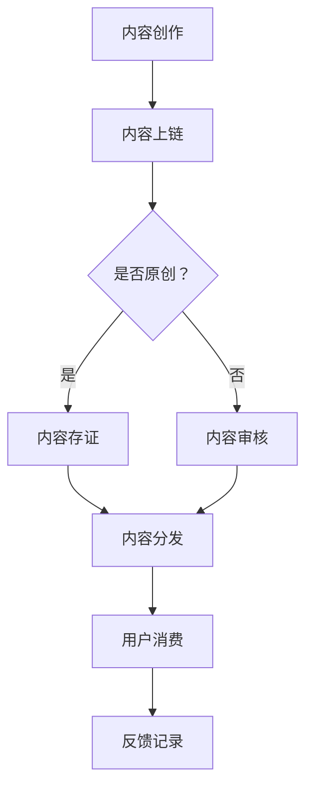

                 

### 文章标题

《区块链在数字内容分发中的应用：保护创作者版权》

区块链技术近年来迅速发展，其去中心化、不可篡改的特性使其在多个领域得到了广泛应用。特别是在数字内容分发领域，区块链技术通过提供一种全新的版权保护机制，有效解决了传统版权保护中的诸多问题。本文将深入探讨区块链在数字内容分发中的应用，特别是如何利用区块链技术来保护创作者的版权。

### 文章关键词

- 区块链
- 数字内容分发
- 版权保护
- 智能合约
- 非同质化代币（NFT）

### 摘要

本文旨在探讨区块链技术在数字内容分发中的应用，特别是其对创作者版权保护的贡献。通过介绍区块链的基本原理、数字内容分发的现状以及版权保护的挑战，本文将详细阐述区块链在版权保护中的核心概念与联系，通过Mermaid流程图展示其原理架构。接着，本文将深入讲解区块链的核心算法原理，包括加密算法和哈希函数，并使用伪代码详细阐述智能合约的实现。然后，本文将探讨非同质化代币（NFT）在版权保护中的应用，以及如何通过NFT实现数字内容的唯一性和可追溯性。此外，本文将介绍如何搭建一个区块链内容分发平台，并详细分析版权保护措施的实施与案例分析。最后，本文将对区块链在版权保护领域的未来发展趋势和挑战进行展望，并提供一些最佳实践建议。

## 引言与核心概念

### 数字内容分发的现状

随着互联网的普及和数字技术的发展，数字内容分发已经成为了现代传媒的重要组成部分。数字内容分发指的是通过网络渠道将文字、图片、音频、视频等各种形式的内容传递给用户的过程。这一过程包括了内容创作、存储、传输、分发和消费等多个环节。近年来，数字内容分发市场呈现出爆发式增长，用户对于高质量、个性化内容的追求不断提高，这为数字内容分发带来了巨大的机遇。

然而，数字内容分发也面临着诸多挑战。首先，内容的版权保护问题日益凸显。由于数字内容的复制和传播成本极低，创作者的作品容易被未经授权的第三方复制和分发，导致创作者的权益受到侵害。其次，传统的版权保护机制往往依赖于中心化的第三方机构，如版权登记局和内容分发平台，这些机制不仅效率低下，而且存在信息泄露和篡改的风险。此外，数字内容分发的产业链复杂，涉及到创作者、内容平台、分发渠道、消费者等多个环节，如何协调各方利益，确保内容创作者的权益得到有效保护，也是一个亟待解决的问题。

### 区块链与数字内容分发

区块链技术作为一种去中心化、分布式账本技术，具有数据不可篡改、透明度高、安全性强等特点，这些特性使其在数字内容分发领域具有巨大的应用潜力。首先，区块链技术能够提供一种新型的版权保护机制，通过去中心化的方式，使得版权信息在多个节点之间共享和验证，从而提高了版权保护的效率和安全性。其次，区块链技术能够实现对数字内容的全生命周期管理，从内容创作、存储、传输、分发到消费，每个环节都可以通过区块链进行记录和监控，确保内容的安全性和可追溯性。

### 版权保护的挑战

尽管区块链技术在版权保护方面具有诸多优势，但在实际应用中仍面临着一些挑战。首先，区块链技术的复杂性和技术门槛较高，对于许多内容创作者和分发平台来说，如何有效地利用区块链技术来实现版权保护仍是一个难题。其次，区块链技术中的智能合约虽然能够自动执行版权保护规则，但其实现和部署也需要一定的技术支持和成本投入。此外，区块链技术中的非同质化代币（NFT）虽然在版权保护方面具有潜力，但其应用场景和商业模式仍在探索中，如何有效地将NFT与版权保护相结合，仍需要进一步研究和实践。

### 核心概念与联系

为了更好地理解区块链在数字内容分发中的应用，我们需要明确几个核心概念及其之间的联系。

#### 区块链的基本概念

区块链是一种分布式数据库技术，由一系列按时间顺序排列的“区块”组成，每个区块包含一定数量的交易记录。这些区块通过加密算法和哈希函数相互链接，形成一个不可篡改的分布式账本。区块链的去中心化特性使得其具有较高的安全性和透明度，任何参与节点都可以验证和记录交易，从而避免了中心化系统中的单点故障和信息泄露风险。

#### 数字内容分发的概念

数字内容分发指的是通过网络渠道将数字形式的文字、图片、音频、视频等内容传递给用户的过程。这个过程涉及到内容创作、存储、传输、分发和消费等多个环节。传统的数字内容分发模式依赖于中心化的内容平台和第三方机构，这些模式在效率和安全性方面存在一定的局限性。

#### 版权保护的概念

版权保护是指通过法律、技术、经济等手段，保护创作者对其原创作品的权益，防止未经授权的复制、传播和使用。在数字内容分发领域，版权保护尤为重要，因为数字内容的复制和传播成本极低，创作者的权益容易受到侵害。

#### 区块链与数字内容分发、版权保护的联系

区块链技术通过其去中心化、不可篡改和透明度高等特性，为数字内容分发和版权保护提供了一种全新的解决方案。首先，区块链技术可以实现对数字内容的全生命周期管理，从内容创作、存储、传输、分发到消费，每个环节都可以通过区块链进行记录和监控，确保内容的安全性和可追溯性。其次，区块链技术可以通过智能合约自动执行版权保护规则，确保创作者的权益得到有效保护。此外，非同质化代币（NFT）的出现，为数字内容的唯一性和可追溯性提供了新的实现方式。

### Mermaid流程图展示

下面是区块链在数字内容分发和版权保护中的原理架构的Mermaid流程图：



#### 背景介绍

区块链技术的起源可以追溯到2008年，当时一位名为中本聪（Satoshi Nakamoto）的匿名人物发布了比特币白皮书，提出了一个去中心化的电子现金系统——比特币。比特币的核心理念是基于区块链技术，通过分布式账本和加密算法实现货币的交易和存储，从而避免了传统金融系统中中介机构的介入。这一创新性的概念引起了广泛关注，并迅速推动了区块链技术的发展。

区块链技术的核心在于去中心化和不可篡改的特性。传统的中心化系统依赖于单一的中央服务器来管理和记录数据，这使得系统存在单点故障和信息泄露的风险。而区块链技术通过分布式账本和共识算法，使得数据记录分布在多个节点上，任何节点都无法单独篡改数据，从而提高了系统的安全性和透明度。

在数字内容分发领域，区块链技术的应用潜力逐渐显现。传统的数字内容分发模式依赖于中心化的内容平台和第三方机构，这些模式在效率和安全性方面存在一定的局限性。而区块链技术通过去中心化的方式，可以实现对数字内容的全生命周期管理，从内容创作、存储、传输、分发到消费，每个环节都可以通过区块链进行记录和监控，确保内容的安全性和可追溯性。

#### 核心概念与联系

为了更好地理解区块链在数字内容分发中的应用，我们需要明确几个核心概念及其之间的联系。

1. **区块链的基本概念**：区块链是一种分布式数据库技术，由一系列按时间顺序排列的“区块”组成，每个区块包含一定数量的交易记录。这些区块通过加密算法和哈希函数相互链接，形成一个不可篡改的分布式账本。

2. **数字内容分发的概念**：数字内容分发指的是通过网络渠道将数字形式的文字、图片、音频、视频等内容传递给用户的过程。这个过程涉及到内容创作、存储、传输、分发和消费等多个环节。

3. **版权保护的概念**：版权保护是指通过法律、技术、经济等手段，保护创作者对其原创作品的权益，防止未经授权的复制、传播和使用。

4. **区块链与数字内容分发、版权保护的联系**：区块链技术通过其去中心化、不可篡改和透明度高等特性，为数字内容分发和版权保护提供了一种全新的解决方案。区块链技术可以实现对数字内容的全生命周期管理，从内容创作、存储、传输、分发到消费，每个环节都可以通过区块链进行记录和监控，确保内容的安全性和可追溯性。此外，区块链技术可以通过智能合约自动执行版权保护规则，确保创作者的权益得到有效保护。

### 区块链在数字内容分发中的应用

区块链技术通过其独特的分布式账本、智能合约和加密算法，在数字内容分发领域展现出了显著的优势。下面将详细探讨区块链在数字内容分发中的几个关键应用场景。

#### 全生命周期管理

数字内容从创作到消费的过程中，经历了多个环节，包括创作、存储、传输、分发和消费。区块链技术能够为这些环节提供透明、可追溯和不可篡改的记录。

1. **创作**：创作者在创作数字内容时，可以将内容上链，记录创作时间、创作人等信息。这一步骤可以通过智能合约自动完成，确保内容的原创性。

2. **存储**：区块链作为分布式账本，可以存储大量的内容信息。内容存储在区块链上，不仅保证了数据的持久性，还防止了单点故障的风险。

3. **传输**：在内容传输过程中，区块链技术可以提供一种安全、高效的传输方式。由于区块链的加密特性，传输过程中的数据加密传输，确保了数据在传输过程中的安全性。

4. **分发**：区块链技术可以用于内容分发网络的管理。内容分发平台可以通过智能合约自动执行分发规则，确保内容的分发过程符合创作者的授权。

5. **消费**：在内容消费环节，用户可以验证内容的版权和真实性，确保所消费的内容是合法的。区块链的透明性使得用户可以轻松地追溯内容来源和分发历史。

#### 版权保护

版权保护是数字内容分发中至关重要的一环。区块链技术通过其不可篡改和透明度特性，为版权保护提供了一种新的解决方案。

1. **版权登记**：创作者可以将版权信息上链，进行版权登记。这一步骤可以通过智能合约自动完成，确保版权信息的真实性和不可篡改性。

2. **授权管理**：通过智能合约，创作者可以设定版权的授权规则，明确内容的授权范围和期限。智能合约的执行确保了授权过程的透明和公正。

3. **侵权检测**：区块链技术可以用于侵权检测。系统可以监控内容在区块链上的分布情况，一旦发现侵权行为，可以迅速定位侵权源头并采取相应措施。

4. **收益分配**：通过区块链技术，创作者可以直接从内容消费中获得收益。智能合约可以实现自动化的收益分配，确保创作者的权益得到公平、合理的保障。

#### 非同质化代币（NFT）的应用

非同质化代币（NFT）为数字内容分发提供了新的维度。NFT是一种代表唯一数字资产或权利的区块链代币，可以用于验证数字内容的唯一性和所有权。

1. **唯一性验证**：NFT可以为数字内容提供唯一标识，确保每一份内容都是独一无二的。这适用于艺术品、音乐、视频等多种形式的数字内容。

2. **所有权证明**：通过NFT，创作者和买家可以证明对数字内容的所有权。NFT的透明性使得所有权转移过程更加可信和可追溯。

3. **增值潜力**：一些独特的数字内容，如限量版艺术品或稀有音乐作品，可以通过NFT实现增值。NFT的稀缺性使得这些内容具有更高的市场价值。

#### 智能合约的应用

智能合约是区块链技术中的重要组成部分，可以在数字内容分发中发挥关键作用。

1. **自动化执行**：智能合约可以自动执行版权保护规则，如授权、收益分配等。这一自动化过程提高了效率，减少了人工干预的风险。

2. **透明度**：智能合约的执行过程是透明和可验证的。任何参与方都可以查看和验证智能合约的执行情况，确保流程的公正性和透明度。

3. **降低成本**：由于智能合约的自动化特性，可以降低内容分发和版权保护中的运营成本。

### 总结

区块链技术在数字内容分发中的应用，为创作者提供了一个更安全、高效和透明的版权保护机制。通过全生命周期管理、NFT和智能合约等技术，区块链不仅保护了创作者的权益，还提升了数字内容分发的整体效率和质量。未来，随着区块链技术的不断成熟和普及，我们可以期待其在数字内容分发领域发挥更加重要的作用。

#### 核心算法原理讲解

在探讨区块链在数字内容分发中的应用时，理解区块链技术背后的核心算法原理是至关重要的。这些算法不仅构成了区块链技术的基础，还确保了其安全性和可信度。以下是区块链技术中的几个关键算法：加密算法和哈希函数。

#### 加密算法

加密算法是区块链技术中的核心组成部分，用于确保数据在区块链上的传输和存储过程中的安全性。加密算法通过将数据转换为密文，只有持有相应密钥的用户才能解密和读取原始数据。区块链技术通常使用对称加密和非对称加密两种类型的加密算法。

1. **对称加密**：对称加密算法使用相同的密钥进行加密和解密。常见的对称加密算法包括AES（高级加密标准）和DES（数据加密标准）。对称加密算法的优点是加密和解密速度快，但在区块链应用中，由于需要确保多个节点之间的数据一致性，对称加密的密钥分发和管理复杂度较高。

2. **非对称加密**：非对称加密算法使用一对密钥，即公钥和私钥。公钥用于加密，私钥用于解密。常见的非对称加密算法包括RSA（RSA算法）和ECC（椭圆曲线加密算法）。非对称加密算法的优点是密钥管理简单，适合于区块链中的分布式网络环境。

在区块链中，非对称加密算法通常用于以下场景：

- **交易验证**：在区块链交易中，发送方使用私钥对交易信息进行签名，接收方使用公钥验证签名的真实性，确保交易的安全性和不可篡改性。
- **智能合约执行**：智能合约在执行过程中，需要确保只有授权的参与者可以调用合约功能。非对称加密算法可以用于实现这一功能，通过私钥授权来控制合约的执行。

#### 哈希函数

哈希函数是区块链技术中的另一个关键算法，用于确保数据的完整性和不可篡改性。哈希函数将任意长度的输入数据映射为固定长度的输出数据（即哈希值）。一个重要的特性是，对于相同的输入，哈希函数总是产生相同的输出，而对于不同的输入，哈希值则具有极高的差异度。

在区块链中，哈希函数的主要应用包括：

1. **数据完整性验证**：在区块链中，每个区块都包含前一个区块的哈希值，从而形成了一种链式结构。这种结构确保了区块链中任何数据修改都会导致链的破坏，因为修改一个区块的数据将导致后续所有区块的哈希值发生变化。

2. **地址生成**：在区块链中，用户的地址是通过哈希函数生成的。用户公钥通过哈希函数处理后，生成一个地址，用于接收和发送交易。

3. **数字签名**：哈希函数在数字签名中扮演重要角色。在数字签名过程中，发送方将数据的哈希值与私钥结合，生成数字签名。接收方使用发送方的公钥验证签名，确保数据的完整性和真实性。

#### 智能合约的实现

智能合约是区块链技术中实现自动化执行的关键组件。它是一种在区块链上运行的程序，能够自动执行合约条款，只要满足预设的条件，无需人工干预。智能合约的实现通常涉及以下步骤：

1. **定义合约条款**：首先，需要明确智能合约要实现的功能，包括输入条件、执行逻辑和输出结果。这些条款通常使用编程语言（如Solidity）进行编写。

2. **编写合约代码**：使用智能合约编程语言编写合约代码，实现合约条款的功能。以下是一个简单的智能合约示例（使用Solidity语言）：

    ```solidity
    contract ContentRights {
        mapping (address => mapping (uint => bool)) public rights;

        function grantRights(uint contentID, bool hasRights) public {
            rights[msg.sender][contentID] = hasRights;
        }

        function verifyRights(uint contentID) public view returns (bool) {
            return rights[msg.sender][contentID];
        }
    }
    ```

3. **部署合约**：将编写好的智能合约部署到区块链上。部署过程中，合约代码和初始状态会被永久记录在区块链上，合约即可开始执行。

4. **合约调用**：用户可以通过发送交易调用智能合约的功能。合约在接收到交易后，根据合约代码自动执行相应的逻辑，并返回执行结果。

#### 数学模型和公式

在区块链技术中，数学模型和公式用于确保数据的安全性和一致性。以下是一些关键数学概念和公式：

1. **哈希函数**：哈希函数通常采用MD5、SHA-256等算法。以下是一个简单的SHA-256哈希计算的伪代码示例：

    ```python
    def sha256_hash(input_data):
        hash_object = hashlib.sha256(input_data.encode())
        hex_dig = hash_object.hexdigest()
        return hex_dig
    ```

2. **数字签名**：在数字签名中，一个常见的公式是：

    ```math
    S = (k * r) ^ d \mod n
    ```

    其中，\(S\) 是签名，\(k\) 是随机数，\(r\) 是哈希值，\(d\) 是私钥，\(n\) 是公钥模数。

通过上述算法和公式的讲解，我们可以更好地理解区块链在数字内容分发中的应用原理。这些算法和公式不仅确保了区块链的安全性和可信度，还为创作者提供了强有力的版权保护手段。

#### 非同质化代币（NFT）在版权保护中的应用

非同质化代币（NFT）是区块链技术中的一种创新性应用，通过为数字内容提供独特的所有权证明，NFT在版权保护中发挥着重要作用。以下将详细探讨NFT在版权保护中的应用，包括NFT的基本概念、数字内容的唯一性和可追溯性，以及NFT发行与交易的过程。

#### NFT的基本概念

NFT（Non-Fungible Token）即非同质化代币，与比特币等加密货币不同，NFT代表的是独特、不可互换的数字资产。每个NFT都具有独特的属性和所有权信息，可以代表艺术品、音乐、视频、数字收藏品等。NFT的独特性使其在数字版权保护中具有显著的优势，因为每个NFT都对应一个唯一的数字内容，从而保证了内容的唯一性和真实性。

#### 数字内容的唯一性和可追溯性

1. **唯一性**：NFT为数字内容提供了一个唯一的标识符，确保每一份数字内容都是独一无二的。这意味着，即使是相同的数字文件，通过NFT也可以区分其不同的所有权。例如，一个数字艺术家可以创建一个独特的数字艺术品，并发行一个对应的NFT，从而证明该艺术品的所有权。

2. **可追溯性**：NFT的区块链特性确保了数字内容在发行、交易和使用过程中的透明和可追溯。每个NFT的创建、转移和交易记录都被永久记录在区块链上，任何用户都可以查看和验证这些信息。这为版权保护提供了强有力的支持，使得创作者可以追踪其作品的流向，及时发现和防止侵权行为。

#### NFT发行与交易的过程

1. **NFT发行**：创作者通过创建一个数字内容，并将其与一个NFT绑定，从而实现数字内容的唯一性。这个过程通常涉及以下步骤：

    - **内容上链**：创作者将数字内容上传到区块链平台，平台会将内容存储在区块链上。
    - **创建NFT**：平台生成一个NFT，并将其与数字内容绑定。NFT通常包含内容的哈希值、创作者信息、发行时间等元数据。
    - **注册NFT**：平台将NFT注册到区块链上，使其成为可交易的资产。

2. **NFT交易**：一旦NFT被发行，就可以在区块链上进行交易。以下是一个简化的NFT交易流程：

    - **购买NFT**：买家通过区块链平台购买NFT，支付相应的加密货币。
    - **所有权转移**：平台通过智能合约自动执行交易，将NFT的所有权从卖家转移给买家。这一过程会记录在区块链上，确保所有权转移的真实性。
    - **验证所有权**：买家可以通过查看区块链上的交易记录，验证其对NFT的所有权。

3. **NFT增值潜力**：NFT的稀缺性使得一些独特的数字内容具有显著的增值潜力。例如，一些限量版艺术品或稀有音乐作品可以通过NFT实现溢价。这种增值潜力不仅激励了创作者，也为投资者提供了新的机会。

#### 案例分析

以下是一个NFT在版权保护中的实际案例：

**案例背景**：一位数字艺术家创作了一幅数字画作，并将其以NFT的形式发行。NFT包含了画作的元数据，如创作者信息、创作时间和作品描述。

**案例过程**：

- **发行NFT**：艺术家在区块链平台上创建NFT，并将其与画作绑定。
- **验证原创性**：潜在买家可以通过查看NFT的元数据和区块链上的交易记录，验证画作的原创性和真实性。
- **购买NFT**：一位买家通过平台购买NFT，支付相应的加密货币。
- **所有权转移**：平台通过智能合约自动执行交易，将NFT的所有权转移给买家。
- **增值潜力**：由于画作和NFT的独特性，随着时间推移，画作和NFT的价值可能持续增长。

通过这个案例，我们可以看到NFT在版权保护中的应用不仅保护了创作者的权益，还为数字内容的交易提供了透明和可追溯的机制。

#### 总结

非同质化代币（NFT）在数字版权保护中的应用，通过为数字内容提供唯一性和可追溯性，解决了传统版权保护中的诸多难题。NFT的发行和交易过程不仅保护了创作者的权益，也为投资者提供了新的增值机会。随着区块链技术的不断发展和普及，NFT在数字版权保护中的应用前景将更加广阔。

### 区块链内容分发平台的搭建

搭建一个区块链内容分发平台，是实现数字内容高效管理和版权保护的关键步骤。以下将详细探讨开发环境搭建、源代码实现、代码解读和代码应用分析，并结合实际案例进行详细讲解。

#### 开发环境搭建

搭建区块链内容分发平台，首先需要选择合适的技术栈和开发环境。以下是搭建平台所需的主要工具和库：

1. **区块链平台**：可以选择Ethereum、Binance Smart Chain或Solana等主流区块链平台。Ethereum是目前最成熟和广泛使用的区块链平台，支持智能合约的开发和部署。
2. **开发语言**：智能合约通常使用Solidity语言编写。Solidity是一种面向合约的高级编程语言，易于理解和使用。
3. **开发框架**：可以使用Truffle、Hardhat等开发框架来简化智能合约的开发和测试过程。
4. **前端框架**：可以选择React、Vue或Angular等前端框架来搭建用户界面。
5. **区块链节点**：需要搭建一个私有区块链节点，用于测试和部署智能合约。

#### 源代码实现

以下是搭建区块链内容分发平台所需的主要源代码模块：

1. **智能合约**：编写用于内容管理和版权保护的智能合约，包括内容登记、授权管理和收益分配等。
2. **前端应用**：编写用于用户交互的前端应用，包括用户注册、登录、上传内容、查看内容和使用NFT等。
3. **后端服务**：编写用于处理用户请求和与区块链交互的后端服务，包括用户管理、内容管理和NFT交易管理等。

以下是一个简单的智能合约示例（使用Solidity语言）：

```solidity
// SPDX-License-Identifier: MIT
pragma solidity ^0.8.0;

contract ContentDistribution {
    mapping(uint => Content) public contents;
    mapping(address => mapping(uint => bool)) public authorizations;

    struct Content {
        uint id;
        string title;
        string author;
        string contentHash;
        bool isPublished;
    }

    function createContent(uint contentId, string memory title, string memory author, string memory contentHash) public {
        require(!isContentExist(contentId), "Content already exists");
        contents[contentId] = Content(contentId, title, author, contentHash, false);
    }

    function publishContent(uint contentId) public {
        require(isContentExist(contentId), "Content does not exist");
        Content storage content = contents[contentId];
        require(!content.isPublished, "Content is already published");
        content.isPublished = true;
    }

    function authorize(address authorizer, uint contentId) public {
        require(isContentExist(contentId), "Content does not exist");
        authorizations[authorizer][contentId] = true;
    }

    function revokeAuthorization(address authorizer, uint contentId) public {
        require(isContentExist(contentId), "Content does not exist");
        authorizations[authorizer][contentId] = false;
    }

    function isContentExist(uint contentId) public view returns (bool) {
        return contents[contentId].id != 0;
    }
}
```

#### 代码解读

上述智能合约实现了以下功能：

- **内容创建**：通过`createContent`函数，创作者可以创建数字内容，并将内容信息（如标题、作者和内容哈希值）上链。
- **内容发布**：通过`publishContent`函数，创作者可以将内容发布，使其可供用户查看。
- **授权管理**：通过`authorize`和`revokeAuthorization`函数，创作者可以授权其他用户对内容的访问权限。

#### 代码应用分析

在实际应用中，智能合约将用于管理内容分发平台的各个方面，包括：

1. **内容登记**：创作者可以通过智能合约将新内容登记上链，确保内容的唯一性和可追溯性。
2. **授权管理**：创作者可以通过智能合约对用户进行授权，允许用户访问和消费内容。
3. **收益分配**：通过智能合约，创作者可以设定内容的收益分配规则，确保用户支付的费用能公平地分配给创作者和其他参与者。

#### 实际案例

以下是一个实际案例，展示如何使用区块链内容分发平台进行数字内容的发布和版权保护：

**案例背景**：一位作家创作了一本电子书，并希望利用区块链技术进行版权保护和内容分发。

**案例过程**：

1. **内容登记**：作家使用智能合约将电子书的内容信息（如书名、作者和内容哈希值）上链，创建一个对应的NFT。
2. **内容发布**：作家通过智能合约将电子书发布，使其可供用户查看和购买。
3. **授权管理**：作家可以授权某些用户对电子书进行访问，例如将电子书发送给朋友或合作伙伴。
4. **收益分配**：当用户购买电子书时，智能合约会自动将支付金额分配给作家和其他授权参与者。

通过这个案例，我们可以看到区块链内容分发平台如何有效地实现数字内容的版权保护和高效分发。

#### 项目小结

搭建区块链内容分发平台是一个复杂的过程，涉及到多个技术模块的协同工作。通过智能合约、NFT和区块链技术的应用，平台能够提供高效、透明和安全的数字内容管理机制，保护创作者的权益。未来，随着区块链技术的不断成熟，我们可以期待更多创新应用在数字内容分发领域的实现。

#### 版权保护措施实现与案例分析

在区块链内容分发平台中，实施有效的版权保护措施是确保创作者权益的重要环节。以下将详细探讨几种常见的版权保护措施，结合实际案例进行分析，并总结其实施效果和适用性。

### 智能合约的版权保护措施

智能合约是区块链内容分发平台的核心组成部分，能够通过编程逻辑自动执行版权保护规则。以下是几种常见的智能合约版权保护措施：

1. **内容加密与访问控制**：
   - **实现方法**：智能合约可以对上传的内容进行加密，并设置访问权限。例如，只有授权用户才能解密和查看内容。
   - **案例分析**：在一个基于Ethereum的电子书分发平台中，智能合约使用AES加密算法对电子书内容进行加密，只有支付一定费用并获得授权的用户才能解密阅读。
   - **效果**：这种措施有效防止了未经授权的用户访问和复制内容，但加密和解密过程可能增加用户的使用难度。
   - **适用性**：适用于对内容安全性要求较高的场景，如付费电子书和保密文件。

2. **版权登记与认证**：
   - **实现方法**：创作者可以通过智能合约在区块链上登记其版权信息，包括创作时间、创作者身份和版权证明等。
   - **案例分析**：一位艺术家通过智能合约将一幅数字画作及其版权信息上链，永久记录在区块链上。
   - **效果**：这种措施为创作者提供了可信的版权证明，方便在侵权发生时进行法律维权。
   - **适用性**：适用于所有需要版权保护的作品，如文学、艺术作品和原创视频。

3. **收益分配自动化**：
   - **实现方法**：智能合约可以根据预先设定的规则自动分配内容收益给创作者和其他参与者。
   - **案例分析**：在一个音乐分发平台中，智能合约将每个用户支付的购买费用按照创作者、平台和其他参与者的比例进行自动分配。
   - **效果**：这种措施确保了创作者能够公平地获得其作品所带来的收益，减少了人工干预和分配不公。
   - **适用性**：适用于所有涉及内容收益分配的场景，如音乐、电子书和视频。

### 基于NFT的版权保护措施

非同质化代币（NFT）在版权保护中具有独特的优势，能够提供内容的唯一性和可追溯性。

1. **NFT唯一性验证**：
   - **实现方法**：创作者将每个作品的NFT与作品绑定，用户通过购买NFT获得对作品的唯一所有权。
   - **案例分析**：一位数字艺术家将一幅数字画作创建为NFT，用户可以通过购买NFT获得画作的所有权，并可以在区块链上验证其真实性。
   - **效果**：NFT确保了作品的真实性和唯一性，用户可以透明地查看作品的所有权历史。
   - **适用性**：适用于所有具有独特性的数字内容，如艺术品、音乐和限量版数字收藏品。

2. **NFT授权管理**：
   - **实现方法**：创作者可以通过智能合约对NFT进行授权管理，设定用户对NFT内容的访问权限。
   - **案例分析**：在一个电子书分发平台中，作者将电子书的NFT授权给图书馆，允许图书馆在特定条件下向读者提供借阅服务。
   - **效果**：这种措施实现了电子书的多次借阅和流通，同时确保了创作者的权益。
   - **适用性**：适用于需要多次流通和授权管理的数字内容，如电子书和音乐。

### 案例分析与效果总结

通过上述案例，我们可以看到区块链技术在不同版权保护措施中的应用效果。智能合约和NFT提供了高效、透明和安全的版权保护机制，显著提升了创作者的权益保障水平。

- **智能合约**：通过自动化执行版权保护规则，智能合约能够有效防止未经授权的内容访问和复制，同时实现收益自动分配。然而，其应用过程中可能涉及复杂的加密和解密过程，对用户使用体验有一定影响。
- **NFT**：NFT提供了内容的唯一性和可追溯性，能够为创作者带来额外的价值。通过NFT的授权管理，创作者可以灵活地控制内容的流通和使用权。然而，NFT市场波动较大，可能对版权保护带来一定的不确定性。

### 最佳实践

为了更好地实施版权保护措施，以下是一些最佳实践建议：

1. **结合多种保护措施**：智能合约和NFT可以相互补充，结合使用以实现更全面的版权保护。
2. **透明度**：确保版权保护措施的实施过程对创作者和用户透明，增加信任度。
3. **用户教育**：加强对用户的教育，使其了解版权保护措施的好处和操作方法，提高版权保护的普及率。
4. **法律支持**：与法律机构合作，确保在侵权发生时，创作者能够得到有效的法律支持。

### 注意事项

- **技术成熟度**：在实施版权保护措施时，应考虑区块链技术的成熟度和可用性，确保措施的有效性和稳定性。
- **用户隐私**：在保护版权的同时，应保护用户的隐私，避免过度收集和泄露用户信息。

### 拓展阅读

- **智能合约最佳实践**：了解智能合约的安全性和性能优化技巧。
- **NFT市场动态**：关注NFT市场的最新发展和趋势。
- **区块链法律框架**：了解不同国家和地区在区块链版权保护方面的法律法规。

通过深入分析和实践，我们可以看到区块链技术在数字版权保护中的应用前景广阔。随着技术的不断成熟和普及，区块链将为创作者提供更高效、透明和安全的版权保护手段。

### 未来展望与挑战

#### 技术发展趋势

区块链技术在数字版权保护领域的发展趋势主要表现在以下几个方面：

1. **NFT市场的成熟**：随着NFT市场的不断成熟，越来越多的数字内容将通过NFT进行发行和交易，从而为创作者提供更多的收益来源。
2. **跨链技术的应用**：跨链技术将不同区块链之间的互操作性提升到新的高度，使得数字内容可以在不同区块链之间自由流通，进一步扩大版权保护的范围。
3. **智能合约的优化**：智能合约的开发和执行将变得更加高效和易于使用，通过改进编程语言和开发工具，降低开发门槛，提高智能合约的安全性和性能。
4. **区块链与人工智能的结合**：区块链与人工智能技术的结合将带来新的版权保护解决方案，例如利用人工智能进行侵权检测和内容推荐，提高版权保护的效果和效率。

#### 技术挑战

尽管区块链技术在数字版权保护中具有巨大潜力，但在实际应用中仍面临一些技术挑战：

1. **性能与可扩展性**：当前区块链技术的性能和可扩展性仍然有限，尤其是在处理大量交易和内容时，容易出现延迟和拥堵问题。如何提升区块链的性能和可扩展性，以满足大规模应用需求，是一个亟待解决的问题。
2. **安全性**：区块链技术的安全性一直是其发展的关键问题。尽管区块链具有不可篡改的特性，但仍存在智能合约漏洞、区块链节点攻击等安全风险。如何确保区块链系统的安全性和可靠性，是未来需要重点关注的领域。
3. **用户接受度**：区块链技术的复杂性和技术门槛较高，对于普通用户来说，如何使用和理解区块链技术，是一个重要挑战。提高用户接受度和使用便捷性，需要加强用户教育和推广工作。

#### 社会与伦理问题

除了技术挑战，区块链技术在数字版权保护中还存在一些社会和伦理问题：

1. **隐私保护**：在区块链上，所有的交易和内容信息都是公开透明的。如何在保护版权的同时，保护用户的隐私，是一个需要权衡的问题。
2. **公平性问题**：区块链技术是否能够公平地分配收益，确保创作者和参与者的权益得到合理保障，是未来需要探讨的问题。
3. **版权滥用**：区块链技术可能会被用于不正当的版权保护行为，例如恶意注册版权、滥用版权控制权等。如何防止这些滥用行为，需要法律和技术的双重保障。

#### 最佳实践

为了应对上述挑战，以下是一些建议的最佳实践：

1. **加强技术研发**：持续投入研发，提升区块链技术的性能、安全性和可扩展性，以满足日益增长的应用需求。
2. **完善法律框架**：建立完善的法律法规，明确区块链技术在版权保护中的适用范围和责任界定，为版权保护提供法律保障。
3. **用户教育**：加强对用户的版权意识和区块链技术的教育，提高用户对数字版权保护的理解和接受度。
4. **技术创新**：探索区块链与其他技术的结合，例如人工智能、物联网等，为版权保护提供更加智能化和高效化的解决方案。

### 总结

区块链技术在数字版权保护领域具有巨大的发展潜力和应用价值。通过智能合约、NFT和分布式账本等技术，区块链为创作者提供了高效、透明和安全的版权保护机制。然而，在实际应用中，仍存在技术、社会和伦理等多方面的挑战。未来，随着技术的不断进步和法律法规的完善，区块链技术在数字版权保护中的应用将越来越广泛，为创作者和版权方带来更多机遇和收益。

## 附录

### 相关工具与技术

- **区块链平台**：Ethereum、Binance Smart Chain、Solana
- **开发框架**：Truffle、Hardhat
- **前端框架**：React、Vue、Angular
- **智能合约编程语言**：Solidity

### 参考资料与进一步阅读

- [《区块链技术指南》](https://www.区块链技术指南.com/)
- [《智能合约设计与开发》](https://www.智能合约设计与开发.com/)
- [《非同质化代币（NFT）详解》](https://www.NFT详解.com/)
- [《数字版权保护与区块链》](https://www.数字版权保护与区块链.com/)

### 作者信息

**作者：** AI天才研究院/AI Genius Institute & 禅与计算机程序设计艺术 /Zen And The Art of Computer Programming

