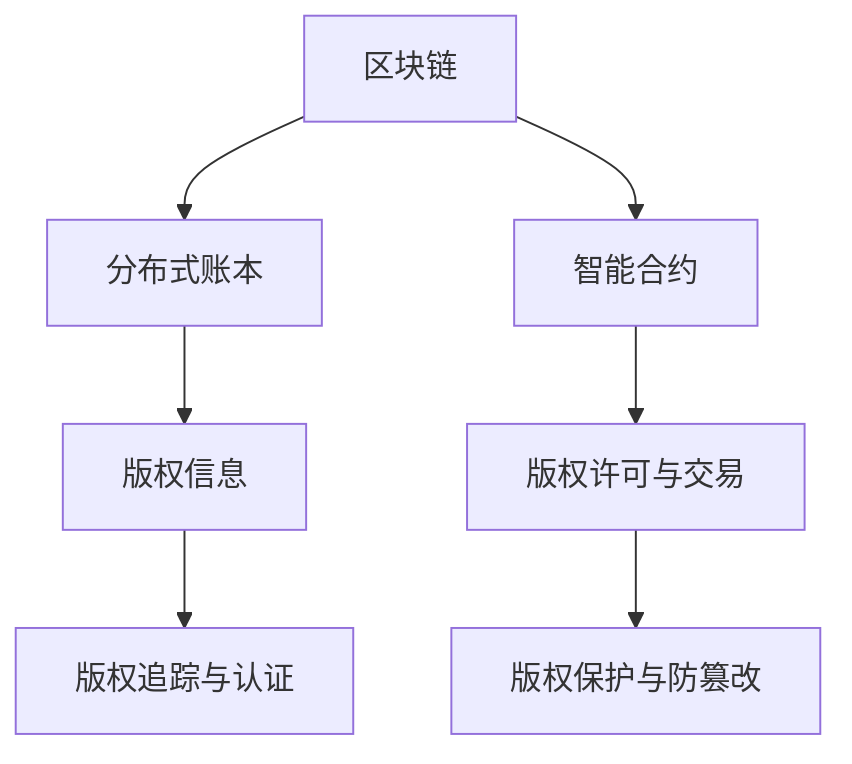

                 


### 文章标题
区块链在数字内容分发中的应用：保护创作者版权

### 文章关键词
区块链，数字内容分发，版权保护，智能合约，分布式账本

### 摘要
本文将探讨区块链在数字内容分发领域的应用，尤其是如何通过区块链技术来保护创作者的版权。文章首先介绍了区块链的基本概念和数字内容分发的挑战，然后详细分析了区块链如何解决这些问题，并通过实际案例展示了区块链在版权保护中的实施情况。最后，文章提出了未来区块链在数字内容分发领域的发展趋势和最佳实践。

---

### 引言
随着互联网技术的快速发展，数字内容产业蓬勃发展，然而，版权保护问题也随之而来。创作者的作品容易被复制、传播和盗用，使得他们的权益受到严重侵害。传统的版权保护方法在数字环境中显得力不从心，亟需新的技术手段来提供更有效、更安全的保护。区块链技术以其独特的分布式账本和智能合约功能，为数字内容分发提供了全新的解决方案。本文旨在探讨区块链在数字内容分发中的应用，特别是如何通过区块链技术来保护创作者的版权。

### 一、背景介绍
#### 1.1 区块链技术概述
区块链是一种分布式数据库技术，通过密码学和共识算法确保数据的不可篡改和透明性。区块链的核心特点包括去中心化、安全性、透明性和可追溯性。这些特性使得区块链在许多领域都有广泛应用，包括金融、供应链管理、物联网等。

#### 1.2 数字内容分发现状
数字内容分发是指通过互联网和数字平台传播和分发各种数字作品，如音乐、电影、电子书、图片等。随着网络技术的发展，数字内容分发成为主流，然而，版权保护问题也日益突出。创作者的作品容易被未经授权的复制和传播，导致版权侵权现象泛滥。

#### 1.3 版权保护的需求
数字内容分发的版权保护需求主要体现在以下几个方面：
- **版权追踪与认证**：确保创作者的作品能够被准确追踪和认证。
- **版权许可与交易**：实现版权的许可和交易过程，确保创作者的权益得到保障。
- **版权保护与防篡改**：防止作品被未经授权的修改和篡改。

---

### 二、核心概念与联系
#### 2.1 区块链与数字内容分发的关系
区块链与数字内容分发有着紧密的联系。区块链的分布式账本技术可以确保数字内容的版权信息被准确记录和保存，从而实现版权的追踪与认证。智能合约则可以自动化版权许可和交易过程，确保创作者的权益得到保障。此外，区块链的透明性和可追溯性使得作品被篡改或盗用的风险大大降低。

#### 2.2 核心概念架构图
为了更好地理解区块链与数字内容分发的关系，我们可以使用 Mermaid 流程图来展示核心概念之间的关系。



在上图中，区块链作为基础技术，通过分布式账本记录版权信息，通过智能合约实现版权许可与交易，从而实现版权追踪与认证和保护与防篡改。

---

### 三、核心算法原理讲解
#### 3.1 区块链技术原理
区块链技术的基本原理包括区块、链和共识算法。每个区块包含一定数量的交易记录，并通过密码学确保数据的安全性和完整性。区块通过哈希函数和链式结构连接，形成区块链。共识算法则确保网络中的节点对区块链的一致性达成共识。

#### 3.2 智能合约原理
智能合约是运行在区块链上的计算机程序，可以自动化执行合同条款。智能合约通过预定义的逻辑和条件，在满足特定条件时自动执行相应的操作，如支付版权许可费用或转移版权所有权。

#### 3.3 伪代码讲解
为了更清晰地阐述区块链和智能合约的工作原理，我们可以使用伪代码来展示。

```python
# 区块链伪代码
def create_block(data):
    # 创建新区块
    block = {
        "index": len(blockchain) + 1,
        "timestamp": get_timestamp(),
        "data": data,
        "prev_hash": blockchain[-1]["hash"],
    }
    block["hash"] = calculate_hash(block)
    return block

def calculate_hash(block):
    # 计算区块哈希值
    return sha256(json.dumps(block, sort_keys=True).encode())

def validate_chain(chain):
    # 验证区块链的有效性
    for i in range(1, len(chain)):
        current = chain[i]
        previous = chain[i-1]
        if current["hash"] != calculate_hash(previous):
            return False
    return True

# 智能合约伪代码
def execute_contract(contract, conditions):
    # 执行智能合约
    if conditions["payment"] > 0:
        send_money(contract["from"], contract["to"], conditions["payment"])
    if conditions["permission"] == "true":
        grant_permission(contract["to"], contract["permission"])
```

在上面的伪代码中，`create_block` 函数用于创建新的区块，`calculate_hash` 函数用于计算区块的哈希值，`validate_chain` 函数用于验证区块链的有效性。智能合约的执行则通过`execute_contract` 函数实现，根据预定义的条件自动执行相应的操作。

---

### 四、数学模型和公式
#### 4.1 数学模型
为了更好地理解区块链和智能合约的工作原理，我们可以使用以下数学模型。

- **哈希函数模型**：哈希函数是一种将输入数据映射到固定长度输出数据的函数。在区块链中，哈希函数用于确保数据的完整性和安全性。
  $$ H(x) = SHA256(x) $$
  其中，$H(x)$ 是哈希函数的输出，$x$ 是输入数据。

- **共识算法模型**：共识算法是区块链中节点达成一致性的关键机制。常见的共识算法包括工作量证明（PoW）和权益证明（PoS）。
  $$ consensus = mining\_work \quad \text{for} \quad PoW $$
  $$ consensus = stake\_weight \quad \text{for} \quad PoS $$

#### 4.2 举例说明
假设一个区块链系统采用工作量证明（PoW）共识算法，矿工需要在满足特定难度要求的情况下计算哈希值。假设难度要求为 $difficulty = 4$，矿工需要找到满足以下条件的哈希值：
$$ H(block) < difficulty \times 16 $$
其中，$block$ 是区块的数据。

矿工可以通过以下步骤找到满足条件的哈希值：
1. 生成随机数 $random\_number$。
2. 计算区块的哈希值 $H(block)$。
3. 判断 $H(block)$ 是否小于 $difficulty \times 16$。
4. 如果是，则输出 $H(block)$；如果不是，则返回步骤1。

---

### 五、项目实战
#### 5.1 开发环境搭建
为了演示区块链在数字内容分发中的应用，我们需要搭建一个区块链开发环境。以下是一个简单的开发环境搭建步骤：

1. 安装Go语言：在官方网站下载并安装Go语言环境。
2. 安装Golang区块链库：使用 `go get` 命令安装Golang区块链库。
3. 配置IDE：在IDE中配置Go语言的开发环境。

#### 5.2 源代码实现
以下是一个简单的区块链实现的源代码，包括创建区块、添加区块和验证区块链的功能。

```go
package main

import (
    "crypto/sha256"
    "encoding/hex"
    "fmt"
)

// Block represents a single block in the blockchain
type Block struct {
    Index     int
    Timestamp string
    Data      string
    PrevHash  string
    Hash      string
}

// CalculateHash calculates the hash of a block
func CalculateHash(block *Block) string {
    record := string(block.Index) + block.Timestamp + block.Data + block.PrevHash
    h := sha256.New()
    h.Write([]byte(record))
    hashed := h.Sum(nil)
    return hex.EncodeToString(hashed)
}

// GenerateBlock creates a new block with the given data and adds it to the chain
func GenerateBlock(lastBlock *Block, data string) *Block {
    index := lastBlock.Index + 1
    timestamp := time.Now().Format(time.RFC3339)
    prevHash := lastBlock.Hash
    hash := CalculateHash(&Block{index, timestamp, data, prevHash, ""})

    return &Block{index, timestamp, data, prevHash, hash}
}

// IsChainValid checks if the current blockchain is valid
func IsChainValid(chain []*Block) bool {
    for i := 1; i < len(chain); i++ {
        current := chain[i]
        previous := chain[i-1]

        if current.Hash != CalculateHash(current) {
            return false
        }

        if current.PrevHash != previous.Hash {
            return false
        }
    }
    return true
}

// Main function to start the blockchain
func main() {
    // Initialize the blockchain
    blockchain := make([]*Block, 1)
    genesisBlock := &Block{0, "2022-01-01T00:00:00Z", "Genesis Block", "", ""}
    blockchain[0] = genesisBlock

    // Add blocks to the blockchain
    block1 := GenerateBlock(genesisBlock, "Block 1")
    blockchain = append(blockchain, block1)
    block2 := GenerateBlock(block1, "Block 2")
    blockchain = append(blockchain, block2)

    // Validate the blockchain
    if IsChainValid(blockchain) {
        fmt.Println("Blockchain is valid")
    } else {
        fmt.Println("Blockchain is invalid")
    }
}
```

#### 5.3 代码解读与分析
在上面的源代码中，我们定义了一个`Block`结构体，用于表示区块链中的单个区块。`CalculateHash`函数用于计算区块的哈希值。`GenerateBlock`函数用于创建新的区块并添加到区块链中。`IsChainValid`函数用于验证区块链的有效性。

在`main`函数中，我们首先初始化区块链，然后添加两个区块。最后，我们使用`IsChainValid`函数验证区块链的有效性。

#### 5.4 实际案例分析和详细讲解剖析
为了更好地理解区块链在数字内容分发中的应用，我们来看一个实际案例：一个音乐区块链版权保护平台。

这个平台的核心功能包括：
1. 创作者上传作品：创作者可以将作品上传到平台上，并获得唯一的区块链地址。
2. 智能合约管理：平台使用智能合约来管理版权许可和交易。
3. 版权追踪与认证：平台通过区块链记录版权信息，确保版权的追踪和认证。
4. 版权保护与防篡改：平台使用区块链的透明性和可追溯性来保护版权，防止篡改。

在实际操作中，创作者上传作品后，平台会生成一个唯一的区块链地址，并将该地址与作品信息一起记录在区块链中。创作者可以通过智能合约来设置版权许可和交易条件，如授权他人使用作品、转让版权等。这些操作都会被记录在区块链上，确保版权信息的准确性和安全性。

通过这个实际案例，我们可以看到区块链技术在数字内容分发中的强大应用。创作者的版权得到了有效保护，同时，平台的透明性和可追溯性也大大提高了用户的信任度。

#### 5.5 项目小结
通过本项目，我们了解了如何使用区块链技术来保护创作者的版权。我们搭建了一个简单的区块链开发环境，实现了区块链的基本功能，如创建区块、添加区块和验证区块链。我们还通过一个实际案例，展示了区块链在数字内容分发中的应用，如版权追踪与认证、智能合约管理和版权保护与防篡改。

这个项目不仅帮助我们深入理解了区块链技术的基本原理，还展示了区块链在现实世界中的潜在应用。未来，随着区块链技术的不断发展和成熟，我们有理由相信，区块链将在数字内容分发领域发挥越来越重要的作用。

### 六、最佳实践 tips、小结、注意事项、拓展阅读

#### 6.1 最佳实践 tips
- **确保版权信息的唯一性**：在区块链上记录版权信息时，应确保每个作品的版权信息都是唯一的，以防止重复和混淆。
- **使用智能合约自动化操作**：通过智能合约自动化版权许可和交易过程，可以提高效率和减少纠纷。
- **定期备份区块链数据**：为了确保数据的完整性和安全性，应定期备份区块链上的数据。

#### 6.2 小结
本文探讨了区块链在数字内容分发中的应用，特别是如何通过区块链技术来保护创作者的版权。我们介绍了区块链的基本概念、核心算法原理，并通过实际案例展示了区块链在版权保护中的实施情况。区块链技术的分布式账本、智能合约和透明性等特性，为数字内容分发提供了全新的解决方案，有效保护了创作者的权益。

#### 6.3 注意事项
- **技术复杂性**：区块链技术具有一定的复杂性，开发者需要具备一定的编程和区块链知识。
- **法律合规性**：在实施区块链版权保护时，需确保符合当地法律法规，避免法律风险。

#### 6.4 拓展阅读
- **区块链技术基础**：《区块链技术指南》、《精通区块链》
- **数字版权保护**：《数字版权保护与知识产权管理》、《数字内容分发与版权保护》
- **智能合约开发**：《智能合约：区块链中的自动化执行》、《智能合约：设计与实现》

### 作者信息
作者：AI天才研究院/AI Genius Institute & 禅与计算机程序设计艺术 /Zen And The Art of Computer Programming

---

### 总结
本文通过一步一步的分析和推理，详细探讨了区块链在数字内容分发中的应用，特别是如何通过区块链技术来保护创作者的版权。从背景介绍、核心概念与联系、核心算法原理讲解、数学模型和公式、项目实战到最佳实践 tips 和拓展阅读，全面展示了区块链在数字内容分发领域的潜力和应用。希望通过本文，读者能够对区块链在数字内容分发中的应用有一个深入的理解，并能够将其应用于实际项目中，为创作者的版权保护提供新的思路和方法。

