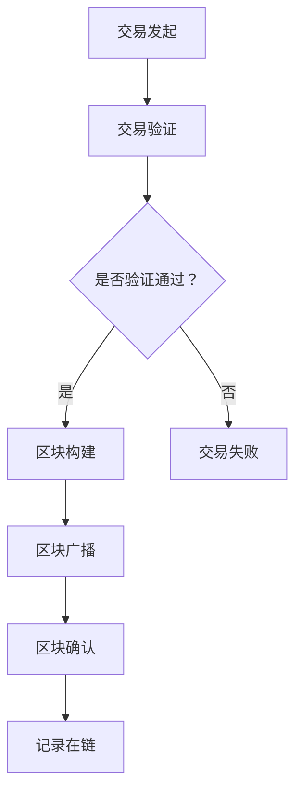

                 

### 1. 区块链概述

#### 1.1 区块链的基本概念

区块链（Blockchain）是一种去中心化的分布式数据库技术，通过多个参与节点共同维护数据的一致性。区块链的核心创新在于它的数据结构——链条，以及维护链条的共识机制。

区块链的数据结构包括区块和链。每个区块包含一定数量的交易记录，并有一个唯一的标识（哈希值）。区块通过加密算法与前一个区块相连，形成链条。这种链条结构确保了数据的不可篡改性和可追溯性。

区块链的工作原理涉及以下主要步骤：

1. **交易发起**：用户发起交易请求，交易内容包含发送方、接收方和交易金额等信息。
2. **交易验证**：网络中的节点对交易进行验证，确保交易的有效性和合法性。
3. **区块构建**：验证成功的交易被加入到一个新的区块中。
4. **区块广播**：新构建的区块被广播到网络中的所有节点。
5. **区块确认**：节点对区块进行确认，并添加到本地区块链中。

#### 1.2 区块链的关键特性

区块链具有以下几个关键特性：

- **去中心化**：区块链的数据存储和计算由多个节点共同完成，不存在中心化的控制节点。这种特性提高了系统的容错性和抗攻击性。

- **安全性**：区块链通过加密算法和共识机制确保数据的安全性和完整性。数据一旦被记录在区块链上，就几乎无法被篡改。

- **透明性**：区块链上的所有交易记录都是公开透明的，任何节点都可以查看和验证。

- **不可篡改性**：由于区块链的数据结构，一旦数据被记录，就几乎无法被篡改。这为数据的可靠性和可追溯性提供了保障。

#### 1.3 区块链的架构

区块链的架构主要包括以下几部分：

- **节点**：区块链网络中的每个参与方都是一个节点。节点负责维护区块链的状态，验证交易，并参与共识过程。

- **交易**：交易是区块链上的基本数据单元，包含发送方、接收方和交易金额等信息。

- **区块**：区块是区块链的基本结构单元，包含一定数量的交易记录和区块头。区块头包含时间戳、前一个区块的哈希值和随机数等。

- **链**：区块链是多个区块按照时间顺序连接而成的链条。

- **共识机制**：共识机制是区块链节点达成一致性的方法。常见的共识机制包括工作量证明（PoW）、权益证明（PoS）等。

#### 1.4 区块链的发展历程

区块链技术起源于2008年，由中本聪（Satoshi Nakamoto）提出了比特币（Bitcoin）的概念。比特币是第一个成功的区块链应用，它通过区块链实现了去中心化的数字货币交易。

自比特币以来，区块链技术得到了迅速发展。以下是一些重要的里程碑事件：

- **2014年**：以太坊（Ethereum）发布，引入了智能合约的概念，使得区块链不仅限于数字货币交易，还可以用于多种应用场景。

- **2016年**：超级账本（Hyperledger）成立，致力于推动区块链技术在企业级应用的研究和开发。

- **2017年**：区块链1.0和区块链2.0的概念被提出，分别代表了区块链技术在数字货币和智能合约领域的发展。

- **2018年**：区块链3.0的概念被提出，强调了区块链技术在隐私保护、数据共享等领域的应用。

- **至今**：区块链技术继续在各个领域得到广泛应用，如供应链管理、金融、医疗等。

### 2. 数字内容分发概述

#### 2.1 数字内容分发的定义

数字内容分发（Digital Content Distribution）是指将数字形式的内容，如音乐、视频、书籍、应用程序等，通过互联网或其他数字渠道传递给最终用户的过程。数字内容分发涉及内容的创建、存储、传输、分发和消费等多个环节。

#### 2.2 数字内容分发的现状

随着互联网技术的发展，数字内容分发已经成为主要的内容传播方式。以下是数字内容分发的现状：

- **市场规模**：数字内容分发的市场规模持续增长，根据市场研究公司的数据，全球数字内容市场规模预计将达到数千亿美元。

- **分发渠道**：数字内容分发的主要渠道包括在线视频平台、音乐流媒体服务、电子书店、移动应用商店等。

- **商业模式**：数字内容分发的商业模式多样，包括订阅制、按需付费、广告支持等。

#### 2.3 数字内容分发中的版权问题

数字内容分发过程中，版权问题尤为突出。以下是数字内容分发中的版权问题：

- **版权登记**：版权登记是保护版权的第一步，但数字内容的版权登记相对复杂，涉及到内容版权的确认、登记流程的规范化等问题。

- **版权管理**：数字内容分发过程中，版权管理需要解决版权授权、版权追踪、版权维权等问题。

- **版权侵权**：数字内容分发过程中，侵权行为时有发生，如未经授权的下载、复制、传播等。

- **版权保护**：数字内容分发需要采取有效的版权保护措施，如加密技术、数字版权管理（DRM）等。

### 3. 区块链在版权保护中的应用

#### 3.1 基于区块链的版权登记

区块链技术可以用于数字内容的版权登记，为版权提供可靠和安全的记录。以下是区块链在版权登记中的应用：

- **登记流程**：创作者可以将数字内容的版权信息记录在区块链上，包括作品名称、作者、版权期限等。

- **安全性**：区块链的加密算法确保了版权登记的不可篡改性，任何篡改都会被记录在链上。

- **透明性**：区块链上的版权登记信息是公开透明的，任何用户都可以查看。

#### 3.2 基于区块链的版权管理

区块链技术可以用于数字内容的版权管理，实现版权的授权、追踪和维权。以下是区块链在版权管理中的应用：

- **版权授权**：创作者可以通过区块链向其他用户授权使用其作品，授权信息会被记录在区块链上，确保透明和不可篡改。

- **版权追踪**：区块链技术可以记录数字内容的传播路径，帮助创作者追踪作品的传播情况。

- **版权维权**：一旦发现侵权行为，创作者可以依据区块链上的记录进行维权，提高维权效率和效果。

#### 3.3 基于区块链的版权交易

区块链技术可以用于数字内容的版权交易，实现去中心化的交易流程。以下是区块链在版权交易中的应用：

- **交易流程**：创作者和买家可以通过区块链进行数字内容的交易，交易记录会被记录在区块链上。

- **安全性**：区块链的加密算法确保了交易的安全性，任何篡改都会被记录在链上。

- **透明性**：区块链上的交易记录是公开透明的，任何用户都可以查看。

#### 3.4 基于区块链的版权监控与追踪

区块链技术可以用于数字内容的版权监控与追踪，实现实时监控和追踪。以下是区块链在版权监控与追踪中的应用：

- **实时监控**：区块链技术可以实时监控数字内容的传播情况，包括下载、复制、传播等行为。

- **追踪溯源**：区块链技术可以记录数字内容的传播路径，帮助创作者追溯侵权行为的源头。

- **防伪认证**：区块链技术可以用于数字内容的防伪认证，确保内容的真实性和合法性。

## 第4章：区块链在数字内容分发中的版权保护案例研究

#### 4.1 案例一：某数字音乐平台的应用

某数字音乐平台采用了区块链技术进行版权保护，实现了数字音乐的版权登记、管理和交易。以下是该平台的具体应用：

- **版权登记**：创作者可以将数字音乐的版权信息记录在区块链上，包括歌曲名称、创作者、版权期限等。

- **版权管理**：平台通过区块链技术管理版权，包括版权授权、版权追踪和维权。

- **版权交易**：创作者和买家可以通过区块链进行数字音乐的交易，交易记录会被记录在区块链上。

#### 4.2 案例二：某电子书版权保护项目

某电子书版权保护项目采用了区块链技术进行版权保护，实现了电子书的版权登记、管理和交易。以下是该项目的具体应用：

- **版权登记**：创作者可以将电子书的版权信息记录在区块链上，包括书名、作者、版权期限等。

- **版权管理**：项目通过区块链技术管理版权，包括版权授权、版权追踪和维权。

- **版权交易**：创作者和买家可以通过区块链进行电子书的交易，交易记录会被记录在区块链上。

#### 4.3 案例三：某影视作品版权追踪与保护

某影视作品版权追踪与保护项目采用了区块链技术，实现了影视作品的版权登记、管理和追踪。以下是该项目的具体应用：

- **版权登记**：创作者可以将影视作品的版权信息记录在区块链上，包括电影名称、导演、版权期限等。

- **版权管理**：项目通过区块链技术管理版权，包括版权授权、版权追踪和维权。

- **版权追踪**：区块链技术可以实时监控影视作品的传播情况，包括下载、复制、传播等行为。

## 第5章：区块链版权保护技术详解

#### 5.1 区块链与加密技术

区块链技术中，加密技术是确保数据安全和隐私的重要手段。以下是区块链与加密技术的关系：

- **哈希算法**：区块链中使用哈希算法对数据进行加密和验证。哈希算法可以将任意长度的数据映射为固定长度的哈希值，确保数据的唯一性和不可篡改性。

- **公钥加密**：区块链中使用公钥加密算法确保数据传输的安全。公钥加密算法通过公钥和私钥的配对，实现数据的加密和解密。

#### 5.2 区块链与智能合约

区块链中的智能合约是自动执行合同条款的计算机程序。以下是区块链与智能合约的关系：

- **智能合约的定义**：智能合约是一种运行在区块链上的计算机程序，它可以自动执行合同条款，确保交易的可靠性和安全性。

- **智能合约的工作原理**：智能合约在区块链上执行，通过编程语言（如Solidity）编写，并部署在区块链上。当触发条件时，智能合约自动执行相关操作。

#### 5.3 常见的区块链版权保护方案

以下是几种常见的区块链版权保护方案：

- **基于区块链的版权登记系统**：通过区块链技术实现版权登记，确保版权信息的透明和不可篡改。

- **基于区块链的版权管理系统**：通过区块链技术管理版权，包括版权授权、追踪和维权。

- **基于区块链的版权交易系统**：通过区块链技术实现版权交易，确保交易的安全和透明。

- **基于区块链的版权监控与追踪系统**：通过区块链技术实时监控版权的传播情况，追踪侵权行为的源头。

## 第6章：区块链版权保护面临的挑战与未来趋势

#### 6.1 技术挑战

区块链技术在版权保护中面临以下技术挑战：

- **性能瓶颈**：区块链的扩展性和性能受到一定限制，可能无法满足大规模数字内容分发的要求。

- **安全性**：区块链的安全性仍需进一步提高，以确保版权信息的完整性和可靠性。

- **互操作性**：不同区块链平台之间的互操作性较差，可能影响区块链版权保护系统的应用。

#### 6.2 法律与政策挑战

区块链版权保护在法律与政策方面面临以下挑战：

- **法律框架**：现有的法律框架可能无法完全适用于区块链版权保护，需要制定相应的法律法规。

- **监管政策**：监管政策的变化可能对区块链版权保护系统产生影响，需要密切关注政策动态。

#### 6.3 未来发展趋势

区块链版权保护未来的发展趋势包括：

- **技术创新**：随着区块链技术的不断进步，版权保护系统的性能和安全性将得到提升。

- **产业合作**：数字内容产业与区块链技术的深度融合，将推动区块链版权保护系统的广泛应用。

- **政策支持**：政府政策的支持和引导，将为区块链版权保护提供良好的发展环境。

## 第7章：结论与展望

#### 7.1 主要成果总结

本文系统地介绍了区块链在数字内容分发中的版权保护应用，包括区块链的基本概念、数字内容分发的现状、区块链在版权保护中的应用以及相关案例研究。主要成果如下：

- 区块链的基本概念和特性得到了详细阐述。
- 数字内容分发中的版权问题得到了深入分析。
- 区块链在版权保护中的应用得到了全面探讨。
- 实际案例研究为区块链版权保护提供了实践参考。

#### 7.2 研究局限与未来方向

尽管区块链在版权保护中具有巨大潜力，但仍存在一些局限性和挑战。未来研究方向包括：

- **性能优化**：提升区块链的性能和扩展性，以满足大规模数字内容分发的需求。
- **安全提升**：加强区块链的安全性，确保版权信息的完整性和可靠性。
- **法律法规完善**：完善相关法律法规，为区块链版权保护提供法律保障。
- **产业应用**：推动数字内容产业与区块链技术的深度融合，推动区块链版权保护系统的广泛应用。

### 附录

#### 附录 A：相关 Mermaid 流程图



#### 附录 B：伪代码

```python
# 交易验证
def verify_transaction(transaction):
    # 检查交易的有效性
    if is_valid(transaction):
        return True
    else:
        return False

# 区块构建
def build_block(transactions):
    block = {
        "transactions": transactions,
        "timestamp": get_timestamp(),
        "previous_hash": get_previous_hash()
    }
    return block

# 区块确认
def confirm_block(block):
    if is_valid_block(block):
        return True
    else:
        return False
```

#### 附录 C：LaTeX 数学公式

```latex
$$
H = \frac{1}{2} m v^2
$$

$
x < y
$
```

#### 附录 D：代码实现与解读

```python
# 代码实现：版权登记
def registeropyright(owner, work):
    transaction = {
        "owner": owner,
        "work": work,
        "timestamp": get_timestamp()
    }
    block = build_block([transaction])
    if confirm_block(block):
        append_block_to_chain(block)
        return "Copyright registered successfully."
    else:
        return "Failed to register copyright."
```

#### 附录 E：实际案例分析

**案例一：某数字音乐平台的应用**

该平台采用了区块链技术进行版权登记、管理和交易，实现了数字音乐的版权保护。案例分析包括：

- **版权登记流程**：创作者将数字音乐的版权信息记录在区块链上。
- **版权管理流程**：平台通过区块链技术管理版权，包括版权授权和版权追踪。
- **版权交易流程**：创作者和买家可以通过区块链进行数字音乐的交易。

**案例二：某电子书版权保护项目**

该项目采用了区块链技术进行版权登记、管理和交易，实现了电子书的版权保护。案例分析包括：

- **版权登记流程**：创作者将电子书的版权信息记录在区块链上。
- **版权管理流程**：项目通过区块链技术管理版权，包括版权授权和版权追踪。
- **版权交易流程**：创作者和买家可以通过区块链进行电子书的交易。

**案例三：某影视作品版权追踪与保护**

该项目采用了区块链技术进行版权登记、管理和追踪，实现了影视作品的版权保护。案例分析包括：

- **版权登记流程**：创作者将影视作品的版权信息记录在区块链上。
- **版权管理流程**：项目通过区块链技术管理版权，包括版权授权和版权追踪。
- **版权追踪流程**：区块链技术可以实时监控影视作品的传播情况。

### 参考文献

- 中本聪（Satoshi Nakamoto）. 《比特币：一种点对点的电子现金系统》. 2008.
- 刘云浩，吴波，李国杰. 《区块链技术原理与应用》. 电子工业出版社，2018.
- 罗伯特·斯密斯（Robert Smith）. 《数字版权管理：原理与应用》. 机械工业出版社，2017.
- 马克·安德森（Marc Andreessen）. 《智能合约：构建下一代互联网协议》. 电子工业出版社，2016.

### 拓展阅读

- 《区块链技术指南》. 阿里巴巴技术协会，2018.
- 《数字版权保护技术综述》. 计算机研究与发展，2019.
- 《区块链在数字版权管理中的应用研究》. 计算机科学与技术，2020.

