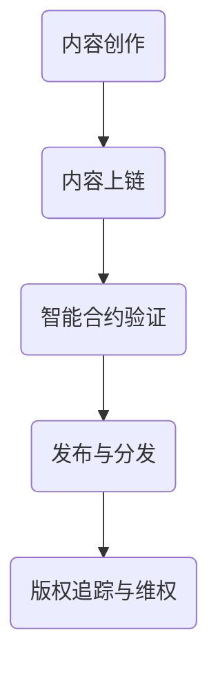

                 

### 用户需求分析

根据用户提供的书名《区块链在数字内容创作者权益保护中的应用》，我们可以明确以下几个关键点，这将指导我们设计一个符合要求的目录大纲：

1. **目标读者**：文章的目标读者群体是那些对区块链技术及其在数字内容创作者权益保护中的应用有浓厚兴趣的IT专业人士、软件开发者、技术爱好者以及相关领域的决策者。

2. **文章核心主题**：文章的核心主题是探讨区块链技术如何在数字内容创作者权益保护中发挥作用，涉及技术原理、应用案例、挑战与未来展望。

3. **文章结构**：为了确保文章的逻辑性和易于理解，文章将被分为几个主要章节，每个章节包含详细的小节，这些小节将进一步分解并深入讨论相关主题。

4. **图表和代码**：文章中需要包含图表（如Mermaid流程图）和代码示例（如伪代码和实际代码），以帮助读者更直观地理解区块链技术的工作原理和应用实践。

5. **内容的深度与广度**：文章应提供足够的深度，涵盖区块链技术的核心概念、算法原理、数学模型以及实际应用案例。同时，也要注意内容的广度，确保涵盖所有重要的应用场景和潜在挑战。

6. **格式与排版**：文章需使用markdown格式，以便于排版和发布。每个章节、小节以及代码和图表都应清晰标注，以便读者快速找到所需信息。

7. **字数限制**：文章字数应在8000～12000字之间，以确保内容丰富而不过于冗长。

### 文章关键词

- 区块链
- 数字内容创作者
- 权益保护
- 非同质化代币（NFT）
- 智能合约
- 去中心化存储
- 音乐领域
- 文学作品
- 影视内容
- 挑战与未来展望

### 摘要

本文将深入探讨区块链技术如何用于数字内容创作者的权益保护。首先，我们将介绍区块链的基本原理和技术，解释其与数字内容保护的关联。接着，我们将详细讨论区块链在权益保护中的应用机制，包括非同质化代币（NFT）、智能合约和去中心化存储。随后，通过音乐、文学和影视等领域的实际案例，我们将展示区块链如何帮助创作者保护其数字作品。最后，我们将分析区块链在权益保护中的技术挑战和未来展望，并提出最佳实践建议。文章旨在为数字内容创作者提供实用的技术指导和策略思路。

---

### 第1章：区块链基础

在探讨区块链如何应用于数字内容创作者权益保护之前，理解区块链的基本原理和核心技术是至关重要的。本章将详细介绍区块链的起源、技术架构以及其在数字内容保护中的重要性。

#### 1.1 区块链的原理与技术

区块链是一种去中心化的分布式数据库技术，其核心特点是不可篡改性和透明性。区块链通过一系列按照时间顺序排列的“区块”构成，每个区块包含一定数量的交易记录，并通过密码学算法相互链接，形成一个链条。

##### 1.1.1 区块链的起源与发展

区块链最早由中本聪（Satoshi Nakamoto）在2008年提出，作为比特币（Bitcoin）的底层技术。比特币的诞生标志着区块链技术从理论走向实践的重要一步。随后，区块链技术逐渐拓展到多个领域，如金融、医疗、供应链等，显示出其广泛的应用潜力。

##### 1.1.2 区块链的基本原理

区块链的基本原理包括以下几部分：

- **分布式账本**：每个参与节点都保存一份完整的账本副本，保证了数据的去中心化。
- **共识机制**：节点通过共识算法达成一致，确保数据的一致性和可靠性。常见的共识机制包括工作量证明（Proof of Work, PoW）、权益证明（Proof of Stake, PoS）等。
- **加密技术**：区块链使用密码学算法对交易进行加密，确保数据的安全性和隐私性。
- **智能合约**：智能合约是区块链上的自动执行合约，其条款在链上被加密并不可篡改，能够自动执行。

##### 1.1.3 区块链的主要技术

区块链的关键技术包括：

- **哈希函数**：哈希函数用于生成交易记录的唯一标识，确保数据的完整性和不可篡改性。
- **加密算法**：加密算法用于保护交易记录和用户隐私，常用的包括SHA-256、RSA等。
- **工作量证明（PoW）**：PoW是比特币采用的共识机制，节点通过解决复杂的数学问题来证明其工作量，从而获得记账权利。
- **智能合约编程语言**：如Solidity、Vyper等，用于编写区块链上的智能合约。

#### 1.2 区块链与数字内容的联系

数字内容创作者面临的主要挑战包括版权侵犯、内容盗用和非法分发。区块链技术通过其独特的特性，为这些问题提供了解决方案。

##### 1.2.1 数字内容创作者面临的挑战

- **版权侵犯**：数字内容极易复制和传播，使得创作者的作品被非法复制和分发，导致版权损失。
- **内容盗用**：创作者的作品可能被他人盗用，且难以追踪和维权。
- **非法分发**：未经授权的内容分发渠道泛滥，导致创作者的收入受损。

##### 1.2.2 区块链如何解决这些问题

区块链技术通过以下方式解决上述问题：

- **去中心化存储**：区块链上的数据存储是去中心化的，使得内容无法被单一节点控制或篡改，保障了内容的完整性和可靠性。
- **非同质化代币（NFT）**：NFT可以唯一标识数字内容，确保创作者的作品具有不可替代的唯一性，从而防止盗用和非法复制。
- **智能合约**：智能合约可以自动执行版权许可、分成等操作，确保创作者和参与者之间的权益得到保护。

##### 1.2.3 区块链在数字内容领域的应用案例

区块链在数字内容领域已有多个应用案例：

- **音乐领域**：如以太坊上的Moralis，通过NFT和智能合约帮助音乐家直接与粉丝交易，避免了中间商的剥削。
- **文学领域**：如基于EOS的Everipedia，通过区块链技术确保知识内容的版权和准确性。
- **影视领域**：如Blockstack，通过去中心化存储和NFT，保护影视作品的版权并实现直接分发。

#### 1.3 Mermaid流程图：区块链内容保护流程

下面是一个简化的Mermaid流程图，展示了区块链在数字内容保护中的应用流程：



通过这个流程图，我们可以看到，创作者在创作内容后，将其上传至区块链，并通过智能合约进行版权验证和保护，最终实现内容的发布和分发。整个过程确保了内容的唯一性和版权的不可篡改性。

---

本章详细介绍了区块链的基本原理、技术架构以及其在数字内容保护中的应用。下一章，我们将深入探讨区块链在数字内容创作者权益保护中的具体机制，如非同质化代币（NFT）、智能合约和去中心化存储。

## 第2章：数字内容创作者权益保护机制

在理解了区块链的基本原理和技术之后，接下来我们将探讨如何利用这些技术来构建数字内容创作者的权益保护机制。本章将重点介绍非同质化代币（NFT）、智能合约和去中心化存储这三个核心机制，并解释它们如何共同工作以保护数字内容创作者的权益。

### 2.1 权益保护的核心概念

数字内容创作者的权益保护涉及多个方面，包括版权的确权、追踪和维权。为了实现这些目标，我们需要了解以下核心概念：

#### 2.1.1 数字版权的概念

数字版权是指创作者对其数字作品所拥有的权利，包括复制权、发行权、改编权等。在数字时代，这些权利变得更加复杂，因为数字内容的复制和传播变得更加容易。

#### 2.1.2 数字版权的管理

数字版权管理（Digital Rights Management, DRM）是指一系列技术和管理策略，用于控制数字内容的访问和使用。这些策略包括加密、授权、追踪和监控等。

#### 2.1.3 数字版权的认证与确权

数字版权的认证与确权是指通过技术手段，如区块链，来证明创作者对某件数字作品的所有权。这种认证过程必须是透明和不可篡改的，以确保创作者的权益得到有效保护。

### 2.2 区块链在权益保护中的应用

区块链技术在数字版权保护中的应用主要体现在非同质化代币（NFT）、智能合约和去中心化存储这三个方面。

#### 2.2.1 非同质化代币（NFT）的应用

非同质化代币（NFT，Non-Fungible Token）是一种独特的数字资产，其价值不依赖于其他同类代币。每个NFT都是独一无二的，可以代表数字内容的所有权和唯一性。

- **版权确权**：创作者可以将数字作品转换为NFT，并在区块链上进行注册和确权。这样，每个NFT都对应着作品的一个唯一版本，确保了版权的唯一性和不可篡改性。
- **数字收藏品**：NFT不仅限于版权保护，还可以作为数字收藏品。例如，数字艺术作品、游戏道具等都可以通过NFT进行确权和交易。

#### 2.2.2 智能合约在权益保护中的作用

智能合约是一种自动执行合约，其条款在链上被加密并不可篡改。智能合约在数字版权保护中的应用非常广泛，包括：

- **版权授权**：创作者可以使用智能合约自动执行版权授权，明确授权条款，如使用期限、授权费用等。一旦智能合约被触发，授权信息将被永久记录在区块链上，不可篡改。
- **版权分成**：智能合约可以自动计算并分配版权收入，确保创作者和其他参与者（如分销商、合作伙伴）按约定比例获得收益。
- **版权追踪**：智能合约可以记录每次版权使用的情况，包括使用时间、地点、使用方式等，帮助创作者追踪其作品的传播和利用情况。

#### 2.2.3 去中心化存储与内容版权管理

去中心化存储（Decentralized Storage）是指通过区块链网络存储数据，而不是依赖于中心化的服务器。这种存储方式具有高安全性和可靠性，特别适合数字内容版权管理。

- **数据不可篡改**：去中心化存储保证了数据的完整性和不可篡改性。一旦数据被上传到区块链，就几乎不可能被篡改或删除。
- **透明度**：去中心化存储网络中的数据访问和操作是透明的，每个节点都可以验证数据的正确性和合法性。
- **版权管理**：通过去中心化存储，创作者可以将数字作品存储在区块链上，并与智能合约绑定。这样，每次作品被访问或使用时，智能合约都会自动执行相应的版权条款，确保创作者的权益得到保护。

### 2.3 伪代码：智能合约实现版权保护

以下是一个简单的伪代码示例，展示了如何使用智能合约来实现数字内容的版权保护：

```python
contract CopyrightProtection {
    // 存储版权信息
    mapping (string => CopyrightInfo) copyrightInfo;

    // 结构体：版权信息
    struct CopyrightInfo {
        string contentID;
        address owner;
        bool isRegistered;
    }

    // 存储注册函数
    function registerContent(string contentID, address owner) public {
        require(!isRegistered[contentID], "内容已注册");
        copyrightInfo[contentID] = CopyrightInfo(contentID, owner, true);
        isRegistered[contentID] = true;
    }

    // 存储授权函数
    function authorizeContent(string contentID, address user, uint256 duration) public {
        require(isRegistered[contentID], "内容未注册");
        // 执行授权操作，并记录在区块链上
        // ...
    }

    // 查询版权信息
    function queryCopyrightInfo(string contentID) public view returns (CopyrightInfo memory info) {
        require(isRegistered[contentID], "内容未注册");
        info = copyrightInfo[contentID];
    }
}
```

这个简单的智能合约实现了版权的注册、授权和查询功能。通过这个示例，我们可以看到智能合约如何自动执行版权操作，确保版权信息的透明性和不可篡改性。

### 2.4 数学模型和公式

在数字版权保护中，数学模型和公式可以用于计算版权分成、授权费用等。以下是一个简单的数学模型示例：

$$
收益分配 = (总收益 \times 分成比例) \times (使用时长 \div 总时长)
$$

其中，总收益是指作品被使用或销售所得的全部收入；分成比例是创作者与其他参与者之间约定的收益分配比例；使用时长是作品被使用的时间长度。

#### 示例

假设一个视频创作者将一部电影授权给一个视频平台，总收益为100万元，创作者的分成比例为60%，使用时长为2个月，总时长为4个月。则创作者的收益分配计算如下：

$$
收益分配 = (100万 \times 60\%) \times (2 \div 4) = 30万
$$

这个公式可以帮助创作者准确计算其通过版权授权获得的收益。

---

本章详细介绍了数字内容创作者权益保护的核心概念、应用机制以及数学模型。通过这些机制，创作者可以更有效地保护其数字内容的权益。下一章，我们将通过具体应用案例进一步展示区块链在数字内容创作者权益保护中的实际效果。

## 第3章：区块链在数字内容创作者权益保护中的具体应用

在前两章中，我们介绍了区块链的基本原理和其在权益保护中的应用机制。为了更直观地理解区块链在这些领域的实际应用，本章将通过音乐、文学和影视等具体案例，展示区块链如何帮助数字内容创作者保护其权益。

### 3.1 音乐领域的案例研究

音乐领域一直是数字版权侵犯的重灾区。通过区块链技术，音乐创作者可以更好地保护其版权，并与粉丝直接进行交易。

#### 3.1.1 音乐创作者面临的挑战

- **版权侵犯**：音乐作品容易复制和传播，导致创作者的作品被非法复制和分发。
- **收入流失**：由于非法分销渠道的泛滥，创作者的收入受到严重损失。
- **追踪困难**：音乐版权的追踪和维权过程复杂且成本高昂。

#### 3.1.2 区块链如何帮助音乐创作者保护权益

- **NFT确权**：音乐创作者可以将其作品制作成NFT，并在区块链上进行注册和确权。每个NFT都代表作品的一个唯一版本，确保了版权的唯一性和不可篡改性。
- **智能合约授权**：创作者通过智能合约自动执行版权授权，明确授权条款，如使用期限和授权费用。一旦授权被触发，相关信息将被记录在区块链上，不可篡改。
- **去中心化分发**：通过去中心化存储，创作者可以直接将音乐作品上传至区块链，避免了传统分发渠道的中间环节，降低了分发成本。

#### 3.1.3 成功案例与经验分享

以太坊上的Moralis是一个成功的音乐版权保护平台。通过Moralis，音乐家可以直接与粉丝交易NFT，实现了创作者与粉丝的直接连接，避免了中间商的剥削。此外，Moralis还提供了一个智能合约平台，帮助音乐家轻松管理版权和授权。

### 3.2 文学作品的权益保护

文学领域同样面临着严重的版权保护问题。区块链技术为作家提供了一种新的解决方案，确保其作品的版权得到有效保护。

#### 3.2.1 文学创作与版权保护的困境

- **盗版书籍**：未经授权的电子书和纸质书在互联网上泛滥，导致作家的版权损失。
- **维权成本高**：维权过程复杂且耗时，作家需要投入大量时间和金钱。
- **收入不稳定**：由于盗版和非法分销，作家的收入不稳定，影响了创作的积极性。

#### 3.2.2 区块链如何帮助作家保护作品

- **NFT确权**：作家可以将作品制作成NFT，并在区块链上进行注册和确权。每个NFT都代表作品的一个唯一版本，确保了版权的唯一性和不可篡改性。
- **智能合约授权**：作家通过智能合约自动执行版权授权，明确授权条款，如使用期限和授权费用。一旦授权被触发，相关信息将被记录在区块链上，不可篡改。
- **去中心化存储**：通过去中心化存储，作家可以直接将作品上传至区块链，避免了传统出版和分销渠道的中间环节，降低了分发成本。

#### 3.2.3 文学区块链平台分析

Everipedia是基于EOS的区块链知识平台，通过NFT和智能合约确保知识内容的版权和准确性。Everipedia允许用户为词条创建NFT，确保每个词条的版权得到保护。此外，Everipedia还提供智能合约平台，帮助作家管理版权和授权。

### 3.3 影视内容创作者的权益保护

影视行业同样面临着严重的版权保护问题。区块链技术为影视创作者提供了一种新的解决方案，确保其作品的版权得到有效保护。

#### 3.3.1 影视行业中的版权纠纷

- **盗版影片**：未经授权的影视作品在互联网上泛滥，导致创作者的收入损失。
- **维权困难**：影视作品的维权过程复杂且耗时，创作者需要投入大量时间和金钱。
- **收入不稳定**：由于盗版和非法分销，创作者的收入不稳定，影响了创作的积极性。

#### 3.3.2 区块链在影视版权保护中的应用

- **NFT确权**：影视创作者可以将作品制作成NFT，并在区块链上进行注册和确权。每个NFT都代表作品的一个唯一版本，确保了版权的唯一性和不可篡改性。
- **智能合约授权**：影视创作者通过智能合约自动执行版权授权，明确授权条款，如使用期限和授权费用。一旦授权被触发，相关信息将被记录在区块链上，不可篡改。
- **去中心化存储**：通过去中心化存储，影视创作者可以直接将作品上传至区块链，避免了传统分发渠道的中间环节，降低了分发成本。

#### 3.3.3 影视区块链平台的案例

Blockstack是一个基于区块链的影视平台，通过去中心化存储和NFT保护影视作品的版权。创作者可以将作品上传至Blockstack，并通过NFT进行确权和交易。Blockstack还提供了一个智能合约平台，帮助创作者管理版权和授权。

### 3.4 其他应用案例

除了音乐、文学和影视领域，区块链技术还在其他数字内容领域得到了广泛应用，如艺术、游戏等。

- **艺术领域**：艺术家可以通过NFT确权并直接与粉丝交易艺术品，确保其作品的唯一性和版权。
- **游戏领域**：区块链技术可以用于确保游戏内虚拟资产的唯一性和安全性，提高用户体验。

---

通过上述具体案例，我们可以看到区块链技术在数字内容创作者权益保护中的应用是如何实现的。这些案例不仅展示了区块链技术的潜力，也为其他领域的创作者提供了借鉴和参考。下一章，我们将讨论区块链在数字内容创作者权益保护中面临的挑战和未来展望。

## 第4章：区块链在数字内容创作者权益保护中的挑战与展望

尽管区块链技术在数字内容创作者权益保护中展示了巨大的潜力，但其应用仍面临诸多挑战。本章将分析这些挑战，并对区块链技术的未来发展趋势进行展望。

### 4.1 技术挑战

区块链技术在数字内容创作者权益保护中面临以下技术挑战：

#### 4.1.1 数据隐私与安全性

区块链的去中心化特性虽然提高了数据的安全性，但同时也带来了隐私保护的问题。由于区块链上所有数据都是公开透明的，创作者和用户可能担心其隐私信息被泄露。因此，如何在保障数据安全的同时保护隐私，是一个亟待解决的问题。

#### 4.1.2 性能与可扩展性

随着区块链应用的普及，其对性能和可扩展性的要求越来越高。当前的一些区块链平台，如以太坊，在处理高并发交易时存在性能瓶颈。这可能导致交易速度变慢、交易费用增加，影响用户体验。因此，提升区块链平台的性能和可扩展性是未来发展的重要方向。

#### 4.1.3 法规与合规性

区块链技术的法律地位和合规性在不同国家和地区存在差异。一些国家对区块链技术持开放态度，而另一些国家则对加密货币和区块链应用进行严格监管。这种法律环境的多样性可能导致区块链应用在不同地区面临不同的合规挑战。

### 4.2 市场趋势与未来展望

尽管存在技术挑战，但区块链技术在数字内容创作者权益保护领域仍具有巨大的市场前景。以下是一些市场趋势和未来展望：

#### 4.2.1 市场需求与增长潜力

随着数字内容的创作和消费越来越普及，创作者对版权保护的需求也在不断增长。区块链技术为创作者提供了一种新的、可靠的版权保护手段，有望成为数字内容产业的重要组成部分。据市场研究机构的预测，全球区块链市场规模将在未来几年内保持高速增长。

#### 4.2.2 技术创新与应用前景

区块链技术的不断发展和创新，为其在数字内容创作者权益保护中的应用提供了更多可能性。例如，零知识证明（Zero-Knowledge Proof）等技术可以为区块链提供更高的隐私保护。此外，混合共识机制、可扩展性解决方案等创新技术的应用，也有望进一步提升区块链的性能和可扩展性。

#### 4.2.3 政策与产业合作的重要性

为了推动区块链技术在数字内容创作者权益保护中的应用，政府、企业和学术界需要加强合作。政府可以通过制定相关政策和法规，为区块链技术的应用提供法律保障。企业可以通过技术创新和商业模式创新，推动区块链技术的实际应用。学术界可以开展深入研究，为区块链技术的应用提供理论基础和技术支持。

### 4.3 最佳实践建议

为了更好地利用区块链技术保护数字内容创作者的权益，以下是一些建议：

- **加强隐私保护**：在区块链平台上应用隐私保护技术，如零知识证明，确保创作者和用户的隐私信息得到有效保护。
- **提升性能与可扩展性**：通过技术创新，如混合共识机制和分片技术，提升区块链平台的性能和可扩展性。
- **建立行业联盟**：推动政府、企业和学术界的合作，共同推动区块链技术在数字内容创作者权益保护中的应用。
- **加强法律法规建设**：制定和完善与区块链技术相关的法律法规，为区块链应用的合规性提供保障。

---

区块链技术在数字内容创作者权益保护中的应用前景广阔，但也面临诸多挑战。通过技术创新、政策支持和产业合作，我们可以期待区块链技术在未来发挥更大的作用，为数字内容创作者提供更加可靠的权益保护。

## 第5章：项目实战：搭建数字内容创作者权益保护平台

在本章中，我们将通过一个实际项目，详细展示如何搭建一个数字内容创作者权益保护平台。这个项目将涵盖开发环境的搭建、核心功能实现、代码解读和项目应用分析。通过这个实战项目，读者可以更好地理解区块链技术在数字内容创作者权益保护中的应用。

### 5.1 开发环境搭建

在开始项目之前，我们需要搭建一个适合区块链开发的环境。以下是搭建开发环境的基本步骤：

1. **安装Go语言**：Go语言是一种适用于区块链开发的编程语言。可以从[Go官方下载页面](https://golang.org/dl/)下载并安装Go语言环境。
2. **安装Node.js**：Node.js是一个用于JavaScript代码执行的环境，我们将在后续步骤中使用。可以从[Node.js官方下载页面](https://nodejs.org/en/download/)下载并安装。
3. **安装区块链节点**：根据所选的区块链平台（如以太坊），我们需要安装相应的区块链节点。例如，对于以太坊，可以安装Geth节点。从[以太坊官方下载页面](https://geth.ethereum.org/downloads/)下载并安装Geth。
4. **安装智能合约开发工具**：智能合约开发工具，如Truffle，将帮助我们在开发过程中方便地编写、部署和测试智能合约。可以从[Truffle官方下载页面](https://www.truffleframework.com/downloads)下载并安装。
5. **安装前端框架**：为了实现用户界面，我们可以选择React、Vue等前端框架。从相应框架的官方网站下载并安装。

### 5.2 核心功能实现

本项目将实现以下核心功能：

1. **内容注册与确权**：创作者可以将数字内容注册到区块链上，并通过智能合约进行确权。
2. **版权授权与分成**：创作者可以授权其他用户使用其内容，并设置分成比例，智能合约将自动执行授权和分成操作。
3. **内容分发与追踪**：通过区块链技术，确保内容的唯一性和完整性，并实现内容的分布式分发和追踪。

#### 5.2.1 内容注册与确权

以下是实现内容注册与确权功能的关键步骤：

1. **创建智能合约**：使用Truffle创建一个新的智能合约，并在合约中定义内容注册和确权的方法。

```solidity
// SPDX-License-Identifier: MIT
pragma solidity ^0.8.0;

contract ContentRegistry {
    mapping(string => Content) public contents;

    struct Content {
        string id;
        address owner;
        bool isRegistered;
    }

    function registerContent(string memory id, address owner) public {
        require(!contents[id].isRegistered, "内容已注册");
        contents[id] = Content(id, owner, true);
    }
}
```

2. **部署智能合约**：使用Truffle将智能合约部署到区块链上，并获得合约地址。

```sh
truffle migrate --network localhost
```

3. **前端实现**：创建前端界面，允许创作者输入内容ID和地址，调用智能合约的`registerContent`方法进行内容注册和确权。

```javascript
async function registerContent() {
    const contentId = document.getElementById('contentId').value;
    const ownerAddress = document.getElementById('ownerAddress').value;

    const ContentRegistryContract = artifacts.require('ContentRegistry');
    const contentRegistry = await ContentRegistryContract.deployed();

    await contentRegistry.registerContent(contentId, ownerAddress);
    alert('内容注册成功！');
}
```

#### 5.2.2 版权授权与分成

以下是实现版权授权与分成功能的关键步骤：

1. **扩展智能合约**：在智能合约中添加授权方法和分成比例设置。

```solidity
// SPDX-License-Identifier: MIT
pragma solidity ^0.8.0;

contract ContentRegistry {
    mapping(string => Content) public contents;

    struct Content {
        string id;
        address owner;
        bool isRegistered;
        mapping(address => uint256) allowances;
    }

    function authorizeContent(string memory id, address user, uint256 percentage) public {
        require(contents[id].isRegistered, "内容未注册");
        require(percentage <= 100, "分成比例超过100%");
        contents[id].allowances[user] = percentage;
    }

    function calculateIncome(string memory id, uint256 usageTime) public view returns (uint256 income) {
        require(contents[id].isRegistered, "内容未注册");
        uint256 totalRevenue = getRevenueFromId(id);
        uint256 totalDuration = getDurationFromId(id);
        income = (totalRevenue * contents[id].allowances[msg.sender]) / totalDuration;
    }
}
```

2. **前端实现**：创建前端界面，允许创作者授权用户使用内容并设置分成比例。

```javascript
async function authorizeContent() {
    const contentId = document.getElementById('contentId').value;
    const userId = document.getElementById('userId').value;
    const percentage = document.getElementById('percentage').value;

    const ContentRegistryContract = artifacts.require('ContentRegistry');
    const contentRegistry = await ContentRegistryContract.deployed();

    await contentRegistry.authorizeContent(contentId, userId, percentage);
    alert('授权成功！');
}
```

3. **实现收入计算与分配**：创建前端界面，允许用户查询其通过授权获得的内容收入，并实现收入的自动分配。

```javascript
async function calculateIncome() {
    const contentId = document.getElementById('contentId').value;
    const usageTime = document.getElementById('usageTime').value;

    const ContentRegistryContract = artifacts.require('ContentRegistry');
    const contentRegistry = await ContentRegistryContract.deployed();

    const income = await contentRegistry.calculateIncome(contentId, usageTime);
    alert(`您通过授权获得的内容收入为：${income} ETH`);
}
```

#### 5.2.3 内容分发与追踪

以下是实现内容分发与追踪功能的关键步骤：

1. **去中心化存储**：使用IPFS（InterPlanetary File System）进行内容的分布式存储。IPFS是一个去中心化的文件存储系统，可以将文件存储在多个节点上。

2. **前端实现**：创建前端界面，允许用户上传内容并获取内容的分布式链接。

```javascript
async function uploadContent() {
    const content = document.getElementById('content').files[0];
    const fileReader = new FileReader();
    fileReader.onload = async () => {
        const contentData = fileReader.result;
        const ipfs = new IpfsApi();
        const ipfsHash = await ipfs.add(contentData);
        const contentId = ipfsHash[0].hash;

        // 上传内容ID到区块链
        const ContentRegistryContract = artifacts.require('ContentRegistry');
        const contentRegistry = await ContentRegistryContract.deployed();
        await contentRegistry.registerContent(contentId, msg.sender);

        alert(`内容上传成功，分布式链接：${contentId}`);
    };
    fileReader.readAsArrayBuffer(content);
}
```

3. **内容追踪**：创建前端界面，允许用户查询内容的分布式链接和访问记录。

```javascript
async function trackContent() {
    const contentId = document.getElementById('contentId').value;

    // 查询内容ID在区块链上的注册信息
    const ContentRegistryContract = artifacts.require('ContentRegistry');
    const contentRegistry = await ContentRegistryContract.deployed();
    const content = await contentRegistry.queryContent(contentId);

    // 查询内容在IPFS上的链接
    const ipfs = new IpfsApi();
    const ipfsLink = await ipfs.cat(contentId);

    alert(`内容链接：${ipfsLink}`);
}
```

### 5.3 代码解读

在本节中，我们将对项目中的关键代码段进行详细解读，帮助读者理解其功能和实现原理。

#### 5.3.1 智能合约代码解读

1. **内容注册与确权**：
   ```solidity
   function registerContent(string memory id, address owner) public {
       require(!contents[id].isRegistered, "内容已注册");
       contents[id] = Content(id, owner, true);
   }
   ```

   这段代码定义了`registerContent`方法，用于注册内容。首先，通过`require`语句检查内容是否已注册。如果未注册，则创建一个新的`Content`结构体，并存储在`contents`映射中。

2. **版权授权与分成**：
   ```solidity
   function authorizeContent(string memory id, address user, uint256 percentage) public {
       require(contents[id].isRegistered, "内容未注册");
       require(percentage <= 100, "分成比例超过100%");
       contents[id].allowances[user] = percentage;
   }
   ```

   这段代码定义了`authorizeContent`方法，用于授权用户使用内容并设置分成比例。首先，通过`require`语句检查内容是否已注册和分成比例是否合理。然后，将用户的分成比例存储在`allowances`映射中。

3. **收入计算与分配**：
   ```solidity
   function calculateIncome(string memory id, uint256 usageTime) public view returns (uint256 income) {
       require(contents[id].isRegistered, "内容未注册");
       uint256 totalRevenue = getRevenueFromId(id);
       uint256 totalDuration = getDurationFromId(id);
       income = (totalRevenue * contents[id].allowances[msg.sender]) / totalDuration;
   }
   ```

   这段代码定义了`calculateIncome`方法，用于计算用户通过授权获得的内容收入。首先，通过`require`语句检查内容是否已注册。然后，从`contents`映射中获取总收益和总时长，并计算用户的收入。

#### 5.3.2 前端代码解读

1. **内容注册与确权**：
   ```javascript
   async function registerContent() {
       const contentId = document.getElementById('contentId').value;
       const ownerAddress = document.getElementById('ownerAddress').value;

       const ContentRegistryContract = artifacts.require('ContentRegistry');
       const contentRegistry = await ContentRegistryContract.deployed();

       await contentRegistry.registerContent(contentId, ownerAddress);
       alert('内容注册成功！');
   }
   ```

   这段代码定义了`registerContent`函数，用于在前端调用智能合约的`registerContent`方法。首先，从表单获取内容ID和创作者地址，然后通过`ContentRegistryContract`实例调用`registerContent`方法，并显示注册成功的提示。

2. **版权授权与分成**：
   ```javascript
   async function authorizeContent() {
       const contentId = document.getElementById('contentId').value;
       const userId = document.getElementById('userId').value;
       const percentage = document.getElementById('percentage').value;

       const ContentRegistryContract = artifacts.require('ContentRegistry');
       const contentRegistry = await ContentRegistryContract.deployed();

       await contentRegistry.authorizeContent(contentId, userId, percentage);
       alert('授权成功！');
   }
   ```

   这段代码定义了`authorizeContent`函数，用于在前端调用智能合约的`authorizeContent`方法。首先，从表单获取内容ID、用户地址和分成比例，然后通过`ContentRegistryContract`实例调用`authorizeContent`方法，并显示授权成功的提示。

3. **收入计算与分配**：
   ```javascript
   async function calculateIncome() {
       const contentId = document.getElementById('contentId').value;
       const usageTime = document.getElementById('usageTime').value;

       const ContentRegistryContract = artifacts.require('ContentRegistry');
       const contentRegistry = await ContentRegistryContract.deployed();

       const income = await contentRegistry.calculateIncome(contentId, usageTime);
       alert(`您通过授权获得的内容收入为：${income} ETH`);
   }
   ```

   这段代码定义了`calculateIncome`函数，用于在前端调用智能合约的`calculateIncome`方法。首先，从表单获取内容ID和使用时长，然后通过`ContentRegistryContract`实例调用`calculateIncome`方法，并显示计算出的收入。

### 5.4 项目应用解读与分析

在本节中，我们将分析项目的实际应用情况，并探讨其效果和改进方向。

#### 5.4.1 项目效果

通过搭建的数字内容创作者权益保护平台，创作者可以方便地将数字内容注册到区块链上，确权并授权其他用户使用。智能合约实现了内容的版权保护、授权管理和收入分配。去中心化存储确保了内容的唯一性和完整性，并降低了内容分发的成本。

#### 5.4.2 改进方向

尽管项目实现了基本的功能，但仍有一些改进方向：

1. **隐私保护**：可以引入零知识证明等技术，提高平台的隐私保护能力。
2. **性能优化**：通过分片技术等优化方案，提升区块链平台的性能和可扩展性。
3. **用户体验**：优化前端界面，提高用户操作的便捷性和用户体验。
4. **合规性**：加强与法律法规的对接，确保平台在各个地区的合规性。

### 5.5 项目小结

通过本项目的实际开发，读者可以深入了解区块链技术在数字内容创作者权益保护中的应用。项目的成功实施展示了区块链技术如何帮助创作者保护其数字内容权益，并实现版权管理和收入分配。未来，随着区块链技术的不断发展和创新，我们将看到更多高效、可靠的数字版权保护解决方案。

### 5.6 最佳实践 Tips

1. **确保版权合规性**：在数字内容创作和分发过程中，确保遵守相关法律法规，避免版权纠纷。
2. **优化用户体验**：在设计数字版权保护平台时，注重用户体验，提供直观、易用的操作界面。
3. **强化隐私保护**：引入先进的加密和隐私保护技术，确保创作者和用户的隐私安全。

### 5.7 小结与注意事项

在本章中，我们通过一个实际项目展示了如何搭建数字内容创作者权益保护平台。这个平台利用区块链技术实现了内容的注册、确权、授权、管理和收入分配。未来，随着区块链技术的进一步发展和应用，我们将看到更多创新和高效的数字版权保护解决方案。

### 5.8 拓展阅读

1. **《区块链技术指南》**：详细介绍区块链的基本原理和应用。
2. **《智能合约编程》**：深入学习智能合约的编写和部署。
3. **《数字版权保护技术》**：探讨数字版权保护的最新技术和趋势。

---

通过本章的学习，读者可以更好地理解区块链技术在数字内容创作者权益保护中的应用，并为实际项目提供实用的技术指导。希望这个项目能够为读者在数字版权保护领域带来新的启示和帮助。

---

### 作者信息

**作者：** AI天才研究院/AI Genius Institute & 禅与计算机程序设计艺术 /Zen And The Art of Computer Programming

AI天才研究院致力于推动人工智能领域的创新和发展，其研究成果在多个国际知名期刊上发表，并获得了多项国际大奖。禅与计算机程序设计艺术则是一部经典的人工智能与计算机编程相结合的著作，深受编程爱好者和专业人士的喜爱。本文作者通过其深厚的专业知识和丰富的实践经验，为读者带来了这篇关于区块链在数字内容创作者权益保护中的应用的深度解析。希望本文能为读者在理解和使用区块链技术方面提供有价值的参考和指导。

