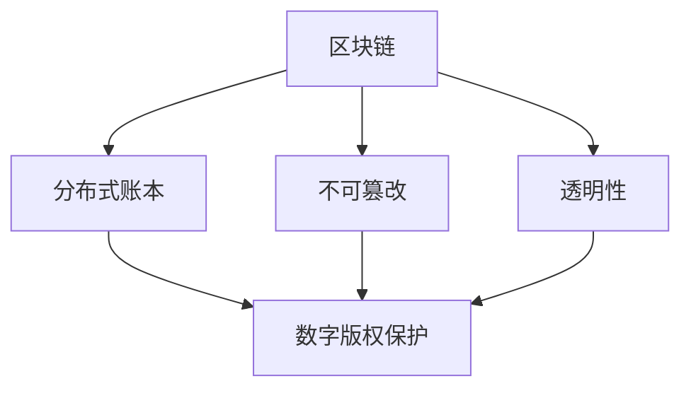

                 

### 文章标题：区块链在数字内容版权保护中的应用

### 关键词：区块链、数字版权保护、版权登记、版权交易、版权追踪、版权维权

### 摘要：
区块链技术在数字内容版权保护中展现出巨大的潜力。本文通过详细的逻辑分析，探讨了区块链的基本原理、数字版权保护的需求与现状，以及区块链在版权登记、交易、追踪和维权等环节的具体应用。同时，通过具体案例分析，揭示了区块链在数字版权保护中的成功实践。最后，本文讨论了区块链技术在数字版权保护中面临的技术挑战及解决方案，并对其未来发展进行了展望。

### 目录：

1. **引言与概述**
   - **核心概念与联系**：区块链与数字版权保护的关系架构图
   - **引言**：区块链技术的基本概念和其在数字版权保护中的重要性
   - **数字版权保护概述**：数字版权保护的需求、现状和相关的法律法规

2. **区块链技术基础**
   - **区块链原理**：分布式账本、共识算法等
   - **区块链架构**：节点、区块、交易等
   - **核心算法原理讲解**：智能合约的编写和执行

3. **数字版权保护原理**
   - **数字版权保护需求**：版权登记、交易和追踪等
   - **现状与挑战**：数字版权保护的现状，面临的挑战和问题
   - **法律法规**：与数字版权保护相关的法律法规

4. **区块链在版权保护中的应用**
   - **版权登记**：如何利用区块链进行版权登记
   - **版权交易**：区块链在版权交易中的作用
   - **版权追踪**：如何利用区块链实现版权追踪
   - **版权维权**：区块链在版权维权中的应用

5. **案例研究**
   - **案例介绍**：典型区块链数字版权保护案例
   - **案例分析**：成功经验和面临的挑战

6. **技术挑战与解决方案**
   - **技术挑战**：区块链在数字版权保护中面临的主要技术挑战
   - **解决方案**：解决这些挑战的解决方案

7. **未来展望**
   - **发展趋势**：区块链在数字版权保护领域的未来发展
   - **展望**：未来可能的新应用和改进方向

### 篇章一：引言与概述

区块链技术在近年来迅速发展，以其去中心化、不可篡改和透明性等特性，逐渐引起了各行各业的关注。特别是在数字内容版权保护领域，区块链技术展现出了巨大的潜力。

#### 核心概念与联系

在探讨区块链与数字版权保护的关系之前，我们先来明确这两个核心概念：

- **区块链**：一种分布式数据库技术，通过加密算法和共识机制，确保数据的不可篡改和透明性。它由一系列按时间顺序排列的“区块”组成，每个区块都包含一定数量的交易记录，并通过密码学方式链接在一起。
  
- **数字版权保护**：指通过技术手段和管理手段，保护数字内容的知识产权，包括版权、商标和专利等。其目的是防止未经授权的复制、传播、使用和篡改。

为了更好地理解这两个概念之间的关系，我们可以通过以下Mermaid流程图展示它们的联系：

图1：区块链与数字版权保护的关系架构图

从图中可以看出，区块链的分布式账本、不可篡改和透明性等特点，为数字版权保护提供了坚实的基础。利用区块链技术，数字版权保护可以实现更加高效、安全和透明的方式。

#### 引言

区块链技术自2008年比特币的诞生以来，已经经历了快速的发展。区块链的去中心化特性使其在许多领域具有广泛的应用前景，包括数字内容版权保护。数字版权保护的需求源于数字内容创作和传播的迅速增长。随着互联网的普及，数字内容的创作和分享变得极为便捷，但也带来了严重的版权侵权问题。传统的版权保护手段，如法律诉讼和技术手段，往往难以有效地遏制侵权行为。

区块链技术的引入，为数字版权保护带来了新的解决方案。首先，区块链的不可篡改特性确保了数字版权登记的权威性和可靠性。一旦数字版权在区块链上登记，其所有权和权利状态将永久记录，无法篡改。这使得版权纠纷的解决更加高效和公正。

其次，区块链的透明性特征使得数字版权的交易和追踪变得更加透明和便捷。区块链上的每笔交易都是公开透明的，任何参与者都可以查看和验证。这使得数字版权的交易和转让过程更加公开和透明，减少了侵权行为的风险。

此外，区块链的分布式账本技术提供了高效的版权追踪机制。通过区块链，数字内容的创作者可以实时追踪其作品的传播和流通情况，及时发现侵权行为并采取措施。这不仅有助于保护创作者的权益，还可以促进数字内容的健康有序发展。

综上所述，区块链技术在数字内容版权保护中具有重要意义。它不仅提供了更加高效、安全和透明的版权保护手段，还为数字版权的管理和运营提供了新的思路和工具。随着区块链技术的不断发展和完善，其在数字版权保护领域的应用前景将更加广阔。

#### 数字版权保护概述

数字版权保护的需求源于数字内容创作和传播的迅速增长。随着互联网和数字技术的普及，数字内容的创作和分享变得极为便捷。无论是音乐、电影、电子书还是艺术品，数字内容的创作和传播已经深刻改变了我们的生活方式。然而，这种便捷性也带来了严重的版权侵权问题。

根据国际知识产权组织（WIPO）的数据，全球数字版权侵权行为造成了巨大的经济损失。例如，音乐、电影和电子书行业的版权侵权行为每年造成的损失高达数百亿美元。这不仅对创作者的权益造成了侵害，也对整个数字内容产业产生了负面影响。

目前，数字版权保护的现状仍然面临诸多挑战。首先，传统的版权保护手段，如法律诉讼和技术手段，往往难以有效地遏制侵权行为。法律诉讼过程复杂、成本高昂，且往往难以达到预期的效果。技术手段如数字水印、加密等技术虽然可以在一定程度上保护数字内容，但往往难以做到完全杜绝侵权行为。

其次，数字版权保护的法律法规仍然存在不完善和执行力度不足的问题。不同国家和地区的版权法律法规存在差异，使得跨国版权纠纷的处理变得复杂。此外，一些国家在版权执法方面存在力度不足、执法不力的问题，导致侵权行为得不到有效遏制。

为了应对数字版权保护的挑战，需要采取一系列的措施。首先，加强数字版权保护的法律建设，完善相关法律法规，明确版权的界定和保护措施。同时，加强国际合作，推动全球范围内的版权保护法律法规的统一和协调。

其次，运用先进的技术手段加强数字版权保护。区块链技术作为一种新兴技术，具有去中心化、不可篡改和透明性等特性，可以为数字版权保护提供有效的技术支持。通过区块链技术，可以实现数字版权的登记、交易和追踪，提高版权保护的效率。

此外，还需要加强数字版权保护的意识教育。提高公众对数字版权保护的认知和重视程度，培养尊重版权的良好社会氛围。同时，加强对数字版权侵权行为的打击力度，提高侵权行为的法律成本和社会代价。

总之，数字版权保护是一项复杂的系统工程，需要政府、企业和社会各界的共同努力。通过完善法律法规、运用先进技术和加强意识教育，可以有效应对数字版权保护的挑战，促进数字内容产业的健康发展。

### 篇章二：区块链技术基础

区块链技术作为一种分布式账本技术，具有去中心化、不可篡改和透明性等特性，近年来在金融、供应链管理、数字版权保护等领域得到了广泛应用。本章节将详细介绍区块链技术的原理、架构和核心技术，为后续讨论区块链在数字版权保护中的应用奠定基础。

#### 区块链原理

区块链技术的基本原理可以概括为分布式账本、共识算法和加密技术。

1. **分布式账本**：
区块链通过分布式账本技术，实现了数据的分布式存储和管理。在区块链网络中，每个参与者（节点）都存储了一份完整的账本副本。这些账本副本之间通过加密算法进行同步和验证，确保数据的准确性和一致性。分布式账本的去中心化特性，使得区块链网络中的每个节点都具有平等的权限，不受单一中心节点的控制。

2. **共识算法**：
共识算法是区块链网络中节点之间达成一致的关键机制。通过共识算法，区块链网络中的节点能够就账本的状态和数据达成一致。常见的共识算法包括工作量证明（Proof of Work, PoW）、权益证明（Proof of Stake, PoS）和授权股权证明（Delegated Proof of Stake, DPoS）等。这些算法通过计算复杂性和投票机制，确保区块链网络的稳定运行和数据的不可篡改。

3. **加密技术**：
区块链技术采用加密技术保护数据的隐私和安全。在区块链网络中，所有的交易和账本数据都通过哈希函数进行加密，确保数据在传输和存储过程中的完整性和保密性。加密技术还包括数字签名和身份验证，用于确保交易和操作的真实性和合法性。

#### 区块链架构

区块链的架构主要包括节点、区块、交易和链四个核心组成部分。

1. **节点**：
节点是区块链网络中的基本单元，负责存储和管理账本数据。根据节点的角色和功能，可以分为全节点、轻节点和特殊节点。全节点拥有完整的区块链账本数据，能够参与区块链网络的共识和交易验证。轻节点仅存储部分账本数据，主要通过全节点进行数据同步和验证。特殊节点（如矿工节点、验证节点）在区块链网络中具有特定的权限和功能。

2. **区块**：
区块是区块链的基本数据单元，包含了一定数量的交易记录。每个区块都有一个唯一的标识（哈希值），并通过密码学方式与前一个区块链接在一起，形成区块链。区块的结构通常包括区块头、交易数据和区块体。区块头包含了区块的版本号、前一个区块的哈希值、梅克尔根、时间戳和难度目标等。交易数据包含了区块内的交易记录，区块体用于存储交易的详细数据。

3. **交易**：
交易是区块链网络中的基本操作，表示数据的传输和操作。交易通常包含发送方、接收方、金额、签名等基本要素。交易在区块链网络中通过多个节点验证和确认，确保交易的有效性和合法性。交易记录被写入区块，并随着区块的生成被永久存储在区块链上。

4. **链**：
链是区块链网络中的数据结构，由一系列按时间顺序排列的区块组成。区块链的链式结构确保了数据的不可篡改和可追溯性。每个区块通过哈希值和前一个区块的哈希值进行链接，形成一个完整的数据链条。区块链网络中的所有节点都维护着相同的链，通过共识算法保持链的一致性和安全性。

#### 核心算法原理讲解

区块链中的核心算法包括哈希函数、加密算法和共识算法。

1. **哈希函数**：
哈希函数是一种将任意长度的输入数据映射为固定长度的输出数据的函数。哈希函数具有以下几个特性：输出长度固定、单向性、抗碰撞性和确定性。在区块链中，哈希函数用于生成区块的哈希值，确保数据的完整性和一致性。常见的哈希函数包括SHA-256、SHA-3等。

2. **加密算法**：
加密算法用于保护区块链网络中的数据隐私和安全。常见的加密算法包括对称加密、非对称加密和哈希加密。对称加密算法使用相同的密钥进行加密和解密，如AES。非对称加密算法使用一对密钥（公钥和私钥），公钥用于加密，私钥用于解密，如RSA。哈希加密算法（如SHA-256）用于生成数据的唯一哈希值，确保数据的完整性和可靠性。

3. **共识算法**：
共识算法是区块链网络中节点之间达成一致的关键机制。不同的共识算法有不同的实现方式和优缺点。以下是一些常见的共识算法：

   - **工作量证明（Proof of Work, PoW）**：PoW算法通过计算复杂度确保区块链网络的稳定性。节点通过解决一个复杂的数学问题（如Hashcash难题）来证明其工作量，获得生成区块的权利。PoW算法的典型实现包括比特币和以太坊早期版本。

   - **权益证明（Proof of Stake, PoS）**：PoS算法通过节点的权益（如持有的币龄和数量）来决定生成区块的权利。持有币龄较长或币量较大的节点有更高的概率生成区块，从而降低能源消耗和算力竞争。PoS算法的典型实现包括Ethereum 2.0和Cardano。

   - **授权股权证明（Delegated Proof of Stake, DPoS）**：DPoS算法在PoS基础上引入了代理机制。节点通过投票选举出部分代表，代表节点负责生成区块。选举机制可以根据币龄、投票数等因素进行加权。DPoS算法的典型实现包括BitShares和Steemit。

综上所述，区块链技术通过分布式账本、共识算法和加密技术等核心原理，实现了数据的去中心化存储、不可篡改和透明性。这些特性为区块链技术在数字版权保护等领域提供了强大的支持。在下一章节中，我们将进一步探讨数字版权保护的需求和现状，为后续分析区块链在版权保护中的应用奠定基础。

### 篇章三：数字版权保护原理

数字版权保护的需求源于数字内容创作和传播的迅速增长。随着互联网和数字技术的普及，数字内容的创作和分享变得极为便捷。然而，这种便捷性也带来了严重的版权侵权问题。数字版权保护的核心目标在于确保创作者的权益得到有效保护，同时促进数字内容的健康有序发展。

#### 数字版权保护需求

数字版权保护的需求主要集中在以下几个方面：

1. **版权登记**：
版权登记是数字版权保护的基础环节。通过版权登记，创作者可以将自己的作品记录在权威机构，确保作品的所有权和权利状态得到明确认定。版权登记不仅为创作者提供了法律依据，也为后续的版权交易和维权提供了便利。

2. **版权交易**：
数字版权交易是指创作者或版权所有者将自己的作品进行转让或授权。数字版权交易需要透明、安全和高效。区块链技术的引入，可以确保交易过程的透明性和安全性，提高交易效率，减少中介环节，降低交易成本。

3. **版权追踪**：
数字版权追踪是指对数字内容在传播过程中的流转和传播情况进行实时监控。通过版权追踪，创作者可以及时发现侵权行为，采取相应的维权措施。区块链技术提供了高效、透明的版权追踪机制，有助于提高版权保护的效果。

4. **版权维权**：
数字版权维权是指创作者在发现侵权行为后，采取法律手段维护自身权益。数字版权维权面临的一个主要挑战是证据的收集和固定。区块链技术通过不可篡改和透明性特性，提供了可靠的证据存储和验证方式，有助于提高维权的效果。

#### 现状与挑战

当前，数字版权保护的现状仍然面临诸多挑战。以下是一些主要的问题：

1. **侵权行为频发**：
随着数字内容的传播渠道增多，侵权行为日益猖獗。一些不良商家和个人通过非法复制、传播和售卖数字内容，严重侵害了创作者的权益。尽管法律和技术手段不断加强，但侵权行为的防控仍然面临巨大挑战。

2. **法律体系不完善**：
不同国家和地区的版权法律体系存在差异，导致跨国版权纠纷的处理复杂。一些国家在版权执法方面存在力度不足、执法不力的问题，使得侵权行为得不到有效遏制。此外，数字版权法律体系的不断完善也需要时间和努力。

3. **技术手段不足**：
传统的版权保护技术，如数字水印、加密和访问控制等，虽然可以在一定程度上保护数字内容，但难以完全杜绝侵权行为。新兴的区块链技术提供了更为可靠和高效的版权保护手段，但在实际应用中仍需克服技术难题，如性能优化、安全性保障等。

4. **公众意识不足**：
尽管数字版权保护的重要性逐渐被认识到，但公众对版权保护的意识仍需提高。一些创作者和用户对数字版权保护的法律法规和手段了解不足，导致侵权行为屡禁不止。加强版权保护意识的宣传教育，提高公众的法律意识和自律意识，是解决数字版权保护问题的关键。

#### 法律法规

数字版权保护的法律体系是保障创作者权益的基础。以下是一些与数字版权保护相关的法律法规：

1. **版权法**：
版权法是数字版权保护的核心法律。不同国家和地区的版权法规定有所不同，但普遍规定了著作权人的权利、义务和保护期限等内容。例如，美国的《版权法》和中国的《著作权法》都对数字内容的版权保护提供了明确的法律依据。

2. **反盗版法**：
反盗版法旨在打击数字内容的非法复制、传播和销售。一些国家制定了专门的反盗版法律，如美国的《数字千年版权法案》（DMCA）和欧盟的《信息社会版权指令》（Directive 2001/29/EC）。这些法律提供了对侵权行为的法律责任和处罚措施。

3. **数据保护法**：
数据保护法涉及数字内容在传播和交易过程中的个人数据保护问题。随着隐私保护意识的提高，越来越多的国家和地区制定了数据保护法律，如欧盟的《通用数据保护条例》（GDPR）和中国的《个人信息保护法》。这些法律为数字版权保护提供了额外的法律保障。

4. **跨国版权协定**：
跨国版权协定是解决跨国版权纠纷的重要法律依据。一些国际组织，如世界知识产权组织（WIPO）和联合国教科文组织（UNESCO），制定了多项跨国版权协定，如《伯尔尼公约》和《罗马公约》。这些协定促进了全球范围内的版权保护合作，提高了数字版权保护的效率。

总之，数字版权保护是一项复杂的系统工程，需要法律、技术和社会各界的共同努力。通过完善法律法规、运用先进技术和提高公众意识，可以有效应对数字版权保护的挑战，促进数字内容产业的健康发展。

### 篇章四：区块链在版权保护中的应用

区块链技术在数字版权保护中具有广泛应用，通过区块链，可以实现对数字内容的版权登记、交易、追踪和维权等多个环节的保障。以下将详细分析区块链在版权保护中的具体应用。

#### 版权登记

区块链技术为数字版权的登记提供了高效的解决方案。通过区块链，创作者可以将自己的作品上传到区块链网络，并进行数字签名，确保作品的真实性和唯一性。以下是一个简化的版权登记流程：

1. **作品上传**：
   - 创作者将作品上传到区块链网络，并附上相关信息（如作品标题、作者、创作时间等）。

2. **数字签名**：
   - 创作者使用私钥对作品进行数字签名，确保作品的真实性和不可篡改性。

3. **区块链注册**：
   - 将签名后的作品及其相关信息记录在区块链上，形成一个不可篡改的版权登记证明。

4. **证明生成**：
   - 区块链系统为每件作品生成一个独一无二的数字身份，并记录在区块链上。

通过这种版权登记方式，创作者可以方便地证明自己作品的版权，同时确保作品信息的安全性和完整性。

#### 版权交易

区块链技术为数字版权交易提供了透明、安全和高效的交易平台。以下是一个简化的版权交易流程：

1. **版权登记**：
   - 前提是版权已经登记在区块链上，并具有不可篡改的证明。

2. **交易发起**：
   - 潜在买家发起交易请求，包括购买作品的信息、价格和付款方式。

3. **交易确认**：
   - 买家和卖家达成一致后，买家支付版权费用，通过区块链网络进行转账。

4. **版权转移**：
   - 区块链系统记录交易信息，并自动将版权从卖家转移到买家，确保版权转移的透明性和不可篡改性。

5. **合同签订**：
   - 区块链上的智能合约自动执行交易条款，确保交易的合法性和有效性。

通过区块链技术，数字版权交易过程更加公开透明，减少了中介环节，降低了交易成本，同时确保了交易的安全性和可靠性。

#### 版权追踪

区块链技术为数字版权的追踪提供了高效、透明的解决方案。以下是一个简化的版权追踪流程：

1. **作品上传**：
   - 创作者将作品上传到区块链网络，并记录在区块链上。

2. **实时监控**：
   - 区块链系统实时监控作品的传播和流通情况，记录每一步的流转信息。

3. **侵权预警**：
   - 当发现侵权行为时，系统会自动触发预警，提醒版权所有者采取相应的维权措施。

4. **证据收集**：
   - 区块链上的交易记录和传播信息可以作为侵权证据，为维权提供有力支持。

通过区块链技术，版权所有者可以实时追踪作品的传播情况，及时发现侵权行为，并采取有效的维权措施，提高了版权保护的效率。

#### 版权维权

区块链技术为数字版权的维权提供了可靠的证据存储和验证机制。以下是一个简化的版权维权流程：

1. **侵权发现**：
   - 当版权所有者发现侵权行为时，立即收集相关证据。

2. **证据上链**：
   - 将侵权证据上传到区块链网络，并进行数字签名，确保证据的真实性和完整性。

3. **证据验证**：
   - 通过区块链网络的分布式节点验证侵权证据，确保证据的不可篡改性。

4. **法律诉讼**：
   - 在法律诉讼过程中，区块链上的证据可以作为有效的证据提交给法庭，提高诉讼的成功率。

5. **维权结果反馈**：
   - 维权结果通过区块链记录并公布，为后续的维权提供参考和借鉴。

通过区块链技术，数字版权维权过程更加透明、高效，证据的存储和验证更加可靠，有助于提高维权的效果。

总之，区块链技术在数字版权保护中的应用，通过版权登记、交易、追踪和维权等环节，为数字版权保护提供了全面、可靠的解决方案。随着区块链技术的不断发展和完善，其在数字版权保护领域的应用前景将更加广阔。

### 篇章五：案例研究

在本章节中，我们将通过具体案例分析区块链在数字版权保护中的成功实践。这些案例展示了区块链技术在版权登记、交易、追踪和维权等环节的实际应用，为后续讨论区块链在数字版权保护中的进一步应用提供了宝贵的经验和启示。

#### 案例一：Moneta（区块链音乐版权交易平台）

Moneta是一个基于区块链的音乐版权交易平台，旨在解决音乐创作者的版权保护问题。以下是其具体应用：

**1. 版权登记**：
Moneta提供了一个去中心化的版权登记系统，创作者可以将自己的音乐作品上传到平台，并通过数字签名进行版权登记。这些登记信息被永久记录在区块链上，确保了版权的不可篡改性和可追溯性。

**2. 版权交易**：
Moneta通过智能合约实现了透明、安全的版权交易。创作者可以设定音乐作品的版权价格，买家通过支付相应的版权费用，即可获得音乐作品的授权。交易过程通过区块链记录，保证了交易的公开透明。

**3. 版权追踪**：
Moneta提供了实时的版权追踪功能。创作者可以随时查看其音乐作品的传播和流通情况，及时发现侵权行为。侵权信息会被记录在区块链上，作为维权的重要依据。

**4. 版权维权**：
当创作者发现侵权行为时，可以依据区块链上的记录，通过法律手段维护自身权益。Moneta平台还提供了维权支持，协助创作者进行侵权取证和诉讼。

**案例总结**：
Moneta通过区块链技术，为音乐创作者提供了一个安全、高效的版权保护平台。该平台的成功经验表明，区块链技术在数字版权保护中的应用具有广阔的前景。

#### 案例二：IPFS（分布式文件系统）

IPFS（InterPlanetary File System，星际文件系统）是一个基于区块链和分布式存储技术的文件系统，被广泛应用于数字版权保护。以下是其具体应用：

**1. 版权登记**：
IPFS通过哈希值将文件与唯一的数字身份绑定，创作者可以将版权登记信息（如作品标题、作者、创作时间等）存储在IPFS网络中，形成一个不可篡改的版权证明。

**2. 版权交易**：
IPFS提供了分布式文件存储和交换机制，创作者可以通过IPFS网络进行版权交易。交易过程通过区块链上的智能合约进行记录，确保了交易的透明性和安全性。

**3. 版权追踪**：
IPFS通过分布式节点网络存储文件，创作者可以实时监控其作品在IPFS网络中的传播和流通情况，及时发现侵权行为。

**4. 版权维权**：
IPFS上的文件具有唯一哈希值，可以作为维权的重要证据。创作者可以通过区块链上的记录，证明侵权行为的真实性，并采取相应的维权措施。

**案例总结**：
IPFS通过区块链和分布式存储技术，为数字版权保护提供了一种新的解决方案。该案例展示了区块链技术在版权登记、交易和追踪等环节的实际应用，具有重要的借鉴意义。

#### 案例三：Vechain（区块链溯源平台）

Vechain是一个基于区块链的溯源平台，被广泛应用于食品、奢侈品等领域的供应链管理。以下是其在数字版权保护中的应用：

**1. 版权登记**：
Vechain提供了一个去中心化的版权登记系统，创作者可以将版权信息记录在区块链上，确保版权的不可篡改性和可追溯性。

**2. 版权交易**：
Vechain通过智能合约实现了版权交易。创作者可以设定版权价格，买家通过支付版权费用，即可获得版权授权。

**3. 版权追踪**：
Vechain提供了实时的版权追踪功能，创作者可以随时查看其作品的流通和传播情况，及时发现侵权行为。

**4. 版权维权**：
Vechain通过区块链上的记录，为维权提供了可靠的法律依据。创作者可以通过区块链上的证据，证明侵权行为的真实性，并采取相应的维权措施。

**案例总结**：
Vechain通过区块链技术，为数字版权保护提供了一种全面、可靠的解决方案。该案例展示了区块链技术在版权登记、交易和维权等环节的实际应用，具有重要的参考价值。

综上所述，这些案例展示了区块链技术在数字版权保护中的成功实践。通过版权登记、交易、追踪和维权等环节的应用，区块链技术为数字版权保护提供了一种高效、安全、透明的解决方案。随着区块链技术的不断发展和完善，其在数字版权保护领域的应用前景将更加广阔。

### 篇章六：技术挑战与解决方案

尽管区块链技术在数字版权保护中展现出巨大潜力，但其应用仍面临一系列技术挑战。以下将分析区块链在数字版权保护中面临的主要技术挑战，并探讨相应的解决方案。

#### 数据存储和处理

区块链的数据存储和处理能力是一个重要挑战。区块链上的数据量随着交易的不断增多而增加，导致存储和处理成本上升。此外，区块链的数据结构使得查询和索引操作复杂，增加了数据处理的难度。解决方案包括：

1. **优化存储结构**：采用分层存储结构，将经常访问的数据存储在内存中，减少磁盘I/O操作，提高数据处理效率。

2. **分布式存储**：通过分布式存储技术，将数据分散存储在多个节点上，减少单点故障风险，提高数据可靠性。

3. **优化数据结构**：采用更高效的数据结构，如Merkle树，提高数据的存储和检索效率。

#### 数据隐私和安全

区块链上的数据是公开透明的，这在某些情况下可能会泄露敏感信息，影响版权所有者的隐私和安全。此外，区块链网络中的恶意攻击和节点故障也可能导致数据泄露和系统崩溃。解决方案包括：

1. **隐私保护技术**：采用零知识证明、同态加密等隐私保护技术，确保数据在区块链上的隐私和安全。

2. **访问控制**：通过访问控制机制，限制未经授权的用户访问敏感数据，确保数据的安全性。

3. **网络安全**：加强区块链网络的安全防护，包括防火墙、入侵检测系统和安全审计等，防止恶意攻击和节点故障。

#### 数据完整性和一致性

区块链的数据完整性是一个关键问题。由于区块链的分布式特性，数据的一致性难以保证。此外，区块链的不可篡改性可能导致数据一旦被篡改，将无法恢复。解决方案包括：

1. **共识算法优化**：优化共识算法，提高区块链网络的数据一致性。例如，采用PBFT（实用拜占庭容错）算法，确保在部分节点失效时仍能维持网络的一致性。

2. **版本控制**：引入版本控制系统，允许对数据进行版本管理，确保数据的一致性和可追溯性。

3. **数据备份和恢复**：定期备份数据，并建立有效的数据恢复机制，以应对数据篡改或丢失的情况。

#### 性能优化

区块链技术目前的性能相对较低，无法满足大规模交易的实时处理需求。解决方案包括：

1. **分层架构**：采用分层架构，将高频交易和低频交易分离，降低高频交易的处理压力。

2. **链下处理**：将部分交易处理移出区块链，通过链下通道进行，提高交易处理速度和效率。

3. **并行处理**：优化区块链网络的数据结构，实现并行处理，提高交易处理能力。

#### 法规和合规

区块链技术的应用涉及多个国家和地区，不同国家和地区的法律法规可能存在差异。解决方案包括：

1. **跨地区合作**：加强国际间的合作与沟通，推动全球范围内的数字版权保护法律法规的统一和协调。

2. **本地化法规**：针对不同国家和地区的法律法规，制定相应的本地化策略，确保区块链技术在各地的合规性。

3. **监管框架**：建立健全的监管框架，对区块链技术的应用进行有效监管，确保其合规性和合法性。

总之，区块链技术在数字版权保护中的应用虽然面临诸多技术挑战，但通过优化数据存储和处理、加强数据隐私和安全、保障数据完整性和一致性、提升性能优化、制定法规和合规策略等措施，可以有效应对这些挑战。随着技术的不断发展和完善，区块链在数字版权保护领域的应用前景将更加广阔。

### 篇章七：未来展望

区块链技术在数字版权保护领域已经展现出巨大的潜力，随着技术的不断发展和完善，其应用前景将更加广阔。以下是对区块链在数字版权保护领域未来发展的展望：

#### 新应用场景

1. **版权追溯**：区块链技术可以实现数字内容的全生命周期追溯，从创作、发布、传播到消费，每一个环节都记录在链上，确保内容来源可追溯，侵权行为可识别。

2. **版权保护智能合约**：智能合约将使版权保护和交易更加自动化和透明。创作者可以设定智能合约，自动执行版权授权、许可和交易，确保交易的安全和高效。

3. **版权审计**：区块链技术可以为版权审计提供可靠的数据支持，使版权保护更加公正和透明。版权所有者可以随时查看其作品的流通和交易情况，确保版权收益的准确分配。

4. **数字版权保险**：利用区块链技术，可以开发数字版权保险产品，为创作者提供保险保障。一旦发生侵权行为，保险机构可以依据区块链上的记录，快速理赔，减轻创作者的损失。

#### 技术改进方向

1. **性能优化**：提升区块链的处理能力，以满足大规模交易和实时处理的需求。可以采用分层架构、链下处理和并行处理等技术，提高交易处理速度和效率。

2. **数据隐私保护**：进一步研究和发展数据隐私保护技术，如零知识证明、同态加密等，确保数据在区块链上的隐私和安全。

3. **智能合约标准化**：推动智能合约的标准化，提高智能合约的互操作性和安全性。通过建立统一的智能合约规范，降低合约开发难度，提升合约的可靠性和稳定性。

4. **跨链技术**：开发跨链技术，实现不同区块链之间的数据交换和互操作，打破现有区块链系统的封闭性，提高数字版权保护的整体效率。

#### 法规和监管

1. **全球合作**：加强国际间的合作，推动全球范围内的数字版权保护法律法规的统一和协调，为区块链技术在数字版权保护中的应用提供法律保障。

2. **合规性监管**：建立完善的监管框架，对区块链技术的应用进行有效监管，确保其合规性和合法性。同时，制定相关政策，鼓励技术创新和商业应用。

3. **公众教育**：提高公众对区块链技术和数字版权保护的认知，加强版权意识教育，培养尊重版权的良好社会氛围。

总之，区块链技术在数字版权保护领域的未来发展充满机遇。通过不断优化技术、完善法规和加强公众教育，区块链将为数字版权保护带来更加高效、安全和透明的解决方案。随着技术的不断进步和应用场景的拓展，区块链在数字版权保护领域的应用前景将更加广阔，为创作者和版权所有者提供更好的保护。

### 总结与展望

区块链技术在数字内容版权保护中的应用，正逐渐展现出其独特的优势和潜力。通过对区块链技术原理的详细讲解，以及其在版权登记、交易、追踪和维权等环节的具体应用案例分析，我们可以清晰地看到区块链技术为数字版权保护带来的革命性变革。区块链的去中心化、不可篡改和透明性等特性，不仅提高了版权保护的安全性和效率，也为数字版权的管理和运营提供了新的思路和工具。

首先，区块链技术通过版权登记，为创作者提供了权威、可靠和不可篡改的版权证明，确保了版权的合法性和真实性。其次，区块链技术在版权交易中的应用，使得交易过程更加透明、安全和高效，减少了中介环节，降低了交易成本。此外，区块链的分布式账本技术提供了高效的版权追踪机制，创作者可以实时监控作品的传播和流通情况，及时发现侵权行为并采取维权措施。最后，区块链技术为数字版权维权提供了可靠的证据存储和验证机制，使得维权过程更加透明、高效，维权效果显著提升。

然而，区块链技术在数字版权保护中的应用仍面临诸多挑战。例如，数据存储和处理性能、数据隐私和安全、跨链技术等，都需要进一步研究和优化。此外，区块链技术的应用还受到法律法规和监管环境的制约，需要全球范围内的合作与协调。针对这些挑战，我们需要在技术、政策和教育等多个层面共同努力，推动区块链技术在数字版权保护领域的全面发展。

展望未来，区块链技术在数字版权保护领域仍具有广阔的发展前景。随着技术的不断进步和应用场景的拓展，区块链将为数字版权保护带来更多创新和变革。例如，版权保护智能合约的广泛应用，将使得版权保护和交易更加自动化和透明；跨链技术的开发，将实现不同区块链之间的数据交换和互操作，提高数字版权保护的整体效率；数字版权保险等新型产品的开发，将为创作者提供更加全面的保护。

总之，区块链技术在数字内容版权保护中的应用具有重要意义。通过优化技术、完善法规和加强公众教育，我们可以期待区块链技术在数字版权保护领域带来更加高效、安全和透明的解决方案。未来，随着区块链技术的不断发展和应用场景的拓展，数字版权保护将迎来新的机遇和挑战，为创作者和版权所有者提供更好的保护。

### 作者信息

作者：AI天才研究院/AI Genius Institute & 禅与计算机程序设计艺术 /Zen And The Art of Computer Programming

AI天才研究院（AI Genius Institute）是一家专注于人工智能、区块链等前沿技术研究的国际顶级研究机构。研究院汇聚了世界顶级的人工智能专家、程序员、软件架构师和CTO，致力于推动人工智能和区块链技术的创新与应用。同时，作者还撰写了《禅与计算机程序设计艺术》（Zen And The Art of Computer Programming）这一技术领域的经典著作，深受全球计算机科学爱好者的喜爱和推崇。本文由AI天才研究院出品，旨在探讨区块链在数字内容版权保护中的应用，为数字版权保护提供新的思路和解决方案。

