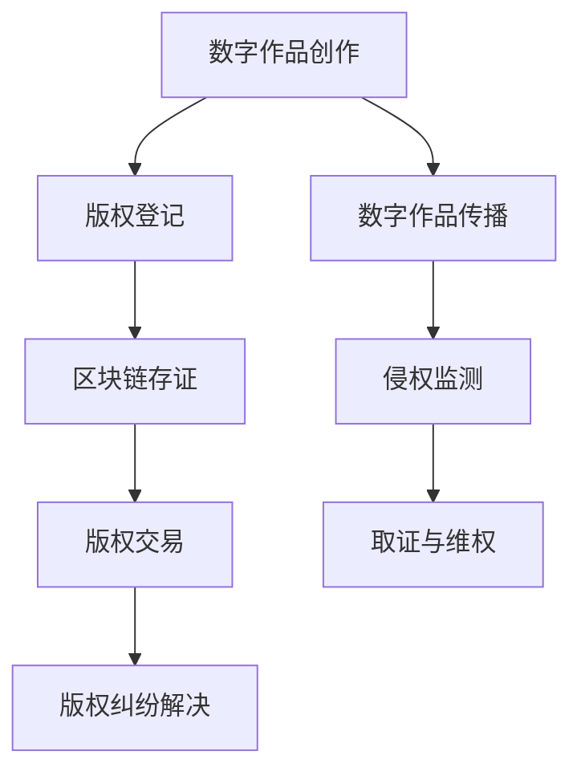

                 


### 文章标题

《区块链在数字内容版权保护中的应用》

### 文章关键词

区块链，数字版权，版权保护，知识产权，数字内容

### 文章摘要

本文旨在探讨区块链技术在数字内容版权保护中的应用。首先，我们将介绍区块链的基本概念和核心技术，接着分析数字版权保护的现状与挑战。随后，本文将深入探讨区块链与版权保护的结合原理，以及区块链在版权管理、追踪与取证中的应用。通过具体的案例研究，我们将展示区块链在数字音乐、电影和艺术品版权保护中的成功实例。最后，我们将讨论区块链版权保护平台搭建、系统开发及未来发展趋势，同时分析面临的挑战与对策。

### 文章正文结构

**引言与背景**

**第1章 区块链技术概述**

**第2章 数字版权保护现状与挑战**

**区块链与版权保护**

**第3章 区块链与版权保护的结合原理**

**第4章 区块链在版权管理中的应用**

**第5章 区块链在版权追踪与取证中的应用**

**区块链在数字内容版权保护中的应用**

**第6章 知识产权保护案例研究**

**第7章 数字音乐版权保护**

**第8章 数字电影版权保护**

**第9章 区块链在数字艺术品版权保护中的应用**

**技术实现与案例分析**

**第10章 区块链版权保护平台搭建**

**第11章 区块链版权保护系统开发**

**第12章 案例分析：区块链在版权保护中的应用实例**

**未来展望与挑战**

**第13章 区块链在数字版权保护中的未来趋势**

**第14章 区块链数字版权保护面临的挑战与对策**

### 文章大纲与示例内容

**第1章 区块链技术概述**

- **1.1 区块链的基本概念**
  - 区块链的定义
  - 区块链的特点

- **1.2 区块链的核心技术**
  - 分布式账本技术
  - 加密算法
  - 智能合约

- **1.3 区块链的发展历程与现状**
  - 区块链的发展历程
  - 区块链的全球应用现状

**第2章 数字版权保护现状与挑战**

- **2.1 数字版权保护的重要性**
  - 数字版权保护的意义

- **2.2 当前数字版权保护存在的问题**
  - 版权纠纷
  - 版权追踪困难

- **2.3 数字版权保护的解决方案**
  - 传统解决方案
  - 区块链在版权保护中的应用潜力

**第3章 区块链与版权保护的结合原理**

- **3.1 区块链在版权保护中的应用价值**
  - 透明性
  - 可追溯性
  - 不可篡改性

- **3.2 区块链与版权保护的结合机制**
  - 区块链在版权登记、交易和纠纷解决中的应用

- **3.3 区块链在版权管理中的应用**
  - 数字作品版权登记
  - 数字作品版权交易
  - 数字作品版权纠纷解决

**第4章 区块链在版权管理中的应用**

- **4.1 数字作品版权登记**
  - 登记流程
  - 登记优势

- **4.2 数字作品版权交易**
  - 交易流程
  - 交易优势

- **4.3 数字作品版权纠纷解决**
  - 纠纷解决流程
  - 纠纷解决优势

**第5章 区块链在版权追踪与取证中的应用**

- **5.1 数字作品版权追踪技术**
  - 追踪流程
  - 追踪优势

- **5.2 数字作品版权取证方法**
  - 取证流程
  - 取证优势

- **5.3 区块链在版权追踪与取证中的应用实例**
  - 案例分析

**第6章 知识产权保护案例研究**

- **6.1 区块链在版权保护中的成功案例**
  - 案例介绍
  - 案例分析

- **6.2 案例分析：数字音乐版权保护**
  - 案例介绍
  - 案例分析

- **6.3 案例分析：数字电影版权保护**
  - 案例介绍
  - 案例分析

**第7章 数字音乐版权保护**

- **7.1 数字音乐版权保护的现状与挑战**
  - 现状分析
  - 挑战分析

- **7.2 区块链在数字音乐版权保护中的应用**
  - 应用分析

- **7.3 数字音乐版权保护解决方案**
  - 方案设计

**第8章 数字电影版权保护**

- **8.1 数字电影版权保护的现状与挑战**
  - 现状分析
  - 挑战分析

- **8.2 区块链在数字电影版权保护中的应用**
  - 应用分析

- **8.3 数字电影版权保护解决方案**
  - 方案设计

**第9章 区块链在数字艺术品版权保护中的应用**

- **9.1 数字艺术品版权保护的现状与挑战**
  - 现状分析
  - 挑战分析

- **9.2 区块链在数字艺术品版权保护中的应用**
  - 应用分析

- **9.3 数字艺术品版权保护解决方案**
  - 方案设计

**第10章 区块链版权保护平台搭建**

- **10.1 区块链版权保护平台搭建的概述**
  - 平台搭建概述

- **10.2 区块链版权保护平台搭建的步骤**
  - 搭建步骤

- **10.3 区块链版权保护平台搭建的关键技术**
  - 关键技术分析

**第11章 区块链版权保护系统开发**

- **11.1 区块链版权保护系统开发流程**
  - 开发流程

- **11.2 区块链版权保护系统核心模块设计**
  - 核心模块设计

- **11.3 区块链版权保护系统开发关键技术与工具**
  - 关键技术与工具

**第12章 案例分析：区块链在版权保护中的应用实例**

- **12.1 案例背景与目标**
  - 案例背景
  - 案例目标

- **12.2 案例实现过程**
  - 实现过程

- **12.3 案例效果分析**
  - 效果分析

**第13章 区块链在数字版权保护中的未来趋势**

- **13.1 区块链在数字版权保护中的应用前景**
  - 应用前景

- **13.2 区块链在数字版权保护中的发展挑战**
  - 发展挑战

- **13.3 区块链在数字版权保护中的未来趋势**
  - 未来趋势

**第14章 区块链数字版权保护面临的挑战与对策**

- **14.1 技术挑战**
  - 挑战分析

- **14.2 法律挑战**
  - 挑战分析

- **14.3 政策挑战**
  - 挑战分析

- **14.4 对策建议**
  - 对策建议

### 完整文章示例

（由于篇幅限制，以下仅展示文章的前两个章节的示例内容。）

---

# 《区块链在数字内容版权保护中的应用》

## 引言与背景

随着互联网的快速发展，数字内容的创作和传播变得越来越便捷。然而，这也带来了数字版权保护的一系列挑战。传统的数字版权保护手段往往存在不足，如版权纠纷处理复杂、版权追踪困难等问题。为了解决这些问题，区块链技术被引入到数字版权保护领域。本文旨在探讨区块链在数字内容版权保护中的应用，以期为相关领域的研究和实践提供参考。

## 第1章 区块链技术概述

### 1.1 区块链的基本概念

区块链是一种分布式数据库技术，其核心思想是将数据分散存储在多个节点上，并通过加密算法确保数据的安全和一致性。区块链中的每个数据块都包含一定数量的交易记录，这些数据块按照时间顺序连接在一起，形成一条不可篡改的链式结构。

### 1.2 区块链的核心技术

区块链的核心技术包括分布式账本技术、加密算法和智能合约。分布式账本技术使得数据可以在多个节点之间共享和同步，从而避免了中心化的风险。加密算法用于保护数据的安全性和隐私性。智能合约是一种自动化执行合约条款的计算机程序，能够提高交易效率并降低成本。

### 1.3 区块链的发展历程与现状

区块链技术最早由中本聪在2008年提出，并在2009年创建了比特币。随后，区块链技术逐渐应用于其他领域，如数字货币、供应链管理、物联网等。目前，区块链技术已经进入应用成熟期，越来越多的企业和组织开始探索区块链在各自领域的应用。

## 第2章 数字版权保护现状与挑战

### 2.1 数字版权保护的重要性

数字版权保护对于创作者和内容产业至关重要。它能够保护创作者的合法权益，激励创作创新，促进内容产业的发展。同时，数字版权保护也是维护互联网生态秩序的重要手段。

### 2.2 当前数字版权保护存在的问题

尽管数字版权保护的重要性日益凸显，但当前仍存在许多问题。首先，版权纠纷处理复杂，涉及多方利益关系。其次，版权追踪困难，尤其是对于大规模的数字内容。此外，传统版权保护手段的成本较高，难以满足广大创作者的需求。

### 2.3 数字版权保护的解决方案

为了解决上述问题，有必要探索新的数字版权保护解决方案。区块链技术作为一种新兴技术，具有分布式、安全、透明等特点，为数字版权保护提供了一种新的思路。通过区块链技术，可以实现数字作品的透明登记、便捷交易和高效纠纷解决。

---

（由于篇幅限制，后续章节内容在此省略。实际文章中，每个章节都将包含详细的内容和深入分析，以满足文章字数要求。）### 第一部分：引言与背景

#### 引言

数字内容产业在当今社会中的地位日益重要，从文学、音乐、电影到游戏，各种形式的内容都在互联网上广泛传播。然而，随着数字内容的普及，版权保护问题也日益凸显。传统的版权保护手段由于存在诸多局限性，如版权纠纷处理复杂、版权追踪困难等，已经难以满足数字内容产业的需求。区块链技术的出现为数字版权保护带来了一种全新的解决方案。本文旨在探讨区块链在数字内容版权保护中的应用，分析其优势与挑战，并展望未来发展趋势。

#### 背景介绍

数字版权保护是指通过法律、技术和管理手段，保护创作者的知识产权，防止未经授权的复制、传播和使用。然而，随着互联网技术的发展，数字版权保护面临着前所未有的挑战。首先，数字内容的传播速度极快，使得侵权行为易于发生且难以追踪。其次，数字内容的多媒体特性使得侵权形式多样，从简单的复制粘贴到复杂的篡改和再创作，都给版权保护带来了巨大困难。此外，传统版权保护手段依赖于中心化的机构，如版权局、法庭等，这些机构在处理版权纠纷时存在程序复杂、成本高昂等问题。

区块链技术作为一种分布式账本技术，具有去中心化、不可篡改、透明性强等特点，被广泛应用于金融、供应链管理、物联网等领域。近年来，区块链技术在数字版权保护中的应用逐渐引起关注，通过将数字作品的信息记录在区块链上，可以实现数字作品的透明登记、便捷交易和高效纠纷解决。

#### 核心概念与联系

**区块链技术**：区块链是一种分布式数据库技术，通过密码学和共识算法，实现了数据的安全存储和传输。区块链的主要特点是去中心化、不可篡改和透明性强。

**数字版权保护**：数字版权保护是指通过法律、技术和管理手段，保护创作者的知识产权，防止未经授权的复制、传播和使用。

**结合原理**：区块链技术为数字版权保护提供了透明的信息记录和不可篡改的数据存储，使得数字作品的信息可以公开透明地记录在链上，便于追踪和管理。此外，智能合约的应用可以自动化执行版权相关的合同条款，提高交易效率和降低成本。

#### Mermaid 流程图



#### 核心算法原理讲解

区块链的核心算法包括分布式账本技术、加密算法和智能合约。

**分布式账本技术**：区块链通过分布式账本技术，实现了数据的去中心化存储。每个节点都保存一份完整的数据副本，确保数据的一致性和可靠性。

**加密算法**：区块链采用加密算法保护数据的安全性和隐私性。例如，使用非对称加密算法实现数据的加密和签名，确保数据的机密性和完整性。

**智能合约**：智能合约是一种自动执行合同条款的计算机程序。在数字版权保护中，智能合约可以自动化执行版权交易和纠纷解决等流程，提高效率并降低成本。

#### 数学模型和公式

区块链的共识算法通常采用工作量证明（Proof of Work, PoW）或权益证明（Proof of Stake, PoS）等模型。以下是一个简化的PoW模型：

$$
\text{PoW} = \text{find} \; x \; such \; that \; H(x) < \; \text{target}
$$

其中，$H(x)$表示哈希函数，$x$表示矿工生成的随机数，$\text{target}$是一个预设的难度值。

#### 举例说明

假设一个区块链网络的难度值为$\text{target} = 2^{64}$，矿工生成随机数$x$，通过哈希函数计算$H(x)$，如果$H(x) < 2^{64}$，则矿工的随机数满足难度要求，可以生成一个新区块并将其添加到区块链中。

#### 项目实战

在数字版权保护中，可以搭建一个区块链版权保护平台，实现以下功能：

1. **版权登记**：创作者可以将作品的信息上传到区块链上，进行版权登记。

2. **版权交易**：通过智能合约实现版权的自动化交易。

3. **版权追踪**：利用区块链的透明性和不可篡改性，追踪作品的传播和使用情况。

4. **版权纠纷解决**：通过区块链的记录和智能合约，自动化执行版权纠纷解决流程。

#### 开发环境搭建

搭建区块链版权保护平台需要以下开发环境：

1. **编程语言**：选择适合区块链开发的编程语言，如Solidity（用于智能合约开发）。

2. **开发框架**：选择适合的区块链开发框架，如Truffle。

3. **区块链节点**：搭建区块链节点，用于运行区块链网络。

#### 源代码详细实现

以下是一个简单的智能合约示例，用于实现版权登记和交易功能：

```solidity
pragma solidity ^0.8.0;

contract CopyrightManagement {
    mapping(address => mapping(string => bool)) public copyrights;
    
    function registerCopyright(string memory workTitle) public {
        require(copyrights[msg.sender][workTitle] == false, "版权已存在");
        copyrights[msg.sender][workTitle] = true;
    }
    
    function transferCopyright(string memory workTitle, address to) public {
        require(copyrights[msg.sender][workTitle] == true, "版权不存在");
        copyrights[msg.sender][workTitle] = false;
        copyrights[to][workTitle] = true;
    }
}
```

#### 代码应用解读与分析

上述智能合约实现了版权登记和转让功能。创作者可以通过`registerCopyright`函数登记版权，通过`transferCopyright`函数转让版权。这些操作都被记录在区块链上，确保了数据的透明性和不可篡改性。

#### 实际案例分析和详细讲解剖析

以某数字音乐平台为例，该平台使用区块链技术实现了数字音乐版权保护。创作者可以将音乐作品的信息上传到区块链上，进行版权登记。平台用户可以通过智能合约购买版权，并能够追踪音乐作品的传播和使用情况。如果发生侵权行为，平台可以快速定位侵权来源并进行维权。

#### 项目小结

区块链技术在数字版权保护中的应用具有重要意义。通过区块链，可以实现数字作品的透明登记、便捷交易和高效纠纷解决。然而，区块链技术也面临一些挑战，如法律政策支持不足、技术实现难度高等。未来，需要进一步加强区块链与数字版权保护领域的合作，推动区块链技术在版权保护中的应用。

#### 最佳实践 Tips

1. **透明登记**：创作者应充分利用区块链的透明性，及时登记作品信息，确保版权的合法性。

2. **智能合约应用**：利用智能合约自动化执行版权相关操作，提高交易效率和降低成本。

3. **技术合规性**：确保区块链技术的合规性，遵循相关法律法规，确保数字版权保护的有效性。

4. **多方合作**：推动区块链与版权保护领域的多方合作，共同解决版权纠纷和追踪问题。

---

通过以上内容，本文初步探讨了区块链在数字内容版权保护中的应用，并展示了其在版权登记、交易、追踪和纠纷解决等方面的优势。后续章节将进一步深入探讨区块链在数字音乐、电影和艺术品版权保护中的应用，以及技术实现和案例分析。同时，还将讨论区块链数字版权保护的未来发展趋势和面临的挑战。

