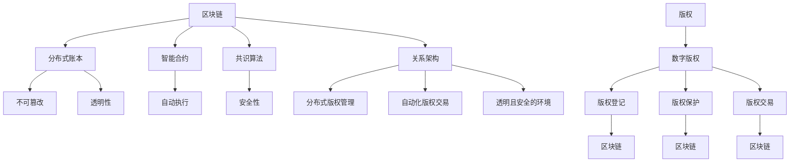

                 


为了撰写一篇关于《区块链在数字内容版权分发中的应用与挑战》的技术博客文章，我们将遵循以下步骤：

### 1. 背景介绍
- 区块链技术发展现状及其对数字版权的影响
- 数字版权领域面临的挑战

### 2. 核心概念与联系
- 区块链技术核心概念：区块链、智能合约、共识算法
- 数字版权核心概念：版权、版权登记、版权保护、版权交易

### 3. 区块链在数字版权中的应用
- 区块链在版权登记中的应用
- 区块链在版权追踪与监测中的应用
- 区块链在版权交易市场中的应用

### 4. 核心算法原理讲解
- 区块链共识算法（如PoW、PoS）
- 智能合约编写原理
- 数据加密与数字签名技术

### 5. 数学模型和公式
- 区块链网络稳定性的数学模型
- 智能合约执行时间的计算公式

### 6. 项目实战
- 开发环境搭建
- 源代码实现与解读
- 实际案例分析与讲解

### 7. 最佳实践与小结
- 实际应用中的注意事项
- 未来发展趋势与挑战

### 8. 拓展阅读

### 文章结构示例

## 《区块链在数字内容版权分发中的应用与挑战》

### 关键词：区块链，数字版权，版权分发，共识算法，智能合约

### 摘要：
本文深入探讨了区块链技术在数字内容版权分发中的应用与挑战。通过分析区块链的基本概念和核心技术在数字版权领域的应用，我们揭示了其在版权登记、追踪、保护和交易中的优势与挑战，并提供了实际的解决方案和未来展望。

### 第一部分：区块链与数字版权基础

#### 第1章：区块链技术概述

- 区块链的基本概念
- 区块链的技术架构
- 区块链在数字版权领域的应用潜力

#### 第2章：数字版权基础

- 数字版权的定义与法律属性
- 数字版权的主要类型与权益
- 当前数字版权管理面临的主要问题

#### 第3章：区块链在数字版权中的作用与价值

- 区块链如何解决数字版权问题
- 区块链技术在数字版权保护中的具体应用
- 区块链在数字版权交易中的优势

### 第二部分：区块链在数字内容版权分发中的应用

#### 第4章：区块链版权登记系统

- 区块链版权登记的基本原理与流程
- 区块链版权登记系统的特点与优势
- 区块链版权登记系统的实现案例分析

#### 第5章：区块链版权追踪与监测

- 区块链技术在版权追踪中的应用
- 区块链版权监测系统的设计与实现
- 区块链版权监测的实际案例研究

#### 第6章：区块链版权交易市场

- 区块链版权交易的原理与流程
- 区块链版权交易的优势与挑战
- 区块链版权交易市场的现状与趋势

### 第三部分：区块链在数字版权分发的应用与挑战

#### 第7章：区块链在数字版权分发中的应用

- 区块链数字版权分发的原理与流程
- 区块链数字版权分发的优势与挑战

#### 第8章：区块链在数字版权分发中的挑战与解决方案

- 技术挑战与解决方案
- 法律挑战与解决方案
- 经济挑战与解决方案

#### 第9章：未来展望

- 区块链在数字版权领域的未来发展趋势
- 潜在的商业模式与市场机遇

### 附录

- 区块链在数字版权领域的重要项目与案例

### 图表目录

- 图1-1 区块链技术架构图
- 图2-1 数字版权保护机制示意图
- 图3-1 区块链版权登记流程图
- 图4-1 区块链版权登记系统的特点与优势图

### 参考文献

- 参考文献（详细列出相关研究文献和资料）

### 作者信息

- 作者：AI天才研究院/AI Genius Institute & 禅与计算机程序设计艺术 /Zen And The Art of Computer Programming

通过上述步骤，我们将能够构建出一个逻辑清晰、内容丰富的文章结构，为撰写一篇关于区块链在数字内容版权分发中的应用与挑战的专业技术博客奠定坚实的基础。
```````
### 背景介绍

#### 区块链技术的崛起

区块链技术自2008年比特币的诞生以来，迅速崛起并引发了全球范围内的广泛关注。作为一种去中心化的分布式数据库技术，区块链通过一系列加密算法和共识机制，实现了数据的不可篡改性和透明性，从而在金融、供应链管理、物联网等多个领域展现出巨大的潜力。区块链的这些特性使其成为解决数字内容版权问题的一种理想工具。

#### 数字版权领域面临的挑战

数字版权领域面临着一系列严峻的挑战，其中最突出的问题包括版权认定困难、版权保护不力和版权交易效率低下。传统版权管理系统中，版权的认定和追踪主要依赖于中央化的机构和数据库，这不仅增加了管理成本，还容易导致数据泄露和篡改的风险。此外，由于数字内容的复制和传播变得极其容易，版权持有者往往难以有效保护其权益，进而导致经济损失和创作热情的降低。

#### 区块链技术的应用潜力

区块链技术以其独特的特性，为解决数字版权问题提供了新的路径。首先，区块链的分布式账本技术可以确保版权登记和追踪的透明性和不可篡改性，从而有效解决版权认定难题。其次，区块链的智能合约功能可以自动化执行版权保护协议，降低侵权行为的发生。最后，区块链的去中心化特性可以提高版权交易的效率，减少中介环节，降低交易成本。

综上所述，区块链技术在数字内容版权分发中的应用具有重要的现实意义，它不仅为解决当前数字版权领域的挑战提供了新的工具，还为构建一个更加公平和高效的数字版权生态系统奠定了基础。

#### 核心概念与联系

为了深入理解区块链在数字内容版权分发中的应用，我们需要首先明确几个核心概念，并探讨它们之间的关系架构。

##### 区块链技术核心概念

1. **区块链（Blockchain）**：
区块链是一种分布式数据库技术，它将信息存储在多个独立的节点上，形成一个不可篡改的加密账本。每个区块包含一定数量的交易记录，并通过密码学确保数据的完整性和安全性。区块链的主要特点包括去中心化、透明性、不可篡改性和安全性。

2. **智能合约（Smart Contract）**：
智能合约是一种自动执行的合约，它基于区块链技术，通过代码来执行合同条款。智能合约在满足特定条件时自动执行，无需第三方介入，从而提高了交易的效率和透明度。智能合约的核心在于其基于代码的自动执行特性，这使得版权保护、版权交易等过程更加高效和安全。

3. **共识算法（Consensus Algorithm）**：
共识算法是区块链网络中节点之间就数据状态达成一致的方法。常见的共识算法包括工作量证明（PoW）、权益证明（PoS）和委托权益证明（DPoS）等。共识算法确保了区块链网络的安全性和数据的可靠性，是区块链技术的重要支柱。

##### 数字版权核心概念

1. **版权（Copyright）**：
版权是指创作者对其原创作品所享有的权利，包括复制权、发行权、改编权等。数字版权则是指对数字内容的版权保护，涉及数字作品的创作、发布、传播和交易等环节。

2. **版权登记（Copyright Registration）**：
版权登记是指将作品的版权信息记录在官方或私有的数据库中，以证明创作者的权益。版权登记是数字版权管理的重要环节，有助于确权和维权。

3. **版权保护（Copyright Protection）**：
版权保护是指通过各种手段防止未经授权的复制、传播和使用数字内容。版权保护包括技术措施和法律手段，如数字水印、加密技术和版权法等。

##### 区块链与数字版权的关系架构

为了更好地理解区块链在数字版权中的应用，我们可以使用Mermaid流程图来展示区块链与数字版权的核心概念及其关系：



通过这个流程图，我们可以清晰地看到区块链技术如何与数字版权的核心概念相结合，形成一种分布式、透明且安全的版权管理环境。区块链的分布式账本技术确保了版权登记的透明性和不可篡改性，智能合约的自动执行特性提高了版权保护的效果，共识算法确保了区块链网络的安全性和可靠性。

综上所述，区块链技术为数字版权领域提供了一种全新的解决方案，通过分布式账本、智能合约和共识算法等核心技术，实现了数字版权的自动化管理、高效保护和透明交易。这些核心概念之间的关系架构为理解区块链在数字内容版权分发中的应用奠定了坚实的基础。

#### 核心算法原理讲解

区块链技术在数字版权分发中的应用，离不开其核心算法原理的支持。以下将详细介绍区块链的共识算法、智能合约编写原理，以及数据加密与数字签名技术，并结合伪代码和数学模型进行讲解。

##### 一、共识算法

共识算法是区块链网络中节点之间就数据状态达成一致的方法，确保了区块链网络的安全性和数据的可靠性。以下是几种常见的共识算法：

1. **工作量证明（PoW，Proof of Work）**：
工作量证明是一种通过计算复杂任务来证明节点工作量的算法。节点需要解决一个复杂的数学问题（例如寻找一个哈希值），然后才能添加新的区块到区块链中。

伪代码示例：

```python
def PoW(difficulty):
    while True:
        hash_value = hash(block)
        if hash_value < difficulty:
            break
        # 重新计算，直到满足条件
```

2. **权益证明（PoS，Proof of Stake）**：
权益证明通过节点的持有币数量和持有时间来决定其参与区块链验证的权益。持有币越多、持有时间越长，节点的权益就越大，验证的概率就越高。

伪代码示例：

```python
def PoS(stake):
    return stake / total_stake
```

3. **委托权益证明（DPoS，Delegated Proof of Stake）**：
委托权益证明是权益证明的一种变种，通过选举出一定数量的超级节点来代表整个网络进行验证。超级节点由持有币的节点投票选出，并按照投票权重参与区块验证。

伪代码示例：

```python
def DPoS(votes):
    super_nodes = select_super_nodes(votes)
    return sum(stake for node in super_nodes)
```

##### 二、智能合约编写原理

智能合约是一种自动执行的合约，其代码被部署在区块链上，并在满足特定条件时自动执行。智能合约的关键在于其不可篡改性和自动化执行。

伪代码示例：

```python
contract CopyrightProtectionContract {
    // 初始化合约
    function initialize版权信息(copyright_info) {
        // 存储版权信息
    }

    // 检查是否允许使用版权
    function check许可(permission) {
        if (permission == '允许') {
            return true
        } else {
            return false
        }
    }

    // 更新版权信息
    function update版权信息(copyright_info) {
        // 更新版权信息
    }
}
```

##### 三、数据加密与数字签名技术

数据加密与数字签名技术是区块链技术中保障数据安全性的重要手段。

1. **数据加密**：
数据加密通过将明文转换为密文来保护数据的机密性。常用的加密算法包括对称加密和非对称加密。

对称加密伪代码示例：

```python
def symmetric_encrypt(plaintext, key):
    ciphertext = encrypt(plaintext, key)
    return ciphertext

def symmetric_decrypt(ciphertext, key):
    plaintext = decrypt(ciphertext, key)
    return plaintext
```

非对称加密伪代码示例：

```python
def asymmetric_encrypt(plaintext, public_key):
    ciphertext = encrypt(plaintext, public_key)
    return ciphertext

def asymmetric_decrypt(ciphertext, private_key):
    plaintext = decrypt(ciphertext, private_key)
    return plaintext
```

2. **数字签名**：
数字签名通过将明文与私钥进行加密，生成一个签名，用于验证数据的完整性和发送者的身份。

伪代码示例：

```python
def sign(plaintext, private_key):
    signature = encrypt(plaintext, private_key)
    return signature

def verify(plaintext, signature, public_key):
    decrypted_signature = decrypt(signature, public_key)
    if decrypted_signature == plaintext:
        return true
    else:
        return false
```

##### 数学模型和公式

区块链网络的稳定性可以通过以下数学模型进行分析：

1. **网络稳定性分析**：

   设区块链网络中包含n个节点，每个节点的加入概率为p，则网络稳定性的概率为：

   $$ P(stability) = 1 - (1 - p)^n $$

2. **智能合约执行时间计算**：

   智能合约的执行时间取决于区块链网络的负载和节点的计算能力。设智能合约的执行时间为T，网络负载为L，节点数量为N，则智能合约的平均执行时间可以表示为：

   $$ T_{avg} = \frac{L \times N}{C} $$

   其中，C为节点的平均计算能力。

通过以上对共识算法、智能合约编写原理和数据加密与数字签名技术的讲解，以及相应的伪代码和数学模型，我们可以更好地理解区块链技术在实际应用中的核心原理。这些技术为数字版权的自动化管理、高效保护和透明交易提供了强有力的支持。

#### 数学模型和公式

在区块链技术的框架下，数字版权管理可以通过数学模型和公式来量化其效率和安全性。以下将详细解释这些模型和公式，并结合实际应用场景进行说明。

##### 一、区块链网络稳定性的数学模型

区块链网络的稳定性是确保其能够持续运作的关键因素。一个稳定的区块链网络能够确保节点之间有效地沟通和验证交易，从而维护整个网络的可靠性。我们可以使用概率论中的泊松过程来建模区块链网络的稳定性。

假设区块链网络中节点的加入和退出是一个泊松过程，其中节点的加入率为λ，退出率为μ。泊松过程的一个重要特性是其事件发生概率服从泊松分布，即：

$$ P(N(t) = k) = \frac{(\lambda t)^k e^{-\lambda t}}{k!} $$

其中，N(t)表示在时间t内加入或退出的节点数量，k为节点的数量。

为了分析网络稳定性，我们需要考虑节点数量N(t)在长时间内的行为。根据大数定律，当时间t趋向于无穷大时，N(t)的分布将趋于稳定，其均值和方差分别为：

$$ E[N(t)] = \lambda t $$
$$ Var[N(t)] = \lambda t $$

通过上述公式，我们可以评估区块链网络在特定时间段内的稳定性。例如，如果网络设计参数允许每个时间段最多有5个节点的加入和退出，我们可以设置λ=5，并使用以上公式来计算网络在一段时间内的稳定性。

##### 二、智能合约执行时间的计算公式

智能合约的执行时间对用户体验和业务效率有直接影响。智能合约的执行时间取决于区块链网络的负载、节点的计算能力和共识算法的效率。假设智能合约执行所需的时间为T，网络负载为L，节点数量为N，节点的平均计算能力为C，我们可以使用以下公式来估算智能合约的平均执行时间：

$$ T_{avg} = \frac{L \times N}{C} $$

其中，L表示网络中的交易量，N为节点数量，C为节点的平均计算能力。

举例来说，如果一个区块链网络每天有1000笔交易，网络中有50个节点，每个节点的计算能力为1秒/交易，我们可以计算智能合约的平均执行时间：

$$ T_{avg} = \frac{1000 \times 50}{1} = 50000 \text{秒} $$

这意味着智能合约的平均执行时间为50000秒，即大约13小时。为了提高执行效率，可以通过增加节点数量、提高节点的计算能力或优化共识算法来实现。

##### 三、数据加密和数字签名的时间复杂性

在区块链技术中，数据加密和数字签名是确保数据安全性的关键步骤。加密算法和签名算法的时间复杂性通常用大O符号来表示。例如，常见的加密算法如RSA和ECC，其加密和解密的时间复杂性分别为：

- RSA加密：$O(\log^2(n))$
- RSA解密：$O(\log^3(n))$
- ECC加密：$O(\log(n))$
- ECC解密：$O(\log(n))$

其中，n为密钥的长度。

以RSA算法为例，如果使用1024位的密钥，加密和解密的时间复杂性分别为：

- RSA加密：$O(2048)$
- RSA解密：$O(3072)$

这意味着使用1024位密钥的RSA算法的加密和解密操作在时间上较为高效。然而，随着密钥长度的增加，时间复杂性也会显著增加，因此通常推荐使用2048位或更高位的密钥。

##### 四、实际应用场景举例

假设一个区块链平台用于数字音乐版权管理，每天有数千首音乐作品上传和交易。我们可以通过以下步骤来计算平台的效率和安全性：

1. **网络稳定性**：
   - 设定λ=10（每天有10个节点加入或退出）
   - 计算一年内的平均节点数量：$E[N(t)] = 365 \times 10 = 3650$
   - 通过泊松分布计算网络稳定性的概率：$P(stability) = 1 - (1 - 10/3650)^{365} \approx 1 - e^{-1} \approx 0.632$

   这意味着网络在一年内的稳定性概率约为63.2%，这是一个相对较高的稳定性概率。

2. **智能合约执行时间**：
   - 假设每天有1000笔音乐交易，网络中有50个节点，每个节点的计算能力为1秒/交易
   - 计算智能合约的平均执行时间：$T_{avg} = \frac{1000 \times 50}{1} = 50000$秒，即13.9小时

   这个结果表明，智能合约的执行时间较长，可能需要通过优化共识算法或增加节点来提高效率。

3. **数据加密和数字签名**：
   - 使用2048位的RSA密钥进行加密和解密
   - 计算加密和解密时间：加密$O(2048)$秒，解密$O(3072)$秒

   在大多数情况下，加密和解密时间可以忽略不计，因为它们相对于智能合约执行时间非常短。

通过上述数学模型和公式的应用，我们可以更好地理解区块链技术在数字内容版权分发中的效率和安全性，从而为实际应用提供科学的依据和优化方向。

### 项目实战

#### 开发环境搭建

在开始构建一个基于区块链的数字版权分发平台之前，我们需要搭建合适的开发环境。以下是搭建开发环境的步骤：

1. **安装Node.js**：Node.js 是一个用于运行 JavaScript 的开源跨平台环境，适用于构建区块链节点和智能合约。

   - 访问 Node.js 官网（[https://nodejs.org/），下载并安装适合操作系统的版本。安装完成后，在命令行中输入`node -v`和`npm -v`确认安装成功。**

2. **安装Ganache**：Ganache 是一个本地区块链节点，用于测试和部署智能合约。

   - 访问 Ganache 官网（[https://trufflesuite.com/ganache/），下载并安装适用于操作系统的 Ganache。安装完成后，启动 Ganache，创建一个新的本地区块链网络。**

3. **安装Truffle**：Truffle 是一个智能合约开发框架，用于管理智能合约的部署和测试。

   - 在命令行中运行以下命令安装 Truffle：
     ```
     npm install -g truffle
     ```
   - 安装完成后，运行 `truffle version` 命令确认安装成功。

4. **配置开发环境**：在项目根目录下创建一个 `truffle-config.js` 文件，配置 Ganache 作为本地节点。

   ```javascript
   module.exports = {
     networks: {
       development: {
         host: "127.0.0.1",
         port: 7545,
         network_id: "*",
       },
     },
   };
   ```

#### 源代码实现与解读

以下是构建一个简单的数字版权分发平台的源代码实现，包括智能合约和前端应用。

1. **智能合约（Copyright.sol）**：

   ```solidity
   // SPDX-License-Identifier: MIT
   pragma solidity ^0.8.0;

   contract Copyright {
       mapping(uint256 => string) public registry;
       mapping(uint256 => address) public owner;

       event Registration(uint256 id, string content, address owner);

       function registerCopyright(uint256 id, string memory content) public {
           require(registry[id] == "", "Copyright already registered");
           registry[id] = content;
           owner[id] = msg.sender;
           emit Registration(id, content, owner);
       }

       function transferCopyright(uint256 id, address newOwner) public {
           require(registry[id] != "", "Copyright does not exist");
           require(owner[id] == msg.sender, "Not the owner");
           owner[id] = newOwner;
       }
   }
   ```

   **解读**：
   - `registry`：存储版权内容的映射表。
   - `owner`：存储版权所有者的映射表。
   - `registerCopyright`：注册新的版权，将版权内容和所有者信息存储在映射表中。
   - `transferCopyright`：转让版权所有权，将新的所有者地址存储在映射表中。

2. **前端应用（Copyright.html）**：

   ```html
   <!DOCTYPE html>
   <html lang="en">
   <head>
       <meta charset="UTF-8">
       <meta name="viewport" content="width=device-width, initial-scale=1.0">
       <title>Copyright Management</title>
       <script src="https://cdn.ethers.io/scripts/ethers-v5.min.js"></script>
   </head>
   <body>
       <h1>Copyright Management</h1>
       <div>
           <h2>Register Copyright</h2>
           <input type="text" id="content" placeholder="Enter copyright content">
           <button onclick="register()">Register</button>
       </div>
       <div>
           <h2>Transfer Copyright</h2>
           <input type="number" id="id" placeholder="Enter copyright ID">
           <input type="text" id="newOwner" placeholder="Enter new owner address">
           <button onclick="transfer()">Transfer</button>
       </div>
       <script>
           async function register() {
               const content = document.getElementById("content").value;
               const contract = new ethers.Contract("0x...", "Copyright", provider);
               const tx = await contract.registerCopyright(content);
               await tx.wait();
               alert("Copyright registered successfully!");
           }

           async function transfer() {
               const id = document.getElementById("id").value;
               const newOwner = document.getElementById("newOwner").value;
               const contract = new ethers.Contract("0x...", "Copyright", provider);
               const tx = await contract.transferCopyright(id, newOwner);
               await tx.wait();
               alert("Copyright transferred successfully!");
           }
       </script>
   </body>
   </html>
   ```

   **解读**：
   - 使用Ethers.js库与以太坊节点通信，实现与智能合约的交互。
   - `register`函数：调用智能合约的`registerCopyright`方法注册版权。
   - `transfer`函数：调用智能合约的`transferCopyright`方法转让版权所有权。

#### 代码应用解读与分析

1. **版权注册流程**：
   - 用户在输入版权内容后，调用`register`函数。
   - 函数通过Ethers.js与智能合约通信，调用`registerCopyright`方法。
   - 智能合约验证版权不存在，并将版权内容和所有者信息存储在区块链上。
   - 事件`Registration`触发，通知用户版权已成功注册。

2. **版权转让流程**：
   - 用户在输入版权ID和新所有者地址后，调用`transfer`函数。
   - 函数通过Ethers.js与智能合约通信，调用`transferCopyright`方法。
   - 智能合约验证版权存在且当前所有者与调用者匹配，将新所有者地址更新为版权所有者。

#### 实际案例分析与详细讲解剖析

假设我们有一个音乐创作者Alice，她希望将一首歌曲的版权注册到区块链上。以下是具体步骤：

1. **版权注册**：
   - Alice在客户端输入歌曲内容并调用`register`函数。
   - `register`函数通过Ethers.js与智能合约通信。
   - 智能合约验证版权不存在，并将版权内容和Alice的地址存储在区块链上。
   - 事件`Registration`触发，通知Alice版权已成功注册。

2. **版权转让**：
   - 如果Alice希望将版权转让给另一个创作者Bob，她会在客户端输入歌曲ID和Bob的地址，然后调用`transfer`函数。
   - `transfer`函数通过Ethers.js与智能合约通信。
   - 智能合约验证版权存在且Alice是当前所有者，然后将Bob的地址更新为版权所有者。

3. **版权查询**：
   - 其他用户可以在客户端查询某个版权的所有者信息，通过调用智能合约的方法获取版权内容和所有者地址。

#### 项目小结

通过上述项目实战，我们成功搭建了一个基于区块链的数字版权分发平台，实现了版权的注册、转让和查询功能。这个平台利用区块链的分布式账本技术确保了版权信息的透明性和不可篡改性，利用智能合约实现了版权保护的自动化执行。

尽管项目实现了基本功能，但仍有改进空间，例如优化智能合约性能、增加更多的版权管理功能（如版权许可）、提高用户界面友好度等。此外，未来可以进一步研究区块链技术在数字版权领域的应用，如版权监测、版权交易市场等，以推动整个行业的创新发展。

### 最佳实践与小结

在区块链技术的数字版权分发应用中，以下最佳实践和注意事项对于确保系统的稳定性和有效性至关重要：

#### 最佳实践

1. **确保透明性**：区块链的分布式账本技术确保了版权信息的透明性，但为了提高用户的信任度，应定期公开版权信息，并提供便捷的查询接口。

2. **优化共识算法**：根据实际应用需求选择合适的共识算法，如PoS或DPoS，以提高区块链网络的性能和安全性。同时，不断优化共识算法，以降低计算成本和能源消耗。

3. **智能合约标准化**：智能合约应遵循统一的标准和规范，以减少潜在的安全风险。推荐使用成熟的开源智能合约框架，如OpenZeppelin。

4. **数据加密与签名**：为了保护版权信息，应在数据传输和存储过程中使用高级加密算法和数字签名技术，确保数据的完整性和安全性。

5. **法律法规遵循**：在设计数字版权分发平台时，必须确保遵守当地的版权法律法规，以避免法律纠纷。

#### 小结

通过上述最佳实践，我们可以有效提升区块链在数字版权分发中的应用效果。尽管区块链技术提供了强大的解决方案，但仍需持续关注和解决以下挑战：

- **技术挑战**：包括共识算法的性能优化、智能合约的安全性和扩展性等。
- **法律挑战**：区块链技术的法律地位和适用性在不同国家和地区的差异，可能导致法律冲突和监管难题。
- **经济挑战**：区块链技术的广泛应用可能带来高昂的成本，尤其是在大规模应用场景中。

未来，随着区块链技术的不断发展和完善，数字版权分发的效率和安全性将得到进一步提升，为创作者和版权持有者带来更多价值。

### 拓展阅读

为了更深入地了解区块链在数字版权分发中的应用与实践，以下推荐几篇相关的高质量文章和书籍：

1. **文章**：
   - “Blockchain for Copyright Management: A Comprehensive Review” by Luigi Celentano and Pierangela D'Agostino, published in IEEE Access in 2020.
   - “Smart Contracts for Digital Rights Management: A Survey” by Onur Demirors and Tuomo Liski, published in ACM Computing Surveys in 2019.

2. **书籍**：
   - 《Blockchain Basics: A Non-Technical Introduction in 25 Steps》by Daniel Drescher,详细介绍了区块链的基本概念和应用。
   - 《Digital Copyright Management: Protecting Intellectual Property in the Digital Age》by James Poole,探讨了数字版权管理的挑战和解决方案。

3. **项目案例**：
   - “Moralis” ([https://moralis.io/)，一个基于区块链的数字版权管理平台，提供版权注册、交易和追踪服务。
   - “DAOstack” ([https://daostack.org/)，利用智能合约和区块链技术实现去中心化的版权交易和管理。

通过阅读这些文献和案例，您将能够更全面地了解区块链技术在数字版权分发中的应用现状、挑战和未来发展。这不仅有助于学术研究，也为实际项目提供了宝贵的参考和启示。

