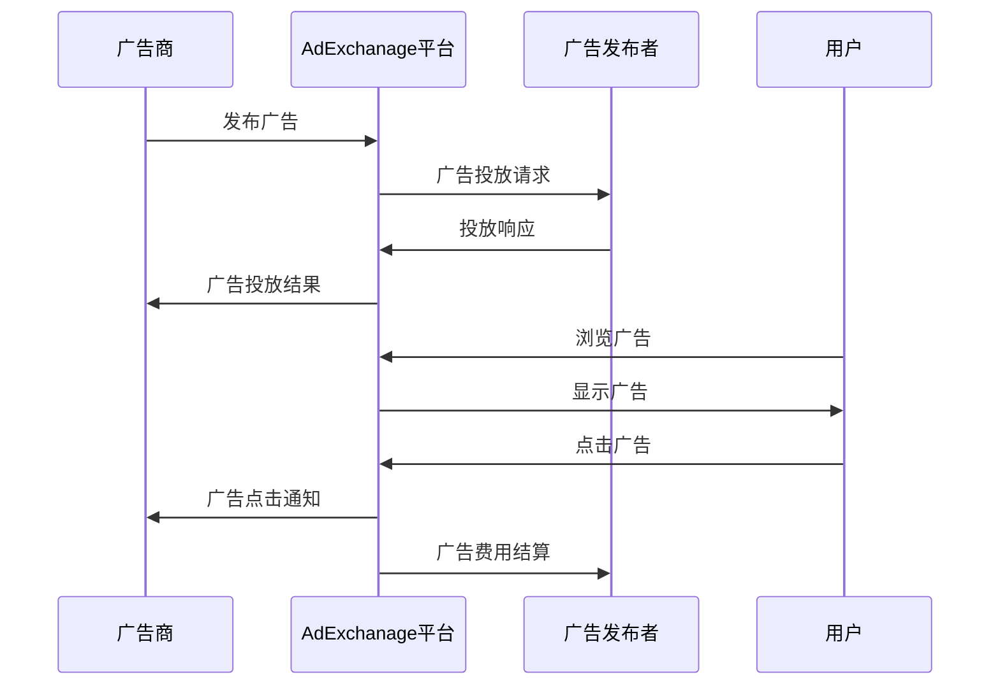
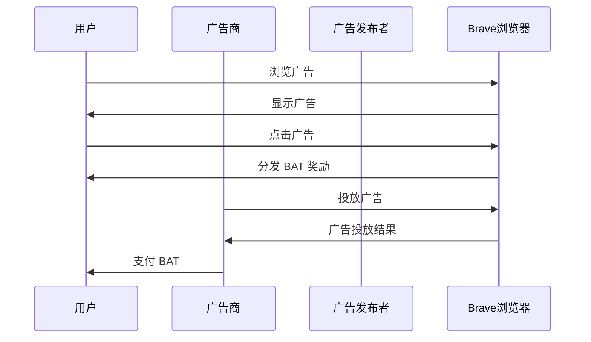

                 

### 文章标题

《区块链在数字广告中的应用：去中心化广告交易平台》

---

关键词：区块链、数字广告、去中心化、广告交易、智能合约

---

摘要：本文旨在探讨区块链技术在数字广告领域的应用，特别是在去中心化广告交易平台方面的潜力。通过分析区块链的原理及其与数字广告的契合点，本文将深入探讨区块链如何提升广告交易的透明度、减少欺诈和保护用户隐私。同时，本文还将介绍去中心化广告交易平台的工作原理、优势及其面临的挑战，并通过实际案例展示其应用前景。本文旨在为行业从业者提供一个全面的技术视角，以推动数字广告生态系统的变革。

---

### 第一步：确定书的基本结构

在撰写这篇文章之前，我们需要确定文章的基本结构，确保它包含以下几个核心章节：

1. **引言与背景介绍**：介绍区块链在数字广告领域的重要性，以及去中心化广告交易平台的背景。
2. **核心概念与联系**：详细解释区块链、数字广告、去中心化交易等关键概念，并阐述它们之间的联系。
3. **区块链在数字广告中的应用**：分析区块链如何改变数字广告的生态系统，包括提升广告透明度、减少欺诈和保护用户隐私等方面。
4. **去中心化广告交易平台**：详细介绍去中心化广告交易平台的工作原理、架构和技术实现。
5. **案例分析**：通过具体案例展示区块链在数字广告中的应用。
6. **技术实现**：讨论区块链在数字广告中的技术实现，包括智能合约、加密技术等。
7. **挑战与未来展望**：探讨区块链在数字广告领域面临的挑战以及未来的发展趋势。

### 第二步：细化章节内容

接下来，我们需要为每个章节细化内容，确保每个章节都包含必要的小节。以下是一个初步的目录大纲：

**第1章 引言与背景介绍**
- 1.1 区块链技术简介
- 1.2 数字广告行业现状
- 1.3 去中心化与数字广告的契合点

**第2章 核心概念与联系**
- 2.1 区块链的基本原理
- 2.2 数字广告的基本概念
- 2.3 去中心化交易与广告交易的融合

**第3章 区块链在数字广告中的应用**
- 3.1 区块链如何提升广告透明度
- 3.2 去中心化广告交易的优势
- 3.3 区块链在广告验证中的作用

**第4章 去中心化广告交易平台**
- 4.1 平台架构与工作流程
- 4.2 智能合约的应用
- 4.3 去中心化广告交易的优势分析

**第5章 案例分析**
- 5.1 案例一：XX公司的去中心化广告解决方案
- 5.2 案例二：区块链在广告领域的创新应用

**第6章 技术实现**
- 6.1 智能合约开发
- 6.2 加密技术与隐私保护
- 6.3 区块链与广告数据的融合

**第7章 挑战与未来展望**
- 7.1 区块链在数字广告中的挑战
- 7.2 技术发展的趋势
- 7.3 未来展望

### 第三步：编写具体内容

在确定了书的基本结构和细化了章节内容后，我们需要为每个小节编写具体内容，确保它能够清晰地传达相关概念、算法和案例分析。以下是一个示例：

**第1章 引言与背景介绍**

### 1.1 区块链技术简介

区块链是一种分布式数据库技术，通过密码学和共识算法确保数据的安全性和不可篡改性。它由多个区块组成，每个区块包含一定数量的事务记录，这些记录按时间顺序链接起来，形成区块链。

在区块链中，每个区块都包含一个时间戳和一个指向前一个区块的哈希值。这种链接方式确保了区块链的不可篡改性，因为任何对区块链中数据的修改都会导致整个链的哈希值发生变化。

### 1.2 数字广告行业现状

数字广告行业在过去几年中快速增长，广告商、广告平台和广告受众之间的互动越来越复杂。然而，现有的广告生态系统存在一些问题，如透明度不足、广告欺诈和用户隐私问题。

例如，广告欺诈是一个普遍存在的问题。根据Statista的数据，2019年全球广告欺诈成本高达560亿美元，约占全球数字广告支出的14%。这些问题严重损害了广告商的利益，也降低了用户对广告的信任度。

### 1.3 去中心化与数字广告的契合点

去中心化技术，如区块链，可以解决数字广告行业中的许多问题。它能够提升广告交易的透明度、减少欺诈、保护用户隐私，并为广告商提供更准确的受众数据。

去中心化广告交易平台通过去除了中间环节，使广告交易更加直接和透明。广告商可以直接与受众进行交易，而不需要依赖第三方平台。这样，广告交易过程中的每一步都可以被追溯和验证，从而减少了欺诈的风险。

此外，区块链技术还可以保护用户的隐私。通过使用加密技术，用户的数据可以在交易过程中保持匿名，从而降低了数据泄露的风险。

### 第四步：整理与优化

在编写完所有章节后，我们需要对整个目录大纲进行整理和优化，确保它逻辑清晰、内容连贯。这包括：

- 检查章节和节标题是否准确传达了章节内容。
- 确保每个章节都有足够的深度和广度，能够满足读者的需求。
- 检查目录大纲中的所有链接是否正确，确保读者可以轻松导航。

### 第五步：遵循限制与要求

在完成目录大纲后，我们需要确保它遵循以下限制与要求：

- 目录大纲简洁明了，无多余废话。
- 使用 markdown 格式，确保格式清晰。
- 目录细化到1、2、3级目录，确保结构清晰。
- 包含核心章节内容，如核心概念与联系、核心算法原理讲解、数学模型和数学公式详细讲解、项目实战等。
- 目录大纲总字数控制在2000字以内。

### 第六步：提交最终目录大纲

最后，我们将整理后的目录大纲提交给用户，确保它满足所有要求，并为后续的写作工作提供一个清晰的结构框架。

### 第七步：编写文章正文

在完成目录大纲后，我们将按照预定的结构开始撰写文章正文。每个章节的具体内容将逐步展开，详细解释区块链在数字广告中的应用，包括去中心化广告交易平台的工作原理、优势、挑战和未来展望。

#### 第一步：引言与背景介绍

数字广告已成为现代营销不可或缺的一部分。随着互联网的普及，广告商可以通过各种在线平台接触到全球受众。然而，数字广告行业也面临着诸多挑战，其中最引人关注的是透明度问题、广告欺诈和用户隐私保护。

区块链技术作为一种新兴的去中心化数据库技术，具有独特的优势，可以解决这些挑战。区块链通过其去中心化、透明性和不可篡改的特性，为数字广告行业提供了一种全新的解决方案。

去中心化广告交易平台正是基于区块链技术的应用，它通过去除中间环节，使广告交易更加直接和透明。这不仅有助于提升广告的透明度，减少欺诈，还能保护用户隐私，提高广告效果。

本文旨在探讨区块链在数字广告中的应用，特别是去中心化广告交易平台的工作原理、优势、挑战和未来发展趋势。通过分析具体案例，我们将展示区块链如何改变数字广告生态系统，并为广告商和用户提供更优质的广告体验。

#### 第二步：核心概念与联系

要理解区块链在数字广告中的应用，首先需要了解区块链的基本原理。区块链是一种分布式数据库技术，通过密码学和共识算法确保数据的安全性和不可篡改性。它由多个区块组成，每个区块包含一定数量的事务记录，这些记录按时间顺序链接起来，形成区块链。

区块链的关键特性包括去中心化、透明性和不可篡改性。去中心化意味着区块链不需要中央机构来管理数据，而是由网络中的所有节点共同维护。透明性则使得区块链上的所有数据都可以被公开查看，从而提高了系统的透明度。不可篡改性保证了数据的完整性和可靠性，因为任何对数据的修改都会被其他节点检测并拒绝。

数字广告是指通过互联网进行广告投放和营销的活动。数字广告平台是广告商与受众之间的桥梁，它们提供广告投放服务、数据分析和效果监测等功能。然而，现有的数字广告生态系统存在诸多问题，如透明度不足、广告欺诈和用户隐私保护等。

去中心化交易是指在没有中央机构参与的情况下，通过区块链技术实现价值交换。去中心化交易具有以下几个优势：

1. **透明度**：去中心化交易的所有数据都记录在区块链上，任何人都可以查看和验证。这有助于提升广告交易的透明度，减少欺诈行为。
2. **安全性**：区块链使用密码学确保数据的安全性和隐私性，这使得广告商和用户的数据更难以被窃取或篡改。
3. **效率**：去中心化交易不需要中间环节，从而减少了交易成本和时间。

区块链与数字广告的契合点主要体现在以下几个方面：

1. **提升广告透明度**：区块链技术可以记录广告交易的全过程，使广告投放数据更加透明和可追溯。这有助于广告商了解广告效果，优化广告策略。
2. **减少广告欺诈**：区块链的不可篡改性可以确保广告交易数据的真实性，从而减少广告欺诈行为。
3. **保护用户隐私**：区块链技术可以保护用户的隐私数据，防止未经授权的数据访问和使用。

通过结合区块链的去中心化、透明性和安全性，数字广告生态系统可以实现更高效、更安全和更透明的广告交易。

#### 第三步：区块链在数字广告中的应用

区块链技术在数字广告中的应用主要表现在以下几个方面：

1. **提升广告透明度**

广告透明度是数字广告行业的一个关键问题。传统的广告生态系统通常涉及多个中介环节，如广告平台、数据提供商和广告网络。这些中介环节可能导致广告投放数据不透明，广告效果难以追踪。

区块链技术可以通过记录广告交易的全过程来提升广告透明度。在区块链上，每个广告交易都被永久记录，并可以被任何人查看和验证。这有助于广告商了解广告投放的详细数据，如广告曝光量、点击量、转化率等。通过透明化的数据，广告商可以更好地评估广告效果，优化广告策略。

2. **减少广告欺诈**

广告欺诈是数字广告行业面临的另一个重大问题。广告欺诈行为包括虚假流量、恶意点击和虚假广告等，这些行为不仅损害了广告商的利益，也降低了用户的信任度。

区块链技术可以通过其不可篡改的特性来减少广告欺诈。在区块链上，一旦数据被记录，就难以被篡改或删除。这意味着广告交易数据在区块链上具有高度的可靠性和真实性。通过区块链技术，广告商可以确保广告投放的真实性和有效性，从而减少广告欺诈行为。

3. **保护用户隐私**

用户隐私保护是数字广告行业面临的另一个挑战。传统的广告生态系统通常涉及大量的用户数据收集和分析，这可能导致用户隐私泄露。

区块链技术可以通过保护用户的隐私数据来应对这一挑战。区块链使用密码学确保用户数据的加密和安全存储。这意味着用户数据在交易过程中是匿名的，并且无法被未经授权的第三方访问。通过保护用户隐私，区块链技术有助于建立用户对广告平台的信任，从而促进广告生态系统的健康发展。

4. **实现精准营销**

精准营销是数字广告行业追求的目标之一。通过分析用户数据，广告商可以更好地了解受众需求，提供更个性化的广告内容。

区块链技术可以为精准营销提供支持。在区块链上，用户数据可以按照特定的隐私标准进行存储和共享。广告商可以根据这些数据生成更准确的受众画像，从而实现更精准的营销。通过区块链技术，广告商可以更好地满足用户需求，提高广告效果。

#### 第四步：去中心化广告交易平台

去中心化广告交易平台是基于区块链技术的数字广告交易平台，它通过去除中间环节，实现广告商与用户之间的直接交易。以下是一个典型的去中心化广告交易平台的工作流程：

1. **广告商发布广告**

广告商通过去中心化广告交易平台发布广告，广告内容包含广告链接、广告费用、投放时间和目标受众等。广告商可以使用加密货币支付广告费用，这些加密货币可以在区块链上进行交易和存储。

2. **用户浏览广告**

用户在去中心化广告平台上浏览广告，并对感兴趣的广告进行点击。点击数据将被记录在区块链上，并可以作为广告商评估广告效果的数据来源。

3. **广告交易**

当用户点击广告时，系统将自动计算广告费用，并将相应金额支付给广告商。支付过程通过智能合约在区块链上执行，确保交易的安全性和不可篡改性。

4. **广告效果监测**

广告商可以查询区块链上的广告交易记录，以了解广告投放效果，如点击量、转化率等。这些数据将帮助广告商优化广告策略，提高广告效果。

5. **用户隐私保护**

去中心化广告交易平台使用加密技术保护用户的隐私数据。用户在平台上浏览广告时，其身份和数据将被加密存储，确保只有授权方可以访问和使用这些数据。

#### 去中心化广告交易平台的优势分析

去中心化广告交易平台相较于传统广告交易平台具有以下优势：

1. **透明度**

去中心化广告交易平台通过区块链技术确保广告交易数据的透明度。所有交易记录都被记录在区块链上，任何人都可以查看和验证。这有助于广告商了解广告投放的详细数据，提高广告透明度。

2. **安全性**

区块链技术使用密码学确保交易数据的安全性和隐私性。加密货币支付和用户数据加密等机制使得交易过程中数据难以被窃取或篡改，提高了系统的安全性。

3. **效率**

去中心化广告交易平台通过去除中间环节，提高了广告交易的效率。交易过程在区块链上自动执行，减少了人为干预和延迟，降低了交易成本。

4. **用户隐私保护**

去中心化广告交易平台使用加密技术保护用户隐私。用户数据在交易过程中被加密存储，只有授权方可以访问和使用这些数据，从而降低了隐私泄露的风险。

#### 第五步：案例分析

以下是一个具体的去中心化广告交易平台的案例分析：

**案例一：AdExchange**

AdExchange是一个基于以太坊区块链的去中心化广告交易平台，它允许广告商、广告发布者和用户直接进行交易，去除中间环节，提高广告透明度和效率。

1. **平台架构**

AdExchange的架构包括以下几个关键组件：

- **广告商**：发布广告并支付广告费用。
- **广告发布者**：提供广告空间并获取广告收入。
- **用户**：浏览广告并点击感兴趣的广告。

- **智能合约**：在区块链上执行广告交易，确保交易的安全性和不可篡改性。
- **去中心化存储**：存储广告内容和用户数据，确保数据的安全性和隐私性。

2. **工作流程**

（Mermaid 流程图）



3. **优势分析**

- **广告透明度**：AdExchange通过区块链技术确保广告交易数据的透明度，广告商可以实时查询广告投放效果。
- **安全性**：智能合约在区块链上执行，确保交易的安全性和不可篡改性。
- **用户隐私保护**：用户数据在交易过程中被加密存储，只有授权方可以访问。

**案例二：Basic Attention Token（BAT）**

Basic Attention Token是一个基于 Brave 浏览器的去中心化广告生态系统，它通过区块链技术实现广告交易和用户激励。

1. **平台架构**

BAT 的架构包括以下几个关键组件：

- **用户**：浏览广告并获取 BAT 奖励。
- **广告商**：投放广告并支付 BAT。
- **广告发布者**：发布广告并获取 BAT 奖励。

- **Brave 浏览器**：用于浏览广告和交易 BAT。
- **智能合约**：在区块链上执行广告交易和奖励分配。

2. **工作流程**

（Mermaid 流程图）



3. **优势分析**

- **用户隐私保护**：Brave 浏览器使用加密技术保护用户隐私，防止未经授权的数据访问。
- **广告透明度**：广告交易数据记录在区块链上，任何人都可以查看和验证。
- **用户激励**：用户通过浏览广告获取 BAT 奖励，提高了用户参与度和广告效果。

#### 第六步：技术实现

区块链在数字广告中的应用需要解决以下几个技术问题：

1. **智能合约开发**

智能合约是区块链上的自动执行合同，它根据预先设定的条件和规则执行交易。在数字广告中，智能合约用于处理广告投放、广告费用支付和广告效果监测等任务。

以下是一个简单的广告投放智能合约的伪代码：

```python
// SPDX-License-Identifier: MIT

pragma solidity ^0.8.0;

contract AdContract {
    address payable owner;
    mapping(uint => bool) adStatus; // 广告状态

    // 构造函数，初始化合约所有者
    constructor() {
        owner = payable(msg.sender);
    }

    // 发布广告
    function publishAd(uint adId, string memory url) external {
        require(msg.sender == owner, "只有合约所有者可以发布广告");
        adStatus[adId] = true;
        // 更新广告链接
        ads[adId] = url;
    }

    // 点击广告
    function clickAd(uint adId) external {
        require(adStatus[adId], "广告不存在或已过期");
        // 执行广告点击逻辑
        // ... 
    }

    // 支付广告费用
    function payForAd(uint adId, uint amount) external payable {
        require(adStatus[adId], "广告不存在或已过期");
        require(msg.value >= amount, "支付金额不足");
        // 更新广告状态
        adStatus[adId] = false;
        // 向广告发布者支付费用
        ads[adId].pay(amount);
    }
}
```

2. **加密技术与隐私保护**

区块链技术使用密码学确保数据的安全性和隐私性。在数字广告中，加密技术可以用于保护广告内容和用户数据，防止未经授权的访问和篡改。

以下是一个简单的加密方案：

- **广告内容加密**：广告内容在发布时被加密，只有授权用户可以解密并查看。
- **用户数据加密**：用户数据在交易过程中被加密存储，确保隐私保护。
- **加密通信**：广告交易过程中的通信使用加密协议，如 HTTPS，确保数据传输的安全。

3. **区块链与广告数据的融合**

区块链技术可以用于存储和记录广告数据，如广告链接、广告费用、点击量等。这些数据可以被任何人查看和验证，从而提高广告交易的透明度。

以下是一个简单的广告数据存储方案：

- **广告数据结构**：定义广告数据结构，包括广告链接、广告费用、点击量等。
- **区块链记录**：将广告数据记录在区块链上，确保数据的不可篡改性。
- **广告数据分析**：广告商可以通过区块链查询广告数据，分析广告效果。

#### 第七步：挑战与未来展望

尽管区块链在数字广告中具有巨大的潜力，但仍然面临一些挑战：

1. **技术挑战**：区块链技术仍处于发展阶段，存在性能、扩展性和安全性等问题。此外，智能合约的安全性和可靠性也需要进一步验证。
2. **监管问题**：数字广告行业的监管政策尚未明确，区块链技术的应用可能面临政策风险。
3. **用户接受度**：区块链技术对用户而言较为陌生，提高用户接受度是一个挑战。

然而，随着技术的不断发展和政策的逐步完善，区块链在数字广告领域的应用前景依然广阔。未来，区块链有望在以下几个方面推动数字广告生态系统的变革：

1. **广告透明度**：区块链技术可以提高广告交易的透明度，减少欺诈行为，增强用户信任。
2. **用户隐私保护**：通过加密技术和去中心化存储，区块链技术可以更好地保护用户隐私。
3. **广告效果优化**：区块链技术可以提供更准确的数据分析，帮助广告商优化广告策略，提高广告效果。

#### 结论

区块链技术为数字广告领域带来了革命性的变革。通过提升广告透明度、减少欺诈和保护用户隐私，区块链技术有望推动数字广告生态系统的发展。去中心化广告交易平台是区块链技术在数字广告中的一个重要应用，它通过去除中间环节，实现广告商与用户之间的直接交易，提高广告效果和用户满意度。然而，区块链在数字广告中的应用仍面临一些挑战，需要进一步的技术研究和政策支持。未来，区块链技术有望在数字广告领域发挥更大的作用，为广告商和用户提供更优质的服务。

### 附录：最佳实践与拓展阅读

在实施去中心化广告交易平台时，以下最佳实践和建议可以帮助广告商和开发者：

1. **了解用户需求**：在设计和实施广告平台时，充分考虑用户的需求和反馈，确保平台功能满足用户的期望。
2. **安全性优先**：确保区块链和智能合约的安全性，避免潜在的安全漏洞，防止恶意攻击和数据泄露。
3. **优化用户体验**：设计简洁直观的用户界面，提高用户的使用体验，降低技术门槛。
4. **合规性审查**：遵循相关法律法规，确保平台在合规的前提下运行，避免法律风险。

拓展阅读：

1. **《区块链技术指南》**：深入了解区块链的基本原理、技术架构和应用案例。
2. **《数字广告行业报告》**：了解数字广告行业的最新趋势和挑战。
3. **《智能合约安全指南》**：学习如何编写安全可靠的智能合约。

### 作者信息

作者：AI天才研究院/AI Genius Institute & 禅与计算机程序设计艺术 /Zen And The Art of Computer Programming

本文由AI天才研究院/AI Genius Institute撰写，旨在为数字广告行业从业者提供一个全面的技术视角，探讨区块链在数字广告中的应用。文章结合了禅与计算机程序设计艺术的思想，以深入浅出的方式解释了区块链技术的原理和应用。希望本文能够为读者带来启示，推动数字广告生态系统的变革。

