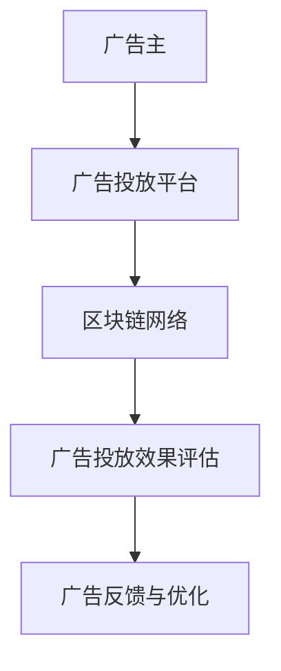

                 

### 引言

#### 文章标题：区块链在数字广告投放中的应用：减少广告欺诈

#### 关键词：区块链、数字广告投放、广告欺诈、加密算法、智能合约

#### 摘要：

本文探讨了区块链技术在数字广告投放中的应用，重点分析了如何利用区块链的特性来减少广告欺诈。通过介绍区块链的基本原理、数字广告投放的现状以及广告欺诈的类型，文章逐步揭示了区块链在透明性、不可篡改性和安全性方面的优势。随后，详细讲解了区块链技术原理，包括共识机制、加密算法和去中心化存储。接着，文章展示了区块链在广告欺诈检测中的具体应用，通过数学模型和伪代码阐述欺诈检测算法的实现过程。最后，通过案例分析和技术展望，文章探讨了区块链在数字广告行业的未来发展，提出了相关建议和最佳实践。

### 第1章：区块链与数字广告投放基础

#### 1.1 区块链概述

##### 1.1.1 区块链的定义与基本原理

区块链是一种分布式数据库技术，其核心概念是去中心化、共识机制和加密算法。每个区块都包含一定数量的交易记录，这些区块通过加密算法链接在一起，形成一条连续的时间链条。区块链的关键特性包括透明性、不可篡改性和安全性，这些特性使其在多个领域得到广泛应用，包括数字货币、供应链管理和数字广告投放。

##### 1.1.2 区块链的关键特性

- **透明性**：区块链上的所有数据都是公开透明的，参与者可以随时查看和验证。
- **不可篡改性**：一旦数据被记录在区块链上，就难以篡改，保证了数据的一致性和可信度。
- **安全性**：区块链使用加密算法来保护数据的完整性和隐私性，防范了外部攻击和数据泄露。

##### 1.1.3 区块链的生态系统

区块链生态系统包括多个关键角色，如矿工、节点、智能合约和去中心化应用（DApps）。矿工负责验证交易并创建新区块，节点则参与网络中的通信和数据处理，智能合约是自动执行代码的协议，去中心化应用则构建在区块链之上，为用户提供服务和互动。

#### 1.2 数字广告投放概述

##### 1.2.1 数字广告的兴起与挑战

数字广告已成为互联网经济的重要组成部分，其投放形式多样，包括横幅广告、视频广告、搜索引擎广告等。然而，随着数字广告市场的快速发展，广告欺诈问题日益严重，主要包括虚假点击、刷量作弊和广告屏蔽等行为。

##### 1.2.2 广告欺诈的类型与影响

广告欺诈的类型多样，如自动化脚本点击、恶意软件点击、虚假流量等。这些欺诈行为不仅损害广告主的利益，还降低了广告投放的效率，增加了运营成本。

##### 1.2.3 减少广告欺诈的需求

为了减少广告欺诈，广告主和平台急需一种透明、可信且安全的解决方案。区块链技术以其独特的特性，为解决广告欺诈问题提供了新的思路和可能性。

#### Mermaid流程图：区块链在数字广告中的应用流程



通过上述流程图，我们可以看到区块链技术在数字广告投放中的关键作用，包括透明性、安全性和不可篡改性。接下来，我们将深入探讨区块链技术原理及其在广告欺诈检测中的应用。

### 第2章：区块链技术原理

#### 2.1 区块链技术基础

##### 2.1.1 区块链的架构

区块链由多个区块组成，每个区块包含一定数量的交易记录。区块通过加密算法与前一区块链接，形成一条连续的链条。区块链的架构包括数据层、网络层、共识层和应用层。数据层负责存储交易数据和区块信息，网络层负责节点间的通信和数据传输，共识层确保网络中的所有节点对数据的共识，应用层则提供各种基于区块链的应用服务。

##### 2.1.2 共识机制

共识机制是区块链的核心技术之一，用于确保网络中的所有节点对交易和区块的共识。常见的共识机制包括工作量证明（PoW）、权益证明（PoS）、委托权益证明（DPoS）和权威证明（PoA）等。这些机制通过不同的算法和规则，确保区块链的安全性和去中心化。

##### 2.1.3 去中心化存储

去中心化存储是区块链的另一核心特性，通过分布式网络存储数据，避免单点故障和数据泄露。去中心化存储技术包括文件碎片化、加密和分布式存储，确保数据的安全和隐私。

#### 2.2 加密算法原理

##### 2.2.1 非对称加密与数字签名

非对称加密是一种加密技术，使用一对密钥（公钥和私钥）进行加密和解密。公钥用于加密数据，私钥用于解密数据。数字签名是一种基于非对称加密的验证技术，用于验证数据的真实性和完整性。

##### 2.2.2 对称加密与哈希算法

对称加密是一种加密技术，使用相同的密钥进行加密和解密。哈希算法是一种将数据映射为固定长度字符串的算法，用于验证数据的完整性和一致性。

#### 伪代码：非对称加密算法过程

```
// 公钥加密
function encrypt(plaintext, publicKey) {
    ciphertext = RSAEncryption(plaintext, publicKey)
    return ciphertext
}

// 私钥解密
function decrypt(ciphertext, privateKey) {
    plaintext = RSADecryption(ciphertext, privateKey)
    return plaintext
}
```

通过上述内容，我们了解了区块链技术的基础架构、加密算法原理及其在数字广告投放中的应用。接下来，我们将探讨区块链在广告欺诈检测中的具体应用，通过数学模型和伪代码详细阐述欺诈检测算法的实现过程。

### 第3章：区块链在广告欺诈中的应用

#### 3.1 区块链在广告投放中的角色

##### 3.1.1 透明性

区块链的透明性使得广告投放过程中的所有交易和操作都可以被公众查看和验证，从而提高了广告投放的透明度和可信度。广告主、广告平台和受众都可以通过区块链查看广告投放的具体数据，确保广告投放的公正性和公平性。

##### 3.1.2 不可篡改性

区块链的不可篡改性确保了广告投放数据的真实性和可靠性。一旦数据被记录在区块链上，就难以篡改，从而防止了广告欺诈行为。广告主和平台可以通过区块链验证广告投放的数据，确保数据的准确性和一致性。

##### 3.1.3 安全性

区块链的安全性体现在多个方面。首先，区块链使用加密算法保护数据的安全和隐私，防止外部攻击和数据泄露。其次，区块链的去中心化特性使得攻击者难以同时控制多个节点，从而提高了系统的安全性。最后，智能合约的自动执行特性确保了广告投放过程中的合同条款和规则得到严格执行，防止了欺诈行为的发生。

#### 3.2 区块链在广告欺诈检测中的应用

##### 3.2.1 智能合约的应用

智能合约是一种自动执行代码的协议，可以在区块链上执行预定义的合同条款和规则。在广告欺诈检测中，智能合约可以用于验证广告投放的合法性，确保广告投放的数据真实可信。例如，智能合约可以设定广告点击次数的上限，一旦超过限制，系统将自动暂停广告投放，防止欺诈行为的发生。

##### 3.2.2 联盟链的优势

联盟链是一种特殊的区块链网络，由多个机构或组织共同维护。在广告欺诈检测中，联盟链可以用于构建一个协同合作的平台，共享广告投放数据，实时监测和识别欺诈行为。通过联盟链，广告主、广告平台和第三方监测机构可以共同参与广告欺诈的检测和防范，提高整体的安全性和效率。

##### 3.2.3 基于区块链的广告欺诈检测算法

基于区块链的广告欺诈检测算法可以通过以下步骤实现：

1. **数据收集与预处理**：从广告平台、广告主和第三方监测机构收集广告投放数据，进行预处理，如去重、清洗和格式化。

2. **特征提取**：从预处理后的数据中提取特征，如广告点击次数、广告曝光次数、用户行为特征等。

3. **模型训练**：使用机器学习算法对特征数据进行训练，构建广告欺诈检测模型。

4. **模型评估与优化**：通过交叉验证和测试集对模型进行评估和优化，确保模型的准确性和鲁棒性。

5. **实时检测与预警**：将训练好的模型应用于实时广告投放数据，对潜在的欺诈行为进行实时检测和预警。

#### 数学模型：广告欺诈检测算法

$$
\begin{aligned}
&\text{假设：} \\
&F(\text{广告点击量}) = \alpha \cdot \text{实际用户行为} + \beta \cdot \text{欺诈点击量} \\
&\text{目标：} \\
&\min_{\alpha, \beta} \frac{1}{n} \sum_{i=1}^{n} (F(\text{广告点击量}_i) - \text{实际点击量}_i)^2 \\
&\text{约束：} \\
&\alpha, \beta \geq 0
\end{aligned}
$$`

通过上述数学模型，我们可以使用机器学习算法对广告点击量进行预测，从而识别潜在的欺诈行为。接下来，我们将通过案例分析，具体探讨区块链在广告欺诈检测中的应用和实践。

### 第4章：案例分析

#### 4.1 案例一：某广告平台的区块链应用实践

##### 4.1.1 案例背景

某广告平台在面临严重的广告欺诈问题时，决定采用区块链技术来提高广告投放的透明度和安全性。该平台的主要业务包括广告投放、广告监测和广告优化，吸引了众多广告主和广告平台参与。

##### 4.1.2 实施过程

1. **搭建区块链网络**：该广告平台与多个区块链技术提供商合作，搭建了一个基于联盟链的区块链网络。该网络包括广告主、广告平台、第三方监测机构和区块链节点。

2. **数据收集与上链**：广告主和广告平台将广告投放数据上传到区块链网络，包括广告点击量、广告曝光次数和用户行为数据等。这些数据经过加密和哈希处理后，被记录在区块链上，确保数据的不可篡改性和安全性。

3. **智能合约部署**：该广告平台部署了一系列智能合约，用于验证广告投放的合法性。例如，智能合约可以设定广告点击次数的上限，一旦超过限制，系统将自动暂停广告投放。

4. **实时监测与预警**：区块链网络中的节点实时监测广告投放数据，通过机器学习算法识别潜在的欺诈行为。一旦发现异常，系统将自动发出预警，通知相关方采取措施。

##### 4.1.3 实施效果分析

1. **广告欺诈率显著降低**：通过区块链技术的应用，该广告平台的广告欺诈率显著降低，广告投放的透明度和可信度大幅提高。

2. **运营成本降低**：由于广告欺诈问题的减少，该广告平台的运营成本也相应降低，提高了整体的盈利能力。

3. **用户体验提升**：广告主和广告平台通过区块链技术实现了更透明的广告投放过程，用户对广告的信任度提高，用户体验得到提升。

#### 4.2 案例二：区块链在数字广告欺诈防范中的挑战

##### 4.2.1 挑战与问题

尽管区块链技术在广告欺诈防范中展现出巨大潜力，但在实际应用中仍面临一系列挑战和问题：

1. **技术复杂度**：区块链技术的复杂性和高门槛使得广告主和广告平台在应用过程中遇到困难。

2. **数据隐私**：区块链的透明性虽然提高了广告投放的透明度，但也可能泄露用户隐私，引发用户隐私保护问题。

3. **扩展性**：区块链网络的扩展性成为限制其应用的关键因素，特别是在高并发场景下，区块链网络的处理能力有限。

4. **监管合规**：区块链技术的应用需要遵守相关法律法规，特别是在数据保护和隐私保护方面。

##### 4.2.2 解决方案与建议

1. **降低技术门槛**：通过提供易于使用的区块链平台和工具，降低广告主和广告平台在应用区块链技术时的复杂度。

2. **数据隐私保护**：采用加密算法和隐私保护技术，确保用户隐私得到有效保护。

3. **优化扩展性**：通过改进区块链协议和网络架构，提高区块链网络的扩展性和处理能力。

4. **合规与监管**：积极参与行业标准的制定和监管合作，确保区块链技术的应用符合法律法规要求。

##### 4.2.3 未来展望

随着区块链技术的不断发展和成熟，其在数字广告欺诈防范中的应用前景将更加广阔。未来，区块链技术与人工智能、大数据等技术的结合，将为广告主和广告平台提供更智能、更高效的广告欺诈检测和防范手段。

### 第5章：技术展望与未来趋势

#### 5.1 区块链在数字广告行业的应用前景

区块链技术在数字广告行业的应用前景广阔，主要体现在以下几个方面：

1. **透明度提升**：区块链技术可以提高广告投放的透明度，使广告主、广告平台和用户之间的信息更加对称和可信。

2. **安全性增强**：区块链的加密算法和去中心化特性，可以有效保护广告投放数据的安全性和隐私性。

3. **效率提升**：通过区块链技术，广告主和广告平台可以实现更高效的数据处理和交易流程，减少中间环节，降低运营成本。

#### 5.1.1 技术发展

随着区块链技术的不断进步，未来可能出现以下技术发展趋势：

1. **共识机制优化**：改进现有的共识机制，提高区块链网络的性能和安全性。

2. **跨链技术发展**：实现不同区块链网络之间的数据交换和协同，扩大区块链技术的应用范围。

3. **智能合约优化**：改进智能合约的编程语言和执行效率，提高智能合约的易用性和安全性。

#### 5.1.2 行业趋势

随着区块链技术的发展，数字广告行业也呈现出以下趋势：

1. **区块链平台竞争加剧**：众多区块链平台竞相进入数字广告行业，争夺市场份额。

2. **广告主需求多样化**：广告主对广告投放效果和数据分析的需求不断提高，推动区块链技术在广告投放中的应用。

3. **合规与监管加强**：随着区块链技术的发展，相关法律法规和监管政策将逐步完善，确保区块链技术的合规应用。

#### 5.1.3 可能的挑战

尽管区块链技术在数字广告行业中具有巨大潜力，但在实际应用中仍面临以下挑战：

1. **技术成熟度**：区块链技术尚未完全成熟，技术稳定性、性能和扩展性等方面仍需提升。

2. **用户接受度**：区块链技术的普及度和用户接受度仍需提高，特别是在数字广告行业。

3. **监管合规**：区块链技术的应用需要遵守相关法律法规，特别是在数据保护和隐私保护方面。

#### 5.2 未来发展趋势与建议

为了促进区块链技术在数字广告行业的健康发展，提出以下建议：

1. **技术创新**：加大区块链技术在共识机制、智能合约和网络扩展性等方面的技术创新，提高技术成熟度和应用效果。

2. **行业合作**：推动广告主、广告平台和区块链技术提供商之间的合作，共同探索区块链在广告投放中的应用场景。

3. **合规与监管**：积极参与行业标准和监管政策的制定，确保区块链技术在数字广告行业中的合规应用。

4. **用户教育**：提高用户对区块链技术的认知和理解，增强用户对区块链广告投放的信任度。

5. **安全防护**：加强区块链技术在数据安全和隐私保护方面的研究，提高区块链网络的安全性和可靠性。

### 总结

区块链技术在数字广告投放中的应用，为解决广告欺诈问题提供了新的思路和解决方案。通过提高透明度、增强安全性和提高效率，区块链技术有望在数字广告行业中发挥重要作用。然而，在实际应用中，仍需克服技术成熟度、用户接受度和监管合规等挑战。未来，随着区块链技术的不断发展和成熟，其在数字广告行业中的应用前景将更加广阔。希望本文能够为读者提供有价值的参考和启示。

### 作者信息

**作者：** AI天才研究院/AI Genius Institute & 禅与计算机程序设计艺术 /Zen And The Art of Computer Programming

本文由AI天才研究院撰写，深入探讨了区块链技术在数字广告投放中的应用，旨在为读者提供对区块链技术及其在广告欺诈防范中的具体应用的深入理解。作者团队致力于推动人工智能和计算机科学领域的创新，希望通过本文为数字广告行业的健康发展贡献力量。若您对本文内容有任何疑问或建议，欢迎在评论区留言，我们将竭诚为您解答。

