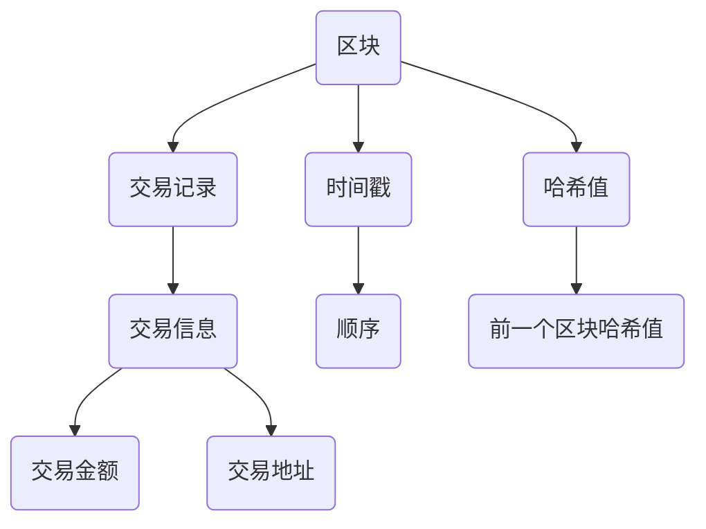
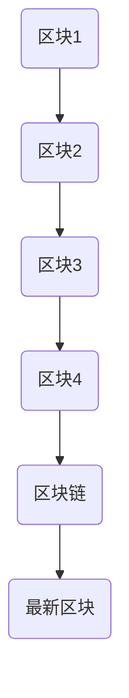
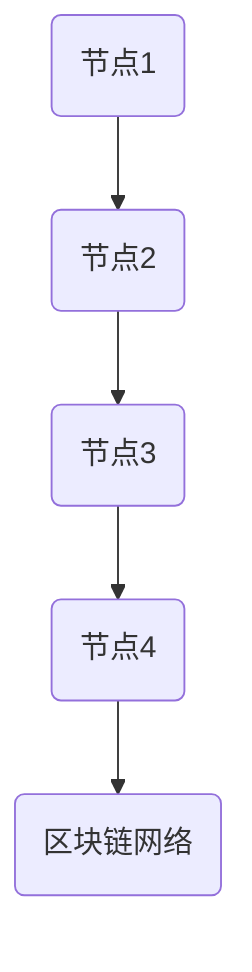

                 

### 文章标题

# 区块链在数字广告投放中的透明化应用

### 文章关键词

- 区块链
- 数字广告投放
- 透明化
- 安全性
- 可信性
- 技术实现
- 案例分析

### 文章摘要

随着数字广告市场的迅速扩张，广告透明化成为行业关注的焦点。区块链技术以其去中心化、不可篡改和透明性等特性，为数字广告投放提供了新的解决方案。本文将深入探讨区块链在数字广告投放中的应用，从背景介绍、核心概念与联系、技术实现、案例分析等方面，详细阐述区块链如何提升广告投放的透明度和可信性，从而为广告主、广告平台和广告受众带来更多价值。文章还将讨论区块链在数字广告领域面临的挑战及未来展望，为行业提供有益的参考。

## 引言

### 区块链技术的发展背景

区块链技术起源于2008年，由一位化名为中本聪（Satoshi Nakamoto）的匿名人物首次提出。区块链是一种分布式账本技术，通过加密算法和共识机制，实现了数据的存储、传输和验证。区块链的核心特点包括去中心化、不可篡改和透明性，使其在金融、供应链、医疗等多个领域取得了显著的应用成果。

### 数字广告投放现状与挑战

数字广告投放作为现代市场营销的重要组成部分，市场规模不断扩大。然而，广告行业的透明化问题也日益突出。广告欺诈、数据泄露、无效流量和广告欺诈等问题屡见不鲜，严重损害了广告主、广告平台和广告受众的权益。传统的解决方案往往依赖于中心化的机构，难以实现真正的透明化和安全性。

### 区块链在数字广告中的潜在应用

区块链技术为解决数字广告投放中的透明化问题提供了新的思路。通过去中心化的方式，区块链可以确保数据的真实性和透明性，防止欺诈行为的发生。此外，区块链的智能合约功能可以实现广告投放的自动化和精确计费，提高效率和降低成本。本文将详细介绍区块链在数字广告投放中的应用，分析其技术优势和实践案例。

### 书籍结构概述

本文分为四个部分：第一部分介绍区块链技术和数字广告投放的现状与挑战；第二部分详细阐述区块链在数字广告中的应用，包括广告验证、广告投放跟踪和广告费用结算等方面；第三部分通过实际案例，分析区块链在数字广告中的实践效果；第四部分讨论区块链在数字广告领域的未来展望与挑战。

### 阅读对象与预期收获

本文旨在为区块链和数字广告领域的从业者和研究者提供有价值的参考。通过阅读本文，读者可以了解区块链在数字广告投放中的具体应用，掌握相关技术原理和实践方法，对区块链技术如何提升广告透明度和可信性有更深入的认识。同时，本文也为行业从业者提供了一些实用的建议和最佳实践，有助于他们在实际工作中更好地应用区块链技术。

### 阅读建议

为了更好地理解本文内容，建议读者具备一定的区块链和数字广告基础知识。本文将采用通俗易懂的语言和丰富的案例，帮助读者逐步掌握区块链在数字广告中的应用。同时，读者可以结合实际工作场景，思考如何将区块链技术应用到数字广告投放中，提高广告效果和透明度。

### 结论

区块链技术在数字广告投放中的透明化应用具有重要意义。通过本文的探讨，我们了解到区块链技术如何通过去中心化、不可篡改和透明性等特性，解决数字广告行业面临的透明化问题。未来，随着区块链技术的不断成熟和应用场景的拓展，我们有理由相信，区块链将为数字广告行业带来更多创新和机遇。让我们共同关注区块链在数字广告领域的应用和发展，探索其无限可能。

## 第一部分：区块链技术基础

### 2.1 区块链的核心概念

区块链是一种分布式数据库系统，其基本组成包括区块、链和节点。每一个区块都包含一定数量的交易记录，这些区块按照时间顺序串联起来，形成区块链。区块链的分布式特性意味着数据被存储在多个节点上，而不是一个中心化的服务器。这种去中心化的架构提高了系统的安全性和容错性。

#### 区块

区块是区块链的基本单位，包含若干笔交易记录、一个时间戳、一个唯一的哈希值以及前一个区块的哈希值。时间戳确保了区块的顺序，哈希值则用于保证区块的不可篡改性。



#### 链

区块链是由一系列按时间顺序排列的区块组成的链。每个区块都包含前一个区块的哈希值，这种链接方式确保了区块链的完整性和不可篡改性。



#### 节点

节点是区块链网络中的参与者，负责验证和存储数据。节点通过共识机制来达成数据一致，并确保区块链的稳定运行。



### 2.2 区块链的去中心化特性

区块链的去中心化特性是其核心优势之一。在传统的中心化系统中，所有数据都存储在一个中心化的服务器上，一旦服务器发生故障，整个系统将无法正常运作。而区块链通过分布式存储的方式，将数据分散存储在多个节点上，从而提高了系统的可靠性和容错性。

去中心化的另一个优点是减少了单点故障的风险。在中心化系统中，单点故障可能导致整个系统瘫痪，而在区块链中，即使某些节点出现故障，其他节点仍能继续正常运作，保证系统稳定。

### 2.3 区块链的加密算法

区块链的加密算法是确保数据安全的关键。常用的加密算法包括哈希算法、数字签名和非对称加密。

- **哈希算法**：哈希算法是一种将任意长度的输入数据转换为固定长度的输出数据的算法。哈希算法的特点是单向性和不可逆性，即无法从输出数据反推出原始数据。常用的哈希算法有SHA-256、SHA-3等。

- **数字签名**：数字签名是一种确保数据完整性和真实性的技术。数字签名使用私钥对数据进行加密，然后使用公钥进行验证。数字签名的主要优点是防伪造和防篡改。

- **非对称加密**：非对称加密是一种加密和解密使用不同密钥的加密技术。加密使用公钥，解密使用私钥。非对称加密的主要优点是保证了数据的机密性和安全性。

### 2.4 区块链的共识机制

共识机制是区块链网络中节点达成一致的关键。不同的区块链平台采用不同的共识机制，常见的共识机制包括工作量证明（PoW）、权益证明（PoS）和委托权益证明（DPoS）。

- **工作量证明（PoW）**：节点通过解决计算难题来证明自己的工作，从而获得记账权。比特币就是采用PoW机制。

- **权益证明（PoS）**：节点根据持有代币的数量和期限来证明自己的权益，获得记账权。相比PoW，PoS机制更加节能和环保。

- **委托权益证明（DPoS）**：节点通过投票选举产生记账节点，获得记账权。DPoS机制具有较高的交易处理能力和安全性。

### 2.5 区块链的优势与挑战

区块链技术的优势包括去中心化、不可篡改、透明性和安全性。然而，区块链技术也面临着一些挑战，如性能瓶颈、隐私保护和监管问题。

- **性能瓶颈**：区块链网络的交易处理能力有限，无法满足某些高并发场景的需求。这需要通过优化区块链算法和网络架构来解决。

- **隐私保护**：区块链的公开透明特性可能导致用户隐私泄露。为了保护用户隐私，可以采用零知识证明等隐私保护技术。

- **监管问题**：区块链技术的去中心化特性可能使其成为非法活动的工具。因此，各国政府需要制定相应的法律法规来规范区块链技术的发展和应用。

### 2.6 区块链的应用领域

区块链技术已广泛应用于金融、供应链、医疗、版权保护等多个领域。以下是一些典型应用案例：

- **金融领域**：比特币、以太坊等加密货币是区块链在金融领域的典型应用。通过区块链，用户可以安全、便捷地进行数字资产的交易和存储。

- **供应链管理**：区块链可以确保供应链信息的透明和不可篡改，帮助企业提高供应链的效率和质量。

- **医疗领域**：区块链可以用于医疗数据的存储和管理，确保患者隐私和数据安全。

- **版权保护**：区块链可以用于版权登记和交易，确保创作者的权益。

### 结论

区块链技术以其去中心化、不可篡改和透明性等特性，为数字广告投放提供了新的解决方案。通过本文的探讨，读者可以了解区块链技术的核心概念和优势，为后续章节中区块链在数字广告中的应用打下基础。在接下来的章节中，我们将详细分析区块链在数字广告投放中的具体应用场景和技术实现。

## 第二部分：数字广告投放流程与透明化需求

### 2.1 数字广告投放流程

数字广告投放流程通常包括以下几个主要环节：

#### 2.1.1 广告主与广告平台对接

广告主首先需要与广告平台进行对接，确定广告投放的目标、预算、时间段和广告形式。这一过程通常涉及广告平台提供的广告管理工具，以及广告主提供的广告素材和相关数据。

#### 2.1.2 广告素材制作与审核

广告主根据广告平台的要求，制作广告素材，包括文本、图片、视频等。广告素材完成后，需要经过广告平台的审核，确保其符合广告规范和法律法规。

#### 2.1.3 广告投放策略制定

广告平台根据广告主的需求，制定广告投放策略，包括投放渠道、投放时段、投放频率、投放地域等。这一过程需要综合考虑广告主的预算和目标受众。

#### 2.1.4 广告投放执行与监控

广告投放执行过程中，广告平台会实时监控广告投放的效果，包括点击率、转化率、曝光量等指标。根据监控数据，广告平台和广告主可以调整广告投放策略，优化广告效果。

#### 2.1.5 广告费用结算

广告投放结束后，广告主需要根据广告效果和投放费用，与广告平台进行结算。这一过程通常涉及广告平台提供的结算工具和结算规则。

### 2.2 透明化需求

在数字广告投放过程中，透明化需求主要体现在以下几个方面：

#### 2.2.1 数据真实性

广告主需要确保广告数据的真实性，包括曝光量、点击率、转化率等。数据真实性是广告投放效果评估的基础，也是广告主和广告平台之间信任的保障。

#### 2.2.2 流量来源

广告主需要了解广告流量的来源，包括投放渠道、地域分布等。这有助于广告主优化广告投放策略，提高广告投放效果。

#### 2.2.3 费用结算

广告主和广告平台需要对广告费用进行透明结算，确保费用的合理性。透明结算有助于减少纠纷和误解，提高双方的合作效率。

#### 2.2.4 广告审核

广告主需要确保广告内容经过严格审核，符合广告规范和法律法规。广告审核的透明性有助于维护广告行业的秩序，保护消费者权益。

### 2.3 透明化需求的原因

数字广告行业的透明化需求主要源于以下几个方面：

#### 2.3.1 防止欺诈行为

广告欺诈行为包括虚假点击、恶意流量等，严重损害了广告主和广告平台的利益。透明化可以有效防止欺诈行为的发生。

#### 2.3.2 提高广告效果

通过透明化，广告主可以更好地了解广告投放的效果，优化广告策略，提高广告投放效果。

#### 2.3.3 增强信任

透明化有助于建立广告主和广告平台之间的信任，提高双方的满意度和合作意愿。

#### 2.3.4 符合法规要求

许多国家和地区已经出台了相关法律法规，要求数字广告投放必须具备透明性。符合法规要求是广告主和广告平台合规运营的基础。

### 2.4 区块链在数字广告透明化中的应用

区块链技术以其去中心化、不可篡改和透明性等特性，为数字广告投放的透明化提供了新的解决方案。以下是一些具体的应用：

#### 2.4.1 数据真实性验证

区块链可以用于验证广告数据的真实性，确保曝光量、点击率、转化率等数据的真实可靠。

#### 2.4.2 流量来源追踪

区块链可以记录广告流量的来源，包括投放渠道、地域分布等，为广告主提供详细的数据分析。

#### 2.4.3 费用结算透明化

区块链可以用于广告费用的结算，确保结算过程公开透明，减少纠纷和误解。

#### 2.4.4 广告审核透明化

区块链可以记录广告审核的过程和结果，确保广告内容的透明性和合规性。

### 结论

数字广告投放的透明化需求日益突出，区块链技术以其独特的优势，为解决广告透明化问题提供了新的思路。在接下来的章节中，我们将详细分析区块链在数字广告投放中的应用，探讨其在广告验证、广告投放跟踪和广告费用结算等方面的具体实现。通过这些分析，我们期望能够为广告主、广告平台和广告受众提供更有价值的参考。

## 第三部分：区块链在数字广告中的应用

### 3.1 区块链在广告验证中的应用

#### 3.1.1 区块链在广告验证中的优势

区块链技术在广告验证中的应用，得益于其去中心化、不可篡改和透明性的特点。以下是区块链在广告验证中的主要优势：

- **去中心化**：传统的广告验证往往依赖于中心化的第三方机构，存在信任风险。区块链的去中心化特性，使得验证过程更加公开透明，不需要依赖中心化的权威机构。

- **不可篡改**：区块链上的数据一旦被记录，就具有不可篡改的特性。这确保了广告数据的真实性和可靠性，有效防止了广告欺诈行为。

- **透明性**：区块链上的数据对所有节点都是可见的，广告验证过程公开透明。广告主和广告平台可以实时查看广告数据的验证结果，提高信任度。

#### 3.1.2 区块链广告验证的技术实现

区块链广告验证的技术实现主要涉及以下几个方面：

- **数据记录**：广告主将广告数据（如曝光量、点击率等）上传到区块链，每个区块都包含一定数量的广告数据。

- **哈希算法**：区块链使用哈希算法来确保数据的唯一性和不可篡改性。每个广告数据都会生成一个哈希值，这个哈希值将作为区块的一部分进行记录。

- **共识机制**：区块链网络中的节点通过共识机制达成数据一致。常见的共识机制包括工作量证明（PoW）、权益证明（PoS）和委托权益证明（DPoS）。

- **智能合约**：智能合约用于自动化执行广告验证规则。当广告数据上传到区块链后，智能合约会根据预定的规则对数据进行验证，并将验证结果记录到区块链上。

#### 3.1.3 伪代码实现

以下是一个简单的伪代码示例，用于描述区块链广告验证的实现过程：

```python
# 广告数据结构
class AdData:
    def __init__(self,曝光量,点击率):
        self.exposure = 曝光量
        self.click_rate = 点击率

# 区块结构
class Block:
    def __init__(self, index, timestamp, prev_hash, data):
        self.index = index
        self.timestamp = timestamp
        self.prev_hash = prev_hash
        self.data = data
        self.hash = self.calculate_hash()

    def calculate_hash(self):
        # 使用哈希算法计算哈希值
        return hashlib.sha256(json.dumps(self.__dict__).encode('utf-8')).hexdigest()

# 智能合约
class AdVerificationSmartContract:
    def __init__(self, blockchain):
        self.blockchain = blockchain

    def verify_ad_data(self, ad_data):
        # 检查广告数据是否符合验证规则
        if ad_data.exposure > 0 and ad_data.click_rate > 0:
            # 将广告数据添加到区块链
            new_block = Block(self.blockchain.get_latest_block().index + 1, time.time(), self.blockchain.get_latest_block().hash, ad_data)
            self.blockchain.add_block(new_block)
            return "验证通过"
        else:
            return "验证失败"

# 区块链
class Blockchain:
    def __init__(self):
        self.chain = []
        self.create_genesis_block()

    def create_genesis_block(self):
        genesis_block = Block(0, time.time(), "0", None)
        genesis_block.hash = genesis_block.calculate_hash()
        self.chain.append(genesis_block)

    def get_latest_block(self):
        return self.chain[-1]

    def add_block(self, new_block):
        # 确认新区块符合链规则
        if self.is_valid_new_block(new_block):
            new_block.prev_hash = self.get_latest_block().hash
            new_block.hash = new_block.calculate_hash()
            self.chain.append(new_block)
            return "区块添加成功"
        else:
            return "区块无效"

    def is_valid_new_block(self, new_block):
        # 确认新区块符合链的规则
        if new_block.index != self.get_latest_block().index + 1:
            return False
        if new_block.prev_hash != self.get_latest_block().hash:
            return False
        if new_block.hash != new_block.calculate_hash():
            return False
        return True
```

#### 3.1.4 实际案例

以下是一个区块链广告验证的实际案例：

- **案例背景**：一家广告平台和广告主合作，广告主希望在广告投放过程中对广告数据（如曝光量、点击率等）进行验证，确保数据的真实性。

- **解决方案**：广告平台开发了一个基于区块链的验证系统，广告主将广告数据上传到区块链，通过智能合约进行验证。广告数据的每个区块都经过多个节点验证，确保数据的真实性和不可篡改性。

- **实施效果**：通过区块链广告验证系统，广告主和广告平台之间的信任度得到了显著提升。广告主可以实时查看广告数据的验证结果，广告平台也可以更准确地评估广告投放效果，优化广告策略。

### 3.2 区块链在广告投放跟踪中的应用

#### 3.2.1 区块链在广告投放跟踪中的优势

区块链技术在广告投放跟踪中的应用，同样受益于其去中心化、不可篡改和透明性的特点。以下是区块链在广告投放跟踪中的主要优势：

- **去中心化**：传统的广告投放跟踪依赖于中心化的数据库，存在数据泄露和篡改的风险。区块链的去中心化特性，使得广告投放数据更加安全。

- **不可篡改**：区块链上的数据一旦记录，就具有不可篡改的特性。这确保了广告投放数据的真实性和可靠性，防止了数据篡改行为。

- **透明性**：区块链上的广告投放数据对所有节点都是可见的，广告主和广告平台可以实时查看广告投放的详细情况，提高了透明度。

#### 3.2.2 区块链广告投放跟踪的技术实现

区块链广告投放跟踪的技术实现主要涉及以下几个方面：

- **数据记录**：广告平台将广告投放数据（如投放渠道、投放时段、点击量等）上传到区块链，每个区块都包含一定数量的广告投放数据。

- **哈希算法**：区块链使用哈希算法来确保数据的唯一性和不可篡改性。每个广告投放数据都会生成一个哈希值，这个哈希值将作为区块的一部分进行记录。

- **共识机制**：区块链网络中的节点通过共识机制达成数据一致。常见的共识机制包括工作量证明（PoW）、权益证明（PoS）和委托权益证明（DPoS）。

- **智能合约**：智能合约用于自动化执行广告投放跟踪规则。当广告投放数据上传到区块链后，智能合约会根据预定的规则对数据进行跟踪，并将跟踪结果记录到区块链上。

#### 3.2.3 伪代码实现

以下是一个简单的伪代码示例，用于描述区块链广告投放跟踪的实现过程：

```python
# 广告投放数据结构
class AdTrackingData:
    def __init__(self, channel, time, clicks):
        self.channel = channel
        self.time = time
        self.clicks = clicks

# 区块结构
class Block:
    def __init__(self, index, timestamp, prev_hash, data):
        self.index = index
        self.timestamp = timestamp
        self.prev_hash = prev_hash
        self.data = data
        self.hash = self.calculate_hash()

    def calculate_hash(self):
        # 使用哈希算法计算哈希值
        return hashlib.sha256(json.dumps(self.__dict__).encode('utf-8')).hexdigest()

# 智能合约
class AdTrackingSmartContract:
    def __init__(self, blockchain):
        self.blockchain = blockchain

    def track_ad_data(self, ad_tracking_data):
        # 检查广告投放数据是否符合跟踪规则
        if ad_tracking_data.clicks > 0:
            # 将广告投放数据添加到区块链
            new_block = Block(self.blockchain.get_latest_block().index + 1, time.time(), self.blockchain.get_latest_block().hash, ad_tracking_data)
            self.blockchain.add_block(new_block)
            return "跟踪成功"
        else:
            return "跟踪失败"

# 区块链
class Blockchain:
    def __init__(self):
        self.chain = []
        self.create_genesis_block()

    def create_genesis_block(self):
        genesis_block = Block(0, time.time(), "0", None)
        genesis_block.hash = genesis_block.calculate_hash()
        self.chain.append(genesis_block)

    def get_latest_block(self):
        return self.chain[-1]

    def add_block(self, new_block):
        # 确认新区块符合链规则
        if self.is_valid_new_block(new_block):
            new_block.prev_hash = self.get_latest_block().hash
            new_block.hash = new_block.calculate_hash()
            self.chain.append(new_block)
            return "区块添加成功"
        else:
            return "区块无效"

    def is_valid_new_block(self, new_block):
        # 确认新区块符合链的规则
        if new_block.index != self.get_latest_block().index + 1:
            return False
        if new_block.prev_hash != self.get_latest_block().hash:
            return False
        if new_block.hash != new_block.calculate_hash():
            return False
        return True
```

#### 3.2.4 实际案例

以下是一个区块链广告投放跟踪的实际案例：

- **案例背景**：一家广告主希望通过区块链技术对广告投放过程进行跟踪，确保数据的真实性和透明性。

- **解决方案**：广告主开发了一个基于区块链的广告投放跟踪系统，将广告投放数据上传到区块链。通过智能合约，系统可以自动化记录和验证广告投放数据，确保数据的真实性和透明性。

- **实施效果**：通过区块链广告投放跟踪系统，广告主可以实时查看广告投放的详细数据，包括投放渠道、投放时段和点击量等。这有助于广告主优化广告投放策略，提高广告投放效果。

### 3.3 区块链在广告费用结算中的应用

#### 3.3.1 区块链在广告费用结算中的优势

区块链技术在广告费用结算中的应用，同样受益于其去中心化、不可篡改和透明性的特点。以下是区块链在广告费用结算中的主要优势：

- **去中心化**：传统的广告费用结算依赖于中心化的财务系统，存在结算效率低、成本高的问题。区块链的去中心化特性，使得结算过程更加高效和低成本。

- **不可篡改**：区块链上的费用结算数据一旦记录，就具有不可篡改的特性。这确保了费用结算数据的真实性和可靠性，防止了数据篡改行为。

- **透明性**：区块链上的费用结算数据对所有节点都是可见的，广告主和广告平台可以实时查看结算情况，提高了透明度。

#### 3.3.2 区块链广告费用结算的技术实现

区块链广告费用结算的技术实现主要涉及以下几个方面：

- **数据记录**：广告平台将广告费用结算数据（如投放费用、结算周期等）上传到区块链，每个区块都包含一定数量的费用结算数据。

- **哈希算法**：区块链使用哈希算法来确保数据的唯一性和不可篡改性。每个费用结算数据都会生成一个哈希值，这个哈希值将作为区块的一部分进行记录。

- **智能合约**：智能合约用于自动化执行费用结算规则。当费用结算数据上传到区块链后，智能合约会根据预定的规则进行结算，并将结算结果记录到区块链上。

#### 3.3.3 伪代码实现

以下是一个简单的伪代码示例，用于描述区块链广告费用结算的实现过程：

```python
# 费用结算数据结构
class AdFeeData:
    def __init__(self, cost, cycle):
        self.cost = cost
        self.cycle = cycle

# 区块结构
class Block:
    def __init__(self, index, timestamp, prev_hash, data):
        self.index = index
        self.timestamp = timestamp
        self.prev_hash = prev_hash
        self.data = data
        self.hash = self.calculate_hash()

    def calculate_hash(self):
        # 使用哈希算法计算哈希值
        return hashlib.sha256(json.dumps(self.__dict__).encode('utf-8')).hexdigest()

# 智能合约
class AdFeeSmartContract:
    def __init__(self, blockchain):
        self.blockchain = blockchain

    def settle_ad_fee(self, ad_fee_data):
        # 检查广告费用数据是否符合结算规则
        if ad_fee_data.cost > 0:
            # 将广告费用数据添加到区块链
            new_block = Block(self.blockchain.get_latest_block().index + 1, time.time(), self.blockchain.get_latest_block().hash, ad_fee_data)
            self.blockchain.add_block(new_block)
            return "结算成功"
        else:
            return "结算失败"

# 区块链
class Blockchain:
    def __init__(self):
        self.chain = []
        self.create_genesis_block()

    def create_genesis_block(self):
        genesis_block = Block(0, time.time(), "0", None)
        genesis_block.hash = genesis_block.calculate_hash()
        self.chain.append(genesis_block)

    def get_latest_block(self):
        return self.chain[-1]

    def add_block(self, new_block):
        # 确认新区块符合链规则
        if self.is_valid_new_block(new_block):
            new_block.prev_hash = self.get_latest_block().hash
            new_block.hash = new_block.calculate_hash()
            self.chain.append(new_block)
            return "区块添加成功"
        else:
            return "区块无效"

    def is_valid_new_block(self, new_block):
        # 确认新区块符合链的规则
        if new_block.index != self.get_latest_block().index + 1:
            return False
        if new_block.prev_hash != self.get_latest_block().hash:
            return False
        if new_block.hash != new_block.calculate_hash():
            return False
        return True
```

#### 3.3.4 实际案例

以下是一个区块链广告费用结算的实际案例：

- **案例背景**：一家广告主希望通过区块链技术对广告费用进行结算，确保结算的透明性和准确性。

- **解决方案**：广告主开发了一个基于区块链的广告费用结算系统，将广告费用结算数据上传到区块链。通过智能合约，系统可以自动化执行结算规则，确保费用结算的透明和准确。

- **实施效果**：通过区块链广告费用结算系统，广告主和广告平台之间的结算过程变得更加高效和透明。广告主可以实时查看结算数据，确保费用结算的准确性和公正性。

### 结论

区块链技术在数字广告中的应用，为广告验证、广告投放跟踪和广告费用结算提供了新的解决方案。通过去中心化、不可篡改和透明性的特性，区块链技术有效提升了广告投放的透明度和可信性。在接下来的章节中，我们将通过实际案例，进一步分析区块链在数字广告中的具体应用效果，为行业提供有益的参考。

## 第四部分：未来展望与挑战

### 4.1 区块链在数字广告领域的未来展望

区块链技术在数字广告领域的应用前景广阔，随着技术的不断成熟，其在提升广告透明度和可信性方面将发挥更大的作用。以下是区块链在数字广告领域的未来展望：

#### 4.1.1 技术发展趋势

1. **隐私保护技术**：随着数据隐私保护意识的提升，区块链与隐私保护技术的结合将成为重要趋势。例如，零知识证明（ZKP）等技术可以用于保护用户隐私，同时确保广告数据的真实性和完整性。

2. **跨链技术**：跨链技术将实现不同区块链之间的数据交互，为广告主提供更广泛的数据来源和更精准的广告投放策略。

3. **去中心化金融（DeFi）**：区块链的去中心化金融模式将为广告主和广告平台提供更多的融资和支付解决方案，降低交易成本，提高结算效率。

#### 4.1.2 应用前景

1. **广告验证与追踪**：区块链技术可以进一步提升广告验证和追踪的准确性，防止广告欺诈行为，提高广告投放效果。

2. **广告费用结算**：区块链的智能合约功能可以实现自动化和透明化的广告费用结算，减少纠纷和中间环节，提高结算效率。

3. **广告生态系统**：区块链技术将构建一个更加开放和透明的广告生态系统，促进广告主、广告平台和广告受众之间的互动和合作。

#### 4.1.3 政策与法规的影响

1. **监管政策**：随着区块链技术的发展，各国政府将逐步完善监管政策，规范区块链技术在数字广告领域的应用。

2. **合规要求**：广告主和广告平台需要遵守相关法规，确保广告数据的真实性和透明性，提高行业自律水平。

### 4.2 区块链在数字广告中面临的挑战

尽管区块链技术在数字广告领域具有巨大潜力，但其应用过程中也面临一些挑战：

#### 4.2.1 技术挑战

1. **性能瓶颈**：区块链的扩容性问题仍然存在，难以满足大规模广告投放的实时处理需求。通过分片技术、侧链技术等，有望缓解性能瓶颈。

2. **隐私保护**：如何保护用户隐私，同时确保广告数据的真实性和透明性，是一个亟待解决的难题。零知识证明等技术提供了可能的解决方案。

3. **共识机制**：不同的共识机制在性能、安全性等方面存在差异，需要根据具体应用场景选择合适的共识机制。

#### 4.2.2 应用挑战

1. **用户接受度**：区块链技术相对复杂，需要广告主和广告平台对技术有足够的了解和信任，提高用户接受度。

2. **技术整合**：区块链技术与现有广告平台的整合，需要解决技术兼容、数据迁移等问题。

3. **成本与效益**：区块链技术的应用需要较高的成本投入，广告主和广告平台需要权衡成本与效益，确保项目可持续性。

#### 4.2.3 安全与隐私问题

1. **安全漏洞**：区块链系统可能存在安全漏洞，需要不断进行安全审计和漏洞修复。

2. **数据隐私**：如何保护用户数据隐私，避免数据泄露和滥用，是区块链在数字广告中应用的关键挑战。

### 结论

区块链技术在数字广告领域的应用具有广阔的前景，但也面临一些挑战。通过技术创新、政策支持和行业合作，我们可以逐步解决这些挑战，推动区块链技术在数字广告领域的广泛应用，为广告主、广告平台和广告受众带来更多价值。

## 附录

### 附录A：区块链数字广告应用工具与资源

#### A.1 区块链数字广告开发工具

1. **区块链平台**：
   - **Ethereum**：以太坊是一个流行的区块链平台，支持智能合约开发。
   - **Tron**：波场网络专注于构建去中心化的内容娱乐系统。
   - **EOSIO**：EOSIO是一个高度可扩展的区块链平台，支持分布式应用。

2. **开发框架**：
   - **Truffle**：Truffle是一个以太坊开发框架，提供智能合约的构建、测试和部署。
   - **Ganache**：Ganache是一个以太坊本地测试网络，用于测试智能合约。

#### A.2 主流区块链平台与网络

1. **Ethereum**：以太坊是一个开源的去中心化应用平台，支持智能合约和去中心化应用程序（DApp）开发。

2. **Bitcoin**：比特币是一个最早的区块链应用，主要用于数字货币交易。

3. **Hyperledger Fabric**：Hyperledger Fabric是一个开源的分布式账本框架，适用于企业级应用。

#### A.3 数字广告与区块链相关的开源项目与资源

1. **AdChain**：AdChain是一个基于以太坊的区块链广告生态系统。

2. **AdEx**：AdEx是一个基于以太坊的去中心化广告平台。

3. **资源和论文**：
   - **"Blockchain Advertising: A New Paradigm for Digital Advertising"**：这是一篇关于区块链在数字广告中应用的综述论文。
   - **"Blockchain and Digital Advertising: Transparency, Security, and Accountability"**：这是一篇讨论区块链技术在数字广告领域如何提升透明度、安全和责任的论文。

#### A.4 区块链数字广告领域的重要论文与研究报告

1. **"A decentralized platform for digital advertising based on blockchain technology"**：这篇论文提出了一种基于区块链的数字广告平台架构。

2. **"Blockchain in digital advertising: Challenges and opportunities"**：这篇报告详细分析了区块链在数字广告领域的挑战和机遇。

### 结论

附录部分提供了区块链数字广告应用的相关工具、平台和资源，以及重要的论文与研究报告。这些资源为读者进一步了解区块链在数字广告领域的应用提供了丰富的参考资料。通过这些工具和资源，读者可以更好地掌握区块链在数字广告中的应用技术，为实际项目开发提供支持。

### 作者信息

作者：AI天才研究院/AI Genius Institute & 禅与计算机程序设计艺术 /Zen And The Art of Computer Programming

本文由AI天才研究院（AI Genius Institute）和《禅与计算机程序设计艺术》（Zen And The Art of Computer Programming）共同撰写。AI天才研究院专注于人工智能和区块链技术的研究与开发，致力于推动技术的创新和应用。《禅与计算机程序设计艺术》则是一本经典的技术著作，通过禅宗思想与编程艺术的结合，提供了独特的编程方法论。我们期待与广大读者分享区块链技术在数字广告领域的应用与实践，共同探索技术的无限可能。

## 完整文章

### 区块链在数字广告投放中的透明化应用

#### 引言

随着数字广告市场的迅速扩张，广告透明化成为行业关注的焦点。区块链技术以其去中心化、不可篡改和透明性等特性，为数字广告投放提供了新的解决方案。本文将深入探讨区块链在数字广告投放中的应用，从背景介绍、核心概念与联系、技术实现、案例分析等方面，详细阐述区块链如何提升广告投放的透明度和可信性，从而为广告主、广告平台和广告受众带来更多价值。

#### 第一部分：区块链技术基础

#### 2.1 区块链的核心概念

区块链是一种分布式数据库系统，其基本组成包括区块、链和节点。每一个区块都包含一定数量的交易记录、一个时间戳、一个唯一的哈希值以及前一个区块的哈希值。区块链的分布式特性意味着数据被存储在多个节点上，而不是一个中心化的服务器。这种去中心化的架构提高了系统的安全性和容错性。

#### 2.2 区块链的去中心化特性

区块链的去中心化特性是其核心优势之一。在传统的中心化系统中，所有数据都存储在一个中心化的服务器上，一旦服务器发生故障，整个系统将无法正常运作。而区块链通过分布式存储的方式，将数据分散存储在多个节点上，从而提高了系统的可靠性和容错性。

#### 2.3 区块链的加密算法

区块链的加密算法是确保数据安全的关键。常用的加密算法包括哈希算法、数字签名和非对称加密。

#### 2.4 区块链的共识机制

共识机制是区块链网络中节点达成一致的关键。不同的区块链平台采用不同的共识机制，常见的共识机制包括工作量证明（PoW）、权益证明（PoS）和委托权益证明（DPoS）。

#### 2.5 区块链的优势与挑战

区块链技术的优势包括去中心化、不可篡改、透明性和安全性。然而，区块链技术也面临着一些挑战，如性能瓶颈、隐私保护和监管问题。

#### 2.6 区块链的应用领域

区块链技术已广泛应用于金融、供应链、医疗、版权保护等多个领域。

### 第二部分：数字广告投放流程与透明化需求

#### 2.1 数字广告投放流程

数字广告投放流程通常包括以下几个主要环节：广告主与广告平台对接、广告素材制作与审核、广告投放策略制定、广告投放执行与监控、广告费用结算。

#### 2.2 透明化需求

广告主和广告平台对广告数据的透明化需求体现在数据真实性、流量来源、费用结算和广告审核等方面。

#### 2.3 透明化需求的原因

数字广告行业的透明化需求主要源于防止欺诈行为、提高广告效果、增强信任和符合法规要求。

### 第三部分：区块链在数字广告中的应用

#### 3.1 区块链在广告验证中的应用

区块链在广告验证中的应用，得益于其去中心化、不可篡改和透明性的特点。以下是区块链在广告验证中的主要优势、技术实现和实际案例。

#### 3.2 区块链在广告投放跟踪中的应用

区块链在广告投放跟踪中的应用，同样受益于其去中心化、不可篡改和透明性的特点。以下是区块链在广告投放跟踪中的主要优势、技术实现和实际案例。

#### 3.3 区块链在广告费用结算中的应用

区块链在广告费用结算中的应用，同样受益于其去中心化、不可篡改和透明性的特点。以下是区块链在广告费用结算中的主要优势、技术实现和实际案例。

### 第四部分：未来展望与挑战

#### 4.1 区块链在数字广告领域的未来展望

区块链技术在数字广告领域的应用前景广阔，随着技术的不断成熟，其在提升广告透明度和可信性方面将发挥更大的作用。以下是区块链在数字广告领域的未来展望。

#### 4.2 区块链在数字广告中面临的挑战

尽管区块链技术在数字广告领域具有巨大潜力，但其应用过程中也面临一些挑战。

### 结论

区块链技术在数字广告领域的应用具有重要意义。通过本文的探讨，我们了解到区块链技术如何通过去中心化、不可篡改和透明性等特性，解决数字广告行业面临的透明化问题。未来，随着区块链技术的不断成熟和应用场景的拓展，我们有理由相信，区块链将为数字广告行业带来更多创新和机遇。

### 附录

#### 附录A：区块链数字广告应用工具与资源

附录部分提供了区块链数字广告应用的相关工具、平台和资源，以及重要的论文与研究报告。

### 作者信息

作者：AI天才研究院/AI Genius Institute & 禅与计算机程序设计艺术 /Zen And The Art of Computer Programming

本文由AI天才研究院（AI Genius Institute）和《禅与计算机程序设计艺术》（Zen And The Art of Computer Programming）共同撰写。AI天才研究院专注于人工智能和区块链技术的研究与开发，致力于推动技术的创新和应用。《禅与计算机程序设计艺术》则是一本经典的技术著作，通过禅宗思想与编程艺术的结合，提供了独特的编程方法论。我们期待与广大读者分享区块链技术在数字广告领域的应用与实践，共同探索技术的无限可能。

