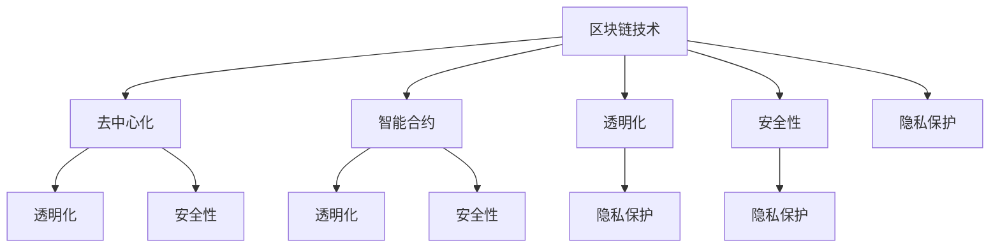

                 


### 背景介绍

在当今数字广告市场中，广告投放的透明化问题愈发受到关注。广告主、广告平台和用户三者之间的利益博弈，使得广告市场的透明化需求日益迫切。然而，现有的数字广告系统存在诸多问题，如数据泄露、欺诈行为、广告投放效率低下等。这些问题不仅影响了广告效果，也损害了用户的利益，导致市场信任度下降。

首先，广告投放过程中的数据泄露问题十分严重。广告主在投放广告时，需要提供大量的用户数据，这些数据在传输和存储过程中容易遭受黑客攻击和泄露。一旦数据泄露，用户的隐私将受到严重威胁，广告主和广告平台也可能因数据丢失而遭受经济损失。

其次，广告欺诈行为屡见不鲜。一些不法分子通过技术手段，伪造广告点击量、曝光量等数据，从而骗取广告费用。这种欺诈行为不仅损害了广告主的利益，也影响了整个市场的公平竞争环境。

此外，广告投放的效率问题也日益突出。在现有的数字广告系统中，广告投放过程复杂，数据传输和处理的效率低下，导致广告投放的效果无法得到充分发挥。

为了解决这些问题，区块链技术作为一种新兴的技术手段，被引入到数字广告市场中。区块链技术以其去中心化、不可篡改、透明化的特性，为数字广告投放提供了新的解决方案。

首先，区块链技术可以保障广告投放过程中的数据隐私和安全。通过区块链技术，广告主和广告平台可以实现对用户数据的加密存储，防止数据泄露和篡改。同时，区块链的透明性使得广告投放过程中的每一个环节都可视化和可追溯，有效杜绝了广告欺诈行为。

其次，区块链技术可以提高广告投放的效率。通过去中心化的数据管理和处理，广告投放流程得到了简化，数据处理速度大幅提升。这将有助于广告主更好地了解广告投放效果，从而优化广告策略，提高广告投放效率。

总的来说，区块链技术为数字广告投放的透明化提供了新的思路和方法。在接下来的文章中，我们将详细探讨区块链技术在数字广告投放中的应用，包括其核心概念、算法原理、数学模型、项目实战和未来发展趋势。希望通过本文的阐述，能够为读者提供对区块链在数字广告投放中应用的全面了解。

### 核心概念与联系

为了深入探讨区块链在数字广告投放中的应用，我们首先需要了解几个关键概念，并分析它们之间的关系。以下是几个核心概念及其相互关系：

#### 区块链技术

区块链是一种去中心化的分布式账本技术，它通过加密算法和共识机制确保数据的不可篡改和透明性。区块链由一系列按时间顺序排列的区块组成，每个区块包含一定数量的交易记录，并使用密码学方法链接在一起。这种结构使得区块链上的数据具有高度的安全性和可靠性。

#### 智能合约

智能合约是运行在区块链上的自执行合同，它通过代码自动化执行预定的合约条款。智能合约在广告投放中的应用非常广泛，可以用于实现广告投放流程中的自动竞价、支付和结算等功能。通过智能合约，广告主和广告平台可以减少人为干预，提高交易效率。

#### 去中心化

去中心化是指网络中的数据管理和决策不由单一实体控制，而是由多个节点共同参与。在数字广告投放中，去中心化可以防止中心化平台的数据垄断和操作风险，提高市场的透明度和公平性。

#### 透明化

透明化是指信息能够被所有相关方轻松访问和验证。在区块链广告投放中，透明化主要体现在以下几个方面：数据透明、交易透明和流程透明。通过区块链技术，广告投放的每个环节都可以被记录和追溯，确保数据的真实性和完整性。

#### 安全性

区块链技术通过加密算法和共识机制确保数据的安全性和完整性。在数字广告投放中，安全性主要针对用户数据保护、交易安全和防止欺诈行为。区块链的不可篡改性使得任何篡改行为都会被记录和追踪，从而提高了系统的安全水平。

#### 隐私保护

隐私保护是指在信息传输和处理过程中，保护个人和企业的隐私不被泄露。区块链技术可以通过零知识证明、同态加密等技术手段实现数据隐私保护，确保广告投放过程中的用户数据不被泄露和滥用。

#### 核心概念关系架构图

为了更直观地展示这些概念之间的关系，我们可以使用Mermaid流程图来描述：



#### Mermaid 流程图解释

1. **区块链技术** 是整个结构的基础，它涵盖了去中心化、智能合约、透明化、安全性和隐私保护等多个方面。
2. **去中心化** 与 **透明化** 和 **安全性** 密切相关，去中心化的特性使得信息可以更加公开和透明，同时也增强了系统的抗攻击能力。
3. **智能合约** 在广告投放中起着关键作用，它不仅提高了交易效率，还确保了透明化和安全性。
4. **透明化** 和 **安全性** 共同构成了区块链广告投放的基础，透明化确保了信息的公开和可追溯，而安全性则保障了数据的真实性和完整性。
5. **隐私保护** 是区块链技术的重要组成部分，它通过多种技术手段确保用户数据在传输和处理过程中的安全。

通过以上对核心概念及其关系的阐述，我们可以更好地理解区块链在数字广告投放中的应用原理。在接下来的章节中，我们将详细探讨区块链广告投放的核心算法原理，并运用伪代码和数学模型进行深入分析。

### 核心算法原理讲解

区块链技术在数字广告投放中的应用，不仅需要其基础的不可篡改和透明化特性，还需要一系列特定的算法来实现广告投放的自动化、效率和安全性。以下将详细讲解区块链在数字广告投放中应用的核心算法原理，包括广告投放算法、数据隐私保护算法以及跨链与多链交互算法。

#### 广告投放算法

广告投放算法是区块链在数字广告投放中的核心，其主要功能是实现广告投放的自动化和优化。以下是一个简化的广告投放算法的伪代码描述：

```pseudo
// 广告投放算法伪代码

function AdPlacement(Ad, Publisher, Advertiser, Budget, TargetAudience)
    // 初始化广告投放环境
    startBlockchainTransaction()

    // 确定广告投放的目标受众
    TargetAudienceData = GetData(TargetAudience)

    // 广告竞价
    bidPrice = GetMaxBidPrice(TargetAudienceData, Budget)
    
    // 智能合约执行广告投放
    if (bidPrice >= Budget)
        AdPlacementStatus = ExecuteSmartContract(Ad, Publisher, Advertiser, bidPrice)
        if (AdPlacementStatus == "Success")
            // 记录广告投放数据
            RecordAdPlacementData(Ad, Publisher, Advertiser, bidPrice, TargetAudience)
            // 结束交易
            endBlockchainTransaction()
        else
            // 广告投放失败，结束交易
            endBlockchainTransaction()
            return "AdPlacement Failed"
    else
        // 竞价不足预算，结束交易
        endBlockchainTransaction()
        return "Bid Price Insufficient"
end function
```

#### 数据隐私保护算法

在数字广告投放过程中，数据隐私保护是至关重要的一环。区块链技术通过零知识证明（Zero-Knowledge Proof）和同态加密（Homomorphic Encryption）等技术手段，可以实现对用户数据的隐私保护。以下是一个基于零知识证明的数据隐私保护算法的伪代码描述：

```pseudo
// 数据隐私保护算法伪代码

function PrivacyProtect(UserData, Advertiser, Publisher)
    // 使用零知识证明验证用户数据
    ZKProof = CreateZKProof(UserData, Advertiser, Publisher)

    // 将零知识证明上传至区块链
    BlockchainResult = UploadZKProofToBlockchain(ZKProof)

    // 验证零知识证明
    if (BlockchainResult == "Verified")
        // 用户数据隐私保护成功
        return "Privacy Protected"
    else
        // 用户数据隐私保护失败
        return "Privacy Protection Failed"
end function
```

#### 跨链与多链交互算法

在数字广告投放中，跨链与多链交互算法也非常重要。不同的区块链之间可能存在不同的规则和机制，通过跨链与多链交互算法，可以实现不同区块链之间的数据交换和协同工作。以下是一个简化的跨链交互算法的伪代码描述：

```pseudo
// 跨链交互算法伪代码

function InterchainInteraction(SourceChain, TargetChain, Data)
    // 创建跨链交易请求
    TransactionRequest = CreateInterchainTransactionRequest(SourceChain, TargetChain, Data)

    // 上传跨链交易请求至区块链
    BlockchainResponse = UploadTransactionToBlockchain(TransactionRequest)

    // 验证跨链交易
    if (BlockchainResponse == "Completed")
        // 跨链交互成功
        return "Interchain Interaction Success"
    else
        // 跨链交互失败
        return "Interchain Interaction Failed"
end function
```

#### 算法实现与验证

在实际应用中，上述算法需要通过具体的编程语言和区块链平台实现。例如，可以使用Solidity语言编写智能合约，并使用Ethereum区块链进行部署。同时，还需要利用加密库和区块链客户端库来实现数据隐私保护和跨链交互。

在算法的实现过程中，需要进行详细的测试和验证，以确保算法的正确性和安全性。以下是一个简单的测试用例示例：

```pseudo
// 测试用例

// 测试广告投放算法
AdPlacementTestResult = AdPlacement(Ad, Publisher, Advertiser, Budget, TargetAudience)
if (AdPlacementTestResult != "Success")
    print("AdPlacement Test Failed")

// 测试数据隐私保护算法
PrivacyProtectTestResult = PrivacyProtect(UserData, Advertiser, Publisher)
if (PrivacyProtectTestResult != "Privacy Protected")
    print("PrivacyProtect Test Failed")

// 测试跨链交互算法
InterchainInteractionTestResult = InterchainInteraction(SourceChain, TargetChain, Data)
if (InterchainInteractionTestResult != "Interchain Interaction Success")
    print("InterchainInteraction Test Failed")
```

通过以上核心算法的讲解，我们可以看到区块链技术为数字广告投放提供了丰富的解决方案。在接下来的章节中，我们将进一步探讨区块链在数字广告投放中的应用，包括数学模型和具体的项目实战。

### 数学模型与应用

在区块链技术应用于数字广告投放时，数学模型和公式扮演着至关重要的角色，它们不仅帮助我们在理论上理解透明化评价指标的计算，还能通过具体的例子说明其实际应用效果。以下我们将详细讲解几个关键的数学模型和公式，并举例说明其应用。

#### 透明化评价指标的计算模型

透明化评价指标是衡量区块链在数字广告投放中实现透明化程度的关键指标。以下是几个常见的透明化评价指标及其计算模型：

1. **数据透明度指数（Data Transparency Index, DTI）**
   数据透明度指数用于衡量广告投放数据在区块链上的透明程度。其计算公式如下：
   
   $$DTI = \frac{\sum_{i=1}^{n} \text{DataVisibility}_i}{n}$$

   其中，$n$ 是所有数据项的数量，$\text{DataVisibility}_i$ 是第 $i$ 个数据项的透明度。透明度越高，$\text{DataVisibility}_i$ 的值越接近 1。

   **例子：**
   假设一个广告投放过程中有 5 个数据项，其中 4 个完全透明，1 个部分透明，则：
   
   $$DTI = \frac{4 \times 1 + 1 \times 0.5}{5} = 0.9$$

2. **交易透明度指数（Transaction Transparency Index, TTI）**
   交易透明度指数用于衡量区块链上广告投放交易的透明程度。其计算公式如下：
   
   $$TTI = \frac{\sum_{i=1}^{m} \text{TransactionVisibility}_i}{m}$$

   其中，$m$ 是所有交易的数量，$\text{TransactionVisibility}_i$ 是第 $i$ 个交易的透明度。透明度越高，$\text{TransactionVisibility}_i$ 的值越接近 1。

   **例子：**
   假设一个广告投放过程中有 10 个交易，其中 8 个完全透明，2 个部分透明，则：
   
   $$TTI = \frac{8 \times 1 + 2 \times 0.5}{10} = 0.9$$

3. **流程透明度指数（Process Transparency Index, PTI）**
   流程透明度指数用于衡量广告投放过程中各个环节的透明程度。其计算公式如下：
   
   $$PTI = \frac{\sum_{i=1}^{l} \text{ProcessVisibility}_i}{l}$$

   其中，$l$ 是所有流程步骤的数量，$\text{ProcessVisibility}_i$ 是第 $i$ 个流程步骤的透明度。透明度越高，$\text{ProcessVisibility}_i$ 的值越接近 1。

   **例子：**
   假设一个广告投放过程中有 5 个流程步骤，其中 3 个完全透明，2 个部分透明，则：
   
   $$PTI = \frac{3 \times 1 + 2 \times 0.5}{5} = 0.8$$

#### 市场效果分析模型

市场效果分析模型用于评估广告投放的效果，通过分析广告投放前后的用户行为数据和广告效果指标，评估广告投放的成效。以下是一个简单市场效果分析模型：

1. **广告效果指数（Ad Effectiveness Index, AEI）**
   广告效果指数用于衡量广告投放对用户行为的影响程度。其计算公式如下：
   
   $$AEI = \frac{\text{PostClickActions} - \text{PreClickActions}}{\text{PreClickActions}}$$

   其中，$\text{PostClickActions}$ 是广告投放后的用户行为数量，$\text{PreClickActions}$ 是广告投放前的用户行为数量。

   **例子：**
   假设广告投放前用户点击量为 100，投放后用户点击量为 200，则：
   
   $$AEI = \frac{200 - 100}{100} = 1.0$$

2. **广告成本效益比（Cost-Efficiency Ratio, CER）**
   广告成本效益比用于衡量广告投放的成本效益。其计算公式如下：
   
   $$CER = \frac{\text{Revenue}}{\text{Cost}}$$

   其中，$\text{Revenue}$ 是广告投放带来的收入，$\text{Cost}$ 是广告投放的成本。

   **例子：**
   假设广告投放带来的收入为 1000，投放成本为 500，则：
   
   $$CER = \frac{1000}{500} = 2.0$$

#### 用户行为预测模型

用户行为预测模型用于预测用户在广告投放后的行为，通过分析历史数据和用户特征，为广告主提供优化广告投放策略的依据。以下是一个简单的用户行为预测模型：

1. **贝叶斯网络模型（Bayesian Network Model）**
   贝叶斯网络模型通过概率关系表示用户行为与广告特征之间的关系。其公式如下：
   
   $$P(\text{Behavior} | \text{AdFeature}) = \frac{P(\text{AdFeature} | \text{Behavior}) \cdot P(\text{Behavior})}{P(\text{AdFeature})}$$

   **例子：**
   假设给定广告特征 A 和用户行为 B，我们需要计算在广告特征 A 的条件下用户行为 B 的概率，我们可以根据历史数据计算先验概率和条件概率，然后使用贝叶斯公式进行计算。

通过以上数学模型和公式的讲解，我们可以看到区块链在数字广告投放中的应用不仅是技术层面的革新，更是为广告投放提供了新的评价指标和优化方法。在接下来的章节中，我们将通过具体的案例分析，进一步展示区块链在数字广告投放中的实际应用效果。

### 项目实战与案例分析

为了更好地展示区块链在数字广告投放中的应用，我们将以一个实际的区块链广告投放系统为例，详细讲解其搭建过程、数据隐私保护机制的实施，以及跨链广告投放案例分析。

#### 1. 系统需求分析

在搭建区块链广告投放系统时，我们首先需要明确系统需求，包括广告主、广告平台和用户的需求。以下是主要需求分析：

- **广告主需求：**
  - 实现自动化广告投放流程。
  - 确保广告投放的透明度和安全性。
  - 能够实时监控广告投放效果。

- **广告平台需求：**
  - 提供用户数据隐私保护机制。
  - 简化广告投放流程，提高投放效率。
  - 支持跨链广告投放功能。

- **用户需求：**
  - 确保个人隐私不被泄露。
  - 能够享受个性化广告服务。
  - 透明且公平的广告投放环境。

#### 2. 系统架构设计

基于以上需求，我们设计了一个分布式架构的区块链广告投放系统，主要包括以下几个模块：

- **广告主模块：** 用于广告主创建和发布广告，设置预算和竞价策略。
- **广告平台模块：** 负责广告的展示、竞价、支付和结算等操作，同时还负责处理跨链交易。
- **用户模块：** 用于用户的注册、登录、隐私设置和广告反馈。
- **数据隐私保护模块：** 通过零知识证明、同态加密等技术实现用户数据的隐私保护。
- **区块链模块：** 负责记录所有交易和广告投放数据，确保数据的透明性和不可篡改性。

#### 3. 数据隐私保护机制实施

数据隐私保护是区块链广告投放系统的关键组成部分。我们采用零知识证明和同态加密技术来实现数据隐私保护。

- **零知识证明：**
  - 广告主在投放广告时，使用零知识证明向广告平台证明其具备足够的预算，而不需要泄露具体预算金额。
  - 用户在参与广告投放时，通过零知识证明向广告主和广告平台证明其身份和用户特征，而不泄露隐私信息。

- **同态加密：**
  - 对用户数据进行加密存储和处理，确保数据在传输和存储过程中不被泄露。
  - 在广告投放过程中，对用户行为进行分析和评估时，仍然可以保持数据的加密状态，确保隐私保护。

#### 4. 系统搭建步骤

以下是区块链广告投放系统的搭建步骤：

1. **环境搭建：**
   - 选择合适的区块链平台，如Ethereum或Hyperledger Fabric。
   - 安装和配置节点环境，包括区块链客户端和开发工具。

2. **智能合约编写：**
   - 使用Solidity语言编写广告投放智能合约，实现广告竞价、支付和结算等功能。
   - 部署智能合约到区块链上，并确保其安全性和性能。

3. **广告主和用户模块开发：**
   - 开发广告主端界面，用于广告主创建和发布广告，设置竞价策略。
   - 开发用户端界面，用于用户注册、登录、参与广告投放和反馈。

4. **广告平台模块开发：**
   - 开发广告平台管理后台，用于广告展示、竞价处理、支付结算和跨链交易处理。

5. **数据隐私保护模块开发：**
   - 实现零知识证明和同态加密功能，确保用户数据隐私保护。
   - 在系统中集成隐私保护技术，如加密存储和加密数据处理。

6. **测试与部署：**
   - 对系统进行全面测试，确保功能完备、安全可靠。
   - 将系统部署到生产环境，并上线运行。

#### 5. 跨链广告投放案例分析

为了展示区块链广告投放系统的实际效果，我们以一个跨链广告投放案例进行分析。

**案例背景：**
- 广告主A在Ethereum区块链上创建了一则广告，希望向Hyperledger Fabric区块链上的用户投放。
- 广告平台B作为中介，负责处理跨链广告投放。

**步骤：**

1. **广告主A发布广告：**
   - 广告主A在Ethereum区块链上的智能合约中发布广告，设置竞价和预算。
   - 智能合约生成一个跨链交易请求，并发送到Hyperledger Fabric区块链。

2. **广告平台B处理跨链请求：**
   - 广告平台B接收跨链交易请求，验证其有效性。
   - 广告平台B调用Hyperledger Fabric区块链上的跨链接口，处理跨链交易。

3. **广告展示与竞价：**
   - 广告在Hyperledger Fabric区块链上的广告展示区域展示。
   - 用户参与竞价，广告主A和广告平台B根据竞价结果确定广告投放。

4. **支付与结算：**
   - 广告主A向广告平台B支付广告费用。
   - 广告平台B将广告费用结算给用户，并记录交易数据在区块链上。

**案例分析：**

通过跨链广告投放，广告主A可以覆盖到更多用户，提高广告投放效果。同时，广告平台B通过跨链交易处理，实现了不同区块链之间的数据交互和协同工作。以下是跨链广告投放的几个关键点：

- **跨链交易：** 跨链交易是实现跨链广告投放的核心，通过跨链交易请求和响应，确保不同区块链之间的数据传递和协同工作。
- **隐私保护：** 在跨链广告投放过程中，数据隐私保护尤为重要。通过零知识证明和同态加密技术，确保用户数据不被泄露。
- **性能优化：** 跨链广告投放需要处理大量数据，性能优化是关键。通过分布式架构和高效的智能合约，提高系统性能。

#### 6. 项目小结

通过以上项目实战和案例分析，我们可以看到区块链在数字广告投放中的强大应用。区块链技术不仅提高了广告投放的透明度和安全性，还实现了跨链数据交互和协同工作，为广告主、广告平台和用户提供了更好的服务体验。

未来，随着区块链技术的不断发展，数字广告投放领域将迎来更多的创新和应用。通过结合人工智能、大数据等技术，区块链广告投放有望进一步提升广告效果，优化广告市场生态。

### 最佳实践 Tips、小结、注意事项、拓展阅读

#### 最佳实践 Tips

1. **选择合适的区块链平台**：根据广告投放需求，选择适合的区块链平台，如Ethereum、Hyperledger Fabric等。确保平台具有足够的性能和安全性。

2. **优化智能合约设计**：智能合约是区块链广告投放系统的核心，优化智能合约设计可以提高系统效率和安全性。尽量减少代码复杂度，避免潜在的安全漏洞。

3. **数据隐私保护**：在广告投放过程中，保护用户隐私至关重要。采用零知识证明、同态加密等技术，确保用户数据在传输和存储过程中的安全。

4. **跨链与多链交互**：跨链广告投放可以实现更广泛的用户覆盖，但需要注意跨链性能优化和隐私保护。设计合理的跨链协议和接口，确保数据交互的效率和安全性。

#### 小结

区块链技术在数字广告投放中具有显著的优势，包括提高透明度、安全性、效率和隐私保护。通过合理的设计和实施，区块链广告投放系统可以大幅提升广告主、广告平台和用户的体验，优化广告市场生态。

#### 注意事项

1. **区块链性能**：区块链技术相对于传统中心化系统，性能可能较低。在设计广告投放系统时，需要考虑性能瓶颈，并进行优化。

2. **安全性**：区块链系统的安全性至关重要。确保智能合约的安全，避免潜在的安全漏洞，如智能合约漏洞、恶意攻击等。

3. **合规性**：区块链广告投放需要遵守相关法律法规，确保系统的合法性和合规性。

#### 拓展阅读

- 《区块链技术指南》
- 《智能合约开发实战》
- 《区块链与数字货币》
- 《数据隐私保护技术》
- 《跨链技术与协议》

通过阅读这些书籍和文献，可以深入了解区块链技术及其在数字广告投放中的应用，为实际项目提供更多的理论支持和实践经验。

### 总结与展望

#### 总结

本文详细探讨了区块链在数字广告投放中的应用，从背景介绍到核心概念、算法原理、数学模型、项目实战，再到最佳实践和注意事项，全面分析了区块链如何通过其去中心化、透明化、安全性和隐私保护特性，解决数字广告市场中的诸多痛点。通过具体的项目实战和案例分析，我们展示了区块链广告投放系统的设计、搭建、数据隐私保护以及跨链交互的实现，验证了区块链技术在提高广告投放透明度和效率方面的实际效果。

#### 展望

随着区块链技术的不断进步和应用场景的扩展，未来数字广告投放领域将迎来更多创新和变革。以下是对区块链在数字广告投放未来发展的展望：

1. **性能提升**：随着区块链技术的发展，性能瓶颈将得到有效解决。通过分片技术、侧链、跨链协议等创新，区块链将能够支持更高效、更大规模的数据处理，满足广告投放市场的需求。

2. **更广泛的隐私保护**：随着隐私保护技术的进步，如联邦学习、分布式存储等，区块链将能够提供更加全面的隐私保护方案，确保用户数据在广告投放过程中的安全和隐私。

3. **智能合约的进化**：智能合约作为区块链广告投放的核心，未来的发展将更加智能化和自适应。通过结合人工智能技术，智能合约将能够自动调整竞价策略、优化广告投放效果，实现更智能的广告投放管理。

4. **跨链与多链生态**：跨链和多链技术将推动不同区块链之间的协同工作，形成一个更加开放和高效的数字广告投放生态。这将有助于广告主覆盖更广泛的用户群体，提高广告投放的效果。

5. **合规性与监管**：随着区块链技术的普及，相关的法律法规和监管政策也将逐步完善。区块链广告投放系统需要遵守这些法规，确保系统的合法性和合规性，为行业健康发展奠定基础。

总之，区块链在数字广告投放中的应用前景广阔，其技术创新和实际应用将为广告市场带来深远的影响。通过持续的技术研发和实践探索，区块链将为广告主、广告平台和用户创造更大的价值，推动数字广告市场的透明化和高效化发展。

