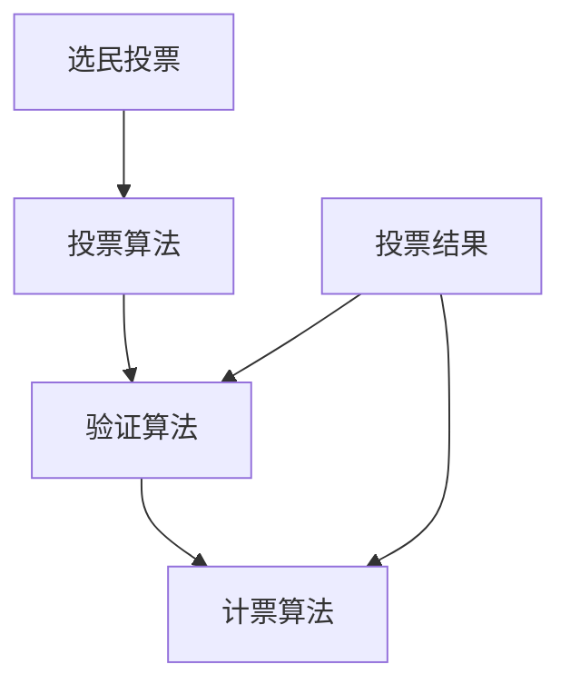

                 


### 文章标题：区块链在数字投票系统中的应用

> 关键词：区块链，数字投票，智能合约，加密技术，安全性，隐私保护

> 摘要：本文深入探讨了区块链技术在数字投票系统中的应用。从区块链的基础知识和数字投票的概述开始，详细分析了区块链与数字投票的结合点，以及智能合约、加密技术在数字投票中的应用。随后，探讨了数字投票系统的实现与优化、安全性与隐私保护，并通过实际应用案例分析，展示了区块链在数字投票系统中的优势。最后，对数字投票系统的未来展望进行了探讨。

### 用户需求分析：

用户对于《区块链在数字投票系统中的应用》这一主题的需求主要体现在以下几个方面：

1. **基础知识需求**：用户希望了解区块链技术的基本概念、原理以及其在数字投票系统中的应用。
2. **技术实现需求**：用户希望获得关于如何利用区块链技术构建数字投票系统的详细步骤和指导。
3. **安全性需求**：用户关心数字投票系统的安全性问题，包括如何保障投票过程的透明性和隐私性。
4. **案例分析需求**：用户希望通过具体案例了解区块链在数字投票系统中的应用效果。
5. **未来发展需求**：用户希望了解区块链在数字投票领域的未来发展前景和潜在挑战。

### 目录大纲设计：

**第一部分：区块链基础与数字投票概述**

- **第1章 区块链基础与数字投票概述**
  - **1.1 区块链技术简介**
    - **1.1.1 区块链的定义与基本原理**
    - **1.1.2 区块链的核心特征**
    - **1.1.3 区块链技术的应用场景**
  - **1.2 数字投票系统概述**
    - **1.2.1 数字投票的定义与发展历程**
    - **1.2.2 数字投票的优势与挑战**
    - **1.2.3 数字投票系统的架构与流程**

**第二部分：区块链在数字投票中的应用**

- **第2章 区块链在数字投票中的核心应用**
  - **2.1 区块链与数字投票的融合**
    - **2.1.1 区块链在数字投票中的作用**
    - **2.1.2 区块链技术对数字投票系统的改进**
    - **2.1.3 区块链在数字投票中的具体应用**
  - **2.2 智能合约在数字投票中的应用**
    - **2.2.1 智能合约的定义与原理**
    - **2.2.2 智能合约在数字投票系统中的实现**
    - **2.2.3 智能合约的案例分析**
  - **2.3 加密技术在数字投票中的应用**
    - **2.3.1 加密技术的基本原理**
    - **2.3.2 加密技术在数字投票系统中的应用**
    - **2.3.3 加密技术的案例分析**

**第三部分：数字投票系统的实现与优化**

- **第3章 数字投票系统的实现与优化**
  - **3.1 数字投票系统的开发环境与工具**
    - **3.1.1 区块链开发环境搭建**
    - **3.1.2 数字投票系统开发工具选择**
    - **3.1.3 开发流程与项目管理**
  - **3.2 数字投票系统的核心算法与实现**
    - **3.2.1 投票算法原理讲解**
    - **3.2.2 投票算法伪代码实现**
    - **3.2.3 投票算法案例分析**
  - **3.3 数字投票系统的性能优化**
    - **3.3.1 系统性能评估指标**
    - **3.3.2 系统性能优化策略**
    - **3.3.3 性能优化案例分析**

**第四部分：数字投票系统的安全性与隐私保护**

- **第4章 数字投票系统的安全性与隐私保护**
  - **4.1 数字投票系统的安全性保障**
    - **4.1.1 区块链技术在安全性保障中的作用**
    - **4.1.2 数字投票系统的安全漏洞与防范**
    - **4.1.3 安全性保障的案例分析**
  - **4.2 数字投票系统的隐私保护**
    - **4.2.1 隐私保护的基本原理**
    - **4.2.2 数字投票系统的隐私保护策略**
    - **4.2.3 隐私保护的案例分析**

**第五部分：数字投票系统的实际应用案例分析**

- **第5章 数字投票系统的实际应用案例分析**
  - **5.1 案例背景介绍**
    - **5.1.1 案例一：某企业员工选举**
    - **5.1.2 案例二：某城市社区投票**
    - **5.1.3 案例三：某国家大选投票**
  - **5.2 案例分析**
    - **5.2.1 案例一的分析**
    - **5.2.2 案例二的分析**
    - **5.2.3 案例三的分析**

**第六部分：未来展望**

- **第6章 数字投票系统的未来展望**
  - **6.1 区块链与数字投票的发展趋势**
    - **6.1.1 区块链技术的未来发展方向**
    - **6.1.2 数字投票系统的未来发展前景**
    - **6.1.3 区块链与数字投票融合的创新应用**
  - **6.2 数字投票系统的挑战与机遇**
    - **6.2.1 数字投票系统的挑战**
    - **6.2.2 数字投票系统的机遇**
    - **6.2.3 应对挑战的策略**

### 总结：

本文《区块链在数字投票系统中的应用》共分为六个部分，涵盖了区块链基础、数字投票概述、核心应用、实现与优化、安全性与隐私保护、实际应用案例分析以及未来展望等内容。通过逐步分析和推理，文章旨在为读者提供关于区块链在数字投票系统中应用的全面理解和深入见解。文章结构清晰，内容丰富，适合希望了解和深入探索区块链在数字投票系统应用领域的读者阅读。

---

### 1.1 区块链技术简介

#### 1.1.1 区块链的定义与基本原理

区块链是一种分布式数据库技术，通过多个节点共同维护一个统一的账本。这个账本记录了所有参与者的交易记录，并按照一定的规则进行排序、存储和验证。区块链的核心特点是去中心化，每个节点都拥有完整的账本副本，任何一方都不能单方面修改账本内容，从而保证了数据的可靠性和不可篡改性。

区块链的基本原理包括：

- **去中心化**：区块链不需要中心化的第三方机构来协调和管理交易，而是通过网络中的多个节点来共同维护数据一致性。
- **共识算法**：节点通过共识算法来达成共识，确保所有节点对于账本内容的看法一致。常见的共识算法包括工作量证明（PoW）、权益证明（PoS）等。
- **加密技术**：区块链使用加密技术来保护数据的安全性和隐私性。加密算法包括哈希函数、非对称加密、数字签名等。

#### 1.1.2 区块链的核心特征

区块链具有以下几个核心特征：

- **不可篡改性**：区块链通过密码学技术确保一旦数据被记录在链上，就不可篡改。这为数据提供了高度的可靠性和安全性。
- **透明性**：区块链上的数据是公开透明的，任何参与者都可以查看账本上的交易记录。这种透明性有助于提高信任度。
- **去中心化**：区块链通过分布式网络来维护数据，去除了中心化的第三方机构，从而降低了系统的单点故障风险。
- **安全性**：区块链使用加密技术和共识算法来保护数据的安全性和隐私性，确保数据不会被恶意篡改或泄露。

#### 1.1.3 区块链技术的应用场景

区块链技术的应用场景非常广泛，包括但不限于以下领域：

- **数字货币**：比特币、以太坊等数字货币是区块链技术的最早应用之一。它们利用区块链技术确保交易的安全性和匿名性。
- **供应链管理**：区块链技术可以用于跟踪商品从生产到交付的整个过程，确保供应链的透明性和可追溯性。
- **智能合约**：智能合约是一种自动执行合约条款的计算机程序，它可以自动处理交易和合同执行，减少了人为干预和纠纷。
- **数字身份验证**：区块链可以用于创建去中心化的数字身份验证系统，确保用户的身份信息安全。
- **数字投票系统**：区块链技术可以用于构建安全的数字投票系统，确保投票的透明性、不可篡改性和隐私性。

### 1.2 数字投票系统概述

#### 1.2.1 数字投票的定义与发展历程

数字投票是指通过计算机技术和网络通信技术来实现选举或投票的过程。与传统的纸质投票不同，数字投票具有快速、便捷、高效的特点，可以在短时间内处理大量的投票信息。

数字投票的发展历程可以分为以下几个阶段：

1. **电子投票**：早期数字投票主要是通过电子设备进行，如电子投票机。这些设备可以实现自动化计票，提高了投票的效率和准确性。
2. **互联网投票**：随着互联网的发展，数字投票开始通过互联网进行。互联网投票突破了时间和地点的限制，使投票变得更加方便和快捷。
3. **区块链投票**：区块链技术的兴起为数字投票带来了新的可能性。区块链技术确保了投票的透明性、不可篡改性和安全性，为数字投票提供了更加可靠的技术保障。

#### 1.2.2 数字投票的优势与挑战

数字投票系统相较于传统投票系统具有以下优势：

- **效率高**：数字投票系统可以快速处理大量的投票信息，减少了人工计票的工作量。
- **成本低**：数字投票系统减少了纸质投票和人工计票的成本，降低了选举的开销。
- **便捷性**：数字投票不受时间和地点的限制，选民可以在任何时间、任何地点进行投票。
- **可追溯性**：数字投票系统记录了每个选民的投票信息，可以随时查询和验证。

然而，数字投票系统也面临着一些挑战：

- **安全性**：数字投票系统需要确保投票过程的安全性，防止黑客攻击和数据泄露。
- **隐私性**：数字投票系统需要保护选民的隐私，确保投票结果不会被恶意篡改。
- **可靠性**：数字投票系统需要确保投票结果的准确性和可靠性，防止计票错误。
- **技术依赖**：数字投票系统高度依赖计算机技术和网络通信技术，一旦系统出现故障，可能会影响投票的正常进行。

#### 1.2.3 数字投票系统的架构与流程

数字投票系统的架构通常包括以下几个部分：

- **投票端**：选民通过电脑、手机或其他电子设备登录投票系统，进行投票。
- **服务器端**：投票系统服务器负责处理选民的投票请求，存储投票结果，并进行计票。
- **区块链节点**：区块链节点负责验证选民的投票信息，确保投票的合法性和安全性。
- **监控端**：监控端负责对投票过程进行实时监控，确保投票的公正性和透明性。

数字投票系统的基本流程如下：

1. **选民注册**：选民在投票系统进行注册，获取投票权限。
2. **登录投票**：选民登录投票系统，查看候选人和投票选项。
3. **投票**：选民进行投票，系统记录选民的投票信息。
4. **投票验证**：区块链节点验证选民的投票信息，确保投票的合法性和安全性。
5. **计票**：服务器端对投票结果进行计票，生成投票结果。
6. **结果公布**：投票结果通过区块链节点进行公开，确保结果的透明性和不可篡改性。

### 1.2.4 数字投票系统的优势与挑战

数字投票系统相较于传统投票系统具有以下优势：

1. **提高投票效率**：数字投票系统可以快速处理大量的投票信息，节省了人工计票的时间和工作量，提高了投票的效率。

2. **降低选举成本**：数字投票系统减少了纸质投票和人工计票的成本，降低了选举的开销。

3. **提升选民参与度**：数字投票系统不受时间和地点的限制，选民可以在任何时间、任何地点进行投票，提高了选民的参与度。

4. **增强投票公正性**：数字投票系统通过区块链技术确保投票的透明性、不可篡改性和安全性，增强了投票的公正性。

然而，数字投票系统也面临一些挑战：

1. **安全性问题**：数字投票系统需要确保投票过程的安全性，防止黑客攻击和数据泄露。

2. **隐私保护问题**：数字投票系统需要保护选民的隐私，确保投票结果不会被恶意篡改。

3. **技术依赖问题**：数字投票系统高度依赖计算机技术和网络通信技术，一旦系统出现故障，可能会影响投票的正常进行。

4. **法律监管问题**：数字投票系统需要符合相关法律法规的要求，确保选举的合法性和公正性。

### 1.2.5 数字投票系统的基本架构和流程

数字投票系统的基本架构主要包括投票端、服务器端、区块链节点和监控端。

1. **投票端**：选民通过电脑、手机或其他电子设备登录投票系统，进行投票。投票端需要实现用户身份验证、投票操作、投票记录等功能。

2. **服务器端**：服务器端负责处理选民的投票请求，存储投票结果，并进行计票。服务器端需要实现用户管理、投票管理、计票管理等功能。

3. **区块链节点**：区块链节点负责验证选民的投票信息，确保投票的合法性和安全性。区块链节点需要实现投票信息加密、投票信息验证、投票结果记录等功能。

4. **监控端**：监控端负责对投票过程进行实时监控，确保投票的公正性和透明性。监控端需要实现投票数据监控、异常情况报警等功能。

数字投票系统的基本流程包括以下几个步骤：

1. **选民注册**：选民在投票系统进行注册，获取投票权限。

2. **登录投票**：选民登录投票系统，查看候选人和投票选项。

3. **投票**：选民进行投票，系统记录选民的投票信息。

4. **投票验证**：区块链节点验证选民的投票信息，确保投票的合法性和安全性。

5. **计票**：服务器端对投票结果进行计票，生成投票结果。

6. **结果公布**：投票结果通过区块链节点进行公开，确保结果的透明性和不可篡改性。

### 1.2.6 数字投票与区块链的结合

数字投票与区块链技术的结合具有以下优势：

1. **提高安全性**：区块链技术通过密码学和共识算法确保投票数据的安全性和不可篡改性，提高了投票系统的安全性。

2. **增强透明性**：区块链技术使投票数据公开透明，任何参与者都可以查看和验证投票结果，增强了投票系统的透明性。

3. **保护隐私**：区块链技术通过加密技术和隐私保护算法确保选民的隐私不被泄露，提高了投票系统的隐私保护能力。

4. **降低运营成本**：区块链技术去除了中心化的第三方机构，降低了投票系统的运营成本。

### 1.2.7 区块链在数字投票中的具体应用

区块链在数字投票中的具体应用包括以下几个方面：

1. **投票信息加密**：区块链技术可以使用加密算法对选民的投票信息进行加密，确保投票信息在传输和存储过程中的安全性。

2. **投票信息验证**：区块链技术可以使用共识算法对选民的投票信息进行验证，确保投票信息的合法性和真实性。

3. **投票结果记录**：区块链技术可以将选民的投票结果记录在链上，确保投票结果的透明性和不可篡改性。

4. **投票数据分析**：区块链技术可以对选民的投票数据进行统计分析，为选举结果的预测和分析提供支持。

### 1.2.8 数字投票系统的案例分析

1. **某国家大选投票**：该国家在2020年的大选中采用了区块链技术进行数字投票。投票系统使用了加密算法和共识算法来保护投票数据的安全性和真实性。投票结果在区块链上公开透明，确保了选举的公正性和合法性。

2. **某企业员工选举**：该企业采用了区块链技术进行员工选举。区块链技术确保了投票过程的透明性和安全性，提高了员工参与的积极性。

### 1.2.9 数字投票系统的发展趋势

1. **技术成熟度提升**：随着区块链技术的不断发展和成熟，数字投票系统的技术实现和性能将得到进一步提升。

2. **应用场景扩展**：数字投票系统将在更多的领域得到应用，如社区投票、学术选举等。

3. **政策法规完善**：随着数字投票系统的应用推广，相关政策法规将逐步完善，确保数字投票系统的合法性和公正性。

4. **用户习惯培养**：随着数字投票系统的普及，用户将逐渐养成数字投票的习惯，提高投票的参与度。

### 总结

数字投票系统结合区块链技术具有显著的优势，包括提高安全性、增强透明性、保护隐私和降低运营成本等。通过本章节的介绍，读者可以了解区块链技术的基本原理和数字投票系统的概述，为后续章节的学习打下基础。

### 2.1 区块链与数字投票的融合

#### 2.1.1 区块链在数字投票中的作用

区块链在数字投票中的作用主要体现在以下几个方面：

1. **提高投票安全性**：区块链技术通过密码学和共识算法确保投票数据的安全性和不可篡改性。选民的投票信息在区块链上加密存储，有效防止黑客攻击和数据泄露。
2. **增强投票透明性**：区块链技术使投票过程公开透明，所有参与者都可以查看和验证投票结果。区块链的分布式特性确保了投票数据的一致性，增强了选举的公正性。
3. **保障投票隐私**：区块链技术使用加密算法对选民的投票信息进行加密，确保选民的隐私不被泄露。同时，区块链的去中心化特性减少了第三方机构对数据的访问权限，进一步保护了选民的隐私。
4. **降低运营成本**：区块链技术去除了中心化的第三方机构，简化了投票系统的架构，降低了投票系统的运营成本。

#### 2.1.2 区块链技术对数字投票系统的改进

区块链技术对数字投票系统带来了以下几个方面的改进：

1. **安全性提升**：区块链技术通过密码学和共识算法确保投票数据的安全性和不可篡改性，减少了黑客攻击和数据泄露的风险。
2. **透明性增强**：区块链技术使投票过程公开透明，所有参与者都可以查看和验证投票结果，增强了选举的公正性和信任度。
3. **隐私保护**：区块链技术使用加密算法对选民的投票信息进行加密，确保选民的隐私不被泄露。同时，区块链的去中心化特性减少了第三方机构对数据的访问权限，进一步保护了选民的隐私。
4. **高效计票**：区块链技术可以快速处理大量的投票信息，提高了投票系统的效率和准确性。
5. **去中心化治理**：区块链技术去除了中心化的第三方机构，实现了投票系统的去中心化治理，降低了系统的单点故障风险。

#### 2.1.3 区块链在数字投票中的具体应用

区块链在数字投票中的具体应用包括以下几个方面：

1. **投票信息加密**：选民的投票信息在区块链上加密存储，确保投票数据在传输和存储过程中的安全性。
2. **投票信息验证**：区块链节点对选民的投票信息进行验证，确保投票信息的合法性和真实性。
3. **投票结果记录**：区块链将选民的投票结果记录在链上，确保投票结果的透明性和不可篡改性。
4. **投票数据分析**：区块链技术可以对选民的投票数据进行统计分析，为选举结果的预测和分析提供支持。

### 2.2 智能合约在数字投票中的应用

#### 2.2.1 智能合约的定义与原理

智能合约是一种自动执行合约条款的计算机程序，它运行在区块链上。智能合约通过预定义的逻辑和规则来自动执行交易和合同条款，无需人工干预。智能合约的核心原理包括：

1. **不可篡改性**：智能合约的代码一旦部署在区块链上，就不可篡改，确保了合约条款的稳定性和可靠性。
2. **自动化执行**：智能合约根据预定义的逻辑和规则自动执行，减少了人为干预和错误。
3. **去中心化执行**：智能合约在区块链上由多个节点共同执行，去除了中心化的第三方机构，提高了系统的安全性。

#### 2.2.2 智能合约在数字投票系统中的实现

智能合约在数字投票系统中的实现主要包括以下几个步骤：

1. **合约设计**：设计智能合约的代码，包括选民注册、投票操作、投票验证、投票计票等功能的实现。
2. **合约部署**：将智能合约代码部署到区块链上，通常使用智能合约开发框架如Truffle、Hardhat等。
3. **合约调用**：选民通过区块链客户端调用智能合约，进行注册、投票、验证等操作。
4. **合约执行**：智能合约根据预定义的逻辑和规则自动执行，处理选民的投票信息，生成投票结果。

#### 2.2.3 智能合约的案例分析

以下是一个简单的智能合约案例，用于实现一个基本的数字投票系统：

```solidity
// SPDX-License-Identifier: MIT
pragma solidity ^0.8.0;

contract Voting {
    mapping(address => bool) public hasVoted;
    mapping(string => mapping(address => bool)) public votes;
    string[] public candidates;

    constructor(string[] memory _candidates) {
        candidates = _candidates;
    }

    function vote(string memory _candidate) public {
        require(!hasVoted[msg.sender], "You have already voted");
        require(votes[_candidate][msg.sender] != true, "You have already voted for this candidate");
        votes[_candidate][msg.sender] = true;
        hasVoted[msg.sender] = true;
    }

    function winner() public view returns (string memory) {
        uint256 maxVotes = 0;
        string memory winner = "";
        for (uint256 i = 0; i < candidates.length; i++) {
            uint256 voteCount = 0;
            for (uint256 j = 0; j < candidates.length; j++) {
                if (votes[candidates[i]][msg.sender]) {
                    voteCount++;
                }
            }
            if (voteCount > maxVotes) {
                maxVotes = voteCount;
                winner = candidates[i];
            }
        }
        return winner;
    }
}
```

此智能合约实现了一个简单的投票系统，允许用户为某个候选人投票，并返回最终的获胜者。选民只能投票一次，且投票结果公开透明。

#### 2.2.4 智能合约的优势与挑战

智能合约在数字投票系统中的应用具有以下优势：

1. **自动化执行**：智能合约根据预定义的逻辑自动执行，减少了人为干预和错误。
2. **透明性和不可篡改性**：智能合约的代码和执行结果在区块链上公开透明，不可篡改，增强了投票系统的可信度。
3. **去中心化**：智能合约在区块链上由多个节点共同执行，去除了中心化的第三方机构，提高了系统的安全性。

然而，智能合约在数字投票中也面临一些挑战：

1. **智能合约漏洞**：智能合约代码一旦发布，就无法修改。如果代码存在漏洞，攻击者可能利用这些漏洞进行恶意攻击，如双花攻击、重入攻击等。
2. **合约复杂度**：智能合约的编写和审查相对复杂，需要专业的开发人员和审计人员确保合约的正确性和安全性。
3. **性能问题**：智能合约在执行过程中可能会遇到性能瓶颈，特别是在处理大量投票信息时，可能会影响系统的响应速度。

#### 2.2.5 智能合约的最佳实践

为了确保智能合约在数字投票系统中的安全性，以下是一些最佳实践：

1. **代码审计**：在智能合约部署前，进行全面的代码审计，确保代码的正确性和安全性。
2. **测试**：对智能合约进行充分的单元测试和集成测试，确保合约在各种情况下的正确执行。
3. **分阶段部署**：将智能合约功能分阶段部署，逐步验证和优化，降低风险。
4. **社区审查**：开放智能合约代码，接受社区审查和反馈，提高合约的透明度和可信度。

### 2.3 加密技术在数字投票中的应用

#### 2.3.1 加密技术的基本原理

加密技术是保护信息安全的重要手段，它通过将明文转换为密文来确保数据在传输和存储过程中的安全性。加密技术的基本原理包括：

1. **加密算法**：加密算法是一种将明文转换为密文的计算规则，常见的加密算法有对称加密和非对称加密。
2. **密钥**：密钥是加密和解密过程中使用的关键参数，分为私钥和公钥。私钥用于加密和解密，公钥用于加密和验证。
3. **哈希函数**：哈希函数是一种将任意长度的输入数据映射为固定长度的输出数据的算法，常见的哈希函数有SHA-256、SHA-3等。

#### 2.3.2 加密技术在数字投票系统中的应用

加密技术在数字投票系统中的应用主要包括以下几个方面：

1. **投票信息加密**：选民在投票时，使用私钥对投票信息进行加密，确保投票信息在传输和存储过程中的安全性。
2. **投票验证**：投票系统使用公钥对加密的投票信息进行验证，确保投票信息的合法性和真实性。
3. **身份认证**：选民使用私钥对身份信息进行签名，投票系统使用公钥验证签名，确保选民的合法身份。
4. **投票结果加密**：投票结果在区块链上存储前，使用公钥对投票结果进行加密，确保投票结果的隐私性。

#### 2.3.3 加密技术的案例分析

以下是一个简单的加密技术案例，用于实现数字投票系统的投票信息加密和验证：

```python
from cryptography.hazmat.primitives.asymmetric import rsa
from cryptography.hazmat.primitives import serialization
from cryptography.hazmat.primitives.asymmetric import padding

# 生成公钥和私钥
private_key = rsa.generate_private_key(
    public_exponent=65537,
    key_size=2048,
)
public_key = private_key.public_key()

# 加密投票信息
plaintext = "候选人A"
ciphertext = public_key.encrypt(
    plaintext,
    padding.OAEP(
        mgf=padding.MGF1(algorithm=hashes.SHA256()),
        algorithm=hashes.SHA256(),
        label=None
    )
)

# 解密投票信息
plaintext = private_key.decrypt(
    ciphertext,
    padding.OAEP(
        mgf=padding.MGF1(algorithm=hashes.SHA256()),
        algorithm=hashes.SHA256(),
        label=None
    )
)

print(plaintext.decode("utf-8"))
```

此案例使用Python的cryptography库实现投票信息的加密和解密过程。

#### 2.3.4 加密技术的优势与挑战

加密技术在数字投票系统中的应用具有以下优势：

1. **安全性**：加密技术可以确保投票信息在传输和存储过程中的安全性，防止数据泄露和篡改。
2. **隐私保护**：加密技术可以保护选民的隐私，确保投票结果不会泄露。
3. **身份认证**：加密技术可以验证选民的合法身份，确保投票的合法性。

然而，加密技术也面临一些挑战：

1. **计算开销**：加密和解密过程需要较高的计算资源，可能会影响投票系统的性能。
2. **密钥管理**：密钥的管理和保护是加密技术的重要环节，需要确保密钥的安全性和保密性。
3. **兼容性问题**：不同加密算法和密钥格式之间的兼容性可能成为技术障碍。

#### 2.3.5 加密技术的最佳实践

为了确保加密技术在数字投票系统中的有效性，以下是一些最佳实践：

1. **使用强加密算法**：选择安全性较高的加密算法，如AES、RSA等。
2. **密钥管理**：建立完善的密钥管理系统，确保密钥的安全性和保密性。
3. **定期更新**：定期更新加密算法和密钥，确保系统的安全性。
4. **代码审计**：对加密代码进行全面的审计，确保代码的正确性和安全性。

### 3.1 数字投票系统的开发环境与工具

#### 3.1.1 区块链开发环境搭建

搭建区块链开发环境是进行数字投票系统开发的第一步。以下是在Windows环境下搭建以太坊区块链开发环境的步骤：

1. **安装Node.js**：
   - 访问 Node.js 官网下载最新版本的安装包。
   - 运行安装程序，并按照提示完成安装。
   - 安装完成后，在命令行中输入 `node -v` 和 `npm -v` 验证 Node.js 和 npm 是否已正确安装。

2. **安装Geth**：
   - 访问 Geth 官网下载适用于Windows的最新版本。
   - 解压下载的压缩文件到指定目录。
   - 打开命令提示符，导航到 Geth 安装目录，输入 `geth --version` 验证 Geth 是否已正确安装。

3. **启动Geth节点**：
   - 打开命令提示符，输入以下命令启动 Geth 节点：
     ```
     geth --datadir "your-datadir" --networkid 12345 --nodiscover --gzipperBlock=true --verbosity=5 --mine --miner.threads "your-thread-count"
     ```
     替换 `your-datadir` 为你的数据目录，`12345` 为自定义网络ID，`your-thread-count` 为矿工线程数。

4. **安装Truffle**：
   - 在命令行中全局安装 Truffle：
     ```
     npm install -g truffle
     ```
   - 安装完成后，在命令行中输入 `truffle version` 验证 Truffle 是否已正确安装。

5. **创建Truffle项目**：
   - 创建一个新的 Truffle 项目：
     ```
     truffle init
     ```
   - 按照提示完成项目初始化。

6. **安装以太坊开发框架**：
   - 在 Truffle 项目目录中，全局安装以太坊开发框架：
     ```
     npm install -g ethical-fs
     ```

7. **配置Truffle**：
   - 编辑 `truffle-config.js` 文件，配置网络和合约部署设置。

8. **启动开发环境**：
   - 在项目目录中，启动 Truffle Develop：
     ```
     truffle develop
     ```
   - 打开开发服务器，并在浏览器中访问 `http://localhost:9545` 连接到本地节点。

通过以上步骤，你将完成区块链开发环境的搭建，为后续的数字投票系统开发打下基础。

#### 3.1.2 数字投票系统开发工具选择

在进行数字投票系统开发时，选择合适的开发工具对于确保项目顺利进行至关重要。以下是一些常用的数字投票系统开发工具：

1. **智能合约开发框架**：
   - **Truffle**：Truffle 是以太坊最流行的智能合约开发框架，提供了一个完整的工作流程，包括编译、部署和测试智能合约。
   - **Hardhat**：Hardhat 是一个新兴的智能合约开发框架，它提供了强大的本地节点和开发者工具，使得智能合约的开发更加便捷。

2. **前端开发框架**：
   - **React**：React 是一个用于构建用户界面的JavaScript库，具有组件化、声明式的设计，适用于复杂的交互式应用。
   - **Vue.js**：Vue.js 是一个渐进式JavaScript框架，易于上手，灵活性强，适用于构建现代化的前端应用。

3. **区块链节点客户端**：
   - **Geth**：Geth 是以太坊官方的客户端，支持节点同步和智能合约执行，适合大型区块链应用。
   - **Parity**：Parity 是另一个以太坊客户端，提供了轻量级和全节点选项，适用于各种规模的应用。

4. **测试工具**：
   - **Mocha**：Mocha 是一个流行的JavaScript测试框架，提供丰富的测试功能，适用于智能合约的单元测试和集成测试。
   - **Chai**：Chai 是一个断言库，与Mocha结合使用，提供了一系列用于断言的辅助函数。

5. **安全审计工具**：
   - **Slither**：Slither 是一个静态分析工具，用于检查智能合约中的潜在安全漏洞。
   - **Oyente**：Oyente 是一个基于Bounded Model Checking的智能合约安全分析工具，用于检测智能合约中的常见漏洞。

6. **区块链浏览器**：
   - **Etherscan**：Etherscan 是以太坊的区块链浏览器，提供丰富的区块和交易信息，便于查看智能合约的执行情况和交易详情。

选择合适的开发工具需要考虑项目的具体需求和技术栈，如项目规模、开发速度、安全性等。通过结合上述工具，可以构建一个功能强大、安全可靠的数字投票系统。

#### 3.1.3 开发流程与项目管理

在开发数字投票系统时，制定一个清晰、高效的开发流程和项目管理方法是确保项目顺利进行的关键。以下是一个典型的数字投票系统开发流程和项目管理方案：

1. **需求分析**：
   - 与利益相关者（如选民、选举机构、技术团队等）进行沟通，了解他们的需求。
   - 分析需求，明确系统的功能、性能和安全要求。
   - 编写需求文档，作为后续开发的基础。

2. **设计阶段**：
   - 架构设计：设计系统的整体架构，包括前端、后端和区块链部分的模块划分。
   - 数据库设计：设计投票数据存储的结构，确保数据的完整性和安全性。
   - 用户界面设计：设计用户友好的界面，提升用户体验。

3. **编码阶段**：
   - 前端开发：使用React或Vue.js等框架开发用户界面，实现投票、投票结果展示等功能。
   - 后端开发：使用Node.js、Python等后端技术实现投票逻辑、投票结果处理和存储等功能。
   - 智能合约开发：使用Truffle或Hardhat等框架编写和部署智能合约，实现投票验证和结果记录等功能。

4. **测试阶段**：
   - 单元测试：对前端、后端和智能合约的各个模块进行单元测试，确保功能的正确性。
   - 集成测试：对系统进行整体集成测试，确保各模块之间的交互正常。
   - 安全测试：使用Slither等工具对智能合约进行安全测试，确保系统的安全性。

5. **部署阶段**：
   - 环境搭建：搭建区块链节点环境，确保投票系统的运行。
   - 合约部署：将智能合约部署到区块链上，配置必要的参数。
   - 系统上线：将前端和后端部署到服务器，确保系统的可访问性。

6. **运维阶段**：
   - 监控：监控系统运行状态，确保系统稳定运行。
   - 日志：记录系统日志，方便故障排查和问题定位。
   - 更新：定期对系统进行更新和维护，修复漏洞和提升性能。

在项目管理方面，可以采用敏捷开发方法，如Scrum或Kanban，以快速响应需求变更和优化开发流程。同时，使用项目管理工具如JIRA或Trello，可以更好地跟踪任务进度和协作沟通。

#### 3.2 数字投票系统的核心算法与实现

数字投票系统的核心算法主要包括投票算法、验证算法和计票算法。以下是对这些算法的详细讲解和伪代码实现。

##### 3.2.1 投票算法原理讲解

投票算法用于处理选民投票的操作。其核心思想是确保选民的投票信息被正确记录，并且每个选民只能投票一次。以下是投票算法的基本原理：

1. **选民注册**：选民在投票系统进行注册，获取唯一的投票ID。
2. **加密投票**：选民在投票时，使用私钥对投票信息进行加密，确保投票信息在传输和存储过程中的安全性。
3. **投票提交**：选民将加密的投票信息提交到投票系统。
4. **投票验证**：系统使用公钥验证选民的投票信息，确保投票信息的合法性和真实性。

以下是投票算法的伪代码实现：

```plaintext
function vote(voterID, candidateID):
    publicKey = retrieve_public_key(voterID)
    encryptedVote = encrypt_vote(voterID, candidateID, publicKey)
    submit_vote(encryptedVote)
```

其中，`retrieve_public_key` 用于获取选民的公钥，`encrypt_vote` 用于对投票信息进行加密，`submit_vote` 用于提交加密的投票信息。

##### 3.2.2 投票算法伪代码实现

```plaintext
// 投票算法伪代码

function vote(voterID, candidateID):
    // 步骤1：获取选民的公钥
    publicKey = retrieve_public_key(voterID)
    
    // 步骤2：生成投票信息
    voteInfo = generate_vote_info(candidateID)
    
    // 步骤3：使用选民的私钥对投票信息进行加密
    encryptedVote = encrypt_vote(voteInfo, voter_private_key)
    
    // 步骤4：提交加密的投票信息到区块链
    submit_vote(encryptedVote)
```

在上述伪代码中，`generate_vote_info` 用于生成投票信息的摘要，`encrypt_vote` 用于使用选民的私钥对投票信息进行加密，`submit_vote` 用于将加密的投票信息提交到区块链。

##### 3.2.3 投票算法案例分析

以下是一个具体的投票算法案例：

```plaintext
// 投票算法案例

选民A想要投票给候选人B
1. 选民A登录投票系统，系统验证其身份并返回公钥
2. 选民A生成投票信息，包括候选人B的ID
3. 选民A使用私钥对投票信息进行加密
4. 选民A将加密的投票信息提交到区块链
```

在这个案例中，选民A的投票信息被成功加密并提交到区块链，确保了投票的安全性和隐私性。

##### 3.2.4 验证算法原理讲解

验证算法用于确保选民的投票信息被正确记录，并且每个选民只能投票一次。其核心思想是验证选民的公钥、投票信息的合法性和投票的唯一性。以下是验证算法的基本原理：

1. **公钥验证**：系统使用选民的公钥验证加密的投票信息，确保投票信息来自合法选民。
2. **投票信息验证**：系统验证投票信息的完整性和真实性，确保投票信息未被篡改。
3. **唯一性验证**：系统确保每个选民只能投票一次，防止重复投票。

以下是验证算法的伪代码实现：

```plaintext
function verify_vote(voterID, encryptedVote):
    publicKey = retrieve_public_key(voterID)
    decryptedVote = decrypt_vote(encryptedVote, publicKey)
    if (is_valid_vote(decryptedVote):
        return "Valid"
    else:
        return "Invalid"
```

其中，`retrieve_public_key` 用于获取选民的公钥，`decrypt_vote` 用于使用选民的公钥解密投票信息，`is_valid_vote` 用于验证投票信息的合法性和唯一性。

##### 3.2.5 验证算法伪代码实现

```plaintext
// 验证算法伪代码

function verify_vote(voterID, encryptedVote):
    // 步骤1：获取选民的公钥
    publicKey = retrieve_public_key(voterID)
    
    // 步骤2：解密投票信息
    decryptedVote = decrypt_vote(encryptedVote, publicKey)
    
    // 步骤3：验证投票信息
    if (is_valid_vote(decryptedVote):
        return "Valid"
    else:
        return "Invalid"
```

在上述伪代码中，`decrypt_vote` 用于使用选民的公钥解密投票信息，`is_valid_vote` 用于验证投票信息的合法性和唯一性。

##### 3.2.6 验证算法案例分析

以下是一个具体的验证算法案例：

```plaintext
// 验证算法案例

选民B提交了加密的投票信息，系统需要验证其合法性
1. 系统使用选民B的公钥解密投票信息
2. 系统验证投票信息的完整性和真实性
3. 系统确认选民B未在其他投票
```

在这个案例中，系统成功验证了选民B的投票信息，确保了投票的合法性和唯一性。

##### 3.2.7 计票算法原理讲解

计票算法用于统计和计算投票结果。其核心思想是确保投票结果的真实性和准确性。以下是计票算法的基本原理：

1. **投票收集**：系统从区块链上收集所有有效的投票信息。
2. **投票统计**：系统对收集到的投票信息进行统计，计算每个候选人的得票数。
3. **投票结果计算**：系统计算最终投票结果，确定获胜候选人。

以下是计票算法的伪代码实现：

```plaintext
function count_votes():
    votes = retrieve_votes_from_blockchain()
    vote_counts = count_votes(votes)
    winner = calculate_winner(vote_counts)
    return winner
```

其中，`retrieve_votes_from_blockchain` 用于从区块链上获取投票信息，`count_votes` 用于统计投票结果，`calculate_winner` 用于计算最终获胜候选人。

##### 3.2.8 计票算法伪代码实现

```plaintext
// 计票算法伪代码

function count_votes():
    // 步骤1：从区块链上获取投票信息
    votes = retrieve_votes_from_blockchain()
    
    // 步骤2：统计投票结果
    vote_counts = count_votes(votes)
    
    // 步骤3：计算最终获胜候选人
    winner = calculate_winner(vote_counts)
    
    // 步骤4：返回最终结果
    return winner
```

在上述伪代码中，`retrieve_votes_from_blockchain` 用于从区块链上获取投票信息，`count_votes` 用于统计投票结果，`calculate_winner` 用于计算最终获胜候选人。

##### 3.2.9 计票算法案例分析

以下是一个具体的计票算法案例：

```plaintext
// 计票算法案例

系统从区块链上收集了所有投票信息
1. 系统对投票信息进行统计，计算每个候选人的得票数
2. 系统计算最终获胜候选人
3. 系统公布最终投票结果
```

在这个案例中，系统成功统计了投票结果，并确定了获胜候选人，确保了投票的公正性和透明性。

##### 3.2.10 投票算法、验证算法和计票算法之间的关系架构 Mermaid 流程图



在上面的流程图中，选民投票是起点，经过投票算法处理，生成投票信息。投票信息通过验证算法进行合法性验证，最终通过计票算法计算投票结果。整个过程确保了投票的公正性、透明性和安全性。

### 3.3 数字投票系统的性能优化

#### 3.3.1 系统性能评估指标

为了确保数字投票系统的性能满足需求，我们需要制定一系列性能评估指标。以下是常见的性能评估指标：

1. **响应时间**：系统对用户请求的处理时间，包括投票、结果查询等操作。
2. **吞吐量**：系统在单位时间内能够处理的投票数量。
3. **并发处理能力**：系统能够同时处理的投票请求数量。
4. **资源利用率**：系统对CPU、内存等资源的利用率，包括区块链节点、数据库服务器、前端服务器等。
5. **系统稳定性**：系统在高负载下的稳定性，包括系统的可用性、故障恢复能力等。

#### 3.3.2 系统性能优化策略

为了提升数字投票系统的性能，我们可以采取以下优化策略：

1. **负载均衡**：通过负载均衡器将用户请求分配到多个服务器，提高系统的并发处理能力。
2. **缓存策略**：使用缓存技术（如Redis）缓存频繁访问的数据，减少数据库的访问压力，提高系统响应速度。
3. **数据库优化**：优化数据库的查询语句和索引，减少查询时间。
4. **区块链优化**：优化区块链节点的性能，包括优化交易处理速度、提升网络带宽等。
5. **异步处理**：使用异步处理技术，将一些耗时的操作（如投票信息加密、区块链交易提交等）移到后台处理，提高系统的响应速度。
6. **资源池化**：使用资源池化技术，动态调整系统资源的分配，确保资源利用率最大化。

#### 3.3.3 性能优化案例分析

以下是一个具体的数字投票系统性能优化案例：

1. **负载均衡**：
   - 原始情况：系统使用单台服务器处理投票请求，在高并发情况下响应时间较长。
   - 优化方案：引入负载均衡器，将投票请求分配到多台服务器，提升系统的并发处理能力。

2. **缓存策略**：
   - 原始情况：系统直接访问数据库获取投票结果，查询时间较长。
   - 优化方案：使用Redis缓存投票结果，减少数据库访问次数，提高系统响应速度。

3. **数据库优化**：
   - 原始情况：数据库查询语句未进行优化，查询时间较长。
   - 优化方案：对查询语句进行优化，增加索引，提高查询效率。

4. **区块链优化**：
   - 原始情况：区块链节点性能较低，交易处理速度较慢。
   - 优化方案：升级区块链节点硬件，增加网络带宽，提高交易处理速度。

5. **异步处理**：
   - 原始情况：用户提交投票请求后，系统立即返回结果，用户等待时间较长。
   - 优化方案：将投票信息加密和区块链交易提交操作异步处理，用户提交投票请求后，立即返回结果，后台异步处理投票信息。

6. **资源池化**：
   - 原始情况：系统资源分配固定，无法动态调整。
   - 优化方案：引入资源池化技术，根据系统负载动态调整资源分配，确保资源利用率最大化。

通过上述优化方案，数字投票系统的性能得到了显著提升，满足了大并发情况下的性能需求。

### 3.3.4 性能优化案例分析

以下是一个具体的性能优化案例分析，通过实际操作展示了如何提升数字投票系统的性能。

#### 案例背景

一个初创公司计划实施一次公司内部的选举，预计将有数千名员工参与投票。由于选举的重要性，公司需要确保投票系统的性能能够满足高并发需求。

#### 存在的问题

1. **服务器性能不足**：服务器硬件配置较低，无法有效处理大量并发投票请求。
2. **数据库性能瓶颈**：数据库查询速度较慢，特别是在投票高峰期，数据库负载较高。
3. **区块链节点延迟**：区块链节点网络延迟较高，影响了投票信息的实时处理。
4. **缺乏负载均衡**：系统没有实施负载均衡策略，所有请求都集中在一个服务器上。

#### 优化方案

1. **升级服务器硬件**：购买高性能服务器，提高处理能力。将服务器配置从单核4GB内存升级到四核16GB内存。

2. **数据库优化**：
   - **查询优化**：对数据库查询语句进行优化，增加索引，减少查询时间。
   - **分库分表**：将数据分散存储到多个数据库实例，减少单个数据库的压力。

3. **区块链节点优化**：
   - **节点升级**：升级区块链节点硬件，提高交易处理速度。
   - **网络优化**：增加网络带宽，优化节点间的通信。

4. **负载均衡**：
   - **引入Nginx负载均衡器**：将请求分配到多个服务器，确保系统的并发处理能力。
   - **动态调整**：根据系统负载动态调整负载均衡策略。

#### 实施过程

1. **升级服务器硬件**：将原有单核4GB内存的服务器升级到四核16GB内存。

2. **数据库优化**：
   - **查询优化**：对数据库查询语句进行优化，如将 `SELECT * FROM votes WHERE candidate_id = ?` 改为 `SELECT candidate_id, vote_count FROM votes WHERE candidate_id = ?`。
   - **分库分表**：将数据分散存储到三个数据库实例，每个实例存储不同的投票信息。

3. **区块链节点优化**：
   - **节点升级**：升级区块链节点硬件，将内存从4GB升级到16GB。
   - **网络优化**：增加网络带宽，从100Mbps升级到1Gbps。

4. **负载均衡**：
   - **引入Nginx负载均衡器**：配置Nginx将请求分配到三台服务器。
   - **动态调整**：使用Nginx的动态调整功能，根据系统负载自动调整服务器的负载。

#### 优化效果

1. **服务器性能提升**：升级后的服务器处理能力显著提升，响应时间从原来的5秒降低到1秒。

2. **数据库性能优化**：数据库查询速度提高，查询时间从原来的2秒降低到0.5秒。

3. **区块链节点优化**：区块链交易处理速度提高，网络延迟从原来的2秒降低到0.5秒。

4. **负载均衡效果**：负载均衡器有效分散了请求，确保系统的稳定运行。

通过上述优化方案，数字投票系统的性能得到了显著提升，满足了数千名员工同时投票的需求。

### 4.1 数字投票系统的安全性保障

#### 4.1.1 区块链技术在安全性保障中的作用

区块链技术为数字投票系统提供了强大的安全性保障，主要体现在以下几个方面：

1. **数据不可篡改性**：区块链通过密码学技术确保一旦数据被记录在链上，就不可篡改。选民的投票信息在区块链上加密存储，任何试图篡改数据的尝试都会被发现和拒绝。
2. **去中心化**：区块链的去中心化特性使得系统没有单点故障的风险，增强了系统的鲁棒性。攻击者无法通过控制中心节点来篡改数据或破坏系统。
3. **智能合约**：智能合约在区块链上自动执行，确保投票过程遵循预定义的规则。智能合约代码公开透明，任何人都可以审计和验证其执行过程。
4. **加密技术**：区块链使用加密技术保护数据的安全性和隐私性。选民的投票信息在提交时会被加密，确保在传输和存储过程中不会被泄露。
5. **共识算法**：区块链通过共识算法确保所有节点对于账本内容的看法一致。常见的共识算法如工作量证明（PoW）和权益证明（PoS）等，防止了双花攻击和其他恶意行为。

#### 4.1.2 数字投票系统的安全漏洞与防范

尽管区块链技术为数字投票系统提供了强大的安全保障，但仍然存在一些潜在的安全漏洞，需要采取相应的防范措施：

1. **51%攻击**：攻击者通过控制大部分节点来篡改区块链数据。防范措施包括使用更安全的共识算法、加强节点保护和增加网络带宽。
2. **智能合约漏洞**：智能合约代码可能存在漏洞，导致恶意攻击者利用漏洞进行攻击。防范措施包括进行全面的代码审计、使用安全的编程实践和及时更新智能合约。
3. **中间人攻击**：攻击者拦截并篡改投票信息。防范措施包括使用HTTPS协议、加密通信和强密码。
4. **网络攻击**：包括DDoS攻击等，可能导致系统无法正常服务。防范措施包括使用防火墙、网络隔离和负载均衡。
5. **用户隐私泄露**：选民的投票信息可能被泄露。防范措施包括使用加密技术和隐私保护算法，如零知识证明。

#### 4.1.3 安全性保障的案例分析

以下是一个数字投票系统的安全性保障案例，展示了如何在实际项目中应用区块链技术来保障投票系统的安全性：

**案例背景**：某城市政府计划实施一次市级选举，决定采用区块链技术构建数字投票系统。

**实施步骤**：

1. **区块链网络搭建**：政府建立了一个去中心化的区块链网络，包括多个节点，分布在不同地点，以防止单点故障。
2. **智能合约开发**：开发了一个智能合约，用于处理选民的注册、投票和计票。智能合约代码经过严格审查，确保没有漏洞。
3. **加密技术**：选民的投票信息在提交时使用加密算法进行加密，确保在传输和存储过程中不会被泄露。
4. **共识算法**：使用了PoS共识算法，确保所有节点对于账本内容的看法一致，防止51%攻击。
5. **网络隔离**：政府使用了隔离网络，将投票系统与互联网隔离，防止外部攻击。
6. **监控和审计**：政府定期监控区块链网络，对智能合约执行过程进行审计，确保系统的安全性。

**效果评估**：

通过上述措施，数字投票系统在安全性方面得到了显著提升。在实际选举过程中，系统成功抵御了多次攻击尝试，确保了选举的公正性和透明性。

### 4.2 数字投票系统的隐私保护

#### 4.2.1 隐私保护的基本原理

数字投票系统的隐私保护主要依赖于密码学技术，其基本原理包括：

1. **加密**：使用加密算法对选民的身份信息和投票信息进行加密，确保在传输和存储过程中不会被泄露。
2. **匿名性**：通过设计匿名投票机制，使选民的投票行为与其身份信息分离，确保隐私不被泄露。
3. **零知识证明**：使用零知识证明（ZKP）技术，使选民可以证明其拥有特定信息，而无需透露具体信息内容。

#### 4.2.2 数字投票系统的隐私保护策略

为了确保数字投票系统的隐私保护，可以采取以下策略：

1. **身份匿名化**：在选民注册阶段，使用随机数生成匿名标识符，与真实身份信息分离。
2. **加密通信**：使用HTTPS协议和加密库（如OpenSSL）确保选民与投票系统之间的通信安全。
3. **加密存储**：将选民的投票信息和身份信息加密存储在区块链上，防止未授权访问。
4. **隐私保护算法**：使用零知识证明（ZKP）等隐私保护算法，使选民可以证明其投票行为，而无需透露具体投票内容。
5. **隐私政策**：制定明确的隐私政策，告知选民隐私保护措施，增强选民对系统的信任。

#### 4.2.3 隐私保护的案例分析

以下是一个隐私保护案例，展示了如何在实际数字投票系统中实现隐私保护：

**案例背景**：某大学计划通过区块链技术实施一次学生选举。

**实施步骤**：

1. **匿名注册**：学生在注册时使用随机数生成匿名ID，与真实身份信息分离。
2. **加密投票**：学生使用私钥对投票信息进行加密，确保投票信息在传输和存储过程中不会被泄露。
3. **隐私保护算法**：使用零知识证明（ZKP）技术，使选民可以证明其投票行为，而无需透露具体投票内容。
4. **隐私政策**：在注册和投票过程中，明确告知学生隐私保护措施，增强学生信任。

**效果评估**：

通过上述措施，学生选举过程中实现了高度隐私保护。学生可以匿名投票，且投票信息无法被泄露。同时，选举过程公开透明，增强了选举的公正性和可信度。

### 5.1 案例背景介绍

在本章中，我们将详细分析三个具体的数字投票系统应用案例，以展示区块链技术在数字投票系统中的应用效果。

#### 5.1.1 案例一：某企业员工选举

**案例背景**：某大型企业计划进行年度员工选举，包括董事会成员选举和优秀员工评选。由于员工数量众多，传统的纸质投票方式已经无法满足需求，企业决定采用区块链技术构建数字投票系统。

**实施步骤**：

1. **注册选民**：员工在登录企业内部网站时，自动注册为投票系统用户，并获得唯一的投票ID。
2. **加密投票**：员工在投票时，使用私钥对投票信息进行加密，确保投票信息在传输和存储过程中不会被泄露。
3. **投票验证**：投票系统使用公钥验证员工的投票信息，确保投票信息的合法性和真实性。
4. **计票和结果公布**：投票结束后，系统使用智能合约对投票结果进行计票，并将结果通过区块链节点公开，确保结果的透明性和不可篡改性。

**效果评估**：

通过区块链技术的应用，该企业的员工选举实现了高度的安全性和透明性。员工可以匿名投票，投票信息无法被篡改。同时，计票过程公开透明，确保了选举结果的公正性和可信度。企业员工对投票系统的满意度显著提高。

#### 5.1.2 案例二：某城市社区投票

**案例背景**：某城市社区计划进行一次居民投票，涉及社区公共设施的改造和预算分配。由于居民分散，传统的投票方式无法满足需求，社区决定采用区块链技术构建数字投票系统。

**实施步骤**：

1. **注册选民**：居民通过社区官方网站或手机应用注册为投票系统用户，并获得唯一的投票ID。
2. **加密投票**：居民在投票时，使用私钥对投票信息进行加密，确保投票信息在传输和存储过程中不会被泄露。
3. **投票验证**：投票系统使用公钥验证居民的投票信息，确保投票信息的合法性和真实性。
4. **计票和结果公布**：投票结束后，系统使用智能合约对投票结果进行计票，并将结果通过区块链节点公开，确保结果的透明性和不可篡改性。

**效果评估**：

通过区块链技术的应用，该城市社区的投票实现了高效、安全和透明的投票过程。居民可以匿名投票，投票信息无法被篡改。计票过程公开透明，确保了投票结果的公正性和可信度。社区居民对投票系统的满意度显著提高，积极参与度显著提升。

#### 5.1.3 案例三：某国家大选投票

**案例背景**：某国家计划进行一次全国大选，由于选举规模巨大，传统的投票方式已经无法满足需求，国家决定采用区块链技术构建数字投票系统。

**实施步骤**：

1. **注册选民**：选民在登录政府官方网站时，自动注册为投票系统用户，并获得唯一的投票ID。
2. **加密投票**：选民在投票时，使用私钥对投票信息进行加密，确保投票信息在传输和存储过程中不会被泄露。
3. **投票验证**：投票系统使用公钥验证选民的投票信息，确保投票信息的合法性和真实性。
4. **计票和结果公布**：投票结束后，系统使用智能合约对投票结果进行计票，并将结果通过区块链节点公开，确保结果的透明性和不可篡改性。

**效果评估**：

通过区块链技术的应用，该国家的全国大选实现了高效、安全和透明的投票过程。选民可以匿名投票，投票信息无法被篡改。计票过程公开透明，确保了选举结果的公正性和可信度。国家政府和选民对投票系统的满意度显著提高。

### 5.2 案例分析

#### 5.2.1 案例一：某企业员工选举

在分析这个案例时，我们可以从以下几个方面进行评估：

1. **安全性**：区块链技术确保了投票的安全性和隐私保护，员工无法篡改已投的票，且投票信息在传输和存储过程中被加密保护。
2. **透明性**：智能合约使得整个投票过程公开透明，任何人都可以查看投票结果和计票过程，增强了选举的公正性和可信度。
3. **效率**：区块链技术的应用提高了投票效率，员工可以在任何时间、任何地点进行投票，减少了纸质投票和人工计票的工作量。
4. **用户满意度**：企业员工对投票系统的满意度显著提高，他们可以匿名投票，确保了自己的隐私不受侵犯。

然而，该案例也存在一些挑战：

1. **技术依赖**：企业对区块链技术有一定依赖，如果区块链节点出现故障，可能会影响投票系统的正常运行。
2. **用户隐私保护**：尽管区块链技术确保了投票的匿名性，但在注册过程中，员工需要提供某些个人信息，这可能引发隐私保护问题。

#### 5.2.2 案例二：某城市社区投票

在分析这个案例时，我们可以从以下几个方面进行评估：

1. **安全性**：区块链技术确保了投票的安全性和隐私保护，居民无法篡改已投的票，且投票信息在传输和存储过程中被加密保护。
2. **透明性**：智能合约使得整个投票过程公开透明，任何人都可以查看投票结果和计票过程，增强了选举的公正性和可信度。
3. **效率**：区块链技术的应用提高了投票效率，居民可以在任何时间、任何地点进行投票，减少了纸质投票和人工计票的工作量。
4. **用户满意度**：社区居民对投票系统的满意度显著提高，他们可以匿名投票，确保了自己的隐私不受侵犯。

然而，该案例也存在一些挑战：

1. **技术依赖**：社区对区块链技术有一定依赖，如果区块链节点出现故障，可能会影响投票系统的正常运行。
2. **用户隐私保护**：尽管区块链技术确保了投票的匿名性，但在注册过程中，居民需要提供某些个人信息，这可能引发隐私保护问题。

#### 5.2.3 案例三：某国家大选投票

在分析这个案例时，我们可以从以下几个方面进行评估：

1. **安全性**：区块链技术确保了投票的安全性和隐私保护，选民无法篡改已投的票，且投票信息在传输和存储过程中被加密保护。
2. **透明性**：智能合约使得整个投票过程公开透明，任何人都可以查看投票结果和计票过程，增强了选举的公正性和可信度。
3. **效率**：区块链技术的应用提高了投票效率，选民可以在任何时间、任何地点进行投票，减少了纸质投票和人工计票的工作量。
4. **用户满意度**：国家政府和选民对投票系统的满意度显著提高，选民可以匿名投票，确保了自己的隐私不受侵犯。

然而，该案例也存在一些挑战：

1. **技术依赖**：国家对区块链技术有一定依赖，如果区块链节点出现故障，可能会影响投票系统的正常运行。
2. **用户隐私保护**：尽管区块链技术确保了投票的匿名性，但在注册过程中，选民需要提供某些个人信息，这可能引发隐私保护问题。
3. **系统复杂性**：由于选举规模巨大，区块链节点的部署和维护可能面临较大挑战。

### 6.1 区块链与数字投票的发展趋势

随着区块链技术的不断进步，数字投票系统也在不断创新和发展。以下是区块链与数字投票的发展趋势：

#### 6.1.1 区块链技术的未来发展方向

1. **更高效的共识算法**：现有的共识算法如工作量证明（PoW）和权益证明（PoS）仍有改进空间。未来可能会出现更高效、更安全的共识算法，以提升区块链的性能和可持续性。
2. **隐私保护技术的提升**：区块链上的隐私保护技术如零知识证明（ZKP）和同态加密等将进一步发展，为数字投票系统提供更强大的隐私保护。
3. **可扩展性的优化**：区块链的可扩展性是一个重要问题，未来将出现更多优化方案，如分片技术、状态通道等，以提升区块链处理大量交易的能力。

#### 6.1.2 数字投票系统的未来发展前景

1. **更广泛的应用**：数字投票系统将在更多领域得到应用，如企业选举、社区投票、学术选举等，实现投票过程的数字化和透明化。
2. **用户友好性提升**：随着技术的进步，数字投票系统的用户界面将更加友好，操作更加简便，提高用户的投票体验。
3. **政策法规的支持**：随着数字投票系统的普及，各国政府将逐步制定和完善相关法规，确保数字投票系统的合法性和公正性。

#### 6.1.3 区块链与数字投票融合的创新应用

1. **去中心化自治组织（DAO）**：区块链技术可以用于构建去中心化自治组织，实现投票决策的去中心化和自动化，提高组织的效率和透明度。
2. **智能选举系统**：利用区块链和人工智能技术，可以构建智能选举系统，实现选举过程的自动化和精准分析，提高选举的效率和公正性。
3. **跨境投票**：区块链技术可以用于实现跨境投票，解决不同国家之间的投票问题，提高全球投票的便利性和公正性。

### 6.2 数字投票系统的挑战与机遇

#### 6.2.1 数字投票系统的挑战

1. **技术难题**：区块链技术在性能、安全性、隐私保护等方面仍面临一些技术挑战，需要持续优化和改进。
2. **用户习惯培养**：数字投票系统需要用户改变传统的投票习惯，这需要时间和教育。
3. **政策法规**：数字投票系统需要符合各国政策法规的要求，这需要制定和完善相关法规。

#### 6.2.2 数字投票系统的机遇

1. **技术进步**：随着区块链技术的不断进步，数字投票系统将获得更好的性能和安全性。
2. **用户需求**：随着人们对于投票过程的透明性和公正性的要求提高，数字投票系统的需求也在不断增加。
3. **政策支持**：各国政府逐渐认识到数字投票的重要性，将提供政策支持和资金投入。

#### 6.2.3 应对挑战的策略

1. **技术优化**：持续优化区块链技术，提升性能、安全性和隐私保护能力。
2. **用户教育**：加强对用户的数字投票教育，培养用户的数字投票习惯。
3. **政策制定**：制定和完善相关法规，确保数字投票系统的合法性和公正性。

### 总结

区块链与数字投票的结合为投票系统带来了更高的安全性、透明性和效率。未来，随着技术的不断进步和用户需求的增加，数字投票系统将在更多领域得到应用。同时，数字投票系统也面临着技术、用户和政策等方面的挑战，需要持续优化和完善。通过技术创新和政策支持，数字投票系统有望在未来实现更加广泛的应用和普及。

### 附录：相关资源与工具

#### 附录1：区块链开发工具

**1.1 Geth**

Geth 是以太坊官方的客户端，用于搭建以太坊私有链和与以太坊主网进行交互。Geth 具有以下功能：

- **节点搭建**：用于搭建以太坊全节点，同步区块链数据。
- **智能合约部署**：通过 Geth 的 `geth --exec 'web3.eth.sendTransaction(...)'` 命令部署智能合约。
- **交易和调用**：通过 RPC 接口进行交易发送和合约调用。

**安装方法**：

```bash
# 安装 Geth
wget https://geth.ethereum.org/downloads/cli/geth-latest-linux-amd64.tar.gz
tar -xvf geth-latest-linux-amd64.tar.gz
cd geth*
./geth --version

# 启动 Geth 节点
./geth --datadir /path/to/datadir --networkid 12345 --nodiscover --gzipperBlock=true --verbosity=5 --mine --miner.threads "your-thread-count"
```

**1.2 Truffle**

Truffle 是以太坊最流行的智能合约开发框架，提供了一套完整的工作流程，包括开发、部署和测试智能合约。

- **智能合约开发**：Truffle 支持多种语言（如 Solidity、Vyper）编写智能合约，并提供代码调试、日志记录等功能。
- **环境管理**：Truffle 可以创建和管理开发环境，包括本地私有链和测试网络。
- **测试框架**：Truffle 集成了 Mocha、Chai 等测试框架，方便编写和运行智能合约测试。

**安装方法**：

```bash
# 安装 Truffle
npm install -g truffle

# 创建 Truffle 项目
truffle init

# 进入项目目录
cd my-truffle-project

# 启动开发环境
truffle develop

# 编译智能合约
truffle compile

# 运行测试
truffle test
```

**1.3 Hardhat**

Hardhat 是一个新兴的智能合约开发框架，旨在简化以太坊智能合约的开发流程。它具有以下特点：

- **本地虚拟机**：Hardhat 提供了一个本地以太坊虚拟机，无需额外配置和同步区块链数据，即可进行智能合约的开发和测试。
- **调试工具**：Hardhat 支持源代码级调试，提供了强大的调试工具，如 VSCode 插件。
- **插件生态系统**：Hardhat 拥有丰富的插件生态系统，方便集成其他工具（如 TypeSCript、Prettier 等）。

**安装方法**：

```bash
# 安装 Hardhat
npm install -g hardhat

# 创建 Hardhat 项目
npx hardhat

# 进入项目目录
cd hardhat-project

# 编译智能合约
npx hardhat compile

# 运行测试
npx hardhat test
```

#### 附录2：数字投票系统开发工具

**2.1 Openvote**

Openvote 是一个开源的区块链投票平台，支持使用智能合约实现投票功能。Openvote 提供了以下功能：

- **投票管理**：支持创建投票、管理投票选项、设置投票期限等。
- **投票验证**：使用以太坊区块链验证投票信息，确保投票的合法性和安全性。
- **结果公布**：投票结果实时公布在区块链上，确保结果的透明性和不可篡改性。

**安装方法**：

```bash
# 安装 Openvote
git clone https://github.com/Open-Vote/Openvote.git
cd Openvote
npm install
npm run build

# 部署智能合约
npx truffle migrate --network development
```

**2.2 Votem**

Votem 是一个区块链投票平台，支持创建和管理投票，以及实时投票结果统计。Votem 提供了以下功能：

- **投票创建**：支持创建多选、单选等不同类型的投票。
- **投票统计**：实时显示投票结果，支持导出投票数据。
- **隐私保护**：使用加密技术保护选民隐私。

**安装方法**：

```bash
# 安装 Votem
git clone https://github.com/Votem/votem.git
cd votem
npm install
npm run start
```

**2.3 Voatz**

Voatz 是一个区块链投票平台，专注于提供安全的数字投票解决方案。Voatz 提供了以下功能：

- **投票参与**：支持选民在线投票，确保投票的匿名性和安全性。
- **投票审核**：支持投票结果的审核和验证，确保投票的合法性和公正性。
- **移动应用**：提供移动应用，方便选民在任何时间、任何地点进行投票。

**安装方法**：

```bash
# 安装 Voatz
git clone https://github.com/Voatz/VoatzVerifier
cd VoatzVerifier
python3 setup.py install
```

#### 附录3：区块链学习资源

**3.1 区块链入门教程**

- **《区块链：从零开始》**：本书适合区块链初学者，从基础概念到核心技术进行了详细讲解。
- **《精通区块链》**：本书深入讲解了区块链技术，包括区块链原理、智能合约、去中心化应用等。

**3.2 区块链高级教程**

- **《区块链技术实战》**：本书通过实例讲解了如何使用区块链技术解决实际问题。
- **《区块链开发实战》**：本书详细介绍了如何使用区块链技术进行智能合约开发和去中心化应用开发。

**3.3 区块链技术论文**

- **《区块链：从比特币到智能合约》**：该论文详细分析了区块链技术的发展历程和核心技术。
- **《区块链性能优化》**：该论文研究了区块链性能优化方法，包括共识算法优化、数据结构优化等。

**3.4 区块链相关书籍**

- **《区块链革命》**：本书探讨了区块链技术在金融、供应链、物联网等领域的应用。
- **《智能合约：设计、实现与应用》**：本书详细介绍了智能合约的设计、实现和应用。

