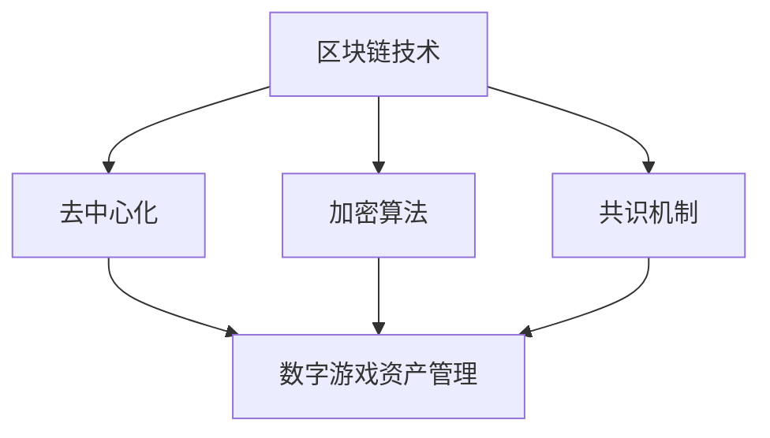

                 

### 文章标题

《区块链在数字游戏资产管理中的应用：保护玩家虚拟财产》

### 关键词

区块链、数字游戏资产、虚拟财产保护、智能合约、非对称加密

### 摘要

本文旨在探讨区块链技术在数字游戏资产管理中的应用，特别是如何通过区块链技术保护玩家的虚拟财产。文章首先介绍了区块链和数字游戏资产管理的背景，然后详细阐述了区块链技术如何与数字游戏资产管理相结合，以及如何通过核心算法和数学模型来实现虚拟财产的安全管理。文章还包括具体的案例分析和技术挑战的解决方案，最后探讨了区块链在数字游戏资产管理中的未来发展趋势。

## 引言

随着互联网和数字技术的不断发展，数字游戏已经成为现代娱乐的重要组成部分。玩家在数字游戏中投入了大量的时间和金钱，积累了丰富的虚拟财产，这些虚拟财产的价值不容忽视。然而，传统的数字游戏资产管理方式存在诸多问题，如数据不安全、交易不可靠、玩家权益无法得到保障等。区块链技术的出现，为解决这些问题提供了新的思路。

区块链技术以其去中心化、不可篡改和透明性等特点，在数字游戏资产管理中具有广泛的应用前景。本文将详细探讨区块链在数字游戏资产管理中的应用，特别是如何利用区块链技术保护玩家的虚拟财产。

## 核心概念与联系

### 区块链基本原理

区块链是一种分布式数据库技术，它通过加密算法和共识机制实现数据的存储和传输。区块链的基本原理包括：

1. **去中心化**：区块链不依赖于中央机构，每个节点都可以参与数据的验证和存储。
2. **加密算法**：区块链使用加密算法保护数据的安全性和隐私性。
3. **共识机制**：区块链通过共识机制确保数据的可靠性和一致性。

### 数字游戏资产管理的现状

数字游戏资产管理的现状主要包括以下几个方面：

1. **数据不安全**：传统游戏平台的数据管理方式容易受到黑客攻击，导致玩家虚拟财产被盗。
2. **交易不可靠**：传统游戏平台的交易记录容易篡改，无法保证交易的公正性。
3. **玩家权益无法保障**：玩家在游戏中的虚拟财产无法得到有效保障，一旦游戏平台出现问题，玩家的权益无法得到赔偿。

### 区块链与数字游戏资产管理的联系

区块链技术可以通过以下方式与数字游戏资产管理相结合：

1. **去中心化**：区块链的去中心化特性可以确保游戏平台的数据安全和交易的公正性。
2. **加密算法**：区块链的加密算法可以保护玩家虚拟财产的安全性。
3. **共识机制**：区块链的共识机制可以确保游戏平台的数据一致性和可靠性。

为了更清晰地展示区块链技术的基本原理与数字游戏资产管理的联系，我们可以使用Mermaid流程图来表示：



### 核心算法原理讲解

#### 非对称加密算法

非对称加密算法是区块链技术中用于保护数据安全的重要手段。它包括公钥和私钥两个密钥，公钥用于加密，私钥用于解密。非对称加密算法的基本原理如下：

1. **密钥生成**：系统随机生成一对公钥和私钥。
2. **加密过程**：使用公钥对数据进行加密。
3. **解密过程**：使用私钥对加密数据进行解密。

伪代码如下：

```python
# 密钥生成
def generate_keys():
    # 生成公钥和私钥
    public_key, private_key = crypto.generate_key_pair()
    return public_key, private_key

# 加密过程
def encrypt(message, public_key):
    encrypted_message = crypto.encrypt(message, public_key)
    return encrypted_message

# 解密过程
def decrypt(encrypted_message, private_key):
    message = crypto.decrypt(encrypted_message, private_key)
    return message
```

#### 智能合约原理

智能合约是区块链技术中用于实现自动化交易的程序。它基于区块链的不可篡改特性，确保交易的公正性和可靠性。智能合约的基本原理如下：

1. **合约编写**：开发者使用智能合约编程语言编写合约代码。
2. **部署合约**：将合约代码部署到区块链上。
3. **执行合约**：合约代码在区块链上执行，根据预设条件自动执行交易。

伪代码如下：

```solidity
// 合约编写
contract VirtualAsset {
    // 定义玩家和虚拟资产
    mapping(address => mapping(string => uint256)) assets;

    // 存入虚拟资产
    function depositAsset(string memory asset_name, uint256 amount) public {
        assets[msg.sender][asset_name] = amount;
    }

    // 提取虚拟资产
    function withdrawAsset(string memory asset_name, uint256 amount) public {
        require(assets[msg.sender][asset_name] >= amount, "Insufficient balance");
        assets[msg.sender][asset_name] -= amount;
    }
}
```

### 数学模型与公式讲解

区块链技术在数字游戏资产管理中的应用涉及多个数学模型和公式。以下是几个重要的数学模型和公式的讲解：

#### 拉格朗日插值法

拉格朗日插值法是一种用于插值多项式的数学方法。它可以用来计算区块链中某个节点的数据。公式如下：

$$
L(x) = \sum_{i=0}^{n} y_i \prod_{j=0, j \neq i}^{n} \frac{x - x_j}{x_i - x_j}
$$

其中，$L(x)$ 是插值多项式，$y_i$ 是节点数据，$x_i$ 是节点位置。

#### 梅克尔树

梅克尔树是一种用于数据加密和验证的数据结构。它可以用来构建区块链中的数据结构，确保数据的完整性。梅克尔树的构建过程如下：

1. **构建二叉树**：将数据按照一定顺序排列，构建二叉树。
2. **计算哈希值**：对每个节点进行哈希运算，得到新的哈希值。
3. **重复步骤**：将二叉树的叶子节点哈希值组合成新的哈希值，直到根节点。

#### 证明-of-stake模型

证明-of-stake（PoS）模型是区块链中的一种共识机制。它通过计算节点的权益值来决定节点能否参与区块生成。权益值的计算公式如下：

$$
stake_value = \frac{stake \times time}{block_reward}
$$

其中，$stake$ 是节点持有的代币数量，$time$ 是节点持有代币的时间，$block_reward$ 是区块奖励。

### 项目实战

#### 实际应用案例

以下是一个基于区块链的数字游戏资产管理项目的实战案例：

**项目背景**：一个虚拟游戏世界，玩家可以在其中收集虚拟资产，如装备、道具等。这些虚拟资产的价值随着游戏的发展不断增长，因此需要一种可靠的方式来管理和保护这些资产。

**开发环境搭建**：使用以太坊智能合约开发平台（如Truffle）和区块链节点搭建环境。

**源代码实现**：

```solidity
// SPDX-License-Identifier: MIT
pragma solidity ^0.8.0;

contract VirtualAssetManager {
    mapping(address => mapping(string => uint256)) public assets;

    function depositAsset(string memory asset_name, uint256 amount) public {
        assets[msg.sender][asset_name] += amount;
    }

    function withdrawAsset(string memory asset_name, uint256 amount) public {
        require(assets[msg.sender][asset_name] >= amount, "Insufficient balance");
        assets[msg.sender][asset_name] -= amount;
    }
}
```

**代码解读与分析**：

1. **资产存储**：使用映射（mapping）数据结构存储玩家的虚拟资产。
2. **存入虚拟资产**：使用`depositAsset`函数存入虚拟资产。
3. **提取虚拟资产**：使用`withdrawAsset`函数提取虚拟资产，确保余额足够。

**项目小结**：通过区块链技术，实现了虚拟资产的去中心化管理和保护，提高了资产的安全性和可靠性。

### 最佳实践 tips

1. **安全性**：确保智能合约的代码安全性，避免潜在的安全漏洞。
2. **可扩展性**：设计合理的区块链架构，提高系统的可扩展性。
3. **用户友好**：提供简单易用的用户界面，提高用户体验。

### 小结

本文详细探讨了区块链在数字游戏资产管理中的应用，特别是如何通过区块链技术保护玩家的虚拟财产。文章介绍了区块链的基本原理和与数字游戏资产管理的联系，详细讲解了核心算法和数学模型，并通过实际案例展示了区块链技术在数字游戏资产管理中的应用。未来，随着区块链技术的不断发展，数字游戏资产管理将迎来新的发展机遇。

### 拓展阅读

1. **区块链技术原理与应用**：深入了解区块链技术的原理和应用场景。
2. **智能合约编程实战**：学习智能合约的编写和部署方法。
3. **去中心化金融（DeFi）**：了解去中心化金融的发展和应用。

### 注意事项

1. **合规性**：在实施区块链技术时，需要遵守相关法律法规。
2. **安全性**：确保系统的安全性，防止数据泄露和黑客攻击。

### 作者信息

作者：AI天才研究院/AI Genius Institute & 禅与计算机程序设计艺术 /Zen And The Art of Computer Programming

