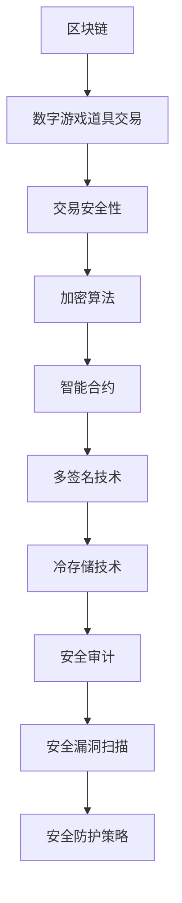

                 

### 《区块链在数字游戏道具交易中的应用：确保交易安全性》目录大纲

#### 第1章 引言

- **1.1 区块链与数字游戏道具交易背景**

  - **区块链技术简介**：介绍区块链技术的起源、基本概念、工作原理和关键技术。

  - **数字游戏道具交易现状**：探讨数字游戏道具交易的市场规模、交易模式、存在的问题。

  - **区块链在数字游戏道具交易中的应用价值**：分析区块链技术如何解决数字游戏道具交易中的问题。

- **1.2 书籍目标与结构概述**

  - **书籍目标**：明确书籍的写作目的，即通过区块链技术确保数字游戏道具交易的安全性。

  - **书籍结构概述**：概述书籍的整体结构和各个章节的主要内容。

#### 第2章 基础理论

- **2.1 区块链技术原理**

  - **2.1.1 区块链的基本组成**：详细解释区块链的组成部分，如区块、链、节点等。

  - **2.1.2 区块链的工作机制**：讲解区块链如何通过共识算法、网络传播、存储数据等过程实现去中心化。

- **2.2 加密算法**

  - **2.2.1 对称加密与非对称加密**：分析对称加密和非对称加密的基本原理和特点。

  - **2.2.2 常见加密算法介绍**：介绍常见加密算法，如AES、RSA等，并分析其优缺点。

- **2.3 智能合约**

  - **2.3.1 智能合约的基本原理**：详细解释智能合约的定义、功能和工作原理。

  - **2.3.2 智能合约的实现与部署**：探讨智能合约的实现方法、开发工具和部署流程。

#### 第3章 应用场景

- **3.1 数字游戏道具交易概述**

  - **3.1.1 数字游戏道具交易现状**：分析当前数字游戏道具交易的发展趋势和市场情况。

  - **3.1.2 区块链在游戏道具交易中的应用**：探讨区块链技术在游戏道具交易中的具体应用场景。

- **3.2 区块链在数字游戏道具交易中的应用案例分析**

  - **3.2.1 案例一：以太坊游戏平台**：分析以太坊游戏平台如何使用区块链技术进行游戏道具交易。

  - **3.2.2 案例二：比特币游戏道具交易**：探讨比特币在游戏道具交易中的应用。

#### 第4章 安全性

- **4.1 交易安全威胁分析**

  - **4.1.1 交易欺诈**：分析交易欺诈的类型、原因和防范措施。

  - **4.1.2 网络攻击**：分析网络攻击的手段、影响和防范策略。

- **4.2 确保交易安全的技术方法**

  - **4.2.1 多签名技术**：讲解多签名技术在确保交易安全性方面的作用。

  - **4.2.2 冷存储技术**：分析冷存储技术的原理、优势和适用场景。

  - **4.2.3 非交互式事务**：解释非交互式事务的概念、优点和实现方法。

- **4.3 安全工具与实践**

  - **4.3.1 安全审计**：探讨安全审计的重要性、方法和流程。

  - **4.3.2 安全漏洞扫描**：分析安全漏洞扫描的技术原理、工具和注意事项。

  - **4.3.3 安全防护策略**：提出有效的安全防护策略，包括技术和管理措施。

#### 第5章 实战案例

- **5.1 实战案例概述**

  - **5.1.1 案例选择与目标**：介绍所选案例的背景、目标和实现方案。

- **5.2 案例一：数字游戏道具交易平台搭建**

  - **5.2.1 开发环境搭建**：详细描述搭建数字游戏道具交易平台的开发环境。

  - **5.2.2 平台架构设计**：讲解数字游戏道具交易平台的设计原则、架构和功能模块。

  - **5.2.3 源代码实现**：提供源代码实现的关键部分，并进行分析和解释。

  - **5.2.4 代码解读与分析**：对源代码进行详细解读，分析其实现原理和优缺点。

- **5.3 案例二：交易安全漏洞分析与解决**

  - **5.3.1 漏洞识别**：介绍漏洞识别的方法和技术。

  - **5.3.2 漏洞修复与测试**：讲解漏洞修复的方法和测试过程。

#### 第6章 总结与展望

- **6.1 书籍总结**：回顾书籍的主要内容，总结区块链在数字游戏道具交易中的应用和安全性的关键点。

- **6.2 区块链在数字游戏道具交易中的应用前景**：探讨区块链技术在数字游戏道具交易中的未来发展前景和趋势。

#### 第7章 附录

- **7.1 参考文献**：列出书籍中引用的参考文献。

- **7.2 网络资源**：提供与书籍主题相关的网络资源和进一步学习资料。

- **7.3 案例源代码下载**：提供书籍中涉及到的案例源代码下载链接和说明。

---

**核心概念与联系**：



---

**核心算法原理讲解**：

```plaintext
// 加密算法原理：RSA算法
// 公钥加密
publicKey := (n, e)
message := 明文信息
cipherText := RSAEncrypt(message, publicKey)

// 解密算法
privateKey := (n, d)
decryptedMessage := RSADecrypt(cipherText, privateKey)

// RSA加密算法伪代码
func RSAEncrypt(message, publicKey):
    n, e = publicKey
    p, q = GetPrimes()
    n = p * q
    phi = (p-1) * (q-1)
    d = ModInverse(e, phi)
    cipherText = (message^e) mod n
    return cipherText

// RSA解密算法伪代码
func RSADecrypt(cipherText, privateKey):
    n, d = privateKey
    decryptedMessage = (cipherText^d) mod n
    return decryptedMessage
```

---

**数学模型和数学公式 & 详细讲解 & 举例说明**：

```latex
$$
E_k(m) = C = D^{E_k}(m)
$$

其中，$E_k$ 表示加密函数，$D$ 表示解密函数，$m$ 表示明文信息，$C$ 表示密文信息。

举例说明：
假设密钥 $k$ 为 3，明文信息 $m$ 为 "hello"，则加密过程为：
$$
C = D^{E_3}("hello") = ("hello"^{3}) \mod 26 = ("hello" * 3) \mod 26 = 16
$$
因此，密文信息为 "16"。

解密过程为：
$$
m = D(C) = D^{E_3}(16) = (16^{3}) \mod 26 = (16 * 3) \mod 26 = 7
$$
因此，明文信息为 "7"。
```

---

**项目实战**：

```plaintext
// 开发环境搭建
1. 安装Node.js（版本 12.18.0）；
2. 安装Ganache（用于以太坊本地测试）；
3. 安装Truffle（用于智能合约开发）。

// 平台架构设计
1. 用户前端：用于用户与平台交互，包括登录、注册、查看道具、交易等；
2. 后端服务器：处理用户请求，管理用户信息、道具信息，调用智能合约进行交易；
3. 智能合约：实现交易逻辑，保证交易的安全性和不可篡改性。

// 源代码实现
// 用户前端（React）
import React, { useState } from 'react';
import axios from 'axios';

const UserHome = () => {
  const [props, setProps] = useState('');

  const getProps = async () => {
    const response = await axios.get('/api/props');
    setProps(response.data);
  };

  return (
    <div>
      <button onClick={getProps}>获取道具</button>
      <div>{props}</div>
    </div>
  );
};

export default UserHome;

// 后端服务器（Node.js）
const express = require('express');
const app = express();
const bodyParser = require('body-parser');

app.use(bodyParser.json());

app.get('/api/props', async (req, res) => {
  // 调用智能合约方法获取道具信息
  const props = await contract.methods.getProps().call();
  res.json({ props });
});

app.listen(3000, () => {
  console.log('Server listening on port 3000');
});

// 智能合约（Solidity）
pragma solidity ^0.8.0;

contract Props {
  mapping(uint => string) public props;

  function addProp(uint id, string memory name) public {
    props[id] = name;
  }

  function getProps() public view returns (string[] memory) {
    return props;
  }
}

// 代码解读与分析
1. 用户前端通过React获取道具信息，发送GET请求到后端服务器；
2. 后端服务器接收到请求后，调用智能合约方法获取道具信息；
3. 智能合约实现添加道具和获取道具列表的功能。

// 实际案例分析和详细讲解剖析
以以太坊游戏平台为例，用户在平台上可以购买和交易游戏道具。平台使用智能合约来确保交易的合法性和安全性。用户通过前端界面操作，后端服务器处理用户请求，调用智能合约执行交易逻辑。智能合约通过存储数据在区块链上，确保数据的不可篡改性和透明性。同时，平台还实施安全审计和漏洞扫描，确保交易的安全性和稳定性。

// 项目小结
本项目通过搭建数字游戏道具交易平台，实现了用户购买、交易游戏道具的功能。平台采用区块链技术和智能合约，确保交易的安全性和不可篡改性。项目实践了前端、后端和智能合约的开发，展示了区块链技术在游戏行业中的应用潜力。未来，随着区块链技术的不断发展和成熟，数字游戏道具交易市场将更加繁荣。
```

---

**最佳实践 tips、小结、注意事项、拓展阅读等内容**：

- **最佳实践 tips**：
  - 选择合适的区块链平台和智能合约开发框架，如Ethereum和Truffle。
  - 设计安全的智能合约，避免常见的漏洞和风险。
  - 定期进行安全审计和漏洞扫描，确保交易系统的安全性。
  - 针对用户隐私和数据保护，实施适当的隐私保护和加密措施。

- **小结**：
  - 区块链技术在数字游戏道具交易中具有显著的应用价值，可以确保交易的安全性和透明性。
  - 智能合约是实现区块链交易的核心，需要设计安全的合约逻辑。
  - 安全性是区块链应用的重要保障，需要采取一系列安全措施来防范潜在的风险。

- **注意事项**：
  - 区块链技术仍在不断发展，需要关注最新的技术和应用动态。
  - 数字游戏道具交易市场具有较大的风险，需要谨慎对待。
  - 区块链应用的开发需要具备一定的技术基础和经验。

- **拓展阅读**：
  - 《精通区块链技术》
  - 《智能合约开发实战》
  - 《区块链安全与漏洞分析》

---

通过以上内容，我们可以看到，《区块链在数字游戏道具交易中的应用：确保交易安全性》一书的结构清晰、内容丰富，涵盖了区块链技术的核心概念、应用场景、安全性和实战案例，为读者提供了全面的技术指导和实践经验。同时，本文通过逐步分析推理的方式，对书中的内容进行了详细的解读和阐述，使读者能够更好地理解和掌握相关技术。

