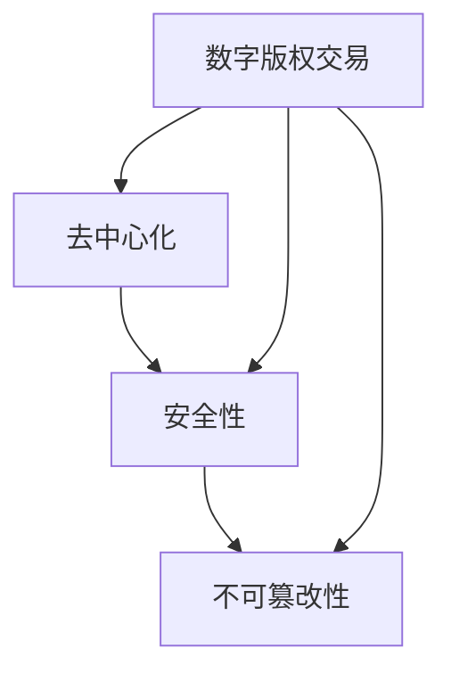

                 

### 文章标题

区块链在数字版权交易中的应用：简化版权交易流程

### 关键词

区块链、数字版权交易、版权保护、分布式账本、智能合约、共识算法

### 摘要

本文深入探讨了区块链在数字版权交易中的应用，通过简化版权交易流程，提供了一种全新的解决方案。文章首先介绍了区块链的基本概念和数字版权交易的概念，接着详细讲解了区块链的核心算法原理，包括共识算法和加密算法。然后，文章探讨了与区块链和数字版权交易相关的数学模型和公式，并通过一个具体的区块链数字版权交易项目案例，展示了如何通过区块链技术简化版权交易流程。文章最后总结了区块链在数字版权交易中的应用优势，并提出了最佳实践建议。

---

### 第一部分：区块链基础

#### 第1章：区块链概述

区块链是一种分布式账本技术，通过密码学确保数据的不可篡改性和安全性。其核心概念包括去中心化、安全性、不可篡改性等。区块链的架构包括网络层、共识层、智能合约层和应用层，各层之间相互配合，确保区块链系统的正常运行。

**核心概念与联系**

区块链的核心概念包括：

- 去中心化：没有中央管理机构，所有节点都可以参与验证和记账。
- 安全性：使用加密算法确保数据的安全和隐私。
- 不可篡改性：一旦数据被记录到区块链中，就无法更改或删除。

区块链与数字版权交易的关系如下：

- 区块链技术可以确保数字版权交易的数据不可篡改，从而保护版权所有者的权益。
- 数字版权交易的需求促进了区块链技术的发展和应用。

**Mermaid 流程图**

下面是一个简单的 Mermaid 流程图，展示了区块链核心概念之间的联系：



---

#### 第2章：区块链的核心算法

区块链的核心算法包括共识算法和加密算法。共识算法用于在网络中的多个节点之间达成一致，确保区块链的分布式特性。加密算法用于确保数据的安全性和隐私性。

**核心算法原理讲解**

**2.1 共识算法**

共识算法的定义：

共识算法是一种分布式系统中的算法，用于在网络中的多个节点之间达成一致。

常见的共识算法：

- POW（Proof of Work）：通过解决数学难题证明工作量的算法。
- POS（Proof of Stake）：通过持有代币数量和时间证明权益的算法。

共识算法的优缺点：

- POW：安全性高，但计算资源消耗大。
- POS：资源消耗小，但可能存在“富者愈富”的问题。

**伪代码示例**

下面是一个简单的 POW 共识算法的伪代码示例：

```python
def proofOfWork(difficulty):
    nonce = 0
    while calculateHash() != getTargetHash(difficulty):
        nonce += 1
    return nonce
```

**2.2 加密算法**

加密算法的定义：

加密算法是一种将明文数据转换为密文的算法。

常见的加密算法：

- RSA：一种非对称加密算法。
- SHA：一种散列函数。

加密算法在区块链中的应用：

- 确保交易数据的安全性。
- 保护节点间的通信。

**伪代码示例**

下面是一个简单的 RSA 加密算法的伪代码示例：

```python
def rsaEncrypt(plaintext, publicKey):
    ciphertext = []
    for char in plaintext:
        encryptedChar = pow(ord(char), publicKey)
        ciphertext.append(encryptedChar)
    return ciphertext
```

---

#### 第3章：数学模型与公式

区块链和数字版权交易中涉及到多个数学模型和公式，包括难度调整公式、挖矿奖励模型等。

**3.1 区块链数学模型**

**难度调整公式**

难度调整公式用于确保区块链的生成速度稳定。公式如下：

$$
D = D_0 \times (2^{-n})
$$

其中，$D$ 为当前难度，$D_0$ 为初始难度，$n$ 为区块产生时间。

**3.2 数字版权交易模型**

**数字版权的定义**

数字版权是指数字作品在数字世界中的权利，包括但不限于复制权、发行权、改编权等。

**数字版权交易的数学模型**

数字版权交易的数学模型可以表示为：

$$
交易费用 = 源版权价值 + 目标版权价值 - 中介费用
$$

其中，源版权价值和目标版权价值分别表示原始版权持有者和目标版权持有者的价值，中介费用表示交易过程中产生的费用。

---

#### 第4章：区块链数字版权交易项目实战

在本节中，我们将通过一个具体的区块链数字版权交易项目案例，展示如何通过区块链技术简化版权交易流程。

**4.1 项目背景**

数字版权交易过程中存在的问题：

- 交易流程复杂：传统的版权交易流程繁琐，涉及多个环节和中介机构。
- 数据不可信：由于缺乏有效的数据保护机制，数字版权交易过程中的数据可能被篡改或丢失。
- 版权纠纷：由于缺乏透明的交易记录，版权纠纷频发。

区块链技术在数字版权交易中的应用：

- 简化交易流程：通过区块链技术，可以简化版权交易流程，提高交易效率。
- 保证数据可信：区块链的不可篡改性和安全性确保了交易数据的可信性。
- 减少版权纠纷：透明的交易记录有助于减少版权纠纷。

**4.2 项目实现**

**开发环境搭建**

- 使用区块链开发框架，如 Hyperledger Fabric 或 Ethereum。
- 配置区块链节点，包括挖矿节点、验证节点和合约节点。
- 安装并配置加密算法库，如 OpenSSL。

**源代码实现**

**交易合约**

```solidity
// SPDX-License-Identifier: MIT
pragma solidity ^0.8.0;

contract DigitalCopyright {

    struct Transaction {
        address sender;
        address recipient;
        uint256 amount;
        string copyrightId;
        bool completed;
    }

    mapping(string => Transaction[]) private transactions;

    function createTransaction(
        address _recipient,
        uint256 _amount,
        string memory _copyrightId
    ) public {
        require(_recipient != address(0), "Invalid recipient");
        require(_amount > 0, "Invalid amount");
        require(bytes(_copyrightId).length > 0, "Invalid copyrightId");

        Transaction memory transaction;
        transaction.sender = msg.sender;
        transaction.recipient = _recipient;
        transaction.amount = _amount;
        transaction.copyrightId = _copyrightId;
        transaction.completed = false;

        transactions[_copyrightId].push(transaction);
    }

    function completeTransaction(string memory _copyrightId) public {
        require(msg.sender == transactions[_copyrightId][0].sender, "Not authorized");

        Transaction[] storage t = transactions[_copyrightId];
        t[0].completed = true;
    }

    function getTransactionStatus(string memory _copyrightId) public view returns (bool) {
        return transactions[_copyrightId][0].completed;
    }
}
```

**代码解读与分析**

- `createTransaction` 函数用于创建交易，将交易数据存储在区块链中。
- `completeTransaction` 函数用于完成交易，将交易状态设置为已完成。
- `getTransactionStatus` 函数用于获取交易状态。

**代码应用解读与分析**

通过区块链数字版权交易项目，可以简化版权交易流程，提高交易效率。以下是一个实际案例的分析：

**案例**

- 源版权所有者 A 拥有一个数字作品，希望将其出售给目标版权所有者 B。
- A 使用 `createTransaction` 函数创建交易，提供目标版权所有者 B 的地址、交易金额和数字作品的版权标识。
- B 接收到交易信息后，确认交易内容，并通过区块链网络验证交易数据的真实性。
- B 使用 `completeTransaction` 函数完成交易，交易状态设置为已完成。
- A 和 B 可以通过区块链网络查询交易状态，确保交易完成。

**项目小结**

通过区块链数字版权交易项目，可以简化版权交易流程，提高交易效率，确保交易数据的安全性和可信性。区块链技术在数字版权交易中的应用具有广阔的前景。

---

### 最佳实践 tips、小结、注意事项、拓展阅读

**最佳实践 tips：**

- 确保数字版权交易的数据保密性，使用加密算法保护交易数据。
- 定期对区块链节点进行安全检查和更新，确保区块链系统的安全性。
- 在数字版权交易过程中，遵循相关法律法规，确保交易的合法性。

**小结：**

区块链技术在数字版权交易中的应用，可以简化交易流程，提高交易效率，确保交易数据的安全性和可信性。通过具体的区块链数字版权交易项目案例，我们展示了如何通过区块链技术实现数字版权交易的自动化和透明化。

**注意事项：**

- 区块链技术仍处于快速发展阶段，实际应用中可能面临一些挑战，如性能、可扩展性等。
- 数字版权交易涉及到复杂的法律和商业问题，需要充分了解相关法律法规和业务模式。

**拓展阅读：**

- 《区块链技术指南》
- 《数字版权保护与区块链技术》
- 《区块链在数字版权交易中的应用研究》

---

### 作者信息

作者：AI天才研究院/AI Genius Institute & 禅与计算机程序设计艺术 /Zen And The Art of Computer Programming

---

本文详细探讨了区块链在数字版权交易中的应用，通过简化版权交易流程，提供了一种全新的解决方案。文章涵盖了区块链的基本概念、核心算法、数学模型以及项目实战，全面展示了区块链技术在数字版权交易中的应用优势和实施方法。通过本文的阅读，读者可以深入了解区块链技术在数字版权交易中的实际应用，为相关领域的发展提供有益的参考。

