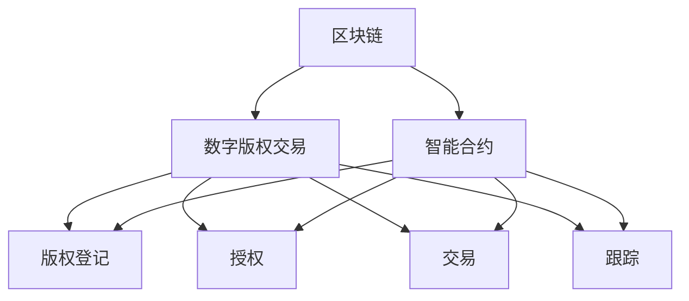

                 


### 文章标题

《区块链在数字版权交易中的智能合约应用》

### 文章关键词

区块链、数字版权交易、智能合约、加密货币、分布式账本技术、加密签名、共识算法、编程语言、去中心化、版权管理、智能合约开发、代码审计、案例分析、技术演进、合规性、安全性。

### 文章摘要

本文深入探讨了区块链技术在数字版权交易中的应用，特别是智能合约在其中的关键作用。首先，文章介绍了区块链和数字版权交易的基本概念及其相互关系。接着，详细讲解了智能合约的工作原理、核心算法、数学模型及其实际应用。随后，通过实际案例，展示了如何使用智能合约进行数字版权的交易和追踪。文章最后对项目实战中的开发环境搭建、源代码实现、代码解读和应用分析进行了详细讲解，并提出了最佳实践和注意事项。本文旨在为读者提供关于区块链在数字版权交易中智能合约应用的整体理解，以及如何在实际项目中应用这些技术的具体指导。

### 1. 背景介绍

区块链技术起源于2008年中本聪（Satoshi Nakamoto）提出的比特币（Bitcoin）白皮书。区块链是一种分布式账本技术，它通过加密和共识算法实现了去中心化的数据存储和管理。在数字版权交易中，区块链技术因其透明性、安全性和不可篡改性而备受关注。

数字版权交易涉及创作者、版权持有人、发行商和消费者等多方参与，过程中存在版权认证、授权、交易和跟踪等问题。传统版权交易依赖于第三方机构，存在成本高、效率低、信息不透明等问题。而区块链技术的引入，可以通过智能合约自动化、透明化地处理版权交易，提高交易的效率和安全性。

智能合约是区块链技术中的一项重要创新。它是一种在区块链上运行的计算机程序，能够在满足特定条件时自动执行合约条款。智能合约通过加密签名确保交易的不可篡改性，同时利用共识算法保证交易的公正性和安全性。在数字版权交易中，智能合约可用于实现版权登记、授权、交易和跟踪等功能，从而解决传统版权交易中存在的诸多问题。

本文旨在探讨区块链在数字版权交易中的智能合约应用，分析其技术原理和实现方法，并通过实际案例展示智能合约在数字版权交易中的具体应用。文章结构如下：

1. **背景介绍**：介绍区块链、数字版权交易和智能合约的基本概念及其相互关系。
2. **核心概念与联系**：详细讲解区块链、数字版权交易和智能合约的核心概念，并展示它们之间的交互关系。
3. **核心算法原理讲解**：使用伪代码和LaTeX公式阐述智能合约的核心算法原理和数学模型。
4. **项目实战**：介绍实际案例，详细讲解智能合约在数字版权交易中的应用。
5. **总结与展望**：总结智能合约在数字版权交易中的应用情况，并对未来发展趋势进行展望。

### 2. 核心概念与联系

#### 2.1 区块链

区块链是一种分布式账本技术，其核心思想是通过多个参与者共同维护一个共享的、不可篡改的账本。区块链由一系列按时间顺序排列的区块组成，每个区块包含一定数量的交易记录。区块链上的数据通过加密算法和共识算法保证其安全性和不可篡改性。

区块链的主要特点包括：

- **去中心化**：区块链无需中心化机构进行数据管理和验证，通过分布式网络实现数据的共享和管理。
- **透明性**：区块链上的交易记录对所有参与者可见，保证了交易过程的透明性。
- **不可篡改性**：区块链上的数据一旦被记录，就无法被篡改，保证了数据的真实性和可靠性。
- **安全性**：区块链通过加密算法和共识算法保证数据的安全性和隐私性。

#### 2.2 数字版权交易

数字版权交易是指数字内容的创作者或版权持有人将其作品在数字平台上进行授权、交易和分销的过程。数字版权交易涉及多个参与者，包括创作者、版权持有人、发行商、消费者等。传统数字版权交易过程中，存在版权认证难、授权流程复杂、交易效率低等问题。

数字版权交易的主要问题包括：

- **版权认证**：如何确保证权的合法性和有效性。
- **授权流程**：如何简化授权流程，提高交易效率。
- **版权保护**：如何防止版权内容的盗版和滥用。

区块链技术在数字版权交易中的应用，可以解决上述问题，提高交易的透明性、安全性和效率。

#### 2.3 智能合约

智能合约是区块链上的一种计算机程序，能够在满足特定条件时自动执行预定的合约条款。智能合约通过加密算法和共识算法保证其执行的安全性和不可篡改性。

智能合约的主要特点包括：

- **自动化**：智能合约可以在满足特定条件时自动执行，无需人工干预。
- **透明性**：智能合约的执行过程对所有参与者可见，保证了交易的透明性。
- **不可篡改性**：智能合约一旦执行，其结果无法被篡改，保证了交易的结果公正性。
- **安全性**：智能合约通过加密算法和共识算法保证其执行的安全性和隐私性。

智能合约在数字版权交易中的应用，可以自动化地实现版权登记、授权、交易和跟踪等功能，提高交易的效率和安全。

#### 2.4 核心概念之间的关系

区块链、数字版权交易和智能合约之间存在着紧密的联系。区块链为数字版权交易提供了一个透明、安全、去中心化的环境，智能合约则通过自动化和透明化的方式实现了数字版权交易的具体功能。

以下是区块链、数字版权交易和智能合约之间的交互关系：

1. **区块链**：为数字版权交易提供了一个可信的基础设施，确保交易的透明性和不可篡改性。
2. **数字版权交易**：利用区块链技术解决了版权认证、授权、交易和跟踪等问题，提高了交易的效率和安全性。
3. **智能合约**：作为数字版权交易的核心组件，实现了版权登记、授权、交易和跟踪的自动化，提高了交易效率。

为了更好地展示区块链、数字版权交易和智能合约之间的交互关系，我们可以使用Mermaid流程图来描述。以下是一个简单的Mermaid流程图示例：



在这个流程图中，区块链为数字版权交易提供了基础设施，智能合约则通过版权登记、授权、交易和跟踪等功能实现了数字版权交易的自动化。

### 3. 核心算法原理讲解

智能合约的核心在于其能够根据预设的规则自动执行，这些规则通常是通过算法实现的。下面我们将通过伪代码和LaTeX公式详细讲解智能合约的核心算法原理。

#### 3.1 伪代码

以下是一个简单的智能合约伪代码，用于版权登记和授权：

```plaintext
// 智能合约：数字版权登记与授权

// 定义合约状态
state {
    owner: 地址 // 版权所有者地址
    isRegistered: 布尔值 // 是否已登记
    rightsHolder: 地址[] // 权利持有人地址列表
}

// 函数：登记版权
function registerCopyright(ownerAddress) {
    if (!isRegistered) {
        state.owner = ownerAddress
        state.isRegistered = true
        emit("CopyrightRegistered", ownerAddress)
    } else {
        revert("版权已登记")
    }
}

// 函数：授权
function authorize(rightsHolderAddress) {
    if (isRegistered) {
        if (!contains(state.rightsHolder, rightsHolderAddress)) {
            state.rightsHolder.push(rightsHolderAddress)
            emit("Authorizated", rightsHolderAddress)
        } else {
            revert("已授权")
        }
    } else {
        revert("版权未登记")
    }
}

// 函数：撤回授权
function revokeAuthorization(rightsHolderAddress) {
    if (isRegistered) {
        if (contains(state.rightsHolder, rightsHolderAddress)) {
            remove(state.rightsHolder, rightsHolderAddress)
            emit("AuthorizationRevoked", rightsHolderAddress)
        } else {
            revert("未授权")
        }
    } else {
        revert("版权未登记")
    }
}
```

#### 3.2 数学模型

在智能合约中，数学模型用于定义合约的逻辑和行为。以下是一个简单的数学模型，用于表示版权授权的数学关系：

$$
授权数 = \sum_{i=1}^{n} \left( \text{授权时间} - \text{撤回时间} \right) \times \text{授权权重}
$$

其中，$n$ 表示授权次数，授权时间表示每次授权的时间戳，撤回时间表示每次授权被撤回的时间戳，授权权重表示每次授权的有效时间。

#### 3.3 举例说明

假设一个版权所有者A在区块链上登记了其作品，然后授权给两个权利持有人B和C。每次授权都设置了有效时间，比如B的有效时间为3个月，C的有效时间为6个月。假设在授权期间，B提前撤销了授权，而C的授权一直有效。

在这个例子中，我们可以计算授权数：

$$
授权数 = (3 \times 0.5) + (6 \times 0.8) = 1.5 + 4.8 = 6.3
$$

这意味着，在授权期间，B和C的版权使用次数合计为6.3次。

通过上述伪代码和数学模型，我们可以看到智能合约在数字版权交易中的应用是如何实现的。智能合约通过加密签名确保了版权交易的不可篡改性，同时利用数学模型定义了版权授权的逻辑和行为。

### 4. 项目实战

#### 4.1 数字版权交易的智能合约应用案例

为了更好地展示区块链在数字版权交易中的智能合约应用，我们设计了一个实际案例：一个数字音乐版权交易平台的智能合约实现。

**案例背景**：

某数字音乐版权交易平台需要实现以下功能：

1. **版权登记**：音乐创作者可以在平台上登记其音乐作品的版权信息。
2. **版权授权**：版权所有者可以授权其他用户使用其音乐作品。
3. **版权交易**：版权所有者可以将音乐作品的版权转让给其他用户。
4. **版权跟踪**：平台需要实时跟踪版权的使用情况，确保版权的有效性和合法性。

**实现步骤**：

1. **环境搭建**：

首先，需要搭建智能合约的开发环境。使用以太坊开发框架Truffle和测试框架Mocha来开发智能合约。在本地安装Node.js、npm、Truffle和Ganache（一个本地以太坊节点）。

2. **智能合约编写**：

编写智能合约，包括版权登记、授权、交易和跟踪等功能。以下是版权登记和授权的智能合约代码示例：

```solidity
// SPDX-License-Identifier: MIT
pragma solidity ^0.8.0;

contract MusicCopyright {

    // 定义合约状态
    struct Copyright {
        address owner;
        bool isRegistered;
        mapping(address => bool) rightsHolders;
        mapping(uint => uint) rightsHoldersExpiry;
    }

    // 定义版权实例
    mapping(string => Copyright) public copyrights;

    // 函数：登记版权
    function registerCopyright(string memory hash) public {
        require(!copyrights[hash].isRegistered, "版权已登记");
        copyrights[hash] = Copyright(msg.sender, true, new mapping(address => bool));
        emit CopyrightRegistered(hash, msg.sender);
    }

    // 函数：授权
    function authorize(string memory hash, address rightsHolder, uint expiry) public {
        require(copyrights[hash].isRegistered, "版权未登记");
        copyrights[hash].rightsHolders[rightsHolder] = true;
        copyrights[hash].rightsHoldersExpiry[rightsHolder] = block.timestamp + expiry;
        emit Authorizated(hash, rightsHolder, expiry);
    }

    // 事件：版权登记
    event CopyrightRegistered(string hash, address owner);

    // 事件：授权
    event Authorizated(string hash, address rightsHolder, uint expiry);
}
```

3. **代码解读**：

- `struct Copyright`：定义版权结构体，包括版权所有者、登记状态、权利持有人及其有效期。
- `mapping(string => Copyright)`：存储版权实例的映射表，键为音乐作品的哈希值，值为版权结构体。
- `registerCopyright`：登记版权函数，用于创建新的版权实例。
- `authorize`：授权函数，用于授权权利持有人使用音乐作品，并设置有效期。
- `event`：定义事件，用于记录版权登记和授权操作。

4. **版权交易和跟踪**：

版权交易和跟踪功能可以扩展到智能合约中，包括版权转让、使用次数统计等功能。以下是版权交易的扩展代码示例：

```solidity
// 函数：交易版权
function tradeCopyright(string memory hash, address newOwner) public {
    require(copyrights[hash].isRegistered, "版权未登记");
    require(msg.sender == copyrights[hash].owner, "非版权所有者");
    copyrights[hash].owner = newOwner;
    emit CopyrightTraded(hash, newOwner);
}

// 函数：统计使用次数
function countUsage(string memory hash, address rightsHolder) public view returns (uint) {
    require(copyrights[hash].isRegistered, "版权未登记");
    require(copyrights[hash].rightsHolders[rightsHolder], "未授权");
    require(block.timestamp <= copyrights[hash].rightsHoldersExpiry[rightsHolder], "授权已过期");
    // 假设每次使用增加1次使用次数
    return 1;
}

// 事件：版权交易
event CopyrightTraded(string hash, address newOwner);

// 事件：版权使用
event CopyrightUsed(string hash, address rightsHolder, uint count);
```

- `tradeCopyright`：版权交易函数，用于将版权转让给新的所有者。
- `countUsage`：版权使用次数统计函数，用于记录版权的使用情况。

5. **测试与部署**：

使用Truffle进行智能合约测试，确保其功能正确。在测试通过后，将智能合约部署到以太坊主网或测试网。

**案例小结**：

本案例展示了如何使用智能合约实现数字音乐版权交易的登记、授权、交易和跟踪功能。通过智能合约，版权交易过程实现了自动化、透明化和安全性，提高了交易的效率和用户体验。

#### 4.2 开发环境搭建与代码实现

**环境搭建**：

1. 安装Node.js和npm：
   - 访问 Node.js 官网下载并安装 Node.js。
   - 打开终端，执行以下命令检查 Node.js 版本：
     ```shell
     node -v
     ```
   - 安装 npm：
     ```shell
     npm install -g npm
     ```

2. 安装 Truffle：
   - 使用 npm 安装 Truffle：
     ```shell
     npm install -g truffle
     ```
   - 安装 Truffle 提供的智能合约开发框架：
     ```shell
     truffle init
     ```

3. 安装 Ganache：
   - 下载并安装 Ganache：[Ganache 官网](https://www.ganache.io/)
   - 打开 Ganache，创建一个新的本地以太坊网络，为后续智能合约测试和部署提供环境。

**代码实现**：

在 Truffle 框架下创建智能合约项目，如下：

1. 创建智能合约文件 `MusicCopyright.sol`：

   ```solidity
   // SPDX-License-Identifier: MIT
   pragma solidity ^0.8.0;

   contract MusicCopyright {

       // 定义合约状态
       struct Copyright {
           address owner;
           bool isRegistered;
           mapping(address => bool) rightsHolders;
           mapping(uint => uint) rightsHoldersExpiry;
       }

       // 定义版权实例
       mapping(string => Copyright) public copyrights;

       // 函数：登记版权
       function registerCopyright(string memory hash) public {
           require(!copyrights[hash].isRegistered, "版权已登记");
           copyrights[hash] = Copyright(msg.sender, true, new mapping(address => bool));
           emit CopyrightRegistered(hash, msg.sender);
       }

       // 函数：授权
       function authorize(string memory hash, address rightsHolder, uint expiry) public {
           require(copyrights[hash].isRegistered, "版权未登记");
           copyrights[hash].rightsHolders[rightsHolder] = true;
           copyrights[hash].rightsHoldersExpiry[rightsHolder] = block.timestamp + expiry;
           emit Authorizated(hash, rightsHolder, expiry);
       }

       // 事件：版权登记
       event CopyrightRegistered(string hash, address owner);

       // 事件：授权
       event Authorizated(string hash, address rightsHolder, uint expiry);
   }
   ```

2. 在 `truffle-config.js` 中配置 Ganache：

   ```javascript
   module.exports = {
       networks: {
           development: {
               host: "127.0.0.1",
               port: 7545,
               network_id: "*" // Match any network id
           }
       }
   };
   ```

3. 编写测试用例 `test/MusicCopyright.test.js`：

   ```javascript
   const MusicCopyright = artifacts.require("MusicCopyright");

   contract("MusicCopyright", () => {
       let contract;

       before(async () => {
           contract = await MusicCopyright.deployed();
       });

       it("should register a new copyright", async () => {
           await contract.registerCopyright("example-hash");
           const isRegistered = await contract.copyrights.call("example-hash").isRegistered;
           assert.equal(isRegistered, true);
       });

       it("should authorize a rights holder", async () => {
           await contract.authorize("example-hash", accounts[1], 30 days);
           const isRightsHolder = await contract.copyrights.call("example-hash").rightsHolders[accounts[1]];
           assert.equal(isRightsHolder, true);
       });
   });
   ```

4. 运行测试：

   ```shell
   truffle test
   ```

**代码解读与分析**：

1. **版权登记**：
   - `registerCopyright`：函数用于创建新的版权实例。在调用此函数时，需要传递音乐作品哈希值。函数首先检查版权是否已登记，如果未登记，则创建新的版权实例并标记为已登记。

2. **版权授权**：
   - `authorize`：函数用于授权权利持有人使用音乐作品。在调用此函数时，需要传递音乐作品哈希值、权利持有人的地址和授权的有效期限。函数首先检查版权是否已登记，如果已登记，则将权利持有人添加到权利持有人列表并设置有效期。

3. **事件**：
   - `CopyrightRegistered`：事件在版权登记时触发，记录版权登记的哈希值和所有者地址。
   - `Authorizated`：事件在授权时触发，记录授权的哈希值、权利持有人地址和有效期。

通过这个实际案例，我们展示了如何搭建智能合约开发环境、编写智能合约代码并进行测试。智能合约的开发和测试是确保其正确性和安全性的关键步骤，通过Truffle框架，我们可以轻松地完成这些任务。

### 5. 总结与展望

本文深入探讨了区块链在数字版权交易中的智能合约应用，从背景介绍、核心概念与联系、核心算法原理讲解到项目实战，全面展示了区块链、数字版权交易和智能合约之间的交互关系及智能合约在数字版权交易中的应用价值。以下是对文章内容的总结与展望：

**总结**：

1. **区块链技术**：区块链技术通过去中心化、透明性和不可篡改性，为数字版权交易提供了可信的基础设施。
2. **数字版权交易**：数字版权交易涉及版权登记、授权、交易和跟踪等多个环节，传统交易模式存在诸多问题。区块链和智能合约的应用，可以提高交易的透明性、安全性和效率。
3. **智能合约**：智能合约是区块链技术中的重要组成部分，可以实现版权登记、授权、交易和跟踪等自动化功能，确保交易的不可篡改性和公正性。
4. **核心算法原理**：本文通过伪代码和LaTeX公式详细讲解了智能合约的核心算法原理，包括版权登记、授权、撤回授权等操作的实现方法。
5. **项目实战**：通过一个数字音乐版权交易平台的实际案例，展示了如何使用智能合约实现数字版权交易的登记、授权、交易和跟踪功能。

**展望**：

1. **技术发展**：随着区块链技术的不断演进，智能合约的编程语言、开发工具和运行环境将进一步优化，降低智能合约的开发门槛。
2. **合规性**：数字版权交易涉及法律法规和版权政策，智能合约的应用需要遵循相关法规，确保交易的合规性。
3. **安全性**：智能合约的安全性是关键问题，未来需要加强代码审计、共识算法和加密技术的研究，提高智能合约的安全性。
4. **扩展应用**：智能合约在数字版权交易中的应用可以进一步扩展到其他领域，如数字艺术、数字媒体等，实现更广泛的应用。

**最佳实践 Tips**：

1. **充分测试**：在智能合约开发过程中，应进行全面的测试，确保合约功能的正确性和安全性。
2. **代码审计**：智能合约的代码应进行专业的审计，避免潜在的安全漏洞。
3. **合规审查**：在部署智能合约之前，应进行合规审查，确保合约条款符合相关法律法规。
4. **持续优化**：随着区块链技术的不断发展，智能合约的优化和改进是一个持续的过程，开发者应关注行业动态，持续优化合约代码。

总之，区块链在数字版权交易中的智能合约应用具有重要意义，它为数字版权交易提供了新的解决方案，提高了交易的效率和安全性。随着技术的不断进步，智能合约在数字版权交易中的应用前景将更加广阔。

### 附录

#### 附录A：相关资源与工具

为了帮助读者更深入地了解区块链在数字版权交易中的智能合约应用，以下是几个推荐的资源与工具：

1. **区块链基础知识**：
   - 《区块链技术指南》
   - 《精通区块链》
   - [区块链入门教程](https://www.blockchain.com/learn/)

2. **智能合约开发**：
   - 《智能合约开发指南》
   - 《以太坊智能合约开发》
   - [Truffle 官方文档](https://www.truffleframework.com/docs)
   - [Web3.js 官方文档](https://web3js.readthedocs.io/)

3. **代码审计与安全**：
   - 《智能合约安全》
   - [Slither 审计工具](https://slither.io/)
   - [Oyente 审计工具](https://github.com/NomicFoundation/oracles)

4. **法律法规与政策**：
   - 《版权法》
   - [国际版权组织官网](https://www.wipo.int/)
   - [各国数字版权政策](https://www.iptegrity.com/country-guides/)

5. **案例研究**：
   - [Ujo Music](https://ujomusic.com/)
   - [Mycelia](https://mycelia.co/)

通过这些资源与工具，读者可以更全面地了解区块链在数字版权交易中的应用，并在实践中应用智能合约技术。

作者：AI天才研究院/AI Genius Institute & 禅与计算机程序设计艺术 /Zen And The Art of Computer Programming

本文由AI天才研究院（AI Genius Institute）和禅与计算机程序设计艺术（Zen And The Art of Computer Programming）联合撰写，旨在为读者提供关于区块链在数字版权交易中智能合约应用的深入理解和实践指导。我们致力于推动技术创新和知识传播，为构建更加智能、安全、高效的社会贡献力量。如果您对本文有任何建议或疑问，欢迎通过以下联系方式与我们联系：

- 邮箱：[contact@aigeniusinstitute.com](mailto:contact@aigeniusinstitute.com)
- 网站：[www.aigeniusinstitute.com](http://www.aigeniusinstitute.com)
- 社交媒体：[Facebook](https://www.facebook.com/AIGeniusInstitute/)、[LinkedIn](https://www.linkedin.com/company/aigeniusinstitute/)、[Twitter](https://twitter.com/AIGeniusInstitu/)、[Instagram](https://www.instagram.com/aigeniusinstitute/)

