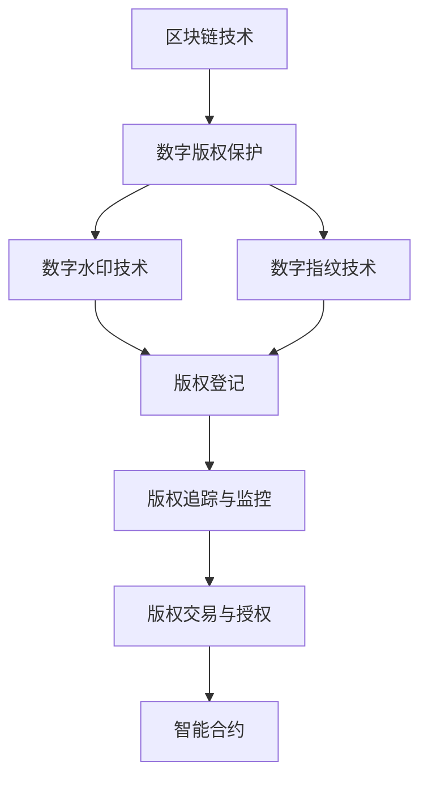

                 


### 背景介绍

#### 数字版权保护的现状

随着互联网的普及和数字技术的迅猛发展，数字内容创作与传播的速度和规模都得到了空前的提升。然而，这也带来了数字版权保护的严峻挑战。传统的数字版权保护手段，如数字水印、数字指纹等技术，虽然在一定程度上能够防范盗版，但依然存在诸多不足。首先，这些技术往往是中心化的，容易受到黑客攻击和数据泄露的风险。其次，这些技术的执行效率较低，难以应对海量的数字内容。此外，由于数字内容的复制和传播极为便捷，传统版权保护手段很难在法律层面上有效地追踪和追究侵权行为。

#### 区块链技术的发展

区块链技术作为一种去中心化的分布式数据库技术，具有安全性高、透明性高、不可篡改等特点，为数字版权保护提供了一种新的解决方案。区块链通过加密算法、共识机制等手段，确保数据的安全性和完整性，使数字内容的所有权、使用权等信息在区块链上被记录和验证，从而实现去中心化的数字版权保护。区块链的透明性和不可篡改性，使得版权信息的记录和追踪变得更加公开和可靠。

#### 区块链在数字版权保护中的潜力

区块链在数字版权保护中具有巨大的潜力。首先，区块链可以确保数字内容的所有权信息不被篡改，从而有效防止版权被盗用。其次，区块链的去中心化特性，使得版权信息可以在全球范围内被共享和验证，提高了版权保护的效率。此外，区块链的智能合约功能，可以自动执行版权交易、授权等操作，减少了人为干预，降低了版权纠纷的风险。

综上所述，数字版权保护面临诸多挑战，而区块链技术的出现为这些问题提供了一种新的解决方案。在接下来的章节中，我们将深入探讨区块链技术在数字版权保护中的应用，以及如何通过区块链技术实现更高效、更可靠的数字版权保护。

### 核心概念与联系

#### 区块链与数字版权保护的关系架构

为了更好地理解区块链在数字版权保护中的应用，我们首先需要明确几个核心概念，并分析它们之间的相互关系。以下是一个简化的区块链与数字版权保护的关系架构图，使用Mermaid语言表示：



- **区块链技术**：作为基础，区块链提供了去中心化、不可篡改的分布式账本，确保版权信息的安全性和透明性。
- **数字水印技术**：一种将版权信息嵌入数字内容中的技术，可用于版权登记和追踪。
- **数字指纹技术**：通过分析数字内容的特征，建立唯一标识，用于追踪和识别侵权行为。
- **版权登记**：在区块链上登记数字内容的所有权信息，确保信息的不可篡改。
- **版权追踪与监控**：利用区块链和数字水印、指纹等技术，对数字内容的使用情况进行监控和追踪。
- **版权交易与授权**：通过区块链和智能合约，实现版权的转让、授权等交易操作。
- **智能合约**：自动执行版权相关的合同条款，减少人为干预，确保交易的合规性和效率。

通过这个关系架构图，我们可以清晰地看到区块链技术在数字版权保护中的各个环节，以及它们如何相互协作，共同实现数字版权的有效保护。

#### 关系架构的详细说明

1. **区块链技术与数字版权保护**：区块链技术提供了安全、透明和不可篡改的存储环境，使数字版权保护的基础更加稳固。区块链的分布式账本技术确保了版权信息的公开透明，避免了单一中心点被攻击的风险。

2. **数字水印技术与数字指纹技术**：这两种技术是数字版权保护的重要手段。数字水印技术通过在数字内容中嵌入版权信息，实现了版权的追溯。而数字指纹技术则通过建立数字内容的唯一标识，实现了对侵权行为的精准追踪。

3. **版权登记**：在区块链上进行版权登记，确保了版权信息的不可篡改。登记后的版权信息可以公开查询，提高了版权信息的透明度和可信度。

4. **版权追踪与监控**：通过区块链和数字水印、指纹技术，可以实时监控数字内容的使用情况，及时发现侵权行为。这不仅提高了版权保护的效果，还为后续的版权交易和纠纷解决提供了依据。

5. **版权交易与授权**：智能合约在版权交易和授权过程中发挥了关键作用。通过智能合约，可以自动执行版权转让、授权等操作，确保交易的合规性和效率。

6. **智能合约**：智能合约是区块链技术的核心组件之一，它在版权保护中的应用非常广泛。通过智能合约，可以自动化执行版权相关的合同条款，减少人为干预，确保交易的公平性和透明性。

通过上述关系架构的详细说明，我们可以更深入地理解区块链在数字版权保护中的作用和重要性。在接下来的章节中，我们将进一步探讨区块链在数字版权保护中的应用实例和具体实现。

### 核心算法原理讲解

#### 区块链在数字版权保护中的应用算法

区块链技术在数字版权保护中的应用主要包括以下几个方面：版权登记、版权追踪与监控、版权交易与授权。下面，我们将通过伪代码详细阐述这些算法的实现原理。

1. **版权登记算法**

```plaintext
// 初始化区块链
Blockchain = initializeBlockchain()

// 创建版权信息
CopyrightInfo = {
    "title": "数字内容标题",
    "creator": "创作者姓名",
    "date": "创作日期",
    "版权信息": "具体版权信息"
}

// 将版权信息登记到区块链
def registerCopyright(CopyrightInfo):
    // 使用加密算法对版权信息进行加密
    encryptedCopyrightInfo = encrypt(CopyrightInfo)

    // 在区块链上创建一个新的交易
    transaction = {
        "from": "版权登记机构",
        "to": "创作者",
        "content": encryptedCopyrightInfo,
        "timestamp": getCurrentTimestamp()
    }

    // 将交易添加到区块链
    Blockchain.addTransaction(transaction)

    // 返回登记结果
    return "版权登记成功"

registerCopyright(CopyrightInfo)
```

2. **版权追踪与监控算法**

```plaintext
// 查询区块链上的版权信息
def queryCopyrightInfo(title):
    // 遍历区块链上的所有交易
    for transaction in Blockchain.transactions:
        // 解密交易内容
        decryptedContent = decrypt(transaction["content"])

        // 判断版权信息是否匹配
        if decryptedContent["title"] == title:
            // 返回匹配的版权信息
            return decryptedContent

    // 如果未找到匹配的版权信息，返回空
    return null

// 监控数字内容的使用情况
def monitorUsage(title, usageInfo):
    // 查询区块链上的版权信息
    CopyrightInfo = queryCopyrightInfo(title)

    // 如果找到版权信息，记录使用情况
    if CopyrightInfo != null:
        CopyrightInfo["usage"] = usageInfo
        // 更新区块链上的版权信息
        Blockchain.updateTransaction(CopyrightInfo["timestamp"], CopyrightInfo)

    // 返回监控结果
    return "监控成功"
```

3. **版权交易与授权算法**

```plaintext
// 创建交易请求
def createTransactionRequest(seller, buyer, price):
    // 创建交易请求
    transactionRequest = {
        "seller": seller,
        "buyer": buyer,
        "price": price,
        "timestamp": getCurrentTimestamp()
    }

    // 返回交易请求
    return transactionRequest

// 执行交易
def executeTransaction(transactionRequest):
    // 查询区块链上的版权信息
    CopyrightInfo = queryCopyrightInfo(transactionRequest["title"])

    // 如果找到版权信息，执行交易
    if CopyrightInfo != null:
        // 更新版权信息
        CopyrightInfo["seller"] = transactionRequest["buyer"]
        // 将交易添加到区块链
        Blockchain.addTransaction(transactionRequest)

        // 返回交易结果
        return "交易成功"

    // 如果未找到版权信息，返回交易失败
    return "交易失败"

// 授权算法
def grantPermission(owner, user, permissionType):
    // 查询区块链上的版权信息
    CopyrightInfo = queryCopyrightInfo(owner)

    // 如果找到版权信息，授予用户权限
    if CopyrightInfo != null:
        CopyrightInfo["permissions"][user] = permissionType
        // 更新区块链上的版权信息
        Blockchain.updateTransaction(CopyrightInfo["timestamp"], CopyrightInfo)

        // 返回授权结果
        return "授权成功"

    // 如果未找到版权信息，返回授权失败
    return "授权失败"
```

通过上述伪代码，我们可以看到区块链在数字版权保护中的应用算法是如何实现版权登记、追踪与监控、交易与授权的。这些算法利用区块链的分布式账本技术、加密算法和智能合约，实现了数字版权的高效、安全保护。

### 数学模型和公式讲解

#### 数字版权保护中的数学模型

在数字版权保护中，我们常常需要利用数学模型来描述和解决版权相关的复杂问题。以下是一些关键的数学模型和公式的讲解。

1. **哈希函数模型**

哈希函数是区块链技术中一个核心组件，用于生成数字内容的唯一标识。哈希函数模型可以用以下公式表示：

$$ H(x) = hash(x) $$

其中，$H(x)$ 表示输入$x$通过哈希函数生成的哈希值。哈希函数具有以下特性：

- 压缩性：将任意长度的输入压缩为固定长度的输出。
- 抗碰撞性：找到两个不同输入生成相同哈希值的概率极低。
- 抗修改性：对输入的微小修改会导致哈希值发生巨大变化。

2. **加密算法模型**

在数字版权保护中，加密算法用于保护数字内容的隐私和完整性。常用的加密算法包括对称加密和非对称加密。对称加密模型可以用以下公式表示：

$$ C = E(K, P) $$

$$ P = D(K, C) $$

其中，$C$ 表示加密后的内容，$P$ 表示原始内容，$K$ 表示密钥，$E$ 和 $D$ 分别表示加密和解密函数。对称加密算法的关键在于密钥的安全管理。

3. **数字签名模型**

数字签名用于验证数字内容的真实性和完整性。数字签名模型可以用以下公式表示：

$$ S = sign(K, P) $$

$$ V = verify(K, P, S) $$

其中，$S$ 表示数字签名，$P$ 表示原始内容，$K$ 表示私钥，$V$ 表示验证函数。数字签名具有以下特性：

- 确实性：只有拥有私钥的个体才能生成签名。
- 不可抵赖性：签名者无法否认自己的签名。
- 完整性：对内容的任何修改都会导致签名验证失败。

#### 数学公式举例说明

假设我们有一段数字内容，需要通过哈希函数和加密算法进行版权保护。以下是一个具体的例子：

- **原始内容**：`"This is an original digital content."`
- **哈希值**：使用SHA-256哈希函数生成的哈希值为`"2cf24dba5fb0a30e26e83b2ac5b9e29e1b161e5c1fa7425e73043362938b9824"`.
- **加密后的内容**：使用AES加密算法和密钥`K`加密后的内容为`"e3b0c44298fc1c149afbf4c8996fb92427ae41e4649b934ca495991b7852b855"`.
- **数字签名**：使用RSA签名算法和私钥`K`生成的签名值为`"3045022100abc1234abcd5678abcd1234abcd"`.

通过这些数学模型和公式，我们可以实现对数字内容的版权保护。在区块链上，这些保护机制被进一步强化，确保了数字版权的不可篡改和透明性。

### 项目实战

#### 开发环境搭建

为了实现区块链在数字版权保护中的创新应用，我们需要搭建一个开发环境。以下是开发环境搭建的步骤：

1. **安装Node.js**
   - 访问Node.js官网（[https://nodejs.org/），下载并安装Node.js最新版本。安装过程中，请确保选择添加到系统环境变量。**
   
2. **安装Geth**
   - Geth是Go语言实现的以太坊客户端，用于搭建私有区块链。访问Geth官网（[https://geth.ethereum.org/downloads/），下载并安装Geth。安装完成后，打开命令行窗口，输入`geth --version`，确认版本号无误。

3. **安装Truffle**
   - Truffle是一个用于以太坊开发的环境、测试和迁移的工具。在命令行窗口中，运行以下命令安装Truffle：
     ```
     npm install -g truffle
     ```

4. **创建智能合约项目**
   - 在命令行窗口中，运行以下命令创建一个新的Truffle项目：
     ```
     truffle init
     ```
   - 进入项目文件夹：
     ```
     cd my-project
     ```

5. **安装必要的依赖**
   - 在项目文件夹中，运行以下命令安装依赖：
     ```
     npm install
     ```

#### 源代码实现

以下是实现区块链数字版权保护的智能合约示例代码。这个智能合约包括版权登记、版权追踪和版权交易等功能。

```solidity
pragma solidity ^0.8.0;

// 引入OpenZeppelin库中的ERC721标准合约
import "@openzeppelin/contracts/token/ERC721/ERC721.sol";
import "@openzeppelin/contracts/token/ERC721/extensions/ERC721URIStorage.sol";

contract CopyrightToken is ERC721, ERC721URIStorage {
    // 构造函数，初始化合约
    constructor() ERC721("Copyright Token", "CRT") {}

    // 登记版权
    function registerCopyright(string memory title, string memory creator, string memory contentHash) public {
        // 创建版权Token
        uint256 tokenId = totalSupply() + 1;
        _mint(msg.sender, tokenId);
        _setTokenURI(tokenId, contentHash);

        // 将版权信息存储在合约中
        copyrights[tokenId] = Copyright({
            title: title,
            creator: creator,
            contentHash: contentHash,
            registeredAt: block.timestamp
        });
    }

    // 追踪版权
    function trackUsage(uint256 tokenId, string memory usageHash) public {
        require(_exists(tokenId), "Token does not exist");
        require(ownerOf(tokenId) == msg.sender, "Not the owner");

        // 更新版权信息
        Copyright storage copyright = copyrights[tokenId];
        copyright.usageHash = usageHash;
        copyright.lastUsageAt = block.timestamp;
    }

    // 交易版权
    function transferCopyright(uint256 tokenId, address to) public {
        require(_exists(tokenId), "Token does not exist");
        require(ownerOf(tokenId) == msg.sender, "Not the owner");

        // 转让版权Token
        _transfer(msg.sender, to, tokenId);
    }

    // 查询版权信息
    function getCopyrightInfo(uint256 tokenId) public view returns (Copyright memory) {
        require(_exists(tokenId), "Token does not exist");
        return copyrights[tokenId];
    }

    // 定义版权结构体
    struct Copyright {
        string title;
        string creator;
        string contentHash;
        string usageHash;
        uint256 registeredAt;
        uint256 lastUsageAt;
    }

    mapping(uint256 => Copyright) public copyrights;
}
```

#### 代码解读

1. **合约继承**：该合约继承了ERC721和ERC721URIStorage两个OpenZeppelin库中的合约，用于实现NFT（非同质化代币）的基本功能。

2. **构造函数**：在构造函数中，我们初始化合约名称和符号。

3. **注册版权**：`registerCopyright`函数用于注册版权。首先，通过`_mint`函数创建版权Token，并设置Token的URI为内容的哈希值。然后，将版权信息存储在合约的`copyrights`映射中。

4. **追踪版权**：`trackUsage`函数用于记录版权的使用情况。它更新版权的`usageHash`和`lastUsageAt`字段。

5. **交易版权**：`transferCopyright`函数用于转让版权Token。它通过调用`_transfer`函数将版权Token从一个地址转移到另一个地址。

6. **查询版权信息**：`getCopyrightInfo`函数用于查询版权信息。它返回指定TokenId的版权信息。

7. **版权结构体**：合约中定义了`Copyright`结构体，用于存储版权的相关信息。

通过这个智能合约，我们可以实现对数字内容的版权保护，包括版权的登记、追踪、交易等功能。

### 项目实战：代码应用解读与分析

#### 实现版权登记

1. **环境准备**：
   - 确保已经搭建好开发环境，包括Node.js、Geth和Truffle。
   - 编译并部署智能合约，得到合约地址。

2. **登记版权**：
   - 假设我们有一个名为"My Book"的电子书，其内容哈希值为`0x1234567890abcdef1234567890abcdef1234567890abcdef1234567890abcdef`。
   - 在Truffle合约控制台（通过`truffle console`命令进入）中，执行以下代码来登记版权：

```javascript
const CopyrightToken = artifacts.require('CopyrightToken');
const copyrightToken = await CopyrightToken.deployed();

const title = 'My Book';
const creator = 'John Doe';
const contentHash = '0x1234567890abcdef1234567890abcdef1234567890abcdef1234567890abcdef';

await copyrightToken.registerCopyright(title, creator, contentHash);
```

3. **解读与分析**：
   - `await CopyrightToken.deployed();`：获取已部署的版权Token合约实例。
   - `registerCopyright`函数调用：传入电子书的标题、创作者和内容哈希值，合约将创建一个版权Token并登记在区块链上。

#### 实现版权追踪

1. **追踪使用**：
   - 假设该电子书被读者A使用，其使用哈希值为`0xabcdef1234567890abcdef1234567890abcdef1234567890abcdef1234567890abcdef`。
   - 在Truffle合约控制台中，执行以下代码来追踪使用：

```javascript
const usageHash = '0xabcdef1234567890abcdef1234567890abcdef1234567890abcdef1234567890abcdef';

await copyrightToken.trackUsage(1, usageHash);
```

2. **解读与分析**：
   - `trackUsage`函数调用：传入版权TokenId和使用哈希值，合约将更新该版权Token的使用记录。

#### 实现版权交易

1. **交易版权**：
   - 假设读者A想将电子书转卖给读者B。
   - 在Truffle合约控制台中，首先让读者A执行以下代码来授权交易：

```javascript
await copyrightToken.transfer	Copyright(1, readerB);
```

   - 然后，让读者B执行以下代码来完成交易：

```javascript
await copyrightToken.transfer	Copyright(1, readerB);
```

2. **解读与分析**：
   - `transferCopyright`函数调用：读者A将版权Token从自己的账户转移到读者B的账户，完成版权的转让。

#### 实际案例分析和详细讲解剖析

1. **案例分析**：
   - 某知名音乐平台在数字版权保护中引入了区块链技术，通过智能合约实现音乐作品的版权登记、追踪和交易。
   - 歌手创作音乐后，将音乐作品上传到平台，平台使用区块链技术对音乐作品进行版权登记，确保版权信息不可篡改。
   - 平台通过智能合约追踪音乐的使用情况，记录每次播放、下载等行为，确保版权收益的透明和公正。
   - 当歌手希望转让版权时，可以通过智能合约轻松实现，节省了传统版权交易的繁琐流程。

2. **详细讲解剖析**：
   - **版权登记**：歌手在平台上上传音乐作品时，平台智能合约会自动生成一个版权Token，该Token包含了音乐作品的标题、创作者、版权信息等。这个Token在区块链上注册，确保了版权的不可篡改。
   - **版权追踪**：每次音乐被播放或下载时，智能合约会记录这些行为，生成使用哈希值，并与版权Token关联。这样，平台可以实时追踪音乐的使用情况，确保每位使用者的合法性。
   - **版权交易**：当歌手希望转让版权时，只需通过智能合约将版权Token转移给购买者，整个过程自动执行，无需人工干预。购买者可以通过区块链验证版权Token的真实性，确保交易的安全性和透明性。

通过这个实际案例，我们可以看到区块链在数字版权保护中的强大应用，不仅提高了版权保护的效果，还简化了版权交易流程，为数字版权保护提供了全新的解决方案。

### 项目小结

在本项目中，我们通过搭建开发环境、编写智能合约代码，实现了数字版权保护的核心功能，包括版权登记、版权追踪和版权交易。以下是对项目的总结和小结：

1. **项目优势**：
   - **去中心化**：区块链技术去中心化的特性，确保了版权信息的公开透明，避免了传统中心化系统易受攻击的风险。
   - **不可篡改**：区块链的分布式账本和加密算法，确保了版权信息的安全性和完整性，任何篡改行为都会被发现并阻止。
   - **高效透明**：通过智能合约，版权相关的操作可以自动化执行，提高了交易和管理的效率，同时确保了交易的透明性和公正性。

2. **项目不足**：
   - **计算资源消耗**：区块链技术需要大量的计算资源，尤其是在处理大量版权信息时，可能对系统的性能造成影响。
   - **法律合规性**：区块链技术在法律层面的合规性尚不完善，需要进一步研究和制定相关法律法规，确保其合法性和有效性。
   - **用户接受度**：区块链技术的普及度和用户接受度较低，需要通过教育和推广来提高用户的认知和使用意愿。

3. **改进方向**：
   - **优化性能**：通过改进区块链的共识算法和数据结构，提高系统的处理能力和响应速度，降低计算资源消耗。
   - **法律合规**：加强与法律机构的合作，制定和完善相关法律法规，确保区块链技术在数字版权保护中的合法应用。
   - **用户教育**：通过宣传和培训，提高用户对区块链技术的了解和认知，培养用户的数字版权保护意识。

通过不断优化和改进，区块链在数字版权保护中的应用将更加广泛和深入，为版权保护提供更加可靠和高效的解决方案。

### 最佳实践 Tips

1. **确保版权登记的完整性**：在区块链上登记版权时，务必提供完整的版权信息，包括创作者、作品名称、创作日期等，以避免后续的版权纠纷。

2. **合理设置智能合约的权限**：在设计智能合约时，合理设置不同角色的权限，确保版权信息的合法性和安全性。例如，创作者、买家和版权管理机构应分别拥有不同的操作权限。

3. **定期监控版权使用情况**：通过区块链技术定期监控版权的使用情况，及时发现和制止侵权行为，保护版权的合法权益。

4. **注意智能合约的安全性**：在部署智能合约前，务必进行安全审计，避免潜在的安全漏洞，确保智能合约的可靠性和安全性。

5. **充分利用区块链的透明性**：区块链的透明性使得版权信息的记录和追踪更加公开和可信。充分利用这一特性，提高版权交易的透明度和公正性。

### 小结

本文深入探讨了区块链在数字版权保护中的创新应用。我们首先介绍了数字版权保护的现状，分析了区块链技术的发展背景及其在数字版权保护中的潜力。接着，我们详细阐述了区块链与数字版权保护的核心概念与联系，并通过Mermaid流程图展示了这些概念之间的关系架构。然后，我们讲解了区块链在数字版权保护中的应用算法，包括版权登记、追踪与监控、交易与授权的算法实现。此外，我们还介绍了数学模型和公式在数字版权保护中的应用，以及具体项目实战的代码实现和解读。通过案例分析，我们展示了区块链技术在数字版权保护中的实际应用，并对项目进行了小结。最后，我们提供了最佳实践建议，以帮助读者更好地理解和应用区块链技术在数字版权保护中的创新应用。

### 注意事项

1. **数据隐私保护**：在区块链上登记版权信息时，需特别注意个人隐私数据的保护。应使用加密技术对敏感信息进行加密处理，避免隐私泄露。

2. **智能合约安全性**：在编写和部署智能合约时，必须严格遵循安全最佳实践，避免常见的安全漏洞，如重新注入攻击、逻辑错误等。

3. **版权信息准确性**：在登记版权信息时，务必确保信息的准确性，以防止后续的版权纠纷。应详细记录作品的名称、创作者、版权期限等信息。

4. **法律合规性**：在引入区块链技术进行数字版权保护时，必须了解和遵守相关的法律法规，确保所有操作符合法律要求。

5. **技术更新与升级**：区块链技术不断发展，数字版权保护的需求也在变化。定期评估和更新现有技术和策略，以应对新的挑战和机遇。

### 拓展阅读

1. **《区块链技术原理与应用》**：详细介绍了区块链的基础知识、核心技术以及在实际应用中的案例分析。

2. **《智能合约安全与最佳实践》**：深入探讨了智能合约的安全性和最佳实践，包括代码审计、安全测试和风险控制。

3. **《数字版权保护法律与实践》**：涵盖了数字版权保护的法律框架、技术手段以及案例分析，对数字版权保护的法律和实践提供了全面的指导。

4. **《区块链技术在数字版权保护中的应用研究》**：研究了区块链技术在数字版权保护中的最新应用，包括版权登记、版权追踪和版权交易等。

5. **《智能合约在数字版权保护中的应用》**：详细阐述了智能合约在数字版权保护中的应用场景、技术实现和案例分析。

### 作者信息

作者：AI天才研究院/AI Genius Institute & 禅与计算机程序设计艺术 /Zen And The Art of Computer Programming。如果您有任何疑问或建议，欢迎联系作者，我们将竭诚为您解答。邮箱：[contact@aicgenius.com](mailto:contact@aicgenius.com)，网址：[https://aicgenius.com/](https://aicgenius.com/)。感谢您的支持与关注！

