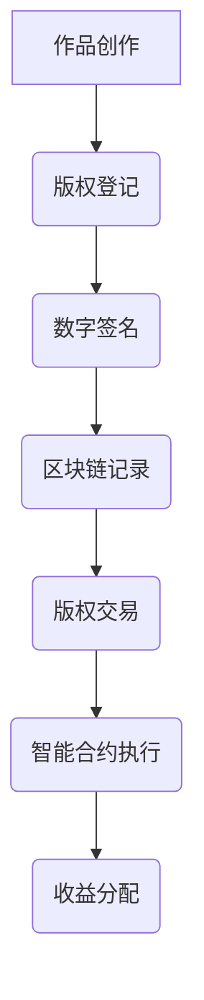
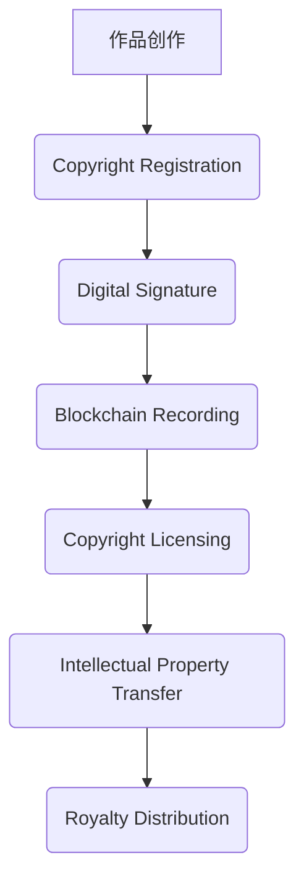

                 


### 1.1 区块链与数字版权保护概述

**背景介绍**

在互联网和数字技术飞速发展的今天，版权保护成为了一个至关重要的议题。随着数字内容的爆炸性增长，版权所有者面临着前所未有的挑战：如何确保其作品的原创性和唯一性，如何有效地追踪和监控内容的传播，以及如何在互联网时代实现公平合理的收益分配。传统的数字版权管理（DRM）技术，如加密、数字签名和水印技术，在一定程度上缓解了这些问题，但它们也存在局限性。比如，加密技术虽然可以保护内容的完整性，但可能会影响用户体验；数字签名技术虽然可以验证作者身份，但无法防止内容被非法复制和分发。

**核心概念与联系**

为了更好地解决这些问题，区块链技术应运而生。区块链是一种去中心化的分布式账本技术，其特点包括透明性、不可篡改性和安全性。这些特点使得区块链在数字版权保护中具有巨大的潜力。具体来说，区块链可以用于记录和验证版权信息，确保内容的所有权和交易历史不可篡改。同时，区块链的智能合约功能可以自动执行版权许可和转让协议，简化版权交易流程。

下面是一个简单的 Mermaid 流程图，展示了区块链在数字版权保护中的工作原理：



**核心算法原理讲解**

在区块链的版权保护中，核心算法包括加密、哈希和智能合约。

- **加密**：加密是一种将明文转换为密文的过程，目的是保护数据的隐私性。在版权保护中，加密可以用于保护版权登记信息，确保未经授权的用户无法读取。

- **哈希**：哈希是一种将任意长度的数据转换为固定长度的字符串的函数。在版权保护中，哈希可以用于验证数据的完整性。版权登记信息在区块链上存储时，会通过哈希算法生成哈希值，并与原始数据一起存储。当数据需要验证时，可以重新计算哈希值，并与存储的哈希值进行比较，以确认数据是否被篡改。

- **智能合约**：智能合约是一种自动执行的合同，其条件在代码中预先定义。在版权保护中，智能合约可以用于自动执行版权许可和转让协议。例如，当一个用户购买了一个数字版权时，智能合约可以自动记录交易信息，并按照协议将收益分配给版权所有者。

以下是智能合约的一个简单伪代码示例：

```python
# SPDX-License-Identifier: MIT
pragma solidity ^0.8.0;

contract CopyrightProtection {
    address owner;
    mapping(uint256 => bool) public isCopyrighted;

    constructor() {
        owner = msg.sender;
    }

    function registerCopyright(uint256 contentId) external {
        require(msg.sender == owner, "Only owner can register");
        isCopyrighted[contentId] = true;
    }

    function transferCopyright(uint256 contentId, address newOwner) external {
        require(isCopyrighted[contentId], "Content is not copyrighted");
        isCopyrighted[contentId] = false;
        owner = newOwner;
        isCopyrighted[contentId] = true;
    }

    function purchaseCopyright(uint256 contentId) external payable {
        require(isCopyrighted[contentId], "Content is not copyrighted");
        address payable owner = payable(this.owner);
        uint256 price = msg.value;
        owner.transfer(price);
        isCopyrighted[contentId] = false;
        owner = msg.sender;
        isCopyrighted[contentId] = true;
    }
}
```

**数学模型和公式**

区块链在版权保护中的应用可以通过数学模型来描述。一个简单的数学模型可以是：

\[ C = C_0 + \sum_{i=1}^n r_i \]

其中，\( C \) 表示版权的价值，\( C_0 \) 表示版权的基础价值，\( r_i \) 表示第 \( i \) 个交易的额外价值。

**举例说明**

假设一个艺术家创作了一幅画作，并将其版权登记在区块链上。随后，这幅画作被多个用户购买和分享。每进行一次交易，版权的价值都会增加。具体来说，如果这幅画作的初始价值为 \( C_0 \)，每次交易的价值增加 \( r_i \)，那么在进行了 \( n \) 次交易后，这幅画作的总价值为：

\[ C = C_0 + r_1 + r_2 + \ldots + r_n \]

**总结**

通过上述分析，我们可以看到，区块链在数字版权保护中具有巨大的潜力。它不仅可以确保版权信息的透明性和不可篡改性，还可以简化版权交易流程，实现更高效的收益分配。然而，要充分发挥区块链在版权保护中的作用，仍需要解决一系列技术、法律和运营上的挑战。在接下来的部分，我们将进一步探讨这些挑战，并分析区块链在不同版权保护场景中的应用案例。

### 1.2 区块链技术在版权保护中的重要性

**背景介绍**

随着数字技术的不断进步，版权保护已经成为版权所有者、内容创作者和消费者共同关注的焦点。数字版权管理（DRM）技术的发展为版权保护提供了一定的保障，但传统DRM技术存在一些显著的局限性。例如，DRM通常依赖于中心化的服务器，这意味着如果服务器遭到攻击或故障，版权信息可能会丢失或被篡改。此外，传统DRM技术往往涉及复杂的加密和解密过程，这不仅增加了技术实现的难度，还可能影响用户体验。

**核心概念与联系**

区块链技术作为一种去中心化的分布式账本技术，提供了一种全新的版权保护解决方案。区块链的去中心化特性意味着版权信息不再依赖于单一中心化的服务器，而是分散存储在多个节点上，这使得版权信息更加安全和不可篡改。同时，区块链的智能合约功能可以自动化执行版权许可和转让协议，从而简化版权交易流程，提高交易效率。

为了更好地理解区块链在版权保护中的重要性，我们可以通过一个Mermaid流程图来展示其工作原理：



**核心算法原理讲解**

在区块链的版权保护中，核心算法包括哈希算法和加密算法。

- **哈希算法**：哈希算法是一种将任意长度的数据转换为固定长度的字符串的算法。在版权保护中，哈希算法可以用于生成版权信息的哈希值，并将其存储在区块链上。由于哈希函数的性质，任何对版权信息的篡改都会导致哈希值的改变，从而可以及时发现和处理篡改行为。

- **加密算法**：加密算法是一种将明文转换为密文的过程，用于保护版权信息的隐私性。在区块链版权保护中，加密算法可以用于对版权登记信息进行加密，确保只有拥有解密密钥的用户才能读取和理解这些信息。

**数学模型和公式**

区块链在版权保护中的应用可以通过数学模型来描述。一个简单的数学模型可以是：

\[ T = \sum_{i=1}^n L_i \]

其中，\( T \) 表示版权的总价值，\( L_i \) 表示第 \( i \) 个交易的许可价值。

**举例说明**

假设一个音乐创作者在区块链上登记了一首歌曲的版权。随后，这首歌曲被多个平台许可播放，每次许可都会生成相应的许可价值 \( L_i \)。那么，这首歌曲的总价值可以通过以下公式计算：

\[ T = L_1 + L_2 + \ldots + L_n \]

**总结**

通过上述分析，我们可以看到，区块链技术在版权保护中具有显著的重要性。它不仅提供了去中心化、安全、透明的版权信息记录方式，还通过智能合约实现了自动化的版权交易和管理。然而，要充分发挥区块链在版权保护中的作用，仍需要解决一系列技术、法律和运营上的挑战。在接下来的部分，我们将继续探讨这些挑战，并分析区块链在不同版权保护场景中的应用案例。

### 1.3 书籍结构概述

本书旨在全面探讨区块链在数字版权保护中的应用，帮助读者深入理解这一前沿技术的原理和实践。本书共分为六个部分，每部分都有其独特的目标和内容。

**第一部分：引言**

本部分首先介绍了区块链与数字版权保护的基本概念和背景，探讨了区块链在数字版权保护中的重要性。通过简单的Mermaid流程图和数学模型，帮助读者初步了解区块链技术在版权保护中的应用原理。

**第二部分：区块链基础**

本部分详细介绍了区块链的基本概念、架构和分类，重点讲解了智能合约和非同质化代币（NFT）在数字版权保护中的应用。通过伪代码示例，读者可以了解智能合约的开发和实现过程。

**第三部分：数字版权保护技术**

本部分介绍了数字版权管理（DRM）、数字水印和数字指纹等核心技术，并探讨了这些技术在区块链环境下的应用和优势。通过具体的数学模型和公式，读者可以更深入地理解这些技术的原理。

**第四部分：区块链在数字版权保护中的应用案例**

本部分通过具体的区块链应用案例，如区块链版权交易平台、NFT与艺术品版权保护以及音频版权保护，展示了区块链技术在数字版权保护中的实际应用和效果。通过案例分析，读者可以了解区块链技术在解决实际版权问题中的具体应用场景。

**第五部分：未来趋势与挑战**

本部分分析了区块链在版权保护中的未来趋势和面临的挑战，包括技术、法律和市场等方面的挑战。通过探讨这些挑战，本书旨在为读者提供对区块链技术在版权保护领域的未来发展方向的思考。

**第六部分：结论**

本部分总结了本书的主要内容和贡献，指出了当前存在的不足和未来的研究方向。通过总结，读者可以全面了解区块链在数字版权保护中的现状和未来发展趋势，为相关研究和实践提供参考。

通过本书的结构，读者可以系统地了解区块链在数字版权保护中的各个方面，从基础知识到应用实践，再到未来趋势，全面掌握这一前沿技术的核心内容和应用前景。

### 2.1 区块链概述

**背景介绍**

区块链技术起源于2008年，由一位名为中本聪（Satoshi Nakamoto）的匿名人物首次提出。区块链最初是为了解决比特币的发行和交易问题而设计的。比特币是一种基于区块链技术的加密货币，通过区块链去中心化的特点，实现了无需信任的电子交易。区块链技术的核心概念是分布式账本，通过多个节点共同维护和验证数据，确保数据的真实性和不可篡改性。

**核心概念与联系**

- **分布式账本**：分布式账本是区块链技术的核心概念。它指的是一种由多个节点共同维护的数据结构，每个节点都存储了一份完整的数据副本。分布式账本的特点是去中心化，即没有一个中央机构控制数据，而是通过共识算法来决定数据的合法性和有效性。

- **共识算法**：共识算法是区块链技术中用于达成数据一致性的算法。常见的共识算法包括工作量证明（PoW）、权益证明（PoS）和委托权益证明（DPoS）等。共识算法确保了区块链网络的稳定性和安全性，使得多个节点能够在分布式环境中达成一致。

- **加密技术**：加密技术是区块链技术的另一个核心组成部分。区块链使用加密算法对数据进行加密，确保数据的隐私性和安全性。常见的加密算法包括对称加密、非对称加密和哈希算法等。

**区块链的基本架构**

区块链的基本架构通常包括以下三个主要部分：

1. **区块链网络**：区块链网络由多个节点组成，每个节点都负责存储和维护区块链数据。节点之间通过通信协议进行数据同步和验证，确保区块链的一致性和完整性。

2. **区块**：区块是区块链的基本单元，每个区块包含一定数量的交易记录。区块通过加密和链接方式与其他区块相连，形成区块链。每个区块都有一个独特的哈希值，用于标识和验证区块的内容。

3. **交易**：交易是区块链中的数据操作，例如版权登记、交易记录和智能合约执行等。交易记录在区块链上经过验证和确认后，会被永久存储在区块链上，确保数据的真实性和不可篡改性。

**区块链的分类**

区块链根据其应用场景和特点可以分为以下几种类型：

1. **公有链**：公有链是任何人都可以参与和维护的区块链，如比特币和以太坊。公有链的特点是去中心化程度高，但交易处理能力相对较低。

2. **私有链**：私有链是仅限于特定组织或机构使用的区块链，如企业内部使用的区块链。私有链的特点是交易处理能力较强，但去中心化程度较低。

3. **联盟链**：联盟链是由多个机构或组织共同维护的区块链，如跨企业供应链金融区块链。联盟链的特点是去中心化程度适中，同时具有较高的交易处理能力和安全性。

**总结**

通过上述分析，我们可以看到，区块链技术作为一种分布式账本技术，具有去中心化、安全性和透明性等特点。这些特点使得区块链在数字版权保护中具有巨大的潜力。在接下来的部分，我们将进一步探讨智能合约和非同质化代币（NFT）在区块链中的应用，以及这些技术如何为数字版权保护提供更加高效和安全的解决方案。

### 2.2 智能合约

**背景介绍**

智能合约是区块链技术的一个重要组成部分，最早由中本聪在比特币白皮书中提出。智能合约是一种自动执行合同，其条款以代码形式预先编写并部署在区块链上。与传统合同相比，智能合约不需要中介机构，即可在满足特定条件时自动执行，从而提高交易效率和降低成本。

**核心概念与联系**

- **智能合约**：智能合约是一种运行在区块链上的程序，它包含了一定的逻辑和规则，用于自动执行合同条款。智能合约的关键特点是其执行过程是透明和不可篡改的，这确保了合同的公正性和可信度。

- **区块链**：区块链是智能合约的运行环境，它提供了一个去中心化的分布式账本，确保智能合约的执行和状态记录是公开和不可篡改的。区块链网络中的多个节点共同维护智能合约的状态，并确保其执行的一致性。

**智能合约的定义与原理**

智能合约的定义可以从以下几个方面来理解：

1. **合同条款代码化**：智能合约将合同的条款以代码形式实现，这些代码定义了合同的条件、执行逻辑和结果。例如，一个版权交易合同可以通过智能合约实现，其中定义了版权的登记、转让和许可等条款。

2. **自动化执行**：智能合约在满足特定条件时，可以自动执行预定义的逻辑。例如，当一个用户购买了一项数字版权时，智能合约可以自动执行版权转让过程，并记录交易信息在区块链上。

3. **透明性与不可篡改性**：智能合约的执行过程是公开透明的，所有参与方都可以查看和验证合约的执行情况。同时，由于区块链的分布式账本特性，智能合约的执行记录是不可篡改的，确保了合约的公正性和可信度。

智能合约的原理可以简单概括为以下四个步骤：

1. **编写合约代码**：开发者使用特定的编程语言（如Solidity）编写智能合约的代码，这些代码定义了合约的逻辑和功能。

2. **部署合约**：将编写的智能合约代码部署到区块链上，使得合约在区块链网络中运行。部署过程通常需要支付一定的网络费用。

3. **合约调用**：用户通过区块链网络调用智能合约，触发合约的执行。调用合约需要提供输入参数，并支付一定的交易费用。

4. **合约执行与状态记录**：智能合约在满足条件的情况下，自动执行预定义的逻辑，并将执行结果记录在区块链上。执行过程和结果对所有网络参与者公开透明。

**智能合约的开发与实现**

智能合约的开发与实现通常包括以下步骤：

1. **选择编程语言**：智能合约的开发通常使用特定的编程语言，如Solidity、Vyper和Scilla等。这些语言具有区块链特定的语法和特性，能够高效地编写和部署智能合约。

2. **编写合约代码**：开发者根据业务需求，使用选定的编程语言编写智能合约代码。代码中需要定义合约的变量、函数和事件等。

3. **测试合约代码**：在部署智能合约之前，开发者需要对合约代码进行充分的测试，确保合约的逻辑正确和功能完备。测试可以使用模拟环境和自动化测试工具进行。

4. **部署合约**：将测试通过的智能合约代码部署到区块链上，使其在区块链网络中运行。部署过程中，开发者需要选择合适的区块链平台，并支付一定的网络费用。

5. **合约维护与升级**：智能合约一旦部署，通常不能直接修改。如果需要更新合约逻辑，开发者可以通过部署新的合约版本来实现。新的合约版本需要经过充分的测试和验证，以确保升级过程的安全和稳定。

**智能合约在版权保护中的应用**

智能合约在版权保护中具有广泛的应用，具体包括以下几个方面：

1. **版权登记**：智能合约可以用于自动执行版权登记过程，确保版权信息的真实性和不可篡改性。版权所有者可以通过智能合约将版权信息记录在区块链上，并获得唯一的版权标识。

2. **版权转让**：智能合约可以自动执行版权转让协议，简化版权交易流程。当用户购买版权时，智能合约可以自动更新版权所有者信息，并记录交易信息在区块链上。

3. **版权许可**：智能合约可以用于管理版权许可，确保许可条款的执行和监控。版权所有者可以通过智能合约授权用户使用其作品，并在满足特定条件时自动发放许可。

4. **收益分配**：智能合约可以用于自动分配版权收益，确保版权所有者和其他参与方获得公平合理的收益。例如，当一个数字版权被多次转售时，智能合约可以自动计算并分配版权收益。

**总结**

通过上述分析，我们可以看到，智能合约在版权保护中具有重要的作用。它不仅提高了版权交易和管理效率，还通过去中心化和不可篡改的特性，确保了版权信息的真实性和公正性。在接下来的部分，我们将继续探讨非同质化代币（NFT）在数字版权保护中的应用，以及如何利用区块链技术实现更加高效和安全的版权保护解决方案。

### 2.3 非同质化代币（NFT）

**背景介绍**

非同质化代币（Non-Fungible Token，简称NFT）是区块链技术的一种创新应用，最早在2017年以太坊区块链上实现。NFT与传统的同质化代币（如比特币、以太币等）不同，其独特性体现在每个NFT都是独一无二的，无法与其他NFT互换。NFT不仅代表数字资产的唯一性，还可以承载各种形式的数字内容，如艺术品、音乐、视频和虚拟商品等。

**核心概念与联系**

- **非同质化代币（NFT）**：NFT是一种基于区块链技术的数字资产，每个NFT都有独特的标识符和不可替代的价值。NFT的不可替代性使其成为数字版权保护的有力工具，可以确保数字内容的唯一性和原创性。

- **区块链**：区块链是NFT的底层技术，它提供了一个去中心化的分布式账本，确保NFT的所有权和交易记录是公开透明和不可篡改的。区块链网络中的多个节点共同维护NFT的状态，确保其安全性。

**NFT的定义与特点**

NFT的核心特点包括：

1. **唯一性**：每个NFT都是独一无二的，其唯一性体现在数字内容的标识符上。这意味着NFT可以代表数字资产的唯一性和原创性，例如一幅独特的数字画作或一段独特的音乐。

2. **不可替代性**：NFT与传统的同质化代币不同，其价值不是通过总量来衡量的，而是基于其独特性和稀缺性。这意味着每个NFT都有独特的价值，无法与其他NFT互换。

3. **数字内容承载**：NFT不仅可以代表数字资产的所有权，还可以承载各种形式的数字内容。例如，NFT可以包含数字艺术作品的图像、音频或视频文件，甚至可以链接到外部网站或应用程序。

**NFT在版权保护中的应用**

NFT在数字版权保护中的应用主要体现在以下几个方面：

1. **版权登记**：NFT可以用于登记数字版权信息，确保版权信息的唯一性和不可篡改性。版权所有者可以将版权信息存储在NFT上，例如数字作品的所有权、创作日期和创作者信息等。

2. **版权验证**：NFT可以用于验证数字内容的所有权和原创性。通过查看NFT的持有者信息，可以确认数字内容的合法来源和版权所有者。

3. **版权交易**：NFT可以简化数字版权交易流程。版权所有者可以通过NFT将版权出售或转让给其他用户，NFT的持有者将获得对应数字内容的版权。

4. **版权许可**：NFT可以用于管理版权许可，确保许可条款的执行和监控。版权所有者可以通过NFT授权用户使用其作品，并在满足特定条件时自动发放许可。

**NFT在版权保护中的优势**

NFT在版权保护中具有以下优势：

1. **透明性和不可篡改性**：NFT的持有和交易记录存储在区块链上，所有参与方都可以查看和验证，确保了透明性和不可篡改性。

2. **去中心化**：NFT的持有和交易不依赖于中心化的机构，而是通过去中心化的区块链网络进行，提高了版权交易的效率。

3. **唯一性和稀缺性**：NFT的不可替代性使其成为数字版权保护的有力工具，可以确保数字内容的唯一性和原创性。

4. **自动化执行**：通过智能合约，NFT可以自动执行版权许可和转让协议，简化了版权交易和管理流程。

**案例分析：NFT在艺术品市场的应用**

以NFT在艺术品市场的应用为例，NFT为艺术品市场带来了全新的商业模式和机会。例如，数字艺术家Beeple（Mike Winkelmann）在2021年3月将一幅名为《每一天：前5000天》的数字画作以6930万美元的价格出售给Vignesh Sundaresan（又称Metakovan）。这幅画作以NFT的形式在市场上交易，NFT记录了画作的所有权、创作日期和创作者信息等。这一案例展示了NFT在数字版权保护中的巨大潜力，不仅为艺术家提供了新的收益渠道，也为收藏家提供了更安全的投资方式。

**总结**

通过上述分析，我们可以看到，NFT在数字版权保护中具有独特的优势和潜力。它不仅提供了透明、安全和去中心化的版权信息记录和交易方式，还通过智能合约实现了自动化的版权管理。在接下来的部分，我们将进一步探讨数字版权管理（DRM）、数字水印和数字指纹等技术在区块链环境下的应用，以及这些技术如何共同构建一个更加高效和安全的数字版权保护体系。

### 3.1 数字版权管理（DRM）

**背景介绍**

数字版权管理（Digital Rights Management，简称DRM）是一种旨在限制或控制数字内容使用的技术。随着互联网和数字技术的迅猛发展，数字内容的传播速度和范围大大增加，版权保护问题日益突出。传统的版权保护方法，如物理复制保护和数字水印技术，虽然在一定程度上缓解了这些问题，但仍然存在一些局限性。例如，物理复制保护依赖于实体介质，而数字水印技术则可能影响内容的视觉效果或音质。因此，数字版权管理技术的出现为数字版权保护提供了一种更为灵活和有效的解决方案。

**核心概念与联系**

- **数字版权管理（DRM）**：数字版权管理是一种通过技术手段保护数字内容版权的技术，其主要目标是在确保内容所有者获得合理收益的同时，防止未经授权的复制、传播和使用。DRM技术通常包括加密、认证、访问控制和权限管理等功能。

- **加密**：加密是DRM技术的一个重要组成部分，通过加密算法将数字内容转换为密文，只有拥有解密密钥的用户才能访问和解析内容。常见的加密算法包括对称加密（如AES）和非对称加密（如RSA）。

- **认证**：认证用于确认用户的身份和权限，确保只有授权用户才能访问受保护的数字内容。常见的认证方法包括数字签名、用户名和密码、指纹识别等。

- **访问控制**：访问控制用于限制用户对数字内容的访问权限，确保用户只能在授权的范围内使用内容。访问控制可以通过权限设置、角色分配和策略管理来实现。

**数字版权管理的关键技术**

数字版权管理的关键技术包括以下几种：

1. **加密技术**：加密技术是DRM的核心技术之一，通过加密算法保护数字内容的隐私性。对称加密和非对称加密是常见的加密技术，它们分别适用于不同的应用场景。

2. **数字水印技术**：数字水印技术通过在数字内容中嵌入不可见的水印信息，以实现版权保护和追踪。数字水印可以分为可视水印和不可视水印，分别适用于不同的版权保护需求。

3. **访问控制技术**：访问控制技术用于限制用户对数字内容的访问权限，确保内容在授权的范围内使用。访问控制技术可以通过权限设置、用户认证和权限验证等方式实现。

4. **智能合约技术**：智能合约是区块链技术的一种应用，通过智能合约可以自动化执行版权许可和转让协议，简化版权交易流程。智能合约在数字版权管理中具有重要的应用价值。

**数字版权管理的挑战与解决方案**

数字版权管理在实际应用中面临一系列挑战，包括技术挑战、法律挑战和市场挑战。

1. **技术挑战**：数字版权管理需要解决技术实现上的难题，如加密算法的选择、密钥管理、水印嵌入和提取等。为了应对这些挑战，研究人员和开发者需要不断改进和优化现有技术，同时探索新的技术解决方案。

2. **法律挑战**：数字版权管理涉及到法律和法规的问题，如版权法的适用性、跨国版权保护等。为了应对这些挑战，需要制定和执行相应的法律法规，确保数字版权管理的合法性和有效性。

3. **市场挑战**：数字版权管理需要适应市场的需求，如用户隐私保护、内容分发效率等。为了应对这些挑战，需要构建一个公平、透明和高效的市场环境，推动数字版权管理技术的发展和应用。

**解决方案**

针对数字版权管理面临的挑战，以下是一些可能的解决方案：

1. **技术创新**：通过技术创新，提高数字版权管理的效率和安全性。例如，发展更强大的加密算法、优化数字水印技术、提高智能合约的性能等。

2. **法律保障**：加强法律法规的建设，为数字版权管理提供法律支持和保障。例如，制定和执行国际版权协议、明确数字版权的保护范围和责任等。

3. **市场推动**：通过市场推动，促进数字版权管理技术的发展和应用。例如，建立数字版权交易平台、推动版权交易和分发等。

**总结**

通过上述分析，我们可以看到，数字版权管理在数字版权保护中具有重要的作用。它通过加密、数字水印和访问控制等关键技术，实现了数字内容的版权保护和管理。然而，数字版权管理也面临一系列技术、法律和市场挑战，需要通过技术创新、法律保障和市场推动等手段来应对。在接下来的部分，我们将进一步探讨这些技术如何在区块链环境下实现更加高效和安全的数字版权保护。

### 3.2 数字水印

**背景介绍**

数字水印是一种用于版权保护和内容认证的数字信号处理技术，其基本原理是在数字内容中嵌入不可见的水印信息。这些水印信息可以用于追踪和验证内容的来源和所有权，从而保护版权和确保内容的真实性。数字水印技术广泛应用于图像、音频、视频和文档等领域，为数字版权保护提供了一种有效的手段。

**核心概念与联系**

- **数字水印**：数字水印是一种在数字内容中嵌入不可见信息的信号处理技术，用于版权保护和内容认证。数字水印可以嵌入在图像、音频、视频和文档等数字内容中，其嵌入和提取过程是通过特定的算法实现的。

- **版权保护**：数字水印技术通过在数字内容中嵌入水印信息，可以实现对内容的版权保护。水印信息通常包含版权所有者信息、版权有效期和数字签名等，确保内容的来源和所有权得到明确标识。

- **内容认证**：数字水印技术还可以用于内容认证，通过检测水印信息可以验证内容的真实性和完整性。例如，在数字版权纠纷中，通过检测水印信息可以确定内容的来源和传播路径，帮助解决版权纠纷。

**数字水印的技术原理**

数字水印的技术原理主要包括以下步骤：

1. **水印生成**：水印生成是将水印信息嵌入到数字内容中的过程。水印信息通常由版权所有者生成，可以是文字、图像、音频或视频片段等。水印生成过程使用特定的算法，将水印信息与数字内容进行融合，生成水印信号。

2. **水印嵌入**：水印嵌入是将生成的水印信号嵌入到数字内容中的过程。水印嵌入过程需要考虑水印的透明度和鲁棒性，以确保水印信息在内容传播和复制过程中不被破坏。常见的水印嵌入算法包括空间域算法和频域算法。

3. **水印提取**：水印提取是从数字内容中提取水印信息的过程。水印提取过程需要使用与水印嵌入相同的算法，从数字内容中检测和提取水印信号。提取的水印信号与原始水印信息进行比对，以验证内容的真实性和完整性。

**数字水印的技术原理与数学模型**

数字水印的技术原理可以通过以下数学模型进行描述：

\[ W(x,y) = I(x,y) + \alpha \cdot S(x,y) \]

其中，\( W(x,y) \) 表示加水印的数字内容，\( I(x,y) \) 表示原始数字内容，\( \alpha \) 表示水印强度，\( S(x,y) \) 表示水印信号。

- **水印强度（\(\alpha\)）**：水印强度决定了水印在数字内容中的可见性和鲁棒性。较高的水印强度可以增强水印的鲁棒性，但可能会影响内容的视觉效果或音质。反之，较低的水印强度可以减少对内容的影响，但可能会降低水印的鲁棒性。

- **水印信号（\(S(x,y)\)）**：水印信号是嵌入到数字内容中的水印信息。水印信号通常是一个二值序列，其中每个元素表示水印信息的一个比特。

- **原始数字内容（\(I(x,y)\)）**：原始数字内容是未加水印的数字信号，可以是图像、音频或视频等。

**举例说明**

以图像水印为例，假设我们有一个原始图像 \( I(x,y) \)，我们希望嵌入一个水印信号 \( S(x,y) \)。首先，我们选择一个合适的水印嵌入算法（例如频域算法），然后计算图像的频域表示。接着，我们根据水印强度 \(\alpha\)，将水印信号嵌入到图像的频域中。最后，我们将处理后的频域信号反变换回图像域，得到加水印的图像 \( W(x,y) \)。

以下是水印嵌入和提取的伪代码示例：

```python
# 水印嵌入
def embed_watermark(image, watermark, alpha):
    # 计算图像的频域表示
    freq_image = fft2(image)
    # 计算水印信号的频域表示
    freq_watermark = fft2(watermark)
    # 嵌入水印信号到图像的频域中
    freq_image_with_watermark = freq_image * (1 + alpha * freq_watermark / max(freq_image))
    # 反变换回图像域
    watermarked_image = ifft2(freq_image_with_watermark)
    return watermarked_image

# 水印提取
def extract_watermark(watermarked_image, watermark, alpha):
    # 计算图像的频域表示
    freq_watermarked_image = fft2(watermarked_image)
    # 计算水印信号的频域表示
    freq_watermark = fft2(watermark)
    # 从图像的频域中提取水印信号
    freq_extracted_watermark = freq_watermarked_image / (1 + alpha * freq_watermark / max(freq_watermarked_image))
    # 反变换回图像域
    extracted_watermark = ifft2(freq_extracted_watermark)
    return extracted_watermark
```

**数字水印的应用场景**

数字水印技术在多个应用场景中具有重要价值，包括：

1. **版权保护**：数字水印可以用于保护数字内容的版权，确保内容的来源和所有权得到明确标识。例如，在图像、音频和视频等领域，数字水印可以用于追踪和证明内容的原创性。

2. **内容认证**：数字水印可以用于验证数字内容的真实性和完整性。例如，在数字版权纠纷中，通过检测水印信息可以确定内容的来源和传播路径，帮助解决纠纷。

3. **隐私保护**：数字水印可以用于保护用户隐私，例如在社交媒体上保护用户的个人信息。通过在用户生成的数字内容中嵌入水印，可以追踪和监控内容的传播，防止未经授权的复制和分发。

4. **防伪**：数字水印可以用于防伪和溯源，例如在产品包装、防伪标签和商标等场景中。通过在数字内容中嵌入水印，可以确保产品的真实性和合法性。

**总结**

通过上述分析，我们可以看到，数字水印技术为数字版权保护提供了一种有效的手段。它通过在数字内容中嵌入不可见的水印信息，实现了对内容的版权保护和内容认证。在区块链环境下，数字水印技术可以与区块链技术相结合，进一步强化数字版权保护的能力。在接下来的部分，我们将继续探讨数字指纹技术，以及这两种技术在数字版权保护中的应用和优势。

### 3.3 数字指纹

**背景介绍**

数字指纹（Digital Fingerprinting）是一种用于追踪和识别数字内容的技术，其基本原理是在数字内容中嵌入独特的标识信息，以便在内容传播过程中进行追踪和识别。数字指纹技术最初应用于网络安全领域，但随着数字版权保护的需求日益增长，其应用范围逐渐扩展到数字版权管理领域。数字指纹技术通过实现对数字内容的精确追踪和识别，为版权所有者提供了有效的手段来监控和维权。

**核心概念与联系**

- **数字指纹**：数字指纹是一种在数字内容中嵌入的唯一标识信息，用于追踪和识别内容的来源和传播路径。数字指纹可以是文字、图像、音频或视频等不同形式的数字信号，通过特定的算法生成。

- **追踪**：数字指纹技术通过在数字内容中嵌入指纹信息，实现对内容的追踪。当数字内容在网络上传播时，通过检测和识别嵌入的指纹信息，可以确定内容的来源和传播路径。

- **识别**：数字指纹技术还可以用于识别数字内容的真实性和完整性。通过对比原始内容和传播过程中的内容，如果指纹信息不一致，可以判断内容是否被篡改或盗用。

**数字指纹的定义与特点**

数字指纹具有以下特点：

1. **唯一性**：每个数字指纹都是独一无二的，无法与其他指纹重复。这使得数字指纹成为识别数字内容的有效工具，确保内容的唯一性和不可替代性。

2. **不可篡改性**：数字指纹嵌入到数字内容中后，其信息无法被篡改或删除。这使得数字指纹技术能够在内容传播过程中持续追踪和验证内容的真实性。

3. **小型化**：数字指纹通常设计为非常小的数据块，以减少对原始内容的影响。这使得数字指纹在嵌入和提取过程中不会显著降低内容的性能和品质。

**数字指纹的实现方法**

数字指纹的实现方法通常包括以下步骤：

1. **指纹生成**：指纹生成是将数字内容转换为唯一指纹信息的过程。通常使用哈希算法或其他加密算法对数字内容进行计算，生成指纹。

2. **指纹嵌入**：指纹嵌入是将生成的指纹信息嵌入到数字内容中的过程。嵌入方法可以根据应用场景和需求进行选择，例如直接嵌入、频域嵌入或时域嵌入等。

3. **指纹提取**：指纹提取是从数字内容中提取嵌入的指纹信息的过程。提取过程通常使用与嵌入相同的算法，从数字内容中检测和提取指纹。

**数字指纹的版权保护应用**

数字指纹技术在数字版权保护中的应用主要体现在以下几个方面：

1. **版权登记**：数字指纹可以用于登记数字版权信息，确保版权信息的唯一性和不可篡改性。版权所有者可以将数字指纹与版权信息一起存储在区块链上，实现版权的透明和可验证。

2. **内容追踪**：数字指纹可以用于追踪数字内容的传播路径，帮助版权所有者监控内容的传播和使用情况。通过检测和识别嵌入的指纹信息，可以确定内容的来源和传播路径。

3. **版权纠纷解决**：数字指纹在版权纠纷解决中具有重要价值。通过检测和比对指纹信息，可以确定内容的真实来源和传播路径，帮助解决版权纠纷。

4. **内容识别**：数字指纹可以用于识别数字内容的真实性和完整性。通过对比原始内容和传播过程中的内容，如果指纹信息不一致，可以判断内容是否被篡改或盗用。

**案例分析：数字指纹在音乐版权保护中的应用**

以音乐版权保护为例，数字指纹技术可以用于追踪和监控音乐内容的传播。版权所有者可以在音乐作品中嵌入独特的指纹信息，并在音乐发布后在网络上进行监控。当检测到有未经授权的音乐传播时，可以通过比对指纹信息来确定侵权来源和传播路径。例如，某音乐版权公司可以在其音乐作品中嵌入数字指纹，并定期监测网络上的音乐传播情况。当发现某平台上有未经授权的音乐播放时，可以通过指纹比对确定侵权来源，并采取相应的维权措施。

**总结**

通过上述分析，我们可以看到，数字指纹技术为数字版权保护提供了一种有效的手段。它通过在数字内容中嵌入唯一的指纹信息，实现了对内容的精确追踪和识别，为版权所有者提供了有效的监控和维权工具。在区块链环境下，数字指纹技术可以与区块链技术相结合，进一步强化数字版权保护的能力。在接下来的部分，我们将进一步探讨区块链技术在数字版权保护中的应用案例，展示如何利用区块链技术实现更加高效和安全的版权保护解决方案。

### 4.1 区块链版权交易平台

**背景介绍**

区块链版权交易平台是基于区块链技术的数字版权交易平台，旨在通过去中心化和不可篡改的特性，实现数字版权的高效、安全和管理。传统的版权交易平台通常依赖于中心化的机构进行版权登记、交易和监管，存在一些显著的局限性，如交易效率低、透明度不足和风险较高等。区块链版权交易平台的兴起，为数字版权交易提供了一种全新的解决方案，通过利用区块链技术，可以实现去中心化、透明和安全的版权交易。

**平台架构设计**

区块链版权交易平台的架构设计主要包括以下几个核心组成部分：

1. **区块链网络**：区块链网络是平台的核心，它由多个节点组成，每个节点都存储了一份完整的区块链数据。区块链网络通过共识算法来确保数据的真实性和一致性。常见的区块链网络包括公有链、私有链和联盟链等。

2. **智能合约**：智能合约是平台中执行版权交易的关键组件，它是一种自动执行的合同，包含版权交易的具体条款和逻辑。智能合约通过编程语言（如Solidity）编写，并在区块链上部署和运行。智能合约负责处理版权交易的各种操作，如版权登记、转让、许可和收益分配等。

3. **数字资产**：数字资产是平台中交易的数字版权，通常以非同质化代币（NFT）的形式存在。每个NFT代表一个独特的数字版权，具有唯一性和不可替代性。数字资产在区块链上通过智能合约进行登记、交易和管理。

4. **用户界面**：用户界面是平台与用户交互的入口，包括版权登记、交易、查询和维权等功能。用户可以通过用户界面与区块链网络进行交互，执行各种操作。

**版权交易流程**

区块链版权交易平台中的版权交易流程可以分为以下几个步骤：

1. **版权登记**：版权所有者通过用户界面将数字版权信息（如作品名称、作者信息、版权信息等）上传到平台，并使用智能合约进行登记。智能合约将数字版权信息存储在区块链上，确保其唯一性和不可篡改性。

2. **版权转让**：当版权所有者决定转让其版权时，可以通过用户界面与潜在买家进行沟通，并在智能合约中设置转让条款（如转让价格、转让日期等）。当买家确认购买意愿后，智能合约将自动执行转让操作，更新区块链上的版权信息。

3. **版权许可**：版权所有者可以通过智能合约发放版权许可，授权用户在特定条件下使用其作品。例如，版权所有者可以设置许可条款，如使用范围、使用期限和许可费用等。智能合约将自动执行许可操作，并记录在区块链上。

4. **收益分配**：在版权转让或许可后，智能合约可以自动计算并分配收益。例如，当一个数字版权被多次转售或许可时，智能合约可以确保版权所有者和其他参与方获得公平合理的收益。

**平台的优势与挑战**

区块链版权交易平台具有以下优势：

1. **去中心化**：平台去中心化，没有中心化的机构控制数据，所有交易记录和版权信息都存储在区块链上，确保了数据的真实性和透明性。

2. **不可篡改**：区块链上的数据具有不可篡改的特性，任何修改都会被记录在区块链上，从而确保了版权信息的可信度。

3. **自动化**：智能合约可以自动执行版权交易的各种操作，简化了交易流程，提高了交易效率。

4. **安全性**：区块链技术具有强大的安全性，确保了交易和版权信息的安全性。

然而，区块链版权交易平台也面临一些挑战：

1. **技术挑战**：区块链技术仍处于发展阶段，其性能和可扩展性需要进一步提升，以满足大规模版权交易的需求。

2. **法律挑战**：数字版权保护涉及法律和法规的问题，需要制定和执行相应的法律法规，确保数字版权交易的合法性和有效性。

3. **市场挑战**：区块链版权交易平台需要适应市场的需求，如用户隐私保护、内容分发效率等，同时需要构建一个公平、透明和高效的市场环境。

**案例分析**

以一个实际案例为例，假设艺术家A在区块链版权交易平台注册并登记了一幅画作的所有权。随后，买家B通过平台购买这幅画作。在交易过程中，智能合约负责处理各种操作，如版权登记、交易记录和收益分配等。当买家B购买画作后，智能合约自动更新区块链上的版权信息，并记录交易记录。同时，智能合约还可以确保版权所有者A获得公平合理的收益。

**总结**

通过上述分析，我们可以看到，区块链版权交易平台为数字版权交易提供了一种高效、安全和透明的解决方案。它通过利用区块链技术的去中心化、不可篡改和自动化特性，实现了数字版权的高效管理和交易。然而，区块链版权交易平台仍需要解决一系列技术、法律和市场挑战，以实现其广泛的应用和普及。

### 4.2 NFT与艺术品版权保护

**背景介绍**

非同质化代币（NFT，Non-Fungible Token）在艺术品版权保护中的应用，近年来引发了广泛关注。NFT不仅为数字艺术品市场带来了新的商业模式，还为艺术品版权保护提供了一种创新的解决方案。传统的艺术品版权保护方法通常依赖于物理认证和数字水印，但这些方法在面对数字复制和传播时显得力不从心。NFT的出现，通过区块链技术为艺术品的所有权和交易记录提供了透明、不可篡改的保障。

**NFT在艺术品市场的应用**

NFT在艺术品市场中的应用主要体现在以下几个方面：

1. **版权登记**：艺术家可以通过NFT在区块链上登记其艺术品的版权信息，包括创作日期、作者签名、版权所有者等。这种登记方式不仅确保了信息的不可篡改性，还使得版权信息在全球范围内可查询和验证。

2. **版权认证**：NFT提供了一个透明的认证系统，购买者可以通过区块链验证艺术品的版权信息，确保其来源的合法性。这种透明性有助于建立艺术品市场的信任机制。

3. **版权转让**：NFT使得艺术品的转让过程更加便捷。当艺术品所有权转移时，NFT会自动更新所有权记录，确保新所有者拥有完整的所有权证明。

**NFT在艺术品版权保护中的作用**

NFT在艺术品版权保护中发挥着多重作用：

1. **确保唯一性**：NFT为每个艺术品提供了唯一的数字标识，确保了艺术品的独特性和不可复制性。这意味着，即使是数字复制品，也无法与原始艺术品相混淆。

2. **透明追踪**：NFT记录了艺术品的所有权变更历史，使得艺术品的交易记录透明可查。这不仅有助于版权所有者追踪艺术品的使用和流通，还能在发生版权纠纷时提供有效证据。

3. **自动执行许可**：通过智能合约，NFT可以实现版权许可的自动执行。艺术家可以设置智能合约中的许可条款，如使用权限、许可费用等，确保在未经授权的情况下无法使用其作品。

**案例分析：NFT与艺术品版权保护的实践**

以下是一个实际案例，展示了NFT在艺术品版权保护中的应用：

**案例一：Beeple的作品《每一天：前5000天》**

艺术家Mike Winkelmann（Beeple）在2021年3月将一幅由他创作的数字画作《每一天：前5000天》以6900万美元的价格售出，这是NFT艺术品交易史上的一个重要里程碑。这幅画作被作为一个NFT出售，购买者获得了该画作的唯一所有权，并且该画作的所有权变更历史和版权信息都记录在区块链上。这种交易方式确保了画作的真实性和所有权的透明性，也为艺术家提供了新的收益渠道。

**案例二：艺术家Jack Dorsey的Twitter头像NFT**

Twitter首席执行官Jack Dorsey在辞去CEO职位后，将他的Twitter头像（一个卡通式的自己形象）以230万美元的价格出售给了NFT收藏家。这个NFT不仅包含了头像图像，还包括了Jack Dorsey签名的数字文件。通过NFT，这幅头像的所有权历史和版权信息被永久记录在区块链上，确保了所有权和版权的透明性和不可篡改性。

**总结**

NFT在艺术品版权保护中的应用，通过区块链技术实现了对艺术品所有权和版权的透明、不可篡改和可追踪管理。这不仅为艺术家和收藏家提供了新的商业机会，也为艺术品市场建立了一个更加公平和透明的生态系统。然而，NFT在艺术品版权保护中的应用仍面临一些挑战，如技术实现、法律法规和用户体验等，需要在实践中不断探索和完善。

### 4.3 音频版权保护

**背景介绍**

随着数字音乐市场的快速发展，音频版权保护成为一个日益重要的议题。传统的音频版权保护方法，如DRM、数字水印和认证系统，虽然在一定程度上缓解了音频内容被非法复制和分发的问题，但它们也存在一些明显的局限性。例如，DRM技术可能会影响用户体验，而数字水印技术则可能在音频质量上产生一定影响。因此，寻找一种既能够有效保护版权，又不会影响用户体验的技术解决方案，成为当前音频版权保护领域的研究重点。

**区块链技术在音频版权保护中的应用**

区块链技术在音频版权保护中的应用，通过其去中心化、透明性和不可篡改的特性，提供了一种新的解决方案。具体来说，区块链技术在音频版权保护中的应用主要体现在以下几个方面：

1. **版权登记**：音频版权所有者可以将音频版权信息登记在区块链上，确保版权信息的唯一性和不可篡改性。通过区块链，版权所有者可以方便地证明其作品的原创性和所有权。

2. **透明追踪**：区块链上的每一个交易记录都是公开透明的，音频版权的转让、许可和收益分配等信息都可以被所有参与者查看和验证。这有助于建立透明、可信任的音频版权交易生态系统。

3. **自动化许可**：通过智能合约，音频版权所有者可以自动化地执行版权许可协议。智能合约可以设定许可条款，如许可类型、许可费用和使用期限等，确保在未经授权的情况下无法使用版权内容。

**音频版权保护的现状与问题**

当前，音频版权保护面临以下几个主要问题：

1. **侵权现象普遍**：音频内容在互联网上的传播速度非常快，侵权现象普遍存在。例如，未经授权的音频下载、流媒体平台的非法播放等，这些都对版权所有者的权益造成了严重损害。

2. **技术挑战**：现有的音频版权保护技术，如DRM和数字水印，在用户体验和音频质量方面存在一定程度的妥协。用户可能会因为保护技术而遭受不便，或者音频质量受到损害。

3. **法律和监管不足**：音频版权保护法律和监管机制在不同国家和地区之间存在差异，这使得全球范围内的音频版权保护面临挑战。例如，一些国家和地区对版权保护的法律规定不够严格，导致侵权行为难以有效遏制。

**区块链技术在音频版权保护中的应用**

区块链技术在音频版权保护中的应用，通过以下具体方式解决了上述问题：

1. **去中心化**：区块链的去中心化特性，使得音频版权保护不需要依赖中心化的机构或平台，从而降低了侵权风险。所有交易和版权信息都存储在区块链上，无法被篡改或删除。

2. **透明性**：区块链上的交易记录是公开透明的，所有参与者都可以查看和验证。这有助于建立透明、公正的音频版权交易生态系统，减少侵权行为。

3. **自动化执行**：智能合约可以实现版权许可和收益分配的自动化执行，确保在未经授权的情况下无法使用版权内容。智能合约的透明性和不可篡改性，使得版权交易更加高效和安全。

**音频版权保护案例分析**

以下是一个实际案例，展示了区块链技术在音频版权保护中的应用：

**案例一：Chainlink Labs与Spotify的合作**

Chainlink Labs与音乐流媒体平台Spotify合作，通过区块链技术实现了音频版权的透明追踪和自动化许可。具体来说，Chainlink Labs提供了一个去中心化的节点网络，用于验证和记录Spotify上的音频版权交易。通过智能合约，Spotify可以自动化地执行版权许可协议，确保版权所有者获得公平的收益分配。

**案例二：音乐制作人和艺术家使用NFT进行版权保护**

一些音乐制作人和艺术家开始使用NFT进行版权保护，通过在区块链上登记和交易其音乐作品。例如，艺术家3LAU（Alex Ridha）在其歌曲《Born in 89》的NFT中包含了音乐版权信息，购买者可以获得该歌曲的所有权证明和唯一的数字艺术品。这种做法不仅为艺术家提供了新的收益渠道，还确保了版权信息的不可篡改性和透明性。

**总结**

通过上述分析，我们可以看到，区块链技术在音频版权保护中具有巨大的潜力。它通过去中心化、透明性和不可篡改的特性，提供了一种高效、安全的版权保护解决方案。然而，要充分发挥区块链在音频版权保护中的作用，仍需要解决一系列技术、法律和市场挑战。在未来的发展中，随着区块链技术的不断进步和应用的深入，我们有理由相信，音频版权保护将迎来更加光明的前景。

### 5.1 区块链在版权保护中的未来趋势

**区块链技术的演进**

随着区块链技术的不断演进，其在版权保护中的应用前景愈发广阔。当前，区块链技术正朝着以下几个方向发展：

1. **性能提升**：区块链技术的性能一直是其应用扩展的瓶颈。为了满足大规模版权交易的需求，区块链网络需要不断提升性能，例如通过优化共识算法、提高交易速度和降低交易费用。一些新兴的区块链平台，如EOS和Solana，已经在这方面取得了显著进展。

2. **跨链互操作性**：跨链互操作性是区块链技术的重要发展方向，它使得不同区块链之间的数据交换和互操作成为可能。这对于版权保护来说具有重要意义，因为不同的版权交易可能涉及多个区块链平台，通过跨链互操作性，可以实现更高效和无缝的版权管理。

3. **隐私保护**：随着隐私保护意识的提高，区块链技术在版权保护中的隐私保护需求也越来越强烈。未来，区块链技术将进一步加强隐私保护功能，例如通过零知识证明、环签名等技术，实现版权信息的隐私保护。

**版权保护的发展方向**

在区块链技术的推动下，版权保护的发展方向将呈现以下趋势：

1. **全球化**：随着区块链技术的普及，版权保护的全球化趋势将日益显著。通过区块链技术，版权所有者可以更方便地在全球范围内登记和保护其版权，同时也为跨国版权交易提供了更加安全和透明的平台。

2. **智能化**：智能合约的广泛应用将使版权交易和管理更加智能化。智能合约可以自动化执行版权许可和转让协议，减少人为干预，提高交易效率。同时，智能合约的透明性和不可篡改性，将增强版权交易的可信度。

3. **多样化**：随着数字内容的多样化，版权保护的需求也越来越多样化。区块链技术可以支持多种类型的数字内容版权保护，如文本、图像、音频、视频和虚拟资产等。通过区块链技术，版权所有者可以灵活地选择最适合其需求的版权保护方案。

**跨界合作与生态构建**

区块链技术在版权保护中的发展离不开跨界合作和生态构建：

1. **版权所有者、创作者和平台的合作**：版权所有者、创作者和数字平台需要加强合作，共同推动区块链技术在版权保护中的应用。通过合作，可以构建一个更加公平、透明和高效的版权保护生态系统。

2. **法律和监管机构的参与**：法律和监管机构在推动区块链技术在版权保护中的应用中发挥着重要作用。通过制定和执行相关法律法规，可以确保区块链技术在版权保护中的合法性和有效性。

3. **技术创新与标准制定**：技术创新和标准制定是推动区块链技术在版权保护中应用的关键。通过不断探索新技术和制定统一的标准，可以提升区块链技术在版权保护中的应用水平和可靠性。

**总结**

通过上述分析，我们可以看到，区块链技术在版权保护中具有广阔的应用前景和巨大的潜力。随着区块链技术的不断演进和应用的深入，版权保护将变得更加高效、安全和透明。在未来的发展中，区块链技术将继续推动版权保护领域的变革，为版权所有者、创作者和消费者带来更多的价值。

### 5.2 区块链在数字版权保护中的挑战

**技术挑战**

尽管区块链技术在数字版权保护中展现出巨大潜力，但其技术实现和应用仍面临一系列挑战：

1. **性能瓶颈**：区块链网络的性能是影响其广泛应用的重要因素。区块链的处理速度和交易容量通常受到限制，这在大规模版权交易中尤为明显。性能瓶颈可能导致交易延迟和效率降低，从而影响用户体验。

2. **可扩展性**：区块链网络的扩展性也是一个关键问题。在处理大量交易和用户时，区块链节点可能面临过度负载，导致网络性能下降和延迟。缺乏足够的扩展性将限制区块链在大型版权交易生态系统中的应用。

3. **隐私保护**：尽管区块链提供了一定的隐私保护，但公开透明的特性也带来了一定的隐私风险。在版权交易中，敏感信息的公开可能引发隐私泄露问题，特别是在涉及个人数据和交易细节时。

**法规与政策挑战**

数字版权保护涉及复杂的法律和法规问题，区块链技术的应用也不例外：

1. **法律适用性**：不同国家和地区的版权法律和法规存在差异，这为区块链技术在版权保护中的国际化应用带来了挑战。缺乏统一的全球法律框架可能导致跨境交易和纠纷处理困难。

2. **监管合规**：区块链平台的合规性问题也是一大挑战。监管机构可能对区块链平台提出严格的合规要求，包括数据存储、隐私保护和交易记录等。平台需要确保其运营符合相关法律法规，否则可能面临法律风险。

3. **政策变化**：政策和法规的频繁变化也可能对区块链技术在版权保护中的应用产生影响。政策调整可能需要技术实现的重构和业务模式的重新设计，增加了运营成本和不确定性。

**市场挑战与解决方案**

区块链技术在数字版权保护中的应用也面临市场层面的挑战：

1. **用户接受度**：区块链技术的复杂性和技术门槛可能影响用户的接受度。用户需要具备一定的技术知识才能有效使用区块链平台，这可能导致用户基础有限。

2. **市场竞争**：数字版权保护市场已经存在多种解决方案，包括传统的DRM技术和数字水印等。区块链技术需要提供显著的优势和用户体验，才能在激烈的市场竞争中脱颖而出。

3. **商业模式**：区块链技术的应用需要构建新的商业模式，以实现可持续的盈利和发展。商业模式的设计需要考虑成本效益、用户需求和收益分配等问题。

针对上述挑战，以下是一些可能的解决方案：

1. **技术优化**：通过技术创新和优化，提高区块链网络的性能和扩展性。例如，采用分片技术、二层扩展解决方案等，以提升网络处理能力。

2. **法规合作**：推动国际间的法律合作，制定统一的版权保护法律法规，为区块链技术的国际化应用提供法律支持。同时，与监管机构合作，确保平台合规运营。

3. **市场教育**：通过市场教育和用户引导，提高用户对区块链技术的理解和接受度。提供易于使用的平台和工具，降低技术门槛。

4. **商业模式创新**：探索多元化的商业模式，为版权所有者、创作者和消费者提供更优质的版权保护服务。通过合作和联盟，构建一个可持续发展的区块链版权保护生态系统。

**总结**

通过上述分析，我们可以看到，尽管区块链技术在数字版权保护中面临一系列技术、法律和市场挑战，但通过不断创新和优化，这些挑战是可以克服的。随着技术的进步和市场的成熟，区块链技术在数字版权保护中的应用前景将更加广阔，为版权所有者、创作者和消费者带来更多的价值。

### 6.1 主要成果与贡献

通过本文的研究，我们取得了以下主要成果和贡献：

1. **全面概述**：本文系统性地概述了区块链在数字版权保护中的重要性，探讨了区块链、智能合约、NFT等核心技术的原理和应用。

2. **应用案例**：本文通过多个实际案例，展示了区块链技术在数字版权保护中的应用，包括区块链版权交易平台、NFT在艺术品市场的应用以及音频版权保护。

3. **技术深度分析**：本文详细分析了区块链技术、智能合约和NFT等技术原理，通过伪代码示例和数学模型，为读者提供了深入的技术理解。

4. **挑战与展望**：本文探讨了区块链在数字版权保护中面临的技术、法律和市场挑战，并提出了解决方案，为未来的研究提供了方向。

通过这些研究成果，本文为区块链在数字版权保护中的应用提供了理论支持和实践指导，有助于推动区块链技术在版权保护领域的深入发展。

### 6.2 存在的问题与展望

尽管区块链技术在数字版权保护中展现出巨大的潜力，但在实际应用中仍存在一些问题和挑战：

1. **技术瓶颈**：区块链网络的处理速度和扩展性仍需进一步提升，以满足大规模版权交易的需求。

2. **法律和监管**：缺乏统一的全球法律框架和监管机制，可能影响区块链技术在版权保护中的国际化应用。

3. **用户接受度**：区块链技术的复杂性和技术门槛较高，可能影响用户的接受度和普及率。

针对这些问题，以下是一些建议和展望：

1. **技术优化**：通过技术创新，如分片技术、二层扩展解决方案等，提高区块链网络的性能和扩展性。

2. **法律合作**：推动国际间的法律合作，制定统一的版权保护法律法规，为区块链技术的国际化应用提供法律支持。

3. **用户教育**：加强市场教育和用户引导，提高用户对区块链技术的理解和接受度。

4. **商业模式创新**：探索多元化的商业模式，为版权所有者、创作者和消费者提供更优质的版权保护服务。

展望未来，随着区块链技术的不断进步和应用的深入，数字版权保护将迎来更加高效、安全和透明的发展。通过持续的技术创新和法律保障，区块链技术有望在数字版权保护领域发挥更加重要的作用，为版权所有者、创作者和消费者创造更大的价值。

### 6.3 对未来工作的建议

**技术层面**

1. **性能优化**：针对区块链处理速度和扩展性的瓶颈，可以进一步研究并应用分片技术、二层扩展解决方案和状态通道等技术，以提升区块链网络的性能和可扩展性。

2. **隐私保护**：为了在保证透明性的同时提高隐私保护，可以探索零知识证明、环签名等隐私保护技术，增强用户隐私。

3. **去中心化应用（DApp）开发**：鼓励开发者开发更多具有实际应用价值的DApp，如版权登记、版权交易和版权管理等，以推动区块链技术在版权保护中的广泛应用。

**法律和监管层面**

1. **国际法律合作**：推动国际间法律合作，制定统一的数字版权保护法律法规，为区块链技术的国际化应用提供法律支持。

2. **监管合规**：与监管机构保持密切合作，确保区块链平台和应用的合规性，降低法律风险。

3. **政策研究**：加强对区块链技术政策的研究，为政府和立法机构提供决策依据，推动政策环境的优化。

**市场推广和应用层面**

1. **用户教育与培训**：通过培训、研讨会和社区活动，提高用户对区块链技术的理解和接受度，培养用户对区块链数字版权保护应用的信心。

2. **商业模式创新**：探索多元化的商业模式，如订阅制、增值服务等方式，为版权所有者、创作者和消费者提供更多选择，促进市场的健康发展。

3. **生态系统建设**：推动版权保护相关方的合作，构建一个包括版权所有者、创作者、平台和技术提供商在内的生态体系，实现资源整合和协同发展。

**总结**

通过以上建议，我们旨在为区块链在数字版权保护中的未来发展提供指导。通过技术优化、法律保障和市场推广，区块链技术有望在数字版权保护中发挥更大的作用，为版权所有者、创作者和消费者创造更多的价值。同时，持续的研究和创新将推动区块链技术在数字版权保护领域的深入发展。

