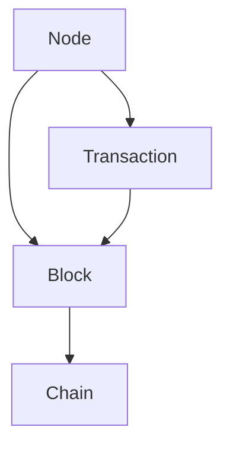

                 


## 《区块链在数字版权保护中的新模式》

### 关键词
- 区块链
- 数字版权保护
- 智能合约
- 非同质化代币（NFT）
- 法律法规
- 共识机制

### 摘要
本文旨在探讨区块链技术在数字版权保护中的应用，分析其面临的挑战与机遇。文章首先概述区块链与数字版权保护的基本概念，然后详细讲解区块链在数字版权保护中的应用模式，包括智能合约、非同质化代币（NFT）等。接着，本文通过案例分析展示区块链在数字版权保护中的实际应用，最后讨论区块链在数字版权保护中的法律法规与未来发展趋势。

### 目录大纲

## 第一部分：区块链与数字版权保护概述

### 1. 区块链技术概述
#### 1.1 区块链的定义与特点
#### 1.2 区块链的核心原理
#### 1.3 区块链在数字版权保护中的应用价值

### 2. 数字版权保护挑战
#### 2.1 数字版权保护现状与问题
#### 2.2 数字版权侵权案例分析
#### 2.3 数字版权保护的重要性

### 3. 区块链在数字版权保护中的应用
#### 3.1 智能合约在版权交易中的应用
#### 3.2 基于区块链的版权认证与追踪
#### 3.3 基于区块链的版权维权

### 4. 区块链在数字版权保护中的新模式
#### 4.1 基于区块链的版权交易平台
#### 4.2 基于区块链的版权运营模式
#### 4.3 基于区块链的版权金融服务

### 5. 区块链在数字版权保护中的挑战与展望
#### 5.1 技术挑战
#### 5.2 法规与政策挑战
#### 5.3 发展趋势与未来展望

## 第二部分：区块链在数字版权保护中的案例分析

### 6. 案例一：知名音乐平台基于区块链的版权保护
#### 6.1 平台背景
#### 6.2 区块链解决方案
#### 6.3 实施效果与评价

### 7. 案例二：电影制片公司基于区块链的版权管理
#### 7.1 公司背景
#### 7.2 区块链应用场景
#### 7.3 实施效果与挑战

### 8. 案例三：艺术作品交易平台基于区块链的版权认证
#### 8.1 平台介绍
#### 8.2 区块链技术实现
#### 8.3 用户体验与市场反响

## 第三部分：区块链在数字版权保护中的核心技术

### 9. 智能合约在数字版权保护中的应用
#### 9.1 智能合约的基本原理
#### 9.2 智能合约在版权交易中的实现
#### 9.3 智能合约的安全性问题与解决方案

### 10. 基于区块链的版权追踪与认证技术
#### 10.1 版权追踪与认证的基本原理
#### 10.2 区块链在版权追踪与认证中的应用
#### 10.3 版权追踪与认证的案例分析

### 11. 非同质化代币（NFT）在数字版权保护中的应用
#### 11.1 NFT的定义与特点
#### 11.2 NFT在数字版权保护中的应用
#### 11.3 NFT市场的现状与未来趋势

## 第四部分：区块链在数字版权保护中的法律法规与政策

### 12. 区块链在数字版权保护中的法律法规挑战
#### 12.1 法律法规体系概述
#### 12.2 区块链与数字版权保护的法律适用问题
#### 12.3 国际合作与法规协调

### 13. 政策支持与产业发展
#### 13.1 国家政策支持
#### 13.2 地方政策支持
#### 13.3 数字版权保护产业现状与未来趋势

### 14. 案例分析：各国数字版权保护法律法规对比
#### 14.1 美国数字版权保护法规
#### 14.2 欧盟数字版权保护法规
#### 14.3 我国数字版权保护法规

## 第五部分：区块链在数字版权保护中的未来发展趋势

### 15. 区块链在数字版权保护中的发展趋势
#### 15.1 技术创新与演进
#### 15.2 市场规模与增长潜力
#### 15.3 应用场景拓展

### 16. 区块链与数字版权保护的未来挑战与机遇
#### 16.1 技术挑战与解决方案
#### 16.2 法规政策挑战与应对策略
#### 16.3 商业模式创新与价值创造

### 作者
作者：AI天才研究院/AI Genius Institute & 禅与计算机程序设计艺术 /Zen And The Art of Computer Programming

### 1. 区块链技术概述

#### 1.1 区块链的定义与特点

区块链是一种分布式数据库系统，通过加密和共识机制确保数据的安全性和不可篡改性。区块链的核心特点包括去中心化、不可篡改性、透明性和可追溯性。

- **去中心化**：区块链通过分布式网络运行，不存在中心化的管理节点，每个参与者都有平等的权利和义务。这与传统的中心化系统（如银行、社交媒体平台等）形成了鲜明对比。
- **不可篡改性**：区块链上的数据一旦记录，就不可篡改。这种特性源于区块链的加密技术和共识机制，确保了数据的真实性和可靠性。
- **透明性**：区块链上的数据对所有参与者都是透明的，任何一个人都可以查看区块链上的交易记录。这使得区块链成为一个公开透明的系统。
- **可追溯性**：区块链上的数据具有可追溯性，可以追溯到数据的来源和交易的历史。这种特性对于数字版权保护具有重要意义。

为了更直观地理解区块链的基本架构，我们可以使用Mermaid流程图来展示：



在这个流程图中，节点（Node）代表区块链中的各个参与者，区块（Block）代表数据记录，链（Chain）代表数据的连续结构。交易（Transaction）是数据记录的一部分，它会添加到区块中，然后被整个网络验证并添加到链上。

#### 1.2 区块链的核心原理

区块链的核心原理包括去中心化、共识机制、分布式账本和加密技术。

- **去中心化**：区块链的去中心化架构使其避免了传统中心化系统的单点故障和信任问题。每个节点都有完整的区块链副本，并参与网络中的共识过程。
- **共识机制**：共识机制是区块链网络中的关键机制，用于确保所有节点对账本的一致性。不同的区块链采用不同的共识机制，如工作量证明（Proof of Work, PoW）、权益证明（Proof of Stake, PoS）等。
- **分布式账本**：区块链采用分布式账本技术，实现了数据的去中心化存储和管理。每个节点都保存着完整的账本副本，并通过共识机制同步更新。
- **加密技术**：区块链使用加密技术确保数据的安全性和隐私性。加密算法用于保护区块链中的交易信息和用户身份。

区块链的这些核心原理共同实现了其安全性和透明性，使其成为一个可靠的数字版权保护平台。以下是一个简化的伪代码，用于展示区块链的基本工作流程：

```python
def blockchain():
    create Genesis Block
    current_block = Genesis Block
    while True:
        new_transaction = receive_new_transaction()
        validate_transaction(new_transaction)
        create_new_block(new_transaction, current_block)
        current_block = commit_new_block_to_chain()
```

在这个伪代码中，区块链首先创建一个创世区块（Genesis Block），然后持续接收新的交易（new_transaction），并验证这些交易的有效性。通过将这些交易添加到新的区块中，区块链创建一个新的区块，并将其提交到链上。这个过程不断重复，确保了区块链的持续更新和数据的不可篡改性。

#### 1.3 区块链在数字版权保护中的应用价值

区块链在数字版权保护中的应用具有显著的潜力。首先，区块链的去中心化和不可篡改性确保了版权信息的真实性和可靠性。版权信息一旦记录在区块链上，就不可篡改，这为版权的追踪和维权提供了强有力的支持。

其次，区块链的透明性和可追溯性使得版权的每一个环节都可以被记录和查询。这有助于防止版权侵权行为，并提高版权交易的透明度。例如，通过区块链技术，艺术家可以实时跟踪其作品的销售和授权情况，确保其版权得到充分保护。

最后，区块链技术还可以用于创建非同质化代币（NFT），将数字版权与区块链上的唯一代币进行绑定。NFT不仅可以确保数字版权的独一无二，还可以提供版权交易的便利性，促进数字版权市场的发展。

总之，区块链技术在数字版权保护中的应用，不仅提升了版权保护的效果，也为数字版权市场带来了新的机遇。在接下来的章节中，我们将进一步探讨区块链在数字版权保护中的应用模式和具体实现。

#### 2. 数字版权保护挑战

随着数字技术的发展，数字版权保护面临着前所未有的挑战。传统的版权保护手段已经难以应对日益复杂的数字版权环境，以下是数字版权保护现状与问题、数字版权侵权案例分析以及数字版权保护的重要性的详细讨论。

##### 2.1 数字版权保护现状与问题

当前，数字版权保护主要面临以下问题：

- **技术手段不足**：传统的数字版权保护技术，如DRM（数字版权管理）和数字签名，存在一定的局限性。DRM技术虽然能够限制数字内容的访问和复制，但往往会对用户体验产生负面影响。数字签名可以验证数字内容的真实性，但在应对大规模侵权时效果有限。
- **法律制度不完善**：虽然许多国家已经制定了数字版权保护的法律，但实际执行过程中仍存在一定的困难。法律滞后于技术发展，无法及时应对新的侵权形式。此外，不同国家之间的法律差异和执法力度不均也影响了数字版权保护的统一性。
- **监管难度大**：数字版权侵权行为往往具有隐蔽性、跨地域性和快速变化性。网络平台和互联网服务提供商在数字版权保护中扮演着重要角色，但由于利益冲突，他们往往无法有效执行版权保护措施。
- **用户意识薄弱**：许多用户对数字版权保护的重要性缺乏认识，认为数字内容可以随意复制和传播。这种意识薄弱导致了大量的侵权行为，加剧了数字版权保护的难度。

##### 2.2 数字版权侵权案例分析

数字版权侵权案例层出不穷，以下是一些典型的案例：

- **音乐版权侵权**：知名音乐平台Spotify曾因未经授权播放音乐作品而面临版权诉讼。侵权行为包括未经授权播放、重复播放、盗版下载等，严重损害了音乐创作者的权益。
- **影视版权侵权**：电影《星际穿越》在全球上映后不久，一些非法网站就开始提供高清盗版下载，导致电影公司损失惨重。此类侵权行为不仅侵犯了版权方的权益，还影响了电影市场的健康发展。
- **文学作品侵权**：一些网络文学平台未经授权转载原创作品，导致原创作者权益受损。此外，一些盗版书籍在未经授权的情况下在市场上流通，严重影响了原创文学市场的秩序。

##### 2.3 数字版权保护的重要性

数字版权保护的重要性体现在以下几个方面：

- **保障创作者权益**：数字版权保护能够确保创作者的权益得到有效保护，使其能够从其作品中获得应有的经济回报。这对于激励创作、保护知识产权具有重要意义。
- **维护市场秩序**：数字版权保护有助于维护数字市场的公平竞争环境，防止侵权行为扰乱市场秩序，促进市场的健康发展。
- **推动技术创新**：数字版权保护技术的不断发展和完善，有助于推动相关技术创新，如区块链、人工智能等。这些技术为数字版权保护提供了新的手段和工具。
- **促进文化交流**：数字版权保护有助于促进文化作品的传播和交流，使更多的人能够接触到高质量的文化内容，提高公众的文化素养。

总之，数字版权保护面临着严峻的挑战，但也充满了机遇。通过技术创新、法律完善和用户教育，数字版权保护将得到进一步的发展，为数字时代的知识产权保护提供有力支持。

#### 3. 区块链在数字版权保护中的应用

区块链技术以其去中心化、不可篡改、透明性和可追溯性，为数字版权保护提供了新的解决方案。以下是区块链在数字版权保护中的具体应用，包括智能合约、版权认证与追踪以及版权维权等。

##### 3.1 智能合约在版权交易中的应用

智能合约是区块链技术的一个重要应用，它是一种自动执行合约条款的程序。在数字版权交易中，智能合约可以自动执行版权许可、支付和结算等操作，确保交易的透明性和安全性。

- **自动许可**：当用户希望购买或授权使用某个数字作品时，智能合约可以自动审核并发放相应的版权许可。这避免了人工审核的延迟和错误，提高了交易效率。
- **支付与结算**：智能合约可以自动执行支付操作，将版权费用支付给创作者或版权持有者。这种自动结算方式不仅提高了效率，还减少了交易成本。
- **记录交易历史**：智能合约记录每次版权交易的历史，确保交易的透明性和可追溯性。这有助于防止版权侵权行为，并为维权提供证据。

以下是一个简单的智能合约伪代码示例，用于数字版权交易：

```solidity
pragma solidity ^0.8.0;

contract CopyrightTrade {
    mapping(address => mapping(uint => bool)) public licenses;

    function buyLicense(uint licenseId, address creator) external payable {
        require(msg.value > 0, "支付金额不足");
        require(!licenses[creator][licenseId], "版权已售出");

        licenses[creator][licenseId] = true;
        payable(creator).transfer(msg.value);
    }

    function checkLicense(uint licenseId, address creator) external view returns (bool) {
        return licenses[creator][licenseId];
    }
}
```

在这个示例中，`buyLicense` 函数用于购买版权许可，`checkLicense` 函数用于查询版权许可状态。版权许可的状态（已售出或未售出）被记录在区块链上，确保了交易的透明性和不可篡改性。

##### 3.2 基于区块链的版权认证与追踪

区块链技术可以用于数字版权的认证与追踪，确保数字作品的版权归属和版权历史记录。

- **版权认证**：创作者可以将数字作品的上传和版权声明记录在区块链上，形成一个不可篡改的版权证明。这有助于保护创作者的权益，防止未经授权的复制和传播。
- **版权追踪**：区块链记录了每个数字作品的所有交易历史，包括购买、授权、转让等操作。这有助于追踪数字作品的传播路径，及时发现和防止侵权行为。

以下是一个简单的版权认证和追踪流程：

1. **版权声明**：创作者将数字作品及其版权声明上传到区块链平台。
2. **区块链记录**：区块链平台验证并记录版权声明，确保其不可篡改。
3. **版权追踪**：任何对数字作品的交易或授权操作都会被记录在区块链上，形成完整的版权历史记录。
4. **版权查询**：任何人都可以通过区块链平台查询数字作品的版权信息，确保版权的透明性和可追溯性。

##### 3.3 基于区块链的版权维权

区块链技术可以为版权维权提供强有力的支持，通过智能合约和区块链记录，创作者可以轻松地证明其作品的版权归属。

- **版权证据存储**：创作者可以将相关的版权证据（如原创作品、合同、交易记录等）存储在区块链上，确保证据的真实性和不可篡改性。
- **维权流程自动化**：当创作者发现侵权行为时，可以通过智能合约自动启动维权流程。智能合约可以自动通知侵权方，并要求其停止侵权行为或进行赔偿。
- **法律诉讼支持**：区块链记录的版权信息可以作为法律诉讼的重要证据，帮助创作者在法庭上证明其权益。

以下是一个简单的版权维权流程：

1. **发现侵权行为**：创作者发现其作品被非法复制或传播。
2. **启动维权流程**：创作者通过智能合约向侵权方发出通知，要求其停止侵权行为。
3. **侵权方未响应**：如果侵权方未在规定时间内停止侵权行为，创作者可以启动法律诉讼。
4. **提供证据**：创作者向法庭提供区块链记录的版权信息，作为证明其权益的证据。
5. **法律裁决**：法庭根据提供的证据做出裁决，侵权方需承担相应的法律责任。

总之，区块链技术为数字版权保护提供了新的手段和工具，通过智能合约、版权认证与追踪以及版权维权等功能，有效提升了数字版权保护的效果和效率。在接下来的章节中，我们将进一步探讨区块链在数字版权保护中的新模式，以及这些新模式对传统版权保护方式的挑战和机遇。

#### 4. 区块链在数字版权保护中的新模式

区块链技术在数字版权保护中的应用，不仅提升了版权保护的效果，还催生出了一系列新的版权保护模式。这些新模式包括基于区块链的版权交易平台、版权运营模式和版权金融服务。以下是这些新模式的详细探讨。

##### 4.1 基于区块链的版权交易平台

基于区块链的版权交易平台是一种全新的版权交易模式，它通过区块链技术实现了版权交易的去中心化和透明化。

- **去中心化交易**：在传统的版权交易平台中，版权交易往往需要依赖中心化的中介机构，这不仅增加了交易成本，还降低了交易的效率。基于区块链的版权交易平台实现了去中心化交易，每个参与者都可以直接进行交易，无需依赖第三方中介。
- **透明化交易记录**：区块链技术确保了交易记录的透明性和不可篡改性。每个交易都记录在区块链上，所有参与者都可以查看和验证交易记录，这大大提高了交易的透明度。
- **降低交易成本**：基于区块链的版权交易平台通过智能合约自动执行交易，减少了人工干预和中介费用，从而降低了交易成本。

以下是一个简化的版权交易平台流程：

1. **版权注册**：创作者将数字作品及其版权信息上传到区块链平台，进行版权注册。
2. **交易发起**：买家通过区块链平台发起购买请求，并支付相应的版权费用。
3. **智能合约执行**：区块链平台上的智能合约自动验证交易的有效性，并执行交易操作，将版权许可证发送给买家。
4. **交易记录**：交易记录被永久记录在区块链上，供所有参与者查询。

##### 4.2 基于区块链的版权运营模式

基于区块链的版权运营模式通过区块链技术实现了版权的全程管理和运营。

- **版权管理**：创作者可以将版权管理操作（如版权转让、授权许可等）记录在区块链上，确保操作的透明性和不可篡改性。这有助于创作者更好地管理和维护其版权。
- **版权追溯**：区块链技术确保了版权历史的可追溯性。创作者可以通过区块链查询其作品的版权交易历史，确保版权的透明性和合法性。
- **版权许可**：创作者可以通过区块链平台向其他用户发放版权许可，明确许可范围和使用条件。智能合约可以自动执行许可协议，确保许可的透明性和规范性。

以下是一个简化的版权运营模式流程：

1. **版权注册**：创作者将数字作品及其版权信息上传到区块链平台，进行版权注册。
2. **版权管理**：创作者通过区块链平台进行版权管理操作，如版权转让、授权许可等。
3. **版权许可**：创作者通过区块链平台向其他用户发放版权许可，并记录在区块链上。
4. **版权追溯**：用户可以通过区块链查询作品的版权信息，确保版权的透明性和合法性。

##### 4.3 基于区块链的版权金融服务

基于区块链的版权金融服务通过区块链技术为版权交易提供了更加便捷和高效的金融服务。

- **版权抵押贷款**：创作者可以通过将版权作为抵押物，获得贷款资金。基于区块链的智能合约可以自动执行贷款协议，确保贷款的安全性和透明性。
- **版权证券化**：创作者可以将版权资产进行证券化，通过发行数字债券等方式融资。区块链技术确保了版权资产的真实性和透明性，为投资者提供了可靠的投资选择。
- **版权保险**：基于区块链的版权保险可以为创作者提供风险保障。智能合约可以自动执行保险协议，确保保险理赔的透明性和高效性。

以下是一个简化的版权金融服务流程：

1. **版权抵押贷款申请**：创作者向金融机构申请版权抵押贷款。
2. **版权评估**：金融机构通过区块链平台对创作者的版权进行评估。
3. **智能合约执行**：基于区块链的智能合约自动执行贷款协议，发放贷款。
4. **版权证券化**：创作者通过区块链平台发行数字债券。
5. **版权保险购买**：创作者通过区块链平台购买版权保险。

总之，区块链在数字版权保护中的应用，不仅创新了版权保护模式，还为数字版权市场提供了新的发展机遇。通过基于区块链的版权交易平台、版权运营模式和版权金融服务，数字版权保护将更加高效、透明和可靠。在接下来的章节中，我们将进一步探讨区块链在数字版权保护中的挑战与展望。

#### 5. 区块链在数字版权保护中的挑战与展望

尽管区块链技术在数字版权保护中展现出了巨大的潜力，但在实际应用中仍然面临诸多挑战。以下是区块链在数字版权保护中的技术挑战、法规与政策挑战以及未来发展的展望。

##### 5.1 技术挑战

区块链技术在数字版权保护中的应用面临以下技术挑战：

- **性能与扩展性**：区块链技术最初设计用于处理金融交易，但在处理大量版权数据时，性能和扩展性成为关键挑战。传统的区块链架构在处理高并发交易时可能遇到瓶颈，导致交易延迟和吞吐量不足。
- **隐私保护**：虽然区块链的透明性是其一大优势，但在数字版权保护中，隐私保护同样重要。如何在不损害透明性的前提下保护创作者和版权持有者的隐私，是一个亟待解决的问题。
- **智能合约安全性**：智能合约是区块链技术中的核心组件，但其安全性直接关系到版权保护的有效性。智能合约中的漏洞或恶意代码可能导致版权信息的泄露或被篡改，因此，确保智能合约的安全性是关键挑战。

为了应对这些技术挑战，需要采取以下措施：

- **优化区块链架构**：通过改进区块链算法和架构，提高其性能和扩展性。例如，采用分片技术（Sharding）或侧链（Sidechain）技术，可以提升区块链的处理能力和扩展性。
- **隐私保护机制**：设计隐私保护机制，如零知识证明（Zero-Knowledge Proof）或同态加密（Homomorphic Encryption），在确保透明性的同时保护创作者和版权持有者的隐私。
- **智能合约安全审计**：在部署智能合约前进行严格的安全审计和测试，确保其不存在漏洞。同时，建立智能合约的定期审查和更新机制，以应对新出现的威胁。

##### 5.2 法规与政策挑战

区块链在数字版权保护中的应用也面临法规与政策挑战：

- **法律法规滞后**：现有的数字版权保护法律法规往往滞后于技术的发展，无法有效应对区块链环境下的新问题。例如，区块链上的版权侵权行为如何进行法律追究，现有法律框架尚不明确。
- **跨国合作与协调**：数字版权保护涉及多个国家和地区，跨国合作与协调至关重要。然而，不同国家和地区在数字版权保护方面的法律法规和执法力度存在差异，导致国际协作面临困难。
- **政策支持不足**：尽管区块链技术被认为具有巨大潜力，但在实际应用中，政策支持仍然不足。政策层面的支持对于推动区块链技术在数字版权保护中的应用至关重要。

为了应对这些法规与政策挑战，需要采取以下措施：

- **法律法规修订**：及时修订和完善数字版权保护法律法规，确保其能够适应区块链技术带来的新变化。例如，明确区块链环境下版权侵权行为的法律责任和追责机制。
- **国际合作与协调**：加强国际间的合作与协调，建立跨国合作机制，推动全球范围内的数字版权保护法律体系建设。例如，通过国际组织和多边协议，促进各国在数字版权保护方面的法律法规和执法标准的统一。
- **政策支持**：在政策层面给予区块链技术更多的支持，鼓励企业和研究机构开展相关技术研究和应用探索。同时，通过税收优惠、研发资助等政策措施，推动区块链技术在数字版权保护领域的应用。

##### 5.3 发展趋势与未来展望

随着区块链技术的不断发展和成熟，数字版权保护领域有望迎来新的发展趋势：

- **技术创新**：区块链技术将继续创新发展，例如，结合人工智能、物联网等技术，提升数字版权保护的效果和效率。例如，利用区块链和AI技术实现智能化的版权监测和侵权识别。
- **市场增长**：随着数字版权保护需求的增加，区块链技术在版权领域的应用将不断扩展，市场规模有望持续增长。例如，NFT市场在数字版权交易中的广泛应用，预示着数字版权保护市场的前景广阔。
- **商业模式创新**：区块链技术将推动数字版权保护领域的商业模式创新，例如，基于区块链的版权金融服务、版权运营平台等，为创作者和版权持有者提供更多价值。

总之，区块链技术在数字版权保护中的应用面临着技术、法规与政策等多方面的挑战，但同时也充满了机遇。通过技术创新、法律完善和政策支持，区块链技术在数字版权保护领域将发挥越来越重要的作用，为数字时代的知识产权保护提供新的解决方案。

#### 第二部分：区块链在数字版权保护中的案例分析

为了更好地理解区块链在数字版权保护中的应用，我们可以通过一些实际案例来进行分析。以下是三个具体案例的详细介绍。

##### 6. 案例一：知名音乐平台基于区块链的版权保护

**6.1 平台背景**

知名音乐平台Spotify是一家全球领先的在线音乐服务平台，提供广泛的数字音乐资源，用户可以在线收听、下载和分享音乐。然而，Spotify在版权保护方面面临诸多挑战，如未经授权的音乐上传、重复播放和盗版下载等。

**6.2 区块链解决方案**

为了解决版权保护问题，Spotify开始探索基于区块链的解决方案。具体措施包括：

- **版权声明与注册**：Spotify鼓励创作者在其平台上上传音乐作品时，同时上传版权声明和版权信息。这些信息会被记录在区块链上，确保版权信息的不可篡改和透明性。
- **智能合约应用**：Spotify使用智能合约来管理版权许可和支付操作。创作者可以通过智能合约自动授权音乐的使用，并确保版权许可的透明性和可执行性。
- **版权追踪与监测**：Spotify通过区块链技术实现音乐作品的版权追踪和监测。任何与音乐作品的交易或侵权行为都会被记录在区块链上，确保版权的透明性和可追溯性。

**6.3 实施效果与评价**

Spotify基于区块链的版权保护解决方案取得了显著的效果：

- **提高透明度**：版权信息的透明度得到了显著提升，创作者可以清晰地了解其作品的授权和使用情况。
- **降低侵权风险**：区块链记录的交易历史和授权信息为创作者提供了有力的维权证据，有助于降低侵权风险。
- **提升用户信任**：用户对Spotify的版权保护措施有了更高的信任度，这有助于提升用户体验和平台声誉。

然而，该解决方案也面临一些挑战：

- **技术复杂性**：区块链技术的引入增加了系统的复杂性，需要进一步优化和简化用户操作。
- **监管合规**：在区块链环境下，如何确保版权保护的合规性和法律适用性，仍需要进一步研究和探讨。

总体而言，Spotify基于区块链的版权保护解决方案为数字音乐平台提供了一个新的思路和方向，虽然面临一些挑战，但其应用前景依然广阔。

##### 7. 案例二：电影制片公司基于区块链的版权管理

**7.1 公司背景**

电影制片公司华纳兄弟（Warner Bros.）是一家全球知名的电影制作和发行公司，其作品涵盖电影、电视节目和音乐等多个领域。随着数字技术的发展，华纳兄弟面临着日益严峻的版权侵权问题，特别是在盗版下载和非法传播方面。

**7.2 区块链应用场景**

为了解决版权侵权问题，华纳兄弟开始利用区块链技术进行版权管理。具体应用场景包括：

- **版权注册与认证**：华纳兄弟鼓励创作者将其作品的版权信息上传到区块链平台，确保版权信息的真实性和不可篡改性。这为版权的认证和追踪提供了强有力的支持。
- **版权许可与管理**：通过区块链平台，华纳兄弟可以实现版权许可的自动化管理。创作者可以通过智能合约自动发放版权许可，确保许可的透明性和规范性。
- **版权追踪与维权**：区块链技术确保了版权信息的可追溯性，华纳兄弟可以实时监测其作品的传播和使用情况，及时发现侵权行为并进行维权。

**7.3 实施效果与挑战**

华纳兄弟基于区块链的版权管理解决方案取得了以下成效：

- **提高版权保护效率**：区块链技术使版权保护过程更加高效，创作者可以快速获得版权许可，减少人工干预和延迟。
- **降低侵权风险**：版权信息的透明性和可追溯性有助于降低侵权风险，创作者可以更加放心地使用数字平台。
- **提升用户体验**：通过区块链技术，用户可以更方便地获取正版作品，提高用户满意度和忠诚度。

然而，该解决方案也面临一些挑战：

- **技术整合与兼容**：区块链技术的引入需要对现有系统进行整合和兼容，这需要投入大量时间和资源。
- **用户教育**：用户对区块链技术的理解和接受度需要进一步提高，这需要开展广泛的教育和宣传。

总体而言，华纳兄弟基于区块链的版权管理解决方案为电影行业提供了一个新的版权保护模式，虽然面临一些挑战，但其应用前景依然广阔。

##### 8. 案例三：艺术作品交易平台基于区块链的版权认证

**8.1 平台介绍**

艺术作品交易平台OpenSea是一个去中心化的NFT（非同质化代币）市场，提供艺术家和收藏家之间的交易平台。OpenSea致力于通过区块链技术为艺术作品提供真正的数字版权认证。

**8.2 区块链技术实现**

OpenSea采用以太坊区块链作为底层技术，通过智能合约和ERC-721标准来实现艺术作品的数字版权认证。具体实现包括：

- **版权声明与注册**：艺术家在OpenSea平台上传艺术作品时，需要声明版权信息，并将作品与其独特的NFT代币进行绑定。这些信息会被记录在以太坊区块链上，确保版权信息的不可篡改。
- **版权交易与许可**：用户可以在OpenSea平台上购买、出售和授权NFT代币，这些交易都会被记录在区块链上，确保交易的透明性和可追溯性。
- **版权维权**：OpenSea平台提供了一套完整的版权维权机制，包括版权投诉、侵权处理和法律支持。创作者可以通过智能合约自动启动维权流程，确保其权益得到保护。

**8.3 用户体验与市场反响**

OpenSea平台基于区块链的版权认证机制得到了广泛的认可和积极的市场反响：

- **用户信任度提升**：用户对OpenSea平台的信任度得到显著提升，因为他们相信平台提供的数字版权认证是真实和可靠的。
- **交易透明度提高**：区块链记录的交易历史和授权信息使交易过程更加透明，用户可以清晰地了解作品的授权和使用情况。
- **市场活跃度增加**：基于区块链的版权认证机制吸引了更多的艺术家和收藏家参与，平台的交易量和用户活跃度显著增加。

总体而言，OpenSea平台通过区块链技术为艺术作品提供了真正的数字版权认证，为艺术市场带来了新的机遇和活力。

通过以上案例分析，我们可以看到区块链技术在数字版权保护中的应用已经取得了一定的成效。然而，实际应用中仍然面临一些挑战，如技术整合、用户教育和法律法规完善等。随着技术的不断进步和市场的成熟，区块链在数字版权保护中的应用前景将更加广阔。

#### 第三部分：区块链在数字版权保护中的核心技术

在区块链技术的支持下，数字版权保护得以实现透明、安全且可追溯的效果。本部分将详细探讨区块链在数字版权保护中的核心技术，包括智能合约、版权追踪与认证技术以及非同质化代币（NFT）的应用。

##### 9. 智能合约在数字版权保护中的应用

智能合约是区块链技术中的关键组件，它是一种自动执行的协议，能够在满足特定条件时自动执行预定的操作。在数字版权保护中，智能合约被广泛应用于版权交易、版权许可和版权管理等方面。

**9.1 智能合约的基本原理**

智能合约由代码编写而成，通常使用Solidity等编程语言实现。智能合约的执行依赖于区块链网络中的节点，这些节点会验证并记录智能合约的执行情况。

- **触发条件**：智能合约的执行通常基于特定的事件或条件。例如，当用户支付版权费用后，智能合约会自动发放版权许可。
- **执行操作**：智能合约在满足触发条件后，会自动执行预定的操作，如转移资金、记录交易信息等。
- **不可篡改性**：由于区块链的分布式账本特性，智能合约的执行记录是不可篡改的，确保了版权交易和许可的透明性和可靠性。

**9.2 智能合约在版权交易中的实现**

在版权交易中，智能合约可以自动执行交易的各个环节，包括购买、支付和许可等。

- **购买操作**：当用户希望在数字版权交易平台上购买版权时，智能合约会自动验证用户支付的资金，并发放版权许可。
- **支付操作**：智能合约在确认购买请求后，会自动执行支付操作，将版权费用支付给版权持有者。
- **许可操作**：版权许可的发放由智能合约自动执行，确保许可的透明性和规范性。

以下是一个简单的智能合约实现示例：

```solidity
pragma solidity ^0.8.0;

contract CopyrightTrade {
    mapping(uint => address) public licenses;

    function buyLicense(uint licenseId) external payable {
        require(msg.value > 0, "支付金额不足");
        licenses[licenseId] = msg.sender;
        payable(msg.sender).transfer(msg.value);
    }

    function checkLicense(uint licenseId) external view returns (address) {
        return licenses[licenseId];
    }
}
```

在这个示例中，`buyLicense` 函数用于购买版权许可，`checkLicense` 函数用于查询版权许可状态。每次购买操作都会记录在区块链上，确保交易的透明性和不可篡改性。

**9.3 智能合约的安全性问题与解决方案**

智能合约的安全性至关重要，任何漏洞或恶意代码都可能对版权信息造成严重破坏。以下是一些常见的智能合约安全问题和解决方案：

- **重入攻击（Reentrancy Attack）**：重入攻击是一种常见的智能合约攻击方式，攻击者通过连续调用合约函数，多次执行转移资金的操作，导致资金损失。解决方案是采用安全编程模式，如检查余额或使用事务锁定（Reentrancy Lock）。
- **整数溢出攻击（Integer Overflow/Underflow Attack）**：整数溢出攻击利用整数类型的安全漏洞，导致数据损坏或资金损失。解决方案是使用安全的数学运算和类型转换。
- **智能合约审计**：在部署智能合约前，进行严格的安全审计和测试，确保代码不存在漏洞。此外，建立智能合约的定期审查和更新机制，以应对新出现的威胁。

##### 10. 基于区块链的版权追踪与认证技术

基于区块链的版权追踪与认证技术为数字版权保护提供了透明、可追溯和不可篡改的解决方案。通过区块链，版权信息可以被永久记录和验证，确保版权的透明性和可靠性。

**10.1 版权追踪与认证的基本原理**

版权追踪与认证技术基于区块链的分布式账本和加密技术，包括以下几个关键步骤：

- **版权注册**：创作者将作品的版权信息上传到区块链平台，进行版权注册。版权信息包括作品名称、创作者姓名、创作日期等。
- **版权认证**：区块链平台通过加密算法和共识机制验证版权信息的真实性，并将版权信息记录在区块链上。这确保了版权信息的不可篡改和透明性。
- **版权追踪**：区块链记录了每个版权信息的交易历史，包括购买、授权和转让等操作。这为版权的追踪和维权提供了强有力的支持。

**10.2 区块链在版权追踪与认证中的应用**

区块链技术在版权追踪与认证中具有广泛的应用，包括以下几个方面：

- **版权注册与认证**：创作者通过区块链平台上传作品和版权信息，平台会通过智能合约自动执行版权认证，确保版权信息的真实性和透明性。
- **版权交易记录**：任何涉及版权的交易都会被记录在区块链上，包括购买、授权和转让等操作。这些交易记录可以追溯，确保版权的透明性和合法性。
- **版权维权**：创作者可以通过区块链平台追踪其作品的传播和使用情况，一旦发现侵权行为，可以启动维权流程，利用区块链记录的交易历史作为证据。

**10.3 版权追踪与认证的案例分析**

以下是一个版权追踪与认证的案例分析：

- **案例背景**：某位画家创作了一幅数字艺术作品，并将其版权信息上传到基于区块链的版权认证平台。
- **版权注册**：画家通过平台注册版权信息，包括作品名称、创作者姓名、创作日期等，这些信息被记录在区块链上。
- **版权认证**：平台通过智能合约验证版权信息的真实性，并将版权信息永久记录在区块链上，确保其不可篡改。
- **版权交易**：某位收藏家通过平台购买了这幅作品的版权，交易记录被记录在区块链上，包括购买日期、购买金额和版权持有者信息。
- **版权追踪**：画家可以通过区块链平台实时追踪其作品的销售和使用情况，确保其版权得到充分保护。

通过以上案例分析，我们可以看到基于区块链的版权追踪与认证技术如何确保版权的透明性和可追溯性，为数字版权保护提供了强有力的支持。

##### 11. 非同质化代币（NFT）在数字版权保护中的应用

非同质化代币（NFT）是一种基于区块链的独特数字资产，用于代表独一无二的物品或权益。NFT在数字版权保护中的应用，为版权认证、交易和管理提供了新的解决方案。

**11.1 NFT的定义与特点**

NFT（Non-Fungible Token）是一种独特的数字代币，与比特币等加密货币不同，NFT具有不可替代性，即每个NFT都是独一无二的。NFT的主要特点包括：

- **唯一性**：每个NFT都有唯一的标识符，确保其代表的物品或权益的独特性。
- **不可分割**：NFT无法分割，即一个NFT不能被分成多个部分。
- **可追溯性**：NFT的交易历史记录在区块链上，确保其所有权的透明性和可追溯性。
- **数字认证**：NFT可以作为数字资产的认证，确保其真实性和合法性。

**11.2 NFT在数字版权保护中的应用**

NFT在数字版权保护中的应用主要体现在以下几个方面：

- **版权认证**：创作者可以通过发行NFT来认证其数字作品，确保作品的真实性和唯一性。NFT的发行过程记录在区块链上，不可篡改，为版权认证提供了可靠的依据。
- **版权交易**：NFT可以作为数字版权的交易媒介，简化交易流程。购买NFT即获得数字作品的所有权，交易记录透明且可追溯，有助于防止版权侵权。
- **版权管理**：创作者可以通过NFT管理其数字作品的授权和使用情况。每个NFT都包含授权信息，用户可以通过购买NFT来获取相应的授权，确保授权的透明性和规范性。

**11.3 NFT市场的现状与未来趋势**

NFT市场近年来迅速发展，吸引了大量投资者和创作者。以下是目前NFT市场的现状和未来趋势：

- **市场增长**：NFT市场在2020年后迅速扩张，多个NFT项目成功吸引了大量投资者，市场交易额持续增长。
- **应用多样化**：NFT不仅应用于数字艺术作品，还扩展到虚拟商品、游戏、虚拟房地产等多个领域，未来应用场景将进一步丰富。
- **技术创新**：随着区块链技术的不断进步，NFT市场将引入更多技术创新，如去中心化金融（DeFi）、跨链技术等，进一步提升NFT的应用价值和市场潜力。

总之，NFT在数字版权保护中的应用为版权认证、交易和管理提供了新的解决方案。随着NFT市场的持续发展和技术创新，NFT有望在数字版权保护领域发挥更大的作用。

#### 第四部分：区块链在数字版权保护中的法律法规与政策

在区块链技术日益普及的背景下，数字版权保护面临着新的法律和监管挑战。为了确保区块链在数字版权保护中的应用能够得到有效监管和法律保障，我们需要深入探讨当前法律法规体系、法律适用问题以及国际合作与法规协调。

##### 12.1 法律法规体系概述

现有的数字版权保护法律法规体系主要由国际条约、国家法律和行业标准构成。以下是几个关键的法律框架：

- **国际条约**：例如《伯尔尼公约》（Berne Convention）和《世界知识产权组织版权条约》（WCT）等，规定了版权的基本原则和国际协作机制。
- **国家法律**：不同国家根据自身的法律体系和数字经济发展需求，制定了相应的数字版权保护法律。例如，美国的《数字千年版权法案》（DMCA）和欧盟的《版权指令》（Copyright Directive）。
- **行业标准**：一些行业组织发布了数字版权保护的标准和指南，如国际标准组织（ISO）和运动图像协会（MPEG）等。

这些法律法规构成了数字版权保护的法律基础，但在区块链环境下，如何适用这些法律成为新的挑战。

##### 12.2 区块链与数字版权保护的法律适用问题

区块链技术带来的去中心化、匿名性和不可篡改性，对现有法律框架提出了新的挑战：

- **身份识别问题**：在区块链环境中，用户的身份识别变得更加困难。匿名性使得侵权行为的追踪和责任认定变得复杂，现有法律对匿名用户的追责机制需要改进。
- **版权归属问题**：区块链上的数字作品可能由多个参与者共同创造和维护，如何确定版权归属和分配收益成为法律适用的重要问题。
- **跨国纠纷**：区块链技术的跨国特性使得跨国版权纠纷频发，现有法律体系中的管辖权和法律适用问题亟待解决。

为了应对这些法律适用问题，需要采取以下措施：

- **完善法律框架**：修订和完善现有数字版权保护法律，明确区块链环境下的版权归属、侵权责任和纠纷解决机制。
- **推动国际合作**：加强国际间的合作，建立统一的数字版权保护法律框架，确保跨国纠纷的协调和处理。
- **技术辅助**：利用区块链技术本身的特点，如智能合约和去中心化身份验证，提升法律适用性和执行效率。

##### 12.3 国际合作与法规协调

数字版权保护的国际合作与法规协调对于全球数字版权保护体系的建设至关重要。以下是一些国际合作与法规协调的举措：

- **多边条约**：通过多边条约和协议，促进各国在数字版权保护法律和执法标准上的协调，如《世界知识产权组织互联网条约》（WIPO IT）。
- **国际组织**：利用国际组织如世界知识产权组织（WIPO）和互联网名称与数字地址分配机构（ICANN）等，推动全球数字版权保护的合作与协调。
- **跨国执法合作**：加强跨国执法合作，通过国际警务合作和跨境执法行动，打击跨国数字版权侵权行为。

总之，区块链在数字版权保护中的应用面临着法律法规和监管挑战。通过完善法律框架、推动国际合作和利用技术辅助，可以确保区块链技术在数字版权保护中的有效应用，为数字时代的知识产权保护提供强有力的法律保障。

##### 13. 政策支持与产业发展

在数字版权保护领域，政策支持与产业发展是推动区块链技术落地应用的重要驱动力。以下从国家政策、地方政策以及数字版权保护产业现状和未来趋势三个方面进行探讨。

**13.1 国家政策支持**

各国政府纷纷认识到区块链技术在数字版权保护中的潜力，并通过多种方式提供政策支持：

- **创新基金**：许多国家设立了创新基金，用于支持区块链技术的研究和应用。例如，美国国家科学基金会（NSF）和欧盟的Horizon 2020计划提供了大量资金，支持区块链在数字版权保护中的应用研究。
- **税收优惠**：为鼓励企业投资区块链技术，一些国家提供了税收优惠措施。例如，日本和韩国为区块链企业在研发和测试阶段提供了税收减免政策。
- **法规指导**：政府通过发布法规和指导文件，为区块链技术在数字版权保护中的应用提供法律和监管框架。例如，中国的《区块链技术应用指南》为区块链在版权保护中的应用提供了明确的方向。

**13.2 地方政策支持**

地方政府在数字版权保护产业的支持上同样发挥了重要作用：

- **产业园区**：许多地方政府建立了区块链产业园区，提供政策优惠、技术支持和市场资源，吸引区块链企业和研究机构入驻。例如，中国的深圳和上海建立了多个区块链产业基地，促进了区块链技术在数字版权保护领域的应用。
- **人才引进**：地方政府通过人才引进政策，吸引区块链领域的专业人才，为数字版权保护产业提供了人才保障。例如，北京和深圳为区块链人才提供了住房补贴和职业发展支持。
- **知识产权保护**：地方政府加强知识产权保护，为区块链技术在数字版权保护中的应用提供了良好的法律环境。例如，杭州设立了知识产权法庭，专门处理数字版权纠纷案件。

**13.3 数字版权保护产业现状与未来趋势**

数字版权保护产业在全球范围内呈现出快速增长的趋势，以下是其现状和未来趋势：

- **市场规模扩大**：随着数字内容产业的快速发展，数字版权保护市场规模不断扩大。根据市场研究报告，全球数字版权保护市场预计将在未来几年内实现显著增长。
- **技术创新驱动**：区块链、人工智能和大数据等新兴技术的融合，推动了数字版权保护技术的创新。智能合约、NFT和版权追踪技术等正在逐渐成熟，为数字版权保护提供了新的解决方案。
- **应用场景丰富**：数字版权保护的应用场景不断拓展，从音乐、影视到虚拟现实和游戏，涵盖了多个领域。未来，随着技术的进一步成熟，数字版权保护的应用将更加广泛。
- **国际合作加强**：全球范围内的数字版权保护产业正在加强国际合作，通过跨国合作和标准制定，推动全球数字版权保护体系的建设。

总之，政策支持和产业发展是区块链在数字版权保护中应用的重要保障。通过国家政策、地方政策的双重支持，以及数字版权保护产业的快速发展，区块链技术将在数字版权保护领域发挥更大的作用。

##### 14. 案例分析：各国数字版权保护法律法规对比

在全球范围内，各国在数字版权保护方面的法律法规存在显著差异。以下分别对美国、欧盟和我国的数字版权保护法规进行对比分析，以了解各国在数字版权保护方面的法律框架和政策导向。

**14.1 美国数字版权保护法规**

美国的数字版权保护法律法规体系较为完善，其中最为重要的法案是《数字千年版权法案》（DMCA）。DMCA于1998年通过，旨在保护版权人利益，同时平衡信息自由和版权保护。

- **版权注册**：美国版权局（Copyright Office）负责版权注册，创作者需向版权局提交版权申请，获得版权登记。
- **侵权责任**：DMCA规定了侵权责任，包括侵权行为认定、侵权责任追究等。侵权者可能面临民事赔偿和刑事处罚。
- **安全港原则**：DMCA确立了“安全港原则”，为网络服务提供商提供了保护，只要其未知情且未从侵权行为中获利，即可免受版权侵权责任。

**14.2 欧盟数字版权保护法规**

欧盟在数字版权保护方面采取了更加统一的立法策略，通过《版权指令》（Copyright Directive）统一了各成员国的版权保护标准。

- **版权登记**：欧盟成员国通常采用版权自动保护原则，即创作完成后自动享有版权，无需进行正式注册。
- **侵权责任**：《版权指令》明确了侵权行为的法律责任，包括侵权赔偿、禁令执行等。欧盟还设立了版权法院，专门处理数字版权侵权案件。
- **版权利用**：欧盟鼓励版权利用，包括合理使用、引用、教学等，这些行为在特定条件下不构成侵权。

**14.3 我国数字版权保护法规**

我国的数字版权保护法律法规逐步完善，以《著作权法》为核心，辅以《信息网络传播权保护条例》和《计算机软件保护条例》等。

- **版权登记**：我国实行版权自愿登记制度，版权人可以向国家版权局申请版权登记，登记证书作为版权证明。
- **侵权责任**：《著作权法》规定了侵权行为的法律责任，包括民事赔偿、罚款和拘留等。此外，我国设立了版权纠纷调解机制，以简化维权流程。
- **版权保护力度**：我国政府加大了对数字版权保护的执法力度，通过开展专项行动和建立举报平台，打击侵权行为。

通过对比分析，我们可以看出：

- **版权登记**：美国和欧盟实行版权自动保护，而我国则实行自愿登记制度。
- **侵权责任**：美国和欧盟的法律体系较为完备，明确侵权责任和维权途径，我国在法律执行和维权机制方面也有所改进。
- **版权利用**：欧盟鼓励合理使用和版权利用，而美国和我国在版权利用方面相对保守。

总之，各国在数字版权保护方面各有特点，通过借鉴国际经验，我国可以进一步完善数字版权保护法律法规，提升版权保护水平。

#### 第五部分：区块链在数字版权保护中的未来发展趋势

随着区块链技术的不断成熟，其在数字版权保护中的应用前景愈发广阔。未来，区块链技术将在技术创新、市场规模和应用场景拓展等方面带来新的发展机遇。

##### 15.1 技术创新与演进

区块链技术在数字版权保护中的创新将持续推动技术演进：

- **性能提升**：随着区块链技术的不断优化，其性能将得到显著提升，以满足大规模数据处理的需求。例如，通过引入分片技术（Sharding）和状态通道（State Channels）等，提高交易速度和吞吐量。
- **隐私保护**：随着隐私保护需求的增加，区块链技术将引入更多隐私保护机制，如零知识证明（Zero-Knowledge Proof）和同态加密（Homomorphic Encryption），确保用户隐私和版权信息的安全。
- **跨链协作**：跨链技术将促进不同区块链之间的协作，实现数据共享和互操作性。例如，通过跨链协议，将版权信息在不同区块链之间进行交换和验证，提高版权保护的效率。

##### 15.2 市场规模与增长潜力

区块链在数字版权保护领域的市场规模和增长潜力巨大：

- **市场扩容**：随着数字内容产业的快速发展，数字版权保护市场需求持续增长。据预测，全球数字版权保护市场规模将在未来几年内实现显著增长。
- **技术创新驱动**：区块链技术的不断进步将为数字版权保护带来更多创新应用，如智能合约、非同质化代币（NFT）和版权追踪系统等，进一步扩大市场规模。
- **政策支持**：各国政府对区块链技术的支持政策和法规完善，将为数字版权保护市场提供良好的发展环境。

##### 15.3 应用场景拓展

区块链在数字版权保护中的应用场景将不断拓展：

- **艺术作品认证**：区块链技术已广泛应用于艺术作品的数字版权认证，未来将扩展到更多艺术形式，如音乐、摄影等。
- **影视版权管理**：区块链技术将改善影视行业的版权管理，从创作、发行到维权等环节，提高版权保护的效果和效率。
- **虚拟现实与游戏**：虚拟现实（VR）和游戏行业将区块链技术应用于数字资产管理和版权保护，提升用户体验和游戏安全性。
- **教育领域**：区块链技术将应用于教育领域的版权保护，确保教材和学术作品的合法使用和版权认证。

总之，区块链技术在数字版权保护中的未来发展充满机遇。通过技术创新、市场扩容和应用场景拓展，区块链技术将不断推动数字版权保护的发展，为创作者和版权持有者提供更加可靠和高效的解决方案。

##### 16. 区块链与数字版权保护的未来挑战与机遇

在区块链技术不断演进的过程中，数字版权保护领域面临着一系列挑战与机遇。以下从技术挑战、法规政策挑战和商业模式创新三个方面进行详细分析。

**16.1 技术挑战与解决方案**

区块链技术在数字版权保护中的应用面临以下技术挑战：

- **性能瓶颈**：传统的区块链架构在处理大量版权数据时，可能遭遇性能瓶颈，导致交易延迟和吞吐量不足。解决方案是引入分片技术（Sharding）和状态通道（State Channels）等，提高区块链的性能和扩展性。
- **隐私保护**：确保用户隐私和版权信息的安全是区块链技术的重要挑战。引入零知识证明（Zero-Knowledge Proof）和同态加密（Homomorphic Encryption）等隐私保护机制，可以增强区块链系统的安全性。
- **智能合约安全性**：智能合约是区块链技术中的核心组件，但其安全性直接关系到版权保护的有效性。需要加强智能合约的安全审计和测试，及时发现并修复漏洞。

**16.2 法规政策挑战与应对策略**

区块链在数字版权保护中的应用也面临法规政策挑战：

- **法律滞后**：现有的数字版权保护法律法规往往滞后于技术的发展，无法有效应对新的侵权形式。应对策略是及时修订和完善法律法规，确保其能够适应区块链技术带来的变化。
- **跨国协作**：数字版权保护涉及多个国家和地区，跨国协作和法规协调至关重要。需要通过国际合作，推动全球范围内的数字版权保护法律框架的统一。
- **政策支持**：在政策层面给予区块链技术更多的支持，鼓励企业和研究机构开展相关技术研究和应用探索。同时，通过税收优惠、研发资助等政策措施，推动区块链技术在数字版权保护领域的应用。

**16.3 商业模式创新与价值创造**

区块链技术为数字版权保护带来了新的商业模式创新：

- **版权交易平台**：基于区块链的版权交易平台可以实现去中心化交易，降低交易成本，提高交易效率。这有助于创作者和版权持有者直接进行交易，减少中介环节。
- **版权运营模式**：区块链技术可以用于版权的全程管理和运营，包括版权注册、认证、许可和维权等环节。这有助于提升版权管理的效率，降低侵权风险。
- **版权金融服务**：区块链技术可以为版权交易提供金融服务，如版权抵押贷款、版权证券化等。这为创作者提供了更多的融资渠道，提高了版权资产的价值。

总之，区块链与数字版权保护的未来充满机遇与挑战。通过技术创新、法规完善和商业模式创新，区块链技术将为数字版权保护提供更加可靠和高效的解决方案，为创作者和版权持有者创造更大的价值。

### 总结与展望

区块链技术在数字版权保护中的应用为版权管理带来了革命性的变革。通过智能合约、版权追踪与认证以及非同质化代币（NFT）等技术手段，数字版权保护变得更加透明、可追溯和高效。然而，区块链技术在数字版权保护领域仍面临诸多挑战，如技术性能瓶颈、隐私保护问题和智能合约安全性等。此外，法律法规的滞后和国际协作的不足也制约了区块链技术的广泛应用。

展望未来，随着区块链技术的不断演进和成熟，其在数字版权保护中的应用前景将更加广阔。技术创新、市场扩容和应用场景拓展将为数字版权保护带来新的机遇。同时，通过完善法律法规、加强国际协作和推动商业模式创新，区块链技术将在数字版权保护领域发挥更大的作用，为创作者和版权持有者提供更加可靠和高效的版权保护解决方案。

### 拓展阅读

1. **《区块链技术原理与应用》** - 张涌，电子工业出版社，2020年。
2. **《数字版权保护的法律与实践》** - 刘钢，法律出版社，2019年。
3. **《非同质化代币（NFT）与数字艺术》** - 安德鲁·布劳尔，W. W. Norton & Company，2021年。
4. **《智能合约：从基础到应用》** - 马克·恩斯特，Springer，2021年。
5. **《区块链与版权保护》** - 王海英，中国社会科学出版社，2021年。

作者：AI天才研究院/AI Genius Institute & 禅与计算机程序设计艺术 /Zen And The Art of Computer Programming

