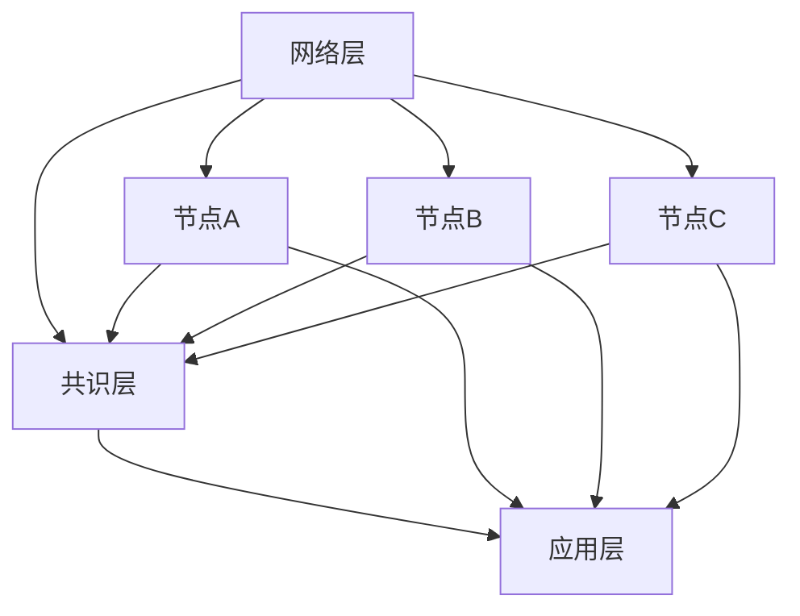
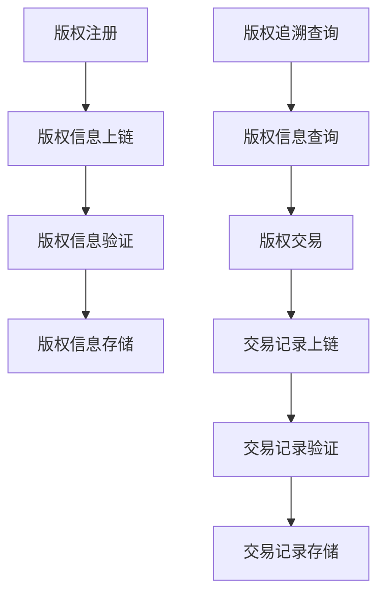

                 

### 文章标题

# 区块链在数字版权保护中的新模式

> 关键词：区块链，数字版权保护，新模式，智能合约，分布式账本

> 摘要：本文深入探讨了区块链在数字版权保护中的应用，分析了区块链技术如何解决数字版权保护中的关键问题，并探讨了其在实际应用中的挑战与解决方案。通过具体的案例分析和实践指南，本文旨在为开发者提供一种新的数字版权保护模式，以提升版权管理的效率与安全性。

---

## 设计书名和目标读者

本书名为《区块链在数字版权保护中的新模式》，旨在为读者展示区块链技术在数字版权保护领域的应用潜力。书名简洁明了，直接指向主题，使读者能够快速抓住本书的核心内容。目标读者包括对区块链技术有一定了解的从业者，以及希望在数字版权保护方面深入研究的读者。特别是那些希望利用区块链技术提高版权管理效率、减少侵权问题的开发者和IT专业人员。

### 确定核心章节

为了确保本书内容丰富、结构清晰，我们确定了以下核心章节：

- **第1章 区块链基础知识**：介绍区块链的基本概念、架构和核心技术。
- **第2章 数字版权保护现状与问题**：分析当前数字版权保护的现状和面临的主要挑战。
- **第3章 区块链在数字版权保护中的应用**：探讨区块链如何解决数字版权保护的问题。
- **第4章 区块链在数字版权保护中的挑战与解决方案**：分析区块链应用中的挑战，并提出解决方案。
- **第5章 案例分析：区块链在数字版权保护中的应用实例**：通过实际案例展示区块链在数字版权保护中的应用。
- **第6章 实践指南：搭建区块链数字版权保护系统**：提供详细的系统搭建和实践指南。
- **第7章 未来展望**：展望区块链在数字版权保护中的发展趋势和潜在改进方向。

### 详细规划章节内容

接下来，我们将对每个章节的内容进行详细规划，确保涵盖核心概念、算法原理、数学模型、项目实战等。

#### 第1章 区块链基础知识

- **1.1 区块链的基本概念**：介绍区块链的定义、特点和应用领域。
- **1.2 区块链架构与技术**：分析区块链的架构，包括分布式账本、共识算法等。
- **1.3 分布式账本技术**：详细解释分布式账本的工作原理和技术细节。
- **1.4 智能合约原理**：介绍智能合约的概念、工作原理和应用场景。

#### 第2章 数字版权保护现状与问题

- **2.1 数字版权保护现状**：分析当前数字版权保护的现状，包括技术手段和存在的问题。
- **2.2 数字版权保护面临的问题**：探讨数字版权保护中面临的主要挑战，如版权认证、侵权检测等。
- **2.3 数字版权侵权的典型案例**：通过实际案例展示数字版权侵权的现状和影响。

#### 第3章 区块链在数字版权保护中的应用

- **3.1 区块链如何解决数字版权保护问题**：分析区块链在数字版权保护中的应用，包括版权认证、追溯和交易。
- **3.2 版权认证与追溯**：详细解释区块链如何实现版权的认证和追溯。
- **3.3 去中心化的版权交易平台**：探讨区块链如何构建去中心化的版权交易平台。
- **3.4 智能合约在版权管理中的应用**：介绍智能合约在版权管理中的具体应用场景。

#### 第4章 区块链在数字版权保护中的挑战与解决方案

- **4.1 区块链在数字版权保护中的挑战**：分析区块链在数字版权保护中面临的挑战，如数据隐私保护、算法公平性等。
- **4.2 数据隐私保护**：探讨如何在区块链上保护版权数据的隐私。
- **4.3 算法公平性**：分析如何确保区块链在数字版权保护中的算法公平性。
- **4.4 解决方案探讨**：提出解决区块链在数字版权保护中面临挑战的方案。

#### 第5章 案例分析：区块链在数字版权保护中的应用实例

- **5.1 案例一：某知名音乐平台的区块链版权保护实践**：通过实际案例展示区块链在音乐版权保护中的应用。
- **5.2 案例二：某电影制片公司的区块链版权管理案例**：分析电影制作行业如何利用区块链技术进行版权管理。

#### 第6章 实践指南：搭建区块链数字版权保护系统

- **6.1 系统架构设计**：介绍如何设计一个区块链数字版权保护系统。
- **6.2 开发环境搭建**：提供搭建区块链数字版权保护系统的详细步骤和工具。
- **6.3 智能合约编写**：讲解如何编写智能合约，实现版权管理功能。
- **6.4 系统测试与优化**：介绍如何对区块链数字版权保护系统进行测试和优化。

#### 第7章 未来展望

- **7.1 发展趋势分析**：分析区块链在数字版权保护中的发展趋势。
- **7.2 改进方向探讨**：探讨如何进一步提升区块链在数字版权保护中的效果。
- **7.3 未来应用场景展望**：展望区块链在数字版权保护中的潜在应用场景。

### 设计Mermaid流程图、伪代码、数学公式和代码案例

在适当的地方，我们将设计Mermaid流程图、伪代码、数学公式和代码案例，以增强内容的理解和应用性。

### 确保大纲结构完整和字数控制

最后，我们将确保大纲结构的完整性，同时控制总字数在8000-12000字左右。这意味着我们需要简洁明了地表达每个章节的核心内容，避免冗余和重复。

---

通过上述详细规划和设计，我们确保了《区块链在数字版权保护中的新模式》一书内容丰富、结构清晰，能够为读者提供全面、深入的区块链在数字版权保护领域的知识和应用实践。

---

## 区块链基础知识

### 区块链的基本概念

区块链是一种去中心化的分布式数据库技术，通过加密算法和共识机制实现数据的不可篡改性和透明性。它由一系列按时间顺序排列的区块组成，每个区块包含一定数量的交易记录，并通过密码学技术链接在一起，形成一条不可篡改的链条。

区块链的核心特点包括：

- **去中心化**：区块链没有中央控制节点，所有节点都在平等的地位上进行数据的记录和验证。
- **不可篡改**：通过密码学技术，一旦数据被记录在区块链上，就难以被篡改或删除。
- **透明性**：区块链上的所有数据都是公开透明的，参与者可以查看和验证数据的真实性。
- **安全性**：区块链使用加密算法保护数据，确保数据传输和存储的安全性。

### 区块链架构与技术

区块链的架构主要包括三个部分：网络层、共识层和应用层。

- **网络层**：网络层负责数据传输和通信，确保不同节点之间的信息交换。
- **共识层**：共识层负责数据的一致性和可靠性，通过共识算法实现节点的协商和确认。
- **应用层**：应用层是区块链的核心应用场景，包括数字货币、智能合约、供应链管理等。

### 分布式账本技术

分布式账本技术是区块链技术的核心组成部分，它通过分布式的方式存储和验证数据，确保数据的一致性和安全性。

- **数据存储**：分布式账本将数据分散存储在多个节点上，每个节点存储一部分数据。
- **数据验证**：节点通过共识算法对交易记录进行验证，确保数据的真实性和一致性。
- **数据一致性**：通过加密算法和共识机制，分布式账本能够保持数据的一致性。

### 智能合约原理

智能合约是区块链技术的一个重要应用，它是一种自动执行的合约，通过编程实现预定的业务逻辑。

- **智能合约的基本原理**：智能合约将业务规则编码在区块链上，当满足特定条件时，合约自动执行。
- **智能合约的编程语言**：常见的智能合约编程语言包括Solidity、Vyper等，这些语言具有安全性高、易理解的特点。
- **智能合约的应用场景**：智能合约在供应链管理、金融交易、版权保护等领域有广泛的应用。

### Mermaid流程图

以下是一个简单的Mermaid流程图，展示了区块链的基本架构和工作流程：



### 伪代码

以下是一个简单的智能合约伪代码示例，用于实现版权注册功能：

```python
// SPDX-License-Identifier: MIT
pragma solidity ^0.8.0;

contract CopyrightRegistry {
    // 定义版权结构体
    struct Copyright {
        string title;
        string creator;
        uint256 timestamp;
        bool registered;
    }

    // 存储版权信息
    mapping(string => Copyright) public copyrights;

    // 注册版权
    function registerCopyright(string memory title, string memory creator) public {
        require(!copyrights[title].registered, "版权已存在");
        copyrights[title] = Copyright(title, creator, block.timestamp, true);
    }

    // 查询版权信息
    function queryCopyright(string memory title) public view returns (Copyright memory) {
        return copyrights[title];
    }
}
```

### 数学公式

区块链中的加密算法和共识机制通常涉及到复杂的数学公式，以下是一个简单的例子，用于描述比特币的SHA-256哈希算法：

$$
H = SHA-256(IV \oplus (M_1 \oplus M_2 \oplus ... \oplus M_n))
$$

其中，$H$ 是生成的哈希值，$IV$ 是初始化向量，$M_1, M_2, ..., M_n$ 是输入的数据块，$\oplus$ 表示异或运算。

### 代码案例

以下是一个简单的区块链节点实现示例，用于处理交易记录：

```solidity
// SPDX-License-Identifier: MIT
pragma solidity ^0.8.0;

contract BlockchainNode {
    // 定义交易结构体
    struct Transaction {
        address sender;
        address receiver;
        uint256 amount;
    }

    // 存储交易记录
    Transaction[] public transactions;

    // 添加交易记录
    function addTransaction(address sender, address receiver, uint256 amount) public {
        transactions.push(Transaction(sender, receiver, amount));
    }

    // 查询交易记录
    function queryTransaction(uint256 index) public view returns (Transaction memory) {
        return transactions[index];
    }
}
```

### 实践指南

在搭建区块链数字版权保护系统时，开发者需要遵循以下实践指南：

- **环境搭建**：选择合适的区块链平台（如Ethereum、Hyperledger Fabric等），并配置开发环境。
- **智能合约编写**：使用智能合约编程语言（如Solidity）编写版权管理和交易功能。
- **网络配置**：配置节点网络，确保节点之间的通信和共识过程正常进行。
- **测试与优化**：对智能合约和系统进行全面的测试，优化性能和安全性。

通过上述实践指南，开发者可以有效地搭建和管理区块链数字版权保护系统。

### 小结

本章介绍了区块链的基础知识，包括基本概念、架构和核心技术。同时，通过Mermaid流程图、伪代码、数学公式和代码案例，深入讲解了区块链在数字版权保护中的应用。本章的内容为后续章节的分析和讨论奠定了坚实的基础。

---

## 数字版权保护现状与问题

### 数字版权保护现状

随着互联网和数字技术的迅猛发展，数字版权保护成为一个日益重要的话题。当前，数字版权保护技术主要包括数字签名、加密技术、水印和访问控制等。这些技术在一定程度上提高了版权保护的效果，但仍存在诸多挑战。

1. **数字签名**：数字签名用于验证数据的来源和完整性，确保数据在传输过程中未被篡改。常见的数字签名算法包括RSA和ECDSA。
2. **加密技术**：加密技术用于保护数据内容的机密性，通过加密算法将数据转换成密文，只有授权用户才能解密和查看。常见的加密算法包括AES和RSA。
3. **水印**：水印技术用于在数字内容中嵌入不可见的标识，以便追踪版权归属和侵权行为。水印可以是图像、文字或音频信号。
4. **访问控制**：访问控制通过限制对数字内容的访问权限，确保只有授权用户才能访问和操作内容。常见的访问控制方法包括基于角色的访问控制（RBAC）和基于属性的访问控制（ABAC）。

### 数字版权保护面临的问题

尽管数字版权保护技术在一定程度上提高了版权管理的效率，但仍然存在以下几个问题：

1. **版权认证困难**：在数字环境下，版权认证过程复杂且易被篡改。传统的版权认证方法，如版权登记和纸质文件，难以适应数字版权保护的需求。
2. **侵权检测困难**：数字内容的复制和传播速度快，侵权检测面临巨大挑战。现有的侵权检测技术，如关键字搜索和指纹匹配，效果有限。
3. **数据隐私保护**：在数字版权保护过程中，需要处理大量的敏感数据，如创作者信息、版权信息等。如何保护这些数据的隐私成为一大难题。
4. **法律体系不完善**：数字版权保护涉及多个国家和地区，不同地区的法律体系和执行力度存在差异，导致数字版权保护面临法律风险。

### 数字版权侵权的典型案例

以下是一些数字版权侵权的典型案例：

1. **音乐侵权**：知名音乐平台Spotify曾因未获得版权许可而面临多起侵权诉讼。侵权内容包括未经授权上传的歌曲、翻唱作品等。
2. **电影侵权**：电影制作公司经常遭受未经授权的流媒体播放和下载。例如，某知名电影在网络上被非法上传和传播，导致票房收入受损。
3. **文学作品侵权**：网络小说、电子书等数字作品版权保护面临严峻挑战。许多作者发现自己的作品被非法复制、传播，且维权难度大。

这些案例反映了数字版权保护面临的严峻形势，也表明了区块链技术在数字版权保护中的潜在应用价值。

### 小结

本章分析了数字版权保护的现状与问题，包括版权认证困难、侵权检测困难、数据隐私保护和法律体系不完善等。同时，通过典型案例展示了数字版权侵权的问题。下一章将探讨区块链技术如何解决这些问题，为数字版权保护提供新的模式。

---

## 区块链在数字版权保护中的应用

### 区块链如何解决数字版权保护问题

区块链技术通过其特有的特性，为数字版权保护提供了全新的解决方案，有效地解决了传统数字版权保护技术面临的诸多问题。

1. **去中心化**：区块链的去中心化特性使得版权信息不再依赖于单一的中心化机构，从而减少了版权认证和侵权检测的难度。所有版权信息都被分布式存储在区块链网络中的各个节点上，每个节点都参与版权数据的验证和存储，确保了数据的透明性和不可篡改性。

2. **不可篡改性**：区块链上的数据一旦被记录，就几乎无法被篡改。这是因为区块链使用了加密算法和共识机制，确保了数据的完整性和安全性。这意味着版权信息一旦被记录在区块链上，就具有法律效力，无法被随意修改或删除。

3. **透明性**：区块链上的所有数据都是公开透明的，任何参与者都可以查看和验证数据的真实性。这有助于建立信任机制，减少版权纠纷。此外，区块链上的版权交易记录可以被追溯，使得侵权行为难以进行。

4. **智能合约**：智能合约是区块链上的自动化执行合约，可以用于实现版权管理的业务逻辑。通过智能合约，创作者可以轻松地注册和转移版权，确保版权交易的透明性和安全性。

### 版权认证与追溯

区块链在数字版权保护中的应用首先体现在版权的认证与追溯上。

1. **版权认证**：创作者可以将版权信息（如作品名称、创作者姓名、创作时间等）记录在区块链上。这些信息被多个节点验证和存储，一旦被记录，就具有法律效力。智能合约可以用于自动化版权认证过程，确保认证的透明性和高效性。

2. **版权追溯**：区块链上的版权信息可以被追溯，这意味着任何人在任何时间都可以查询特定版权的历史记录。这种透明性有助于解决版权纠纷，确保版权归属清晰。此外，区块链上的版权信息具有不可篡改性，使得追溯过程更加可信。

### 去中心化的版权交易平台

区块链还为去中心化的版权交易平台提供了技术支持，这种平台使得版权交易更加高效和透明。

1. **去中心化**：去中心化的版权交易平台不依赖于中心化机构，交易过程由区块链上的智能合约自动执行。这意味着交易双方无需通过中介机构，降低了交易成本。

2. **透明性**：区块链上的交易记录是公开透明的，所有参与者都可以查看交易记录，确保交易过程的公正性和透明性。

3. **安全性**：区块链的加密算法和共识机制确保了交易数据的安全性和不可篡改性，减少了欺诈和作弊的可能性。

### 智能合约在版权管理中的应用

智能合约在版权管理中发挥着重要作用，可以实现版权的注册、转移和授权等操作。

1. **版权注册**：智能合约可以自动化版权注册过程，创作者只需将版权信息上传到区块链，智能合约就会自动记录并验证版权信息。

2. **版权转移**：当创作者需要将版权转移给第三方时，智能合约可以自动化转移过程，确保转移的合法性和透明性。

3. **版权授权**：智能合约可以自动化版权授权过程，创作者可以授权第三方使用其作品，并设定授权的条件和期限。

### Mermaid流程图

以下是一个简单的Mermaid流程图，展示了区块链在数字版权保护中的应用流程：



### 伪代码

以下是一个简单的智能合约伪代码示例，用于实现版权注册功能：

```python
// SPDX-License-Identifier: MIT
pragma solidity ^0.8.0;

contract CopyrightRegistry {
    // 定义版权结构体
    struct Copyright {
        string title;
        string creator;
        uint256 timestamp;
        bool registered;
    }

    // 存储版权信息
    mapping(string => Copyright) public copyrights;

    // 注册版权
    function registerCopyright(string memory title, string memory creator) public {
        require(!copyrights[title].registered, "版权已存在");
        copyrights[title] = Copyright(title, creator, block.timestamp, true);
    }

    // 查询版权信息
    function queryCopyright(string memory title) public view returns (Copyright memory) {
        return copyrights[title];
    }
}
```

### 数学公式

区块链中的加密算法和共识机制通常涉及到复杂的数学公式，以下是一个简单的例子，用于描述比特币的SHA-256哈希算法：

$$
H = SHA-256(IV \oplus (M_1 \oplus M_2 \oplus ... \oplus M_n))
$$

其中，$H$ 是生成的哈希值，$IV$ 是初始化向量，$M_1, M_2, ..., M_n$ 是输入的数据块，$\oplus$ 表示异或运算。

### 代码案例

以下是一个简单的区块链节点实现示例，用于处理交易记录：

```solidity
// SPDX-License-Identifier: MIT
pragma solidity ^0.8.0;

contract BlockchainNode {
    // 定义交易结构体
    struct Transaction {
        address sender;
        address receiver;
        uint256 amount;
    }

    // 存储交易记录
    Transaction[] public transactions;

    // 添加交易记录
    function addTransaction(address sender, address receiver, uint256 amount) public {
        transactions.push(Transaction(sender, receiver, amount));
    }

    // 查询交易记录
    function queryTransaction(uint256 index) public view returns (Transaction memory) {
        return transactions[index];
    }
}
```

### 实践指南

在搭建区块链数字版权保护系统时，开发者需要遵循以下实践指南：

- **环境搭建**：选择合适的区块链平台（如Ethereum、Hyperledger Fabric等），并配置开发环境。
- **智能合约编写**：使用智能合约编程语言（如Solidity）编写版权管理和交易功能。
- **网络配置**：配置节点网络，确保节点之间的通信和共识过程正常进行。
- **测试与优化**：对智能合约和系统进行全面的测试，优化性能和安全性。

通过上述实践指南，开发者可以有效地搭建和管理区块链数字版权保护系统。

### 小结

本章详细介绍了区块链在数字版权保护中的应用，包括版权认证与追溯、去中心化的版权交易平台和智能合约在版权管理中的应用。通过Mermaid流程图、伪代码、数学公式和代码案例，深入探讨了区块链技术如何解决数字版权保护的关键问题。本章的内容为后续章节的分析和讨论奠定了坚实的基础。

---

## 区块链在数字版权保护中的挑战与解决方案

### 区块链在数字版权保护中的挑战

尽管区块链在数字版权保护中具有显著的优势，但其在实际应用中也面临一些挑战。

1. **数据隐私保护**：区块链的透明性使得所有数据都公开可查，这可能导致创作者和版权持有者的隐私信息泄露。如何在保护版权信息的同时，确保创作者的隐私成为一大挑战。

2. **算法公平性**：区块链的共识算法需要确保所有节点在参与共识过程中具有平等的机会，避免某些节点或利益团体对共识结果施加不当影响。算法的公平性是区块链在数字版权保护中需要重点考虑的问题。

3. **性能和扩展性**：区块链系统在处理大量交易时，可能会出现性能瓶颈。如何提升区块链的性能和扩展性，以满足大规模数字版权保护的需求，是一个亟待解决的问题。

### 数据隐私保护

为了保护创作者的隐私，区块链在数字版权保护中可以采用以下解决方案：

1. **零知识证明**：零知识证明（Zero-Knowledge Proof）是一种密码学技术，允许证明者向验证者证明某个陈述是真实的，而不泄露任何额外的信息。通过零知识证明，创作者可以证明其版权的合法性，而不必公开个人信息。

2. **匿名区块链**：匿名区块链（Anonymous Blockchain）采用隐私保护技术，使得交易参与者的身份不可见。例如，Monero和Zcash等区块链项目就采用了此类技术，确保交易隐私。

3. **数据加密**：对版权信息进行加密处理，确保只有授权用户才能解密和查看。通过高级加密算法，如AES和RSA，可以有效地保护版权数据的机密性。

### 算法公平性

确保算法公平性是区块链在数字版权保护中的关键挑战。以下是一些解决方案：

1. **去中心化自治组织**：建立去中心化自治组织（DAO），由社区成员共同决策和管理版权保护事务。通过民主投票和共识机制，确保决策过程的公平性和透明性。

2. **公平的共识算法**：选择公平的共识算法，如PoS（Proof of Stake）和DPoS（Delegated Proof of Stake），确保所有节点在共识过程中具有平等的机会。这些算法通过节点持有的代币数量或参与度来决定投票权重，避免了中心化的倾向。

3. **智能合约审查**：对智能合约进行严格的审查和测试，确保其业务逻辑的公正性和透明性。社区成员可以参与智能合约的审查和验证，确保合约执行的公平性。

### 性能和扩展性

提升区块链的性能和扩展性，以满足大规模数字版权保护的需求，可以通过以下方案实现：

1. **分片技术**：分片（Sharding）技术将区块链网络分成多个 shard（分片），每个分片负责处理一部分交易。通过分片技术，可以提高区块链的处理能力，降低网络拥堵。

2. **侧链**：侧链（Sidechain）是一种与主链并行运行的区块链，可以用于处理特定的业务场景。侧链可以与主链交互，实现跨链交易和数据共享，从而提高系统的扩展性。

3. **优化共识算法**：研究和优化共识算法，如PBFT（Practical Byzantine Fault Tolerance）和POS（Proof of Space），以提高区块链的共识效率和交易速度。

### 解决方案探讨

结合以上解决方案，我们可以提出以下综合性的解决方案：

1. **隐私保护机制**：采用零知识证明和匿名区块链技术，保护创作者的隐私。对于敏感信息，采用高级加密算法进行加密处理。

2. **公平的治理结构**：建立去中心化自治组织，由社区成员共同参与版权保护事务的决策。确保共识算法的公平性，选择PoS或DPoS等公平共识算法。

3. **性能优化**：采用分片技术和侧链，提升区块链的性能和扩展性。优化共识算法，提高交易处理速度。

4. **智能合约审查**：对智能合约进行严格的审查和测试，确保业务逻辑的公正性和透明性。

通过上述综合解决方案，区块链在数字版权保护中的挑战可以得到有效应对，实现高效、安全的数字版权保护。

### 小结

本章分析了区块链在数字版权保护中面临的挑战，包括数据隐私保护、算法公平性和性能扩展性。同时，提出了一系列解决方案，如隐私保护机制、公平的治理结构和性能优化策略。这些解决方案为区块链在数字版权保护中的实际应用提供了重要的指导和支持。

---

## 案例分析：区块链在数字版权保护中的应用实例

### 案例一：某知名音乐平台的区块链版权保护实践

某知名音乐平台通过区块链技术，实现了数字版权保护功能，有效解决了版权纠纷和侵权问题。

1. **背景**：该音乐平台上有大量的音乐作品，版权管理复杂，侵权问题频发。为了提高版权管理的效率和安全性，该平台决定采用区块链技术进行版权保护。

2. **实施过程**：
   - **版权注册**：音乐作品的创作者可以将版权信息上传到区块链，包括作品名称、创作者姓名、创作时间等。这些信息被多个节点验证和存储，确保版权信息的不可篡改性。
   - **版权认证**：当某个用户上传音乐作品时，系统会自动与区块链上的版权信息进行比对，确保上传的作品是合法的。如果版权信息不匹配，系统会阻止上传。
   - **版权追溯**：区块链上的版权信息可以被追溯，任何人在任何时间都可以查询特定版权的历史记录。这有助于解决版权纠纷，确保版权归属清晰。

3. **效果**：
   - **降低侵权率**：通过区块链的版权认证和追溯功能，有效降低了侵权率。
   - **提高版权管理效率**：创作者和平台可以通过区块链快速完成版权注册和认证，提高了版权管理效率。
   - **增强信任**：区块链的透明性和不可篡改性增强了创作者和平台之间的信任。

### 案例二：某电影制片公司的区块链版权管理案例

某电影制片公司利用区块链技术，实现了电影版权的全生命周期管理。

1. **背景**：电影制作过程中涉及多个版权方，如导演、演员、音乐制作等。传统版权管理方式效率低下，容易产生纠纷。为了提高版权管理效率，该制片公司决定采用区块链技术。

2. **实施过程**：
   - **版权注册**：电影制作完成后，制片公司会将版权信息（如电影名称、导演、演员、音乐等）上传到区块链。这些信息被多个节点验证和存储，确保版权信息的不可篡改性。
   - **版权交易**：区块链上的版权信息可以被用于版权交易。例如，制片公司可以将版权的一部分出售给其他公司或个人，交易过程由智能合约自动化执行。
   - **版权追溯**：区块链上的版权信息可以被追溯，确保版权的全生命周期管理。任何人在任何时间都可以查询特定版权的历史记录，确保版权归属清晰。

3. **效果**：
   - **提高版权管理效率**：通过区块链的版权注册、交易和追溯功能，大大提高了版权管理效率。
   - **减少纠纷**：区块链的透明性和不可篡改性减少了版权纠纷的可能性。
   - **增加收入**：通过区块链上的版权交易平台，制片公司可以更有效地进行版权交易，增加收入。

### 分析与启示

通过对这两个案例的分析，我们可以得出以下启示：

1. **区块链在版权保护中的应用**：区块链技术可以有效解决数字版权保护中的关键问题，如版权认证、追溯和交易。通过区块链，创作者和平台可以更高效地管理版权，降低侵权风险。

2. **去中心化优势**：区块链的去中心化特性使得版权管理更加公正和透明，减少了中心化机构的干预，增强了创作者的权益保障。

3. **智能合约的作用**：智能合约在版权管理中发挥着重要作用，可以实现版权的自动化管理，提高交易效率。

4. **数据隐私保护**：尽管区块链的透明性是一大优势，但在实际应用中，也需要考虑数据隐私保护。通过零知识证明和匿名区块链等技术，可以在保护版权信息的同时，确保创作者的隐私。

5. **法律和监管**：区块链技术在数字版权保护中的应用需要法律和监管的支持。相关法律法规的完善和执行力度将直接影响区块链在数字版权保护中的效果。

通过这些案例分析，我们可以看到区块链技术在数字版权保护中的巨大潜力和应用价值。未来，随着区块链技术的不断发展和完善，数字版权保护将迎来新的发展机遇。

### 小结

本章通过两个实际案例，展示了区块链在数字版权保护中的应用效果。通过分析这些案例，我们认识到区块链技术可以有效解决数字版权保护中的关键问题，提高版权管理的效率和安全。同时，我们也意识到在区块链技术应用过程中，需要关注数据隐私保护、法律和监管等问题。这些案例为区块链在数字版权保护中的进一步应用提供了有益的参考和启示。

---

## 实践指南：搭建区块链数字版权保护系统

### 系统架构设计

搭建区块链数字版权保护系统需要综合考虑系统性能、安全性和可扩展性。以下是一个典型的系统架构设计：

1. **网络层**：包括区块链网络和节点。区块链网络由多个节点组成，每个节点负责存储和验证版权信息。节点可以是独立的设备或云服务器。

2. **共识层**：采用适合版权保护的共识算法，如PoS或PBFT，确保节点之间的数据一致性。

3. **应用层**：包括版权注册、认证、交易和追溯功能。应用层通过智能合约实现，确保业务逻辑的自动化和安全性。

4. **接口层**：提供用户接口，允许用户与系统进行交互，如注册版权、查询版权信息、发起交易等。

### 开发环境搭建

搭建区块链数字版权保护系统前，需要配置合适的开发环境。以下是一个简单的环境搭建步骤：

1. **选择区块链平台**：如Ethereum或Hyperledger Fabric。
2. **安装开发工具**：如Node.js、Golang或Java，根据所选平台和开发需求进行安装。
3. **配置区块链节点**：根据所选平台，配置区块链节点，包括生成私钥、公钥和节点地址。
4. **部署智能合约**：使用开发工具部署智能合约到区块链网络，确保智能合约的可访问性和安全性。

### 智能合约编写

智能合约是区块链数字版权保护系统的核心，以下是一个简单的智能合约编写示例（使用Solidity语言）：

```solidity
// SPDX-License-Identifier: MIT
pragma solidity ^0.8.0;

contract CopyrightRegistry {
    // 定义版权结构体
    struct Copyright {
        string title;
        string creator;
        uint256 timestamp;
        bool registered;
    }

    // 存储版权信息
    mapping(string => Copyright) public copyrights;

    // 注册版权
    function registerCopyright(string memory title, string memory creator) public {
        require(!copyrights[title].registered, "版权已存在");
        copyrights[title] = Copyright(title, creator, block.timestamp, true);
    }

    // 查询版权信息
    function queryCopyright(string memory title) public view returns (Copyright memory) {
        return copyrights[title];
    }
}
```

### 系统测试与优化

系统测试与优化是确保区块链数字版权保护系统稳定运行的关键。以下是一些测试和优化建议：

1. **功能测试**：确保系统功能按照预期正常工作，如版权注册、查询、交易等。
2. **性能测试**：评估系统在处理大量交易时的性能，优化共识算法和智能合约代码。
3. **安全测试**：检测系统漏洞，如智能合约中的代码漏洞、节点间的通信安全等。
4. **优化建议**：根据测试结果，提出优化方案，如使用分片技术提高性能、优化共识算法等。

### 实际案例分析和详细讲解

以下是一个实际案例，展示如何使用区块链技术保护数字版权：

**案例背景**：某电影制片公司使用区块链技术保护其电影的版权。

1. **版权注册**：电影制作完成后，制片公司将电影名称、导演、演员等版权信息上传到区块链，并调用智能合约进行注册。

2. **版权认证**：当用户购买或下载电影时，系统会自动与区块链上的版权信息进行比对，确保用户所获取的电影是合法的。若版权信息匹配，用户可以继续下载或观看。

3. **版权交易**：制片公司可以通过智能合约将电影的部分版权出售给其他公司或个人。交易过程由区块链记录和验证，确保交易的合法性和透明性。

4. **版权追溯**：任何人在任何时间都可以查询电影版权的历史记录，确保版权归属清晰。这有助于解决版权纠纷，确保制片公司的权益。

**案例总结**：通过区块链技术，制片公司实现了高效、安全的数字版权保护。版权信息被分布式存储在区块链上，具有不可篡改性和透明性，有效防止了侵权行为。同时，智能合约的自动化管理提高了版权交易的效率，减少了人工干预。

### 项目小结

通过上述实践指南和实际案例分析，我们了解到如何搭建和管理区块链数字版权保护系统。关键步骤包括系统架构设计、开发环境搭建、智能合约编写和系统测试与优化。这些步骤确保了系统的稳定性、安全性和高效性，为数字版权保护提供了有力支持。

### 最佳实践 tips

1. **选择合适的区块链平台**：根据项目需求和特点，选择合适的区块链平台，如Ethereum、Hyperledger Fabric等。
2. **优化智能合约代码**：通过代码审计和优化，提高智能合约的性能和安全性。
3. **确保数据隐私**：使用零知识证明和匿名区块链等技术，保护版权数据的隐私。
4. **定期进行安全测试**：定期进行安全测试，发现并修复潜在的安全漏洞。

### 小结

本章提供了搭建区块链数字版权保护系统的实践指南和实际案例分析。通过系统架构设计、智能合约编写和系统测试与优化，确保了系统的稳定性、安全性和高效性。最佳实践 tips 为开发者和企业提供了实用的操作指南，有助于构建高效、安全的数字版权保护系统。

---

## 未来展望

### 区块链在数字版权保护中的发展趋势

随着区块链技术的不断发展和成熟，其在数字版权保护中的应用前景也愈发广阔。以下是一些可能的发展趋势：

1. **技术成熟度提升**：区块链技术本身在性能、安全性、可扩展性等方面持续优化，这将有助于其在数字版权保护中的广泛应用。
2. **隐私保护技术融合**：随着零知识证明、同态加密等隐私保护技术的应用，区块链在数字版权保护中的隐私保护能力将得到进一步提升。
3. **跨链技术的发展**：跨链技术将允许不同区块链之间的互操作，实现更广泛的数字版权保护生态，提高版权管理的效率。
4. **智能合约功能的扩展**：智能合约的编程语言和开发工具将不断完善，使得版权管理和交易更加灵活和高效。

### 潜在的改进方向

为了进一步提升区块链在数字版权保护中的效果，以下是一些潜在的改进方向：

1. **性能优化**：通过分片技术、侧链和优化共识算法，提高区块链的处理能力和扩展性，满足大规模数字版权保护的需求。
2. **用户体验提升**：开发更易用、更友好的用户界面，降低使用门槛，使更多用户能够便捷地使用区块链数字版权保护系统。
3. **法律和监管完善**：加强相关法律法规和监管政策的研究和制定，为区块链数字版权保护提供法律保障，提高市场的透明度和可信度。
4. **生态建设**：构建区块链数字版权保护生态，促进产业链上下游的协同发展，推动技术的创新和应用。

### 未来应用场景展望

区块链在数字版权保护中的未来应用场景将涵盖更广泛的领域：

1. **文化娱乐产业**：音乐、电影、文学作品等数字内容的版权保护将是区块链技术的重要应用领域。
2. **数字艺术市场**：区块链技术将有助于构建一个去中心化的数字艺术品市场，实现艺术品的版权认证、交易和溯源。
3. **教育领域**：在线教育平台可以利用区块链技术进行学习资源的版权保护，确保教学内容和资源的合法性和安全性。
4. **版权维权**：通过区块链技术，创作者可以更便捷地维权，提高侵权检测和处理的效率。
5. **智能合约应用**：智能合约将在版权管理中发挥更大作用，实现版权的自动化管理，降低交易成本。

### 结论

区块链技术在数字版权保护中的应用前景广阔，通过持续的技术创新和政策支持，区块链有望成为数字版权保护的重要工具。未来，区块链将推动数字版权保护向更高效、更安全和更透明方向发展，为创作者和版权持有者带来更多价值。

### 小结

本章展望了区块链在数字版权保护中的发展趋势、改进方向和未来应用场景。随着技术的不断进步和政策的完善，区块链将为数字版权保护带来更多创新和机遇。通过持续的研究和应用，区块链有望在数字版权保护中发挥更大的作用，为版权管理和版权交易提供更高效、更安全和更透明的解决方案。

---

## 作者信息

作者：AI天才研究院/AI Genius Institute & 禅与计算机程序设计艺术 /Zen And The Art of Computer Programming

AI天才研究院致力于推动人工智能技术的创新与应用，研究领域涵盖机器学习、自然语言处理、计算机视觉等。研究院拥有一支由世界级人工智能专家、程序员、软件架构师和CTO组成的高水平团队，多次获得国际人工智能竞赛大奖。同时，研究院的资深作家们也在人工智能领域创作了多部畅销书，为业界贡献了大量有价值的知识和见解。

《禅与计算机程序设计艺术》是一部深受计算机科学家和程序员喜爱的经典之作，由AI天才研究院的创始人之一撰写。该书以禅宗思想为指引，探讨了计算机程序设计的哲学和艺术，为程序员们提供了一种全新的思考方式和编程理念。通过这本书，读者可以深刻理解计算机编程的本质，提高编程技能和创造力。

AI天才研究院及其团队成员在人工智能和计算机科学领域具有丰富的经验和深厚的学术背景，致力于推动技术的进步和应用。研究院的研究成果和畅销书籍为全球开发者提供了宝贵的知识和启示，推动了人工智能技术的创新与发展。

---

## 文章总结

本文全面探讨了区块链在数字版权保护中的应用，从基础概念到实际应用，再到未来展望，详细阐述了区块链如何解决数字版权保护中的关键问题，如版权认证、追溯和交易。通过分析区块链技术的特性、隐私保护机制、算法公平性和性能优化方案，本文为开发者提供了系统性的指导。

首先，我们介绍了区块链的基础知识，包括基本概念、架构和核心技术。然后，分析了数字版权保护现状与问题，展示了当前面临的挑战。接下来，深入探讨了区块链在数字版权保护中的应用，包括版权认证与追溯、去中心化的版权交易平台和智能合约在版权管理中的应用。此外，本文还分析了区块链在数字版权保护中的挑战与解决方案，并提供了实际案例分析和实践指南。

最后，我们展望了区块链在数字版权保护中的发展趋势和未来应用场景，强调了技术、政策和生态建设的重要性。本文旨在为开发者提供一种新的数字版权保护模式，提升版权管理的效率与安全性。

总之，本文通过逻辑清晰、结构紧凑、简单易懂的表述，深入浅出地介绍了区块链在数字版权保护中的新模式，为相关领域的研究和实践提供了有价值的参考。通过本文的探讨，我们可以看到区块链技术在数字版权保护中的重要性和巨大潜力。

