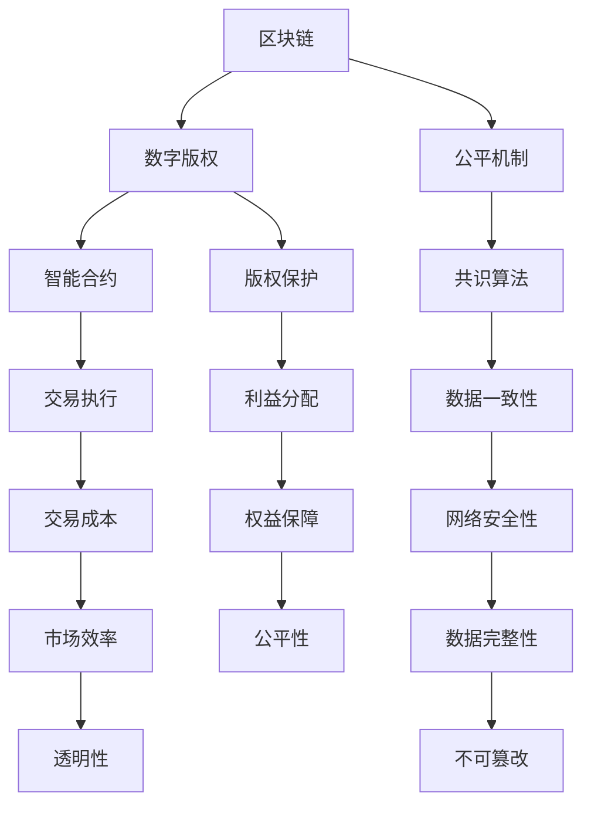

                 

### 文章标题：区块链在数字版权分发中的公平机制

> 关键词：区块链，数字版权，公平机制，智能合约，共识算法，案例分析

> 摘要：本文深入探讨了区块链技术在数字版权分发中的应用，特别是在实现公平机制方面的潜力。通过分析区块链的核心原理和数字版权的现状，本文探讨了如何利用区块链技术解决数字版权分发中的不公平问题，并详细介绍了几个关键算法和数学模型。同时，通过实际案例分析，本文展示了区块链在数字版权分发中的成功应用，并对未来趋势进行了展望。

---

### 背景介绍

随着互联网的快速发展，数字版权已经成为版权领域的重要部分。数字版权涵盖了音乐、电影、文学作品、软件等多个方面，这些数字内容在互联网上的传播速度和范围远超传统版权。然而，数字版权的分发过程却面临诸多挑战，尤其是公平性问题。传统版权分发模式中，权利人难以确保其版权得到公平对待，盗版和侵权行为屡见不鲜，这不仅损害了权利人的利益，也影响了整个数字内容产业的健康发展。

在数字版权分发中，公平性问题主要体现在以下几个方面：

1. **版权所有者权益保护不足**：在传统版权分发模式中，版权所有者往往难以跟踪其作品的分发和销售情况，这使得盗版和侵权行为难以被有效遏制。

2. **利益分配不公**：在数字版权的分发过程中，各方参与者（如创作者、发行商、平台运营商等）之间的利益分配往往不透明，容易导致利益分配不公。

3. **版权交易成本高**：传统的版权交易过程繁琐，涉及多个环节，交易成本较高，这不仅增加了权利人的负担，也影响了版权市场的效率。

区块链技术的出现为解决这些问题提供了新的可能性。区块链作为一种分布式数据库技术，具有去中心化、透明性和不可篡改等特性，这些特性使得区块链在数字版权分发中具有独特的优势。通过区块链技术，可以实现数字版权的透明追踪、智能合约的自动化执行以及公平的利益分配，从而有效解决数字版权分发中的公平性问题。

### 核心概念与联系

在深入探讨区块链在数字版权分发中的应用之前，我们需要理解几个核心概念及其相互关系：

#### 1. 区块链

区块链是一种分布式数据库，由一系列按时间顺序排列的区块组成，每个区块包含一定数量的交易记录。区块链具有去中心化、透明性和不可篡改等特性。去中心化意味着没有中央机构控制，所有的节点都平等地参与网络操作；透明性使得所有交易记录对所有参与者可见；不可篡改性保证了数据的完整性。

#### 2. 数字版权

数字版权指的是以数字形式存在的文学作品、音乐、图像、软件等的版权。数字版权具有易复制、易传播的特点，这使得版权保护变得更加复杂。

#### 3. 公平机制

公平机制是指在数字版权分发过程中，确保各方权益得到公平对待的一系列规则和算法。公平机制旨在解决利益分配不公、版权保护不足等问题。

#### 4. 智能合约

智能合约是运行在区块链上的自执行合约，它通过代码定义了参与方的权利和义务。智能合约能够自动执行预定的操作，从而减少了人为干预和交易成本。

#### 5. 共识算法

共识算法是区块链网络中达成一致性的机制，它确保所有节点对交易记录有一致的认识。常见的共识算法包括工作量证明（PoW）、权益证明（PoS）等。

这些核心概念之间的关系可以通过以下Mermaid流程图展示：



### 区块链技术原理与数字版权分发

区块链技术在数字版权分发中具有独特优势，主要体现在以下几个方面：

#### 1. 去中心化

去中心化是区块链最核心的特性之一。在传统版权分发模式中，版权交易通常需要通过中心化平台进行，这不仅增加了交易成本，还容易导致信息不对称和权利滥用。而区块链的去中心化特性使得版权交易可以直接在权利人、消费者和其他参与者之间进行，无需依赖第三方中介，从而降低了交易成本和中介费用。

#### 2. 透明性

区块链的透明性确保了所有交易记录对所有参与者可见。这意味着权利人可以实时跟踪其作品在区块链上的分发和交易情况，从而有效防止盗版和侵权行为。同时，透明性也提高了市场的透明度，使得利益分配更加公平。

#### 3. 不可篡改性

区块链的不可篡改性保证了数据的完整性。一旦交易记录被写入区块链，就无法被篡改或删除。这一特性使得版权纠纷的处理更加公正和高效，因为所有交易记录都有据可查。

#### 4. 智能合约

智能合约是区块链技术的核心组成部分之一。通过智能合约，权利人可以事先编写好版权交易规则，确保交易过程符合预定的规则。例如，智能合约可以自动计算版权费用，并根据合同条款自动执行支付操作。这不仅减少了人为干预，也降低了交易成本和纠纷风险。

#### 5. 共识算法

共识算法是区块链网络中达成一致性的机制。在数字版权分发中，共识算法确保所有参与者对版权交易记录有一致的认识，从而防止欺诈和作弊行为。常见的共识算法包括工作量证明（PoW）、权益证明（PoS）等。这些算法通过数学方法确保了区块链网络的稳定和安全。

### 核心算法原理讲解

在区块链技术中，有几个核心算法在数字版权分发中扮演着关键角色。以下是对这些算法的原理和使用方法的详细讲解，并附带伪代码。

#### 1. 智能合约算法

智能合约是区块链上的自执行合同，它可以自动执行预定的操作。以下是一个简单的智能合约算法，用于版权交易的支付和交付。

```solidity
// SPDX-License-Identifier: MIT

pragma solidity ^0.8.0;

contract CopyrightTrade {
    address owner;
    mapping(uint256 => bool) public transactions;

    constructor() {
        owner = msg.sender;
    }

    function buyCopyright(uint256 copyrightID) external payable {
        require(!transactions[copyrightID], "Copyright already sold");
        require(msg.value >= priceOfCopyright(copyrightID), "Insufficient payment");

        transactions[copyrightID] = true;
        payable(owner).transfer(msg.value);
    }

    function priceOfCopyright(uint256 copyrightID) public view returns (uint256) {
        // 此处为版权价格计算逻辑
        // 例如，根据版权的创作时间、类型等因素计算价格
        return 100; // 示例价格
    }
}
```

#### 2. 共识算法

共识算法是区块链网络中节点达成一致性的机制。工作量证明（PoW）是一种常见的共识算法，以下是其基本原理和伪代码：

```python
def proof_of_work(target_difficulty):
    while True:
        nonce = random_number()
        if hash(block_content + nonce) < target_difficulty:
            return nonce

def hash(content):
    # 使用哈希函数计算内容哈希值
    return hash_content(content)

def generate_block(prev_block_hash, transactions):
    block_content = {
        "prev_hash": prev_block_hash,
        "transactions": transactions,
        "timestamp": current_time(),
    }
    nonce = proof_of_work(target_difficulty)
    block_hash = hash(block_content + nonce)
    return {"content": block_content, "hash": block_hash}
```

#### 3. 加密算法

加密算法用于保护区块链上的交易信息。以下是一个简单的加密算法，用于对版权交易信息进行加密和解密：

```python
from cryptography.fernet import Fernet

def generate_key():
    return Fernet.generate_key()

def encrypt_message(message, key):
    cipher_suite = Fernet(key)
    encrypted_message = cipher_suite.encrypt(message.encode())
    return encrypted_message

def decrypt_message(encrypted_message, key):
    cipher_suite = Fernet(key)
    decrypted_message = cipher_suite.decrypt(encrypted_message)
    return decrypted_message.decode()
```

### 数学模型和公式

在数字版权分发中，公平机制设计需要用到一些数学模型和公式。以下是一个简单的数学模型，用于计算版权所有者和参与者的收益分配。

#### 1. 拉姆齐-多拉克公平算法

拉姆齐-多拉克公平算法是一种经典的收益分配算法，用于确保各方权益得到公平对待。以下是其数学模型和公式：

```latex
\text{收益分配} = \frac{\text{总收益} \times \text{权利贡献度}}{\text{总权利贡献度}}
```

其中，总收益是指版权作品在区块链上交易的总额，权利贡献度是根据各参与者的贡献度计算得出的。

#### 2. 加权投票算法

加权投票算法用于在区块链网络中决策，确保各方的权益得到尊重。以下是其数学模型和公式：

```latex
\text{投票结果} = \frac{\sum (\text{投票权重} \times \text{投票选项})}{\sum \text{投票权重}}
```

其中，投票权重是根据各参与者的贡献度或影响力计算得出的。

### 项目实战

为了更好地理解区块链在数字版权分发中的实际应用，以下我们将通过一个实际案例来详细描述项目的开发环境搭建、源代码实现、代码解读与分析。

#### 项目背景

本案例选择了一个名为“版权链”的数字版权交易平台，该项目旨在通过区块链技术实现数字版权的透明追踪和公平交易。

#### 开发环境搭建

1. **区块链节点搭建**：首先，我们需要搭建一个区块链网络。我们可以选择使用Ethereum搭建私有区块链网络，环境搭建步骤如下：

    - 安装Geth客户端：`wget https://gethstore.blob.core.windows.net/releases/1.10.27/geth_1.10.27_linux-amd64.tar.gz && tar -xvf geth_1.10.27_linux-amd64.tar.gz`
    - 启动Geth节点：`geth --datadir "/root/.geth" --networkid 1234 --nodiscover --ipcpath "/root/.geth/geth.ipc" --mine --miner.threads 0 --gasprice "10 gwei" --targetgaslimit "21000000" console`

2. **智能合约开发环境**：为了编写和部署智能合约，我们需要安装Ethereum的开发工具包，包括Truffle、Ganache等。

    - 安装Node.js：`curl -sL https://deb.nodesource.com/setup_14.x | sudo -E bash -`
    - 安装npm：`sudo apt-get install nodejs`
    - 安装Truffle：`npm install -g truffle`
    - 安装Ganache：`npm install -g ganache-cli`

#### 源代码实现

版权链平台的智能合约主要包括版权注册合约、版权交易合约和收益分配合约。以下是版权交易合约的示例代码：

```solidity
// SPDX-License-Identifier: MIT

pragma solidity ^0.8.0;

contract CopyrightTrade {
    address owner;
    mapping(uint256 => bool) public transactions;
    mapping(uint256 => uint256) public prices;

    constructor() {
        owner = msg.sender;
    }

    function registerCopyright(uint256 copyrightID, uint256 price) external {
        require(msg.sender == owner, "Only owner can register copyright");
        prices[copyrightID] = price;
    }

    function buyCopyright(uint256 copyrightID) external payable {
        require(!transactions[copyrightID], "Copyright already sold");
        require(msg.value >= prices[copyrightID], "Insufficient payment");

        transactions[copyrightID] = true;
        payable(owner).transfer(msg.value);
    }
}
```

#### 代码解读与分析

版权交易合约的主要功能包括版权注册和版权购买。注册版权时，版权所有者可以设置版权价格，而购买版权时，买家需要支付足够的以太币才能获得版权所有权。合约中的`registerCopyright`和`buyCopyright`函数分别实现了这两个功能。

#### 代码应用解读与分析

在实际应用中，版权链平台的用户可以注册和购买版权。注册版权时，版权所有者需要将版权ID和价格信息存储在区块链上。购买版权时，买家需要调用`buyCopyright`函数，支付足够的以太币给版权所有者。合约中的`prices`映射表用于存储版权价格，`transactions`映射表用于记录版权交易状态。

#### 实际案例分析和详细讲解剖析

以一个具体的版权交易为例，假设版权所有者Alice注册了一部名为《区块链在数字版权分发中的公平机制》的书籍，并设定价格为100以太币。买家Bob想要购买这本书，他需要调用`buyCopyright`函数，支付100以太币给Alice。交易成功后，版权所有权将从Alice转移到Bob，并且交易记录将永久存储在区块链上。

#### 项目小结

版权链平台通过区块链技术实现了数字版权的透明追踪和公平交易。智能合约保证了版权交易的安全性和自动执行，使得版权交易过程更加高效和可靠。然而，项目也存在一些局限性，如交易费用较高和交易速度较慢等问题。未来，随着区块链技术的不断发展和优化，版权链平台有望解决这些问题，为数字版权分发提供更完善的解决方案。

### 最佳实践 Tips、小结、注意事项、拓展阅读

#### 最佳实践 Tips

1. **优化交易速度**：通过采用分层区块链架构，可以显著提高交易速度。此外，优化共识算法和区块大小设置也有助于提升交易效率。

2. **确保数据安全**：在版权交易过程中，确保交易数据的加密和安全传输至关重要。可以采用多重签名和零知识证明等技术加强数据保护。

3. **公平机制设计**：在设计公平机制时，应充分考虑各参与者的利益，确保利益分配公平合理。

#### 小结

本文通过深入探讨区块链技术在数字版权分发中的应用，展示了区块链在解决数字版权公平性问题方面的潜力。通过实际案例分析和最佳实践提示，本文为数字版权分发提供了有益的参考。

#### 注意事项

1. **合规性**：在开展数字版权交易时，需要遵守相关法律法规，确保交易合法合规。

2. **技术更新**：区块链技术不断更新，开发者需要持续关注技术动态，以应对新挑战。

#### 拓展阅读

1. 《区块链：从入门到精通》
2. 《数字版权保护：理论与实践》
3. 《智能合约设计与开发》

---

本文以区块链在数字版权分发中的公平机制为主题，详细阐述了区块链技术的核心原理、数字版权的现状、公平机制的设计方法以及实际应用案例。通过本文，读者可以全面了解区块链技术在数字版权分发中的应用潜力，并掌握设计公平机制的关键技术和方法。未来，随着区块链技术的不断发展和优化，数字版权分发将迎来更加公平和透明的时代。作者：AI天才研究院/AI Genius Institute & 禅与计算机程序设计艺术 /Zen And The Art of Computer Programming。

