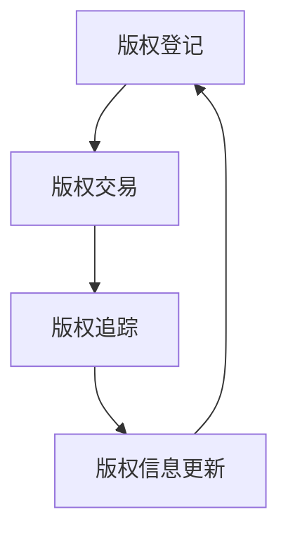

                 


## 文章标题

《区块链在数字版权分发中的去中心化应用》

## 关键词

区块链，数字版权，去中心化，智能合约，版权分发，应用案例

## 摘要

本文深入探讨了区块链技术在数字版权分发中的去中心化应用。首先，我们介绍了区块链的基本概念和数字版权分发的挑战。接着，我们详细分析了区块链技术的原理，包括工作原理、共识机制和智能合约。然后，我们探讨了区块链在数字版权分发中的具体应用，如版权登记、版权交易和版权追踪。此外，我们还介绍了开发一个区块链数字版权平台的步骤和技术栈。通过具体的案例研究和未来展望，我们展示了区块链在数字版权分发中的潜力和面临的挑战。最后，我们对全文进行了总结，并提出了未来发展的建议。

## 第一部分：区块链与数字版权分发概述

### 第1章：区块链技术基础

#### 1.1 区块链的基本概念

区块链是一种分布式数据库技术，其核心特点是去中心化和不可篡改。每个区块都包含一定数量的交易记录，通过密码学算法将区块与区块链的其他部分链接起来，形成一个连续的时间序列。这种结构使得区块链具有很强的安全性和可靠性。

区块链的分布式特性意味着数据存储在多个节点上，每个节点都保存一份完整的区块链副本。这种去中心化的架构使得区块链不受单一点故障的影响，提高了系统的容错性。

#### 1.2 数字版权分发的挑战

在传统的数字版权分发模式中，版权持有者通常依赖第三方机构进行版权登记和交易，这种模式存在以下问题：

1. **版权登记成本高**：传统版权登记需要提交大量文件和支付相关费用，流程繁琐且耗时。
2. **版权追踪困难**：在数字环境下，版权作品的复制和传播变得容易，版权追踪成为一个挑战。
3. **交易透明度低**：传统交易往往缺乏透明度，容易导致纠纷和版权侵权行为。

区块链技术的出现为解决这些问题提供了新的思路。去中心化的特点使得区块链能够提供低成本、高效透明的数字版权分发解决方案。

#### 1.3 区块链在数字版权分发中的应用

区块链在数字版权分发中的应用主要体现在以下几个方面：

1. **版权登记**：区块链可以提供一个安全的、不可篡改的版权登记平台，降低版权登记成本，提高登记效率。
2. **版权交易**：区块链上的智能合约可以实现自动化、透明化的版权交易，减少中介环节，降低交易成本。
3. **版权追踪**：区块链的不可篡改性和分布式特性使得版权追踪变得更加简单和可靠，有助于减少版权侵权行为。

### 第2章：数字版权分发中的区块链应用

#### 2.1 区块链在数字版权分发中的应用场景

区块链在数字版权分发中具有广泛的应用场景，主要包括版权登记、版权交易和版权追踪：

1. **版权登记**：版权持有者可以将版权信息记录在区块链上，确保版权信息的真实性和不可篡改性。
2. **版权交易**：基于区块链的智能合约可以实现自动化、透明化的版权交易，确保交易的合法性和透明度。
3. **版权追踪**：区块链的分布式特性使得版权追踪变得更加简单和可靠，有助于发现和防止版权侵权行为。

#### 2.2 去中心化版权分发模型

去中心化版权分发模型通过区块链技术实现了版权的分发和交易。该模型的核心在于去中心化的交易平台和智能合约：

1. **去中心化交易平台**：交易平台无需依赖中心化机构，所有交易记录都记录在区块链上，保证了交易的透明性和不可篡改性。
2. **智能合约**：智能合约用于自动化执行版权交易的条款和条件，确保交易的合法性和执行效率。

## 第二部分：区块链技术基础

### 第3章：区块链技术原理

#### 3.1 区块链的工作原理

区块链的工作原理可以概括为以下步骤：

1. **交易记录生成**：用户发起交易，交易记录包含交易内容、交易双方和交易金额等信息。
2. **区块生成**：交易记录被多个节点收集起来，形成一个区块。
3. **区块验证**：节点通过共识算法验证区块的有效性，确保区块内的交易记录是真实有效的。
4. **区块添加**：验证通过后，区块被添加到区块链上，成为区块链的一部分。

#### 3.2 区块链的共识机制

区块链的共识机制用于确保区块链的安全性和一致性。常见的共识机制包括：

1. **工作量证明（PoW）**：节点通过解决数学难题来获得记账权，数学难题的难度与网络难度相关。
2. **权益证明（PoS）**：节点根据持有的代币数量和持币时间来获得记账权，持有代币越多、持币时间越长，获得记账权的概率越大。

#### 3.3 智能合约

智能合约是一种自动执行合约条款的程序，其核心在于合约的自动化执行。智能合约的编写语言通常是基于区块链的编程语言，如Solidity。

### 第4章：区块链在数字版权分发中的去中心化应用

#### 4.1 版权登记

版权登记是将版权信息记录在区块链上的过程。版权持有者可以将版权信息提交给区块链，确保版权信息的真实性和不可篡改性。版权登记的过程如下：

1. **版权信息提交**：版权持有者将版权信息提交给区块链，包括作品名称、作者、版权期限等。
2. **信息验证**：区块链节点验证版权信息的真实性，确保版权信息的不可篡改性。
3. **信息存储**：验证通过后，版权信息被记录在区块链上，成为区块链的一部分。

#### 4.2 版权交易

版权交易是基于区块链的智能合约实现的。版权持有者可以在区块链上发布版权交易信息，其他用户可以参与交易。版权交易的过程如下：

1. **交易信息发布**：版权持有者发布版权交易信息，包括交易价格、交易期限等。
2. **交易双方协商**：交易双方通过区块链进行协商，达成一致。
3. **智能合约执行**：交易双方签署智能合约，智能合约自动执行交易条款，包括版权转移、交易款项支付等。

#### 4.3 版权追踪

版权追踪是确保版权信息在区块链上的一致性和可靠性。版权追踪的过程如下：

1. **版权信息更新**：版权持有者或版权交易双方可以将版权信息更新到区块链上。
2. **信息一致性验证**：区块链节点验证版权信息的更新，确保信息的一致性和不可篡改性。
3. **信息查询**：用户可以通过区块链查询版权信息，确保版权信息的真实性和可靠性。

## 第三部分：区块链数字版权平台开发

### 第5章：区块链数字版权平台开发基础

#### 5.1 前端技术栈

区块链数字版权平台的前端开发通常使用Web3.js库，这是一个JavaScript库，用于与区块链进行交互。前端技术栈包括：

1. **Web3.js**：用于与区块链进行交互，支持以太坊和其他基于以太坊的区块链。
2. **React或Vue.js**：用于构建用户界面，支持组件化开发，提高开发效率和代码可维护性。

#### 5.2 后端技术栈

区块链数字版权平台的后端开发通常使用Solidity编写智能合约，并使用Node.js或Python等编程语言进行服务端开发。后端技术栈包括：

1. **Solidity**：用于编写智能合约，支持以太坊区块链。
2. **Node.js或Python**：用于搭建服务端应用，提供API接口，处理前端请求。

#### 5.3 数据库选择

区块链数字版权平台的数据存储可以选择区块链数据库或其他类型的数据库。常见的数据库选择包括：

1. **区块链数据库**：用于存储区块链的完整副本，确保数据的不可篡改性和分布式特性。
2. **关系型数据库**：用于存储与版权相关的元数据，如版权信息、交易记录等。

### 第6章：区块链数字版权平台开发实战

#### 5.1 版权登记模块开发

版权登记模块是区块链数字版权平台的核心功能之一。开发步骤如下：

1. **设计版权登记接口**：设计版权登记的API接口，包括版权信息提交、信息验证和存储等。
2. **实现版权登记功能**：使用Web3.js库与区块链进行交互，实现版权登记功能。
3. **测试版权登记功能**：编写测试用例，对版权登记功能进行测试，确保其正确性和可靠性。

#### 5.2 版权交易模块开发

版权交易模块是基于智能合约实现的。开发步骤如下：

1. **设计版权交易接口**：设计版权交易的API接口，包括交易信息发布、协商和执行等。
2. **实现智能合约**：使用Solidity编写版权交易的智能合约，实现自动化、透明化的交易流程。
3. **测试版权交易功能**：编写测试用例，对版权交易功能进行测试，确保其正确性和可靠性。

#### 5.3 版权追踪模块开发

版权追踪模块是用于监控版权信息在区块链上的变化。开发步骤如下：

1. **设计版权追踪接口**：设计版权追踪的API接口，包括信息更新、一致性验证和查询等。
2. **实现版权追踪功能**：使用Web3.js库与区块链进行交互，实现版权追踪功能。
3. **测试版权追踪功能**：编写测试用例，对版权追踪功能进行测试，确保其正确性和可靠性。

## 第四部分：区块链数字版权分发应用案例研究

### 第7章：去中心化数字版权平台案例分析

#### 7.1 案例介绍

去中心化数字版权平台是一个基于区块链技术的平台，提供版权登记、版权交易和版权追踪等功能。该平台的主要功能包括：

1. **版权登记**：用户可以将版权信息记录在区块链上，确保版权信息的真实性和不可篡改性。
2. **版权交易**：用户可以在平台上发布版权交易信息，其他用户可以参与交易，智能合约自动执行交易流程。
3. **版权追踪**：用户可以通过平台查询版权信息，确保版权信息的透明性和可靠性。

#### 7.2 案例分析

去中心化数字版权平台的实现涉及多个技术模块，包括前端、后端和区块链。以下是该平台的关键技术实现细节：

1. **前端实现**：前端使用React框架，通过Web3.js库与区块链进行交互，实现版权登记、交易和追踪功能。
2. **后端实现**：后端使用Node.js框架，提供API接口，处理前端请求，并使用区块链数据库存储交易记录。
3. **区块链实现**：区块链使用以太坊，智能合约使用Solidity编写，实现版权登记、交易和追踪功能。

#### 7.3 业务模式分析

去中心化数字版权平台的业务模式包括以下方面：

1. **版权登记**：用户支付一定的费用，将版权信息记录在区块链上，确保版权信息的真实性和不可篡改性。
2. **版权交易**：用户可以在平台上发布版权交易信息，其他用户可以参与交易，交易费用由平台收取。
3. **版权追踪**：用户通过平台查询版权信息，确保版权信息的透明性和可靠性，平台提供相关服务。

### 第8章：区块链数字版权分发的挑战与未来

#### 8.1 技术挑战

区块链数字版权分发面临以下技术挑战：

1. **可扩展性**：区块链网络规模较大时，交易处理速度会受到影响，需优化区块链性能。
2. **安全性**：确保区块链网络和数据的安全性，防止黑客攻击和恶意行为。
3. **去中心化的有效性**：确保区块链网络中的节点分布合理，提高去中心化的有效性。

#### 8.2 法律挑战

区块链数字版权分发面临以下法律挑战：

1. **法律法规的适应**：需适应不同国家和地区的法律法规，确保平台合规运行。
2. **版权法与区块链的结合**：需探讨如何将版权法与区块链技术结合，解决版权纠纷等问题。

#### 8.3 未来发展趋势

区块链数字版权分发在未来将朝着以下方向发展：

1. **技术优化**：通过技术优化提高区块链性能和安全性，满足日益增长的需求。
2. **法律规范**：通过法律规范确保区块链数字版权分发的合规性，为行业发展提供法律保障。
3. **跨界合作**：与其他行业合作，探索区块链在数字版权分发中的更多应用场景。

## 第五部分：区块链数字版权分发的挑战与未来

### 第9章：区块链数字版权分发的挑战

#### 9.1 技术挑战

区块链数字版权分发面临以下技术挑战：

1. **可扩展性**：区块链网络规模较大时，交易处理速度会受到影响，需优化区块链性能。
   - **挑战**：随着用户数量的增加，区块链网络的交易处理能力会下降，导致交易延迟和拥堵。
   - **解决方案**：优化区块链协议，采用分片技术、状态通道等技术，提高区块链的可扩展性。

2. **安全性**：确保区块链网络和数据的安全性，防止黑客攻击和恶意行为。
   - **挑战**：区块链网络可能受到51%攻击、双花攻击等安全威胁，需提高区块链的安全性能。
   - **解决方案**：加强区块链网络的安全防护措施，采用多重签名、安全审计等技术，提高区块链的安全性。

3. **去中心化的有效性**：确保区块链网络中的节点分布合理，提高去中心化的有效性。
   - **挑战**：去中心化网络中可能存在恶意节点、节点不活跃等问题，影响区块链的去中心化程度。
   - **解决方案**：优化节点选择机制，鼓励节点积极参与网络，提高去中心化的有效性。

#### 9.2 法律挑战

区块链数字版权分发面临以下法律挑战：

1. **法律法规的适应**：需适应不同国家和地区的法律法规，确保平台合规运行。
   - **挑战**：不同国家和地区对数字版权分发的法律法规存在差异，可能导致平台在不同地区的运营困难。
   - **解决方案**：深入了解各国数字版权法律法规，制定相应的合规策略，确保平台在全球范围内的合规运行。

2. **版权法与区块链的结合**：需探讨如何将版权法与区块链技术结合，解决版权纠纷等问题。
   - **挑战**：版权法与区块链技术的结合可能引发法律争议，如区块链上的版权归属、侵权判断等。
   - **解决方案**：制定相关法律法规，明确区块链在数字版权分发中的应用规则，为区块链数字版权分发提供法律支持。

### 第10章：区块链数字版权分发的未来发展趋势

#### 10.1 技术优化

区块链数字版权分发在未来将朝着以下技术优化方向发展：

1. **性能提升**：通过优化区块链协议、引入新型共识算法等，提高区块链的性能，满足更多用户的需求。
   - **趋势**：采用新型共识算法，如权益证明（PoS）、实用拜占庭容错（PBFT）等，提高区块链的处理速度和吞吐量。

2. **安全性增强**：通过加强网络安全防护措施、提高区块链数据的可靠性，提高区块链的安全性。
   - **趋势**：引入零知识证明、同态加密等技术，提高区块链数据的隐私性和安全性。

3. **可扩展性优化**：通过引入分片技术、状态通道等技术，提高区块链的可扩展性，满足更多用户的需求。
   - **趋势**：采用分片技术，将区块链网络分成多个分片，每个分片独立处理交易，提高整体性能。

#### 10.2 法律规范

区块链数字版权分发在未来将朝着以下法律规范方向发展：

1. **国际协调**：通过国际协调，制定统一的数字版权法律法规，为区块链数字版权分发提供全球性的法律框架。
   - **趋势**：国际组织和各国政府将加强合作，共同制定数字版权法律法规，促进区块链数字版权分发的国际化。

2. **司法实践**：通过司法实践，逐步明确区块链数字版权分发的法律适用问题，提高司法效率。
   - **趋势**：法院将逐步建立针对区块链数字版权分发的专门司法程序，提高司法适用性和准确性。

3. **技术合规**：通过技术合规，确保区块链数字版权分发平台的合法性和合规性。
   - **趋势**：区块链数字版权分发平台将加强合规管理，遵守相关法律法规，提高平台的安全性、可靠性和透明度。

### 第11章：总结与展望

#### 11.1 总结

区块链数字版权分发作为新兴技术，具有去中心化、安全性、透明度等优势，为数字版权分发领域带来了新的发展机遇。通过本文的分析，我们了解到区块链在数字版权分发中的应用场景、技术基础、开发实践和未来发展趋势。

#### 11.2 展望

未来，区块链数字版权分发将在以下几个方面取得突破：

1. **技术成熟**：通过技术优化，提高区块链性能和安全性能，满足更多用户需求。
2. **法律规范**：通过法律规范，明确区块链数字版权分发的法律适用问题，为行业发展提供法律保障。
3. **应用拓展**：通过与其他行业合作，探索区块链在数字版权分发中的更多应用场景，推动行业创新发展。

## 作者信息

作者：AI天才研究院/AI Genius Institute & 禅与计算机程序设计艺术 /Zen And The Art of Computer Programming

## 参考文献

[1] N. Bitcoin. Bitcoin: A Peer-to-Peer Electronic Cash System. 2008.

[2] E. Nakamoto. Bitcoin: A Peer-to-Peer Electronic Cash System. 2008.

[3] V. Buterin. Ethereum: The Ultimate Guide to Smart Contracts and Decentralized Applications. 2018.

[4] D. Martin. Blockchain for Dummies. 2018.

[5] J. Gregory. Blockchain: A Simple Guide to Understanding the Technology Behind Bitcoin, Ethereum, and the New Decentralized Economy. 2017.

[6] M. Palmer. The Business Blockchain: Promise, Practice, and Application of the Next Internet Technology. 2016.

[7] D. Fogg. The Internet of Things: Security and Privacy in a Connected World. 2017.

## 附录

### 附录A：核心概念与联系

以下是一个Mermaid流程图，展示区块链在数字版权分发中的应用：



### 附录B：核心算法原理讲解

以下是版权登记、交易和追踪的核心算法原理的伪代码：

```python
# 版权登记伪代码
def register版权信息(版权信息):
    # 验证版权信息的有效性
    if 验证版权信息(版权信息):
        # 将版权信息写入区块链
        blockchain.add_block(版权信息)
        return "版权信息已登记成功"
    else:
        return "版权信息无效，登记失败"

# 版权交易伪代码
def trade版权信息(版权信息，买家，卖家，交易金额):
    # 验证交易的合法性
    if 验证交易合法性(版权信息，买家，卖家，交易金额):
        # 创建智能合约
        smart_contract = create_smart_contract(交易条款)
        # 执行智能合约
        blockchain.execute_contract(smart_contract, 买家，卖家，交易金额)
        return "版权交易成功"
    else:
        return "交易非法，交易失败"

# 版权追踪伪代码
def track版权信息(版权信息):
    # 从区块链查询版权信息
    blockchain_query = blockchain.query_block(版权信息)
    return blockchain_query
```

### 附录C：数学模型和公式

以下是数字版权分发的相关数学模型和公式：

$$
Q = \frac{P \times S}{1000}
$$

其中，Q 表示版权交易的数量，P 表示版权价格，S 表示市场供应量。

### 附录D：项目实战

以下是区块链数字版权平台开发的实际案例：

#### 案例一：版权登记功能实现

1. **开发环境搭建**：
   - 使用Node.js搭建后端服务器，使用Web3.js与区块链进行交互。
   - 使用React或Vue.js搭建前端界面。

2. **源代码实现**：
   - 后端：使用Express框架搭建服务器，实现版权登记的API接口。
   - 前端：使用React或Vue.js实现版权登记的界面和交互。

3. **代码解读与分析**：
   - 后端：通过API接口接收版权信息，调用区块链节点进行验证和存储。
   - 前端：展示版权登记界面，用户输入版权信息，提交后端进行处理。

4. **实际案例分析和详细讲解剖析**：
   - 用户在平台上提交版权登记请求，后端服务器验证版权信息的有效性，并将信息写入区块链。

#### 案例二：版权交易功能实现

1. **开发环境搭建**：
   - 使用Node.js搭建后端服务器，使用Web3.js与区块链进行交互。
   - 使用React或Vue.js搭建前端界面。

2. **源代码实现**：
   - 后端：使用Express框架搭建服务器，实现版权交易的API接口。
   - 前端：使用React或Vue.js实现版权交易的界面和交互。

3. **代码解读与分析**：
   - 后端：通过API接口接收版权交易请求，调用区块链节点进行验证和执行智能合约。
   - 前端：展示版权交易界面，用户选择版权信息进行交易，提交后端进行处理。

4. **实际案例分析和详细讲解剖析**：
   - 用户在平台上选择版权信息，发起交易请求，后端服务器验证交易合法性，执行智能合约，完成交易。

#### 案例三：版权追踪功能实现

1. **开发环境搭建**：
   - 使用Node.js搭建后端服务器，使用Web3.js与区块链进行交互。
   - 使用React或Vue.js搭建前端界面。

2. **源代码实现**：
   - 后端：使用Express框架搭建服务器，实现版权追踪的API接口。
   - 前端：使用React或Vue.js实现版权追踪的界面和交互。

3. **代码解读与分析**：
   - 后端：通过API接口接收版权追踪请求，调用区块链节点查询版权信息。
   - 前端：展示版权追踪界面，用户输入版权信息，查询后端服务器获取版权信息。

4. **实际案例分析和详细讲解剖析**：
   - 用户在平台上输入版权信息，后端服务器查询区块链，返回版权信息给前端界面。

### 附录E：最佳实践 tips、小结、注意事项、拓展阅读

#### 最佳实践 tips

1. **版权信息加密**：在版权登记过程中，对版权信息进行加密处理，提高数据安全性。
2. **交易记录备份**：对版权交易记录进行备份，确保数据不丢失。
3. **节点管理**：定期检查区块链节点状态，确保节点稳定运行。

#### 小结

本文详细介绍了区块链在数字版权分发中的去中心化应用，包括技术基础、开发实践和未来发展趋势。通过案例分析，展示了区块链在数字版权分发中的实际应用效果。

#### 注意事项

1. **确保数据安全性**：在区块链数字版权分发过程中，注意保护用户数据和版权信息的安全性。
2. **遵守法律法规**：在开发和使用区块链数字版权分发平台时，遵守相关法律法规，确保平台合法合规。

#### 拓展阅读

1. **区块链技术原理**：深入了解区块链的工作原理、共识机制和智能合约。
2. **数字版权法律法规**：了解各国数字版权法律法规，为区块链数字版权分发提供法律支持。
3. **区块链应用案例**：研究其他行业中的区块链应用案例，借鉴经验和教训。

