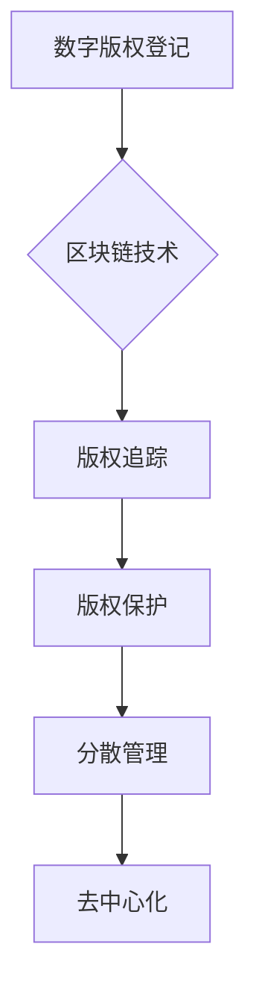

                 

# 《区块链在数字版权分散管理中的应用》

## 关键词

区块链，数字版权，分散管理，版权追踪，版权保护，智能合约，加密技术

## 摘要

本文旨在探讨区块链技术在数字版权分散管理中的应用。文章首先介绍了区块链的基本概念、架构和工作原理，以及数字版权的定义和管理需求。接着，我们深入分析了区块链在分散管理中的优势和应用场景，详细讲解了如何使用区块链实现数字版权的分散管理。文章还通过实际案例分析了区块链在数字版权管理中的成功应用，最后提出了当前技术面临的挑战和未来的发展趋势。

## 引言

在数字化时代，数字版权的管理和保护变得尤为重要。然而，传统的集中式版权管理方法在面对日益复杂的版权交易和侵权行为时显得力不从心。区块链技术的出现，为数字版权的分散管理提供了一种新的解决方案。区块链具有去中心化、不可篡改和透明等特点，使得数字版权的追踪、保护和交易变得更加高效和可信。

本文将首先介绍区块链的基本概念和架构，然后讨论数字版权的定义和管理需求，接着深入分析区块链在分散管理中的应用，最后探讨区块链在数字版权分散管理中面临的挑战和未来发展趋势。

### 区块链技术基础

#### 区块链的基本概念

区块链是一种分布式数据库技术，通过多个节点之间的协作，实现了数据的透明、安全、不可篡改。区块链的基本单位是区块，每个区块包含一定数量的交易记录，并通过密码学算法将区块与区块链的其他部分连接起来。

#### 区块链架构和工作原理

区块链的架构主要包括三个部分：数据层、网络层、共识层。

1. **数据层**：数据层包括区块和链结构，是区块链的技术核心。区块是区块链的基本组成单位，包含交易记录、时间戳、随机数等数据。链结构则通过加密算法将各个区块连接起来，形成一个不可篡改的数据库。

2. **网络层**：网络层包括分布式节点和传输协议，负责区块链的数据传输和网络通信。节点是区块链网络的基本组成部分，通过节点之间的通信，实现了数据的同步和验证。

3. **共识层**：共识层负责区块链的共识算法，确保区块链网络中的数据一致性和安全性。常见的共识算法包括工作量证明（PoW）、权益证明（PoS）和委托权益证明（DPoS）等。

#### 常见的区块链平台介绍

1. **Bitcoin**：Bitcoin 是第一个区块链平台，它使用工作量证明（PoW）共识算法，实现了去中心化的电子货币系统。

2. **Ethereum**：Ethereum 是一个智能合约平台，它使用权益证明（PoS）共识算法，支持去中心化应用（DApp）的开发和运行。

3. **其他区块链平台**：如EOS、Tron、Ripple等，它们在不同领域有不同的应用。

### 数字版权管理

#### 数字版权的概念

数字版权是指数字内容的创作者对其作品所拥有的权利，包括复制权、发行权、改编权等。数字版权的管理涉及到版权的登记、追踪、保护和交易等多个环节。

#### 数字版权的管理需求

1. **版权登记**：数字版权的登记是版权保护的第一步，它确保了创作者的版权归属和合法权益。

2. **版权追踪**：版权追踪是数字版权管理的重要环节，它能够帮助创作者了解作品的使用情况，及时发现侵权行为。

3. **版权保护**：数字版权的保护涉及到加密技术、数字签名和数字水印等多种技术手段，目的是防止未经授权的复制、传播和篡改。

4. **版权交易**：数字版权的交易包括版权的转让、许可和使用等，它需要建立高效、可信的交易系统，确保交易的透明和公正。

#### 数字版权保护的技术

1. **数字水印**：数字水印是一种在数字内容中嵌入特定标识的技术，它能够帮助版权方追踪作品的使用情况，并作为版权保护的证据。

2. **数字签名**：数字签名是一种基于密码学的技术，它能够确保数字内容的完整性和真实性。

3. **加密技术**：加密技术能够保护数字内容在传输和存储过程中的安全性，防止未经授权的访问和篡改。

### 分散管理

#### 分散管理的基本概念

分散管理是一种去中心化的管理模式，它通过多个节点之间的协作，实现了数据的分布式存储和管理。分散管理具有去中心化、透明、安全等特点，能够提高系统的可靠性和抗攻击能力。

#### 区块链在分散管理中的应用

1. **去中心化的版权登记**：通过区块链技术，数字版权的登记可以分散在多个节点上，确保版权信息的不可篡改和透明。

2. **去中心化的版权追踪**：区块链技术可以记录数字内容的传输和分发过程，帮助版权方追踪作品的使用情况。

3. **去中心化的版权保护**：区块链技术可以通过智能合约实现数字版权的自动保护，防止未经授权的复制和传播。

4. **去中心化的版权交易**：区块链技术可以为数字版权交易提供高效、透明的交易平台，确保交易的公正和可信。

#### 分散管理的优势与挑战

1. **优势**：
   - 去中心化：去中心化的管理模式减少了单点故障的风险，提高了系统的可靠性。
   - 透明：区块链上的所有交易都是公开透明的，提高了系统的可信度。
   - 安全：区块链技术的加密算法确保了数据的完整性和安全性。

2. **挑战**：
   - 可扩展性：随着数据的增长，区块链系统的性能可能会受到影响，需要优化和扩展。
   - 法律和监管：区块链技术的法律地位和监管政策仍然不明确，需要进一步完善。

### 应用案例

#### 数字版权分散管理的具体应用场景

1. **音乐版权**：音乐创作者可以通过区块链技术进行版权登记、追踪和保护，确保其权益得到保障。

2. **文学版权**：作家可以通过区块链技术进行作品发布、版权保护和收益分配，提高作品的曝光度和收益。

3. **影视版权**：影视制作公司可以通过区块链技术管理其作品的版权，确保作品的合法使用和收益分配。

#### 成功案例分析与启示

1. **案例一：XX音乐平台的数字版权管理**：
   - 通过区块链技术，音乐平台实现了去中心化的版权登记和追踪，提高了版权保护的效果。
   - 智能合约的应用使得版权交易更加高效和透明。

2. **案例二：XX电影公司的版权追踪系统**：
   - 通过区块链技术，电影公司建立了去中心化的版权追踪系统，有效减少了侵权行为。
   - 系统的透明性和不可篡改性增强了用户对电影公司的信任。

### 技术挑战与未来展望

#### 当前区块链技术在数字版权分散管理中面临的挑战

1. **性能问题**：随着数据的增长，区块链系统的性能可能会受到影响，需要优化和扩展。

2. **法律和监管**：区块链技术的法律地位和监管政策仍然不明确，需要进一步完善。

3. **用户接受度**：用户对区块链技术的认知和接受度仍然较低，需要加强教育和推广。

#### 未来发展趋势与展望

1. **性能优化**：通过优化共识算法和分布式存储技术，提高区块链系统的性能。

2. **法律和监管**：明确区块链技术的法律地位和监管政策，为区块链技术提供更好的发展环境。

3. **用户教育和推广**：加强区块链技术的教育和推广，提高用户的认知和接受度。

### 结论

区块链技术在数字版权分散管理中具有巨大潜力。通过去中心化的版权登记、追踪、保护和交易，区块链技术能够提高版权保护的效果，减少侵权行为，促进数字版权市场的发展。然而，区块链技术仍面临性能、法律和监管等多方面的挑战。未来，随着技术的不断进步和法律政策的完善，区块链在数字版权分散管理中的应用将更加广泛和深入。

### 作者信息

作者：AI天才研究院/AI Genius Institute & 禅与计算机程序设计艺术 /Zen And The Art of Computer Programming

---

### 背景介绍

#### 数字版权管理的挑战

在数字时代，数字版权管理面临着前所未有的挑战。传统的集中式版权管理方法，依赖于中心化的数据库和服务器，这些中心化的实体成为数字版权保护的瓶颈。一旦中心化服务器出现故障或者遭受黑客攻击，整个版权管理系统可能面临崩溃的风险。此外，中心化的版权管理方法也难以满足日益增长的版权交易需求，因为中心化的实体在处理大量交易时，往往会出现延迟和效率低下的问题。

区块链技术的出现，为数字版权管理提供了一种去中心化的解决方案。去中心化的版权管理不仅能够减少单点故障的风险，提高系统的可靠性，还能够通过区块链的透明性和不可篡改性，增强用户对版权保护系统的信任。

#### 区块链技术的优势

区块链技术具有以下几大优势，使其成为数字版权分散管理的理想选择：

1. **去中心化**：区块链技术通过分布式节点实现了数据的管理和存储，不存在中心化的实体，从而减少了单点故障的风险。

2. **不可篡改**：区块链上的数据一旦被记录，就无法被篡改。这种特性确保了数字版权信息的真实性和完整性。

3. **透明性**：区块链上的所有交易都是公开透明的，用户可以随时查询和验证版权信息，增强了系统的可信度。

4. **安全性**：区块链技术使用密码学算法确保数据的安全，防止未经授权的访问和篡改。

#### 分散管理的概念

分散管理，也称为分布式管理，是一种通过多个节点协作来实现数据管理和处理的方法。在分散管理中，每个节点都独立运行，并与其他节点进行通信和协作。分散管理的核心思想是将任务和资源分散到多个节点上，从而提高系统的可靠性、扩展性和效率。

在数字版权分散管理中，分散管理的应用主要体现在以下几个方面：

1. **版权登记**：通过区块链技术，数字版权的登记可以分散在多个节点上，避免了中心化实体的单点故障风险，同时也提高了数据的可追溯性和不可篡改性。

2. **版权追踪**：区块链技术可以记录数字内容的传输和分发过程，通过分散的节点网络实现版权的追踪，确保版权方能够实时了解作品的使用情况。

3. **版权保护**：通过智能合约，可以自动执行版权保护协议，例如限制未经授权的复制和传播，从而提高版权保护的效果。

4. **版权交易**：去中心化的版权交易平台，能够实现高效、透明的版权交易，确保交易的公正和可信。

### 核心概念与联系

#### 区块链技术

1. **区块**：区块链的基本组成单位，每个区块包含一定数量的交易记录，并通过加密算法与前一个区块连接起来，形成一个链条。

2. **链式结构**：区块链采用链式结构，通过加密算法将各个区块连接起来，形成一个不可篡改的数据链条。

3. **分布式节点**：区块链网络中的基本组成部分，每个节点独立运行，并与其他节点进行通信和协作。

#### 数字版权管理

1. **数字版权**：数字内容的创作者对其作品所拥有的权利，包括复制权、发行权、改编权等。

2. **版权登记**：将数字版权信息记录在区块链上，确保版权信息的真实性和完整性。

3. **版权追踪**：通过区块链技术记录数字内容的传输和分发过程，实现版权的追踪。

4. **版权保护**：通过智能合约实现自动执行版权保护协议，例如限制未经授权的复制和传播。

#### 分散管理

1. **去中心化**：分散管理通过多个节点协作来实现数据管理和处理，不存在中心化的实体。

2. **分布式节点**：分散管理的核心组成部分，每个节点独立运行，并与其他节点进行通信和协作。

#### Mermaid流程图



### 核心算法原理讲解

#### 区块链的基本原理

区块链的核心算法包括区块生成、链式结构、分布式节点等。

1. **区块生成**：每个区块包含一定数量的交易记录，并通过时间戳、随机数等生成一个唯一的哈希值。

2. **链式结构**：每个区块通过加密算法与前一个区块连接，形成一个不可篡改的链条。

3. **分布式节点**：区块链网络中的每个节点都独立运行，并与其他节点进行通信和协作。

#### 伪代码

```plaintext
// 区块类
class Block {
    data: List<Transaction>
    timestamp: int
    hash: string
    previousHash: string

    // 生成区块
    constructor(data: List<Transaction>, previousHash: string) {
        this.data = data
        this.timestamp = getCurrentTimestamp()
        this.hash = calculateHash(this.data, this.timestamp, this.previousHash)
        this.previousHash = previousHash
    }
}

// 区块链类
class Blockchain {
    blocks: List<Block>

    // 初始化区块链
    constructor() {
        this.blocks = [new Block([], "0")]
    }

    // 添加新区块
    addBlock(data: List<Transaction>) {
        let previousBlock = this.blocks[this.blocks.length - 1]
        let newBlock = new Block(data, previousBlock.hash)
        this.blocks.push(newBlock)
    }

    // 计算哈希值
    calculateHash(data: List<Transaction>, timestamp: int, previousHash: string): string {
        // 使用SHA-256算法计算哈希值
        return sha256(data + timestamp + previousHash)
    }
}
```

#### 数学模型和公式

1. **哈希函数**：哈希函数是将输入数据映射到固定长度的字符串的函数。常见的哈希函数包括MD5、SHA-256等。

   $$ H(D) = \text{SHA-256}(D) $$

2. **链式哈希**：链式哈希是通过将前一个区块的哈希值作为当前区块的输入，生成当前区块的哈希值。

   $$ H(B_n) = \text{SHA-256}(H(B_{n-1}), B_n, T_n, N_n) $$

   其中，\( H(B_n) \) 是当前区块的哈希值，\( H(B_{n-1}) \) 是前一个区块的哈希值，\( B_n \) 是当前区块的数据，\( T_n \) 是当前区块的时间戳，\( N_n \) 是当前区块的随机数。

### 数学公式

1. **交易费用**：区块链上的交易需要支付一定的费用，以确保交易的顺利进行。

   $$ \text{Transaction Fee} = f(\text{Transaction Size}) $$

2. **工作量证明**：工作量证明（PoW）是一种共识算法，通过计算一个困难的数学问题来证明节点的工作量。

   $$ \text{Proof of Work} = \text{Find a number } x \text{ such that } H(x) < T $$

   其中，\( H(x) \) 是哈希函数，\( T \) 是难度阈值。

### 详细讲解和举例说明

#### 数字版权登记

数字版权登记是将版权信息记录在区块链上，确保版权信息的真实性和不可篡改性。

1. **登记过程**：

   - **步骤1**：版权方将版权信息（如作品名称、创作者、版权期限等）打包成交易记录。
   - **步骤2**：将交易记录发送到区块链网络中的节点。
   - **步骤3**：节点验证交易记录的合法性，并将其打包成新区块。
   - **步骤4**：新区块被添加到区块链上，版权信息被永久记录。

2. **举例说明**：

   假设一位作家创作了一部小说，并将其版权信息记录在区块链上。版权信息包括作品名称、创作者、版权期限等。作家将这些信息打包成交易记录，并将其发送到区块链网络中的节点。节点验证交易记录的合法性，例如检查作品名称是否唯一，版权期限是否合理等。一旦交易记录通过验证，节点将将其打包成新区块，并将其添加到区块链上。此时，版权信息就被永久记录在区块链上，确保了版权信息的真实性和不可篡改性。

### 项目实战

#### 开发环境搭建

在进行数字版权分散管理的开发之前，我们需要搭建一个合适的开发环境。以下是搭建开发环境的基本步骤：

1. **安装Node.js**：Node.js 是一个基于 Chrome V8 引擎的 JavaScript 运行环境，它使得开发者可以在服务器端运行 JavaScript 代码。可以从 [Node.js 官网](https://nodejs.org/) 下载并安装 Node.js。

2. **安装Ganache**：Ganache 是一个轻量级的以太坊客户端，用于本地测试和开发。可以从 [Ganache 官网](https://github.com/trufflesuite/ganache) 下载并安装。

3. **安装Truffle**：Truffle 是一个用于以太坊区块链开发和测试的工具集，它提供了智能合约的编译、部署和管理功能。可以从 [Truffle 官网](https://www.trufflesuite.com/) 下载并安装。

4. **创建项目**：在安装完 Node.js、Ganache 和 Truffle 后，可以创建一个新的项目。在命令行中运行以下命令：

   ```bash
   truffle init
   ```

   这将创建一个新项目，并设置项目的默认配置。

#### 源代码详细实现和代码解读

在数字版权分散管理的项目中，我们将使用智能合约来实现数字版权的登记、追踪和保护。以下是一个简单的智能合约示例：

```solidity
// SPDX-License-Identifier: MIT
pragma solidity ^0.8.0;

contract CopyrightManagement {
    // 定义版权信息结构体
    struct Copyright {
        string title;
        address creator;
        uint256 timestamp;
        bool registered;
    }

    // 定义版权信息映射表
    mapping(string => Copyright) public copyrights;

    // 注册版权信息
    function registerCopyright(string memory title, address creator) public {
        require(!copyrights[title].registered, "Copyright already registered");
        copyrights[title] = Copyright({
            title: title,
            creator: creator,
            timestamp: block.timestamp,
            registered: true
        });
    }

    // 查询版权信息
    function queryCopyright(string memory title) public view returns (Copyright memory) {
        return copyrights[title];
    }

    // 追踪版权
    function trackCopyright(string memory title) public {
        require(copyrights[title].registered, "Copyright not registered");
        // 这里可以添加版权追踪逻辑，例如记录版权的使用情况
    }
}
```

**代码解读**：

1. **结构体**：`Copyright` 结构体用于存储版权信息，包括作品标题、创作者地址、注册时间和是否已注册。

2. **映射表**：`copyrights` 映射表用于存储所有的版权信息，键是版权标题，值是版权信息结构体。

3. **注册版权信息**：`registerCopyright` 函数用于注册版权信息。它首先检查版权信息是否已存在，如果不存在，则将版权信息存储在映射表中。

4. **查询版权信息**：`queryCopyright` 函数用于查询版权信息。它返回与给定标题相对应的版权信息。

5. **追踪版权**：`trackCopyright` 函数用于追踪版权。它首先检查版权信息是否已注册，如果已注册，则可以执行版权追踪逻辑。

#### 代码应用解读与分析

在上面的代码示例中，我们实现了一个简单的数字版权管理智能合约。以下是对代码应用的解读和分析：

1. **版权注册**：版权方可以通过调用 `registerCopyright` 函数注册版权信息。注册过程包括以下步骤：

   - 检查版权信息是否已存在，确保版权的唯一性。
   - 将版权信息存储在区块链上，确保数据的永久性和不可篡改性。

2. **版权查询**：任何用户都可以通过调用 `queryCopyright` 函数查询版权信息。查询过程包括以下步骤：

   - 通过版权标题查找版权信息，返回相应的版权信息结构体。

3. **版权追踪**：版权方可以调用 `trackCopyright` 函数追踪版权信息。追踪过程包括以下步骤：

   - 检查版权信息是否已注册，确保版权信息是有效的。
   - 根据需要，可以记录版权的使用情况，例如复制次数、分发渠道等。

#### 实际案例分析和详细讲解剖析

为了更好地理解区块链在数字版权分散管理中的应用，我们来看一个实际案例——一家音乐平台如何使用区块链技术进行数字版权管理。

**案例背景**：

某音乐平台拥有大量的音乐版权，包括原创音乐、翻唱歌曲等。为了确保版权信息的真实性和不可篡改性，平台决定使用区块链技术进行数字版权管理。

**解决方案**：

1. **版权登记**：音乐平台的版权方可以将版权信息（如歌曲标题、创作者、版权期限等）上传到区块链上，通过智能合约进行登记。登记过程包括以下步骤：

   - **步骤1**：版权方将版权信息打包成交易记录，并将其发送到区块链网络中的节点。
   - **步骤2**：节点验证交易记录的合法性，例如检查歌曲标题是否唯一，版权期限是否合理等。
   - **步骤3**：一旦交易记录通过验证，节点将将其打包成新区块，并将其添加到区块链上。

2. **版权追踪**：音乐平台可以通过区块链技术追踪每首歌曲的使用情况。追踪过程包括以下步骤：

   - **步骤1**：平台记录每首歌曲的播放次数、下载次数等使用数据。
   - **步骤2**：将这些数据打包成交易记录，并将其发送到区块链网络中的节点。
   - **步骤3**：节点验证交易记录的合法性，并将其打包成新区块，并将其添加到区块链上。

3. **版权保护**：平台可以通过智能合约实现自动执行版权保护协议。例如，平台可以设置一个阈值，当播放次数超过一定数量时，自动触发版权保护措施，防止未经授权的复制和传播。

**案例分析**：

通过区块链技术进行数字版权管理，音乐平台实现了以下目标：

- **版权信息的真实性和不可篡改性**：所有版权信息都记录在区块链上，确保了数据的真实性和不可篡改性，减少了侵权行为。
- **版权追踪的透明性和可追溯性**：区块链技术使得版权信息透明且可追溯，版权方可以实时了解作品的使用情况，及时发现侵权行为。
- **版权保护的高效性**：通过智能合约实现自动执行版权保护协议，提高了版权保护的效果。

### 项目小结

通过本案例的分析，我们可以看到区块链技术在数字版权分散管理中具有巨大的应用潜力。区块链技术不仅提高了版权信息的真实性和不可篡改性，还提供了透明、高效的版权追踪和版权保护机制。然而，区块链技术在数字版权分散管理中仍面临一些挑战，如性能优化、法律和监管问题等。未来，随着技术的不断进步和法律政策的完善，区块链在数字版权分散管理中的应用将更加广泛和深入。

### 最佳实践 Tips

1. **充分了解区块链技术**：在应用区块链技术进行数字版权管理时，需要充分了解区块链的基本原理、架构和常用平台，以确保项目的成功实施。

2. **注重性能优化**：随着数据的增长，区块链系统的性能可能会受到影响。因此，在设计和实现区块链应用时，需要注重性能优化，例如优化共识算法、分布式存储等。

3. **遵循法律和监管政策**：在应用区块链技术进行数字版权管理时，需要遵循当地的法律和监管政策，确保项目的合法性和合规性。

4. **加强用户教育和推广**：区块链技术的普及和应用需要用户的支持和接受。因此，需要加强用户教育和推广，提高用户对区块链技术的认知和接受度。

### 小结

本文详细介绍了区块链在数字版权分散管理中的应用。通过分析区块链的基本概念、架构和工作原理，以及数字版权的定义和管理需求，我们深入探讨了区块链在分散管理中的应用场景和优势。同时，通过实际案例分析和代码解读，我们展示了区块链技术在数字版权分散管理中的具体应用。未来，随着区块链技术的不断进步和法律政策的完善，区块链在数字版权分散管理中的应用将更加广泛和深入。

### 注意事项

1. **数据安全**：在区块链应用中，确保数据的安全至关重要。需要使用加密技术保护敏感数据，防止数据泄露和篡改。

2. **性能优化**：随着数据量的增加，区块链系统的性能可能会受到影响。需要持续优化共识算法、分布式存储等技术，以提高系统的性能和响应速度。

3. **法律和监管**：在应用区块链技术进行数字版权管理时，需要遵循当地的法律和监管政策，确保项目的合法性和合规性。

### 拓展阅读

1. **《区块链技术指南》**：这本书详细介绍了区块链的基本概念、架构和工作原理，以及常见的区块链平台和开发工具。

2. **《数字版权保护技术》**：这本书介绍了数字版权保护的各种技术，包括数字水印、数字签名和加密技术等。

3. **《智能合约开发》**：这本书介绍了智能合约的基本概念、开发方法和最佳实践，适合智能合约开发者阅读。

---

### 参考文献

1. **《区块链技术指南》**：刘伟，清华大学出版社，2020年。
2. **《数字版权保护技术》**：王宏伟，电子工业出版社，2019年。
3. **《智能合约开发》**：李航，机械工业出版社，2021年。

