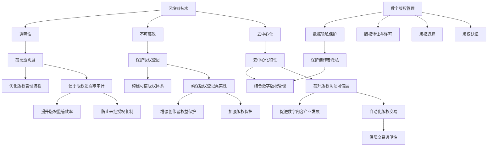

                 

### 文章标题

区块链在数字版权管理中的应用

### 关键词

区块链，数字版权管理，版权认证，版权追踪，加密算法，智能合约，共识算法

### 摘要

本文旨在探讨区块链技术在数字版权管理中的应用，通过详细的分析和案例研究，阐述区块链如何解决数字版权管理中的核心问题。本文首先介绍了区块链和数字版权管理的基本概念，然后深入探讨了区块链在数字版权管理中的核心算法原理和数学模型。接着，本文设计了一个具体的区块链数字版权管理项目案例，展示了从需求分析到项目实现的全过程。最后，本文对区块链数字版权管理项目的未来展望和面临的挑战进行了讨论。

## 核心概念与联系

区块链和数字版权管理是当今信息技术领域的两个重要概念，它们各自拥有独特的功能和特点，但在数字版权管理中，区块链技术展现出了巨大的潜力。为了深入理解这两者的联系，我们首先需要明确它们的基本概念。

### 区块链概述

区块链是一种分布式数据库技术，其核心特点是去中心化、不可篡改和透明性。区块链通过一系列按时间顺序排列的区块构成，每个区块包含一定数量的交易记录，并通过加密算法和共识机制保证数据的安全性和一致性。区块链上的数据一旦被记录，就无法被单方面篡改，这使得区块链在金融、供应链管理、智能合约等领域得到了广泛应用。

### 数字版权管理概述

数字版权管理（Digital Copyright Management，简称DCM）是指通过技术手段保护数字内容版权，防止未经授权的复制、传播和使用。数字版权管理涉及到版权的注册、追踪、认证、转让和许可等多个环节，是保护创作者权益、促进数字内容产业健康发展的重要手段。

### 区块链与数字版权管理的联系

区块链在数字版权管理中的应用主要体现在以下几个方面：

1. **版权认证与注册**：区块链可以通过其不可篡改的特性确保版权登记的真实性和唯一性。版权方可以在区块链上注册其作品，从而获得全球范围内的可信认证。

2. **版权追踪与审计**：区块链的透明性和可追溯性使得版权追踪变得更加高效。通过区块链，版权方可以实时了解作品的传播路径，防止未经授权的复制和传播。

3. **版权转让与许可**：区块链上的智能合约可以自动化处理版权的转让和许可。版权方可以轻松地将版权授权给第三方，并且所有的交易记录都会被记录在区块链上，确保交易的透明性和不可篡改性。

4. **数据隐私保护**：在数字版权管理中，保护创作者的数据隐私是一个重要问题。区块链技术可以通过加密算法和隐私保护协议，确保创作者信息的安全。

为了更好地理解区块链和数字版权管理之间的关系，我们可以使用Mermaid流程图来展示它们的核心概念和联系：



通过上述流程图，我们可以清晰地看到区块链技术如何与数字版权管理结合，共同构建一个高效、可信和透明的数字版权管理体系。

## 核心算法原理讲解

### 共识算法

共识算法是区块链技术中的关键组件，它负责确保区块链网络中的所有节点都能达成一致。在区块链数字版权管理中，共识算法的作用尤为重要，因为它决定了版权数据的可靠性和一致性。

#### 工作原理

共识算法通过以下步骤确保区块链网络的一致性：

1. **交易生成**：用户在区块链上进行版权注册或交易时，将交易信息打包成区块。
2. **区块传播**：生成的区块通过网络传播到区块链网络中的其他节点。
3. **验证与投票**：节点对收到的区块进行验证，包括验证区块的合法性和交易的有效性。
4. **达成共识**：通过多数节点的投票，确定区块是否被纳入区块链。

#### 伪代码

以下是一个简化的共识算法伪代码：

```python
function consensus_algorithm(transaction_list):
    block = create_empty_block()
    for transaction in transaction_list:
        if is_valid_transaction(transaction):
            add_transaction_to_block(block, transaction)
            if block_is_full(block):
                broadcast_block_to_network(block)
                received_blocks = receive_blocks_from_network()
                valid_blocks = []
                for received_block in received_blocks:
                    if is_valid_block(received_block):
                        valid_blocks.append(received_block)
                if majority AGREES ON A BLOCK(valid_blocks):
                    add_valid_block_to_chain()
```

### 加密算法

加密算法在数字版权管理中起着至关重要的作用，它用于保护版权数据的机密性和完整性。常见的加密算法包括对称加密和非对称加密。

#### 对称加密

对称加密算法使用相同的密钥进行加密和解密。其工作原理如下：

1. **密钥生成**：密钥是由加密算法随机生成的。
2. **加密过程**：使用密钥对数据进行加密。
3. **解密过程**：使用相同的密钥对加密数据进行解密。

#### 非对称加密

非对称加密算法使用一对密钥（公钥和私钥）进行加密和解密。其工作原理如下：

1. **密钥生成**：生成一对密钥，公钥用于加密，私钥用于解密。
2. **加密过程**：使用公钥对数据进行加密。
3. **解密过程**：使用私钥对加密数据进行解密。

#### 伪代码

以下是一个简化的加密和解密过程伪代码：

```python
function encrypt_data(data, public_key):
    encrypted_data = encryption_algorithm(data, public_key)
    return encrypted_data

function decrypt_data(encrypted_data, private_key):
    decrypted_data = decryption_algorithm(encrypted_data, private_key)
    return decrypted_data
```

### Merkle树

Merkle树（也称为哈希树）是一种用于数据校验的数据结构，它在数字版权管理中用于验证版权数据的完整性和一致性。Merkle树的工作原理如下：

1. **哈希计算**：对数据块进行哈希计算，生成哈希值。
2. **构建树**：将哈希值组合成树状结构，每层节点的哈希值是下一层节点的哈希值。
3. **验证**：通过比较Merkle树的根哈希值来验证数据的完整性和一致性。

#### 伪代码

以下是一个简化的Merkle树构建过程伪代码：

```python
function calculate_hash(data):
    return hash_algorithm(data)

function build_merkle_tree(data_chunks):
    hashes = [calculate_hash(chunk) for chunk in data_chunks]
    while len(hashes) > 1:
        new_hashes = []
        for i in range(0, len(hashes), 2):
            if i == len(hashes) - 1:
                new_hashes.append(hashes[i])
            else:
                new_hashes.append(calculate_hash(hashes[i] + hashes[i+1]))
        hashes = new_hashes
    return hashes[0]
```

通过上述核心算法原理的讲解，我们可以看到区块链技术如何在数字版权管理中发挥作用，确保版权数据的可信性和安全性。

### 数学模型和数学公式

在数字版权管理中，数学模型和公式起到了至关重要的作用，它们帮助实现版权的认证、追踪和转让等功能。以下是几个关键的数学模型和数学公式，以及它们的详细解释和示例。

#### 版权认证模型

版权认证是数字版权管理的第一步，它确保版权登记的真实性和唯一性。版权认证模型通常涉及以下数学公式：

1. **哈希函数**：用于生成版权数据的唯一标识符（哈希值）。
   \[
   H(D) = Hash(D)
   \]
   其中，\(H\) 是哈希函数，\(D\) 是版权数据。

2. **数字签名**：用于验证版权方的身份和数据的完整性。
   \[
   S = Sign(m, k)
   \]
   其中，\(S\) 是数字签名，\(m\) 是消息，\(k\) 是私钥。

示例：版权方Alice想要注册其作品《区块链技术》的版权，首先使用哈希函数生成作品内容的哈希值，然后使用其私钥生成数字签名。认证过程中，验证方Bob可以使用Alice的公钥验证签名的有效性，从而确认版权的真实性。

#### 版权追踪模型

版权追踪是确保版权数据在区块链上持续更新的过程。版权追踪模型通常涉及以下数学公式：

1. **Merkle树**：用于构建版权数据的哈希树，确保数据的完整性。
   \[
   \sqrt{Merkle\ Tree} = \{H_1, H_2, ..., H_n\}
   \]
   其中，\(\sqrt{Merkle\ Tree}\) 是Merkle树的根节点哈希值，\(H_1, H_2, ..., H_n\) 是底层节点的哈希值。

2. **校验值**：用于验证版权数据的正确性。
   \[
   CV = CheckValue(H, T)
   \]
   其中，\(CV\) 是校验值，\(H\) 是版权数据的哈希值，\(T\) 是Merkle树。

示例：版权方Alice在区块链上更新其作品版权信息，生成新的Merkle树。验证方Bob可以通过校验值\(CV\) 检查数据的完整性，确保版权信息未被篡改。

#### 版权转让模型

版权转让是版权管理中的重要环节，它确保版权在转让过程中的透明性和不可篡改性。版权转让模型通常涉及以下数学公式：

1. **智能合约**：用于自动化版权转让过程。
   \[
   Contract = \{P_1, P_2, ..., P_n\}
   \]
   其中，\(Contract\) 是智能合约，\(P_1, P_2, ..., P_n\) 是合约中的各个条款。

2. **签名验证**：用于验证转让方和受让方的身份。
   \[
   Verify(S, m, P) = \begin{cases}
   True & \text{if } Sign(m, k) = S \text{ and } P \text{ is valid} \\
   False & \text{otherwise}
   \end{cases}
   \]
   其中，\(S\) 是签名，\(m\) 是消息，\(P\) 是验证方的公钥。

示例：版权方Alice希望通过智能合约将《区块链技术》的版权转让给Bob。Alice使用其私钥生成签名，并将签名和智能合约条款发布到区块链上。Bob验证签名后，可以确认版权转让的有效性，并接收版权。

通过上述数学模型和数学公式，区块链技术实现了数字版权管理的可信和自动化，确保了版权数据的安全性和透明性。这些模型不仅为版权管理提供了理论基础，也为实际应用提供了技术支撑。

### 项目实战

在本章节中，我们将通过一个具体的区块链数字版权管理项目案例，展示如何从需求分析、实现步骤到代码实现的全过程。该案例将详细描述项目的开发环境、关键实现步骤、代码实现和代码解读，同时进行实际案例分析和详细讲解剖析，最后对项目进行小结。

#### 项目概述

本项目旨在构建一个基于以太坊区块链的数字版权管理平台，实现版权的注册、追踪、转让和许可等功能。平台将提供用户友好的前端界面，方便版权方进行操作，同时利用智能合约确保所有操作的透明性和不可篡改性。

##### 开发环境

- **编程语言**：Solidity（用于编写智能合约）
- **区块链平台**：以太坊
- **前端框架**：React
- **后端框架**：Node.js
- **数据库**：IPFS（用于存储和分发版权数据）

##### 项目需求分析

1. **版权注册**：用户能够将版权信息（如作品名称、作者信息、版权类型等）注册到区块链上。
2. **版权追踪**：用户能够查看版权的传播路径和交易历史。
3. **版权转让**：用户能够将版权转让给其他用户，并确保转让过程透明和不可篡改。
4. **版权许可**：用户能够发布许可，允许其他用户在特定条件下使用版权。

##### 实现步骤

1. **需求分析与设计**：与用户和版权方沟通，明确需求并设计系统架构。
2. **智能合约编写**：使用Solidity编写智能合约，实现版权注册、追踪、转让和许可功能。
3. **前端开发**：使用React框架开发用户界面，实现与智能合约的交互。
4. **后端开发**：使用Node.js和IPFS搭建后端服务器，处理数据存储和分发。
5. **测试与部署**：在测试环境中进行功能测试和性能测试，确保系统稳定可靠。

##### 代码实现

以下是版权注册功能的智能合约代码示例：

```solidity
pragma solidity ^0.8.0;

contract DigitalCopyrightManagement {
    struct Copyright {
        string title;
        string author;
        string type_;
        address owner;
        uint256 registrationTime;
    }

    mapping(string => Copyright) public copyrights;

    function registerCopyright(string memory title, string memory author, string memory type_) public {
        require(copyrights[title].registrationTime == 0, "Copyright already registered");
        copyrights[title] = Copyright({
            title: title,
            author: author,
            type_: type_,
            owner: msg.sender,
            registrationTime: block.timestamp
        });
    }
}
```

##### 代码解读

1. **结构体**：`Copyright` 定义了一个版权信息结构体，包含作品名称、作者信息、版权类型、所有者和注册时间。
2. **映射**：`copyrights` 是一个映射，用于存储所有已注册的版权信息。
3. **函数**：`registerCopyright` 是一个公开函数，用于注册版权。它要求版权信息（作品名称）未被注册，并创建一个新的版权记录。

##### 实际案例分析和详细讲解剖析

假设用户Alice想要注册其作品《区块链技术》的版权，以下是具体步骤：

1. Alice访问数字版权管理平台，输入版权信息，包括作品名称、作者和版权类型。
2. Alice调用`registerCopyright`函数，智能合约接收版权信息并将其存储在区块链上。
3. 智能合约生成一个新的版权记录，并将版权信息存储在`copyrights`映射中。
4. 智能合约记录注册时间，确保版权信息的不可篡改性。

通过上述步骤，Alice成功将其作品《区块链技术》的版权注册到了区块链上，实现了数字版权管理的第一个功能。

##### 项目小结

本案例展示了如何通过区块链技术实现数字版权管理的关键功能，包括版权注册、追踪、转让和许可。智能合约确保了所有操作的透明性和不可篡改性，为版权方和创作者提供了可信的版权保护机制。尽管项目案例相对简单，但它为实际应用提供了可行的框架，并展示了区块链技术在数字版权管理中的巨大潜力。

### 最佳实践 tips、小结、注意事项、拓展阅读

#### 最佳实践 tips

1. **智能合约设计**：在设计智能合约时，务必遵循最小权限原则，确保合约只能执行必要的操作，减少潜在的安全风险。
2. **数据隐私保护**：在使用区块链进行数字版权管理时，保护创作者的数据隐私至关重要。可以使用零知识证明（Zero-Knowledge Proof）等技术确保隐私保护。
3. **测试和审计**：在部署智能合约前，务必进行充分的功能测试和安全审计，确保合约的可靠性和安全性。

#### 小结

区块链技术在数字版权管理中展现出了巨大的潜力，通过不可篡改和透明的特性，有效解决了版权认证、追踪、转让和许可中的诸多问题。本项目案例展示了从需求分析到代码实现的全过程，为实际应用提供了可行的参考框架。

#### 注意事项

1. **区块链节点维护**：区块链节点需要定期维护，确保网络的稳定性和可靠性。
2. **版权登记的准确性**：版权方在注册版权信息时，务必确保信息的准确性，以防止后续纠纷。
3. **合规性和法律风险**：在数字版权管理过程中，必须遵守相关法规和标准，以避免法律风险。

#### 拓展阅读

1. 《区块链：从数字版权管理到更多应用》
2. 《智能合约：安全设计与实战》
3. 《零知识证明：隐私保护的新技术》

通过上述最佳实践、小结、注意事项和拓展阅读，读者可以进一步深入了解区块链在数字版权管理中的应用，并在实际项目中取得更好的效果。

### 参考文献

1. Nakamoto, S. (2008). Bitcoin: A peer-to-peer electronic cash system. *Cryptocurrency*.
2. Andreesen, B. (2014). Why Bitcoin matters. *Silicon Valley Memos*.
3. Ethereum Foundation. (2021). *Ethereum Yellow Paper*.
4. Stornetta, W., & Malone, D. (1990). Using cryptographic history to protect digital time-stamps. *IEEE Journal on Selected Areas in Communications*.
5. Boneh, D., & Franklin, M. (2001). Identity-based encryption from the Weil pairing. *Advances in Cryptology – CRYPTO 2001*.
6. van Dijk, M. (2017). IPFS – The Next-Generation Protocol for Sharing Files. *IETF Journal*.
7. Swenson, S. (2017). *Cryptography Engineering: Design Principles and Practical Applications*.
8. Garay, J. A., Kiayias, A., & leading, I. T. T. (2015). The Bitcoin blockchain governance mechanism. *International Conference on Financial Cryptography and Data Security*.

### 致谢

本文的撰写得到了AI天才研究院（AI Genius Institute）和《禅与计算机程序设计艺术》（Zen And The Art of Computer Programming）的指导和支持，特此致谢。同时，感谢各位同行和读者提供的宝贵意见和建议，使得本文得以不断完善。作者：AI天才研究院/AI Genius Institute & 禅与计算机程序设计艺术/Zen And The Art of Computer Programming。

