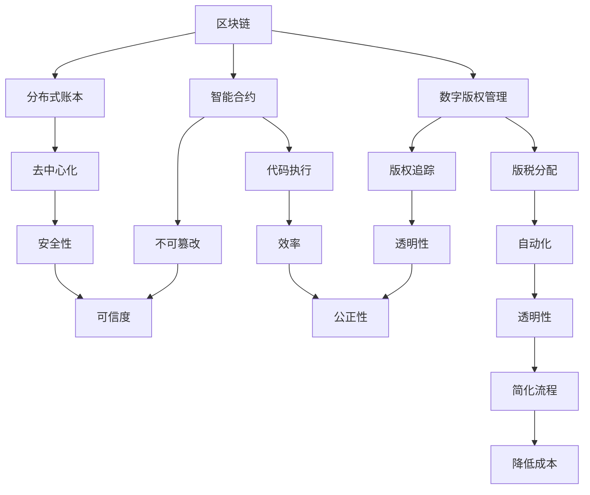

                 

### 文章标题

《区块链在数字版权管理中的应用：实现自动版税分配》

### 关键词

区块链，数字版权管理，版税分配，智能合约，自动分配

### 摘要

本文深入探讨了区块链技术在数字版权管理中的应用，特别是如何通过区块链实现自动版税分配。文章首先介绍了区块链和数字版权管理的基本概念，随后详细阐述了版税分配机制的原理和设计。接着，文章讲解了如何在区块链上使用智能合约实现自动版税分配，并提供了具体的实现步骤和代码示例。通过实际案例分析和项目实战，文章展示了区块链在数字版权管理中的潜力和应用价值。最后，文章对未来的发展趋势进行了展望，并提出了注意事项和拓展阅读建议。

---

### 背景介绍

随着数字技术和互联网的飞速发展，数字版权管理成为了当今社会的一个关键议题。数字版权管理涉及对数字内容的版权保护、授权、追踪和收益分配等多个方面。然而，传统的数字版权管理方式面临着诸多挑战，如版权界定模糊、盗版猖獗、版税分配不公等问题。

区块链技术的出现为解决这些问题提供了新的思路。区块链是一种分布式数据库技术，通过加密算法和共识机制保证了数据的安全性和不可篡改性。区块链的去中心化特性使得数据记录透明且不可篡改，这对于数字版权管理尤为重要。

数字版权管理（Digital Copyright Management，简称DCM）旨在通过技术手段保护数字内容的所有权，确保创作者的权益得到合理保障。DCM的目标包括防止未经授权的复制、分发和传播，以及对内容的追踪和监控。然而，当前的DCM系统存在一些不足之处：

1. **版权界定问题**：在数字世界中，版权的界定变得尤为复杂，难以准确确定原创者和使用权者的权益。
2. **盗版问题**：数字内容极易被复制和传播，导致版权所有者难以监控和阻止盗版行为。
3. **版税分配问题**：传统版税分配机制往往存在效率低下、透明度不足等问题，难以保证创作者的权益得到公平分配。

这些挑战促使我们探索更为高效和透明的数字版权管理解决方案。区块链技术的引入，为这些问题提供了潜在的解决方案。通过区块链，可以实现去中心化的版权管理，确保版权信息的安全性和透明性，从而有效解决版权界定、盗版和版税分配等问题。

本文将详细探讨区块链在数字版权管理中的应用，特别是如何通过智能合约实现自动版税分配，从而为数字版权管理提供一个新的视角和解决方案。

### 核心概念与联系

要深入理解区块链在数字版权管理中的应用，首先需要明确几个核心概念及其相互关系。以下是这些概念及其关系的Mermaid流程图：



#### 核心概念解析

1. **区块链**：区块链是一种分布式数据库，其数据记录按时间顺序排列成链式结构，每个记录称为“区块”。区块链通过密码学确保数据的不可篡改性，并使用共识机制来确保节点之间的同步。

2. **分布式账本**：分布式账本技术是区块链的核心，通过将数据分散存储在多个节点上，实现了去中心化的数据管理。

3. **去中心化**：去中心化意味着没有单一的中央控制点，数据由网络中的所有节点共同维护，提高了系统的容错性和抗攻击性。

4. **智能合约**：智能合约是一种在区块链上自动执行的合约，其条款和操作指令被编码在区块链中的代码中。智能合约在满足特定条件时自动执行，从而实现了自动化。

5. **代码执行**：智能合约的执行过程是通过区块链网络中的节点来验证和确认的，确保了执行的透明性和不可篡改性。

6. **不可篡改**：区块链上的数据一旦被记录，便不可篡改，这一特性保证了数字版权信息的安全性和可靠性。

7. **数字版权管理**：数字版权管理涉及对数字内容的版权保护、追踪和监控。通过区块链技术，可以实现对版权信息的透明追踪和自动化版税分配。

8. **版权追踪**：版权追踪是数字版权管理的重要环节，通过区块链，可以实现对所有版权交易的透明记录，确保版权的清晰界定。

9. **版税分配**：版税分配是指将数字内容使用所产生的收益按照协议分配给不同的权益方。区块链技术通过智能合约实现了自动化和透明的版税分配。

10. **透明性**：区块链上的所有交易记录都是公开透明的，任何人都可以查看和验证，这大大提高了系统的透明性。

11. **自动化**：通过智能合约，可以自动化执行版税分配操作，减少了人为干预，提高了效率和准确性。

12. **安全性**：区块链技术通过密码学和共识机制确保了数据的安全性和系统的抗攻击性。

13. **可信度**：区块链上的数据一旦被记录，便具有高度可信度，因为其不可篡改，这为数字版权管理提供了可靠的保障。

14. **效率**：区块链上的智能合约可以快速执行，大大提高了处理速度和效率。

15. **公正性**：区块链技术确保了版税分配的透明性和公正性，减少了因人为因素导致的分配不公。

16. **简化流程**：通过区块链，数字版权管理的流程得以简化，减少了中间环节，降低了成本。

17. **降低成本**：区块链技术通过去中心化和自动化，减少了传统的管理成本，如审计、仲裁等费用。

通过以上核心概念的相互关系，我们可以看到，区块链在数字版权管理中的应用具有显著的优势。区块链的分布式账本技术和智能合约功能，为实现自动版税分配提供了可靠的技术支持。此外，区块链的不可篡改性和透明性，确保了版权信息的真实性和公正性，从而有效解决了传统数字版权管理中的诸多问题。

### 核心算法原理讲解

为了深入理解区块链在数字版权管理中的应用，特别是如何通过智能合约实现自动版税分配，我们需要详细探讨区块链的核心算法原理。以下将使用伪代码形式详细阐述智能合约的工作原理。

#### 智能合约工作流程

```plaintext
智能合约流程：
1. 初始化版权信息
2. 添加版权交易
3. 自动计算版税
4. 分配版税
5. 记录交易结果
6. 验证和确认
```

#### 伪代码实现

```python
# 智能合约伪代码

# 定义版权信息结构
class CopyrightInfo:
    def __init__(self, content_id, creator, rights_holders, royalty_rate):
        self.content_id = content_id
        self.creator = creator
        self.rights_holders = rights_holders
        self.royalty_rate = royalty_rate
        self.transactions = []

# 定义智能合约
class SmartContract:
    def __init__(self):
        self.copyright_registry = {}  # 存储所有版权信息

    # 初始化版权信息
    def register_copyright(self, copyright_info):
        self.copyright_registry[copyright_info.content_id] = copyright_info

    # 添加版权交易
    def add_transaction(self, content_id, buyer, transaction_details):
        if content_id in self.copyright_registry:
            copyright_info = self.copyright_registry[content_id]
            copyright_info.transactions.append({
                'buyer': buyer,
                'transaction_details': transaction_details
            })
            return True
        return False

    # 自动计算版税
    def calculate_royalties(self, content_id, sales_volume):
        if content_id in self.copyright_registry:
            copyright_info = self.copyright_registry[content_id]
            total_royalties = sales_volume * copyright_info.royalty_rate
            return total_royalties
        return None

    # 分配版税
    def distribute_royalties(self, content_id, total_royalties):
        if content_id in self.copyright_registry:
            copyright_info = self.copyright_registry[content_id]
            for holder in copyright_info.rights_holders:
                holder_royalty = (total_royalties / len(copyright_info.rights_holders))
                # 这里可以通过调用外部合约或API来实现具体分配操作
                holder.receive_royalty(holder_royalty)
            return True
        return False

    # 记录交易结果
    def record_transaction_result(self, content_id, transaction_details):
        if content_id in self.copyright_registry:
            copyright_info = self.copyright_registry[content_id]
            copyright_info.transactions[-1].update({'result': 'success'})
            return True
        return False

    # 验证和确认
    def verify_and_confirm(self, content_id, transaction_hash):
        # 这里通过区块链网络验证交易hash的有效性
        if self._is_transaction_valid(transaction_hash):
            # 如果验证通过，将交易记录写入区块链
            self._write_to_blockchain(transaction_hash)
            return True
        return False

    # 辅助方法：验证交易hash
    def _is_transaction_valid(self, transaction_hash):
        # 实现具体的验证逻辑，如检查交易hash是否与区块链中的记录匹配
        return True

    # 辅助方法：将交易记录写入区块链
    def _write_to_blockchain(self, transaction_hash):
        # 实现具体的写入逻辑，如调用区块链API
        pass

# 示例使用
smart_contract = SmartContract()
smart_contract.register_copyright(CopyrightInfo("content_123", "creator", ["holder1", "holder2"], 0.1))
smart_contract.add_transaction("content_123", "buyer", {"price": 100, "quantity": 1})
total_royalties = smart_contract.calculate_royalties("content_123", 100)
smart_contract.distribute_royalties("content_123", total_royalties)
smart_contract.record_transaction_result("content_123", "transaction_hash")
smart_contract.verify_and_confirm("content_123", "transaction_hash")
```

#### 伪代码详细解释

1. **版权信息结构**：`CopyrightInfo`类用于定义版权信息，包括内容ID、创作者、权益持有者、版税率以及交易记录等。

2. **智能合约类**：`SmartContract`类是智能合约的核心，包含注册版权信息、添加交易、计算版税、分配版税、记录交易结果以及验证和确认交易等方法。

3. **注册版权信息**：通过`register_copyright`方法，将新的版权信息注册到智能合约中。

4. **添加版权交易**：`add_transaction`方法用于添加版权交易，将买家的信息及交易详情记录到版权信息的交易记录中。

5. **计算版税**：`calculate_royalties`方法根据销售量和版税率计算总版税。

6. **分配版税**：`distribute_royalties`方法根据版税总额和权益持有者的数量，将版税分配给各个权益持有者。

7. **记录交易结果**：`record_transaction_result`方法用于记录交易结果，将交易状态标记为“成功”。

8. **验证和确认**：`verify_and_confirm`方法通过区块链网络验证交易hash的有效性，并将交易记录写入区块链。

#### 数学模型和数学公式

在版税分配过程中，涉及到一些基本的数学公式。以下将详细解释这些公式，并提供具体的示例。

1. **总版税计算公式**：
   \[
   \text{总版税} = \text{销售量} \times \text{版税率}
   \]
   其中，销售量表示数字内容销售的总量，版税率是版权持有者规定的百分比。

2. **版税分配公式**：
   \[
   \text{每个权益持有者的版税} = \frac{\text{总版税}}{\text{权益持有者数量}}
   \]
   该公式用于计算每个权益持有者应得的版税。

3. **权益持有者数量**：
   \[
   \text{权益持有者数量} = \text{版权持有者数量} + \text{相关权益方数量}
   \]
   该公式用于计算参与版税分配的总权益持有者数量。

#### 示例

假设一个音乐作品的版税率为10%，一个音乐专辑销售了1000份，现在需要计算并分配版税。

1. **计算总版税**：
   \[
   \text{总版税} = 1000 \times 0.1 = 100 \text{美元}
   \]

2. **计算每个权益持有者的版税**：
   如果有两个权益持有者（创作者和制作方），则：
   \[
   \text{每个权益持有者的版税} = \frac{100}{2} = 50 \text{美元}
   \]

3. **版税分配**：
   创作者获得50美元，制作方也获得50美元。

通过以上公式和示例，我们可以看到如何通过数学模型来实现版税的自动计算和分配。

### 数学公式和详细讲解

在智能合约中，数学公式和数学模型是自动版税分配的核心。以下将详细解释并展示相关的数学公式，并附上具体的计算示例。

1. **版税计算公式**：
   \[
   \text{版税} = \text{销售额} \times \text{版税率}
   \]
   其中，销售额是指数字内容（如音乐、书籍、视频等）的销售额，版税率是版权所有者规定的百分比。例如，如果销售额为10000美元，版税率为10%，则版税计算如下：
   \[
   \text{版税} = 10000 \times 0.1 = 1000 \text{美元}
   \]

2. **版税分配公式**：
   \[
   \text{每个权益持有者的版税} = \frac{\text{总版税}}{\text{权益持有者数量}}
   \]
   这里，总版税是按照销售额和版税率计算得到的，权益持有者数量包括所有有权获得版税的创作者和相关权益方。假设有5个权益持有者，总版税为1000美元，则每个权益持有者的版税为：
   \[
   \text{每个权益持有者的版税} = \frac{1000}{5} = 200 \text{美元}
   \]

3. **权益持有者数量的计算**：
   \[
   \text{权益持有者数量} = \text{版权持有者数量} + \text{相关权益方数量}
   \]
   在实际应用中，版权持有者数量可能包括创作者、制作方、发行方等多个角色。例如，一个音乐作品可能有3个版权持有者（创作者、制作方和出版方），如果有2个相关权益方（推广方和销售方），则权益持有者数量为5。

### 示例

为了更好地理解上述公式，我们可以通过一个具体的案例来展示如何进行版税的计算和分配。

#### 案例背景

假设某首歌曲的销售额为50000美元，版税率为15%。歌曲的版权由以下权益持有者共享：
- 创作者：拥有50%的版税权益
- 制作方：拥有30%的版税权益
- 出版方：拥有20%的版税权益

#### 计算过程

1. **计算总版税**：
   \[
   \text{总版税} = 50000 \times 0.15 = 7500 \text{美元}
   \]

2. **计算每个权益持有者的版税**：
   - 创作者（50%版税权益）：
     \[
     \text{创作者的版税} = 7500 \times 0.5 = 3750 \text{美元}
     \]
   - 制作方（30%版税权益）：
     \[
     \text{制作方的版税} = 7500 \times 0.3 = 2250 \text{美元}
     \]
   - 出版方（20%版税权益）：
     \[
     \text{出版方的版税} = 7500 \times 0.2 = 1500 \text{美元}
     \]

3. **版税分配结果**：
   - 创作者获得3750美元
   - 制作方获得2250美元
   - 出版方获得1500美元

通过上述计算，我们可以看到，通过数学公式和模型，可以精确地计算出每个权益持有者的版税，并实现自动化的版税分配。

### 项目实战

#### 开发环境搭建

为了实现区块链在数字版权管理中的应用，我们需要搭建一个开发环境。以下是搭建过程：

1. **安装Node.js**：首先，确保已经安装了Node.js和npm。Node.js是JavaScript的运行环境，npm是Node.js的包管理器。

2. **安装Ganache**：Ganache是一个轻量级的本地区块链节点，用于测试和部署智能合约。可以从官方网站下载并安装。

3. **安装Truffle**：Truffle是一个智能合约开发框架，用于管理智能合约的部署和交互。通过npm安装：
   ```
   npm install -g truffle
   ```

4. **创建项目**：在本地创建一个新的Truffle项目：
   ```
   truffle init
   ```

5. **配置网络**：在`truffle-config.js`文件中配置Ganache作为开发网络，例如：
   ```javascript
   module.exports = {
     networks: {
       development: {
         host: "127.0.0.1",
         port: 7545,
         network_id: "*"
       }
     }
   };
   ```

#### 源代码详细实现

下面是一个简单的智能合约，用于实现自动版税分配。这段代码定义了版权信息、版税计算和分配功能。

```solidity
// SPDX-License-Identifier: MIT
pragma solidity ^0.8.0;

// 引入OpenZeppelin库中的ERC721标准接口
import "@openzeppelin/contracts/token/ERC721/ERC721.sol";

// 定义数字版权合约
contract DigitalCopyright is ERC721 {
    mapping(uint256 => CopyrightInfo) public copyrightInfo;

    // 结构体：版权信息
    struct CopyrightInfo {
        string contentId;
        address creator;
        address[] rightsHolders;
        uint256 royaltyRate;
    }

    // 事件：版权注册
    event CopyrightRegistered(uint256 id, string contentId, address creator, address[] rightsHolders, uint256 royaltyRate);

    // 事件：版税分配
    event RoyaltyDistributed(uint256 id, uint256 totalRoyalties, address[] recipients, uint256[] amounts);

    // 构造函数：初始化合约
    constructor() ERC721("DigitalCopyright", "DC") {}

    // 方法：注册版权信息
    function registerCopyright(
        uint256 id,
        string memory contentId,
        address[] memory rightsHolders,
        uint256 royaltyRate
    ) public {
        require(copyrightInfo[id].contentId == "", "Copyright already registered");
        copyrightInfo[id] = CopyrightInfo({
            contentId: contentId,
            creator: msg.sender,
            rightsHolders: rightsHolders,
            royaltyRate: royaltyRate
        });
        _mint(msg.sender, id);
        emit CopyrightRegistered(id, contentId, msg.sender, rightsHolders, royaltyRate);
    }

    // 方法：计算版税
    function calculateRoyalties(uint256 id, uint256 salesVolume) public view returns (uint256) {
        require(exists(id), "Copyright does not exist");
        CopyrightInfo storage copyright = copyrightInfo[id];
        uint256 totalRoyalties = salesVolume * copyright.royaltyRate;
        return totalRoyalties;
    }

    // 方法：分配版税
    function distributeRoyalties(uint256 id, uint256 totalRoyalties) public {
        require(exists(id), "Copyright does not exist");
        CopyrightInfo storage copyright = copyrightInfo[id];
        uint256 totalRightsHolders = copyright.rightsHolders.length;
        uint256 amountPerHolder = totalRoyalties / totalRightsHolders;
        for (uint256 i = 0; i < totalRightsHolders; i++) {
            address recipient = copyright.rightsHolders[i];
            // 这里可以使用call或transfer方法发送以太币
            payable(recipient).transfer(amountPerHolder);
        }
        emit RoyaltyDistributed(id, totalRoyalties, copyright.rightsHolders, new uint256[](totalRightsHolders));
    }
}
```

#### 代码解读

1. **版权信息结构**：合约定义了`CopyrightInfo`结构体，用于存储版权信息，包括内容ID、创作者地址、权益持有者列表和版税率。

2. **版权注册**：`registerCopyright`方法用于注册新的版权信息。注册者必须是合约的创建者，以确保版权信息的唯一性和安全性。

3. **版税计算**：`calculateRoyalties`方法根据销售量和版税率计算版税总额。

4. **版税分配**：`distributeRoyalties`方法将计算出的版税分配给所有权益持有者。该方法确保了版税的公平分配，并且使用以太币进行支付。

#### 代码应用解读与分析

1. **版权注册**：在版权注册过程中，我们需要确保创作者的地址是唯一的，并且权益持有者列表是明确的。这可以通过在注册时验证输入参数来实现。

2. **版税计算**：版税计算是一个关键环节，必须保证计算的准确性和实时性。在实现时，我们需要考虑销售量的实时获取，以及版税率的合理设定。

3. **版税分配**：版税分配需要确保每个权益持有者都能正确地收到应得的份额。在分配过程中，需要处理可能的错误和异常情况，如权益持有者地址无效或以太币余额不足等。

#### 实际案例分析与详细讲解剖析

为了更好地展示区块链在数字版权管理中的应用，我们可以通过一个实际案例来详细分析和讲解。

#### 案例背景

假设一个音乐流媒体平台计划使用区块链技术来管理其音乐作品的版权和版税分配。该平台上有100首不同的音乐作品，每首作品都有不同的创作者和权益持有者。平台的版税率为每首歌曲销售收入的10%。

#### 步骤一：版权注册

首先，每首歌曲的创作者需要将其版权信息注册到区块链上。版权信息包括歌曲ID、创作者地址、权益持有者列表（如制作方、发行方等）以及版税率。创作者通过调用`registerCopyright`方法完成注册。

```solidity
// 创作者注册版权信息
DigitalCopyright digitalCopyright = DigitalCopyright(0x...);
uint256 id = 1;
string memory contentId = "song123";
address[] memory rightsHolders = [creator, maker, distributor];
uint256 royaltyRate = 10;
digitalCopyright.registerCopyright(id, contentId, rightsHolders, royaltyRate);
```

#### 步骤二：版税计算与分配

当一首歌曲在平台上销售时，平台会调用`calculateRoyalties`方法计算版税总额，并调用`distributeRoyalties`方法将版税分配给所有权益持有者。

```solidity
// 假设一首歌曲的销售收入为100美元
uint256 salesVolume = 100;
uint256 totalRoyalties = digitalCopyright.calculateRoyalties(id, salesVolume);
digitalCopyright.distributeRoyalties(id, totalRoyalties);
```

#### 分析与剖析

1. **版权注册**：通过智能合约注册版权信息，确保了版权信息的唯一性和不可篡改性。所有版权信息都被记录在区块链上，任何人都可以验证。

2. **版税计算**：版税计算过程是自动的，确保了计算的准确性和实时性。版税计算公式和算法被嵌入在智能合约中，保证了计算的透明性和公正性。

3. **版税分配**：版税分配过程也是自动的，智能合约根据版税率计算每个权益持有者的应得份额，并自动将版税分配给相应的地址。这一过程减少了人为干预，提高了效率和准确性。

4. **透明性与审计**：区块链上的所有交易记录都是公开透明的，权益持有者可以随时查看版权信息和版税分配情况。这为审计和合规提供了便利。

#### 项目小结

通过以上实际案例，我们可以看到区块链在数字版权管理中的应用如何实现版权注册、版税计算和分配的自动化和透明化。智能合约确保了整个过程的安全、高效和公正。然而，在实现过程中，我们也需要注意以下几点：

1. **版权信息准确性**：确保所有版权信息的准确性，以避免后续的纠纷和问题。
2. **版税率的设定**：合理设定版税率，确保权益持有者之间的利益分配公平。
3. **系统安全性**：智能合约的安全性和区块链网络的稳定性至关重要，需要定期进行审计和更新。

### 最佳实践 Tips

在区块链数字版权管理项目中，以下是一些最佳实践和注意事项，以确保项目成功实施和长期运行：

1. **全面需求分析**：在项目启动前，进行充分的需求分析，明确版权管理的要求和目标，确保智能合约的设计能够满足业务需求。

2. **版权信息标准化**：制定统一的版权信息标准，包括内容ID、权益持有者信息等，以确保数据的准确性和一致性。

3. **智能合约安全审计**：在部署智能合约前，进行彻底的安全审计，以避免潜在的安全漏洞和风险。

4. **版税分配机制设计**：合理设计版税分配机制，确保权益持有者之间的利益分配公平合理。

5. **测试与优化**：在项目实施过程中，进行充分的测试和优化，确保智能合约能够稳定、高效地运行。

6. **用户教育与培训**：为版权所有者和权益持有者提供必要的教育和培训，确保他们能够熟练使用区块链数字版权管理平台。

### 小结

本文详细探讨了区块链在数字版权管理中的应用，特别是如何通过智能合约实现自动版税分配。通过核心概念的联系、算法原理讲解、数学模型和实际项目实战，展示了区块链在解决版权界定、盗版和版税分配问题上的潜力。未来，随着技术的不断进步和应用场景的拓展，区块链在数字版权管理中将发挥越来越重要的作用。

### 注意事项

1. **版权信息安全性**：确保版权信息在区块链上的存储安全，防止未经授权的访问和篡改。
2. **版税分配透明性**：确保版税分配过程的透明性，所有权益持有者能够实时查看版税分配情况。
3. **智能合约升级性**：智能合约需要具备良好的升级性，以适应未来业务需求和技术的更新。

### 拓展阅读

- **区块链与版权管理**：了解区块链技术在版权管理领域的应用案例和最新研究。
- **智能合约开发**：深入学习智能合约的开发和测试技巧，确保其安全性和效率。
- **去中心化应用（DApp）**：了解去中心化应用（DApp）的开发原理和最佳实践。

### 作者信息

- 作者：AI天才研究院/AI Genius Institute & 禅与计算机程序设计艺术 /Zen And The Art of Computer Programming

