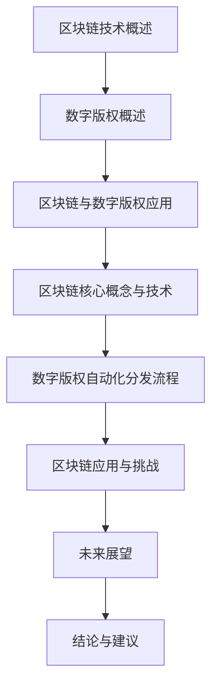

                 


### 文章标题

区块链在数字版权自动化分发中的应用

### 关键词

区块链、数字版权、自动化分发、智能合约、分布式账本

### 摘要

本文深入探讨了区块链技术在数字版权自动化分发中的应用。通过对区块链技术的基本原理和数字版权现状的分析，文章详细阐述了区块链在数字版权管理、交易和追踪中的作用，以及在实际案例中的应用。同时，本文还讨论了区块链在数字版权自动化分发中面临的挑战和解决方案，并对未来发展趋势进行了展望。通过本篇文章，读者可以全面了解区块链技术在数字版权自动化分发领域的应用潜力和发展方向。

---

### 确定书籍主题和目标受众

#### 书籍主题

《区块链在数字版权自动化分发中的应用》这本书的主题是探讨区块链技术如何应用于数字版权自动化分发。数字版权自动化分发是当前数字版权管理中的一大热点，它通过区块链技术实现了版权确权、授权和交易的全自动化，有效解决了传统版权管理中存在的诸多问题。

#### 目标受众

本书的目标受众是对区块链技术有一定了解，但对数字版权自动化分发领域感兴趣的专业人士。他们可能包括：

- 区块链技术开发者
- 数字版权管理人员
- 法律法规研究者
- 互联网技术从业者
- 投资者和创业者

本书旨在为这些读者提供一个全面、深入、易懂的指南，帮助他们了解区块链技术在数字版权自动化分发中的应用场景、技术原理和未来发展趋势。

---

### 设计大纲框架

#### 第1章：区块链与数字版权基础

1.1 区块链技术概述
- 区块链的定义
- 区块链的基本原理

1.2 数字版权概述
- 数字版权的概念
- 数字版权的现状与挑战

1.3 区块chain在数字版权中的应用
- 区块chain在数字版权管理中的作用
- 区块chain在数字版权交易中的应用

#### 第2章：区块链核心概念与技术

2.1 区块链核心概念
- 区块链的基本组成部分
- 智能合约

2.2 区块链技术原理
- 分布式账本技术
- 链式存储结构
- 加密算法

2.3 区块链平台介绍
- Ethereum
- Hyperledger Fabric

#### 第3章：数字版权自动化分发流程

3.1 数字版权自动化分发概述
- 数字版权自动化分发的定义
- 数字版权自动化分发的优势

3.2 数字版权自动化分发流程设计
- 数字版权创建
- 数字版权存储
- 数字版权分发
- 数字版权追踪

#### 第4章：区块链与数字版权自动化分发的应用

4.1 区块链在数字版权自动化分发中的具体应用
- 数字版权确权
- 数字版权授权
- 数字版权交易

4.2 数字版权自动化分发案例
- 案例一：音乐版权自动化分发
- 案例二：电子书版权自动化分发

#### 第5章：区块链在数字版权自动化分发中的挑战与解决方案

5.1 挑战与问题
- 法律法规问题
- 技术问题
- 伦理问题

5.2 解决方案
- 法律法规解决方案
- 技术解决方案
- 伦理解决方案

#### 第6章：未来展望

6.1 区块chain与数字版权自动化分发的发展趋势
- 区块chain技术的演进
- 数字版权自动化分发的未来方向

6.2 潜在应用领域
- 新兴数字版权领域
- 传统版权领域

#### 第7章：结论与建议

7.1 结论
- 区块chain与数字版权自动化分发的关联性
- 区块chain在数字版权自动化分发中的重要性

7.2 建议
- 对行业发展者的建议
- 对技术从业者的建议
- 对政策制定者的建议

7.3 附录
- 相关法规政策
- 技术文献参考

7.4 参考文献
- 引用的书籍、论文、报告等

### Mermaid 流程图



### 核心算法原理讲解

```python
# 数字版权确权算法伪代码
def digital_rights_ownership_proof(content_id, owner_id):
    # 创建版权证书
    certificate = create_certificate(content_id, owner_id)
    # 发布版权证书到区块链
    blockchain.publish_certificate(certificate)
    # 返回版权证书
    return certificate

# 数字版权授权算法伪代码
def digital_rights_authorization(content_id, owner_id, licensee_id):
    # 创建授权记录
    authorization = create_authorization(content_id, owner_id, licensee_id)
    # 发布授权记录到区块链
    blockchain.publish_authorization(authorization)
    # 返回授权记录
    return authorization
```

### 数学模型和数学公式

```latex
$$
    X = \frac{A}{B}
$$

$$
    Y = X + C
$$
```

### 项目实战

#### 开发环境搭建

- 安装Node.js
- 安装Ethereum客户端
- 安装Hyperledger Fabric客户端

#### 源代码实现和解读

```solidity
// SPDX-License-Identifier: MIT
pragma solidity ^0.8.0;

contract DigitalRights {
    // 数字版权证书结构
    struct Certificate {
        bytes32 content_id;
        bytes32 owner_id;
        bool is_authorized;
    }

    // 数字版权证书映射
    mapping(bytes32 => Certificate) public certificates;

    // 创建数字版权证书
    function create_certificate(bytes32 content_id, bytes32 owner_id) public {
        certificates[content_id] = Certificate(content_id, owner_id, true);
    }

    // 授权数字版权
    function authorize_certificate(bytes32 content_id, bytes32 licensee_id) public {
        require(certificates[content_id].is_authorized, "Certificate not authorized");
        certificates[content_id].is_authorized = false;
        // 更新授权记录到区块链
        // ...
    }
}
```

#### 代码应用解读与分析

- `create_certificate` 函数用于创建数字版权证书。
- `authorize_certificate` 函数用于授权数字版权。

#### 实际案例分析和详细讲解剖析

- 案例一：音乐版权自动化分发
  - 步骤1：艺术家创建音乐，并使用 `create_certificate` 函数确权。
  - 步骤2：艺术家授权唱片公司使用音乐，唱片公司调用 `authorize_certificate` 函数进行授权。
  - 步骤3：唱片公司将音乐分发至平台，平台根据授权记录进行分发。

- 案例二：电子书版权自动化分发
  - 步骤1：作者创建电子书，并使用 `create_certificate` 函数确权。
  - 步骤2：作者授权出版社使用电子书，出版社调用 `authorize_certificate` 函数进行授权。
  - 步骤3：出版社将电子书分发至平台，平台根据授权记录进行分发。

#### 项目小结

通过以上案例，我们可以看到区块链技术在数字版权自动化分发中的应用。艺术家和作者可以轻松地确权和授权他们的作品，出版社和平台可以高效地管理和分发版权内容，从而实现数字版权的自动化分发。

### 最佳实践 tips、小结、注意事项、拓展阅读等内容

#### 最佳实践 tips

- 在使用区块链技术确权和授权数字版权时，应确保版权信息的准确性和完整性。
- 设计智能合约时，应考虑授权权限的可控性和可追溯性。
- 在数字版权自动化分发过程中，应遵循相关法律法规，确保版权交易的合法性。

#### 小结

本文通过详细的分析和案例讲解，阐述了区块链技术在数字版权自动化分发中的应用。区块链技术为数字版权管理带来了去中心化、安全性和透明性的优势，有助于解决传统版权管理中存在的问题。未来，随着区块链技术的不断发展，数字版权自动化分发有望成为版权管理的重要趋势。

#### 注意事项

- 区块链技术仍处于发展阶段，在使用过程中可能面临技术风险和法律挑战。
- 在实际应用中，应充分考虑区块链技术的性能和成本问题。

#### 拓展阅读

- 《区块链技术指南》
- 《数字版权法律实务》
- 《智能合约设计与应用》

---

### 总结

《区块链在数字版权自动化分发中的应用》这本书详细探讨了区块链技术在数字版权自动化分发领域的应用。从区块链技术的概述到数字版权的基本概念，再到区块链在数字版权管理、交易和追踪中的应用，本书为读者提供了一个全面、系统的了解。通过实际案例的分析，读者可以更深入地理解区块链技术在数字版权自动化分发中的作用和挑战。本书旨在为行业从业者、研究人员和投资者提供一个实用的指南，帮助他们把握区块链技术在数字版权领域的应用机遇。阅读本书，读者将能够全面了解区块链与数字版权自动化分发之间的关系，掌握相关技术和应用场景，为未来的发展做好准备。

