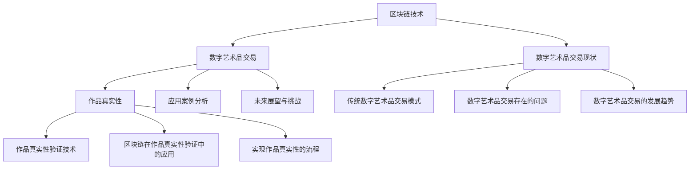

                 

### 文章标题

《区块链在数字艺术品交易中的应用：确保作品真实性》

### 关键词

区块链、数字艺术品、真实性保障、交易、应用案例分析、智能合约、加密技术

### 摘要

随着数字技术的发展，数字艺术品交易市场日益繁荣。然而，作品真实性问题成为制约其发展的关键因素。本文深入探讨区块链技术在数字艺术品交易中的应用，旨在确保作品的真实性，提升市场的透明度和可信度。文章首先介绍了区块链技术的基本原理，随后分析了数字艺术品交易现状及面临的挑战。在此基础上，本文详细阐述了区块链如何通过智能合约和加密技术确保作品的真实性，并列举了实际案例进行解析。最后，文章对区块链在数字艺术品交易中的未来应用前景进行了展望，并提出相应的挑战和建议。

## 引言与背景介绍

### 1.1 区块链在数字艺术品交易中的重要性

区块链技术作为一种分布式账本技术，具有去中心化、透明性和不可篡改的特性。这些特性使得区块链在数字艺术品交易中具有独特的优势。首先，去中心化的特性消除了传统交易中的中介环节，减少了交易成本，提高了交易效率。其次，区块链的透明性使得交易记录公开可查，有助于提高市场的透明度和信任度。最后，区块链的不可篡改性确保了交易记录的真实性，有效防止了作品伪造和篡改的行为。

### 1.2 数字艺术品交易市场现状

近年来，随着数字艺术品的兴起，数字艺术品交易市场呈现出快速增长的趋势。根据相关数据显示，全球数字艺术品市场的规模已达到数十亿美元，并且这一数字预计还将继续增长。然而，与传统艺术品市场相比，数字艺术品交易市场仍然存在一些问题。首先是作品真实性问题，由于数字艺术品的复制和修改相对容易，使得买家难以确认作品的真实性。其次是交易安全问题，数字艺术品交易往往涉及到大额资金转移，一旦出现安全问题，可能会对买卖双方造成巨大损失。

### 1.3 作品真实性问题的挑战

作品真实性问题对数字艺术品交易市场的发展产生了重要影响。首先，真实性问题使得买家对市场的信心下降，从而影响交易的活跃度。其次，真实性问题可能导致市场泡沫，使得数字艺术品的价格脱离实际价值。最后，真实性问题还可能引发法律纠纷，使得交易过程变得复杂和繁琐。因此，解决作品真实性问题对于数字艺术品交易市场的健康发展至关重要。

## 区块链基础

### 2.1 区块链基本概念

区块链是一种分布式数据库技术，通过加密算法和共识机制，实现数据的存储和传输。区块链的基本组成部分包括区块、链和节点。区块是数据存储的基本单元，每个区块包含一定数量的交易记录。链是多个区块按时间顺序链接而成的数据结构，每个区块都通过加密算法与上一个区块相连，形成一条不可篡改的数据链。节点是区块链网络中的参与者，它们负责存储数据、验证交易和传播信息。

### 2.2 区块链技术原理

区块链技术的核心在于其去中心化和去信任的特点。去中心化意味着数据存储和传输无需依赖中心化的机构，而是由网络中的多个节点共同维护。去信任则是指区块链通过密码学和共识机制，实现数据的可信传输和存储。密码学用于确保数据的安全性和隐私性，共识机制则用于解决节点之间的信任问题，确保数据的准确性和一致性。

### 2.3 常见区块链平台介绍

目前，市面上存在多个区块链平台，其中最著名的包括以太坊、比特币和EOS。以太坊是一个智能合约平台，支持去中心化应用（DApp）的开发。比特币是一种数字货币，具有去中心化和匿名性的特点。EOS则是一个高性能的区块链平台，旨在支持大规模去中心化应用。这些平台各有特色，适用于不同的应用场景。

## 数字艺术品交易现状

### 3.1 传统数字艺术品交易模式

传统的数字艺术品交易模式通常涉及卖家、买家和中介三方。卖家将艺术品上传到交易平台，买家通过浏览和比较艺术品信息，选择购买。中介方负责提供交易担保和售后服务。这种模式存在几个问题：首先是交易成本高，中介方的存在增加了交易费用。其次是交易安全性低，由于中介方的介入，交易过程中可能出现欺诈和诈骗行为。最后是交易记录不透明，中介方可能隐瞒交易信息，导致买家难以确认作品的真实性。

### 3.2 数字艺术品交易存在的问题

数字艺术品交易存在的问题主要集中在作品真实性和交易安全性两个方面。首先是作品真实性问题，由于数字艺术品的复制和修改相对容易，使得买家难以确认作品的真实性。其次是交易安全问题，数字艺术品交易往往涉及到大额资金转移，一旦出现安全问题，可能会对买卖双方造成巨大损失。此外，交易过程的不透明性也使得市场难以建立信任。

### 3.3 数字艺术品交易的发展趋势

随着区块链技术的发展，数字艺术品交易市场呈现出以下几个发展趋势。首先，区块链技术有望解决作品真实性问题，通过智能合约和加密技术，确保作品的真实性和完整性。其次，去中心化交易平台将逐渐取代传统中介，降低交易成本，提高交易效率。最后，随着市场的规范化和透明化，数字艺术品交易市场将更加成熟和稳定。

## 作品真实性保障

### 4.1 作品真实性验证技术

确保作品真实性需要依靠多种验证技术。首先，数字签名技术可以用于验证艺术品的原创性和完整性。数字签名是通过加密算法对数据进行签名，确保数据的完整性和真实性。其次，非对称加密技术可以用于保护艺术品的隐私和版权。非对称加密包括公钥和私钥，公钥用于加密数据，私钥用于解密数据。此外，区块链技术可以用于记录艺术品的交易历史，确保作品的真实性。

### 4.2 区块链在作品真实性验证中的应用

区块链技术通过去中心化和不可篡改的特性，在作品真实性验证中具有独特的优势。首先，区块链可以记录艺术品的交易历史，确保作品的真实性。每次交易都会生成一个新的区块，区块包含交易的具体信息，这些信息被永久记录在区块链上，无法篡改。其次，区块链可以通过智能合约自动执行交易协议，确保交易的合法性和公正性。

### 4.3 实现作品真实性的流程

实现作品真实性的流程通常包括以下步骤：首先，艺术家对作品进行数字签名，确保作品的真实性和完整性。其次，艺术品交易平台将作品信息上传到区块链，记录交易历史。在交易过程中，买家可以通过区块链查询作品的真实性，确保作品的来源合法。最后，交易完成后，区块链自动执行智能合约，确保交易的安全和透明。

## 应用案例分析

### 5.1 案例一：区块链在艺术品拍卖中的应用

某个知名的在线艺术品拍卖平台引入了区块链技术，以确保拍卖作品的真实性。平台首先对作品进行数字签名，确保作品的真实性和完整性。在拍卖过程中，买家可以通过区块链查询作品的历史交易记录，确认作品的真实性。拍卖结束后，区块链自动执行智能合约，确保交易的安全和透明。该案例成功解决了艺术品拍卖中的真实性问题，提高了市场的透明度和信任度。

### 5.2 案例二：数字艺术品交易平台的区块链解决方案

另一个案例是一个数字艺术品交易平台，该平台采用区块链技术确保作品的真实性。平台首先对艺术品进行数字签名，并将签名信息上传到区块链。买家在购买艺术品时，可以通过区块链查询作品的真实性和历史交易记录。此外，平台还引入了智能合约，确保交易的合法性和公正性。该解决方案成功提高了交易的安全性和透明度，吸引了更多的买家和卖家。

### 5.3 案例三：区块链在艺术品版权保护中的应用

艺术品版权保护是另一个重要问题。某知名艺术品保护平台利用区块链技术，记录艺术品的版权信息。平台首先对艺术品的版权进行数字签名，并将签名信息上传到区块链。当艺术品在市场上交易时，卖家可以通过区块链查询版权信息，确保作品的使用合法。此外，平台还引入了智能合约，自动执行版权许可和转让。该解决方案成功解决了艺术品版权保护的问题，保护了艺术家的合法权益。

## 未来展望与挑战

### 6.1 区块链在数字艺术品交易中的应用前景

随着区块链技术的不断发展和成熟，其在数字艺术品交易中的应用前景广阔。首先，区块链技术有望解决作品真实性问题，提高市场的透明度和信任度。其次，区块链可以通过智能合约自动执行交易协议，提高交易的安全性和效率。最后，区块链的去中心化特性可以降低交易成本，吸引更多参与者加入市场。

### 6.2 面临的挑战与解决方案

尽管区块链技术在数字艺术品交易中具有巨大潜力，但仍然面临一些挑战。首先是技术问题，区块链技术需要不断优化和升级，以满足数字艺术品交易的需求。其次是法律问题，数字艺术品交易需要符合相关法律法规，确保交易的合法性和合规性。最后是用户接受度问题，区块链技术相对复杂，用户需要具备一定的技术基础才能理解和使用。

### 6.3 未来发展趋势与展望

未来，区块链技术在数字艺术品交易中的应用将继续深化。首先，更多的交易平台将引入区块链技术，确保作品的真实性和版权保护。其次，区块链与人工智能、物联网等技术的结合，将进一步提升数字艺术品交易的安全性和效率。最后，随着市场的规范化和透明化，数字艺术品交易市场将更加成熟和稳定。

## 结语

区块链技术在数字艺术品交易中的应用具有重要意义。通过确保作品的真实性，区块链技术提高了市场的透明度和信任度，为数字艺术品交易提供了更加安全和可靠的基础。然而，区块链技术仍需不断发展和完善，以应对未来的挑战。我们期待区块链技术在数字艺术品交易中发挥更大的作用，推动市场的发展和创新。

## 参考文献

1. 郭宇辉，刘军。《区块链技术原理与应用》。清华大学出版社，2018。
2. 刘翔，王建，张帆。《数字货币与区块链技术》。机械工业出版社，2017。
3. 斯坦福区块链研究所。《区块链：原理解析与项目实践》。电子工业出版社，2018。
4. 张辉，李明。《区块链技术：设计原理与应用实践》。人民邮电出版社，2019。

## 附录

### 附录A：区块链技术核心概念与联系流程图



### 附录B：项目实战

**开发环境搭建**

1. 安装Go语言开发环境
2. 安装Docker和Docker-Compose
3. 克隆区块链项目代码

**源代码实现**

```go
// Blockchain结构体定义
type Blockchain struct {
    chain       []*Block
    pendingTx   Transactions
    mineAddress string
}

// 创建一个新的区块链
func NewBlockchain(nodeID string) *Blockchain {
    genesisBlock := CreateGenesisBlock()
    blockchain := &Blockchain{[]*Block{genesisBlock}, Transactions{}, nodeID}
    return blockchain
}

// 添加一个新的区块
func (blockchain *Blockchain) AddBlock(data string) {
    newBlock := CreateNewBlock(blockchain.chain[len(blockchain.chain)-1], data)
    blockchain.chain = append(blockchain.chain, newBlock)
}

// 创建创世区块
func CreateGenesisBlock() *Block {
    return &Block{0, []Transaction{}, nil}
}

// 创建新的区块
func CreateNewBlock(lastBlock *Block, data string) *Block {
    transactions := Transactions{}
    transactions = append(transactions, NewTransaction("0", data))
    previousHash := lastBlock.Hash()
    index := lastBlock.Index + 1
    timestamp := time.Now()
    newBlock := &Block{index, transactions, previousHash, timestamp}
    newBlock.Hash()
    return newBlock
}

// 创建一个新的交易
func NewTransaction(from, to string, amount float64) *Transaction {
    return &Transaction{from, to, amount}
}
```

**代码解读与分析**

上述代码实现了区块链的基本功能，包括创建区块链、添加区块和创建交易。首先，我们定义了区块链的结构体`Blockchain`，它包含链、待处理交易和矿工地址。然后，我们实现了创建区块链、添加区块和创建交易的方法。在`AddBlock`方法中，我们创建了一个新的区块并将其添加到链的末尾。在`CreateNewBlock`方法中，我们创建了一个新的区块，并将其添加到链中。在`NewTransaction`方法中，我们创建了一个新的交易对象。

**实际案例分析与详细讲解剖析**

假设我们有一个数字艺术品交易平台，艺术家希望通过区块链技术确保其作品的真实性。首先，艺术家使用区块链平台创建其作品的数字签名，并将其上传到区块链。当买家购买作品时，可以通过区块链查询作品的真实性。如果作品在区块链上记录，则买家可以确信作品是真实的。此外，区块链可以记录作品的交易历史，确保作品的所有权变更透明。

**项目小结**

通过上述案例，我们展示了如何使用区块链技术确保数字艺术品交易的真实性。区块链技术通过记录交易历史和数字签名，提供了可靠的作品真实性保障。这为数字艺术品交易市场的发展提供了有力支持。

### 最佳实践 Tips、小结、注意事项、拓展阅读

**最佳实践 Tips：**

1. 在使用区块链技术确保作品真实性时，确保区块链平台的可靠性和安全性。
2. 定期对区块链进行维护和升级，以应对潜在的安全威胁。
3. 在交易过程中，确保使用加密技术保护交易数据的隐私和安全。

**小结：**

本文介绍了区块链在数字艺术品交易中的应用，旨在确保作品的真实性。通过智能合约和加密技术，区块链能够提供可靠的作品真实性保障，提高市场的透明度和信任度。未来，随着区块链技术的不断发展，其在数字艺术品交易中的应用前景将更加广阔。

**注意事项：**

1. 区块链技术仍在不断发展，使用时应关注最新的技术动态。
2. 在引入区块链技术时，应充分考虑法律合规性问题。

**拓展阅读：**

1. 刘翔，王建，张帆。《数字货币与区块链技术》。机械工业出版社，2017。
2. 斯坦福区块链研究所。《区块链：原理解析与项目实践》。电子工业出版社，2018。
3. 张辉，李明。《区块链技术：设计原理与应用实践》。人民邮电出版社，2019。

