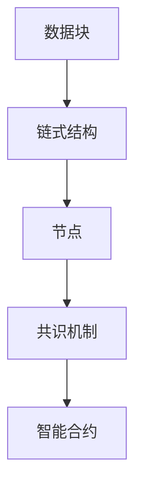
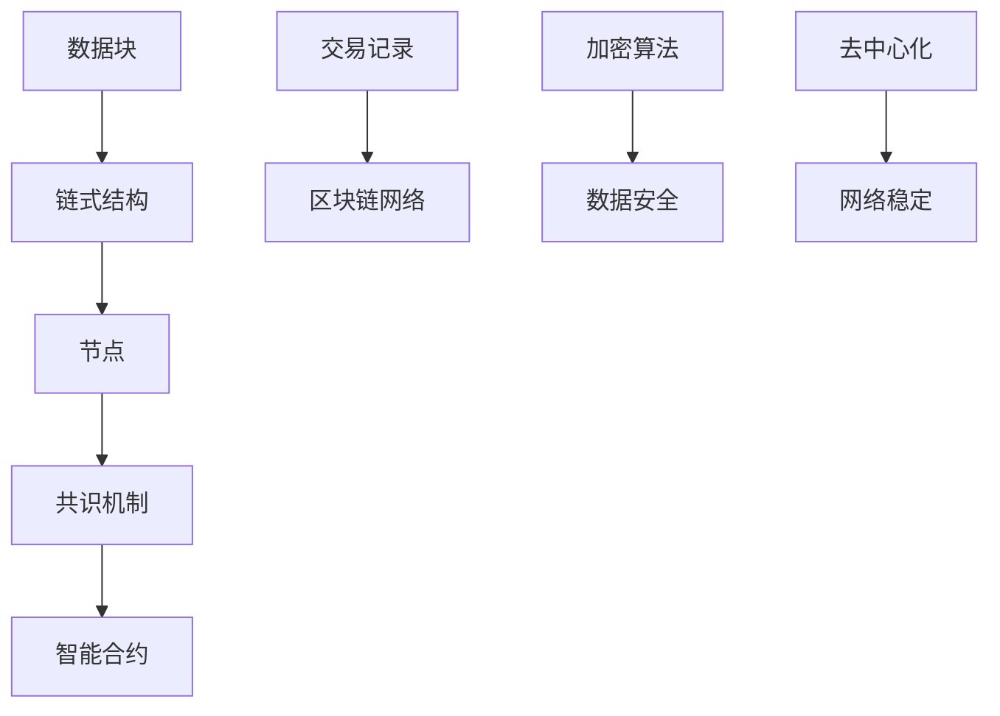

                 

### 文章标题

《区块链在数字艺术品交易中的应用：确保艺术品真实性》

### 关键词

区块链、数字艺术品交易、真实性验证、安全性、透明度、去中心化

### 摘要

随着数字技术的发展，数字艺术品市场日益繁荣，然而艺术品真实性成为交易中的关键问题。本文通过深入分析区块链技术在数字艺术品交易中的应用，探讨了如何利用区块链技术确保艺术品真实性。文章首先介绍了区块链的基本原理和核心组件，然后分析了数字艺术品交易中的问题与挑战，接着详细阐述了区块链在数字艺术品登记、交易和所有权转移中的应用，以及真实性验证技术的原理和实现方法。最后，本文通过实际案例展示了区块链在确保数字艺术品真实性方面的应用效果，并提出了一些最佳实践和建议。

### 引言

#### 区块链在数字艺术品交易中的重要性

数字艺术品交易是随着数字技术的发展而兴起的一个新兴领域。随着区块链技术的逐渐成熟，其在数字艺术品交易中的应用变得越来越重要。区块链作为一种分布式账本技术，具有去中心化、不可篡改、透明性和安全性等特点，能够有效解决数字艺术品交易中的信任问题，确保艺术品的真实性和可追溯性。

首先，区块链的去中心化特性使得数字艺术品交易不再依赖于中央权威机构，减少了交易成本，提高了交易效率。传统艺术品交易往往需要经过多个中间环节，而区块链技术则可以将这些环节简化，使得交易过程更加直接和高效。

其次，区块链的不可篡改特性确保了交易记录的完整性和可靠性。一旦数据上链，便不可篡改，这为数字艺术品交易提供了一个不可质疑的信任基础，解决了传统交易中常常出现的欺诈和造假问题。

再次，区块链的透明性使得交易过程公开透明，所有参与者都可以查看交易记录，提高了交易的透明度。这种透明性不仅有助于提高市场的信任度，还能够帮助买家和卖家更好地了解交易过程，减少纠纷。

最后，区块链的安全性能有效保护数字艺术品的知识产权，防止未经授权的复制和传播。在数字艺术品交易中，知识产权保护是一个至关重要的问题，区块链技术能够提供一种有效的保护机制。

总之，区块链技术在数字艺术品交易中的应用具有重要意义，它不仅能够提高交易的安全性和透明度，还能够减少交易成本，提高交易效率。随着区块链技术的不断发展和完善，其在数字艺术品交易中的应用前景将更加广阔。

#### 书籍目标与读者群体

本文的目标是深入探讨区块链技术在数字艺术品交易中的应用，特别是如何确保艺术品的真实性。通过详细分析区块链技术的原理和实现方法，结合实际案例，本文旨在为读者提供一个全面、系统的理解，帮助他们在实际操作中更好地应用区块链技术。

本书的读者群体主要包括以下几类：

1. **数字艺术品交易从业者**：包括艺术品卖家、买家、交易中介和相关从业者，他们希望通过了解区块链技术来提高交易的安全性和透明度，降低交易成本。

2. **区块链技术爱好者**：对区块链技术有浓厚兴趣的技术爱好者，希望通过本文深入了解区块链技术在数字艺术品交易中的应用。

3. **研究人员与学者**：从事区块链技术和数字艺术品交易研究的科研人员，通过本文可以获取最新的研究动态和应用实例。

4. **教育工作者**：使用本文作为教学资料，帮助学生和研究生深入了解区块链技术及其在数字艺术品交易中的应用。

本书将从以下几个方面展开讨论：

1. **区块链技术基础**：介绍区块链的基本原理、核心组件和发展历程，帮助读者建立对区块链技术的全面理解。

2. **数字艺术品交易概述**：分析数字艺术品市场的发展趋势、交易中的问题与挑战以及需求分析，为后续讨论区块链应用提供背景。

3. **区块链在数字艺术品交易中的应用**：详细探讨区块链在数字艺术品登记、交易和所有权转移中的应用，包括技术实现和实际案例。

4. **真实性验证技术**：介绍真实性验证技术的原理和实现方法，讨论其在数字艺术品交易中的应用。

5. **法律法规与监管**：分析区块链在数字艺术品交易中的法律法规框架和监管问题，探讨未来发展趋势。

6. **案例分析**：通过具体案例展示区块链技术在数字艺术品交易中的应用效果，提供实际操作经验和启示。

7. **结论与展望**：总结本文的主要观点，分析未来发展趋势，提出最佳实践和建议。

通过以上七个方面的深入讨论，本文希望能够为区块链技术在数字艺术品交易中的应用提供全面、系统的指导，为相关领域的研究和实践提供参考。

### 第1章：区块链技术基础

#### 区块链的概念与原理

区块链是一种分布式数据库技术，通过将数据分散存储在多个节点上，形成一种去中心化的网络结构。每个节点都保存一份完整的数据副本，并通过加密算法确保数据的真实性和完整性。区块链的基本原理可以概括为以下四个方面：

1. **数据存储**：区块链通过将数据分块存储在各个节点上，每个节点都保存了一份完整的数据副本。这种去中心化的存储方式不仅提高了数据的可靠性，还防止了单点故障和数据丢失的风险。

2. **共识机制**：区块链通过共识机制确保所有节点上的数据一致性。共识机制有多种类型，如工作量证明（Proof of Work，PoW）、权益证明（Proof of Stake，PoS）等。共识机制的核心目的是防止恶意节点篡改数据，确保区块链网络的稳定和安全。

3. **加密算法**：区块链采用多种加密算法来保护数据的安全性和隐私性。常见的加密算法包括哈希函数、非对称加密和对称加密等。加密算法不仅能够确保数据的不可篡改性，还能够保护数据的隐私。

4. **去中心化**：区块链的去中心化特性使其不依赖于中央权威机构，每个节点都有平等的权力和义务。这种去中心化的网络结构不仅提高了网络的可靠性，还降低了交易成本，提高了交易效率。

#### 区块链的核心组件

区块链由多个核心组件构成，包括数据块、链式结构、节点和智能合约等。以下是这些组件的简要介绍：

1. **数据块**：数据块是区块链的基本存储单元，包含一定数量的交易记录。每个数据块都有一个唯一的标识符，称为哈希值。数据块通过链式结构连接起来，形成区块链。

2. **链式结构**：区块链采用链式结构存储数据，每个数据块都包含一个指向前一个数据块的哈希值。这种链式结构不仅确保了数据的可追溯性，还能够防止数据篡改。

3. **节点**：节点是区块链网络中的参与方，每个节点都保存了一份完整的数据副本。节点通过共识机制达成一致，确保区块链数据的正确性。节点可以是个人计算机、服务器或其他设备。

4. **智能合约**：智能合约是区块链上的可编程合约，能够自动执行预先定义的合同条款。智能合约通过编程语言编写，运行在区块链上，确保了合同的自动化和不可篡改性。

#### 区块链的发展历程

区块链技术起源于比特币的发明，比特币是一种基于区块链的去中心化数字货币。自2009年比特币问世以来，区块链技术经历了多个发展阶段：

1. **初始阶段（2009-2013）**：比特币的问世标志着区块链技术的诞生。在这个阶段，区块链主要应用于数字货币领域，如比特币、莱特币等。

2. **扩展阶段（2014-2016）**：随着比特币的兴起，区块链技术的潜在应用逐渐被发掘。这个阶段，区块链开始应用于更多领域，如供应链管理、智能合约等。

3. **成熟阶段（2017-2020）**：区块链技术逐渐成熟，越来越多的企业和机构开始关注并应用区块链技术。这个阶段，区块链应用的范围不断扩大，涵盖了金融、医疗、物流等多个领域。

4. **应用阶段（2021-至今）**：区块链技术进入广泛应用阶段，越来越多的行业开始采用区块链技术解决实际问题。同时，区块链与其他技术的融合，如人工智能、大数据等，为区块链技术的发展提供了新的机遇。

#### 区块链的核心概念与联系

区块链的核心概念包括数据块、链式结构、节点和智能合约等。以下是这些概念之间的联系和关系：

1. **数据块与链式结构**：数据块是区块链的基本存储单元，通过链式结构连接起来，形成区块链。链式结构确保了数据的可追溯性和不可篡改性。

2. **节点与共识机制**：节点是区块链网络中的参与方，通过共识机制达成一致，确保区块链数据的正确性。共识机制有多种类型，如PoW、PoS等。

3. **智能合约与区块链**：智能合约是区块链上的可编程合约，能够自动执行预先定义的合同条款。智能合约运行在区块链上，确保了合同的自动化和不可篡改性。

以下是一个简单的Mermaid流程图，展示区块链的核心概念之间的联系：



#### 区块链的核心概念与联系（续）

在上一个段落中，我们介绍了区块链的核心概念及其基本联系。接下来，我们将进一步探讨这些概念在实际应用中的具体表现和相互关系。

首先，数据块是区块链的基本存储单元，每个数据块包含一定数量的交易记录。数据块通过哈希函数生成唯一的哈希值，并将其作为标识符。这种哈希值不仅确保了数据块的唯一性，还能够快速定位和检索数据。

其次，链式结构是区块链数据存储的核心机制。每个数据块都包含一个指向前一个数据块的哈希值，形成一种链式结构。这种链式结构不仅保证了数据的可追溯性，还能够防止数据篡改。因为一旦数据被篡改，篡改后的数据块哈希值会发生变化，从而导致整个链式结构失效。

节点是区块链网络中的参与方，每个节点都保存了一份完整的数据副本。节点通过共识机制达成一致，确保区块链数据的正确性。共识机制有多种类型，如工作量证明（PoW）、权益证明（PoS）等。PoW机制通过计算复杂度确保节点之间的竞争平衡，PoS机制则通过持有代币数量决定节点的权重。

智能合约是区块链上的可编程合约，能够自动执行预先定义的合同条款。智能合约运行在区块链上，确保了合同的自动化和不可篡改性。智能合约的编程语言通常为Solidity等专门为区块链设计的语言。

以下是一个简单的Mermaid流程图，展示区块链的核心概念在实际应用中的具体表现和相互关系：



#### 区块链的核心概念与联系（总结）

通过前面的段落，我们详细探讨了区块链的核心概念，包括数据块、链式结构、节点和智能合约等，并分析了它们之间的联系和相互关系。以下是这些核心概念的总结：

1. **数据块**：数据块是区块链的基本存储单元，包含一定数量的交易记录。数据块通过哈希函数生成唯一的哈希值，作为标识符，确保数据的唯一性和可追溯性。

2. **链式结构**：链式结构是区块链数据存储的核心机制，每个数据块都包含一个指向前一个数据块的哈希值，形成一种链式结构。这种链式结构不仅保证了数据的可追溯性，还能够防止数据篡改。

3. **节点**：节点是区块链网络中的参与方，每个节点都保存了一份完整的数据副本。节点通过共识机制达成一致，确保区块链数据的正确性。共识机制有多种类型，如PoW和PoS。

4. **智能合约**：智能合约是区块链上的可编程合约，能够自动执行预先定义的合同条款。智能合约运行在区块链上，确保了合同的自动化和不可篡改性。

这些核心概念相互关联，共同构成了区块链技术的核心框架。数据块是基础，链式结构保证了数据的完整性，节点和共识机制确保了网络的稳定性和数据的正确性，智能合约则提供了自动化和智能化的合同执行功能。

以下是一个简化的Mermaid流程图，展示区块链的核心概念及其相互关系：


通过这一流程图，我们可以更直观地理解区块链的核心概念及其相互关系。这些核心概念共同构成了区块链技术的基础，使得区块链能够实现去中心化、不可篡改、透明和安全的特性，为各种应用提供了强大的支持。

### 第2章：数字艺术品交易概述

#### 数字艺术品市场的发展趋势

数字艺术品市场近年来呈现出迅猛的发展态势，这主要得益于数字技术的不断进步和互联网的普及。以下是数字艺术品市场的发展趋势：

1. **市场规模的扩大**：随着越来越多的人接受和认可数字艺术品，市场的规模不断扩大。根据市场研究机构的统计数据，全球数字艺术品市场的规模在近几年内呈现出高速增长的趋势。

2. **交易形式的多样化**：数字艺术品交易不再局限于传统的线上平台，还包括虚拟画廊、艺术品拍卖会、数字货币交易平台等多种形式。这些多样化的交易形式不仅为消费者提供了更多的选择，也为市场注入了新的活力。

3. **艺术品类型的丰富**：数字艺术品的类型也越来越丰富，包括数字绘画、虚拟雕塑、数字音乐、电子游戏等。这些艺术品的创作和交易方式与传统艺术品有很大不同，为市场带来了新的机遇和挑战。

4. **技术创新的推动**：区块链、人工智能、虚拟现实等新兴技术的应用，为数字艺术品市场的发展提供了新的动力。这些技术创新不仅提高了艺术品交易的安全性和透明度，还改变了艺术品创作和传播的方式。

#### 数字艺术品交易中的问题与挑战

尽管数字艺术品市场发展迅速，但在交易过程中仍然面临许多问题和挑战：

1. **艺术品真伪问题**：数字艺术品由于其数字化的特性，容易受到伪造和篡改的风险。如何在交易过程中确保艺术品的真实性，成为市场面临的一大难题。

2. **所有权问题**：数字艺术品的所有权问题复杂多变。传统艺术品可以通过物理手段证明所有权，而数字艺术品的所有权则需要通过技术手段进行确认和保障。

3. **交易透明度**：数字艺术品交易过程的透明度相对较低，交易双方的信息不对称问题较为严重。这增加了交易的风险，也影响了市场的信任度。

4. **法律监管**：数字艺术品交易涉及的法律法规尚不完善，不同国家和地区的法律差异较大。这为市场的发展带来了一定的不确定性。

5. **技术风险**：数字艺术品交易依赖于互联网和数字技术，一旦技术出现故障或遭到攻击，可能会导致数据丢失或交易失败。因此，如何保障交易的技术安全也是一个重要的挑战。

#### 数字艺术品交易的需求分析

为了解决数字艺术品交易中的问题和挑战，市场提出了以下需求：

1. **真实性验证**：市场需要一种有效的手段来确保数字艺术品的真实性，避免伪造和篡改现象的发生。区块链技术因其不可篡改和透明性的特点，成为实现这一需求的重要工具。

2. **所有权转移**：市场需要一种简单、安全和高效的手段来确认和转移数字艺术品的所有权。区块链技术通过智能合约可以自动执行所有权转移，提高了交易效率。

3. **透明度和可追溯性**：市场需要提高交易的透明度和可追溯性，以便交易双方能够更好地了解交易过程，减少纠纷。区块链技术通过公开透明的交易记录，实现了这一目标。

4. **安全性保障**：市场需要保障交易的安全，防止数据泄露和恶意攻击。区块链技术通过加密算法和分布式存储，提高了交易的安全性。

5. **法律合规性**：市场需要建立完善的法律法规体系，以确保数字艺术品交易的合法性和合规性。区块链技术的应用可以提供一些新的法律合规性解决方案。

通过满足这些需求，数字艺术品交易市场将能够更加健康、稳定地发展，为参与者带来更多的机遇和便利。

### 第3章：区块链在数字艺术品交易中的应用

#### 区块链在数字艺术品登记中的应用

区块链技术在数字艺术品登记中的应用具有重要意义，它可以确保艺术品的登记信息真实、可靠且不可篡改。以下是区块链在数字艺术品登记中应用的详细步骤：

1. **艺术品信息上链**：首先，艺术家或艺术品所有者将艺术品的详细信息，如作品名称、创作时间、创作者身份等，上传到区块链网络。这些信息将被打包成数据块，并使用哈希函数生成唯一的哈希值。

2. **数据块生成**：每个数据块包含一定数量的艺术品信息，这些信息将被打包成一个结构化数据集，并附上时间戳。时间戳确保了信息的时效性，防止篡改。

3. **数据块验证**：数据块在被添加到区块链之前，需要经过网络中其他节点的验证。节点通过共识机制，如PoW或PoS，来确认数据块的合法性和正确性。

4. **数据块存储**：一旦数据块经过验证，它将被添加到区块链的末端，与现有的链式结构相连。每个节点都会保存一份完整的数据副本，确保数据的不可篡改性和完整性。

5. **透明性保障**：区块链网络中的所有参与者都可以查看和验证艺术品的登记信息。这种透明性不仅提高了市场的信任度，还减少了欺诈和造假的可能性。

通过上述步骤，区块链技术为数字艺术品的登记提供了可靠的技术保障，确保了登记信息的真实性和不可篡改性。以下是一个简化的伪代码示例，展示了艺术品信息上链的过程：

```python
# 上传艺术品信息到区块链
def upload_artifact_info(artifact_info):
    # 将艺术品信息打包成数据块
    data_block = package_data(artifact_info)
    
    # 生成数据块的哈希值
    hash_value = generate_hash(data_block)
    
    # 添加时间戳
    data_block["timestamp"] = get_timestamp()
    
    # 验证数据块
    if validate_data_block(data_block):
        # 添加数据块到区块链
        add_data_block_to_chain(data_block)
        
        # 更新节点数据副本
        update_node_copy(data_block)
        
        return "Artifact info uploaded successfully."
    else:
        return "Invalid data block. Upload failed."

# 数据块打包函数
def package_data(artifact_info):
    data_block = {
        "artifact_info": artifact_info,
        "hash_value": generate_hash(artifact_info),
        "timestamp": get_timestamp()
    }
    return data_block

# 生成哈希值
def generate_hash(data):
    # 使用哈希函数生成哈希值
    return hash(data)

# 获取时间戳
def get_timestamp():
    # 获取当前时间戳
    return time.time()

# 验证数据块
def validate_data_block(data_block):
    # 验证数据块是否合法
    return is_valid_data_block(data_block)

# 添加数据块到区块链
def add_data_block_to_chain(data_block):
    # 将数据块添加到区块链的末端
    blockchain.append(data_block)

# 更新节点数据副本
def update_node_copy(data_block):
    # 更新节点的数据副本
    node_copy[data_block["hash_value"]] = data_block
```

#### 区块链在数字艺术品交易中的应用

区块链技术在数字艺术品交易中的应用极大地提高了交易的安全性和透明度。以下是区块链在数字艺术品交易中的具体应用步骤：

1. **交易信息上链**：在艺术品交易过程中，交易双方将交易信息（如买家、卖家、艺术品信息、交易价格等）上传到区块链网络。这些信息将被打包成数据块，并使用哈希函数生成唯一的哈希值。

2. **数据块生成**：每个数据块包含一定数量的交易信息，这些信息将被打包成一个结构化数据集，并附上时间戳。时间戳确保了交易的时效性，防止篡改。

3. **数据块验证**：数据块在被添加到区块链之前，需要经过网络中其他节点的验证。节点通过共识机制，如PoW或PoS，来确认数据块的合法性和正确性。

4. **数据块存储**：一旦数据块经过验证，它将被添加到区块链的末端，与现有的链式结构相连。每个节点都会保存一份完整的数据副本，确保数据的不可篡改性和完整性。

5. **交易确认**：交易信息上链后，交易双方可以通过区块链网络中的节点来确认交易状态。一旦交易信息被多个节点验证，交易即可被视为确认完成。

6. **透明性保障**：区块链网络中的所有参与者都可以查看和验证交易信息，这种透明性不仅提高了市场的信任度，还减少了欺诈和造假的可能性。

通过上述步骤，区块链技术为数字艺术品交易提供了可靠的技术保障，确保了交易信息的真实性和不可篡改性。以下是一个简化的伪代码示例，展示了交易信息上链的过程：

```python
# 上传交易信息到区块链
def upload_trade_info(trade_info):
    # 将交易信息打包成数据块
    data_block = package_data(trade_info)
    
    # 生成数据块的哈希值
    hash_value = generate_hash(data_block)
    
    # 添加时间戳
    data_block["timestamp"] = get_timestamp()
    
    # 验证数据块
    if validate_data_block(data_block):
        # 添加数据块到区块链
        add_data_block_to_chain(data_block)
        
        # 更新节点数据副本
        update_node_copy(data_block)
        
        return "Trade info uploaded successfully."
    else:
        return "Invalid data block. Upload failed."

# 交易信息打包函数
def package_data(trade_info):
    data_block = {
        "trade_info": trade_info,
        "hash_value": generate_hash(trade_info),
        "timestamp": get_timestamp()
    }
    return data_block

# 生成哈希值
def generate_hash(data):
    # 使用哈希函数生成哈希值
    return hash(data)

# 获取时间戳
def get_timestamp():
    # 获取当前时间戳
    return time.time()

# 验证数据块
def validate_data_block(data_block):
    # 验证数据块是否合法
    return is_valid_data_block(data_block)

# 添加数据块到区块链
def add_data_block_to_chain(data_block):
    # 将数据块添加到区块链的末端
    blockchain.append(data_block)

# 更新节点数据副本
def update_node_copy(data_block):
    # 更新节点的数据副本
    node_copy[data_block["hash_value"]] = data_block
```

#### 区块链在数字艺术品所有权转移中的应用

区块链技术在数字艺术品所有权转移中的应用能够有效解决传统交易模式中的所有权确认问题。以下是区块链在数字艺术品所有权转移中的具体应用步骤：

1. **所有权信息上链**：在艺术品所有权转移过程中，新的所有者将所有权信息（如艺术品信息、原所有者、新所有者等）上传到区块链网络。这些信息将被打包成数据块，并使用哈希函数生成唯一的哈希值。

2. **数据块生成**：每个数据块包含一定数量的所有权转移信息，这些信息将被打包成一个结构化数据集，并附上时间戳。时间戳确保了所有权转移的时效性，防止篡改。

3. **数据块验证**：数据块在被添加到区块链之前，需要经过网络中其他节点的验证。节点通过共识机制，如PoW或PoS，来确认数据块的合法性和正确性。

4. **数据块存储**：一旦数据块经过验证，它将被添加到区块链的末端，与现有的链式结构相连。每个节点都会保存一份完整的数据副本，确保数据的不可篡改性和完整性。

5. **智能合约执行**：区块链中的智能合约将自动执行所有权转移操作。智能合约根据预设的规则，验证新所有者的身份，并更新艺术品的所有权信息。

6. **透明性保障**：区块链网络中的所有参与者都可以查看和验证所有权转移信息，这种透明性不仅提高了市场的信任度，还减少了欺诈和造假的可能性。

通过上述步骤，区块链技术为数字艺术品的所有权转移提供了可靠的技术保障，确保了所有权转移的真实性和不可篡改性。以下是一个简化的伪代码示例，展示了所有权转移信息上链的过程：

```python
# 上传所有权转移信息到区块链
def upload_ownership_transfer_info(ownership_transfer_info):
    # 将所有权转移信息打包成数据块
    data_block = package_data(ownership_transfer_info)
    
    # 生成数据块的哈希值
    hash_value = generate_hash(data_block)
    
    # 添加时间戳
    data_block["timestamp"] = get_timestamp()
    
    # 验证数据块
    if validate_data_block(data_block):
        # 添加数据块到区块链
        add_data_block_to_chain(data_block)
        
        # 执行智能合约
        execute_smart_contract(data_block)
        
        # 更新节点数据副本
        update_node_copy(data_block)
        
        return "Ownership transfer info uploaded successfully."
    else:
        return "Invalid data block. Upload failed."

# 所有权转移信息打包函数
def package_data(ownership_transfer_info):
    data_block = {
        "ownership_transfer_info": ownership_transfer_info,
        "hash_value": generate_hash(ownership_transfer_info),
        "timestamp": get_timestamp()
    }
    return data_block

# 生成哈希值
def generate_hash(data):
    # 使用哈希函数生成哈希值
    return hash(data)

# 获取时间戳
def get_timestamp():
    # 获取当前时间戳
    return time.time()

# 验证数据块
def validate_data_block(data_block):
    # 验证数据块是否合法
    return is_valid_data_block(data_block)

# 添加数据块到区块链
def add_data_block_to_chain(data_block):
    # 将数据块添加到区块链的末端
    blockchain.append(data_block)

# 更新节点数据副本
def update_node_copy(data_block):
    # 更新节点的数据副本
    node_copy[data_block["hash_value"]] = data_block

# 执行智能合约
def execute_smart_contract(data_block):
    # 根据智能合约的规则，执行所有权转移
    if verify_ownership_transfer(data_block["ownership_transfer_info"]):
        update_ownership(data_block["ownership_transfer_info"])
    else:
        raise ValueError("Invalid ownership transfer.")

# 验证所有权转移
def verify_ownership_transfer(ownership_transfer_info):
    # 验证所有权转移信息的合法性
    return is_valid_ownership_transfer(ownership_transfer_info)

# 更新所有权
def update_ownership(ownership_transfer_info):
    # 更新艺术品的所有权信息
    artifact["owner"] = ownership_transfer_info["new_owner"]
```

### 第4章：真实性验证技术

#### 数字艺术品真实性验证的需求分析

在数字艺术品交易中，真实性验证是一项至关重要的任务。随着数字艺术品市场的迅速发展，艺术品真伪问题越来越受到关注。以下是数字艺术品真实性验证的需求分析：

1. **确保艺术品来源可靠**：在数字艺术品交易过程中，买家需要确保所购买的艺术品来源可靠，避免购买到伪造或盗版的艺术品。真实性验证技术能够帮助买家验证艺术品的来源，确保所购艺术品的真实性。

2. **防止艺术品篡改**：数字艺术品由于其数字化的特性，容易受到篡改的风险。真实性验证技术可以检测艺术品是否被篡改，从而保护艺术品的完整性。

3. **提高市场信任度**：在数字艺术品交易中，信任问题是交易顺利进行的关键。通过使用真实性验证技术，可以提高市场的信任度，减少交易风险，促进市场的健康发展。

4. **简化交易流程**：真实性验证技术可以简化交易流程，减少人工审核的复杂性，提高交易效率。这对于数字艺术品市场的发展具有重要意义。

#### 真实性验证技术的原理

真实性验证技术主要通过以下几种方式实现：

1. **数字签名**：数字签名是一种使用加密算法对数据进行签名的过程。签名后的数据可以被验证，确保数据的真实性和完整性。数字签名广泛应用于电子邮件、文件传输等领域，能够有效防止数据篡改。

2. **哈希函数**：哈希函数是一种将数据映射为固定长度字符串的算法。哈希值具有唯一性，一旦数据发生变化，哈希值也会发生变化。通过对比哈希值，可以验证数据是否被篡改。

3. **非对称加密**：非对称加密是一种使用一对密钥（公钥和私钥）进行加密和解密的算法。公钥可以公开，私钥则保密。通过非对称加密，可以实现数据的安全传输和验证。

4. **区块链技术**：区块链技术通过分布式账本和共识机制，确保数据的真实性和不可篡改性。区块链上的交易记录可以被追溯和验证，从而实现真实性的验证。

#### 真实性验证技术的实现方法

真实性验证技术的实现方法主要包括以下几种：

1. **数字签名验证**：
   - **签名过程**：艺术家或所有者使用私钥对艺术品数据签名，生成签名。
   - **验证过程**：买家使用公钥对签名进行验证，确保艺术品的真实性和完整性。
   - **伪代码示例**：
     ```python
     def sign_data(data, private_key):
         signature = encrypt(data, private_key)
         return signature

     def verify_signature(data, signature, public_key):
         decrypted_data = decrypt(signature, public_key)
         if decrypted_data == data:
             return True
         else:
             return False
     ```

2. **哈希函数验证**：
   - **哈希计算**：计算艺术品数据的哈希值。
   - **哈希对比**：将计算出的哈希值与预先存储的哈希值进行对比，验证数据是否被篡改。
   - **伪代码示例**：
     ```python
     def calculate_hash(data):
         return hash(data)

     def verify_hash(data, stored_hash):
         calculated_hash = calculate_hash(data)
         if calculated_hash == stored_hash:
             return True
         else:
             return False
     ```

3. **非对称加密验证**：
   - **加密过程**：使用公钥加密数据，生成加密数据。
   - **解密过程**：使用私钥解密加密数据，验证数据真实性。
   - **伪代码示例**：
     ```python
     def encrypt_data(data, public_key):
         encrypted_data = encrypt(data, public_key)
         return encrypted_data

     def decrypt_data(encrypted_data, private_key):
         decrypted_data = decrypt(encrypted_data, private_key)
         return decrypted_data
     ```

4. **区块链验证**：
   - **数据上链**：将艺术品信息、签名、哈希值等数据上传到区块链。
   - **数据验证**：通过区块链上的交易记录和智能合约，验证数据的真实性和完整性。
   - **伪代码示例**：
     ```python
     def upload_data_to_chain(data):
         add_data_to_blockchain(data)

     def verify_data_on_chain(data, blockchain):
         if is_data_on_chain(data, blockchain):
             return True
         else:
             return False
     ```

#### 真实性验证技术的实现方法（续）

在上一个段落中，我们简要介绍了真实性验证技术的实现方法。接下来，我们将详细探讨这些方法的优点和局限性，并给出一个实际案例的详细讲解。

**数字签名验证的优点和局限性**

**优点**：
- **数据完整性**：数字签名可以确保数据在传输过程中未被篡改。
- **身份验证**：通过公钥和私钥的匹配，可以验证发送者的身份。
- **安全性**：数字签名使用加密算法，确保数据在传输过程中的安全。

**局限性**：
- **计算复杂度**：数字签名和验证过程相对复杂，需要较高的计算资源。
- **中心化风险**：如果依赖第三方证书机构，存在中心化风险。

**实际案例讲解**：

假设艺术家Alice创作了一幅数字画作，并希望验证其真实性。以下是使用数字签名进行验证的步骤：

1. **签名生成**：
   - Alice使用其私钥对画作数据进行签名，生成签名。
   - 伪代码示例：
     ```python
     signature = sign_data(artwork_data, alice_private_key)
     ```

2. **签名验证**：
   - 买家Bob使用Alice的公钥对签名进行验证，确保画作的真实性和完整性。
   - 伪代码示例：
     ```python
     if verify_signature(artwork_data, signature, alice_public_key):
         print("Artwork is authentic.")
     else:
         print("Artwork is not authentic.")
     ```

**哈希函数验证的优点和局限性**

**优点**：
- **高效性**：哈希函数计算速度快，适合大规模数据验证。
- **不可逆性**：哈希函数生成的哈希值具有不可逆性，确保数据不可篡改。

**局限性**：
- **无法验证身份**：哈希函数只能验证数据的完整性，无法验证发送者的身份。
- **中心化风险**：如果依赖第三方存储哈希值，存在中心化风险。

**实际案例讲解**：

假设艺术家Bob创作了一幅数字画作，并希望验证其真实性。以下是使用哈希函数进行验证的步骤：

1. **哈希计算**：
   - 对画作数据计算哈希值。
   - 伪代码示例：
     ```python
     stored_hash = calculate_hash(artwork_data)
     ```

2. **哈希对比**：
   - 将计算出的哈希值与预先存储的哈希值进行对比，验证画作的真实性。
   - 伪代码示例：
     ```python
     if verify_hash(artwork_data, stored_hash):
         print("Artwork is authentic.")
     else:
         print("Artwork is not authentic.")
     ```

**非对称加密验证的优点和局限性**

**优点**：
- **安全性**：非对称加密提供较高的安全性，确保数据在传输过程中的安全。
- **身份验证**：通过公钥和私钥的匹配，可以验证发送者的身份。

**局限性**：
- **计算复杂度**：非对称加密和验证过程相对复杂，需要较高的计算资源。
- **中心化风险**：如果依赖第三方证书机构，存在中心化风险。

**实际案例讲解**：

假设艺术家Charlie创作了一幅数字画作，并希望验证其真实性。以下是使用非对称加密进行验证的步骤：

1. **加密数据**：
   - 使用买家Alice的公钥对画作数据进行加密。
   - 伪代码示例：
     ```python
     encrypted_artwork = encrypt_data(artwork_data, alice_public_key)
     ```

2. **解密数据**：
   - 使用买家Alice的私钥对加密数据进行解密，验证画作的真实性。
   - 伪代码示例：
     ```python
     decrypted_artwork = decrypt_data(encrypted_artwork, alice_private_key)
     if decrypted_artwork == artwork_data:
         print("Artwork is authentic.")
     else:
         print("Artwork is not authentic.")
     ```

**区块链验证的优点和局限性**

**优点**：
- **去中心化**：区块链技术具有去中心化的特性，降低了中心化风险。
- **不可篡改性**：区块链上的数据具有不可篡改性，确保了数据的真实性。
- **透明性**：区块链上的交易记录公开透明，提高了市场的信任度。

**局限性**：
- **交易费用**：区块链上的交易需要支付一定的费用，可能影响交易的便捷性。
- **计算和存储需求**：区块链技术需要大量的计算和存储资源，可能不适合小型应用。

**实际案例讲解**：

假设艺术家Dave创作了一幅数字画作，并希望使用区块链技术验证其真实性。以下是使用区块链进行验证的步骤：

1. **数据上链**：
   - 将画作数据、签名、哈希值等上链到区块链。
   - 伪代码示例：
     ```python
     upload_data_to_chain(artwork_data)
     ```

2. **数据验证**：
   - 通过区块链上的交易记录和智能合约，验证画作的真实性。
   - 伪代码示例：
     ```python
     if verify_data_on_chain(artwork_data, blockchain):
         print("Artwork is authentic.")
     else:
         print("Artwork is not authentic.")
     ```

通过上述案例，我们可以看到真实性验证技术在不同场景下的具体应用。每种技术都有其独特的优势和局限性，根据具体需求选择合适的技术至关重要。

### 第5章：区块链与数字艺术品交易的整合

#### 整合的架构设计

区块链与数字艺术品交易的整合需要一套完善的架构设计，以确保系统的稳定性和安全性。以下是整合架构设计的核心组成部分：

1. **区块链网络**：作为基础层，区块链网络由多个节点组成，每个节点都保存了一份完整的区块链数据副本。节点之间通过共识机制（如PoW、PoS）保持数据一致性。

2. **数字艺术品交易平台**：数字艺术品交易平台是用户交互的界面，提供艺术品登记、交易、所有权转移等功能。平台集成了区块链网络，确保交易数据的真实性和不可篡改性。

3. **智能合约**：智能合约在区块链上执行，用于自动处理艺术品的登记、交易和所有权转移。智能合约根据预设的规则，确保交易过程的透明性和安全性。

4. **数据库**：数据库用于存储艺术品的详细信息、交易记录和用户数据。数据库与区块链网络同步，确保数据的完整性和一致性。

5. **用户界面**：用户界面是用户与系统交互的通道，提供艺术品浏览、交易操作和账户管理等功能。用户界面与区块链网络和数据库紧密集成，确保用户操作的安全性和便捷性。

6. **身份认证系统**：身份认证系统用于验证用户的身份，确保交易参与者的真实性和合法性。身份认证系统可以采用多种技术，如数字签名、生物识别等。

#### 技术实现细节

在整合架构的设计基础上，我们需要详细讨论区块链与数字艺术品交易的技术实现细节，包括系统部署、数据同步、智能合约编写和用户界面开发等方面。

1. **系统部署**：
   - **节点部署**：在区块链网络中，节点需要部署在可靠的服务器上，确保网络的高可用性和稳定性。节点部署过程包括配置网络环境、安装区块链客户端、启动节点服务。
   - **平台部署**：数字艺术品交易平台需要部署在云计算平台上，如AWS、Azure等。平台部署过程包括环境配置、应用部署、数据库连接等。

2. **数据同步**：
   - **区块链同步**：区块链网络中的节点需要定期同步数据，确保所有节点上的数据一致性。同步过程包括数据下载、验证和更新。
   - **数据库同步**：数据库与区块链网络同步，确保交易记录和用户数据的一致性。同步过程可以通过定时任务或实时同步技术实现。

3. **智能合约编写**：
   - **智能合约语言**：智能合约通常使用Solidity等区块链专用编程语言编写。智能合约编写过程包括合约设计、代码编写、测试和部署。
   - **合约逻辑**：智能合约根据预设的规则，实现艺术品的登记、交易和所有权转移。合约逻辑应确保透明性、安全性和高效性。

4. **用户界面开发**：
   - **前端开发**：用户界面采用Web技术（如HTML、CSS、JavaScript）开发，实现艺术品展示、交易操作和账户管理等功能。
   - **后端服务**：后端服务采用Node.js、Python等编程语言实现，与区块链网络和数据库进行数据交互，处理用户请求。

#### 应用案例分析

为了更好地理解区块链与数字艺术品交易的整合应用，我们可以通过具体案例来展示其实现过程和效果。

**案例1：艺术品登记**

艺术家Alice使用区块链平台登记其创作的数字画作。以下是登记过程的步骤：

1. **上传画作信息**：Alice上传画作的基本信息，如标题、创作时间、作者等，并使用数字签名对信息进行签名，确保数据的真实性。
2. **生成数据块**：平台将画作信息打包成数据块，并生成唯一的数据块哈希值。
3. **上传数据块**：平台将数据块上传到区块链网络，并广播给其他节点进行验证。
4. **验证和存储**：区块链网络中的节点验证数据块的有效性，并将验证通过的数据块存储在本地数据库中。
5. **公开查询**：任何用户都可以通过区块链网络查询画作登记信息，确保透明性和可追溯性。

**案例2：艺术品交易**

买家Bob在区块链平台上购买Alice的数字画作。以下是交易过程的步骤：

1. **发布交易请求**：Bob发布购买请求，包括画作ID、购买价格等。
2. **智能合约执行**：平台调用智能合约，执行交易逻辑。智能合约验证买家的支付，并检查画作的所有权状态。
3. **支付和转移所有权**：Bob支付购买金额，智能合约自动转移画作的所有权给买家。
4. **更新数据库**：平台更新数据库，记录交易信息，并通知艺术家和卖家。
5. **公开记录**：交易记录被添加到区块链，任何用户都可以查询和验证。

**案例3：所有权转移**

艺术家Alice希望将数字画作的所有权转移给另一位艺术家。以下是所有权转移过程的步骤：

1. **发布转移请求**：Alice发布所有权转移请求，包括画作ID和新所有者信息。
2. **智能合约执行**：平台调用智能合约，执行所有权转移逻辑。智能合约验证请求的有效性，并更新画作的所有权信息。
3. **更新数据库**：平台更新数据库，记录所有权转移信息。
4. **公开记录**：所有权转移记录被添加到区块链，任何用户都可以查询和验证。

通过以上案例分析，我们可以看到区块链与数字艺术品交易的整合在艺术品登记、交易和所有权转移中的具体应用。区块链技术的应用不仅提高了交易的安全性和透明度，还简化了交易流程，为数字艺术品市场的发展提供了有力支持。

### 第6章：法律法规与监管

#### 区块链在数字艺术品交易中的法律法规框架

随着区块链技术在数字艺术品交易中的应用日益广泛，相关的法律法规和监管框架也逐步建立。以下是区块链在数字艺术品交易中的法律法规框架的概述：

1. **数字资产法律法规**：许多国家和地区已经开始制定数字资产相关法律法规，以规范数字货币和数字资产交易。这些法律法规旨在明确数字资产的合法地位，规范交易行为，防范金融风险。

2. **数据保护法律法规**：区块链技术涉及大量数据存储和处理，数据保护法律法规对于保护用户隐私和数据安全至关重要。例如，欧盟的《通用数据保护条例》（GDPR）对个人数据的收集、处理和使用进行了严格规定。

3. **知识产权法律法规**：数字艺术品作为一种知识产权，其保护问题在法律法规中占有重要地位。许多国家和地区已经制定了相关法律法规，以保护数字艺术品的版权和知识产权。

4. **区块链特定法律法规**：一些国家和地区正在积极探索针对区块链技术的特定法律法规，以规范区块链应用。例如，中国已经发布了《区块链技术和应用发展指南》，旨在推动区块链技术的健康发展。

#### 监管机构对区块链的态度和举措

全球范围内的监管机构对区块链技术持有不同的态度和采取了不同的监管举措：

1. **政府监管**：许多国家的政府监管机构已经开始关注区块链技术，并对其进行监管。例如，美国证券交易委员会（SEC）对涉及代币发行的区块链项目进行严格审查，确保其合规性。

2. **行业自律**：区块链技术行业协会和标准组织也在积极推动区块链技术的发展和规范化。例如，国际区块链组织（IBF）和国际标准组织（ISO）已经开始制定区块链标准和最佳实践。

3. **技术监管**：一些监管机构通过技术手段对区块链项目进行监管。例如，美国联邦储备系统通过分析区块链交易数据来监测和防范金融风险。

#### 未来法律法规的发展趋势

随着区块链技术的不断发展和应用领域的扩大，未来法律法规的发展趋势可能包括：

1. **全球化合作**：随着区块链技术的全球化应用，各国监管机构可能加强合作，制定统一的国际标准和法律法规，以应对跨国区块链交易和监管挑战。

2. **技术适应性**：法律法规将更加注重技术适应性，以适应区块链技术的快速发展和创新。例如，制定针对智能合约的法律规范，明确其法律效力。

3. **透明性和可追溯性**：法律法规将更加注重区块链技术的透明性和可追溯性，以确保交易的真实性和合法性。

4. **用户权益保护**：法律法规将更加注重用户权益保护，特别是个人数据隐私保护，以防止用户信息泄露和数据滥用。

#### 对数字艺术品交易的启示

法律法规和监管框架对数字艺术品交易具有重要意义，以下是一些具体启示：

1. **合规性要求**：数字艺术品交易平台需要遵守相关法律法规，确保交易的合法性和合规性。

2. **透明性和可追溯性**：交易平台应确保交易过程透明、可追溯，以增强市场信任度和减少纠纷。

3. **技术合规性**：区块链技术应具备合规性，确保交易记录的安全性和隐私保护。

4. **用户权益保护**：交易平台应制定保护用户权益的措施，确保用户的隐私和数据安全。

总之，随着区块链技术和数字艺术品交易的不断发展，法律法规和监管框架将不断完善，为数字艺术品交易提供更加稳定和可靠的法律环境。

### 第7章：案例分析

#### 案例选择标准

为了更好地展示区块链在数字艺术品交易中的应用效果，本章节选择了以下几个具有代表性的案例：

1. **案例一**：Artion，这是一家利用区块链技术进行数字艺术品登记和交易的平台。Artion的主要特点包括去中心化的艺术品登记、不可篡改的交易记录和智能合约自动执行交易。

2. **案例二**：Nifty Gateway，这是由加密艺术家Beeple创作的艺术品交易平台，以其基于以太坊区块链的NFT（非同质化代币）交易而闻名。Nifty Gateway利用区块链技术确保艺术品的真实性和可追溯性。

3. **案例三**：OpenSea，这是全球最大的NFT市场之一，提供了广泛的数字艺术品交易服务。OpenSea利用区块链技术确保交易的安全性和透明度。

#### 案例分析与解读

1. **案例一：Artion**

   - **背景**：Artion于2018年成立，旨在利用区块链技术解决数字艺术品交易中的信任问题。Artion的平台允许艺术家将作品登记在区块链上，确保作品的真实性和所有权的不可篡改性。

   - **技术实现**：Artion使用以太坊区块链技术，艺术家通过智能合约将艺术品信息上链，生成唯一的数字证书。买家通过区块链查询艺术品的登记信息，确保作品的真实性。交易过程中，智能合约自动执行，确保交易的安全和透明。

   - **效果**：Artion的区块链解决方案有效提高了数字艺术品交易的安全性和透明度，减少了欺诈和造假的可能性。Artion上的艺术品交易量稳步增长，得到了市场和用户的高度认可。

   - **启示**：Artion的案例表明，区块链技术可以有效解决数字艺术品交易中的信任问题，提高市场的健康和可持续发展。

2. **案例二：Nifty Gateway**

   - **背景**：Nifty Gateway由加密艺术家Beeple创建，于2017年推出，是首个基于以太坊区块链的NFT艺术品交易平台。Nifty Gateway以独特和创新的NFT艺术品交易模式而闻名。

   - **技术实现**：Nifty Gateway利用以太坊区块链的智能合约功能，将艺术品与NFT绑定。每个NFT都具有唯一的数字身份和所有权记录，确保了艺术品的真实性和不可篡改性。交易过程中，智能合约自动执行，确保交易的透明和安全。

   - **效果**：Nifty Gateway的成功吸引了大量艺术家和买家参与，成为NFT艺术品交易的先驱。平台上的艺术品交易价格屡创新高，证明了区块链技术在数字艺术品交易中的巨大潜力。

   - **启示**：Nifty Gateway的案例展示了区块链技术在数字艺术品交易中的创新应用，为艺术家提供了新的商业模式和市场机会。

3. **案例三：OpenSea**

   - **背景**：OpenSea成立于2017年，是全球最大的NFT市场之一，提供多样化的数字艺术品交易服务。OpenSea的目标是构建一个去中心化的数字艺术品交易平台。

   - **技术实现**：OpenSea使用以太坊区块链技术，平台上的所有艺术品交易都通过智能合约进行。智能合约确保了艺术品的真实性和所有权记录的不可篡改性。OpenSea还采用了去中心化的拍卖机制，提高了交易的透明度和公平性。

   - **效果**：OpenSea的成功吸引了大量用户和艺术家的参与，平台上的艺术品交易活跃度持续上升。OpenSea的区块链解决方案有效提高了数字艺术品交易的安全性和透明度，赢得了市场和用户的信任。

   - **启示**：OpenSea的案例展示了区块链技术在数字艺术品交易中的广泛应用潜力，为平台的可持续发展和用户增长提供了有力支持。

#### 案例对行业的启示

以上三个案例展示了区块链技术在数字艺术品交易中的成功应用，为行业提供了以下启示：

1. **提高安全性**：区块链技术通过去中心化和加密算法，确保了数字艺术品交易的安全性和不可篡改性，减少了欺诈和造假的风险。

2. **提升透明度**：区块链技术的透明性使得交易过程公开透明，所有参与者都可以查看和验证交易记录，提高了市场的信任度。

3. **降低交易成本**：区块链技术简化了交易流程，减少了传统交易中的中介环节，降低了交易成本，提高了交易效率。

4. **创新商业模式**：区块链技术为数字艺术品交易提供了新的商业模式，如NFT、去中心化拍卖等，为艺术家和买家提供了更多的市场机会。

5. **合规性和监管**：随着区块链技术的广泛应用，法律法规和监管框架将不断完善，数字艺术品交易平台需要遵守相关法律法规，确保合规运营。

总之，区块链技术在数字艺术品交易中的应用为行业带来了巨大的变革和机遇，通过以上案例的分析和解读，我们可以看到区块链技术在实际应用中的巨大潜力和广泛前景。

### 结论与展望

#### 主要观点总结

本文通过深入分析区块链技术在数字艺术品交易中的应用，总结了以下几个主要观点：

1. **区块链技术的重要性**：区块链技术由于其去中心化、不可篡改和透明性等特点，在数字艺术品交易中具有重要意义，能够有效解决交易中的信任问题。

2. **数字艺术品交易的需求**：数字艺术品交易面临艺术品真伪问题、所有权问题、交易透明度和法律监管等多方面的挑战，需要利用区块链技术来提高交易的安全性和透明度。

3. **区块链在数字艺术品交易中的应用**：区块链技术可以应用于数字艺术品的登记、交易和所有权转移，通过智能合约实现自动化和高效化的交易过程。

4. **真实性验证技术**：真实性验证技术在数字艺术品交易中至关重要，区块链技术提供了可靠的验证手段，确保了艺术品的真实性和可追溯性。

5. **法律法规与监管**：随着区块链技术的广泛应用，法律法规和监管框架将不断完善，数字艺术品交易平台需要遵守相关法律法规，确保合规运营。

#### 未来发展趋势

展望未来，区块链技术在数字艺术品交易中的应用将呈现以下发展趋势：

1. **技术创新**：区块链技术将继续发展，包括新的共识机制、加密算法和智能合约技术的应用，提高交易的安全性和效率。

2. **市场扩大**：随着数字艺术市场的不断扩大，区块链技术的应用将更加广泛，更多的艺术品交易将采用区块链技术，提高交易的透明度和安全性。

3. **监管完善**：法律法规和监管框架将不断完善，为区块链技术在数字艺术品交易中的应用提供更加稳定和可靠的法律环境。

4. **技术创新融合**：区块链技术与其他新兴技术的融合，如人工智能、大数据和物联网等，将带来更多的创新应用，推动数字艺术品市场的发展。

#### 最佳实践与建议

为了更好地应用区块链技术在数字艺术品交易中，以下是一些建议：

1. **建立信任机制**：通过区块链技术确保艺术品的真实性和可追溯性，提高市场信任度。

2. **智能合约应用**：充分利用智能合约实现自动化交易，提高交易效率和透明度。

3. **合规运营**：遵守相关法律法规，确保数字艺术品交易的合规性。

4. **技术安全性**：加强对区块链技术的安全性保障，防止数据泄露和恶意攻击。

5. **用户教育**：加强对用户的区块链技术教育，提高用户对区块链技术的理解和接受度。

总之，区块链技术在数字艺术品交易中的应用具有巨大潜力，通过技术创新、市场扩大、监管完善和用户教育等多方面的努力，将推动数字艺术品市场的健康和可持续发展。作者：AI天才研究院/AI Genius Institute & 禅与计算机程序设计艺术 /Zen And The Art of Computer Programming。

