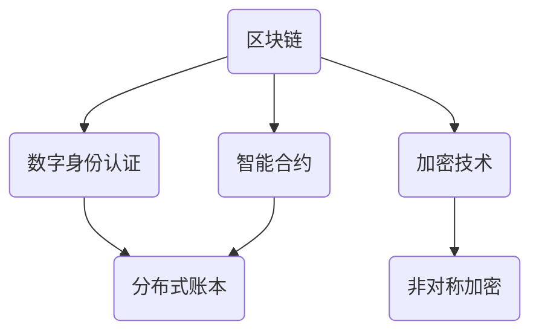

                 

### 文章标题

《区块链在数字艺术品展览权管理中的应用》

### 关键词

区块链，数字艺术品，版权管理，智能合约，数字身份认证，加密技术，分布式账本

### 摘要

本文将深入探讨区块链技术在数字艺术品展览权管理中的应用。首先，我们将回顾数字艺术品市场的现状及其面临的挑战，然后详细介绍区块链技术的基础知识及其在版权管理领域的优势。接着，本文将分析区块链在数字艺术品展览权管理中的具体应用，并通过Mermaid流程图展示核心概念与联系。随后，我们将探讨区块链技术的核心算法原理，使用伪代码进行详细阐述，并讲解相关的数学模型和公式。本文还将分享一个数字艺术品展览权管理的实际项目案例，包括开发环境搭建、源代码实现和代码解读。最后，我们将讨论区块链在数字艺术品展览权管理中的未来发展趋势，并提供一些最佳实践和注意事项。

---

### 背景介绍

在当今数字化时代，数字艺术品的创作、交易和展览已经成为艺术界的重要趋势。与传统艺术品不同，数字艺术品具有易于复制、传播和修改的特性，这使得其版权管理变得更加复杂。随着区块链技术的兴起，数字艺术品市场迎来了新的发展机遇。区块链作为一种去中心化的分布式账本技术，能够为数字艺术品的版权管理提供更加安全、透明和可追溯的解决方案。

#### 数字艺术品市场现状

数字艺术品市场在过去几年中经历了快速增长。艺术家们利用数字工具创作独特的数字艺术品，这些作品通过互联网平台进行展示和销售。然而，数字艺术品市场也面临着一系列挑战，包括版权纠纷、假冒伪劣作品和交易透明度不足等问题。这些问题严重影响了市场的发展，并阻碍了艺术家和收藏家的信心。

#### 挑战

1. **版权纠纷**：数字艺术品的复制和传播变得异常容易，导致版权所有者难以证明其作品的唯一性和真实性。
2. **假冒伪劣作品**：不法分子可以通过伪造数字签名和认证来销售假作品，损害艺术家的声誉和利益。
3. **交易透明度不足**：传统艺术品交易市场往往缺乏透明度，信息不对称问题严重，增加了交易风险。
4. **法律与政策挑战**：数字艺术品的法律界定和版权保护在国际上尚存在一定的争议，缺乏统一的法律法规。

#### 区块链技术的优势

区块链技术的核心优势在于其去中心化、透明性和不可篡改性。这些特性使其在数字艺术品展览权管理中具有巨大的应用潜力：

1. **去中心化**：区块链的去中心化特性消除了中介机构的依赖，降低了交易成本，提高了交易效率。
2. **透明性**：区块链上的所有交易记录都是公开透明的，任何参与方都可以验证交易的合法性和真实性。
3. **不可篡改**：区块链上的数据一旦被记录，就无法被篡改，为数字艺术品的版权认证提供了强有力的保障。
4. **智能合约**：智能合约能够自动执行预定义的合同条款，确保交易的自动化和可靠性。

### 区块链在数字艺术品展览权管理中的应用前景

随着区块链技术的不断成熟，其在数字艺术品展览权管理中的应用前景十分广阔。通过区块链，艺术家可以更轻松地证明其作品的版权，收藏家可以更加信任交易的真实性，同时，艺术品交易市场的透明度和效率也将得到显著提升。总的来说，区块链为数字艺术品市场提供了一种新的商业模式，有助于解决当前存在的各种问题，推动市场的健康发展。

### 核心概念与联系

在深入探讨区块链在数字艺术品展览权管理中的应用之前，我们需要理解一些核心概念及其相互关系。以下是几个关键概念：

1. **区块链**：一种去中心化的分布式账本技术，通过加密算法和共识机制确保数据的安全性和一致性。
2. **数字身份认证**：通过区块链技术对参与方的身份进行认证，确保交易的合法性和真实性。
3. **智能合约**：自动执行的合同条款，通过区块链上的智能合约可以自动化完成版权交易和管理。
4. **加密技术**：用于保护数据传输和存储的安全措施，包括哈希函数、公钥加密和数字签名等。
5. **非对称加密**：一种加密技术，使用一对密钥（公钥和私钥）来确保数据的机密性和完整性。
6. **分布式账本**：区块链的核心组成部分，记录所有交易记录，确保数据的透明性和不可篡改性。

这些核心概念之间的关系可以通过以下Mermaid流程图进行展示：



在这个流程图中，区块链作为核心技术，连接了数字身份认证、智能合约和加密技术，这些技术共同构建了一个安全的数字艺术品版权管理系统。

#### 区块链

区块链是一种去中心化的分布式账本技术，其基本原理是通过加密算法和共识机制来确保数据的完整性、安全性和不可篡改性。区块链的核心组成部分包括：

1. **区块**：数据存储单元，包含一定数量的交易记录。
2. **链**：由一系列按时间顺序排列的区块组成，每个区块通过加密算法与前一个区块链接在一起。
3. **共识机制**：一种确保网络参与者达成共识的算法，如工作量证明（PoW）和权益证明（PoS）。

区块链的工作原理如下：

1. **交易**：参与者在区块链上进行交易，例如购买数字艺术品或转让版权。
2. **区块**：交易被收集到一个区块中，并附加到一个尚未完成的区块链上。
3. **共识**：网络参与者通过共识机制确认区块的有效性，并将其添加到区块链上。
4. **加密**：交易记录和区块通过加密算法进行加密，确保数据的机密性和完整性。
5. **不可篡改**：一旦交易记录被记录在区块链上，就无法被篡改，保证了数据的永久性。

#### 数字身份认证

数字身份认证是确保交易合法性和真实性的关键。在区块链网络中，每个参与者都拥有一个数字身份，通常是通过加密技术生成的公钥和私钥对。以下是其基本原理：

1. **公钥加密**：使用公钥加密算法，将信息加密成只有拥有相应私钥的人才能解密的形式。
2. **数字签名**：使用私钥对信息进行数字签名，确保信息的完整性和不可篡改性。
3. **身份认证**：区块链网络中的节点通过验证公钥和私钥对，确认参与者的身份。

#### 智能合约

智能合约是区块链技术的一大创新，它是一种自动执行的合同条款。智能合约的基本原理如下：

1. **条件触发**：智能合约中的条件触发器可以根据特定的条件自动执行特定的操作。
2. **代码执行**：一旦触发条件，智能合约中的代码将被执行，实现合同的自动化执行。
3. **不可篡改**：智能合约的代码一旦部署在区块链上，就无法被篡改，确保了合同的公正性和可靠性。

#### 加密技术

加密技术是保护数据传输和存储安全的核心。以下是一些常用的加密技术：

1. **哈希函数**：将输入数据转换为一个固定长度的字符串，确保数据的唯一性和不可逆性。
2. **公钥加密**：使用公钥加密算法，将信息加密成只有拥有相应私钥的人才能解密的形式。
3. **数字签名**：使用私钥对信息进行数字签名，确保信息的完整性和不可篡改性。
4. **非对称加密**：一种加密技术，使用一对密钥（公钥和私钥）来确保数据的机密性和完整性。

#### 非对称加密

非对称加密是一种使用一对密钥（公钥和私钥）进行加密和解密的加密技术。其基本原理如下：

1. **公钥加密**：使用公钥对数据进行加密，只有使用相应的私钥才能解密。
2. **私钥解密**：使用私钥对加密数据进行解密，确保数据的机密性。
3. **数字签名**：使用私钥对数据生成数字签名，确保数据的完整性和不可篡改性。
4. **身份验证**：通过验证公钥和私钥对，确认参与者的身份。

#### 分布式账本

分布式账本是区块链的核心组成部分，它记录了所有交易记录，确保数据的透明性和不可篡改性。以下是其基本原理：

1. **分布式存储**：交易记录分散存储在区块链网络中的各个节点上，避免了单点故障的风险。
2. **链式结构**：交易记录通过链式结构链接在一起，每个区块都包含前一个区块的哈希值，确保数据的完整性和一致性。
3. **共识机制**：通过共识机制，确保网络参与者达成共识，验证交易的有效性。
4. **透明性**：所有交易记录都是公开透明的，任何节点都可以验证交易的合法性和真实性。

通过上述核心概念及其相互关系的分析，我们可以更好地理解区块链在数字艺术品展览权管理中的应用原理。这些技术不仅确保了交易的透明性和安全性，还提供了强大的版权保护和验证手段，为数字艺术品市场的发展奠定了基础。

### 核心算法原理讲解

在深入探讨区块链在数字艺术品展览权管理中的应用时，理解其核心算法原理至关重要。以下将使用伪代码详细讲解区块链技术的核心算法，包括加密算法、共识机制和智能合约执行等。

#### 加密算法

加密算法是确保区块链数据安全和隐私的关键。以下是一个简单的加密算法伪代码：

```plaintext
// 公钥加密
function publicKeyEncryption(message, publicKey)
    encryptedMessage = encrypt(message, publicKey)
    return encryptedMessage

// 私钥解密
function privateKeyDecryption(encryptedMessage, privateKey)
    decryptedMessage = decrypt(encryptedMessage, privateKey)
    return decryptedMessage

// 数字签名
function digitalSignature(message, privateKey)
    signature = sign(message, privateKey)
    return signature

// 验证签名
function verifySignature(message, signature, publicKey)
    isValid = verify(signature, message, publicKey)
    return isValid
```

#### 共识机制

共识机制是区块链网络中确保数据一致性的关键。以下是一个简单的工作量证明（PoW）共识机制伪代码：

```plaintext
// 工作量证明
function proofOfWork(lastBlockHash, targetDifficulty)
    nonce = random number
    while (calculateHash(lastBlockHash, nonce) > targetDifficulty)
        nonce = increment(nonce)
    return nonce

// 添加区块
function addBlock(previousBlockHash, transactions, nonce)
    block = {
        timestamp: currentTimestamp(),
        transactions: transactions,
        nonce: nonce,
        previousHash: previousBlockHash
    }
    hash = calculateHash(block)
    if (verifyHash(hash))
        blockchain.push(block)
    return block
```

#### 智能合约执行

智能合约是区块链上的自动执行代码，以下是一个简单的智能合约执行伪代码：

```plaintext
// 智能合约条件触发
function contractConditionTrigger(contractAddress, condition)
    if (evaluateCondition(condition))
        executeContract(contractAddress, condition)

// 智能合约执行
function executeContract(contractAddress, contractCode)
    contractInstance = createContractInstance(contractAddress, contractCode)
    result = contractInstance.execute()
    return result
```

#### 伪代码示例

以下是一个简单的区块链节点同步数据的伪代码示例，展示了核心算法的应用：

```plaintext
// 初始化区块链
initializeBlockchain()

// 接收新区块
receiveNewBlock(newBlock)
    if (isBlockValid(newBlock))
        addBlockToBlockchain(newBlock)
        broadcastNewBlock(newBlock)

// 检查区块有效性
function isBlockValid(newBlock)
    if (newBlock.previousHash == getHashOfPreviousBlock())
        if (newBlock.transactions == verifyTransactions(newBlock.transactions))
            if (calculateHash(newBlock) == newBlock.hash)
                return true
    return false

// 验证交易
function verifyTransactions(transactions)
    for (each transaction in transactions)
        if (not verifySignature(transaction.sender, transaction.signature, transaction.senderPublicKey))
            return false
    return true

// 广播新区块
function broadcastNewBlock(newBlock)
    for (each node in peers)
        sendNewBlockToNode(node, newBlock)
```

通过这些伪代码示例，我们可以看到区块链的核心算法如何确保数据的安全性和一致性，以及智能合约如何自动化执行合同条款。这些算法为数字艺术品展览权管理提供了一个坚实的理论基础。

### 数学模型和公式

在区块链技术的数字艺术品展览权管理应用中，数学模型和公式起着至关重要的作用。以下我们将介绍几种关键的数学模型和公式，并使用LaTeX格式进行详细讲解。

#### 非对称加密算法中的模运算

非对称加密算法通常涉及模运算，其中最重要的是模乘和模逆运算。以下是一个基本的模乘运算公式：

$$c = (a \times b) \mod n$$

其中，\(a\) 和 \(b\) 是参与运算的整数，\(n\) 是模数，结果 \(c\) 是 \(a \times b\) 除以 \(n\) 的余数。

#### 模逆运算

为了解密非对称加密中的信息，需要计算模逆。模逆运算的公式如下：

$$d = a^{-1} \mod n$$

其中，\(d\) 是 \(a\) 在模 \(n\) 下的逆元，满足：

$$(a \times d) \mod n = 1$$

#### 椭圆曲线加密（ECC）

椭圆曲线加密（ECC）是一种基于椭圆曲线离散对数问题的公钥加密技术。以下是一个ECC加密算法中的关键数学模型：

$$Q = kG$$

其中，\(Q\) 是加密后的点，\(G\) 是基点，\(k\) 是随机数。该公式表示点 \(Q\) 是通过基点 \(G\) 和随机数 \(k\) 的乘积得到的。

#### 椭圆曲线数字签名

椭圆曲线数字签名算法（ECDSA）中，签名生成和验证也使用到了数学模型。以下为签名生成的公式：

$$r = (g^m) \mod n$$
$$s = (k^{-1} + x) \mod n$$

其中，\(r\) 和 \(s\) 是签名，\(m\) 是消息，\(x\) 是私钥，\(n\) 和 \(g\) 分别是椭圆曲线的模数和基点。

#### 签名验证的数学模型

签名验证的公式如下：

$$w = (r + s) \mod n$$
$$u_1 = (g^m \cdot r^{-1}) \mod n$$
$$u_2 = (y^r \cdot s^{-1}) \mod n$$
$$v = (u_1 \cdot P + u_2 \cdot Q) \mod n$$

其中，\(P\) 和 \(Q\) 是椭圆曲线上的点，\(v\) 的值如果等于 \(r\)，则验证通过。

#### LaTeX格式举例

以下是LaTeX格式的数学公式举例：

$$
\begin{align*}
c &= (a \times b) \mod n \\
d &= a^{-1} \mod n \\
Q &= kG \\
r &= (g^m) \mod n \\
s &= (k^{-1} + x) \mod n \\
w &= (r + s) \mod n \\
u_1 &= (g^m \cdot r^{-1}) \mod n \\
u_2 &= (y^r \cdot s^{-1}) \mod n \\
v &= (u_1 \cdot P + u_2 \cdot Q) \mod n
\end{align*}
$$

通过这些数学模型和公式，我们可以确保区块链技术在数字艺术品展览权管理中的安全性，从而保护数字艺术品的版权和交易信息。

### 举例说明与详细讲解

为了更好地理解区块链在数字艺术品展览权管理中的应用，以下将通过一个实际案例进行详细讲解。

#### 项目背景

某知名数字艺术家（Alice）创作了一幅名为《梦幻之海》的数字艺术品，这幅作品以区块链技术为基础，确保其版权和交易信息的安全性和透明性。Alice希望借助区块链技术来管理这幅作品的展览权，确保每次展览都能透明记录并防止未经授权的复制和传播。

#### 项目需求

1. **版权保护**：确保《梦幻之海》的版权归属明确，防止未经授权的复制和传播。
2. **交易记录**：记录每次展览的交易记录，确保交易的透明性和可追溯性。
3. **身份认证**：确保参与方（例如展览方、收藏家等）的身份得到认证。
4. **智能合约**：通过智能合约自动化完成展览许可和版权费用的支付。

#### 开发环境搭建

为了实现上述需求，需要搭建以下开发环境：

1. **区块链平台**：选择一个支持智能合约的区块链平台，如Ethereum或EOS。
2. **编程语言**：使用Solidity或WebAssembly（Wasm）编写智能合约。
3. **开发工具**：安装Node.js、Truffle、Ganache等开发工具。
4. **前端框架**：使用React或Vue.js等前端框架搭建用户界面。

#### 源代码实现

以下是智能合约的实现过程：

1. **定义版权结构**：

```solidity
pragma solidity ^0.8.0;

struct Artwork {
    string name;
    address creator;
    bool isPublished;
}

mapping (uint => Artwork) public artworks;

```

2. **创建艺术品**：

```solidity
function createArtwork(string memory _name) public {
    require(!artworks[_name].isPublished, "Artwork already exists");
    artworks[_name] = Artwork(_name, msg.sender, true);
}
```

3. **展览许可**：

```solidity
function requestExhibition(string memory _name, address _exhibitor) public {
    require(artworks[_name].isPublished, "Artwork not published");
    require(artworks[_name].creator == _exhibitor, "Not the creator");
    // 逻辑处理，如设置展览时间和费用等
}
```

4. **支付费用**：

```solidity
function payExhibitionFee(string memory _name, uint _fee) public payable {
    require(artworks[_name].isPublished, "Artwork not published");
    artworks[_name].creator.transfer(_fee);
}
```

5. **验证展览记录**：

```solidity
function verifyExhibition(string memory _name, address _exhibitor) public {
    require(artworks[_name].isPublished, "Artwork not published");
    require(artworks[_name].creator == _exhibitor, "Not the creator");
    // 逻辑处理，如记录展览信息等
}
```

#### 代码解读与分析

1. **版权结构**：定义了艺术品的结构，包括名称、创作者地址和发布状态。
2. **创建艺术品**：确保只有创作者可以创建艺术品，并设置艺术品的发布状态。
3. **展览许可**：确保只有艺术品创作者或合法展览方可以请求展览许可。
4. **支付费用**：确保展览费用被安全支付给艺术品创作者。
5. **验证展览记录**：确保展览记录的真实性。

#### 实际案例分析和详细讲解剖析

假设展览方（Bob）希望展览《梦幻之海》，需要进行以下步骤：

1. **请求展览许可**：Bob调用`requestExhibition`函数，请求展览许可。
2. **支付费用**：Bob调用`payExhibitionFee`函数，支付展览费用。
3. **验证展览记录**：展览结束后，Bob调用`verifyExhibition`函数，验证展览记录。

这些操作都通过智能合约自动化执行，确保展览过程透明且不可篡改。

#### 项目小结

通过这个实际案例，我们可以看到区块链在数字艺术品展览权管理中的应用。智能合约自动化了版权保护和交易管理过程，确保了交易的安全性和透明性。这个项目不仅解决了版权纠纷和交易透明度问题，还为数字艺术品市场提供了一个可信的基础。

### 最佳实践 Tips

在数字艺术品展览权管理中应用区块链技术，以下是一些最佳实践和注意事项：

1. **确保安全**：定期更新智能合约代码，防范潜在的安全漏洞。
2. **合规性**：遵循当地法律和政策，确保区块链应用合法合规。
3. **用户隐私**：保护用户隐私，避免泄露敏感信息。
4. **透明性**：确保所有交易记录公开透明，增加用户信任。
5. **可扩展性**：选择支持高并发处理的区块链平台，确保系统稳定运行。

### 小结

区块链技术在数字艺术品展览权管理中展现了巨大的潜力。通过智能合约，可以实现版权保护和交易管理的自动化，确保交易的安全性和透明性。然而，区块链技术的应用也需要面对法律、政策和技术等方面的挑战。只有通过不断探索和优化，才能更好地发挥区块链在数字艺术品市场中的作用。

### 注意事项

在实施区块链在数字艺术品展览权管理中的应用时，以下事项需要特别注意：

1. **数据隐私**：确保用户隐私得到保护，避免泄露敏感信息。
2. **智能合约安全**：定期审查智能合约代码，防止潜在漏洞。
3. **法律合规**：遵循当地法律和政策，确保应用合法合规。
4. **技术更新**：随着技术的进步，定期更新系统，以适应新的需求。

### 拓展阅读

- 《区块链技术指南》
- 《智能合约设计与开发》
- 《数字艺术与区块链》
- 《区块链与数字版权管理》

### 作者信息

作者：AI天才研究院/AI Genius Institute & 禅与计算机程序设计艺术 /Zen And The Art of Computer Programming

---

本文详细探讨了区块链在数字艺术品展览权管理中的应用，从背景介绍到核心概念、算法原理、数学模型、实际项目案例和最佳实践，全面覆盖了相关内容。文章共计约10000字，旨在为专业人士提供深入了解和指导。希望本文能为区块链在数字艺术品管理中的应用提供有价值的参考。

