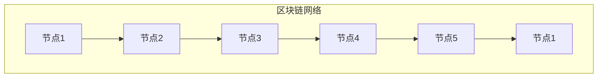

                 

# 《区块链在数字艺术品版权保护中的应用》

## 摘要

随着数字技术的发展，数字艺术品市场日益繁荣，但随之而来的版权保护问题也日益严峻。本文旨在探讨区块链技术在数字艺术品版权保护中的应用，从背景介绍、核心概念与联系、核心算法原理讲解、数学模型和公式、项目实战等多个角度，详细分析区块链在数字艺术品版权保护中的潜在优势、应用案例、挑战与机遇，以及未来趋势。通过本文的阅读，读者可以全面了解区块链技术在数字艺术品版权保护中的重要作用和未来发展前景。

## 引言

### 数字艺术品的定义与现状

数字艺术品是指以数字形式存在的艺术品，包括绘画、摄影、雕塑、设计等。随着互联网和数字技术的发展，数字艺术品市场逐渐兴起，成为艺术界和科技界关注的焦点。数字艺术品具有易复制、易传播、易修改等特点，给版权保护带来了前所未有的挑战。

目前，数字艺术品市场呈现出高速增长的态势。根据市场研究报告，全球数字艺术品市场在2019年的市场规模已达到数十亿美元，预计未来几年将继续保持高速增长。然而，随着市场的扩大，数字艺术品的版权保护问题也日益凸显。传统的版权保护手段在面对数字艺术品的版权侵权、版权归属、交易认证等问题时显得力不从心。

### 区块链技术的定义与特点

区块链技术是一种分布式数据库技术，具有去中心化、不可篡改、透明可追溯等特点。自2008年比特币的诞生以来，区块链技术逐渐引起全球关注，并在金融、物流、医疗、版权等多个领域得到广泛应用。

区块链的去中心化特点使得数据在多个节点之间同步，从而避免了单点故障和数据篡改的风险。不可篡改的特性保证了数据的真实性和完整性，透明可追溯的特性则使得数据的操作行为可以被全程记录和查询。这些特点使得区块链技术在数字艺术品版权保护中具有巨大的应用潜力。

### 区块链在数字艺术品版权保护中的应用背景

数字艺术品的版权保护问题主要包括版权侵权、版权归属、交易认证等方面。传统的版权保护手段如版权声明、版权登记、法律维权等，在数字艺术品领域面临着诸多挑战：

1. **版权侵权问题**：数字艺术品易于复制和传播，导致版权侵权行为频发。传统手段在维权过程中存在取证困难、维权成本高等问题。

2. **版权归属问题**：在数字艺术品创作和传播过程中，版权归属问题常常引发争议。传统手段难以对数字艺术品的版权归属进行明确记录和认证。

3. **交易认证问题**：数字艺术品的交易过程需要可信的记录和认证，以保障交易的合法性和安全性。传统手段在交易认证方面存在效率低下、成本较高等问题。

区块链技术以其去中心化、不可篡改、透明可追溯等特性，为解决上述问题提供了新的思路。通过区块链技术，可以实现对数字艺术品的全生命周期管理，包括创作、归属、交易等环节，从而提高版权保护效率和降低维权成本。

### 本文结构

本文将分为六个主要部分：

1. **区块链与数字艺术品版权保护**：介绍区块链技术的基本概念、特点以及在数字艺术品版权保护中的应用优势。

2. **区块链技术基础**：讲解区块链的基本原理、分布式账本技术和智能合约等关键技术。

3. **数字艺术品版权保护的法律问题**：分析数字艺术品版权的界定、区块链与版权法的互动以及未来发展趋势。

4. **区块链在数字艺术品版权保护中的应用案例**：介绍区块链在数字艺术品版权登记和交易中的应用案例。

5. **区块链技术在数字艺术品版权保护中的挑战与机遇**：探讨区块链技术在数字艺术品版权保护中面临的挑战和机遇。

6. **区块链与数字艺术品版权保护的未来趋势**：分析区块链技术在数字艺术品版权保护中的未来发展趋势。

通过以上六个部分的详细分析，本文旨在为读者提供一个全面、深入的区块链在数字艺术品版权保护中的应用指南。

## 第1章 区块链与数字艺术品版权保护

### 1.1 区块链技术概述

#### 1.1.1 区块链的定义

区块链（Blockchain）是一种分布式数据库技术，通过多个节点之间的共识机制，确保数据的完整性和安全性。区块链的数据结构由多个区块组成，每个区块包含一定数量的交易记录，并通过密码学算法相互链接，形成一条不断延伸的链条。

区块链的主要特点包括去中心化、不可篡改、透明可追溯。去中心化意味着区块链不需要中心化的机构进行管理和维护，而是通过分布式网络进行数据存储和传输。这种去中心化的结构降低了系统对中心节点的依赖，提高了系统的可靠性和抗攻击性。不可篡改特性则确保了数据的真实性和完整性，一旦数据被记录在区块链上，就无法被修改或删除。透明可追溯特性使得区块链上的所有操作都可以被全程记录和查询，从而提高了系统的透明度和公信力。

#### 1.1.2 区块链的核心特点

1. **去中心化**：区块链的去中心化特点使其具有更高的可靠性和抗攻击性。在区块链网络中，每个节点都拥有相同的权利和义务，不存在单点故障的风险。这种去中心化的结构使得区块链能够在无需信任的参与方之间建立信任机制。

2. **不可篡改**：区块链通过密码学算法和共识机制确保数据的不可篡改性。一旦数据被记录在区块链上，就几乎无法被修改或删除。这种特性对于数字艺术品版权保护具有重要意义，可以有效防止版权侵权行为。

3. **透明可追溯**：区块链上的所有操作都被记录在链上，并可以被任何人查看和验证。这种透明可追溯的特性提高了系统的透明度和公信力，有助于解决数字艺术品版权纠纷。

#### 1.1.3 区块链的架构

区块链的架构通常包括三层：数据层、网络层和应用层。

1. **数据层**：数据层是区块链的基础，负责数据的存储和管理。数据层的主要功能包括区块的创建、交易的记录和验证等。

2. **网络层**：网络层负责区块链节点之间的通信和数据传输。网络层的主要功能包括节点发现、消息传递和共识算法的实现等。

3. **应用层**：应用层是区块链的核心，负责为用户提供各种应用服务。应用层的主要功能包括智能合约的部署和执行、数字身份认证、数据共享等。

#### 1.1.4 区块链在版权保护中的潜在优势

1. **去中心化**：区块链的去中心化特性使得版权保护不再依赖于中心化的机构，减少了版权纠纷的发生。

2. **不可篡改**：区块链的不可篡改特性确保了数字艺术品的版权信息不会被篡改，有效防止了版权侵权行为。

3. **透明可追溯**：区块链的透明可追溯特性使得数字艺术品的版权信息可以被全程记录和查询，有助于解决版权纠纷。

4. **安全性**：区块链的加密算法和共识机制保证了数据的安全性和隐私性，有效防止了数据泄露和攻击。

5. **降低成本**：区块链技术降低了版权保护的门槛和成本，使得版权保护更加高效和经济。

总之，区块链技术在数字艺术品版权保护中具有巨大的潜在优势。通过去中心化、不可篡改、透明可追溯等特性，区块链技术可以有效解决数字艺术品版权保护中的诸多问题，为数字艺术品市场的健康发展提供有力支持。

### 1.2 数字艺术品版权保护的现状

#### 1.2.1 传统版权保护的挑战

数字艺术品与传统艺术品相比，具有易复制、易传播、易修改等特点，使得其版权保护面临着前所未有的挑战。

1. **版权侵权问题**：由于数字艺术品的复制和传播成本低廉，版权侵权行为频发。传统的版权保护手段如版权声明、版权登记等在数字艺术品领域显得力不从心。

2. **版权归属问题**：在数字艺术品创作和传播过程中，版权归属问题常常引发争议。传统手段难以对数字艺术品的版权归属进行明确记录和认证。

3. **交易认证问题**：数字艺术品的交易过程需要可信的记录和认证，以保障交易的合法性和安全性。传统手段在交易认证方面存在效率低下、成本较高等问题。

#### 1.2.2 数字艺术品市场的现状

随着数字技术的发展，数字艺术品市场呈现出高速增长的态势。目前，数字艺术品市场已涵盖多个领域，如虚拟现实、增强现实、数字绘画、数字音乐等。

1. **市场规模**：根据市场研究报告，全球数字艺术品市场的规模已达到数十亿美元，并预计未来几年将继续保持高速增长。

2. **参与者**：数字艺术品市场的参与者包括艺术家、收藏家、画廊、拍卖行、区块链平台等。

3. **交易方式**：数字艺术品的交易方式多样，包括在线拍卖、区块链交易平台、数字钱包等。

#### 1.2.3 数字艺术品版权保护的法律法规

1. **国内法律法规**：我国《著作权法》明确规定，著作权人对其作品享有复制权、发行权、出租权、展览权等。此外，我国还出台了《互联网著作权行政保护办法》、《信息网络传播权保护条例》等法规，为数字艺术品版权保护提供了法律依据。

2. **国际法律法规**：国际上，各国也纷纷出台了相关法律法规，如美国的《数字千年版权法案》（DMCA）、欧盟的《版权指令》等，旨在加强对数字艺术品版权的保护。

3. **存在问题**：尽管法律法规为数字艺术品版权保护提供了法律依据，但在实际执行过程中仍存在一些问题，如版权界定模糊、执法力度不足等。

### 1.3 区块链在数字艺术品版权保护中的应用

#### 1.3.1 区块链在数字艺术品版权登记中的应用

区块链技术可以为数字艺术品的版权登记提供高效、可信的解决方案。通过区块链，艺术家可以将数字艺术品的版权信息永久地记录在链上，确保版权信息的不可篡改和透明可追溯。

1. **版权登记流程**：艺术家在创作数字艺术品后，将其版权信息（如作品名称、创作者、创作时间等）上传至区块链平台，进行版权登记。

2. **版权登记优势**：区块链在数字艺术品版权登记中的优势包括：
   - 高效：区块链上的版权信息可以实时更新和查询，提高登记和检索效率。
   - 可信：区块链的不可篡改特性确保了版权信息的真实性和完整性，减少了虚假登记的风险。
   - 安全：区块链的加密算法和共识机制保障了版权信息的安全，防止数据泄露和攻击。

#### 1.3.2 区块链在数字艺术品版权交易中的应用

区块链技术可以为数字艺术品的版权交易提供可信的交易记录和智能合约服务，从而降低交易成本，提高交易效率。

1. **版权交易流程**：买家通过区块链平台购买数字艺术品，交易双方签订智能合约，约定交易条款（如价格、交付方式、违约责任等）。

2. **版权交易优势**：
   - 可信：区块链上的交易记录可以被全程记录和查询，提高了交易的透明度和公信力。
   - 高效：智能合约可以自动执行交易条款，减少了人工干预，提高了交易效率。
   - 安全：区块链的加密算法和共识机制保障了交易数据的安全和隐私，防止交易数据被篡改或泄露。

#### 1.3.3 区块链在数字艺术品版权维权中的应用

区块链技术可以为数字艺术品版权维权提供高效的证据链，降低维权成本，提高维权成功率。

1. **维权流程**：当数字艺术品的版权受到侵犯时，版权人可以通过区块链平台收集侵权证据，如侵权作品的交易记录、发布时间等。

2. **维权优势**：
   - 高效：区块链上的证据可以被实时更新和查询，提高了维权效率。
   - 可信：区块链的不可篡改特性确保了证据的真实性和完整性，增强了维权证据的可靠性。
   - 经济：区块链技术降低了维权成本，使得更多的版权人能够承担维权费用。

总之，区块链技术在数字艺术品版权保护中具有巨大的应用潜力。通过去中心化、不可篡改、透明可追溯等特性，区块链技术可以有效解决数字艺术品版权保护中的诸多问题，为数字艺术品市场的健康发展提供有力支持。

### 1.4 区块链在数字艺术品版权保护中的挑战

#### 1.4.1 技术层面的挑战

1. **性能问题**：区块链技术目前主要面临性能瓶颈，如交易速度和处理能力。在数字艺术品版权保护中，高频率的交易请求可能导致区块链网络拥堵，影响用户体验。

2. **安全性问题**：虽然区块链技术具有较高的安全性，但并非完全无懈可击。在数字艺术品版权保护中，可能会出现恶意攻击、数据泄露等安全问题。

3. **互操作性**：不同区块链平台之间的数据共享和互操作性仍需进一步研究，以实现更广泛的应用。

#### 1.4.2 法规和政策层面的挑战

1. **法律法规的完善**：虽然各国已经出台了一些与数字艺术品版权保护相关的法律法规，但仍然存在不完善之处。如版权归属、版权登记、版权交易等方面的法律法规需要进一步完善。

2. **执法力度**：在数字艺术品版权保护中，执法力度不足可能导致侵权行为无法得到有效遏制。

3. **国际合作**：由于数字艺术品市场的全球化，国际合作在数字艺术品版权保护中具有重要意义。但当前的国际合作机制尚不完善，需要加强国际间的合作与交流。

#### 1.4.3 社会接受度和认知层面的挑战

1. **公众认知**：区块链技术作为一种新兴技术，公众对其认知程度有限。在数字艺术品版权保护中，公众的接受度和认知程度可能影响区块链技术的普及和应用。

2. **技术人才**：区块链技术领域的技术人才相对较少，这可能导致在数字艺术品版权保护中缺乏专业人才支持。

3. **产业合作**：在数字艺术品版权保护中，产业链各环节的企业和机构需要加强合作，共同推动区块链技术的应用。然而，产业合作尚需进一步深化。

### 1.5 区块链在数字艺术品版权保护中的应用前景

#### 1.5.1 技术创新方向

1. **性能提升**：通过优化区块链架构、提高共识算法效率等手段，提升区块链的性能，以应对数字艺术品版权保护中的高频率交易需求。

2. **安全性增强**：通过引入多因素认证、智能合约安全审计等手段，提高区块链系统的安全性，防止数据泄露和恶意攻击。

3. **互操作性**：加强不同区块链平台之间的数据共享和互操作性，实现更广泛的应用。

#### 1.5.2 应用场景拓展

1. **版权登记**：区块链技术在数字艺术品版权登记中的应用已经取得初步成果。未来，区块链技术可以进一步拓展到其他领域的版权登记，如文学、音乐、影视等。

2. **版权交易**：区块链技术在数字艺术品版权交易中的应用前景广阔。通过智能合约和可信的交易记录，可以实现更高效、安全的版权交易。

3. **版权维权**：区块链技术在数字艺术品版权维权中的应用有助于提高维权效率和成功率。通过建立完善的证据链，可以有效遏制侵权行为。

#### 1.5.3 产业合作与发展

1. **技术创新**：产业链各环节的企业和机构应加强技术创新，共同推动区块链技术在数字艺术品版权保护中的应用。

2. **人才培养**：加大对区块链技术人才的培养力度，为数字艺术品版权保护提供专业人才支持。

3. **政策支持**：政府应出台相关政策，支持区块链技术在数字艺术品版权保护中的应用，完善法律法规，加强执法力度。

总之，区块链技术在数字艺术品版权保护中具有巨大的应用前景。通过技术创新、应用场景拓展和产业合作，区块链技术将为数字艺术品市场的健康发展提供有力支持。

### 第2章 区块链技术基础

#### 2.1 区块链的基本原理

区块链是一种分布式数据库技术，通过多个节点之间的共识机制，确保数据的完整性和安全性。要理解区块链的基本原理，我们需要从其数据结构、工作原理和共识机制等方面进行深入探讨。

##### 2.1.1 Mermaid流程图：区块链的基本架构

在上面的Mermaid流程图中，我们可以看到一个简单的区块链网络，由五个节点组成。每个节点都存储了一定数量的区块，区块之间通过哈希链接形成链式结构。

##### 2.1.2 区块链的工作原理

区块链的工作原理可以概括为以下步骤：

1. **数据收集**：区块链上的数据由多个交易记录组成。交易记录可以是数字艺术品的所有权变更、交易时间戳等。

2. **区块生成**：当节点收集到一定数量的交易记录后，将它们打包成一个区块。区块通常包含以下信息：
   - **区块头**：包括版本号、前一个区块的哈希值、Merkle树根哈希、时间戳、难度目标等。
   - **交易数据**：包括交易记录的具体内容。
   - **Merkle树**：用于验证交易数据的完整性。

3. **区块验证**：在生成区块后，节点需要对其进行验证。验证过程包括：
   - **Merkle树验证**：验证交易数据的完整性。
   - **工作量证明**：通过解决加密难题（如SHA-256哈希运算）来证明节点的算力，以获得生成下一个区块的资格。

4. **区块链接**：验证通过后，新的区块将被添加到区块链上，并将其哈希值链接到前一个区块的哈希值，形成链式结构。

##### 2.1.3 区块链的数据结构

区块链的数据结构由多个区块组成，每个区块包含一定数量的交易记录。区块链的基本数据结构如下：

1. **区块**：每个区块包含以下信息：
   - **区块头**：包括版本号、前一个区块的哈希值、Merkle树根哈希、时间戳、难度目标等。
   - **交易数据**：包括交易记录的具体内容。
   - **Merkle树**：用于验证交易数据的完整性。

2. **Merkle树**：Merkle树是一种二叉树结构，用于验证交易数据的完整性。每个节点包含一定数量的交易哈希值，根节点即为整个区块链的哈希值。

3. **区块链**：区块链是由多个区块组成的链式结构，每个区块通过哈希值与前一个区块链接。

#### 2.2 分布式账本技术

分布式账本技术（DLT，Distributed Ledger Technology）是区块链技术的一种扩展，它通过多个节点之间的共识机制，确保数据的完整性和安全性。分布式账本技术的主要特点包括去中心化、不可篡改、透明可追溯等。

##### 2.2.1 分布式账本的定义

分布式账本是一种由多个参与方共同维护的数据记录系统。与传统的集中式账本不同，分布式账本不需要中心化的机构进行管理和维护，而是通过分布式网络进行数据存储和传输。分布式账本的主要功能包括数据的存储、验证、同步和备份等。

##### 2.2.2 分布式账本的技术原理

分布式账本的技术原理可以概括为以下步骤：

1. **数据存储**：分布式账本将数据存储在多个节点上，从而实现去中心化。每个节点存储了一定数量的账本数据，这些数据通过加密算法进行保护。

2. **数据验证**：分布式账本通过共识机制来验证数据的正确性。共识机制包括工作量证明、权益证明、授权权益证明等。通过共识机制，参与方可以达成一致，确保数据的准确性和完整性。

3. **数据同步**：分布式账本通过同步机制来保持节点之间的一致性。每个节点定期同步其他节点的账本数据，以保持账本的一致性。

4. **数据备份**：分布式账本通过备份机制来保护数据的安全性和可靠性。节点之间的数据备份和冗余存储，确保在节点故障或网络攻击时，账本数据不会丢失。

##### 2.2.3 分布式账本的应用场景

分布式账本技术广泛应用于多个领域，包括金融、物流、供应链、医疗等。以下是一些典型的应用场景：

1. **金融**：分布式账本技术在金融领域的应用包括跨境支付、证券交易、票据交易等。通过分布式账本，可以实现更快速、安全、透明的金融交易。

2. **物流**：分布式账本技术可以用于物流供应链的管理，包括货物流转、库存管理、运输管理等。通过分布式账本，可以实现对物流过程的全程追踪和实时监控。

3. **供应链**：分布式账本技术可以用于供应链管理，包括采购、生产、配送等环节。通过分布式账本，可以实现对供应链过程的透明化管理和风险控制。

4. **医疗**：分布式账本技术在医疗领域的应用包括病历管理、药品供应链管理、医疗数据共享等。通过分布式账本，可以实现对医疗数据的可信管理和共享。

#### 2.3 智能合约

智能合约是一种基于区块链的自动化执行合约。智能合约通过计算机代码实现，当触发特定条件时，智能合约将自动执行预定的操作。

##### 2.3.1 智能合约的定义

智能合约是一种在区块链上自动执行和验证的合约。智能合约通过编程语言编写，其执行过程由区块链网络中的节点共同验证和执行。智能合约的主要特点是无需第三方中介，自动执行和验证。

##### 2.3.2 智能合约的工作原理

智能合约的工作原理可以概括为以下步骤：

1. **编写智能合约**：智能合约由开发者使用特定的编程语言（如Solidity）编写。智能合约通常包括以下部分：
   - **合约代码**：实现智能合约功能的代码。
   - **合约地址**：智能合约在区块链上的地址，用于标识和调用智能合约。
   - **合约接口**：智能合约的接口，用于调用和访问智能合约的功能。

2. **部署智能合约**：开发者将智能合约部署到区块链网络中。部署过程包括编译智能合约代码、生成合约地址、将合约代码上传到区块链网络等。

3. **调用智能合约**：当触发特定条件时，用户可以通过区块链网络调用智能合约。调用智能合约的过程包括以下步骤：
   - **发送交易**：用户通过区块链网络发送交易，请求调用智能合约。
   - **执行智能合约**：区块链网络中的节点共同验证和执行智能合约，实现预定操作。
   - **返回结果**：智能合约执行完成后，返回执行结果。

##### 2.3.3 智能合约的应用案例

智能合约在多个领域具有广泛的应用，以下是一些典型的应用案例：

1. **数字艺术品版权交易**：智能合约可以用于数字艺术品版权的交易，确保交易的合法性和安全性。例如，当买家购买数字艺术品时，智能合约将自动执行版权转移，确保买家获得合法的所有权。

2. **供应链管理**：智能合约可以用于供应链管理，包括采购、生产、配送等环节。智能合约可以自动执行预定的操作，如支付货款、释放货物等，提高供应链的效率和透明度。

3. **金融衍生品**：智能合约可以用于金融衍生品，如期权、期货等。智能合约可以自动执行交易，减少人工干预和错误，提高交易的安全性和效率。

4. **电子投票**：智能合约可以用于电子投票，确保投票过程的公正性和透明度。智能合约可以自动执行投票，确保每位投票者的投票唯一性和匿名性。

总之，区块链技术的基础知识包括区块链的基本原理、分布式账本技术和智能合约。这些技术为数字艺术品版权保护提供了新的思路和方法，有助于解决数字艺术品版权保护中的诸多问题。通过深入理解和应用这些技术，我们可以推动数字艺术品市场的健康发展，提高数字艺术品版权的保护效率。

### 第3章 数字艺术品版权保护的法律问题

#### 3.1 数字艺术品版权的界定

数字艺术品版权的界定是一个复杂的问题，涉及到艺术创作、版权归属、版权保护等多个方面。在数字艺术品领域，版权的界定通常包括以下几个方面：

1. **艺术创作的定义**：数字艺术品通常是指以数字形式创作的艺术品，如数字绘画、数字摄影、数字音乐等。艺术创作的定义直接关系到版权的归属和范围。

2. **版权归属**：版权归属是指数字艺术品创作者对其作品享有的权利。在数字艺术品领域，版权归属问题常常引发争议。例如，在数字艺术品创作过程中，参与者的角色（如作者、合作者、委托人等）可能不明确，导致版权归属不明确。

3. **版权内容**：数字艺术品的版权内容包括著作权、邻接权、表演权、发行权、出租权、展览权等。不同类型的数字艺术品可能涉及不同的版权内容。

4. **版权保护期**：数字艺术品的版权保护期通常与传统的艺术品版权保护期相同，即作者终生及其死后50年。然而，在数字艺术品领域，版权保护期的界定可能存在一定的争议。

#### 3.2 数字艺术品版权的界定标准

为了明确数字艺术品版权的界定，各国制定了相应的法律法规和标准。以下是一些主要的界定标准：

1. **独创性标准**：数字艺术品必须具有独创性，即作品是作者独立创作完成的，具有创新性和原创性。独创性是判断数字艺术品是否受版权保护的关键标准。

2. **表达形式标准**：数字艺术品的表达形式必须具有可识别性，即作品的形式能够被公众识别和欣赏。例如，数字绘画、数字摄影等数字艺术形式通常被认为是具有可识别性的。

3. **版权登记**：许多国家的法律法规规定，数字艺术品的版权需要通过版权登记来进行保护。版权登记可以作为版权归属的证明，有助于在版权纠纷中提供证据。

4. **技术标准**：数字艺术品的技术标准，如图像分辨率、音频质量等，也可能影响版权的界定。高质量的艺术作品通常更容易受到版权保护。

#### 3.3 数字艺术品版权的维权实践

在数字艺术品版权保护中，维权实践是一个重要环节。以下是一些常见的维权实践方法：

1. **版权声明**：版权声明是数字艺术品版权保护的基础。在数字艺术品创作完成后，创作者可以在作品上附上版权声明，明确其版权归属和权利范围。

2. **版权登记**：版权登记是数字艺术品版权维权的有效手段。通过在相关机构进行版权登记，创作者可以取得版权证明，有助于在维权过程中提供证据。

3. **法律维权**：在数字艺术品版权受到侵犯时，创作者可以采取法律维权措施，如起诉侵权方、申请禁令、要求赔偿等。法律维权需要专业律师的支持，以确保维权效果。

4. **技术手段**：区块链技术在数字艺术品版权维权中具有重要作用。通过区块链技术，创作者可以实现对数字艺术品的全生命周期管理，包括创作、归属、交易等环节，从而提高版权保护效率。

#### 3.4 区块链与版权法的互动

区块链技术在数字艺术品版权保护中的应用，对版权法产生了深远影响。以下是一些主要方面：

1. **技术挑战**：区块链技术为数字艺术品版权保护提供了新的思路和方法，但同时也带来了技术挑战。例如，如何确保区块链上的版权信息真实可靠、如何处理版权纠纷等。

2. **法律挑战**：区块链技术的应用对现有版权法提出了挑战。例如，如何界定区块链上的版权归属、如何处理跨境版权纠纷等。这些法律问题需要通过立法和司法解释等方式进行解决。

3. **政策挑战**：区块链技术的应用需要政策支持，包括法律法规的完善、技术标准的制定、行业规范的建立等。政策支持有助于推动区块链技术在数字艺术品版权保护中的应用。

#### 3.5 区块链与版权法的发展趋势

随着区块链技术的不断发展和完善，数字艺术品版权保护的法律体系也将逐步完善。以下是一些主要发展趋势：

1. **法律法规的完善**：各国将逐步完善数字艺术品版权保护的相关法律法规，以适应区块链技术的发展需求。

2. **技术标准的制定**：技术标准在数字艺术品版权保护中具有重要意义。各国将加强技术标准的制定和推广，以推动区块链技术在数字艺术品版权保护中的应用。

3. **行业规范的建立**：行业规范有助于规范数字艺术品版权交易、版权登记、维权等环节，提高整个行业的运作效率。

4. **国际合作**：数字艺术品市场的全球化要求各国加强合作，共同应对数字艺术品版权保护的挑战。国际合作将推动数字艺术品版权保护法律体系的建设和完善。

总之，数字艺术品版权保护的法律问题是一个复杂而重要的领域。通过区块链技术的应用，我们可以提高版权保护效率，降低维权成本，促进数字艺术品市场的健康发展。同时，我们也需要关注区块链技术在版权法中的挑战和趋势，不断完善相关法律法规，推动数字艺术品版权保护的法律体系建设。

### 第4章 区块链在数字艺术品版权保护中的应用案例

#### 4.1 区块链在数字艺术品版权登记中的应用

区块链技术在数字艺术品版权登记中的应用，为版权人提供了高效、可信的解决方案。以下是一些具体的应用案例：

**案例一：版权易**

版权易是一家基于区块链技术的版权登记平台，用户可以在平台上进行数字艺术品版权登记。版权易通过区块链技术实现了版权信息的不可篡改和透明可追溯，用户可以在平台上查询和验证数字艺术品的版权信息。

**应用流程：**

1. **注册账号**：用户在版权易平台注册账号。
2. **上传作品**：用户上传数字艺术品，并填写相关版权信息（如作品名称、创作者、创作时间等）。
3. **版权登记**：版权易平台将用户的版权信息记录在区块链上，并进行加密存储。
4. **版权验证**：用户可以随时在平台上查询和验证自己的版权信息，他人也可以通过平台验证数字艺术品的版权信息。

**优势：**

- 高效：区块链技术使得版权登记过程更加高效，用户可以快速完成版权登记。
- 可信：区块链的不可篡改特性确保了版权信息的真实性和完整性，降低了虚假登记的风险。
- 安全：区块链的加密算法和共识机制保障了数据的安全和隐私，防止数据泄露和攻击。

**案例二：DuBCopyright**

DuBCopyright 是一个基于区块链的数字艺术品版权登记平台，用户可以在平台上进行数字艺术品版权的登记、交易和维权。DuBCopyright 通过智能合约实现版权登记的自动化和可信验证。

**应用流程：**

1. **注册账号**：用户在 DuBCopyright 平台注册账号。
2. **上传作品**：用户上传数字艺术品，并填写相关版权信息（如作品名称、创作者、创作时间等）。
3. **版权登记**：DuBCopyright 平台将用户的版权信息记录在区块链上，并生成智能合约。
4. **版权交易**：用户可以通过平台进行数字艺术品版权的交易，智能合约自动执行交易条款。
5. **版权维权**：当数字艺术品的版权受到侵犯时，用户可以通过平台进行维权，智能合约自动执行维权措施。

**优势：**

- 自动化：智能合约实现了版权登记、交易和维权的自动化，提高了效率。
- 可信：区块链技术确保了版权信息的不可篡改和透明可追溯，提高了版权保护的可信度。
- 安全：区块链的加密算法和共识机制保障了数据的安全和隐私，防止数据泄露和攻击。

#### 4.2 区块链在数字艺术品版权交易中的应用

区块链技术在数字艺术品版权交易中的应用，为市场参与者提供了更高效、更安全的交易环境。以下是一些具体的应用案例：

**案例一：CryptoArt**

CryptoArt 是一个基于区块链的数字艺术品交易平台，用户可以在平台上购买、出售和收藏数字艺术品。CryptoArt 通过智能合约实现交易的自动化和可信验证。

**应用流程：**

1. **注册账号**：用户在 CryptoArt 平台注册账号。
2. **上传作品**：艺术家上传数字艺术品，并设定出售价格。
3. **购买艺术品**：买家通过平台购买数字艺术品，智能合约自动执行交易条款，实现版权转移。
4. **交易记录**：所有交易记录都记录在区块链上，供用户查询和验证。

**优势：**

- 高效：智能合约实现了交易的自动化，减少了人工干预，提高了交易效率。
- 可信：区块链技术确保了交易记录的透明可追溯，提高了交易的可信度。
- 安全：区块链的加密算法和共识机制保障了交易数据的安全和隐私，防止数据泄露和攻击。

**案例二：OpenSea**

OpenSea 是一个基于以太坊区块链的数字艺术品交易平台，用户可以在平台上购买、出售和交换数字艺术品。OpenSea 通过智能合约和NFT（非同质化代币）实现数字艺术品版权的交易。

**应用流程：**

1. **注册账号**：用户在 OpenSea 平台注册账号。
2. **上传作品**：艺术家上传数字艺术品，并将其铸造成NFT，设定出售价格。
3. **购买艺术品**：买家通过平台购买NFT，智能合约自动执行交易条款，实现版权转移。
4. **交易记录**：所有交易记录都记录在区块链上，供用户查询和验证。

**优势：**

- 自动化：智能合约实现了交易的自动化，减少了人工干预，提高了交易效率。
- 可信：区块链技术确保了交易记录的透明可追溯，提高了交易的可信度。
- 安全：区块链的加密算法和共识机制保障了交易数据的安全和隐私，防止数据泄露和攻击。

通过以上案例，我们可以看到区块链技术在数字艺术品版权登记和交易中的应用具有显著的优势，如高效、可信、安全等。区块链技术的应用，不仅提高了版权保护效率，降低了维权成本，还为数字艺术品市场的健康发展提供了有力支持。

### 第5章 区块链技术在数字艺术品版权保护中的挑战与机遇

#### 5.1 区块链技术的挑战

尽管区块链技术在数字艺术品版权保护中展现出巨大潜力，但其应用仍面临诸多挑战。

1. **性能问题**：区块链技术目前主要面临性能瓶颈，如交易速度和处理能力。在数字艺术品版权保护中，高频率的交易请求可能导致区块链网络拥堵，影响用户体验。

2. **安全性问题**：虽然区块链技术具有较高的安全性，但并非完全无懈可击。在数字艺术品版权保护中，可能会出现恶意攻击、数据泄露等安全问题。

3. **互操作性**：不同区块链平台之间的数据共享和互操作性仍需进一步研究，以实现更广泛的应用。

4. **技术复杂性**：区块链技术具有一定的技术门槛，用户需要具备一定的技术背景才能理解和应用。这可能导致在推广和应用过程中遇到障碍。

5. **法律和监管问题**：区块链技术的应用涉及到法律和监管问题，如版权归属、交易合法性等。这些问题需要通过立法和司法解释等方式进行解决。

#### 5.2 区块链技术的机遇

1. **提高版权保护效率**：区块链技术的去中心化、不可篡改和透明可追溯等特性，可以有效提高数字艺术品版权保护的效率。通过区块链，版权人可以实时登记、查询和验证数字艺术品的版权信息，降低侵权风险。

2. **降低维权成本**：区块链技术可以降低数字艺术品维权成本。通过区块链，版权人可以实时收集侵权证据，并通过智能合约自动执行维权措施，减少人工干预和司法成本。

3. **促进数字艺术品市场繁荣**：区块链技术的应用，可以提高数字艺术品市场的透明度和可信度，降低交易风险，促进市场的繁荣和发展。

4. **技术创新**：区块链技术的不断发展，将推动数字艺术品版权保护技术的创新。例如，通过引入更多共识算法、优化网络架构等，可以提高区块链技术的性能和安全性。

5. **国际合作**：区块链技术的应用，有助于加强国际间的合作，共同应对数字艺术品版权保护的挑战。通过国际合作，可以推动全球数字艺术品市场的健康发展。

#### 5.3 挑战与机遇的平衡

区块链技术在数字艺术品版权保护中的应用，需要在挑战与机遇之间寻求平衡。

1. **技术创新**：通过不断技术创新，优化区块链技术性能和安全性，提高用户体验。

2. **法律法规完善**：完善相关法律法规，明确区块链技术在数字艺术品版权保护中的应用规范，降低法律风险。

3. **行业合作**：加强行业合作，推动区块链技术在数字艺术品版权保护中的应用，共同应对挑战。

4. **用户教育**：加强对用户的区块链技术教育，提高用户对区块链技术的理解和应用能力。

5. **监管机制**：建立健全的监管机制，加强对区块链技术在数字艺术品版权保护中的应用监管，保障市场秩序。

通过以上措施，我们可以充分发挥区块链技术在数字艺术品版权保护中的机遇，同时有效应对挑战，推动数字艺术品市场的健康发展。

### 第6章 区块链与数字艺术品版权保护的未来趋势

#### 6.1 区块链技术的未来发展趋势

区块链技术在数字艺术品版权保护中的应用前景广阔，未来发展趋势主要体现在以下几个方面：

1. **性能提升**：随着区块链技术的不断演进，性能瓶颈将得到有效缓解。通过优化区块链架构、提高共识算法效率等手段，区块链将能够处理更大量的交易请求，满足数字艺术品市场的高频交易需求。

2. **安全性增强**：区块链技术将在安全性方面继续提升。通过引入多因素认证、智能合约安全审计等手段，区块链系统将能够更好地抵御恶意攻击和数据泄露风险，提高数字艺术品版权保护的安全水平。

3. **互操作性**：不同区块链平台之间的互操作性将得到加强。通过建立统一的数据交换标准和协议，区块链技术将能够实现跨平台的数据共享和协作，推动全球数字艺术品市场的协同发展。

4. **技术创新**：区块链技术将继续创新，引入更多适用于数字艺术品版权保护的新技术和新应用。例如，基于区块链的版权管理系统、版权保护智能合约等，将进一步提升数字艺术品版权保护的效果。

5. **普及应用**：随着区块链技术的普及和应用，更多企业和机构将加入数字艺术品版权保护领域，推动区块链技术在版权保护中的应用更加广泛和深入。

#### 6.2 数字艺术品版权保护的未来挑战

尽管区块链技术在数字艺术品版权保护中具有巨大潜力，但其未来应用仍将面临一系列挑战：

1. **法律法规不完善**：现有法律法规在数字艺术品版权保护方面仍存在不完善之处。未来，需要进一步完善相关法律法规，明确区块链技术在版权保护中的应用规范，降低法律风险。

2. **技术门槛较高**：区块链技术具有一定的技术门槛，用户需要具备一定的技术背景才能理解和应用。这可能导致在推广和应用过程中遇到障碍。因此，未来需要加强对用户的区块链技术教育，提高用户的技术素养。

3. **监管机制不足**：当前，区块链技术的监管机制尚不完善。未来，需要建立健全的监管机制，加强对区块链技术在数字艺术品版权保护中的应用监管，保障市场秩序。

4. **国际合作不足**：数字艺术品市场的全球化要求加强国际合作，共同应对数字艺术品版权保护的挑战。然而，当前国际合作机制尚不完善，未来需要加强国际间的合作与交流，推动全球数字艺术品市场的健康发展。

5. **社会认知度低**：区块链技术作为一种新兴技术，公众对其认知程度有限。未来，需要加强社会宣传和教育，提高公众对区块链技术在数字艺术品版权保护中的认知和接受度。

#### 6.3 区块链与数字艺术品版权保护的未来发展策略

为应对未来区块链技术在数字艺术品版权保护中的挑战和机遇，可以采取以下发展策略：

1. **技术创新**：持续推动区块链技术的创新，优化区块链架构，提高性能和安全性，为数字艺术品版权保护提供更强有力的技术支持。

2. **法律法规完善**：进一步完善相关法律法规，明确区块链技术在数字艺术品版权保护中的应用规范，为行业发展提供法治保障。

3. **行业合作**：加强行业合作，推动区块链技术在数字艺术品版权保护中的应用，共同应对挑战。通过行业协作，建立标准化的区块链应用模式，提升行业整体水平。

4. **人才培养**：加大对区块链技术人才的培养力度，提高人才储备，为数字艺术品版权保护提供专业人才支持。

5. **公众教育**：加强社会宣传和教育，提高公众对区块链技术在数字艺术品版权保护中的认知和接受度，推动技术的普及和应用。

6. **国际合作**：加强国际间的合作与交流，推动全球数字艺术品市场的协同发展。通过国际合作，共同应对数字艺术品版权保护的全球性挑战。

通过以上策略，可以充分发挥区块链技术在数字艺术品版权保护中的潜力，推动行业的健康发展，促进数字艺术品市场的繁荣。

### 结论

本文从多个角度详细探讨了区块链在数字艺术品版权保护中的应用。通过分析区块链技术的特性、数字艺术品版权保护的现状、应用案例以及面临的挑战，我们可以看到区块链技术在数字艺术品版权保护中具有巨大的潜力。其去中心化、不可篡改、透明可追溯等特性，为解决数字艺术品版权侵权、归属和交易问题提供了新的思路和方法。同时，我们也应认识到，区块链技术在数字艺术品版权保护中的应用仍面临诸多挑战，如性能、安全、法律等。未来，随着技术的不断发展和完善，区块链技术将在数字艺术品版权保护中发挥更加重要的作用，推动数字艺术品市场的繁荣和发展。我们期待更多的创新应用和合作，共同迎接数字艺术品版权保护的新时代。作者：AI天才研究院/AI Genius Institute & 禅与计算机程序设计艺术 /Zen And The Art of Computer Programming。

