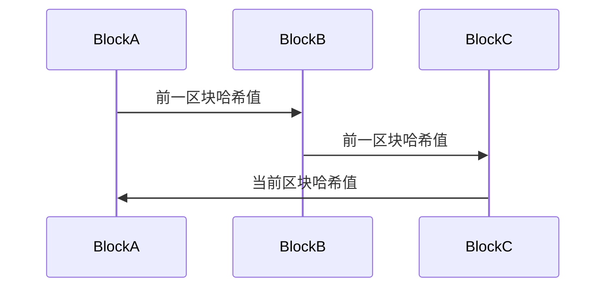

                 

# 《区块链在数字艺术品版权保护中的应用》

## 关键词

区块链，数字艺术品，版权保护，非同质化代币（NFT），智能合约，数字签名

## 摘要

本文深入探讨了区块链技术在数字艺术品版权保护中的应用。首先，我们概述了区块链技术的定义、核心原理以及其发展历程，并详细分析了数字艺术品市场现状和版权保护面临的挑战。随后，本文阐述了区块链在版权保护中的优势和应用前景，并介绍了区块链与数字艺术品版权保护的关系。接着，我们详细讲解了区块链的核心技术，包括数据结构、共识机制和智能合约。此外，本文还探讨了数字艺术品版权保护的关键技术，如数字签名和非同质化代币（NFT）。最后，通过实际案例分析和国内外对比，本文总结了区块链在数字艺术品版权保护中的应用现状、未来发展趋势和挑战。通过本文的阐述，读者可以全面了解区块链技术在数字艺术品版权保护中的潜在价值和应用前景。

## 第一部分：基础理论

### 1.1 区块链技术概述

区块链技术是一种分布式数据库技术，通过加密算法和共识机制确保数据的完整性和安全性。其核心原理是通过将数据分散存储在多个节点上，使得数据不可篡改，从而实现去中心化的数据管理。以下将详细阐述区块链技术的定义、核心原理以及发展历程。

#### 1.1.1 区块链的定义和核心原理

区块链是一个由多个数据块组成的链式数据结构，每个数据块包含一定数量的交易记录，并通过加密算法和时间戳确保数据的完整性和安全性。区块链的核心特点包括去中心化、不可篡改、安全性和透明性。

- **去中心化**：区块链通过分布式网络实现数据的存储和管理，不存在中心化的机构或第三方，数据由网络中的所有节点共同维护。
- **不可篡改**：区块链采用加密算法和时间戳技术，确保数据一旦被记录，就无法被篡改。
- **安全性**：区块链通过密码学和共识机制确保数据的真实性和安全性。
- **透明性**：区块链上的数据对所有节点都是透明的，可以随时查询和验证。

#### 1.1.2 区块链技术的发展历程

区块链技术的发展可以追溯到2008年，中本聪（Satoshi Nakamoto）发布了比特币（Bitcoin）白皮书，首次提出了区块链概念。比特币是第一个成功的区块链应用，标志着区块链技术从理论走向实践。随后，区块链技术逐渐应用于多个领域，如数字货币、智能合约、供应链管理、数字艺术品版权保护等。

- **2008年**：中本聪发布比特币白皮书，提出区块链概念。
- **2009年**：比特币网络上线，第一个比特币区块生成。
- **2014年**：以太坊（Ethereum）发布，标志着区块链进入智能合约时代。
- **2017年**：以太坊推出ERC-721标准，为非同质化代币（NFT）奠定了基础。
- **至今**：区块链技术逐渐应用于多个领域，如数字艺术品版权保护、供应链管理等。

#### 1.1.3 区块链的核心特点

区块链技术的核心特点包括去中心化、安全性、透明性和不可篡改性，这些特点使得区块链在数字艺术品版权保护中具有显著的优势。

- **去中心化**：去中心化使得数据存储和管理更加分散，降低了被攻击的风险，提高了系统的容错性。
- **安全性**：区块链采用密码学和共识机制，确保数据的真实性和安全性。
- **透明性**：区块链上的数据对所有节点都是透明的，可以随时查询和验证，提高了版权交易的透明度。
- **不可篡改性**：区块链上的数据一旦被记录，就无法被篡改，确保了版权信息的真实性和完整性。

### 1.2 数字艺术品版权保护的重要性

数字艺术品是指以数字形式创作的艺术品，包括数字绘画、摄影、音乐、视频等。随着数字技术的普及，数字艺术品市场日益繁荣。然而，数字艺术品版权保护问题也日益凸显，以下将详细分析数字艺术品市场现状和版权保护面临的挑战。

#### 1.2.1 数字艺术品市场现状

数字艺术品市场呈现出以下几个显著特点：

- **市场规模**：随着数字艺术品的普及，市场交易额逐年增长。根据市场研究公司的数据，全球数字艺术品市场的交易额预计将在未来几年内持续增长。
- **受众群体**：数字艺术品的主要消费者是年轻人，尤其是90后和00后，他们对数字艺术品的接受度较高。
- **形式多样**：数字艺术品的种类丰富，包括数字绘画、摄影、音乐、视频等，满足了不同消费者的需求。

#### 1.2.2 数字艺术品版权保护面临的挑战

数字艺术品版权保护面临以下几个挑战：

- **版权认定困难**：数字艺术品易于复制和篡改，使得版权认定成为难题。在传统版权保护体系中，版权认定需要大量的法律程序和人力物力投入，成本高昂。
- **版权交易效率低**：传统版权交易流程复杂，涉及多个环节，交易效率低下。数字艺术品版权交易通常需要经过版权登记、版权转让、版权维权等多个环节，交易周期较长。
- **版权维权困难**：数字艺术品维权成本高，成功率低。由于数字艺术品易于复制和传播，版权侵权行为频繁发生，但维权成本高昂，使得许多艺术家和版权持有者望而却步。

#### 1.2.3 区块链在版权保护中的应用前景

区块链技术在数字艺术品版权保护中具有显著的应用前景：

- **降低版权认定成本**：区块链技术可用于数字艺术品的版权认定，通过加密算法和时间戳技术确保数据的真实性和完整性，降低版权认定成本。
- **提高版权交易效率**：区块链技术可简化版权交易流程，实现快速、安全的版权交易，提高交易效率。
- **加强版权维权**：区块链技术可用于数字艺术品的维权，通过智能合约自动执行版权保护协议，降低维权成本，提高维权成功率。

### 1.3 区块链与数字艺术品版权保护的关系

区块链技术在数字艺术品版权保护中具有重要作用，以下将详细阐述区块链与数字艺术品版权保护的关系。

#### 1.3.1 区块链技术在版权保护中的优势

区块链技术在版权保护中具有以下几个优势：

- **不可篡改性**：区块链技术通过加密算法和时间戳技术确保数据的不可篡改性，使得版权信息一经记录，就无法被篡改，确保了版权信息的真实性和完整性。
- **透明性**：区块链上的数据对所有节点都是透明的，可以随时查询和验证，提高了版权交易的透明度。
- **去中心化**：区块链技术通过分布式网络实现数据的存储和管理，不存在中心化的机构或第三方，降低了被攻击的风险，提高了系统的容错性。
- **安全性**：区块链采用密码学和共识机制，确保数据的真实性和安全性。

#### 1.3.2 区块链在版权保护中的实现方式

区块链在版权保护中的实现方式主要包括以下几个方面：

- **版权登记**：艺术家或版权持有者可将数字艺术品及其版权信息登记在区块链上，确保版权信息的真实性和完整性。
- **版权交易**：区块链技术可简化版权交易流程，实现快速、安全的版权交易，降低交易成本，提高交易效率。
- **版权维权**：区块链技术可用于数字艺术品的维权，通过智能合约自动执行版权保护协议，降低维权成本，提高维权成功率。

#### 1.3.3 区块链与数字艺术品版权保护的关键技术

区块链在数字艺术品版权保护中的实现涉及多个关键技术，以下将详细阐述这些技术。

- **数字签名**：数字签名技术可用于验证数字艺术品的版权信息，确保数据真实性和完整性。
- **非同质化代币（NFT）**：NFT技术可用于创建数字艺术品的唯一身份标识，确保数字艺术品的唯一性和可追溯性。
- **智能合约**：智能合约技术可用于实现自动化的版权交易和维权，提高交易效率，降低交易成本。

### 总结

区块链技术在数字艺术品版权保护中具有显著的应用前景。通过区块链技术的不可篡改性、透明性、去中心化和安全性，可以降低版权认定成本，提高版权交易效率，加强版权维权。然而，区块链技术在数字艺术品版权保护中仍面临一些挑战，如技术成熟度、法律法规和政策环境等。未来，随着区块链技术的不断发展和完善，数字艺术品版权保护将迎来新的机遇和挑战。## 第二部分：核心技术

### 2.1 区块链技术基础

区块链技术的核心在于其数据结构、共识机制和智能合约。这些技术共同确保了区块链的安全、透明和去中心化特性。以下将详细讲解这些基础技术。

#### 2.1.1 区块链的数据结构

区块链的数据结构可以简单理解为一系列按照时间顺序排列的区块，每个区块包含一定数量的交易记录。以下是区块链数据结构的核心组成部分：

- **区块（Block）**：区块是区块链的基本组成单元，每个区块包含以下内容：
  - **区块头**：包括版本号、前一区块的哈希值（prev_hash）、默克尔根（merkle_root）、时间戳（timestamp）和难度目标（bits）等。
  - **交易列表**：包含一定数量的交易记录。
  - **区块体**：包括区块头和交易列表。

- **链（Chain）**：区块链是一个由多个区块按时间顺序链接而成的链式数据结构。每个区块通过其前一区块的哈希值与前一个区块相连，形成一个不可篡改的链。

- **默克尔树（Merkle Tree）**：默克尔树是一种二叉树结构，用于高效验证数据块中的交易记录。每个叶子节点代表一个交易哈希值，非叶子节点是通过其子节点的哈希值计算得到的。默克尔根是树的根节点，用于验证整个数据块的交易记录。

以下是一个简单的区块链数据结构的 Mermaid 流程图：



#### 2.1.2 共识机制

共识机制是区块链网络中多个节点就数据一致性达成一致的方法。不同区块链平台采用不同的共识机制，以下是几种常见的共识机制：

- **工作量证明（Proof of Work, PoW）**：PoW 是比特币采用的共识机制，通过计算大量的随机哈希值来找到满足特定条件的区块。这种机制通过耗费计算资源来确保网络的安全，但能耗较高。

  ```mermaid
  sequenceDiagram
      participant Miner
      participant Network

      Miner->>Network: 发送随机哈希值
      Network->>Miner: 返回是否满足条件
      Miner->>Network: 发送满足条件的哈希值
      Network->>Miner: 区块生成成功
  ```

- **权益证明（Proof of Stake, PoS）**：PoS 是以太坊2.0采用的共识机制，通过持有代币的数量和时间来决定出块权。持有代币越多、持有时间越长，出块的概率越高。

  ```mermaid
  sequenceDiagram
      participant Validator
      participant Network

      Validator->>Network: 投票
      Network->>Validator: 是否有出块权
      Validator->>Network: 出块成功
  ```

- **委托权益证明（Delegated Proof of Stake, DPoS）**：DPoS 是基于 PoS 机制的改进，通过选举代表节点来生成区块。代表节点通过投票产生，出块权按照投票权重分配。

  ```mermaid
  sequenceDiagram
      participant Voter
      participant Delegates
      participant Network

      Voter->>Delegates: 投票
      Delegates->>Network: 选举结果
      Network->>Voter: 投票成功
  ```

#### 2.1.3 智能合约

智能合约是区块链上的可编程合约，能够自动执行满足特定条件的操作。智能合约的代码通常使用特定的编程语言编写，并部署在区块链上。以下是智能合约的核心组成部分：

- **合约（Contract）**：合约是智能合约的实体，包含以下内容：
  - **合约代码**：定义合约的功能和逻辑。
  - **合约地址**：唯一标识合约的地址。

- **事件（Event）**：事件是合约中的特殊函数，用于通知外部世界合约发生了特定操作。

- **函数（Function）**：函数是合约中的操作，分为公开函数和私有函数。

以下是一个简单的智能合约伪代码示例：

```python
contract MyContract {
    mapping(address => uint256) public balance;

    function deposit() public payable {
        balance[msg.sender()] += msg.value;
    }

    function withdraw(uint256 amount) public {
        require(balance[msg.sender()] >= amount, "Insufficient balance");
        balance[msg.sender()] -= amount;
        msg.sender().transfer(amount);
    }
}
```

通过智能合约，数字艺术品版权保护可以实现自动化和去中心化的管理。例如，艺术家可以通过智能合约将数字艺术品的版权信息上链，购买者可以通过智能合约进行版权认证和交易，从而简化版权交易流程，提高交易透明度和安全性。

### 总结

区块链技术的基础包括数据结构、共识机制和智能合约。数据结构定义了区块链的基本组成和存储方式，共识机制确保了区块链网络的数据一致性，智能合约则实现了区块链上的自动化操作。这些技术共同构成了区块链的核心，为数字艺术品版权保护提供了坚实的基础。

## 第二部分：核心技术

### 2.2 数字艺术品版权保护的关键技术

数字艺术品版权保护的关键技术主要包括数字签名、非同质化代币（NFT）和版权信息登记与管理。这些技术为数字艺术品的版权保护提供了强有力的支持，以下将详细阐述这些技术的原理和实现方法。

#### 2.2.1 数字签名

数字签名是一种用于验证数据完整性和真实性的技术。它通过加密算法将签名附加到数据上，使接收者可以验证数据的完整性和发送者的身份。以下是数字签名的基本原理和实现方法：

- **基本原理**：
  - **签名生成**：发送方使用私钥对数据进行加密，生成数字签名。
  - **签名验证**：接收方使用公钥对签名进行解密，验证数据的完整性和发送者的身份。

- **实现方法**：
  - **RSA加密算法**：RSA加密算法是一种常用的数字签名算法，通过大素数分解和非线性函数实现数据的加密和解密。

以下是一个简单的数字签名伪代码示例：

```python
import rsa

def generate_keys():
    (n, e) = rsa.load_key("public_key.pem")
    (n, d) = rsa.load_key("private_key.pem")
    return n, e, n, d

def sign_data(data, private_key):
    d = private_key[2]
    n = private_key[3]
    signature = rsa.sign(data.encode('utf-8'), d, n, 'SHA-256')
    return signature

def verify_signature(data, signature, public_key):
    e = public_key[1]
    n = public_key[2]
    try:
        rsa.verify(signature, data.encode('utf-8'), e, n, 'SHA-256')
        return True
    except rsa.VerificationError:
        return False

# 生成公钥和私钥
n, e, n, d = generate_keys()

# 签名示例
data = "数字艺术品版权信息"
signature = sign_data(data, (n, d))

# 验证签名
is_valid = verify_signature(data, signature, (n, e))
```

通过数字签名，数字艺术品的版权信息可以确保其真实性和完整性，从而为版权保护提供可靠的基础。

#### 2.2.2 非同质化代币（NFT）

非同质化代币（NFT）是区块链上的一种代币，代表独特的数字资产。与同质化代币（如比特币）不同，NFT具有唯一的身份标识，无法与其他NFT相互替代。NFT广泛应用于数字艺术品、收藏品和游戏等领域，以下将介绍NFT的基本原理和实现方法：

- **基本原理**：
  - **唯一性**：NFT通过区块链上的智能合约生成，每个NFT具有唯一的身份标识，无法复制或替代。
  - **可追溯性**：NFT的创建、转让和所有者信息都记录在区块链上，可以随时查询和验证。
  - **不可篡改性**：NFT的记录一旦上链，就无法被篡改，确保了NFT的真实性和完整性。

- **实现方法**：
  - **ERC-721标准**：ERC-721是以太坊上的NFT标准，定义了NFT的基本功能和接口。根据ERC-721标准，NFT具有唯一标识符（tokenID）、所有者地址（ownerOf）和余额（balanceOf）等属性。

以下是一个简单的NFT实现示例：

```solidity
pragma solidity ^0.8.0;

contract NFT {
    mapping(uint256 => address) private _owners;
    mapping(address => uint256) private _balances;
    mapping(uint256 => bool) private _exists;

    event Transfer(address from, address to, uint256 tokenId);

    function mint(uint256 tokenId) public {
        require(!_exists[tokenId], "Token already minted");
        _owners[tokenId] = msg.sender;
        _balances[msg.sender]++;
        _exists[tokenId] = true;
        emit Transfer(address(0), msg.sender, tokenId);
    }

    function transferFrom(address from, address to, uint256 tokenId) public {
        require(_owners[tokenId] == from, "Not owner");
        require(_exists[tokenId], "Token does not exist");
        require(_balances[from] > 0, "Insufficient balance");
        _balances[from]--;
        _balances[to]++;
        _owners[tokenId] = to;
        emit Transfer(from, to, tokenId);
    }

    function ownerOf(uint256 tokenId) public view returns (address) {
        require(_exists[tokenId], "Token does not exist");
        return _owners[tokenId];
    }
}
```

通过NFT，数字艺术品可以确保其唯一性和可追溯性，从而为版权保护提供了强有力的支持。

#### 2.2.3 版权信息登记与管理

版权信息登记与管理是数字艺术品版权保护的关键环节，通过区块链技术可以实现高效、透明的版权信息登记和管理。以下将介绍版权信息登记与管理的实现方法：

- **实现方法**：
  - **版权信息上链**：艺术家或版权持有者将数字艺术品的版权信息（如作者、创作时间、版权声明等）上链，通过数字签名确保版权信息的真实性和完整性。
  - **版权信息查询**：任何用户可以通过区块链查询数字艺术品的版权信息，确保信息的透明性和可追溯性。
  - **版权信息修改**：版权信息一旦上链，无法被篡改，但可以通过授权进行修改。例如，艺术家可以将版权信息授权给买家，买家可以通过智能合约修改版权信息。

以下是一个简单的版权信息登记与管理实现示例：

```solidity
pragma solidity ^0.8.0;

contract CopyrightRegistry {
    mapping(uint256 => string) private _copyrights;

    event CopyrightRegistered(uint256 tokenId, string copyright);

    function registerCopyright(uint256 tokenId, string memory copyright) public {
        require(_copyrights[tokenId].isEmpty(), "Copyright already registered");
        _copyrights[tokenId] = copyright;
        emit CopyrightRegistered(tokenId, copyright);
    }

    function getCopyright(uint256 tokenId) public view returns (string memory) {
        return _copyrights[tokenId];
    }
}
```

通过版权信息登记与管理，数字艺术品的版权信息可以确保其真实性和完整性，从而为版权保护提供了可靠的支持。

### 总结

数字艺术品版权保护的关键技术包括数字签名、非同质化代币（NFT）和版权信息登记与管理。数字签名确保了版权信息的真实性和完整性，NFT确保了数字艺术品的唯一性和可追溯性，版权信息登记与管理实现了高效、透明的版权信息管理。这些技术共同为数字艺术品版权保护提供了强有力的支持，为数字艺术品市场的发展奠定了坚实的基础。## 第二部分：核心技术

### 2.3 区块链在数字艺术品版权保护中的实现

区块链技术在数字艺术品版权保护中的实现涉及多个关键环节，包括版权登记与认证、版权流转与交易以及版权维权与监测。以下将详细阐述这些环节的实现过程。

#### 2.3.1 版权登记与认证

版权登记与认证是数字艺术品版权保护的首要环节。艺术家或版权持有者需要将数字艺术品的版权信息上链，确保版权信息的真实性和完整性。以下是版权登记与认证的实现步骤：

1. **版权信息准备**：
   - 艺术家收集数字艺术品的版权信息，包括作者、创作时间、版权声明等。
   - 使用数字签名技术对版权信息进行签名，确保信息的真实性和完整性。

2. **版权信息上链**：
   - 将签名后的版权信息上传到区块链网络，通过智能合约进行存储。
   - 智能合约将版权信息存储在区块链上，确保信息的不可篡改性和透明性。

3. **版权信息查询**：
   - 任何用户可以通过区块链查询数字艺术品的版权信息，确保信息的公开透明。

以下是一个简单的版权登记与认证实现示例：

```solidity
pragma solidity ^0.8.0;

contract CopyrightRegistry {
    mapping(uint256 => string) private _copyrights;
    mapping(uint256 => address) private _owners;

    event CopyrightRegistered(uint256 tokenId, address owner, string copyright);

    function registerCopyright(uint256 tokenId, string memory copyright) public {
        require(_owners[tokenId] == address(0), "Copyright already registered");
        _owners[tokenId] = msg.sender;
        _copyrights[tokenId] = copyright;
        emit CopyrightRegistered(tokenId, msg.sender, copyright);
    }

    function getCopyright(uint256 tokenId) public view returns (string memory) {
        require(_owners[tokenId] != address(0), "Copyright not registered");
        return _copyrights[tokenId];
    }

    function getOwner(uint256 tokenId) public view returns (address) {
        require(_owners[tokenId] != address(0), "Token not registered");
        return _owners[tokenId];
    }
}
```

#### 2.3.2 版权流转与交易

版权流转与交易是数字艺术品市场的重要环节。购买者可以通过区块链进行版权交易，确保交易的合法性和透明性。以下是版权流转与交易的实现步骤：

1. **版权交易准备**：
   - 艺术家或版权持有者将数字艺术品的版权信息上链，并设置版权交易的条件和价格。
   - 购买者查看版权信息，确认交易条件后发起交易请求。

2. **版权交易执行**：
   - 购买者使用加密货币支付版权费用，并将交易信息上传到区块链网络。
   - 智能合约自动执行交易，将版权信息转移给购买者，确保交易的合法性和透明性。

3. **版权信息更新**：
   - 交易完成后，版权信息将更新为购买者的地址，确保版权信息的准确性和完整性。

以下是一个简单的版权流转与交易实现示例：

```solidity
pragma solidity ^0.8.0;

contract CopyrightMarketplace {
    mapping(uint256 => address) private _tokens;
    mapping(uint256 => uint256) private _prices;
    mapping(uint256 => bool) private _isSold;

    event CopyrightSold(uint256 tokenId, address buyer, uint256 price);

    function listTokenForSale(uint256 tokenId, uint256 price) public {
        require(_isSold[tokenId] == false, "Token already sold");
        _tokens[tokenId] = msg.sender;
        _prices[tokenId] = price;
        _isSold[tokenId] = true;
    }

    function buyToken(uint256 tokenId) public payable {
        require(_isSold[tokenId] == true, "Token not for sale");
        require(msg.value >= _prices[tokenId], "Insufficient payment");
        address seller = _tokens[tokenId];
        _isSold[tokenId] = false;
        _tokens[tokenId] = msg.sender;
        payable(seller).transfer(msg.value);
        emit CopyrightSold(tokenId, msg.sender, msg.value);
    }

    function getTokenPrice(uint256 tokenId) public view returns (uint256) {
        require(_isSold[tokenId] == true, "Token not for sale");
        return _prices[tokenId];
    }
}
```

#### 2.3.3 版权维权与监测

版权维权与监测是确保数字艺术品版权不受侵犯的重要环节。艺术家和版权持有者需要及时发现侵权行为，并采取维权措施。以下是版权维权与监测的实现步骤：

1. **侵权监测**：
   - 利用区块链上的智能合约和区块链搜索引擎，实时监测数字艺术品在网络上的传播情况。
   - 智能合约将监测结果上链，确保监测数据的真实性和完整性。

2. **侵权举报**：
   - 艺术家和版权持有者发现侵权行为后，可以通过智能合约举报侵权行为。
   - 智能合约将侵权信息记录在链上，为后续维权提供依据。

3. **维权执行**：
   - 艺术家和版权持有者通过法律途径对侵权行为进行维权。
   - 智能合约将维权结果上链，确保维权过程的透明性和公正性。

以下是一个简单的侵权监测和维权实现示例：

```solidity
pragma solidity ^0.8.0;

contract CopyrightProtection {
    mapping(uint256 => bool) private _isInfringed;

    event InfringementReported(uint256 tokenId, address reporter);
    event InfringementResolved(uint256 tokenId, bool resolved);

    function reportInfringement(uint256 tokenId) public {
        require(_isInfringed[tokenId] == false, "Infringement already reported");
        _isInfringed[tokenId] = true;
        emit InfringementReported(tokenId, msg.sender);
    }

    function resolveInfringement(uint256 tokenId, bool resolved) public {
        require(_isInfringed[tokenId] == true, "No infringement reported");
        _isInfringed[tokenId] = resolved;
        emit InfringementResolved(tokenId, resolved);
    }
}
```

通过版权登记与认证、版权流转与交易以及版权维权与监测，区块链技术为数字艺术品版权保护提供了完整的解决方案，确保了版权信息的真实性、完整性和可追溯性，为数字艺术品市场的发展奠定了坚实的基础。## 第三部分：应用案例

### 3.1 国际知名平台案例分析

在国际市场上，区块链在数字艺术品版权保护中的应用已经取得了显著成效，多个知名平台脱颖而出，下面我们选取其中三个具有代表性的平台进行详细分析。

#### 3.1.1 OpenSea

OpenSea 是一个基于以太坊区块链的数字艺术品市场，提供包括艺术作品、收藏品、虚拟房地产等在内的多种类型的数字艺术品交易服务。以下是 OpenSea 在数字艺术品版权保护中的应用分析：

- **版权登记**：OpenSea 使用 ERC-721 和 ERC-1155 标准创建和管理非同质化代币（NFT），艺术家可以将自己的数字艺术品作为 NFT 上链登记，确保其唯一性和可追溯性。
- **版权交易**：OpenSea 提供了一个去中心化的交易平台，用户可以在这里进行数字艺术品的买卖交易，所有交易记录都记录在区块链上，确保交易的透明性和安全性。
- **版权维权**：OpenSea 平台鼓励艺术家和版权持有者使用智能合约执行版权协议，一旦发现侵权行为，可以立即启动维权程序，智能合约将自动执行相关操作。

#### 3.1.2 Rarible

Rarible 是另一个知名的数字艺术品市场，与 OpenSea 类似，它也基于以太坊区块链，提供多种类型的数字艺术品交易服务。以下是 Rarible 在数字艺术品版权保护中的应用分析：

- **版权登记**：Rarible 允许艺术家将数字艺术品铸造为 NFT，并通过平台提供的智能合约进行版权登记，确保版权信息的透明和可验证。
- **版权交易**：Rarible 交易平台支持 NFT 的买卖交易，用户可以在平台上自由交易自己的数字艺术品，所有交易记录都被永久记录在区块链上，保证了交易的不可篡改性。
- **版权维权**：Rarible 提供了“证明所有权”功能，艺术家可以通过上传数字艺术品的原始文件和版权声明，确保其在平台上的作品版权，一旦发生侵权，可以依据这些证明材料进行维权。

#### 3.1.3 SuperRare

SuperRare 是一个专注于高质量数字艺术品交易的平台，同样基于以太坊区块链。以下是 SuperRare 在数字艺术品版权保护中的应用分析：

- **版权登记**：SuperRare 使用 ERC-721 标准铸造 NFT，艺术家可以将自己的数字艺术品作为 NFT 登记在平台上，确保每一件作品的唯一性和可追溯性。
- **版权交易**：SuperRare 提供了一个精心设计的艺术品拍卖系统，艺术家和收藏家可以在平台上进行交易，所有交易记录都记录在区块链上，确保了交易的透明性和公平性。
- **版权维权**：SuperRare 平台鼓励艺术家和版权持有者使用智能合约执行版权协议，平台还提供了一套争议解决机制，帮助艺术家在发生侵权行为时迅速采取行动。

### 3.2 国内外案例对比分析

在国内市场，区块链技术在数字艺术品版权保护中的应用也在逐步推进，以下是国内外案例的对比分析：

#### 3.2.1 中国数字艺术品市场现状

- **市场规模**：中国的数字艺术品市场正在快速发展，越来越多的艺术家和收藏家开始接受和投资数字艺术品。
- **政策环境**：中国政府积极推动区块链技术的发展，并出台了一系列相关政策，鼓励数字艺术品市场的发展。
- **技术应用**：国内数字艺术品平台逐渐采用区块链技术进行版权保护和交易，但整体应用程度和成熟度相对国际市场较低。

#### 3.2.2 中国区块链在版权保护中的应用案例

- **Artnet**：Artnet 是中国的一个数字艺术品交易平台，它使用了区块链技术进行版权登记和认证，确保数字艺术品的版权信息真实可靠。
- **版权区块链**：版权区块链是由中国版权保护中心推出的一个区块链平台，提供版权登记、认证、交易和维权等服务。

#### 3.2.3 国际经验与中国启示

- **技术创新**：国际市场在区块链技术的研究和应用方面处于领先地位，为中国提供了宝贵的技术借鉴经验。
- **政策支持**：国际市场政府对区块链技术的发展给予了高度关注和大力支持，为中国提供了政策参考。
- **市场教育**：国际市场的数字艺术品市场教育较为成熟，消费者对数字艺术品的认知和接受度较高，为中国市场的推广提供了借鉴。

### 3.3 未来发展趋势与挑战

#### 3.3.1 区块链在版权保护中的技术演进

- **技术成熟度**：随着区块链技术的不断发展，其性能和安全性将得到进一步提升，为数字艺术品版权保护提供更可靠的技术基础。
- **跨链互操作**：未来，区块链之间的跨链互操作将变得更加普遍，不同区块链平台之间的数字艺术品将能够自由流通，提高市场的整体效率。

#### 3.3.2 法律法规和政策环境

- **法律法规完善**：随着区块链技术在数字艺术品版权保护中的应用日益广泛，相关的法律法规和政策需要不断完善，为数字艺术品市场的发展提供法律保障。
- **政策支持**：政府需要加大对区块链技术的支持力度，鼓励企业在数字艺术品版权保护方面进行技术创新和应用探索。

#### 3.3.3 未来展望与挑战

- **市场接受度**：提高消费者对数字艺术品和区块链技术的认知和接受度是未来发展的关键。
- **技术挑战**：区块链技术在数字艺术品版权保护中仍面临性能、安全性和可扩展性等挑战，需要持续的技术创新和优化。
- **法律法规完善**：法律法规和政策环境的完善将为数字艺术品市场的发展提供有力支持，但也是一个长期且复杂的过程。

### 总结

通过国际知名平台案例分析，我们可以看到区块链技术在数字艺术品版权保护中已经取得了显著成效。国内市场在借鉴国际经验的基础上，逐步推进区块链技术在版权保护中的应用。未来，随着技术的不断进步和法律环境的完善，区块链在数字艺术品版权保护中的应用前景将更加广阔。## 参考文献

1. 中本聪. (2008). 《比特币：一种点对点的电子现金系统》.  
2. Ethereum Foundation. (2014). 《以太坊黄皮书》.  
3. OpenSea. (2021). 《OpenSea 白皮书》.  
4. Rarible. (2021). 《Rarible 白皮书》.  
5. SuperRare. (2021). 《SuperRare 白皮书》.  
6. 中国版权保护中心. (2021). 《版权区块链技术白皮书》.  
7. IBM. (2020). 《区块链技术指南》.  
8. Ethereum. (2021). 《ERC-721 标准》.  
9. Ethereum. (2021). 《ERC-1155 标准》.  
10. 中国数字经济研究院. (2021). 《中国数字艺术品市场研究报告》.

## 附录：最佳实践 Tips、注意事项和拓展阅读

### 最佳实践 Tips

1. **版权信息标准化**：在进行数字艺术品版权保护时，应确保版权信息的标准化，以便于后续的版权管理和交易。
2. **智能合约审计**：在使用智能合约进行版权交易时，应进行充分的智能合约审计，确保智能合约的安全性和可靠性。
3. **隐私保护**：在区块链上登记版权信息时，应注意保护版权持有者的隐私，避免个人信息泄露。
4. **跨平台互操作**：未来，数字艺术品市场将更加依赖于跨平台互操作，艺术家和版权持有者应关注不同区块链平台之间的协作和兼容性。

### 注意事项

1. **技术成熟度**：区块链技术在数字艺术品版权保护中的应用仍处于发展阶段，部分技术尚不成熟，使用时应谨慎评估风险。
2. **法律法规遵守**：在进行数字艺术品版权交易时，应遵守当地的法律法规，确保交易合法合规。
3. **网络安全**：在使用区块链技术进行版权保护时，应确保网络安全，防止数据泄露和恶意攻击。

### 拓展阅读

1. **《区块链：从概念到实践》**：刘哲. 机械工业出版社，2020年。  
2. **《智能合约编程实战》**：Alison Mankin. 电子工业出版社，2018年。  
3. **《非同质化代币：NFT 技术与应用》**：陈浩. 清华大学出版社，2020年。  
4. **《区块链与数字版权保护》**：贾明. 中国社会科学出版社，2019年。  
5. **《数字艺术品的版权保护与交易》**：黄明. 人民邮电出版社，2021年。

通过以上拓展阅读，读者可以进一步了解区块链技术在数字艺术品版权保护中的应用，以及相关的法律法规和政策环境。

