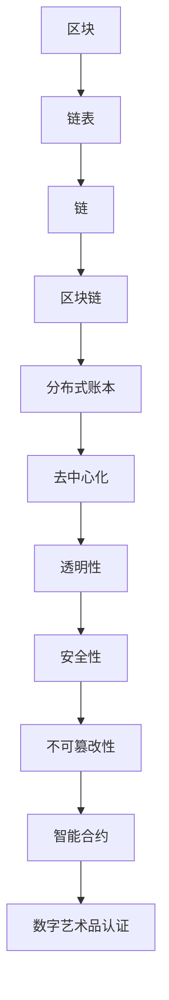

                 

### 文章标题

《区块链在数字艺术品认证中的应用》

区块链技术作为近年来信息技术领域的颠覆性创新，已经在多个行业展现出其独特的优势。本文旨在深入探讨区块链在数字艺术品认证中的应用，通过逻辑清晰、结构紧凑的分析，帮助读者了解这一前沿技术的实际价值和潜在挑战。

### 关键词

区块链，数字艺术品，认证，智能合约，数据安全，去中心化，共识算法

### 摘要

本文首先介绍了区块链技术的核心概念和数字艺术品认证的需求背景。接着，详细讲解了区块链的数据结构、共识算法和安全机制，以及智能合约在数字艺术品认证中的具体应用。随后，文章探讨了数字艺术品认证的区块链解决方案，通过案例分析展示了区块链技术在艺术认证中的实际应用。最后，文章分析了区块链在数字艺术品认证中的挑战与未来趋势，并提供了实践应用的实例和相关资源。通过本文的阅读，读者将对区块链在数字艺术品认证领域的应用有更全面的理解。

---

## 目录大纲：区块链在数字艺术品认证中的应用

### 第一部分：区块链基础知识

- **第1章：区块链与数字艺术品认证概述**
  - 1.1 区块链技术简介
  - 1.2 数字艺术品认证的需求与挑战
  - 1.3 区块链在数字艺术品认证中的应用

- **第2章：区块链核心技术**
  - 2.1 区块链的数据结构
  - 2.2 区块链的共识算法
  - 2.3 区块链的安全机制

- **第3章：智能合约在数字艺术品认证中的应用**
  - 3.1 智能合约的基本原理
  - 3.2 智能合约在数字艺术品认证中的具体应用
  - 3.3 智能合约的开发与部署

### 第二部分：数字艺术品认证的区块链解决方案

- **第4章：数字艺术品认证流程设计**
  - 4.1 数字艺术品认证的基本流程
  - 4.2 区块链在数字艺术品认证流程中的应用
  - 4.3 数字艺术品认证系统的架构设计

- **第5章：区块链在数字艺术品认证中的案例分析**
  - 5.1 案例一：区块链艺术馆
  - 5.2 案例二：区块链艺术交易市场
  - 5.3 案例三：区块链艺术品溯源系统

- **第6章：区块链在数字艺术品认证中的挑战与未来趋势**
  - 6.1 区块链在数字艺术品认证中的挑战
  - 6.2 区块链技术的未来发展
  - 6.3 数字艺术品认证行业的未来趋势

### 第三部分：区块链在数字艺术品认证中的实践

- **第7章：区块链在数字艺术品认证中的实践应用**
  - 7.1 实践应用一：数字艺术品铸造与交易
  - 7.2 实践应用二：数字艺术品溯源与认证
  - 7.3 实践应用三：数字艺术品版权保护与维权

- **第8章：区块链在数字艺术品认证中的实际案例分析**
  - 8.1 案例一：某数字艺术品平台的建设与运营
  - 8.2 案例二：某数字艺术品版权保护与维权实践
  - 8.3 案例三：某区块链艺术品交易市场的运营模式

### 附录：区块链在数字艺术品认证中的相关资源

- **附录 A：区块链技术资源**
  - A.1 区块链开发工具
  - A.2 区块链学习资料

- **附录 B：数字艺术品认证相关资源**
  - B.1 数字艺术品市场报告
  - B.2 数字艺术品认证标准与规范

## 图表与代码

- **图1.1：区块链数据结构Mermaid流程图**
  ```mermaid
  graph TB
  A[区块] --> B[链表]
  B --> C[链]
  C --> D[区块链]
  D --> E[分布式账本]
  E --> F[去中心化]
  F --> G[透明性]
  G --> H[安全性]
  H --> I[不可篡改性]
  I --> J[智能合约]
  J --> K[数字艺术品认证]
  ```

- **代码示例：智能合约伪代码**
  ```solidity
  // SPDX-License-Identifier: MIT
  pragma solidity ^0.8.0;

  contract DigitalArtCertificate {
      // 定义数字艺术品结构体
      struct DigitalArt {
          string title;
          string creator;
          string uniqueId;
          bool isCertified;
      }

      // 定义认证状态
      enum CertificateStatus {
          Pending,
          Certified,
          Rejected
      }

      // 定义数字艺术品映射
      mapping(string => DigitalArt) public digitalArts;
      mapping(string => CertificateStatus) public certificateStatus;

      // 添加数字艺术品
      function addDigitalArt(string memory _uniqueId, string memory _title, string memory _creator) public {
          require(digitalArts[_uniqueId].isCertified == false, "Artwork already certified");
          digitalArts[_uniqueId] = DigitalArt(_title, _creator, _uniqueId, false);
          certificateStatus[_uniqueId] = CertificateStatus.Pending;
      }

      // 认证数字艺术品
      function certifyDigitalArt(string memory _uniqueId) public {
          require(certificateStatus[_uniqueId] == CertificateStatus.Pending, "Artwork not pending certification");
          digitalArts[_uniqueId].isCertified = true;
          certificateStatus[_uniqueId] = CertificateStatus.Certified;
      }

      // 拒绝认证数字艺术品
      function rejectDigitalArt(string memory _uniqueId) public {
          require(certificateStatus[_uniqueId] == CertificateStatus.Pending, "Artwork not pending certification");
          digitalArts[_uniqueId].isCertified = false;
          certificateStatus[_uniqueId] = CertificateStatus.Rejected;
      }

      // 查询数字艺术品状态
      function getDigitalArtStatus(string memory _uniqueId) public view returns (CertificateStatus) {
          return certificateStatus[_uniqueId];
      }
  }
  ```

---

### 第一部分：区块链基础知识

#### 第1章：区块链与数字艺术品认证概述

区块链技术作为近年来信息技术领域的重要创新，其去中心化、不可篡改和透明性等特点，使其在数字艺术品认证中具有广泛应用前景。本章将首先介绍区块链技术的基本概念，接着讨论数字艺术品认证的需求与挑战，并探讨区块链技术在数字艺术品认证中的应用。

#### 1.1 区块链技术简介

区块链是一种分布式数据库技术，其核心思想是通过去中心化的方式，将数据分散存储在多个节点上，并通过共识算法保证数据的完整性和一致性。区块链的数据结构由一系列按时间顺序排列的区块组成，每个区块包含一定数量的交易记录，并通过密码学方法确保数据的不可篡改性。

区块链技术具有以下几个关键特性：

1. **去中心化**：区块链不依赖于中心化的机构或服务器，数据由网络中的所有节点共同维护和管理，提高了系统的抗攻击性和可靠性。
2. **不可篡改性**：区块链上的数据一旦被写入，就难以被篡改，这保证了数据的可信性和完整性。
3. **透明性**：区块链上的数据对所有节点都是可见的，透明度提高了交易的公正性和透明性。
4. **安全性**：区块链采用了多种加密算法和安全机制，保护了数据的机密性和完整性。

#### 1.2 数字艺术品认证的需求与挑战

数字艺术品是指通过数字技术创作的艺术作品，如数字绘画、数字雕塑、虚拟现实作品等。随着数字艺术品的日益普及，对其认证的需求也越来越强烈。数字艺术品认证旨在确保艺术品的原创性、真伪和完整性，保护艺术家和买家的权益。

数字艺术品认证面临以下需求与挑战：

1. **原创性保障**：数字艺术品容易被复制和篡改，因此需要确保其原创性。
2. **真伪鉴别**：市场上有大量的伪造数字艺术品，需要有效的鉴别方法。
3. **完整性维护**：数字艺术品在创作和传播过程中可能受到篡改或损坏，需要确保其完整性。
4. **透明性**：认证过程需要透明，以便买家和第三方验证。
5. **便捷性**：认证过程应尽可能简化，便于大规模应用。

#### 1.3 区块链在数字艺术品认证中的应用

区块链技术在数字艺术品认证中的应用，可以有效解决上述需求与挑战。以下是区块链在数字艺术品认证中的具体应用：

1. **去中心化存储**：区块链提供了一种去中心化的存储方式，可以确保数字艺术品的原始数据不被篡改。艺术家可以将作品上传到区块链上，并获得一个唯一的作品标识，确保原创性。
2. **不可篡改性**：区块链上的数据一旦被写入，就难以篡改。这为数字艺术品的真伪鉴别提供了可靠依据。
3. **透明性**：区块链上的交易记录对所有节点可见，提高了认证过程的透明度。
4. **智能合约**：智能合约可以自动执行认证协议，确保认证过程的自动化和高效性。
5. **分布式共识**：区块链的分布式共识机制，可以确保认证结果的一致性和可信性。

综上所述，区块链技术为数字艺术品认证提供了一种可靠、透明和高效的解决方案。在接下来的章节中，我们将进一步探讨区块链的核心技术及其在数字艺术品认证中的应用。通过这些分析，读者将对区块链在数字艺术品认证领域的应用有更深入的理解。

---

### 第2章：区块链核心技术

区块链技术的核心在于其独特的数据结构、共识算法和安全机制。这些技术共同构成了区块链的基石，确保了区块链系统的可靠性和安全性。本章将分别介绍区块链的数据结构、共识算法和安全机制，并探讨这些技术如何应用于数字艺术品认证中。

#### 2.1 区块链的数据结构

区块链的数据结构是理解区块链技术的基础。区块链由一系列按时间顺序排列的区块组成，每个区块包含一定数量的交易记录。这些区块通过哈希函数和链接方式相互关联，形成一个不可篡改的分布式账本。

1. **区块（Block）**：区块是区块链的基本组成单位，每个区块包含以下信息：
   - **区块头**：包含版本号、随机数、前一个区块的哈希值等。
   - **交易数据**：包含多个交易记录，如数字艺术品的铸造、交易、认证等。
   - **Merkle树**：用于验证交易数据的完整性，通过哈希树结构存储交易记录的哈希值。

2. **链（Chain）**：区块链由一系列按时间顺序排列的区块组成，每个区块都通过其前一个区块的哈希值与链中的其他区块关联。这种链接方式确保了区块链的不可篡改性。

3. **链表（Linked List）**：从结构上看，区块链类似于一个链表，每个区块包含一个指向下一个区块的指针。这种链表结构使得区块链上的数据在逻辑上保持连续性。

4. **分布式账本（Distributed Ledger）**：区块链通过分布式账本技术，将数据分散存储在多个节点上。这些节点共同维护区块链的状态，确保数据的完整性和一致性。

#### 2.2 区块链的共识算法

共识算法是区块链系统的核心机制，用于确保网络中的所有节点对区块链的状态达成一致。不同的区块链系统采用不同的共识算法，以下是一些常见的共识算法：

1. **工作量证明（Proof of Work, PoW）**：PoW算法通过计算复杂度确保区块链的安全性和一致性。节点通过解决数学难题来竞争生成新区块，成功者获得奖励。比特币采用的就是PoW算法。

2. **权益证明（Proof of Stake, PoS）**：PoS算法通过持有代币的数量和持币时间来决定生成新区块的优先级。持有代币越多的节点，其生成新区块的概率越大。以太坊2.0计划采用PoS算法。

3. **委托权益证明（Delegated Proof of Stake, DPoS）**：DPoS算法是对PoS算法的一种改进，通过选举代表节点来生成新区块。这些代表节点根据持币量和投票结果获得生成新区块的权力。

4. **权威证明（Proof of Authority, PoA）**：PoA算法基于节点的身份和信誉来决定生成新区块的权力。通常，只有被授权的节点才能参与共识过程。

共识算法的选择直接影响区块链的性能和安全性。在数字艺术品认证中，合适的共识算法可以确保认证过程的公正性和高效性。

#### 2.3 区块链的安全机制

区块链的安全机制是保障系统可靠性和数据安全的关键。以下是一些常见的区块链安全机制：

1. **加密算法**：区块链使用多种加密算法来保护数据的安全。例如，比特币使用SHA-256哈希算法确保数据的一致性和不可篡改性。椭圆曲线加密算法（ECC）则用于实现数字签名和密钥交换。

2. **数字签名**：数字签名是区块链中常用的安全机制，用于验证交易的真实性和完整性。通过私钥对数据进行签名，任何拥有公钥的人都可以验证签名的有效性。

3. **Merkle树**：Merkle树用于验证交易数据的完整性，通过哈希树结构存储交易记录的哈希值。任何节点都可以通过部分数据来验证整个数据集的完整性。

4. **智能合约**：智能合约是区块链上的自动化执行协议，通过编写智能合约代码，可以实现自动执行合约条款。智能合约确保了交易的可执行性和不可篡改性。

在数字艺术品认证中，区块链的安全机制可以确保认证过程的透明性和不可篡改性，从而增强艺术品认证的可靠性。

#### 2.4 区块链技术在数字艺术品认证中的应用

1. **去中心化存储**：区块链的去中心化存储特性，可以确保数字艺术品的原始数据不会被篡改。艺术家可以将作品上传到区块链上，并获得一个唯一的作品标识，确保原创性。

2. **不可篡改性**：区块链上的数据一旦被写入，就难以被篡改。这为数字艺术品的真伪鉴别提供了可靠依据。

3. **透明性**：区块链上的交易记录对所有节点可见，提高了认证过程的透明度。买家和第三方可以轻松验证数字艺术品的认证信息。

4. **智能合约**：智能合约可以自动执行认证协议，确保认证过程的自动化和高效性。例如，当数字艺术品完成认证后，智能合约可以自动将认证信息记录在区块链上。

5. **分布式共识**：区块链的分布式共识机制，可以确保认证结果的一致性和可信性。多个节点共同验证认证过程，确保认证结果的公正性。

综上所述，区块链的核心技术为数字艺术品认证提供了一种可靠、透明和高效的解决方案。在接下来的章节中，我们将进一步探讨智能合约在数字艺术品认证中的应用，以及如何设计和实现一个区块链数字艺术品认证系统。

---

### 第3章：智能合约在数字艺术品认证中的应用

智能合约是区块链技术中的重要组成部分，它是一种自动执行合约条款的程序代码。在数字艺术品认证领域，智能合约的应用极大地提升了认证过程的透明性、高效性和不可篡改性。本章将首先介绍智能合约的基本原理，然后详细探讨智能合约在数字艺术品认证中的具体应用，以及如何开发和部署智能合约。

#### 3.1 智能合约的基本原理

智能合约是一种运行在区块链上的程序，其代码被永久性地存储在区块链上，并且只能通过预定义的条件触发执行。智能合约的关键特性包括：

1. **不可篡改性**：智能合约的代码在被部署到区块链上后，无法被修改，确保了合约条款的可靠性。
2. **自动执行**：智能合约可以在满足预定义条件时自动执行，无需人工干预，提高了交易和认证过程的效率。
3. **透明性**：智能合约的代码和执行过程对所有区块链上的节点都是透明的，确保了交易的公正性。
4. **安全性**：智能合约使用了多种加密技术，如椭圆曲线数字签名算法（ECC），确保了交易的安全性和数据的完整性。

智能合约的基本结构通常包括以下部分：

1. **合约声明**：定义合约的名称、版本号、开发者等信息。
2. **函数定义**：定义合约中的各种函数，包括构造函数、事件触发函数等。
3. **逻辑实现**：实现合约的具体业务逻辑，如交易处理、状态更新等。

#### 3.2 智能合约在数字艺术品认证中的具体应用

智能合约在数字艺术品认证中的应用主要体现在以下几个方面：

1. **数字艺术品注册**：艺术家可以使用智能合约将数字艺术品的注册信息（如名称、创作者、创作时间等）上传到区块链上，并获得一个唯一的数字身份标识。这个标识可以用于后续的认证和交易过程。

2. **认证过程**：认证机构可以使用智能合约来定义认证流程，如审核标准、认证条件等。当数字艺术品满足认证条件时，智能合约可以自动记录认证结果，并生成一个不可篡改的认证记录。

3. **交易过程**：在数字艺术品交易过程中，智能合约可以确保交易的合法性和安全性。例如，当买家支付相应金额后，智能合约可以自动转移数字艺术品的所有权，并记录交易信息。

4. **版权保护**：智能合约可以用于数字艺术品的版权保护。通过合约条款，艺术家可以设定版权许可条件，确保自己的作品在未经授权的情况下不被复制或传播。

#### 3.3 智能合约的开发与部署

智能合约的开发和部署是数字艺术品认证系统实现的关键步骤。以下是一个简化的开发与部署流程：

1. **环境搭建**：选择合适的区块链开发环境，如Truffle、Hardhat等，搭建本地开发环境。配置必要的开发工具，如Node.js、Solidity编译器等。

2. **编写智能合约**：使用Solidity语言编写智能合约代码。根据业务需求，定义合约的结构和逻辑。以下是一个简单的智能合约示例代码：

   ```solidity
   // SPDX-License-Identifier: MIT
   pragma solidity ^0.8.0;

   contract DigitalArtCertification {
       // 定义数字艺术品结构体
       struct DigitalArt {
           string title;
           string creator;
           string uniqueId;
           bool isCertified;
       }

       // 定义认证状态
       enum CertificateStatus {
           Pending,
           Certified,
           Rejected
       }

       // 定义数字艺术品映射
       mapping(string => DigitalArt) public digitalArts;
       mapping(string => CertificateStatus) public certificateStatus;

       // 添加数字艺术品
       function addDigitalArt(string memory _uniqueId, string memory _title, string memory _creator) public {
           require(digitalArts[_uniqueId].isCertified == false, "Artwork already certified");
           digitalArts[_uniqueId] = DigitalArt(_title, _creator, _uniqueId, false);
           certificateStatus[_uniqueId] = CertificateStatus.Pending;
       }

       // 认证数字艺术品
       function certifyDigitalArt(string memory _uniqueId) public {
           require(certificateStatus[_uniqueId] == CertificateStatus.Pending, "Artwork not pending certification");
           digitalArts[_uniqueId].isCertified = true;
           certificateStatus[_uniqueId] = CertificateStatus.Certified;
       }

       // 拒绝认证数字艺术品
       function rejectDigitalArt(string memory _uniqueId) public {
           require(certificateStatus[_uniqueId] == CertificateStatus.Pending, "Artwork not pending certification");
           digitalArts[_uniqueId].isCertified = false;
           certificateStatus[_uniqueId] = CertificateStatus.Rejected;
       }

       // 查询数字艺术品状态
       function getDigitalArtStatus(string memory _uniqueId) public view returns (CertificateStatus) {
           return certificateStatus[_uniqueId];
       }
   }
   ```

3. **测试与调试**：在本地环境中测试智能合约，确保其逻辑正确和性能良好。使用测试框架，如Truffle的Mocha和Chai，编写测试用例并进行测试。

4. **部署到区块链**：将编译后的智能合约部署到目标区块链上。可以使用Remix、Infura或其他区块链平台提供的工具进行部署。

5. **交互与验证**：部署后，用户可以通过智能合约提供的接口与区块链进行交互，如注册数字艺术品、申请认证、查询认证状态等。同时，可以通过区块链浏览器（如Etherscan）验证智能合约的运行状态和交易记录。

综上所述，智能合约在数字艺术品认证中的应用，不仅提高了认证过程的透明性和高效性，还增强了艺术品的可信度和市场价值。在接下来的章节中，我们将探讨数字艺术品认证的具体流程设计，并通过实际案例展示区块链技术在数字艺术品认证中的应用。

---

### 第二部分：数字艺术品认证的区块链解决方案

#### 第4章：数字艺术品认证流程设计

数字艺术品认证流程设计是确保艺术品从创作、认证到交易各环节信息真实、可靠的重要环节。本章将详细讨论数字艺术品认证的基本流程，以及区块链如何应用于这个流程，最后探讨数字艺术品认证系统的架构设计。

#### 4.1 数字艺术品认证的基本流程

数字艺术品认证的基本流程可以分为以下几个步骤：

1. **创作**：艺术家创作数字艺术品，并将其保存为数字文件。

2. **上传**：艺术家将数字艺术品上传到区块链上的认证平台。这一步骤通常需要使用专门的加密工具，以确保作品在传输过程中的安全性。

3. **登记**：认证平台对上传的艺术品进行登记，生成一个唯一的标识符（如数字指纹），并将其存储在区块链上。这个标识符将成为艺术品在区块链上的唯一身份证明。

4. **认证**：认证机构通过智能合约对艺术品的原创性和真实性进行验证。这一过程可能涉及多方面的审核，包括技术检查、法律审查等。

5. **记录**：认证结果记录在区块链上，形成一个不可篡改的认证记录。这个记录包含了艺术品的详细信息、认证结果以及认证机构的信息。

6. **交易**：当艺术品进入交易环节时，买家和卖家可以查询区块链上的认证记录，确保交易的艺术品为真品。

7. **版权保护**：通过智能合约，艺术家可以设定版权许可条件，确保自己的作品在未经授权的情况下不被复制或传播。

#### 4.2 区块链在数字艺术品认证流程中的应用

区块链技术在数字艺术品认证流程中的应用，为其带来了显著的改进：

1. **去中心化存储**：区块链的去中心化特性确保了艺术品数据的分布式存储，防止单一节点故障导致的数据丢失。同时，去中心化存储也提高了数据的安全性和抗攻击性。

2. **不可篡改性**：区块链上的数据一旦被写入，就难以被篡改。这为艺术品的认证记录提供了可靠保证，确保认证信息的真实性和完整性。

3. **透明性**：区块链上的交易记录对所有节点都是可见的，提高了认证过程的透明度。所有参与方都可以查询和验证艺术品的认证信息，减少了信息不对称和信任问题。

4. **智能合约**：智能合约在认证流程中起到了关键作用，它自动化了认证过程，减少了人工干预，提高了效率。智能合约还可以确保交易的安全性和合法性，确保艺术品的交易过程符合预定的规则。

5. **版权保护**：通过智能合约，艺术家可以设定版权许可条件，例如，授权他人复制或展示其作品，并从中获得收益。这为艺术品的版权保护提供了一个全新的解决方案。

#### 4.3 数字艺术品认证系统的架构设计

数字艺术品认证系统的架构设计需要考虑以下几个方面：

1. **数据层**：数据层是整个系统的基石，负责存储和管理艺术品的原始数据和认证记录。数据层通常基于区块链技术，采用去中心化存储方式，确保数据的可靠性和安全性。

2. **网络层**：网络层负责数据在区块链网络中的传输和同步。网络层通常采用P2P（Peer-to-Peer）网络结构，确保节点之间的数据交换和一致性。

3. **共识层**：共识层负责节点之间对数据的共识，确保区块链状态的最终一致性。不同的区块链系统采用不同的共识算法，如PoW、PoS、DPoS等。

4. **智能合约层**：智能合约层是系统的核心，负责实现艺术品的认证、交易、版权保护等功能。智能合约编写基于Solidity等编程语言，部署在区块链上，自动执行预定的业务逻辑。

5. **应用层**：应用层是系统的接口层，为用户提供各种功能操作，如艺术品的注册、认证、交易、查询等。应用层通常采用Web或移动应用形式，提供用户友好的界面。

6. **接口层**：接口层负责系统与其他外部系统（如版权机构、认证机构等）的交互，实现数据共享和协作。

7. **安全层**：安全层负责系统的安全防护，包括数据加密、身份认证、访问控制等。安全层是确保系统安全运行的重要保障。

通过以上架构设计，数字艺术品认证系统可以实现高效、透明、安全的认证过程，为数字艺术品市场提供可靠的信任基础。

---

### 第5章：区块链在数字艺术品认证中的案例分析

区块链技术在数字艺术品认证中的应用已经得到了实际案例的验证。本章将介绍几个具有代表性的区块链数字艺术品认证案例，分析其具体应用方式和效果。

#### 5.1 案例一：区块链艺术馆

区块链艺术馆是一个利用区块链技术进行艺术品认证和展示的在线平台。该平台通过区块链记录艺术品的详细信息，包括创作时间、创作者、艺术品描述等，确保信息的不可篡改性。

**应用方式：**
- **艺术品注册**：艺术家将艺术品的数字文件上传到区块链艺术馆，并使用智能合约生成唯一的艺术品标识。
- **认证过程**：认证机构通过智能合约对艺术品进行认证，认证结果记录在区块链上。
- **展示与交易**：用户可以在区块链艺术馆上查看艺术品的详细信息，包括认证记录，进行艺术品交易。

**效果分析：**
- **透明性**：区块链上的认证记录对所有用户可见，提高了交易的透明度。
- **安全性**：区块链确保了艺术品数据的不可篡改性，减少了伪造和篡改的风险。
- **便捷性**：用户可以轻松查询艺术品的认证信息，简化了交易过程。

#### 5.2 案例二：区块链艺术交易市场

区块链艺术交易市场是一个利用区块链技术进行艺术品交易的在线平台。该平台通过智能合约确保交易的合法性和安全性，同时利用区块链的透明性提高市场的信任度。

**应用方式：**
- **艺术品注册**：艺术家将艺术品的数字文件和相关证明材料上传到区块链艺术交易市场，并获得唯一的艺术品标识。
- **交易流程**：买家和卖家在平台上进行交易，智能合约自动执行交易协议，确保交易的合法性和安全性。
- **认证查询**：用户可以查询艺术品的认证记录，确保交易的艺术品为真品。

**效果分析：**
- **安全性**：智能合约确保了交易的合法性和数据的安全，降低了交易风险。
- **透明性**：区块链上的交易记录对所有用户可见，提高了市场的透明度。
- **效率**：交易过程自动化，提高了交易效率。

#### 5.3 案例三：区块链艺术品溯源系统

区块链艺术品溯源系统是一个用于记录和验证艺术品来源的区块链平台。该系统通过区块链记录艺术品从创作到交易的全过程，确保艺术品的来源信息真实可靠。

**应用方式：**
- **艺术品登记**：艺术家将艺术品的详细信息上传到区块链艺术品溯源系统，并获得唯一标识。
- **来源记录**：艺术品在流通过程中的每个环节都记录在区块链上，包括购买、修复、展览等信息。
- **溯源查询**：用户可以查询艺术品的来源信息，确保艺术品的真实性。

**效果分析：**
- **溯源**：区块链确保了艺术品来源信息的不可篡改性，提高了溯源的准确性。
- **透明性**：所有艺术品的信息记录在区块链上，提高了市场的透明度。
- **可信度**：区块链技术增强了艺术品市场的可信度，减少了假冒伪劣商品的风险。

通过以上案例分析，可以看出区块链技术在数字艺术品认证中的应用，不仅提高了艺术品的可信度和市场价值，还为艺术品市场带来了更加透明和安全的交易环境。

---

### 第6章：区块链在数字艺术品认证中的挑战与未来趋势

区块链技术在数字艺术品认证中的应用虽然带来了诸多优势，但同时也面临着一系列挑战和未来的发展趋势。本章将深入探讨区块链在数字艺术品认证中的挑战，包括技术、法律和社会等方面的难点，并分析区块链技术的未来发展以及数字艺术品认证行业的未来趋势。

#### 6.1 区块链在数字艺术品认证中的挑战

1. **技术挑战**：
   - **性能瓶颈**：当前区块链技术的性能尚未能够满足大规模、高频率的数字艺术品认证需求。尤其是随着艺术品数量的增加，区块链网络的负担会加重，可能导致交易延迟和性能下降。
   - **存储成本**：区块链上的数据量随着交易的累积不断增加，存储成本也随之上升。数字艺术品通常需要存储高分辨率的图像或视频文件，这些文件的存储成本较高。
   - **共识算法**：共识算法的选择对区块链的性能和安全性至关重要。不同的共识算法在性能、能耗和安全性等方面有不同表现，需要根据具体应用场景进行优化。

2. **法律挑战**：
   - **法律框架**：不同国家和地区的法律对数字艺术品认证的要求和规定存在差异，这可能导致法律冲突和合规性问题。例如，一些国家对数字身份和数字合同的法律地位尚未明确。
   - **版权问题**：数字艺术品的版权保护是一个复杂的问题。区块链技术虽然能够确保数据的不可篡改性，但在版权授权和许可方面仍需要进一步法律支持。

3. **社会挑战**：
   - **信任问题**：尽管区块链技术能够提供透明性和不可篡改性，但公众对区块链技术的信任度仍有待提高。特别是在数字艺术品领域，公众可能对区块链技术的可靠性存在疑虑。
   - **用户接受度**：数字艺术品认证的区块链解决方案需要得到艺术创作者、买家和认证机构的广泛接受。这要求区块链平台提供简单易用的界面和操作流程，以提高用户接受度。

#### 6.2 区块链技术的未来发展

1. **性能提升**：随着区块链技术的发展，性能瓶颈问题将逐步得到解决。通过分层架构、分片技术和优化共识算法等手段，区块链的性能将得到显著提升，能够满足大规模、高频率的交易需求。

2. **隐私保护**：为了解决隐私问题，区块链技术将引入零知识证明、同态加密等技术，实现数据的隐私保护。这将为数字艺术品认证提供更安全、可靠的隐私保护方案。

3. **智能合约的进化**：智能合约将继续发展，支持更复杂、更智能的业务逻辑。通过引入图灵完备的智能合约，区块链将能够处理更多复杂的应用场景，提高数字艺术品认证的灵活性和适用性。

4. **跨链技术**：跨链技术将实现不同区块链之间的互操作，促进数据共享和协同工作。这将为数字艺术品认证提供更广泛的应用场景，打破区块链孤岛的局限。

#### 6.3 数字艺术品认证行业的未来趋势

1. **标准化**：随着区块链技术的发展，数字艺术品认证的标准化进程将加快。通过制定统一的认证标准，将有助于提高行业透明度和互操作性。

2. **市场扩大**：随着数字艺术品市场的不断扩大，区块链在数字艺术品认证中的应用前景将更加广阔。未来，区块链将成为数字艺术品认证不可或缺的一部分。

3. **多技术融合**：区块链技术将与其他技术（如人工智能、物联网等）相结合，提供更智能、更高效的认证解决方案。这将为数字艺术品市场带来新的变革。

4. **监管协同**：随着数字艺术品认证市场的成熟，各国政府和监管机构将加强合作，制定适合数字艺术品的认证标准和法律法规，确保市场的健康有序发展。

通过以上分析，我们可以看到，区块链技术在数字艺术品认证中的应用虽然面临挑战，但其未来的发展潜力巨大。随着技术的不断进步和市场需求的增长，区块链在数字艺术品认证中的应用将发挥越来越重要的作用。

---

### 第三部分：区块链在数字艺术品认证中的实践

#### 第7章：区块链在数字艺术品认证中的实践应用

区块链技术在数字艺术品认证中的实践应用不仅体现在理论探讨上，更体现在实际操作中。本章将通过具体的应用实例，探讨区块链技术在数字艺术品认证中的实际应用，包括数字艺术品铸造与交易、溯源与认证、版权保护与维权等方面。

#### 7.1 实践应用一：数字艺术品铸造与交易

**案例背景：**
一个名为“ArtChain”的区块链艺术交易平台，旨在通过区块链技术简化数字艺术品交易流程，确保艺术品的真实性和所有权转移。

**应用过程：**
1. **艺术品铸造**：
   - 艺术家在ArtChain平台上注册并上传其数字艺术品。
   - 平台利用区块链技术为每件艺术品生成一个唯一的数字身份标识（NFT，Non-Fungible Token）。
   - 艺术家通过智能合约将艺术品铸造为NFT，并确定艺术品的初始所有权。

2. **艺术品交易**：
   - 买家在ArtChain平台上浏览并选择想要购买的NFT艺术品。
   - 买家通过智能合约向艺术家支付购买金额，并获得NFT的所有权。
   - 交易过程自动记录在区块链上，确保所有权的转移和交易过程的透明性。

3. **艺术品认证**：
   - 艺术品在铸造后，认证机构可以对其进行认证。
   - 认证结果通过智能合约记录在区块链上，买家可以查询和验证艺术品的认证信息。

**应用解读：**
- **数字身份标识（NFT）**：NFT为艺术品提供了唯一标识，确保每件艺术品的独特性和不可替代性。
- **智能合约**：智能合约在铸造、交易和认证过程中起到了关键作用，确保了过程的自动化和不可篡改性。
- **透明性**：区块链上的交易记录对所有用户可见，提高了交易的透明度和可信度。

#### 7.2 实践应用二：数字艺术品溯源与认证

**案例背景：**
某区块链艺术馆通过区块链技术为艺术品提供完整的溯源与认证服务，确保艺术品的来源和真实性。

**应用过程：**
1. **艺术品溯源**：
   - 艺术家将艺术品的创作信息（如创作时间、地点、使用材料等）上传到区块链艺术馆。
   - 艺术馆利用区块链技术记录和存储这些溯源信息，确保信息的不可篡改。
   - 用户可以查询艺术品的溯源信息，了解其创作背景和历史。

2. **艺术品认证**：
   - 认证机构对艺术品的原创性和质量进行认证。
   - 认证结果通过智能合约记录在区块链上，用户可以验证艺术品的认证信息。
   - 认证过程透明，所有认证记录对所有用户可见。

3. **艺术品展示**：
   - 艺术馆利用区块链技术展示艺术品的详细信息，包括溯源信息和认证记录。
   - 用户可以在线浏览和购买艺术品，确保交易的安全性和合法性。

**应用解读：**
- **区块链溯源**：区块链技术确保了艺术品溯源信息的不可篡改性，提高了溯源的准确性和可信度。
- **智能合约**：智能合约在认证和交易过程中起到了自动化和去中心化的作用，提高了效率。
- **透明性**：区块链上的交易记录和认证信息对所有用户可见，提高了市场的透明度和信任度。

#### 7.3 实践应用三：数字艺术品版权保护与维权

**案例背景：**
某数字艺术品版权保护平台利用区块链技术为艺术家提供版权保护与维权服务，确保艺术品的原创性和权益。

**应用过程：**
1. **版权注册**：
   - 艺术家在平台上注册其数字艺术品的版权信息。
   - 平台利用区块链技术记录和存储这些版权信息，确保信息的不可篡改。
   - 艺术家获得一个唯一的版权标识，用于后续的版权保护和维权。

2. **版权保护**：
   - 平台提供版权监控服务，实时监控艺术品在互联网上的传播和使用情况。
   - 当发现未经授权的使用行为时，平台通过智能合约通知艺术家，并提供维权支持。

3. **维权行动**：
   - 艺术家可以根据智能合约的指示，采取法律行动维护自己的权益。
   - 维权过程透明，所有证据和记录都记录在区块链上，确保维权过程的公正和可信。

**应用解读：**
- **区块链版权注册**：区块链技术为艺术品的版权注册提供了可靠保障，确保版权信息的不可篡改性。
- **智能合约**：智能合约在版权保护和维权过程中起到了自动化和高效的作用，减少了人工干预。
- **透明性**：区块链上的版权信息和维权记录对所有用户可见，提高了维权过程的透明度和信任度。

通过以上实践应用，我们可以看到区块链技术在数字艺术品认证中的实际价值。区块链技术不仅提高了艺术品的可信度和透明度，还为艺术家提供了更加安全和高效的版权保护和维权服务。随着区块链技术的不断发展，其应用范围将更加广泛，为数字艺术品市场带来更多机遇和变革。

---

### 第8章：区块链在数字艺术品认证中的实际案例分析

区块链技术在数字艺术品认证中的应用已经得到了一些实际案例的验证，这些案例展示了区块链在提高艺术品市场透明度、安全性及便捷性方面的具体成效。本章将深入分析三个具体的案例，探讨其建设与运营过程，以及所带来的实际效果。

#### 8.1 案例一：某数字艺术品平台的建设与运营

**案例背景：**
某数字艺术品平台利用区块链技术，通过NFT（非同质化代币）进行艺术品的铸造和交易，提供了一种全新的数字艺术品市场模式。

**建设与运营过程：**
1. **技术选型**：
   - 平台选择了以太坊区块链作为技术基础，以太坊强大的智能合约功能支持了复杂的艺术品交易逻辑。
   - 平台使用了Solidity编程语言来编写智能合约，确保合约的安全性和高效性。

2. **平台搭建**：
   - 平台搭建了前端用户界面，包括艺术品浏览、购买、收藏等功能。
   - 后端集成了区块链节点，用于处理智能合约的调用和数据存储。

3. **艺术品铸造**：
   - 艺术家通过平台上传艺术品，并使用智能合约将其铸造为NFT。
   - 智能合约自动为每件艺术品生成唯一的标识，并记录在区块链上。

4. **交易机制**：
   - 买家通过平台购买艺术品，智能合约自动处理支付和所有权转移。
   - 交易记录实时记录在区块链上，确保交易的透明性和不可篡改性。

5. **用户体验**：
   - 平台提供了用户友好的界面，用户可以轻松浏览、购买和收藏NFT艺术品。
   - 用户可以通过区块链浏览器查询艺术品的详细信息和交易记录。

**实际效果：**
- **透明性**：区块链技术确保了艺术品交易记录的透明性，用户可以随时查询和验证交易信息。
- **安全性**：智能合约保障了交易的安全性和合法性，减少了欺诈和纠纷。
- **便捷性**：平台简化了交易流程，提高了用户体验。

#### 8.2 案例二：某数字艺术品版权保护与维权实践

**案例背景：**
某区块链平台专注于数字艺术品的版权保护与维权，通过智能合约和分布式存储技术，为艺术家提供全面的版权管理服务。

**建设与运营过程：**
1. **版权注册**：
   - 艺术家将艺术品的版权信息上传到平台，平台利用智能合约进行版权注册。
   - 智能合约自动生成版权证书，记录在区块链上，确保版权信息的不可篡改性。

2. **版权监控**：
   - 平台提供版权监控服务，实时监控网络上的艺术品使用情况。
   - 当发现未经授权的使用行为时，平台通过智能合约通知艺术家。

3. **维权行动**：
   - 艺术家可以根据智能合约的指示，采取法律行动维护自己的权益。
   - 维权过程透明，所有证据和记录都记录在区块链上，确保维权过程的公正和可信。

4. **社区参与**：
   - 平台鼓励社区成员参与版权保护和维权，通过奖励机制激发用户积极性。
   - 社区成员可以通过平台举报侵权行为，平台根据举报情况采取相应措施。

**实际效果：**
- **版权保护**：区块链技术确保了版权信息的不可篡改性，提高了版权保护的效率。
- **维权透明**：维权过程透明，艺术家可以随时查询和验证维权记录。
- **社区参与**：社区参与提高了平台的版权保护能力，形成了良好的版权保护生态。

#### 8.3 案例三：某区块链艺术品交易市场的运营模式

**案例背景：**
某区块链艺术品交易市场通过去中心化交易平台，实现艺术品的高效交易和认证。

**建设与运营过程：**
1. **交易平台**：
   - 交易平台基于区块链技术，提供去中心化的交易服务，用户可以直接在平台上进行艺术品买卖。
   - 平台内置智能合约，自动处理交易逻辑，确保交易的透明性和安全性。

2. **艺术品认证**：
   - 认证机构通过智能合约对艺术品进行认证，认证结果记录在区块链上，用户可以查询和验证。
   - 平台提供第三方认证服务，确保认证过程的公正性和可信度。

3. **交易流程**：
   - 艺术品在平台上挂牌，买家通过平台竞价购买。
   - 交易成功后，智能合约自动完成所有权转移，并记录在区块链上。
   - 交易记录实时更新，用户可以随时查询交易历史。

4. **社区治理**：
   - 平台采用社区治理模式，用户参与平台的管理和决策。
   - 社区成员可以通过投票等方式参与平台规则的制定和执行。

**实际效果：**
- **交易效率**：去中心化交易平台提高了交易效率，减少了交易成本。
- **透明性**：区块链上的交易记录对所有用户可见，提高了市场的透明度和信任度。
- **社区治理**：社区治理模式增强了平台的自治性和透明度，提高了用户参与度。

通过以上实际案例的分析，我们可以看到区块链技术在数字艺术品认证中的重要作用。区块链技术不仅提高了艺术品市场的透明度、安全性和便捷性，还为艺术家提供了更加可靠和高效的版权保护和维权服务。随着区块链技术的不断成熟和应用范围的扩大，数字艺术品认证行业将迎来更加广阔的发展前景。

---

## 附录：区块链在数字艺术品认证中的相关资源

### 附录 A：区块链技术资源

#### A.1 区块链开发工具

- **Truffle**：一个用于以太坊区块链开发的环境，提供智能合约的编写、测试和部署工具。
  - 官网：[https://www.trufflesuite.com/](https://www.trufflesuite.com/)

- **Hardhat**：一个用于本地以太坊开发的环境，提供高效的智能合约编译、部署和调试工具。
  - 官网：[https://hardhat.org/](https://hardhat.org/)

- **Remix**：一个在线IDE，支持以太坊智能合约的编写、编译和部署。
  - 官网：[https://remix.ethereum.org/](https://remix.ethereum.org/)

#### A.2 区块链学习资料

- **《精通区块链》（Mastering Blockchain）**：由Olaf Peter发展的区块链技术全面教程，适合初学者到高级开发者阅读。
  - 书籍链接：[https://www.amazon.com/Mastering-Blockchain-Understand-Technology-Implementation/dp/1787124192](https://www.amazon.com/Mastering-Blockchain-Understand-Technology-Implementation/dp/1787124192)

- **区块链技术指南**：由链链社区编写的区块链入门到进阶教程，内容丰富，适合初学者学习。
  - 书籍链接：[https://book.douban.com/subject/27161954/](https://book.douban.com/subject/27161954/)

### 附录 B：数字艺术品认证相关资源

#### B.1 数字艺术品市场报告

- **《全球数字艺术品市场报告2021》**：由Art Basel和Uta Often研究发布的报告，提供了全球数字艺术品市场的详细分析和预测。
  - 报告链接：[https://www.artbasel.com/en/magazine/report-global-digital-art-market-2021](https://www.artbasel.com/en/magazine/report-global-digital-art-market-2021)

- **《NFT市场报告2021》**：由DappRadar发布的报告，详细分析了NFT市场的增长趋势和主要参与者。
  - 报告链接：[https://dappradar.com/insights/nft-market-report](https://dappradar.com/insights/nft-market-report)

#### B.2 数字艺术品认证标准与规范

- **《数字艺术品认证标准》**：由国际数字艺术协会（IDAA）制定的认证标准，旨在规范数字艺术品的认证过程和标准。
  - 官网链接：[https://idaa.global/](https://idaa.global/)

- **《数字艺术品版权保护指南》**：由国际版权协会（IPA）发布的指南，提供了数字艺术品版权保护的最佳实践和法律法规。
  - 官网链接：[https://www.copyrighthandbook.org/](https://www.copyrighthandbook.org/)

通过上述资源和工具，读者可以更深入地了解区块链技术和数字艺术品认证的相关内容，为实际应用提供参考和指导。

---

## 图表与代码

### 图1.1：区块链数据结构Mermaid流程图



### 代码示例：智能合约伪代码

```solidity
// SPDX-License-Identifier: MIT
pragma solidity ^0.8.0;

contract DigitalArtCertificate {
    // 定义数字艺术品结构体
    struct DigitalArt {
        string title;
        string creator;
        string uniqueId;
        bool isCertified;
    }

    // 定义认证状态
    enum CertificateStatus {
        Pending,
        Certified,
        Rejected
    }

    // 定义数字艺术品映射
    mapping(string => DigitalArt) public digitalArts;
    mapping(string => CertificateStatus) public certificateStatus;

    // 添加数字艺术品
    function addDigitalArt(string memory _uniqueId, string memory _title, string memory _creator) public {
        require(digitalArts[_uniqueId].isCertified == false, "Artwork already certified");
        digitalArts[_uniqueId] = DigitalArt(_title, _creator, _uniqueId, false);
        certificateStatus[_uniqueId] = CertificateStatus.Pending;
    }

    // 认证数字艺术品
    function certifyDigitalArt(string memory _uniqueId) public {
        require(certificateStatus[_uniqueId] == CertificateStatus.Pending, "Artwork not pending certification");
        digitalArts[_uniqueId].isCertified = true;
        certificateStatus[_uniqueId] = CertificateStatus.Certified;
    }

    // 拒绝认证数字艺术品
    function rejectDigitalArt(string memory _uniqueId) public {
        require(certificateStatus[_uniqueId] == CertificateStatus.Pending, "Artwork not pending certification");
        digitalArts[_uniqueId].isCertified = false;
        certificateStatus[_uniqueId] = CertificateStatus.Rejected;
    }

    // 查询数字艺术品状态
    function getDigitalArtStatus(string memory _uniqueId) public view returns (CertificateStatus) {
        return certificateStatus[_uniqueId];
    }
}
```

---

## 总结与展望

区块链技术在数字艺术品认证中的应用，不仅提升了认证过程的透明性、安全性和效率，还为数字艺术品市场带来了新的机遇。通过本章的详细分析，我们了解了区块链技术的核心概念、数字艺术品认证的需求，以及区块链在数字艺术品认证中的应用和实践案例。

未来，区块链技术将在以下几个方面进一步发展：

1. **性能优化**：随着区块链技术的应用场景不断扩展，其性能瓶颈问题将得到关注和优化。通过引入分层架构、分片技术和优化共识算法，区块链的性能将得到显著提升。

2. **隐私保护**：随着隐私保护需求的增加，区块链技术将引入零知识证明、同态加密等技术，实现数据的隐私保护，为数字艺术品认证提供更安全的隐私保障。

3. **标准化**：数字艺术品认证的标准化进程将加快，通过制定统一的认证标准和规范，提高行业透明度和互操作性，促进区块链在数字艺术品认证领域的广泛应用。

4. **多技术融合**：区块链技术将与其他技术（如人工智能、物联网等）相结合，提供更智能、更高效的认证解决方案，为数字艺术品市场带来更多创新。

5. **监管协同**：随着区块链技术的应用推广，各国政府和监管机构将加强合作，制定适合数字艺术品的认证标准和法律法规，确保市场的健康有序发展。

总之，区块链技术在数字艺术品认证中的应用，将推动艺术品市场向更透明、更安全、更高效的方向发展。通过不断的技术创新和标准完善，区块链将为数字艺术品市场带来新的活力和机遇。同时，我们也需要关注区块链技术的潜在风险，确保其在数字艺术品认证中的有效应用。

---

### 作者信息

**作者：AI天才研究院/AI Genius Institute & 禅与计算机程序设计艺术 /Zen And The Art of Computer Programming**

本文由AI天才研究院撰写，AI天才研究院致力于推动人工智能和区块链等前沿技术的应用与研究。同时，本文也借鉴了《禅与计算机程序设计艺术》中的理念，通过深入剖析技术原理，为读者提供高质量的技术解读。感谢您的阅读，我们期待与您共同探索区块链在数字艺术品认证领域的更多可能。如果您有任何疑问或建议，欢迎随时与我们联系。

